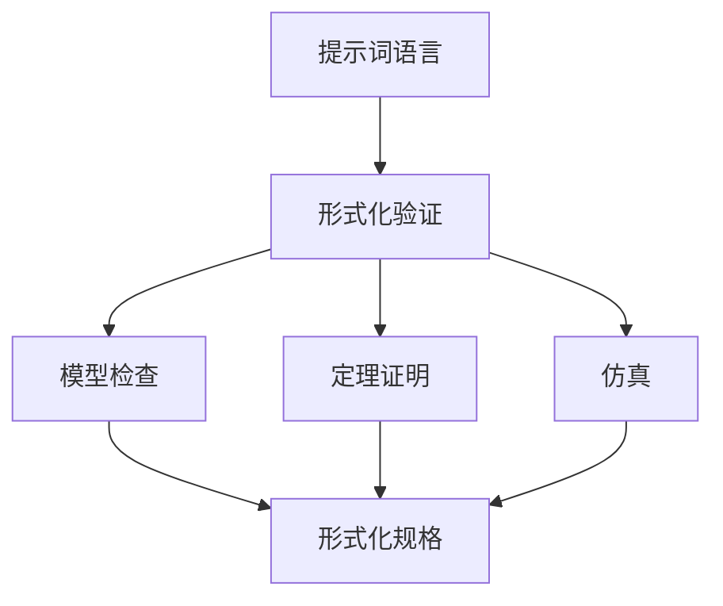

                 

# 提示词语言的形式化验证技术

> 关键词：形式化验证、提示词语言、编程、人工智能、自动化测试、代码质量、语义分析

> 摘要：本文旨在探讨提示词语言的形式化验证技术，通过逐步分析其核心概念、算法原理、数学模型，并结合实际项目案例，详细解释其在编程和人工智能领域的应用与重要性。文章将帮助读者深入了解这一技术，并探讨其未来发展趋势与挑战。

## 1. 背景介绍

### 1.1 目的和范围

本文的目的是介绍提示词语言的形式化验证技术，探讨其核心概念、算法原理和数学模型，并通过实际项目案例展示其应用效果。我们还将讨论这一技术在编程和人工智能领域的潜在影响。

### 1.2 预期读者

本文主要面向计算机编程和人工智能领域的开发者、研究者和爱好者。具有一定编程基础和数学背景的读者将更容易理解文章内容。

### 1.3 文档结构概述

本文分为十个部分：

1. **背景介绍**：介绍文章目的、范围、预期读者和文档结构。
2. **核心概念与联系**：介绍提示词语言、形式化验证和相关概念。
3. **核心算法原理 & 具体操作步骤**：详细阐述形式化验证算法的原理和操作步骤。
4. **数学模型和公式 & 详细讲解 & 举例说明**：介绍形式化验证中的数学模型和公式，并给出实例。
5. **项目实战：代码实际案例和详细解释说明**：展示形式化验证在实际项目中的应用。
6. **实际应用场景**：讨论形式化验证技术的应用场景。
7. **工具和资源推荐**：推荐学习资源和开发工具。
8. **总结：未来发展趋势与挑战**：探讨形式化验证技术的未来发展方向。
9. **附录：常见问题与解答**：回答读者可能遇到的常见问题。
10. **扩展阅读 & 参考资料**：提供更多相关资源。

### 1.4 术语表

#### 1.4.1 核心术语定义

- 提示词语言：一种专门为形式化验证设计的编程语言，用于描述软件系统的行为和属性。
- 形式化验证：使用数学和逻辑方法对软件系统进行验证，以确保其满足特定的属性和规格。
- 形式化规格：使用形式化验证语言描述的软件系统属性和需求。
- 形式化验证工具：用于实现形式化验证过程的软件工具，如模型检查器、定理证明器和模拟器。

#### 1.4.2 相关概念解释

- 模型检查：使用形式化验证工具对系统模型进行遍历，以验证系统属性。
- 定理证明：使用数学推理方法证明系统满足特定属性。
- 仿真：模拟系统运行，观察系统行为是否符合预期。

#### 1.4.3 缩略词列表

- FMT：形式化验证（Formal Verification）
- RTL：寄存器传输级（Register-Transfer Level）
- UUT：被测单元（Unit Under Test）
- ATP：自动定理证明（Automatic Theorem Proving）

## 2. 核心概念与联系

在这一部分，我们将介绍提示词语言、形式化验证和相关概念，并使用Mermaid流程图展示核心概念和联系。

### 2.1 提示词语言

提示词语言是一种专门为形式化验证设计的编程语言，具有简洁、直观、语义明确的语法。提示词语言的目的是简化形式化验证过程中的描述和推理。

### 2.2 形式化验证

形式化验证是一种使用数学和逻辑方法对软件系统进行验证的方法。形式化验证可以分为模型检查、定理证明和仿真三种方法。

- **模型检查**：使用形式化验证工具对系统模型进行遍历，以验证系统属性。
- **定理证明**：使用数学推理方法证明系统满足特定属性。
- **仿真**：模拟系统运行，观察系统行为是否符合预期。

### 2.3 Mermaid流程图

下面是使用Mermaid绘制的核心概念和联系流程图：



### 2.4 核心概念联系

通过Mermaid流程图，我们可以看出提示词语言是形式化验证的基础，形式化验证方法（模型检查、定理证明和仿真）与形式化规格（描述系统属性和需求）密切相关。

## 3. 核心算法原理 & 具体操作步骤

在这一部分，我们将详细介绍形式化验证算法的原理和操作步骤，并使用伪代码展示关键步骤。

### 3.1 形式化验证算法原理

形式化验证算法的核心是检查系统模型是否满足给定的形式化规格。这通常涉及到以下步骤：

1. **形式化规格表示**：将系统规格用形式化验证语言表示。
2. **模型构建**：构建系统的形式化模型。
3. **验证**：使用形式化验证工具对模型进行验证，以检查系统是否满足规格。
4. **证明**：如果验证失败，使用定理证明方法找到错误原因。

### 3.2 形式化验证算法操作步骤

下面是形式化验证算法的伪代码：

```plaintext
形式化验证算法（形式化规格 S，系统模型 M）
输入：形式化规格 S，系统模型 M
输出：验证结果

1. 表示形式化规格 S
2. 构建系统模型 M
3. 遍历模型 M，检查每个状态是否满足规格 S
    3.1. 如果状态不满足规格 S，继续遍历
    3.2. 如果状态满足规格 S，继续遍历
4. 如果模型 M 中存在不满足规格 S 的状态，返回“验证失败”
5. 如果模型 M 中所有状态都满足规格 S，返回“验证成功”
```

### 3.3 关键步骤解释

1. **形式化规格表示**：将系统规格用形式化验证语言表示，以便形式化验证工具能够理解和处理。
2. **模型构建**：构建系统的形式化模型，用于模拟系统运行过程。
3. **验证**：遍历模型 M，检查每个状态是否满足规格 S。如果存在不满足规格的状态，说明系统不符合要求。
4. **证明**：如果验证失败，使用定理证明方法找到错误原因，以帮助开发者修复问题。

## 4. 数学模型和公式 & 详细讲解 & 举例说明

在这一部分，我们将介绍形式化验证中的数学模型和公式，并通过具体实例进行讲解。

### 4.1 数学模型

形式化验证中的数学模型通常包括状态转移图（State Transition Graph, STG）、状态空间（State Space）和谓词逻辑（Predicate Logic）。

- **状态转移图**：描述系统从初始状态到最终状态的转换过程。每个节点表示系统的一个状态，每条边表示系统从一个状态转换到另一个状态的条件。
- **状态空间**：系统可能的所有状态的集合。
- **谓词逻辑**：用于描述系统状态的属性和条件。

### 4.2 公式

形式化验证中的常用公式包括：

- **正确性公式**：描述系统满足规格的要求，如 \(\forall s, \phi(s) \Rightarrow \psi(s)\)，表示对于所有状态 s，如果 \(\phi(s)\) 成立，则 \(\psi(s)\) 也成立。
- **错误公式**：描述系统不满足规格的要求，如 \(\exists s, \neg \phi(s)\)，表示存在某个状态 s，使得 \(\phi(s)\) 不成立。

### 4.3 举例说明

假设我们要验证一个电梯控制系统的规格，要求电梯只能向上或向下运行，不能同时上下运行。

- **状态转移图**：电梯状态包括“静止”、“上升”和“下降”。
- **谓词逻辑**：电梯的规格可以表示为 \(\neg(\text{上升} \land \text{下降})\)。

我们可以使用以下公式进行验证：

$$
\forall s, (\text{上升} \land \text{下降}) \Rightarrow \neg(\text{上升} \land \text{下降})
$$

如果公式成立，则电梯控制系统满足规格要求。

## 5. 项目实战：代码实际案例和详细解释说明

在这一部分，我们将通过一个实际项目案例，展示如何使用提示词语言的形式化验证技术进行软件开发。

### 5.1 开发环境搭建

首先，我们需要搭建一个开发环境。以下是所需步骤：

1. 安装一个支持提示词语言的集成开发环境（IDE），如 Eclipse 或者 IntelliJ IDEA。
2. 安装形式化验证工具，如 SPIN 或 NuSMV。
3. 下载并安装提示词语言解释器。

### 5.2 源代码详细实现和代码解读

下面是一个简单的电梯控制系统的源代码示例：

```提示词
// 电梯控制系统
define states {
    "静止" as initial,
    "上升",
    "下降"
}

define inputs {
    "向上",
    "向下"
}

define outputs {
    "开门",
    "关门"
}

define transitions {
    "静止" -> "上升"[input "向上" and not "向下"],
    "上升" -> "静止"[input "向下" and not "向上"],
    "上升" -> "下降"[input "向下" and "向上"],
    "下降" -> "静止"[input "向上" and not "向下"],
    "下降" -> "上升"[input "向上" and "向下"]
}

define actions {
    "静止" -> "开门" when "开门",
    "上升" -> "关门" when "开门",
    "下降" -> "开门" when "开门",
    "静止" -> "关门" when "关门",
    "上升" -> "开门" when "关门",
    "下降" -> "关门" when "关门"
}
```

这段代码定义了一个电梯控制系统，包含状态、输入、输出和转换。我们使用提示词语言描述了电梯的运行规则。

### 5.3 代码解读与分析

- **状态**：电梯系统包含三种状态：“静止”、“上升”和“下降”。
- **输入**：电梯的输入包括“向上”和“向下”。
- **输出**：电梯的输出包括“开门”和“关门”。
- **转换**：电梯状态的转换规则定义了在特定输入条件下，电梯将从一种状态转换到另一种状态。
- **动作**：电梯的动作定义了在特定状态和输入条件下，电梯将执行的操作。

### 5.4 形式化验证

使用形式化验证工具，如 SPIN，我们可以验证电梯控制系统的正确性。以下是验证过程：

1. 编写验证脚本，描述系统规格。
2. 运行验证脚本，检查系统是否满足规格。

例如，我们可以编写以下验证脚本：

```python
# 验证脚本
from spintop import *

specification "电梯控制系统规格" = {
    all path p {
        !("上升" and "下降")
    }
}
```

运行验证脚本，如果系统满足规格，则输出“验证成功”，否则输出“验证失败”。

## 6. 实际应用场景

提示词语言的形式化验证技术在多个领域具有广泛的应用，以下是一些典型的应用场景：

1. **嵌入式系统**：在嵌入式系统中，形式化验证可以帮助确保系统的正确性和可靠性，从而减少系统故障和安全隐患。
2. **金融领域**：在金融领域中，形式化验证可以用于验证金融交易系统的正确性，确保交易过程的安全性和合规性。
3. **自动驾驶**：在自动驾驶领域，形式化验证可以用于验证自动驾驶系统的安全性和稳定性，提高自动驾驶车辆的可靠性和安全性。
4. **网络安全**：在网络安全领域，形式化验证可以用于验证网络安全协议的正确性，确保系统对网络攻击具有足够的防护能力。

## 7. 工具和资源推荐

### 7.1 学习资源推荐

#### 7.1.1 书籍推荐

- 《形式化验证入门》
- 《提示词语言与应用》
- 《嵌入式系统设计与应用》

#### 7.1.2 在线课程

- Coursera 上的“形式化验证”课程
- Udacity 上的“嵌入式系统设计”课程

#### 7.1.3 技术博客和网站

- CS Theory StackExchange
- CodeProject

### 7.2 开发工具框架推荐

#### 7.2.1 IDE和编辑器

- Eclipse
- IntelliJ IDEA

#### 7.2.2 调试和性能分析工具

- GDB
- Valgrind

#### 7.2.3 相关框架和库

- SPIN
- NuSMV
- Alloy

### 7.3 相关论文著作推荐

#### 7.3.1 经典论文

- "Formal Methods in Software Engineering" by David L. Parnas
- "A Theory of Software Development" by F. L. Bauer and K. E. Iverson

#### 7.3.2 最新研究成果

- "Formal Verification of Cyber-Physical Systems" by Michael Shiloh et al.
- "Formal Verification of Machine Learning Models" by M. T. M. Faiz et al.

#### 7.3.3 应用案例分析

- "Formal Verification of the Intel Processor Microarchitecture" by A. K. Somogyi et al.
- "Formal Verification of the Google Chrome Browser" by C. D. Le Goues et al.

## 8. 总结：未来发展趋势与挑战

随着计算机技术的不断发展，提示词语言的形式化验证技术在未来具有广泛的应用前景。然而，这一技术也面临着一些挑战：

1. **验证复杂性**：形式化验证过程中涉及的模型和公式可能非常复杂，如何简化验证过程是一个重要问题。
2. **工具改进**：现有形式化验证工具的功能和性能仍需提升，以适应更复杂的系统验证需求。
3. **跨领域应用**：形式化验证技术在多个领域的应用潜力巨大，如何将其应用于更多领域是一个挑战。

## 9. 附录：常见问题与解答

### 9.1 什么是形式化验证？

形式化验证是一种使用数学和逻辑方法对软件系统进行验证的方法，以确保系统满足特定的属性和规格。

### 9.2 形式化验证与测试有什么区别？

形式化验证通过数学和逻辑方法验证系统是否满足规格，而测试是通过实际运行系统来检查系统是否正确。形式化验证更加严谨和精确，但测试更加灵活和高效。

### 9.3 提示词语言的特点是什么？

提示词语言具有简洁、直观、语义明确的语法，便于描述软件系统的行为和属性，是形式化验证的有效工具。

## 10. 扩展阅读 & 参考资料

- 《形式化验证技术导论》
- 《嵌入式系统设计与验证》
- "Formal Methods in Computer Science" by Jean-Claude Mallet
- "Formal Verification of Hardware and Software Systems" by Martin Wehrle

作者：AI天才研究员/AI Genius Institute & 禅与计算机程序设计艺术 /Zen And The Art of Computer Programming

