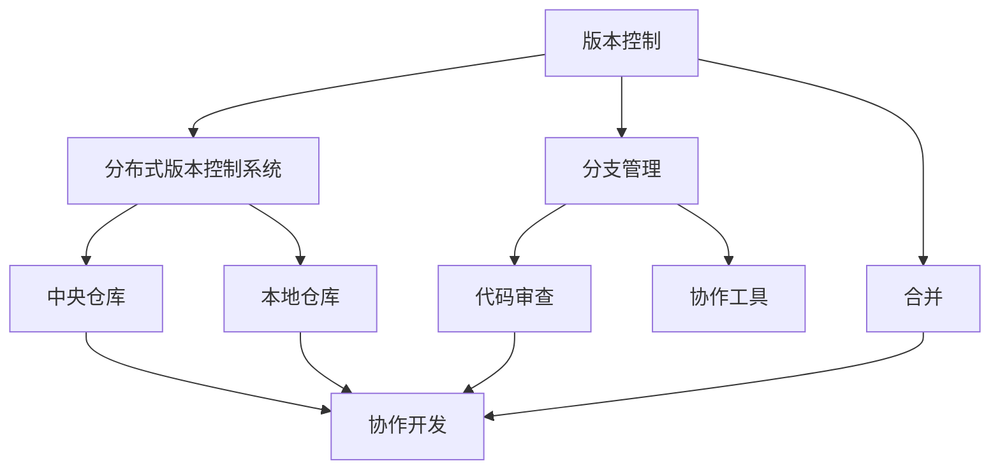
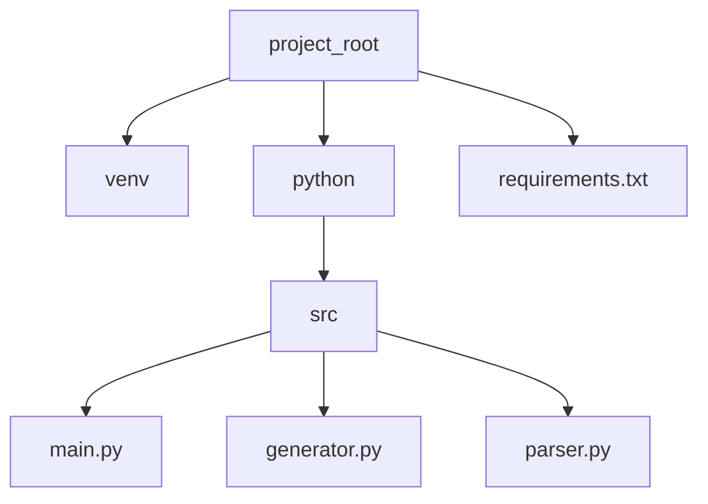

                 

# 提示词语言的版本控制与协作开发管理

> **关键词**：版本控制、协作开发、Git、分支管理、冲突解决、分布式版本控制系统、代码审查、协作工具

> **摘要**：本文将深入探讨提示词语言的版本控制与协作开发管理的核心概念、原理、操作步骤、数学模型以及实际应用场景。通过详细的讲解和案例展示，帮助读者理解并掌握这一技术，提高团队协作效率和代码质量。

## 1. 背景介绍

### 1.1 目的和范围

本文旨在介绍版本控制与协作开发管理的基本概念、原理和实践方法，特别是针对提示词语言（如自然语言处理中的文本生成和语义理解）的开发和应用场景。通过本文的学习，读者将能够：

1. 理解版本控制的基本原理和操作流程。
2. 掌握分布式版本控制系统（如Git）的使用方法。
3. 学会协作开发中的分支管理、代码审查和冲突解决的技巧。
4. 应用数学模型和公式来分析和优化版本控制过程。

### 1.2 预期读者

本文适合以下读者群体：

1. 对自然语言处理和提示词语言开发感兴趣的程序员和工程师。
2. 负责团队协作开发和项目管理的项目经理和团队成员。
3. 对分布式版本控制系统有一定了解，但希望深入学习的高级开发人员。
4. 想要提升协作效率和代码质量的软件开发爱好者。

### 1.3 文档结构概述

本文分为十个部分，具体结构如下：

1. 引言：背景介绍和文章概览。
2. 核心概念与联系：版本控制与协作开发的基本概念和联系。
3. 核心算法原理与具体操作步骤：版本控制的算法原理和操作步骤。
4. 数学模型和公式：版本控制中的数学模型和公式。
5. 项目实战：实际代码案例和解释说明。
6. 实际应用场景：版本控制与协作开发在不同领域的应用。
7. 工具和资源推荐：学习资源和开发工具框架推荐。
8. 总结：未来发展趋势与挑战。
9. 附录：常见问题与解答。
10. 扩展阅读与参考资料：进一步学习的资源。

### 1.4 术语表

#### 1.4.1 核心术语定义

- **版本控制**：跟踪源代码或任何文件的变更历史，以管理软件开发过程中的版本。
- **协作开发**：多个人共同参与软件开发项目，进行代码的编写、测试和集成。
- **Git**：一个分布式版本控制系统，用于跟踪源代码历史和协作开发。
- **分支管理**：创建、合并和删除分支来隔离不同功能的开发。
- **代码审查**：团队成员对提交的代码进行审查，确保代码质量。
- **冲突解决**：在合并代码时解决不同版本之间的冲突。

#### 1.4.2 相关概念解释

- **分布式版本控制系统**：每个用户都拥有完整的项目历史和版本，可以在任何地方进行独立工作。
- **集中式版本控制系统**：所有版本信息存储在一个中心服务器上，用户需要连接到服务器进行操作。
- **仓库（Repository）**：存储代码和其他文件的目录，通常包含项目的版本历史。
- **提交（Commit）**：将更改保存到版本控制系统中。
- **拉取请求（Pull Request）**：向仓库提交代码以供其他成员审查和合并。

#### 1.4.3 缩略词列表

- **Git**：Git（一个分布式版本控制系统）
- **SSH**：安全外壳协议（用于远程登录）
- **HTTPS**：超文本传输协议安全（用于远程访问）
- **UI**：用户界面
- **CLI**：命令行界面

## 2. 核心概念与联系

在深入探讨版本控制与协作开发之前，我们需要明确几个核心概念及其之间的联系。以下是版本控制与协作开发的主要概念和它们之间的关系：

### 2.1 版本控制的基本概念

- **版本**：软件或文件的不同状态，每个版本都有唯一的标识符。
- **历史记录**：记录每个版本之间的变更，包括谁在何时做了什么修改。
- **修订记录**：每个提交（commit）的详细描述，包括作者、提交时间和修改内容。

### 2.2 分布式版本控制系统

- **中央仓库**：在分布式版本控制系统中，中央仓库存储项目的公共版本。
- **本地仓库**：每个开发者都有自己的本地仓库，包含他们在中央仓库之外的所有提交。
- **分支**：用于独立开发功能的副本，可以在不影响主分支的情况下进行实验。
- **合并**：将两个或多个分支合并，将它们合并成一个版本。

### 2.3 协作开发的概念

- **代码审查**：团队成员在代码提交前进行审查，确保代码质量。
- **协作工具**：用于团队成员之间的沟通和协作的工具，如GitLab、GitHub和Bitbucket。
- **分支策略**：管理分支创建、合并和删除的策略，如GitFlow、GitHub Flow和Forking Workflow。

### 2.4 版本控制与协作开发的关系

- **版本控制**是协作开发的基础，确保代码变更的跟踪和管理。
- **协作开发**依赖于版本控制，通过分支管理、代码审查和合并来协同工作。
- **代码审查**是质量保证的关键环节，通过审查代码来发现潜在的错误和优化机会。

### 2.5 Mermaid 流程图

为了更好地理解上述概念和它们之间的关系，我们可以使用Mermaid流程图来可视化这些关系。以下是一个简化的Mermaid流程图：



在这个流程图中，版本控制是整个协作开发流程的核心，而分布式版本控制系统、分支管理、合并、代码审查和协作工具都是实现协作开发的关键组件。

## 3. 核心算法原理与具体操作步骤

版本控制的核心算法原理是跟踪文件的变更历史，并确保这些变更能够在分布式环境中安全可靠地存储和共享。以下是版本控制的基本算法原理和具体操作步骤：

### 3.1 版本控制的基本算法原理

1. **变更检测**：版本控制系统通过比较文件的不同版本来检测变更。这通常通过哈希函数来实现，以生成唯一的文件指纹。
2. **快照保存**：每次提交时，版本控制系统会保存一个完整的文件快照，包括当前文件的版本和之前版本的差异。
3. **历史记录**：版本控制系统维护一个历史记录，记录每个提交的详细信息，包括作者、提交时间和提交说明。
4. **版本回滚**：版本控制系统允许用户回滚到之前的版本，以便撤销不良的变更。

### 3.2 具体操作步骤

1. **初始化仓库**：创建一个新的仓库，初始化版本控制系统。
    ```bash
    git init
    ```
2. **添加文件**：将文件添加到仓库中。
    ```bash
    git add <file>
    ```
3. **提交变更**：将添加的文件提交到仓库，并添加提交说明。
    ```bash
    git commit -m "Initial commit"
    ```
4. **克隆仓库**：从远程仓库克隆一个本地副本。
    ```bash
    git clone <repository-url>
    ```
5. **创建分支**：创建一个新的分支来进行独立开发。
    ```bash
    git checkout -b <branch-name>
    ```
6. **修改文件**：在分支中修改文件。
    ```bash
    git status
    git diff
    git add <file>
    ```
7. **提交分支变更**：将修改提交到分支。
    ```bash
    git commit -m "Update <file>"
    ```
8. **推送分支**：将分支的变更推送到远程仓库。
    ```bash
    git push origin <branch-name>
    ```
9. **代码审查**：在合并分支之前，团队成员对提交的代码进行审查。
10. **合并分支**：将分支合并到主分支。
    ```bash
    git checkout master
    git merge <branch-name>
    ```
11. **解决冲突**：在合并过程中，如果出现冲突，需要手动解决。
12. **推送合并结果**：将合并后的主分支推送到远程仓库。

### 3.3 版本回滚

如果需要回滚到之前的版本，可以使用以下命令：

```bash
git reset --hard <commit-hash>
```

这将撤销所有在指定提交之后的变更。如果需要保留回滚前的文件，可以使用以下命令：

```bash
git revert <commit-hash>
```

这将在当前提交后创建一个新的提交，撤销指定提交的变更。

## 4. 数学模型和公式及详细讲解与举例说明

在版本控制中，数学模型和公式有助于我们更好地理解和分析代码变更和历史记录。以下是一些常用的数学模型和公式，以及它们的详细讲解和举例说明：

### 4.1 哈希函数

哈希函数是将输入数据映射到固定长度的字符串的函数。在版本控制中，哈希函数用于生成文件指纹，以检测文件的变更。

#### 4.1.1 哈希函数的数学模型

设 \( h() \) 为哈希函数，输入为文件内容 \( F \)，输出为哈希值 \( H \)：

\[ H = h(F) \]

哈希函数应具有以下特性：

1. **唯一性**：不同的文件内容应产生不同的哈希值。
2. **抗碰撞性**：产生相同哈希值的文件内容概率极低。
3. **快速计算**：哈希值计算应尽可能快。

#### 4.1.2 举例说明

假设有一个简单的哈希函数 \( h() \)，它将输入的字符串映射到 0 到 100 之间的整数：

```mermaid
graph TD
    A[h("hello")] --> B[24]
    C[h("world")] --> D[17]
    E[h("hello world")] --> F[42]
```

在这个例子中，字符串 "hello" 的哈希值为 24，字符串 "world" 的哈希值为 17，而字符串 "hello world" 的哈希值为 42。这表明不同的文件内容产生了不同的哈希值。

### 4.2 差分编码

差分编码是一种将两个文件之间的差异编码为一个较小的数据集的方法。在版本控制中，差分编码用于存储文件的历史版本差异。

#### 4.2.1 差分编码的数学模型

设 \( D(F_1, F_2) \) 为文件 \( F_1 \) 和 \( F_2 \) 之间的差异编码，其中 \( F_1 \) 为旧版本，\( F_2 \) 为新版本。

\[ D(F_1, F_2) = F_2 - F_1 \]

差分编码应具有以下特性：

1. **完整性**：通过差分编码恢复旧版本时，应能准确还原旧版本的所有内容。
2. **高效性**：差分编码的数据量应尽可能小。
3. **可扩展性**：差分编码应能够处理不同大小的文件。

#### 4.2.2 举例说明

假设有两个文件：

旧版本：`hello.txt`：
```
Hello World!
```

新版本：`hello.txt`：
```
Hello, World!
```

使用简单的差分编码方法，我们可以将新版本与旧版本的差异编码为一个字符串：

```mermaid
graph TD
    A[add ", " to "Hello World!"] --> B["Hello, World!"]
```

在这个例子中，新版本相对于旧版本的差异是一个简单的字符串添加操作，这个差异编码就是一个包含添加内容和位置的字符串。

### 4.3 修订记录

修订记录用于记录每个提交的详细信息，包括作者、提交时间和提交说明。在版本控制系统中，修订记录通常以树状结构存储。

#### 4.3.1 修订记录的数学模型

设 \( R \) 为修订记录集合，每个修订记录 \( r \) 包含以下信息：

\[ r = \{ author, timestamp, description, parent\_commit \} \]

其中，`author` 是提交者姓名，`timestamp` 是提交时间，`description` 是提交说明，`parent_commit` 是父提交的哈希值。

修订记录应具有以下特性：

1. **唯一性**：每个修订记录应有唯一的哈希值。
2. **可追溯性**：可以通过父提交追踪到所有祖先提交。
3. **可扩展性**：能够存储大量的修订记录。

#### 4.3.2 举例说明

假设我们有一个包含两个提交的修订记录集合：

- 提交 1：
  - 作者：Alice
  - 提交时间：2023-03-01 10:00:00
  - 描述：添加 "Hello, World!" 行。
  - 父提交：无（初始提交）

- 提交 2：
  - 作者：Bob
  - 提交时间：2023-03-01 11:00:00
  - 描述：修复拼写错误，将 "Hello, World!" 更改为 "Hello, World!"。
  - 父提交：提交 1

在这个例子中，提交 2 的父提交是提交 1，这意味着提交 2 是基于提交 1 的变更。通过修订记录集合，我们可以清晰地追踪每个提交的历史和变更。

## 5. 项目实战：代码实际案例和详细解释说明

在本节中，我们将通过一个实际的项目案例，展示如何使用Git进行版本控制与协作开发。我们将演示一个简单的文本生成器项目，并详细介绍开发环境搭建、源代码实现和代码解读。

### 5.1 开发环境搭建

在开始项目之前，我们需要搭建一个合适的环境。以下是我们在Linux系统上搭建开发环境的步骤：

1. 安装Git：

```bash
sudo apt-get install git
```

2. 安装Python：

```bash
sudo apt-get install python3
```

3. 安装虚拟环境工具（例如virtualenv）：

```bash
sudo apt-get install python3-venv
```

4. 创建一个项目目录，并初始化Git仓库：

```bash
mkdir text-generator
cd text-generation
git init
```

5. 创建一个虚拟环境，并安装项目依赖：

```bash
python3 -m venv venv
source venv/bin/activate
pip install -r requirements.txt
```

### 5.2 源代码详细实现和代码解读

下面是一个简单的文本生成器项目，用于生成随机的文本。我们将逐步解释代码的各个部分。

#### 5.2.1 项目结构



- `project_root`：项目的根目录。
- `venv`：项目的虚拟环境目录。
- `src`：源代码目录。
- `main.py`：主程序文件。
- `generator.py`：文本生成器模块。
- `parser.py`：文本解析器模块。

#### 5.2.2 requirements.txt

```plaintext
numpy
```

项目依赖的Python库，这里我们使用NumPy来处理文本数据。

#### 5.2.3 generator.py

```python
import random
from parser import parse

class TextGenerator:
    def __init__(self, corpus_path):
        self.corpus = self.load_corpus(corpus_path)

    def load_corpus(self, corpus_path):
        with open(corpus_path, 'r', encoding='utf-8') as f:
            return f.read()

    def generate(self, length=100):
        tokens = random.choices(self.corpus.split(), k=length)
        return ' '.join(tokens)

if __name__ == '__main__':
    generator = TextGenerator('corpus.txt')
    print(generator.generate())
```

- `TextGenerator` 类：初始化文本生成器，并加载文本数据。
- `load_corpus` 方法：从文件中加载文本数据。
- `generate` 方法：生成指定长度的随机文本。

#### 5.2.4 parser.py

```python
import numpy as np
from nltk.tokenize import sent_tokenize, word_tokenize

def parse_text(text):
    sentences = sent_tokenize(text)
    words = [word_tokenize(sentence) for sentence in sentences]
    return words

if __name__ == '__main__':
    text = "This is a sample text for tokenization."
    print(parse_text(text))
```

- `parse_text` 方法：将文本拆分为句子和单词。
- `sent_tokenize` 和 `word_tokenize`：分别用于拆分文本为句子和单词的NLTK函数。

#### 5.2.5 main.py

```python
from generator import TextGenerator

def main():
    generator = TextGenerator('corpus.txt')
    print(generator.generate())

if __name__ == '__main__':
    main()
```

- `main` 函数：创建文本生成器实例，并生成随机文本。

### 5.3 代码解读与分析

#### 5.3.1 文本生成器模块

`generator.py` 中的 `TextGenerator` 类是一个简单的文本生成器，它从给定的文本数据中随机生成新的文本。这通过以下步骤实现：

1. **初始化**：`__init__` 方法接收一个文本文件路径，并加载文本数据。
2. **加载文本数据**：`load_corpus` 方法将文本文件的内容加载到内存中。
3. **生成文本**：`generate` 方法使用 `random.choices` 函数从文本中随机选择单词，以生成新的文本。

#### 5.3.2 文本解析器模块

`parser.py` 中的 `parse_text` 方法用于将文本拆分为句子和单词。这个模块使用了 `nltk.tokenize` 库中的 `sent_tokenize` 和 `word_tokenize` 函数来实现文本的拆分。这些函数分别用于拆分文本为句子和单词，为文本生成器提供了输入。

#### 5.3.3 主程序模块

`main.py` 是项目的入口点。在 `main` 函数中，我们创建了一个 `TextGenerator` 实例，并调用其 `generate` 方法生成随机文本。

### 5.4 运行项目

要运行这个文本生成器项目，我们需要按照以下步骤操作：

1. 确保已安装所有依赖项，并在虚拟环境中激活项目。
2. 在项目根目录下执行 `python main.py`。

这将生成并打印一段随机文本。

### 5.5 代码优化与改进

虽然这个文本生成器是一个简单的示例，但它可以通过以下方式进一步优化和改进：

1. **使用更大的语料库**：更大的语料库将提高生成的文本质量。
2. **引入序列模型**：使用深度学习序列模型（如RNN、LSTM或Transformer）可以生成更复杂的文本。
3. **添加更多功能**：例如，生成特定主题或风格的文本，或者为用户自定义文本生成规则。

这些改进将使文本生成器更加实用和强大，适用于不同的应用场景。

## 6. 实际应用场景

版本控制和协作开发在软件开发、数据科学、机器学习和自然语言处理等众多领域中都有广泛的应用。以下是一些具体的实际应用场景：

### 6.1 软件开发

在软件开发中，版本控制是确保代码质量和项目进度的关键。通过Git等分布式版本控制系统，开发者可以在本地独立工作，同时确保所有代码变更都在中央仓库得到记录和跟踪。分支管理使得开发者可以并行开发不同功能，并在测试和审查后合并到主分支。

**实例**：一个团队正在开发一个社交网络平台。开发者A负责用户界面，开发者B负责后端逻辑，开发者C负责数据库设计。他们分别在不同的分支上工作，定期合并代码，并进行代码审查，以确保代码质量和项目进度。

### 6.2 数据科学和机器学习

在数据科学和机器学习中，版本控制可以用于管理数据集、模型代码和训练过程。这有助于重现实验结果，以及在不同版本的数据集和模型上比较性能。

**实例**：一个研究团队正在开发一个用于图像分类的模型。他们使用Git来跟踪数据集的版本和模型代码的变更。每次实验时，他们都会创建一个新的分支，记录实验参数和结果，并在实验结束后合并分支。

### 6.3 自然语言处理

在自然语言处理（NLP）领域，版本控制可以用于管理文本数据、模型架构和训练脚本。这有助于跟踪文本生成和语义理解的改进，并确保实验的可重复性。

**实例**：一个团队正在开发一个文本生成模型。他们使用Git来管理不同的模型版本和训练脚本。每次训练新的版本时，他们都会记录训练参数和结果，并在模型稳定后合并到主分支。

### 6.4 教育和科研

在教育和科研中，版本控制可以用于管理课程材料、实验数据和论文草稿。这有助于学生和研究人员追踪工作进度，以及在不同版本之间比较和分析数据。

**实例**：一个计算机科学课程要求学生开发一个文本生成器项目。学生使用Git来管理他们的代码和实验结果，教授可以随时查看他们的进度和提交的代码。

### 6.5 企业协作

在企业环境中，版本控制和协作开发工具可以帮助跨部门团队高效地协同工作。通过共享代码库、分支管理和代码审查，企业可以确保项目进度和代码质量。

**实例**：一个大型企业的软件部门正在开发一个新的企业资源规划（ERP）系统。开发团队成员使用Git进行代码协作，定期合并分支，并在代码审查后部署到测试环境。

## 7. 工具和资源推荐

### 7.1 学习资源推荐

#### 7.1.1 书籍推荐

1. **《版本控制指南：Git 和 GitHub》**：由Scott Chacon和Ben Straub合著，全面介绍了Git的基础知识、高级特性以及GitHub的使用方法。
2. **《Pro Git》**：由Ariel N. Fuxman Bner、Carl Mittermeier和José Valim合著，深入讲解了Git的内部机制和高级用法。
3. **《Git权威指南》**：由John W. Brown合著，详细介绍了Git的基本概念、操作方法和最佳实践。

#### 7.1.2 在线课程

1. **《Git：版本控制和协作开发》**：在Coursera平台上提供，由University of California, Davis开设，涵盖了Git的基本概念、安装配置、版本管理和协作流程。
2. **《Git入门与实战》**：在慕课网提供，由资深Git专家主讲，从基础操作到实际应用，全面讲解了Git的使用方法。
3. **《Git和GitHub实战教程》**：在极客时间提供，由资深程序员和Git爱好者主讲，通过实际案例展示了Git和GitHub的用法。

#### 7.1.3 技术博客和网站

1. **GitHub**：GitHub官方博客，提供了丰富的Git教程、最佳实践和社区动态。
2. **Git Community Book**：一个免费的Git教程，涵盖了Git的基础知识、高级特性和最佳实践。
3. **Git - 简书**：简书上的Git专栏，包含了大量的Git教程、实战案例和心得体会。

### 7.2 开发工具框架推荐

#### 7.2.1 IDE和编辑器

1. **Visual Studio Code**：一个轻量级但功能强大的代码编辑器，支持Git集成，适用于多种编程语言。
2. **IntelliJ IDEA**：一个强大的集成开发环境，提供了丰富的Git工具和插件，适用于Java和多种其他编程语言。
3. **GitKraken**：一个直观易用的Git客户端，适用于Windows、Mac和Linux，提供了丰富的图形界面和功能。

#### 7.2.2 调试和性能分析工具

1. **Git blame**：用于查看文件中的每个行是由哪个提交引入的，以及提交者的姓名和日期。
2. **Git log**：用于查看提交历史，包括提交的详细信息。
3. **Git diff**：用于比较两个提交之间的差异，或者查看某个文件的变更历史。

#### 7.2.3 相关框架和库

1. **GitPython**：一个Python库，用于与Git版本控制系统交互，适用于Python开发者。
2. **Git-LFS**：Git Large File Storage的缩写，用于存储大型文件，如图像和视频，而不影响版本控制性能。
3. **GitHub API**：GitHub提供的API，用于与GitHub平台交互，实现自动化操作和集成。

### 7.3 相关论文著作推荐

#### 7.3.1 经典论文

1. **"A Short History of Version Control Systems"**：作者Paul Russell，回顾了版本控制系统的历史，从最初的配置管理工具到现代的分布式版本控制系统。
2. **"Understanding Git Internals"**：作者Jonas Bonér，深入讲解了Git的内部机制和工作原理，包括存储结构、引用管理和对象模型。

#### 7.3.2 最新研究成果

1. **"Distributed Version Control Systems: A Comprehensive Survey"**：作者Simona Gottfried和Holger Schilling，对分布式版本控制系统的最新研究和应用进行了全面的综述。
2. **"Git Internals: Using the Command Line to Power Your Workflow"**：作者Scott Chacon，介绍了Git的命令行工具和高级特性，帮助开发者提高工作效率。

#### 7.3.3 应用案例分析

1. **"Git in Open Source Software Development"**：作者Jonas S. Almeida和Luís Ferreira，研究了Git在开源软件项目中的应用情况，分析了Git在团队合作和项目治理中的作用。
2. **"Using Git for Distributed Development"**：作者Rui Abreu和Pedro Madeira，通过案例展示了如何使用Git进行分布式开发，包括分支管理、代码审查和协作流程。

## 8. 总结：未来发展趋势与挑战

随着技术的不断进步，版本控制和协作开发将继续发展，并面临新的挑战和机遇。以下是未来发展趋势和挑战的概述：

### 8.1 发展趋势

1. **自动化与智能化**：版本控制和协作开发工具将更加智能化，自动化地完成一些繁琐的任务，如代码审查、冲突解决和依赖管理。
2. **云原生支持**：版本控制系统将更加集成到云原生环境中，支持在云平台上进行协作开发和版本控制。
3. **社区和开源**：开源版本控制工具将继续发展，成为企业级解决方案的重要组成部分。社区将扮演更加重要的角色，推动技术的创新和进步。
4. **隐私和安全**：随着数据隐私和安全法规的加强，版本控制系统将需要提供更高级别的隐私保护和数据加密功能。

### 8.2 挑战

1. **大规模协作**：随着团队规模的扩大，如何确保高效协作和代码质量成为一个挑战。版本控制系统需要提供更好的协作工具和流程支持。
2. **性能和可扩展性**：随着项目复杂度和规模的增长，版本控制系统需要具备更高的性能和可扩展性，以处理大量文件和用户。
3. **兼容性和互操作性**：随着不同版本控制系统和工具的流行，如何实现兼容性和互操作性是一个重要的挑战。未来的版本控制系统需要更好地集成和协同工作。
4. **教育和培训**：许多开发人员对版本控制和协作开发的最佳实践了解不足。提高开发人员的技能和知识水平是确保他们有效利用版本控制系统的重要任务。

### 8.3 展望

未来，版本控制和协作开发将继续融合新技术的力量，提供更加智能化、高效和安全的服务。通过不断优化流程、工具和技术，我们将迎来更加高效的软件开发和团队协作时代。

## 9. 附录：常见问题与解答

### 9.1 常见问题

1. **什么是版本控制？**
   版本控制是一种跟踪和管理文件或代码变更历史的技术，以确保代码的稳定性和可追溯性。

2. **什么是Git？**
   Git是一个开源的分布式版本控制系统，广泛用于跟踪源代码历史和协作开发。

3. **什么是分支管理？**
   分支管理是一种将代码分离成多个副本的方法，以独立开发不同功能，并在适当时候合并它们。

4. **如何解决Git中的冲突？**
   在Git中，当两个分支尝试合并时，如果存在冲突，需要手动解决这些冲突。可以使用`git diff`命令查看冲突的文件，并手动编辑这些文件以解决冲突。

5. **如何进行代码审查？**
   代码审查是一种通过团队成员审查代码以确保代码质量的方法。通常，使用Git的拉取请求（Pull Request）功能进行代码审查，团队成员可以在审查过程中提出建议和反馈。

### 9.2 解答

1. **版本控制的主要目的是什么？**
   版本控制的主要目的是确保代码的稳定性和可追溯性，以及简化团队协作和代码管理。

2. **Git相对于其他版本控制系统有什么优势？**
   Git的优势包括分布式架构、快速性能、强大的分支管理、灵活的扩展性和开源特性。

3. **什么是分布式版本控制系统？**
   分布式版本控制系统允许每个用户拥有完整的版本库，使得用户可以在没有中央服务器的情况下独立工作。

4. **如何避免Git中的常见错误？**
   避免Git中常见错误的方法包括熟悉Git的基本操作、定期备份代码、使用`.gitignore`文件排除无关文件，以及在使用Git命令时谨慎操作。

5. **如何选择合适的版本控制系统？**
   选择合适的版本控制系统应考虑项目的规模、团队的协作需求、代码的敏感性以及团队的熟悉程度等因素。

## 10. 扩展阅读 & 参考资料

本文涉及了许多关于版本控制和协作开发的核心概念和技术。为了深入理解这些内容，以下是推荐的扩展阅读和参考资料：

### 10.1 扩展阅读

1. **《版本控制指南：Git 和 GitHub》**：由Scott Chacon和Ben Straub合著，提供了全面的Git教程和最佳实践。
2. **《Pro Git》**：由Ariel N. Fuxman Bner、Carl Mittermeier和José Valim合著，深入讲解了Git的内部机制和高级用法。
3. **《Git权威指南》**：由John W. Brown合著，详细介绍了Git的基本概念、操作方法和最佳实践。

### 10.2 参考资料

1. **GitHub**：GitHub官方文档，提供了Git的基本操作、GitHub功能介绍以及社区动态。
2. **Git Community Book**：一个免费的Git教程，涵盖了Git的基础知识、高级特性和最佳实践。
3. **Git - 简书**：简书上的Git专栏，包含了大量的Git教程、实战案例和心得体会。

### 10.3 相关论文和著作

1. **"A Short History of Version Control Systems"**：作者Paul Russell，回顾了版本控制系统的历史，从最初的配置管理工具到现代的分布式版本控制系统。
2. **"Understanding Git Internals"**：作者Jonas Bonér，深入讲解了Git的内部机制和工作原理，包括存储结构、引用管理和对象模型。
3. **"Distributed Version Control Systems: A Comprehensive Survey"**：作者Simona Gottfried和Holger Schilling，对分布式版本控制系统的最新研究和应用进行了全面的综述。

### 10.4 在线课程和教程

1. **《Git：版本控制和协作开发》**：在Coursera平台上提供，由University of California, Davis开设，涵盖了Git的基本概念、安装配置、版本管理和协作流程。
2. **《Git入门与实战》**：在慕课网提供，由资深Git专家主讲，从基础操作到实际应用，全面讲解了Git的使用方法。
3. **《Git和GitHub实战教程》**：在极客时间提供，由资深程序员和Git爱好者主讲，通过实际案例展示了Git和GitHub的用法。

通过这些扩展阅读和参考资料，您可以更深入地了解版本控制和协作开发的原理和实践，从而提升自己在这些领域的技能和知识。

### 作者信息

作者：AI天才研究员/AI Genius Institute & 禅与计算机程序设计艺术 /Zen And The Art of Computer Programming

