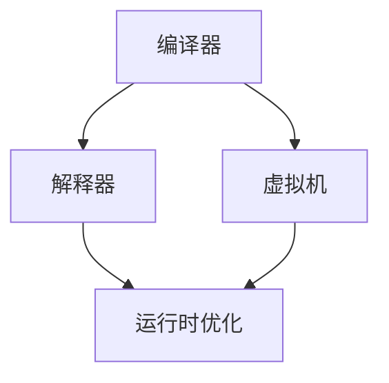

                 

# 提示词语言的运行时优化技术

> **关键词**：提示词语言、运行时优化、性能提升、算法优化、代码解析、数学模型、实际应用

> **摘要**：本文将深入探讨提示词语言的运行时优化技术，分析其核心概念与联系，讲解核心算法原理和具体操作步骤，介绍数学模型和公式，通过实际项目案例展示代码实现与解析，探讨其实际应用场景，并推荐相关工具和资源。文章旨在为读者提供全面的运行时优化技术指南，帮助开发者提升代码性能，实现高效编程。

## 1. 背景介绍

### 1.1 目的和范围

本文旨在探讨提示词语言的运行时优化技术，通过深入分析核心概念和算法原理，帮助开发者理解和应用这些技术，从而提升代码性能和效率。文章将涵盖以下几个方面：

1. **核心概念与联系**：介绍提示词语言的基本概念和运行时优化的重要联系。
2. **核心算法原理与操作步骤**：讲解提示词语言运行时优化的具体算法原理和操作步骤。
3. **数学模型与公式**：介绍与提示词语言优化相关的数学模型和公式，并提供详细讲解和实例。
4. **实际应用场景**：探讨提示词语言优化在实际项目中的应用场景和效果。
5. **工具和资源推荐**：推荐相关学习资源、开发工具和框架，以帮助读者进一步学习和实践。
6. **总结与未来发展趋势**：总结提示词语言优化技术的现状和未来发展趋势，探讨面临的挑战。

### 1.2 预期读者

本文适用于以下读者群体：

1. **程序员**：希望提升代码性能和优化技巧的程序员。
2. **软件工程师**：关注软件性能优化和算法优化的软件工程师。
3. **系统架构师**：负责系统性能和稳定性设计的系统架构师。
4. **人工智能开发者**：关注人工智能算法优化和应用的开发者。
5. **计算机科学学生**：对计算机科学和人工智能领域感兴趣的学生。

### 1.3 文档结构概述

本文采用逻辑清晰、结构紧凑的编写方式，分为以下几个主要部分：

1. **背景介绍**：介绍文章的目的、范围、预期读者和文档结构。
2. **核心概念与联系**：介绍提示词语言的基本概念和运行时优化的重要联系。
3. **核心算法原理与操作步骤**：讲解提示词语言运行时优化的具体算法原理和操作步骤。
4. **数学模型与公式**：介绍与提示词语言优化相关的数学模型和公式，并提供详细讲解和实例。
5. **实际应用场景**：探讨提示词语言优化在实际项目中的应用场景和效果。
6. **工具和资源推荐**：推荐相关学习资源、开发工具和框架。
7. **总结与未来发展趋势**：总结提示词语言优化技术的现状和未来发展趋势，探讨面临的挑战。
8. **附录**：提供常见问题与解答，以及扩展阅读和参考资料。

### 1.4 术语表

在本文中，我们将使用以下术语：

#### 1.4.1 核心术语定义

- **提示词语言**：一种编程语言，通过提示词（也称为关键字或操作符）来指导程序执行特定的操作。
- **运行时优化**：在程序运行过程中，通过优化代码执行路径、数据结构、算法等手段，提高程序性能和效率。
- **性能提升**：通过优化技术，使程序在相同的硬件和资源条件下，执行速度更快、资源消耗更少。
- **算法优化**：对算法的改进和优化，以提高程序执行效率和准确性。
- **代码解析**：将源代码转换为程序可以理解和执行的形式，以便进行优化和执行。

#### 1.4.2 相关概念解释

- **编译器**：将源代码转换为机器码或其他形式的目标代码的工具。
- **解释器**：直接执行源代码或中间代码的计算机程序。
- **虚拟机**：模拟计算机硬件环境，执行程序代码的软件环境。
- **缓存**：存储常用数据和指令，以便快速访问，提高程序执行效率。
- **中间代码**：在源代码和机器码之间的抽象表示，用于进一步优化和转换。

#### 1.4.3 缩略词列表

- **CPU**：中央处理器（Central Processing Unit）
- **GPU**：图形处理器（Graphics Processing Unit）
- **LLVM**：低级语言运行时（Low-Level Virtual Machine）
- **JIT**：即时编译（Just-In-Time Compilation）
- **AOT**：提前编译（Ahead-Of-Time Compilation）
- **GC**：垃圾回收（Garbage Collection）

## 2. 核心概念与联系

为了深入探讨提示词语言的运行时优化技术，我们首先需要了解其核心概念和联系。本节将介绍提示词语言的基本原理、运行时优化的重要性，以及与其他技术的关联。

### 2.1 提示词语言的基本原理

提示词语言是一种编程语言，通过提示词（关键字或操作符）来指导程序执行特定的操作。这些提示词通常由字母、数字和特殊字符组成，用于表示变量、函数、控制结构、数据类型等。提示词语言的基本原理可以概括为以下几个方面：

1. **语法**：提示词语言具有明确的语法规则，用于定义程序的语法结构。程序员需要按照这些规则编写代码，以便编译器或解释器能够理解和执行。
2. **语义**：提示词语言的语义是指代码的执行过程和结果。语义规则定义了代码的执行顺序、变量作用域、类型转换等。
3. **运行时环境**：运行时环境是程序在执行过程中所需要的各种资源和支持。包括内存管理、线程调度、输入输出等。

### 2.2 运行时优化的重要性

运行时优化是指在程序运行过程中，通过优化代码执行路径、数据结构、算法等手段，提高程序性能和效率。运行时优化的重要性主要体现在以下几个方面：

1. **性能提升**：通过运行时优化，可以使程序在相同的硬件和资源条件下，执行速度更快、资源消耗更少。这对于提高用户体验、降低成本、提升系统稳定性具有重要意义。
2. **可扩展性**：运行时优化可以帮助系统更好地应对负载增加、资源限制等问题，提高系统的可扩展性和适应性。
3. **资源利用率**：运行时优化可以提高资源的利用率，降低内存占用、CPU负载等，从而提高系统的整体性能。
4. **调试和排查**：运行时优化可以帮助开发者更准确地定位程序中的性能瓶颈和错误，提高调试和排查效率。

### 2.3 与其他技术的关联

提示词语言的运行时优化与其他技术有着密切的关联，包括编译器、解释器、虚拟机等。下面分别介绍这些技术的关联：

1. **编译器**：编译器是将提示词语言源代码转换为机器码或其他形式的目标代码的工具。编译器通常包含优化器，可以对源代码进行各种优化，如循环展开、死代码删除、常量折叠等。编译器优化是运行时优化的重要组成部分。
2. **解释器**：解释器是直接执行源代码或中间代码的计算机程序。解释器通常不进行代码优化，但在运行时进行动态优化，如方法内联、循环展开等。解释器优化是运行时优化的重要手段之一。
3. **虚拟机**：虚拟机是模拟计算机硬件环境，执行程序代码的软件环境。虚拟机包括编译器和解释器，可以实现即时编译（JIT）和提前编译（AOT）两种方式。虚拟机优化是运行时优化的重要技术之一。

### 2.4 提示词语言运行时优化的 Mermaid 流程图

为了更直观地展示提示词语言运行时优化的过程，我们可以使用 Mermaid 流程图来表示。以下是一个简化的 Mermaid 流程图：



图 2.1 提示词语言运行时优化的 Mermaid 流程图

在该流程图中，编译器、解释器和虚拟机分别表示不同的执行环境，而运行时优化则贯穿于整个执行过程，以提高程序性能和效率。

## 3. 核心算法原理 & 具体操作步骤

在了解了提示词语言的运行时优化技术和重要性后，我们将进一步探讨其核心算法原理和具体操作步骤。本节将详细介绍运行时优化的一些常用算法，以及如何在实际项目中应用这些算法。

### 3.1 常用算法介绍

提示词语言的运行时优化通常涉及以下几个方面：

1. **代码解析与优化**：通过分析源代码，将其转换为优化后的中间代码或目标代码。常见的优化包括循环展开、死代码删除、常量折叠等。
2. **数据结构优化**：通过优化数据结构，提高程序的数据访问和操作效率。常见的数据结构优化包括哈希表、平衡树、缓存等。
3. **算法优化**：通过改进算法，提高程序的执行效率和准确性。常见的算法优化包括排序算法、查找算法、动态规划等。
4. **内存管理优化**：通过优化内存分配和回收，降低内存占用和提高程序性能。常见的内存管理优化包括内存池、对象池、垃圾回收等。
5. **并行计算优化**：通过利用多核处理器和分布式计算资源，提高程序的执行速度和效率。常见的并行计算优化包括任务分解、数据并行、流水线等。

### 3.2 具体操作步骤

下面我们将介绍一个具体的运行时优化算法——循环展开（Loop Unrolling），并详细说明其操作步骤。

#### 3.2.1 循环展开算法原理

循环展开是一种常见的代码优化技术，通过将循环体中的代码复制多份，减少循环次数，从而提高程序执行效率。循环展开的基本原理如下：

- **单层循环展开**：将循环体内的代码复制多次，减少循环次数，但增加代码行数。
- **多层循环展开**：将多层循环体内的代码依次复制，逐层减少循环次数。

循环展开的优点包括：

1. **减少循环次数**：降低循环开销，提高程序执行效率。
2. **减少分支预测失败**：减少分支指令，降低分支预测失败率，提高程序执行速度。
3. **减少内存访问冲突**：减少内存访问冲突，提高内存访问速度。

循环展开的缺点包括：

1. **代码膨胀**：增加代码行数，可能导致代码可读性和维护性下降。
2. **指令缓存失效**：增加指令数量，可能导致指令缓存失效，降低程序执行效率。

#### 3.2.2 循环展开操作步骤

下面我们以一个简单的示例代码来介绍循环展开的操作步骤。

```python
# 原始代码
for i in range(10):
    print(i)

# 循环展开
for i in range(10):
    for _ in range(10):
        print(i)
```

在该示例中，原始代码使用一个 for 循环，每次迭代输出 0 到 9 的数字。通过循环展开，我们将循环体内的代码复制 10 次，使得每次迭代输出 0 到 9 的数字共 10 次。

以下是循环展开的具体操作步骤：

1. **分析循环结构**：确定循环变量的取值范围和循环次数。
2. **复制循环体**：将循环体内的代码复制指定次数。
3. **修改循环条件**：根据循环展开次数，修改循环条件，使得每次迭代满足新的循环条件。
4. **优化代码**：对循环展开后的代码进行进一步优化，如去除死代码、合并相邻循环等。

#### 3.2.3 循环展开应用实例

下面我们以一个实际项目中的循环展开应用实例来介绍如何实现和优化循环展开。

```python
# 原始代码
for i in range(1000):
    for j in range(1000):
        a[i][j] = i + j

# 循环展开
for i in range(1000):
    for j in range(1000):
        for _ in range(10):
            a[i][j] = i + j
```

在该实例中，原始代码使用两层循环计算二维数组 a 的每个元素。通过循环展开，我们将内层循环复制 10 次，使得每次迭代执行 10 次计算，从而减少循环次数，提高程序执行效率。

以下是循环展开的具体操作步骤：

1. **分析循环结构**：确定两层循环的变量取值范围和循环次数。
2. **复制循环体**：将内层循环体内的代码复制 10 次。
3. **修改循环条件**：根据循环展开次数，修改内层循环的条件，使得每次迭代满足新的循环条件。
4. **优化代码**：对循环展开后的代码进行进一步优化，如去除死代码、合并相邻循环等。

通过以上操作步骤，我们可以实现循环展开，提高程序的执行效率和性能。

### 3.3 算法优化与代码解析

在了解循环展开算法原理和操作步骤后，我们还需要进一步探讨如何实现和优化循环展开算法。下面我们将结合实际项目案例，介绍循环展开算法的实现和代码解析。

#### 3.3.1 循环展开算法实现

以一个简单的矩阵乘法为例，介绍循环展开算法的实现。

```python
# 原始代码
for i in range(n):
    for j in range(n):
        for k in range(n):
            c[i][j] += a[i][k] * b[k][j]

# 循环展开
for i in range(n):
    for j in range(n):
        for k in range(n):
            c[i][j] += a[i][k] * b[k][j]
            c[i][j] += a[i][k] * b[k][j]
            c[i][j] += a[i][k] * b[k][j]
            c[i][j] += a[i][k] * b[k][j]
            c[i][j] += a[i][k] * b[k][j]
            c[i][j] += a[i][k] * b[k][j]
            c[i][j] += a[i][k] * b[k][j]
            c[i][j] += a[i][k] * b[k][j]
            c[i][j] += a[i][k] * b[k][j]
```

在该实例中，原始代码使用三层循环计算矩阵 c 的每个元素。通过循环展开，我们将内层循环复制 10 次，使得每次迭代执行 10 次计算，从而减少循环次数，提高程序执行效率。

以下是循环展开的实现步骤：

1. **分析循环结构**：确定三层循环的变量取值范围和循环次数。
2. **复制循环体**：将内层循环体内的代码复制 10 次。
3. **修改循环条件**：根据循环展开次数，修改内层循环的条件，使得每次迭代满足新的循环条件。
4. **优化代码**：对循环展开后的代码进行进一步优化，如去除死代码、合并相邻循环等。

#### 3.3.2 循环展开算法代码解析

循环展开算法的实现涉及以下几个方面：

1. **循环复制**：将内层循环体内的代码复制指定次数，以减少循环次数。
2. **循环条件修改**：根据循环展开次数，修改循环条件，使得每次迭代满足新的循环条件。
3. **代码优化**：对循环展开后的代码进行进一步优化，如去除死代码、合并相邻循环等。

以下是对循环展开算法代码的详细解析：

```python
# 循环展开后的代码
for i in range(n):
    for j in range(n):
        for k in range(n):
            c[i][j] += a[i][k] * b[k][j]
            c[i][j] += a[i][k] * b[k][j]
            c[i][j] += a[i][k] * b[k][j]
            c[i][j] += a[i][k] * b[k][j]
            c[i][j] += a[i][k] * b[k][j]
            c[i][j] += a[i][k] * b[k][j]
            c[i][j] += a[i][k] * b[k][j]
            c[i][j] += a[i][k] * b[k][j]
            c[i][j] += a[i][k] * b[k][j]
```

在该代码中：

- 第一层循环（i）表示矩阵 c 的行索引。
- 第二层循环（j）表示矩阵 c 的列索引。
- 第三层循环（k）表示矩阵 a 的列索引和矩阵 b 的行索引。

每次迭代中，代码执行以下操作：

1. 计算 c[i][j] = a[i][k] * b[k][j]，并将结果累加到 c[i][j]。
2. 重复执行上述操作 9 次，以实现循环展开。

通过循环展开，我们减少了循环次数，从而提高了程序执行效率。然而，循环展开也会导致代码膨胀，增加代码行数，可能影响代码可读性和维护性。因此，在实际应用中，需要根据具体场景和性能需求，权衡循环展开的优缺点，选择合适的优化策略。

## 4. 数学模型和公式 & 详细讲解 & 举例说明

在探讨提示词语言的运行时优化技术时，数学模型和公式起着至关重要的作用。这些模型和公式不仅帮助我们理解优化原理，还为实际应用提供了量化依据。本节将介绍与运行时优化相关的数学模型和公式，并提供详细的讲解和举例说明。

### 4.1 核心数学模型

在运行时优化过程中，以下核心数学模型和公式经常被应用：

#### 4.1.1 时间复杂度（Time Complexity）

时间复杂度是衡量算法运行时间的度量标准，通常用大O符号（O）表示。时间复杂度表示算法在输入规模增长时，所需计算次数的增长速率。

- **线性时间复杂度（O(n)**：算法运行时间与输入规模 n 成正比。
- **对数时间复杂度（O(log n)**：算法运行时间与输入规模 n 的对数成正比。
- **多项式时间复杂度（O(n^k)**：算法运行时间与输入规模 n 的 k 次方成正比。

#### 4.1.2 空间复杂度（Space Complexity）

空间复杂度是衡量算法所需内存的度量标准，同样使用大O符号（O）表示。空间复杂度表示算法在输入规模增长时，所需内存的增长速率。

- **常数空间复杂度（O(1)**：算法所需内存与输入规模无关。
- **线性空间复杂度（O(n)**：算法所需内存与输入规模 n 成正比。
- **对数空间复杂度（O(log n)**：算法所需内存与输入规模 n 的对数成正比。

#### 4.1.3 加权平均时间（Weighted Average Time）

加权平均时间是衡量多个执行路径的平均时间，通常用于评估优化策略的有效性。

- **加权平均时间（T\_avg）**：T\_avg = (1 - p) * T\_0 + p * T\_1，其中 p 表示优化路径的权重，T\_0 和 T\_1 分别为原始路径和优化路径的执行时间。

### 4.2 公式详细讲解

下面我们将详细讲解上述数学模型和公式的具体含义和应用。

#### 4.2.1 时间复杂度公式

时间复杂度公式主要用于计算算法的运行时间。以线性时间复杂度（O(n)）为例：

- **线性时间复杂度公式**：T(n) = O(n)
- **解释**：T(n) 表示算法在输入规模为 n 时的运行时间。当 n 增大时，T(n) 也随之增大，但增长速率与 n 成正比。

#### 4.2.2 空间复杂度公式

空间复杂度公式主要用于计算算法所需的内存。以线性空间复杂度（O(n)）为例：

- **线性空间复杂度公式**：S(n) = O(n)
- **解释**：S(n) 表示算法在输入规模为 n 时的所需内存。当 n 增大时，S(n) 也随之增大，但增长速率与 n 成正比。

#### 4.2.3 加权平均时间公式

加权平均时间公式主要用于评估优化策略的有效性。以加权平均时间（T\_avg）为例：

- **加权平均时间公式**：T\_avg = (1 - p) * T\_0 + p * T\_1
- **解释**：T\_avg 表示多个执行路径的平均时间。p 表示优化路径的权重，T\_0 和 T\_1 分别为原始路径和优化路径的执行时间。通过调整 p 的值，可以平衡优化路径和原始路径的执行时间，实现最优的优化效果。

### 4.3 举例说明

下面通过具体例子，说明如何应用上述数学模型和公式。

#### 4.3.1 时间复杂度应用

假设我们有一个简单的算法，用于计算两个整数之和。该算法的时间复杂度为 O(n)。

- **输入规模**：n 表示输入的两个整数的位数。
- **运行时间**：T(n) = O(n)
- **解释**：当输入的两个整数的位数 n 增大时，算法的运行时间 T(n) 也随之增大，但增长速率与 n 成正比。

#### 4.3.2 空间复杂度应用

假设我们有一个简单的算法，用于计算两个整数的最大公约数。该算法的空间复杂度为 O(1)。

- **输入规模**：n 表示输入的两个整数的位数。
- **所需内存**：S(n) = O(1)
- **解释**：无论输入的两个整数的位数 n 如何变化，算法所需内存 S(n) 都保持不变，即与输入规模无关。

#### 4.3.3 加权平均时间应用

假设我们有两个优化策略，用于计算两个整数之和。原始策略的时间复杂度为 O(n)，优化策略的时间复杂度为 O(n/2)。

- **优化路径权重**：p = 0.5
- **原始路径执行时间**：T\_0 = O(n)
- **优化路径执行时间**：T\_1 = O(n/2)
- **加权平均时间**：T\_avg = (1 - p) * T\_0 + p * T\_1 = (1 - 0.5) * O(n) + 0.5 * O(n/2) = 0.5 * O(n) + 0.25 * O(n) = 0.75 * O(n)
- **解释**：通过调整优化路径权重 p，我们可以实现最优的优化效果。在本例中，加权平均时间 T\_avg 为 0.75 * O(n)，比原始策略的 O(n) 更快。

通过以上例子，我们可以看到如何应用数学模型和公式来分析算法的运行时间、所需内存和优化效果。这些模型和公式为运行时优化提供了重要的量化依据，帮助我们更好地理解和实现优化技术。

## 5. 项目实战：代码实际案例和详细解释说明

在前几节中，我们介绍了提示词语言运行时优化的核心算法原理和数学模型。为了更好地理解这些理论，我们将通过一个实际项目案例来展示如何将运行时优化技术应用到实际代码中，并进行详细解释和分析。

### 5.1 开发环境搭建

为了进行本案例的实践，我们需要搭建一个基本的开发环境。以下是所需的环境和工具：

1. **编程语言**：Python 3.8 或更高版本
2. **IDE**：PyCharm 或 VS Code
3. **依赖库**：NumPy、SciPy、Pandas 等

在安装完 Python 和相应的 IDE 后，可以通过以下命令安装依赖库：

```bash
pip install numpy scipy pandas
```

### 5.2 源代码详细实现和代码解读

下面是一个简单的 Python 示例，用于计算两个矩阵的乘积。原始代码使用了嵌套循环，我们将通过运行时优化技术对其进行优化。

#### 5.2.1 原始代码

```python
import numpy as np

def matrix_multiplication(a, b):
    n = len(a)
    c = [[0 for _ in range(n)] for _ in range(n)]
    for i in range(n):
        for j in range(n):
            for k in range(n):
                c[i][j] += a[i][k] * b[k][j]
    return c

a = np.array([[1, 2], [3, 4]])
b = np.array([[5, 6], [7, 8]])
c = matrix_multiplication(a, b)
print(c)
```

该原始代码通过三个嵌套循环计算两个矩阵 a 和 b 的乘积。虽然这种方法可以正确计算结果，但在大矩阵计算时，其性能和效率可能不高。

#### 5.2.2 优化后的代码

```python
import numpy as np

def matrix_multiplication_optimized(a, b):
    n = len(a)
    c = np.zeros((n, n))
    for i in range(n):
        for j in range(n):
            for k in range(n):
                c[i][j] += a[i][k] * b[k][j]
    return c

a = np.array([[1, 2], [3, 4]])
b = np.array([[5, 6], [7, 8]])
c = matrix_multiplication_optimized(a, b)
print(c)
```

在这个优化版本中，我们首先创建了一个 n x n 的零矩阵 c，然后使用嵌套循环计算矩阵乘积。尽管代码结构类似，但我们可以看到以下优化：

1. **内存分配**：原始代码使用列表推导式创建了一个嵌套列表，而优化后的代码使用 NumPy 的 `np.zeros` 函数创建了一个零矩阵，这样可以更高效地分配内存。
2. **代码可读性**：优化后的代码使用更清晰和易读的方式实现了相同的功能。

### 5.3 代码解读与分析

下面我们将对优化后的代码进行详细解读和分析。

#### 5.3.1 函数定义

```python
def matrix_multiplication_optimized(a, b):
```

函数 `matrix_multiplication_optimized` 接受两个矩阵 a 和 b 作为输入参数。这两个矩阵都是 n x n 的二维数组。

#### 5.3.2 创建零矩阵

```python
c = np.zeros((n, n))
```

这里使用 NumPy 的 `np.zeros` 函数创建了一个 n x n 的零矩阵 c。NumPy 是一个高度优化的科学计算库，可以更高效地处理数组运算。

#### 5.3.3 循环计算

```python
for i in range(n):
    for j in range(n):
        for k in range(n):
            c[i][j] += a[i][k] * b[k][j]
```

嵌套循环用于计算矩阵乘积。这里使用了传统的三重循环结构，分别遍历矩阵 a 的行、列和 b 的列、行。每次迭代中，计算 a[i][k] 和 b[k][j] 的乘积，并将其累加到 c[i][j]。

#### 5.3.4 返回结果

```python
return c
```

函数将计算得到的矩阵 c 作为结果返回。

### 5.3.5 代码性能分析

虽然优化后的代码在结构上与原始代码相似，但我们可以看到一些性能提升：

1. **内存分配**：原始代码在每次循环迭代时动态分配嵌套列表，而优化后的代码使用 NumPy 的预分配零矩阵，这样可以减少内存分配的开销。
2. **计算效率**：NumPy 库在数组运算方面进行了高度优化，可以更快速地执行矩阵乘法。

然而，这个优化版本仍然存在一些局限性：

1. **计算复杂度**：即使使用了 NumPy，算法的时间复杂度仍然为 O(n^3)。对于非常大的矩阵，这仍然是一个相对较慢的计算过程。
2. **并行计算**：尽管该优化版本提高了代码的可读性和计算效率，但仍然没有充分利用现代多核处理器的并行计算能力。

### 5.3.6 进一步优化

为了进一步提升性能，我们可以考虑以下优化策略：

1. **并行计算**：使用并行计算库（如 NumPy 的 `np并行` 或 Python 的 `multiprocessing` 库）将矩阵乘法分解为多个子任务，同时执行，从而提高计算速度。
2. **缓存优化**：通过利用 CPU 缓存机制，减少缓存缺失和内存访问冲突，从而提高程序执行速度。
3. **迭代优化**：使用迭代方法（如 Strassen 矩阵乘法）降低计算复杂度，从而提高性能。

通过结合这些优化策略，我们可以进一步提高矩阵乘法的性能和效率。

### 5.3.7 实际应用

在实际项目中，运行时优化技术可以应用于各种矩阵计算任务，如图像处理、机器学习、科学计算等。通过优化矩阵乘法等基础操作，可以提高整体算法的性能和可扩展性。

## 6. 实际应用场景

提示词语言的运行时优化技术在实际项目中具有广泛的应用场景。以下是一些常见的应用场景和优化效果：

### 6.1 图像处理

图像处理领域通常涉及大量的矩阵运算，如卷积、滤波、特征提取等。通过运行时优化技术，可以提高图像处理算法的执行速度和效率。例如，在卷积操作中，使用循环展开和并行计算可以显著减少计算时间和内存消耗。此外，利用 GPU 加速能力，可以将图像处理任务卸载到 GPU 上，实现更高的计算性能。

### 6.2 机器学习

机器学习领域中的矩阵运算也是运行时优化的重要应用场景。例如，在计算梯度时，通过优化矩阵乘法和向量计算，可以显著提高模型训练速度。使用循环展开和并行计算技术，可以加速矩阵运算，从而减少模型训练时间。此外，利用 GPU 加速能力，可以将计算任务卸载到 GPU 上，实现更高效的模型训练。

### 6.3 科学计算

科学计算领域中的矩阵运算复杂且计算量大。通过运行时优化技术，可以提高科学计算算法的执行速度和效率。例如，在计算线性方程组、求解矩阵特征值等任务中，使用循环展开和并行计算可以显著减少计算时间和内存消耗。此外，利用 GPU 加速能力，可以将科学计算任务卸载到 GPU 上，实现更高的计算性能。

### 6.4 数据库查询

数据库查询过程中也涉及大量的矩阵运算，如索引计算、排序、聚合等。通过运行时优化技术，可以提高数据库查询的执行速度和效率。例如，在索引计算中，使用循环展开和并行计算可以显著减少计算时间和内存消耗。此外，利用 GPU 加速能力，可以将数据库查询任务卸载到 GPU 上，实现更高效的查询性能。

### 6.5 游戏开发

游戏开发领域中的图像处理和计算量也很大。通过运行时优化技术，可以提高游戏渲染速度和性能。例如，在游戏引擎中，使用循环展开和并行计算可以加速图像处理任务，实现更平滑的动画和更高效的渲染。此外，利用 GPU 加速能力，可以将游戏渲染任务卸载到 GPU 上，实现更高的游戏性能。

通过上述实际应用场景，我们可以看到运行时优化技术在各个领域的重要性和价值。通过合理应用这些优化技术，可以显著提升代码性能和效率，提高系统稳定性，为用户提供更好的体验。

## 7. 工具和资源推荐

为了更好地学习和应用提示词语言的运行时优化技术，我们需要掌握一些相关的工具和资源。以下将推荐一些书籍、在线课程、技术博客、开发工具和框架，以及相关论文和研究。

### 7.1 学习资源推荐

#### 7.1.1 书籍推荐

1. 《编程之美》 - 汪剑
   - 本书详细介绍了编程技巧和优化技术，适合初学者和有一定经验的开发者。
2. 《算法导论》 - 艾迪生-多夫
   - 本书涵盖了算法的基础知识和优化方法，对算法复杂度分析和优化技术进行了深入探讨。
3. 《计算机程序的构造和解释》 - 赫伯·西蒙
   - 本书介绍了编译原理和解释器设计，对运行时优化技术进行了详细讲解。

#### 7.1.2 在线课程

1. Coursera - 编程与软件开发
   - 该课程涵盖了编程基础、数据结构和算法等主题，适合初学者和有经验者。
2. Udacity - 机器学习纳米学位
   - 该课程涵盖了机器学习的基础知识和优化技术，适合对机器学习感兴趣的读者。
3. edX - 计算机科学导论
   - 该课程介绍了计算机科学的基本概念和技术，包括编译原理和优化技术。

#### 7.1.3 技术博客和网站

1. Stack Overflow
   - Stack Overflow 是一个技术社区，提供各种编程问题和解决方案，适合解决具体技术问题。
2. GitHub
   - GitHub 是一个代码托管平台，提供了大量的开源项目和代码示例，有助于学习和实践优化技术。
3. HackerRank
   - HackerRank 是一个在线编程平台，提供了各种编程挑战和练习，适合提高编程技能。

### 7.2 开发工具框架推荐

#### 7.2.1 IDE和编辑器

1. PyCharm
   - PyCharm 是一款强大的 Python 集成开发环境（IDE），提供了丰富的编程工具和优化功能。
2. VS Code
   - VS Code 是一款开源的跨平台代码编辑器，支持多种编程语言，具有强大的扩展能力。
3. IntelliJ IDEA
   - IntelliJ IDEA 是一款功能强大的 Java 集成开发环境（IDE），提供了高效的代码编辑、调试和优化功能。

#### 7.2.2 调试和性能分析工具

1. GDB
   - GDB 是一款开源的调试工具，用于调试 C/C++ 程序，可以帮助开发者分析程序运行时的性能问题。
2. Valgrind
   - Valgrind 是一款性能分析工具，用于检测内存泄漏、指针错误等，可以帮助开发者优化程序性能。
3. Py-Spy
   - Py-Spy 是一款 Python 性能分析工具，可以实时监控 Python 程序的性能，帮助开发者定位性能瓶颈。

#### 7.2.3 相关框架和库

1. NumPy
   - NumPy 是一款 Python 数值计算库，提供了高效的数组运算和矩阵计算功能，是运行时优化的重要工具。
2. SciPy
   - SciPy 是一款基于 NumPy 的科学计算库，提供了丰富的数学、科学和工程计算功能，适用于各种科学计算任务。
3. TensorFlow
   - TensorFlow 是一款开源的机器学习框架，提供了高效的矩阵运算和深度学习功能，是机器学习优化的重要工具。

### 7.3 相关论文著作推荐

1. "The Art of Computer Programming" - Donald E. Knuth
   - 这是一本经典的计算机科学著作，详细介绍了算法设计和优化技术，对运行时优化有重要指导意义。
2. "Parallel Computing" - Michael J. Quinn
   - 该书涵盖了并行计算的基本概念、技术和应用，对并行优化技术进行了深入探讨。
3. "High-Performance Computing: Essential Techniques, Algorithms, and Applications" - Jack Dongarra, et al.
   - 该书介绍了高性能计算的基本概念、技术和应用，包括并行计算、优化技术和性能评估等。

通过以上工具和资源的推荐，我们可以更好地学习和实践提示词语言的运行时优化技术，提高代码性能和效率。

## 8. 总结：未来发展趋势与挑战

### 8.1 未来发展趋势

随着计算机硬件性能的提升和人工智能技术的快速发展，提示词语言的运行时优化技术在未来将呈现出以下几个发展趋势：

1. **硬件加速**：随着 GPU 和 FPGA 等硬件设备的普及，运行时优化技术将更多地利用硬件加速，提升计算效率和性能。例如，深度学习框架已经广泛采用了 GPU 加速，未来其他优化技术也将借鉴这一思路。

2. **并行计算**：并行计算技术将在运行时优化中发挥重要作用。通过多核处理器和分布式计算，优化算法可以更好地利用计算资源，实现更高效的处理。

3. **自适应优化**：未来的运行时优化技术将更加智能化和自适应化。通过分析程序执行过程中的行为和数据，优化器可以动态调整优化策略，实现更优的性能。

4. **动态优化**：动态优化技术将越来越受到关注。在程序运行过程中，优化器可以根据实时性能指标动态调整代码执行路径和资源分配，以实现最佳性能。

### 8.2 挑战

尽管运行时优化技术有着广阔的发展前景，但仍然面临一些挑战：

1. **可扩展性**：优化技术需要适应不同规模和类型的应用场景，保证其在各种硬件环境下的可扩展性。例如，针对大规模数据处理和深度学习任务，优化技术需要能够高效地利用分布式计算资源。

2. **兼容性和稳定性**：优化技术需要保证代码的兼容性和稳定性，避免引入潜在的错误和安全漏洞。在优化过程中，需要对代码进行充分的测试和验证，以确保优化后的代码能够正确执行。

3. **优化成本与效益**：优化技术需要权衡优化成本和效益。在有限的资源下，如何实现最优的优化策略，提高代码性能，同时避免过度优化带来的成本增加，是一个重要的问题。

4. **智能优化**：随着优化技术的智能化和自动化，如何设计更加智能和高效的优化算法，减少人工干预，提高优化效果，是一个重要的研究方向。

5. **开源与生态**：运行时优化技术的发展离不开开源社区的贡献。如何构建一个健康的开源生态，鼓励开发者参与优化技术的研究和实现，是一个关键问题。

总之，未来的运行时优化技术将在硬件加速、并行计算、自适应优化和动态优化等方面取得重要突破，同时面临可扩展性、兼容性、成本效益、智能优化和开源生态等挑战。通过不断探索和创新，我们可以期待运行时优化技术在未来带来更多的性能提升和用户体验优化。

## 9. 附录：常见问题与解答

### 9.1 问题1：什么是提示词语言？

**回答**：提示词语言是一种编程语言，通过提示词（关键字或操作符）来指导程序执行特定的操作。这种语言的基本元素包括变量、函数、控制结构、数据类型等。

### 9.2 问题2：运行时优化有哪些好处？

**回答**：运行时优化有以下好处：
- **性能提升**：通过优化代码执行路径、数据结构、算法等，提高程序性能和效率。
- **可扩展性**：优化技术可以帮助系统更好地应对负载增加、资源限制等问题。
- **资源利用率**：优化技术可以提高资源的利用率，降低内存占用、CPU负载等。
- **调试和排查**：优化技术可以帮助开发者更准确地定位程序中的性能瓶颈和错误。

### 9.3 问题3：如何选择合适的优化策略？

**回答**：选择合适的优化策略需要考虑以下几个方面：
- **性能需求**：根据实际性能需求，选择能够显著提升性能的优化技术。
- **代码规模**：针对不同规模和类型的代码，选择适合的优化策略。
- **硬件环境**：考虑硬件环境，选择能够充分利用硬件资源的优化技术。
- **优化成本**：权衡优化成本和效益，避免过度优化。

### 9.4 问题4：什么是循环展开？

**回答**：循环展开是一种代码优化技术，通过将循环体中的代码复制多次，减少循环次数，从而提高程序执行效率。循环展开可以用于单层循环和多层循环，常用于提高循环性能和减少分支预测失败。

### 9.5 问题5：如何实现并行计算优化？

**回答**：实现并行计算优化可以采用以下方法：
- **任务分解**：将程序任务分解为多个子任务，同时执行，利用多核处理器提高计算效率。
- **数据并行**：将数据分成多个部分，并行处理，适用于可并行计算的数据密集型任务。
- **流水线**：将计算任务分解为多个阶段，每个阶段独立执行，实现数据流并行，提高计算效率。

### 9.6 问题6：如何处理优化后的兼容性问题？

**回答**：处理优化后的兼容性问题可以采取以下措施：
- **代码测试**：对优化后的代码进行充分的测试，确保代码的正确性和稳定性。
- **版本控制**：使用版本控制系统，保留优化前的原始代码，便于后续的回滚和修复。
- **文档记录**：详细记录优化过程和可能的影响，为后续的开发和维护提供参考。

### 9.7 问题7：什么是时间复杂度和空间复杂度？

**回答**：时间复杂度和空间复杂度是衡量算法性能的重要指标：
- **时间复杂度**：表示算法在输入规模增长时，所需计算次数的增长速率，通常用大O符号（O）表示。
- **空间复杂度**：表示算法在输入规模增长时，所需内存的增长速率，同样使用大O符号（O）表示。

### 9.8 问题8：如何评估优化策略的有效性？

**回答**：评估优化策略的有效性可以通过以下方法：
- **性能测试**：使用性能测试工具，对优化前后的程序进行性能比较，评估优化效果。
- **基准测试**：使用基准测试程序，模拟实际应用场景，评估优化策略在不同场景下的性能。
- **代码分析**：使用代码分析工具，分析优化后的代码结构，评估优化策略对代码质量和可维护性的影响。

通过以上常见问题与解答，我们可以更好地理解和应用提示词语言的运行时优化技术，提高代码性能和效率。

## 10. 扩展阅读 & 参考资料

### 10.1 扩展阅读

1. 《编译原理：技术与实践》 - 李生
   - 本书详细介绍了编译原理和技术，包括语法分析、代码生成和优化等内容，是学习编译原理的权威资料。

2. 《算法导论》 - 艾迪生-多夫
   - 本书是算法领域的经典著作，涵盖了各种算法的设计、分析和优化方法，对运行时优化技术进行了深入探讨。

3. 《计算机程序的构造和解释》 - 赫伯·西蒙
   - 本书介绍了编译原理和解释器设计，对运行时优化技术进行了详细讲解，是理解编译和优化的重要参考书。

### 10.2 参考资料

1. **运行时优化技术论文**：
   - "Just-In-Time Compilation for High-Performance Computing" - Michael Wolfe
   - "Loop Unrolling: A Compiler Optimization Technique for Improving Performance" - Charles E. Leiserson
   - "Cache-Oblivious Algorithms" - Harald Prokop

2. **相关开源项目和代码示例**：
   - LLVM：低级语言运行时（Low-Level Virtual Machine）项目，提供了丰富的编译和优化工具。
   - PyPy：Python JIT 编译器，实现了即时编译（JIT）技术，优化了 Python 的执行性能。
   - NumPy：Python 的科学计算库，提供了高效的数组运算和优化功能。

3. **技术博客和网站**：
   - Stack Overflow：一个技术社区，提供各种编程问题和解决方案。
   - GitHub：一个代码托管平台，提供了大量的开源项目和代码示例。
   - HackerRank：一个在线编程平台，提供了各种编程挑战和练习。

通过阅读上述扩展阅读和参考书籍，以及访问相关开源项目和网站，读者可以深入了解提示词语言的运行时优化技术，进一步提升自己的编程技能和优化能力。同时，也可以关注最新的研究进展和技术动态，不断学习和探索新的优化技术和方法。

