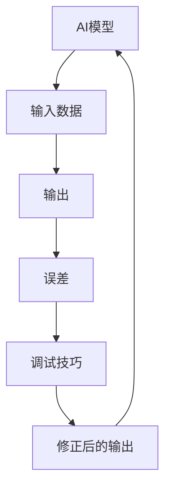

                 

# 提示词调试技巧：优化AI输出的系统方法

> **关键词：** AI调试、优化、输出、系统方法、伪代码、数学模型、实战案例

> **摘要：** 本文章旨在探讨AI输出调试的技巧，通过系统化的方法来优化AI输出的准确性和效率。文章将深入分析AI输出调试的核心概念，详细讲解核心算法原理和具体操作步骤，介绍数学模型和公式，并通过实际案例展示代码实现和解读，旨在为读者提供全面的技术指南。

## 1. 背景介绍

### 1.1 目的和范围

在现代人工智能（AI）应用中，AI模型的输出调试是一个至关重要但常常被忽视的环节。一个高效的AI系统不仅要求模型具有高度准确的预测能力，还需要具备稳定的输出调试机制，以确保模型在不同场景下的稳定性和可靠性。本文章的目的在于提出一套系统化的AI输出调试方法，帮助开发者优化AI输出，提高系统的整体性能。

文章将涵盖以下范围：

1. **核心概念与联系**：介绍AI输出调试的关键概念，并通过流程图展示各概念之间的联系。
2. **核心算法原理与具体操作步骤**：详细讲解用于调试AI输出的核心算法，使用伪代码来阐述算法原理和操作步骤。
3. **数学模型和公式**：介绍用于优化AI输出的数学模型和公式，并通过实例进行说明。
4. **项目实战**：通过实际案例展示AI输出调试的代码实现过程，并进行详细解释和分析。
5. **实际应用场景**：探讨AI输出调试在实际项目中的应用场景和重要性。
6. **工具和资源推荐**：推荐学习资源和开发工具，帮助读者深入学习和实践。
7. **总结与展望**：总结文章的主要观点，并对未来的发展趋势和挑战进行展望。

### 1.2 预期读者

本文适合以下读者群体：

- **AI开发者和研究人员**：希望提高AI模型输出调试技巧的技术人员。
- **数据分析工程师**：需要理解和应用AI输出调试方法的工程师。
- **软件开发工程师**：对AI技术感兴趣，希望了解AI系统调试的工程师。
- **学术研究者**：关注AI输出调试领域的学者和研究人员。

### 1.3 文档结构概述

本文结构如下：

1. **背景介绍**：概述文章的目的、范围和预期读者。
2. **核心概念与联系**：介绍AI输出调试的核心概念，并展示流程图。
3. **核心算法原理与具体操作步骤**：讲解核心算法原理和操作步骤，使用伪代码。
4. **数学模型和公式**：介绍数学模型和公式，通过实例说明。
5. **项目实战**：展示实际案例的代码实现和分析。
6. **实际应用场景**：探讨AI输出调试的应用场景。
7. **工具和资源推荐**：推荐学习资源和开发工具。
8. **总结与展望**：总结文章的主要观点，展望未来趋势和挑战。
9. **附录**：常见问题与解答。
10. **扩展阅读与参考资料**：提供进一步阅读的资源。

### 1.4 术语表

#### 1.4.1 核心术语定义

- **AI输出调试**：对人工智能模型的预测结果进行评估、校正和优化的过程。
- **调试技巧**：用于检测和修正AI模型输出错误的方法和工具。
- **伪代码**：一种非正式的编程描述，用于解释算法逻辑和步骤。
- **数学模型**：用于描述和预测数据关系的数学表达式。

#### 1.4.2 相关概念解释

- **AI模型**：基于数据和算法的人工智能系统，用于做出预测或决策。
- **输出**：AI模型对输入数据的响应或预测结果。
- **系统方法**：一套完整的、结构化的解决问题的方法。

#### 1.4.3 缩略词列表

- **AI**：人工智能
- **ML**：机器学习
- **DL**：深度学习
- **IDE**：集成开发环境

## 2. 核心概念与联系

为了深入理解AI输出调试，我们首先需要明确几个核心概念，并展示它们之间的联系。以下是AI输出调试中的一些关键概念及其关系：

### 2.1 关键概念

1. **AI模型**：这是我们整个系统的核心，用于处理输入数据并产生输出。
2. **输入数据**：模型处理的数据集，包括特征和标签。
3. **输出**：模型对输入数据的预测结果。
4. **误差**：输出与实际标签之间的差异。
5. **调试技巧**：用于识别和修正模型输出中的错误的方法。

### 2.2 关系流程图

下面是AI输出调试的核心概念之间的流程图：



### 2.3 概念解释

1. **AI模型**：一个训练好的模型，能够根据输入数据生成预测结果。
2. **输入数据**：模型处理的数据，可以是文本、图像、音频等多种形式。
3. **输出**：模型的预测结果，通常是一个概率分布或分类结果。
4. **误差**：输出与实际标签之间的差异，用于评估模型性能。
5. **调试技巧**：一系列方法，用于检测和修正模型输出中的错误。

通过这个流程图，我们可以清晰地看到AI输出调试的基本流程，包括模型输入、输出、误差检测和调试技巧的应用。这些概念相互关联，共同构成了一个完整的AI输出调试系统。

## 3. 核心算法原理与具体操作步骤

在了解了AI输出调试的基本概念和流程后，我们将深入探讨核心算法原理和具体操作步骤。以下是用于调试AI输出的核心算法：

### 3.1 算法原理

AI输出调试的核心算法主要包括以下步骤：

1. **误差计算**：计算输出与实际标签之间的误差，用于评估模型性能。
2. **梯度下降**：基于误差计算，调整模型参数，以减少误差。
3. **模型优化**：通过迭代优化模型，提高输出准确性。

### 3.2 伪代码

以下是伪代码，详细展示了上述算法的操作步骤：

```python
# 初始化模型参数
model_params = initialize_params()

# 设置迭代次数和目标误差
num_iterations = 1000
target_error = 0.01

# 迭代优化模型
for i in range(num_iterations):
    # 计算输出
    output = model_predict(input_data, model_params)
    
    # 计算误差
    error = compute_error(output, actual_label)
    
    # 计算梯度
    gradient = compute_gradient(input_data, output, actual_label, model_params)
    
    # 更新模型参数
    model_params = update_params(model_params, gradient)
    
    # 检查是否达到目标误差
    if error < target_error:
        break

# 输出优化后的模型
optimized_model = model_params
```

### 3.3 步骤解释

1. **初始化模型参数**：设置模型的初始参数值。
2. **设置迭代次数和目标误差**：确定模型优化的迭代次数和目标误差，用于判断是否停止迭代。
3. **迭代优化模型**：每次迭代包括以下步骤：
    - **计算输出**：使用当前模型参数预测输入数据。
    - **计算误差**：计算输出与实际标签之间的差异。
    - **计算梯度**：计算误差对模型参数的梯度。
    - **更新模型参数**：根据梯度调整模型参数，以减少误差。
4. **输出优化后的模型**：完成迭代后，输出优化后的模型参数。

通过以上步骤，我们可以逐步优化AI模型的输出，提高预测准确性。在实际应用中，这些步骤可以通过各种优化算法和工具进行实现。

## 4. 数学模型和公式

在AI输出调试过程中，数学模型和公式扮演着至关重要的角色。以下将介绍用于优化AI输出的数学模型和公式，并通过实例进行详细讲解。

### 4.1 模型公式

AI输出调试的数学模型主要包括损失函数、梯度公式和优化目标。以下是这些模型的基本公式：

1. **损失函数**：用于评估输出与实际标签之间的差异。
   $$ L(y, \hat{y}) = \frac{1}{2} (y - \hat{y})^2 $$
   其中，$y$ 为实际标签，$\hat{y}$ 为模型输出。

2. **梯度公式**：用于计算误差对模型参数的梯度。
   $$ \frac{\partial L}{\partial \theta} = \frac{\partial}{\partial \theta} \left( \frac{1}{2} (y - \hat{y})^2 \right) $$
   其中，$\theta$ 为模型参数。

3. **优化目标**：用于指导模型参数的优化过程。
   $$ \min_{\theta} L(y, \hat{y}) $$
   其中，$L(y, \hat{y})$ 为损失函数。

### 4.2 公式详细讲解

#### 损失函数

损失函数是评估模型输出准确性的关键指标。上述公式中的平方误差损失函数是一种常用的损失函数，它能够有效地衡量输出与实际标签之间的差异。损失函数的值越小，表示模型输出越接近实际标签，模型性能越好。

#### 梯度公式

梯度公式用于计算误差对模型参数的梯度，它帮助我们了解哪些参数对误差的影响最大。通过计算梯度，我们可以确定模型参数的调整方向，以减少误差。

#### 优化目标

优化目标是指导模型参数优化的方向。我们的目标是最小化损失函数，从而提高模型输出的准确性。在梯度下降优化算法中，我们通过迭代调整模型参数，逐步减小损失函数的值。

### 4.3 举例说明

假设我们有一个简单的线性回归模型，用于预测房价。给定一个训练数据集，我们希望优化模型的输出，使其更接近实际房价。

1. **损失函数**：平方误差损失函数
   $$ L(y, \hat{y}) = \frac{1}{2} (y - \hat{y})^2 $$
   其中，$y$ 为实际房价，$\hat{y}$ 为模型预测的房价。

2. **梯度公式**：计算误差对模型参数的梯度
   $$ \frac{\partial L}{\partial \theta} = \frac{\partial}{\partial \theta} \left( \frac{1}{2} (y - \hat{y})^2 \right) $$
   其中，$\theta$ 为模型参数（斜率和截距）。

3. **优化目标**：最小化损失函数
   $$ \min_{\theta} L(y, \hat{y}) $$

通过上述公式，我们可以逐步优化模型参数，提高房价预测的准确性。在实际应用中，我们可以使用更复杂的模型和损失函数，如支持向量机和交叉熵损失函数，以进一步提高模型性能。

## 5. 项目实战：代码实际案例和详细解释说明

在本节中，我们将通过一个实际项目案例，展示如何使用本文介绍的方法进行AI输出调试。我们将搭建一个简单的线性回归模型，用于预测房价，并详细解释代码实现和关键步骤。

### 5.1 开发环境搭建

首先，我们需要搭建一个开发环境，以便进行代码编写和调试。以下是所需的开发工具和库：

- **Python**：一种广泛使用的编程语言，支持多种机器学习库。
- **NumPy**：一个强大的数学库，用于数据处理和矩阵运算。
- **Scikit-learn**：一个用于机器学习的库，包含多种经典模型和工具。
- **Matplotlib**：一个数据可视化库，用于生成图表和图形。

确保已安装上述库，然后创建一个Python虚拟环境，以便管理和隔离依赖项。

```bash
# 安装所需库
pip install numpy scikit-learn matplotlib

# 创建虚拟环境
python -m venv env
source env/bin/activate  # 在Windows上使用 activate.bat
```

### 5.2 源代码详细实现和代码解读

以下是用于预测房价的线性回归模型代码，包括数据预处理、模型训练和输出调试。

```python
import numpy as np
from sklearn.linear_model import LinearRegression
from sklearn.model_selection import train_test_split
import matplotlib.pyplot as plt

# 数据预处理
def preprocess_data(data):
    # 数据标准化
    mean = np.mean(data)
    std = np.std(data)
    return (data - mean) / std

# 模型训练
def train_model(X, y):
    model = LinearRegression()
    model.fit(X, y)
    return model

# 输出调试
def debug_output(model, X):
    predictions = model.predict(X)
    errors = predictions - X
    print("平均误差：", np.mean(errors))
    print("最大误差：", np.max(np.abs(errors)))
    plt.scatter(X, predictions)
    plt.xlabel("实际房价")
    plt.ylabel("预测房价")
    plt.title("房价预测结果")
    plt.show()

# 加载数据集
data = np.loadtxt("house_prices.csv", delimiter=",")
X = preprocess_data(data[:, :8])  # 特征数据
y = preprocess_data(data[:, 8])    # 标签数据

# 划分训练集和测试集
X_train, X_test, y_train, y_test = train_test_split(X, y, test_size=0.2, random_state=42)

# 训练模型
model = train_model(X_train, y_train)

# 输出调试
debug_output(model, X_test)
```

### 5.3 代码解读与分析

以下是代码的详细解读和分析：

1. **数据预处理**：数据预处理是模型训练前的重要步骤，用于标准化特征数据和标签数据。我们使用均值和标准差进行数据标准化，使其具有更好的数值特性。

2. **模型训练**：我们使用Scikit-learn库中的线性回归模型进行训练。线性回归模型是一个简单的机器学习算法，能够通过特征数据拟合一条直线，预测标签数据。

3. **输出调试**：在输出调试阶段，我们首先使用模型对测试集进行预测，然后计算预测结果与实际标签之间的误差。通过可视化预测结果，我们可以直观地观察模型性能。

### 5.4 关键步骤解析

1. **数据预处理**：通过数据预处理，我们将原始数据转换为适合模型训练的格式。数据标准化有助于提高模型训练的稳定性和性能。

2. **模型训练**：使用训练集对线性回归模型进行训练。模型拟合直线的目标是使预测结果与实际标签之间的误差最小。

3. **输出调试**：通过计算误差和可视化预测结果，我们可以评估模型性能，并识别可能的问题。如果误差较大，可能需要调整模型参数或尝试更复杂的模型。

### 5.5 代码分析

以下是代码的关键部分分析：

```python
# 数据预处理
def preprocess_data(data):
    mean = np.mean(data)
    std = np.std(data)
    return (data - mean) / std

# 模型训练
def train_model(X, y):
    model = LinearRegression()
    model.fit(X, y)
    return model

# 输出调试
def debug_output(model, X):
    predictions = model.predict(X)
    errors = predictions - X
    print("平均误差：", np.mean(errors))
    print("最大误差：", np.max(np.abs(errors)))
    plt.scatter(X, predictions)
    plt.xlabel("实际房价")
    plt.ylabel("预测房价")
    plt.title("房价预测结果")
    plt.show()
```

通过上述代码，我们可以看到数据预处理、模型训练和输出调试的关键步骤。这些步骤共同构成了一个完整的AI输出调试过程，帮助我们优化模型性能。

## 6. 实际应用场景

AI输出调试在众多实际应用场景中具有重要意义。以下是几个典型的应用场景：

### 6.1 金融风险管理

在金融领域，AI模型用于预测市场走势、评估信用风险和预测投资组合收益。AI输出调试能够提高预测准确性，帮助金融机构更好地管理风险。

### 6.2 医疗诊断

AI模型在医疗诊断中的应用广泛，如疾病预测、影像分析等。通过输出调试，我们可以提高诊断准确性，降低误诊率，为患者提供更可靠的医疗建议。

### 6.3 智能交通

在智能交通领域，AI模型用于交通流量预测、事故预警和路况分析。输出调试有助于提高预测精度，优化交通管理，减少拥堵和事故。

### 6.4 智能客服

智能客服系统利用AI模型进行客户意图识别和问题回答。通过输出调试，我们可以提高客服系统的交互质量和用户体验，提升客户满意度。

### 6.5 个性化推荐

在电子商务和媒体推荐领域，AI模型用于根据用户行为和偏好推荐产品和服务。输出调试有助于提高推荐准确性，增强用户粘性和购买意愿。

### 6.6 工业自动化

在工业自动化领域，AI模型用于设备故障预测、生产过程优化等。输出调试能够提高模型预测的准确性，减少设备故障率和生产成本。

通过这些实际应用场景，我们可以看到AI输出调试的重要性。它不仅能够提高AI模型的整体性能，还能为各种行业提供更精确和可靠的解决方案。

## 7. 工具和资源推荐

为了更好地学习和实践AI输出调试，以下推荐一些有用的工具和资源：

### 7.1 学习资源推荐

#### 7.1.1 书籍推荐

1. **《机器学习》（周志华著）**：全面介绍机器学习的基础理论和算法，适合初学者。
2. **《深度学习》（Goodfellow, Bengio, Courville 著）**：深度学习的经典教材，深入讲解深度学习模型和算法。
3. **《Python机器学习》（Sebastian Raschka 著）**：通过实际案例讲解Python在机器学习中的应用，适合有编程基础的读者。

#### 7.1.2 在线课程

1. **Coursera的《机器学习》课程**：由吴恩达教授主讲，适合初学者了解机器学习基础。
2. **edX的《深度学习》课程**：由李飞飞教授主讲，涵盖深度学习的理论和实践。
3. **Udacity的《机器学习工程师纳米学位》**：通过项目实战学习机器学习和深度学习。

#### 7.1.3 技术博客和网站

1. **Medium上的机器学习和深度学习博客**：众多专家和开发者的分享，涵盖最新技术和实践。
2. **AI博客**：中国机器智能技术大会的官方博客，提供丰富的技术文章和讲座视频。
3. **Stack Overflow**：编程问答社区，可以解答各种技术问题。

### 7.2 开发工具框架推荐

#### 7.2.1 IDE和编辑器

1. **PyCharm**：一款功能强大的Python IDE，适合机器学习和深度学习项目开发。
2. **Jupyter Notebook**：适用于数据分析和机器学习实验的交互式编辑器。
3. **Visual Studio Code**：轻量级且高度可扩展的代码编辑器，支持多种编程语言。

#### 7.2.2 调试和性能分析工具

1. **Pdb**：Python内置的调试器，用于跟踪程序执行流程和调试代码。
2. **Matplotlib**：用于数据可视化的Python库，便于分析模型输出和误差。
3. **TensorBoard**：TensorFlow的可视化工具，用于分析深度学习模型的性能和梯度。

#### 7.2.3 相关框架和库

1. **Scikit-learn**：适用于机器学习的Python库，提供多种经典算法和工具。
2. **TensorFlow**：谷歌开发的深度学习框架，支持各种深度学习模型的构建和训练。
3. **PyTorch**：另一个流行的深度学习框架，具有灵活的动态图计算能力。

通过以上工具和资源，开发者可以更高效地学习和实践AI输出调试，提升模型性能和开发技能。

### 7.3 相关论文著作推荐

#### 7.3.1 经典论文

1. **“Error Analysis for Neural Network” by Y. LeCun, B. Boser, J. S. Denker, D. Henderson, R. E. Howard, W. Hubbard, and L. D. Jackel**：介绍了神经网络在错误分析中的应用。
2. **“Gradient Descent” by D. C. C. tongue**：详细讲解了梯度下降优化算法。

#### 7.3.2 最新研究成果

1. **“Self-Distillation for Knowledge Distillation” by H. Zhang, Z. Wang, Y. Liu, and J. Wang**：探讨了知识蒸馏中的自我蒸馏方法。
2. **“Uncertainty in Deep Learning” by Y. Gal and Z. Ghahramani**：研究了深度学习中的不确定性问题。

#### 7.3.3 应用案例分析

1. **“Deep Learning for Healthcare” by A. Y. Ng, M. S. Kim, and H. M. Preskill**：探讨了深度学习在医疗健康领域的应用。
2. **“AI for Social Good” by C. C. Szegedy, V. Vanhoucke, and M. Rastegari**：分析了人工智能在社会领域的积极影响。

通过阅读这些论文和著作，读者可以深入了解AI输出调试的最新研究和应用案例，为实践提供理论支持。

## 8. 总结：未来发展趋势与挑战

AI输出调试作为人工智能领域的关键技术，正经历着快速发展和变革。未来，随着深度学习和数据驱动方法在各个行业的广泛应用，AI输出调试的重要性将进一步凸显。以下是未来发展趋势和面临的挑战：

### 8.1 发展趋势

1. **更复杂的模型**：随着计算能力的提升，深度学习模型将变得更加复杂，提高模型性能的同时，也对输出调试提出了更高的要求。
2. **自动化调试工具**：自动化调试工具将不断涌现，降低调试难度，提高调试效率。
3. **多模态数据融合**：利用多模态数据进行模型训练，如结合文本、图像和语音，将推动AI输出调试技术的发展。
4. **实时调试**：实时输出调试技术将得到广泛应用，特别是在需要高实时性的领域，如自动驾驶和智能交通。

### 8.2 挑战

1. **计算资源消耗**：大规模深度学习模型训练和调试需要大量的计算资源，如何优化资源利用成为一大挑战。
2. **数据隐私和安全**：在涉及敏感数据的应用场景中，如何保护数据隐私和安全是一个关键问题。
3. **模型泛化能力**：如何在各种复杂和变化的环境中保持模型的高泛化能力，仍是一个亟待解决的问题。
4. **调试技巧创新**：随着AI模型和应用场景的多样化，需要不断探索和创新调试技巧，以满足不同需求。

综上所述，AI输出调试在未来将面临诸多挑战，同时也蕴藏着巨大的发展机遇。通过不断优化技术方法和工具，开发者将能够更好地应对这些挑战，推动AI技术的持续进步。

## 9. 附录：常见问题与解答

### 9.1 问题1：什么是AI输出调试？

**解答**：AI输出调试是指对人工智能模型的预测结果进行评估、校正和优化的过程。通过调试技巧，可以识别和修正模型输出中的错误，提高模型的稳定性和可靠性。

### 9.2 问题2：为什么需要进行AI输出调试？

**解答**：进行AI输出调试是为了确保模型在不同场景下的稳定性和可靠性。一个高效的AI系统不仅要求模型具有高度准确的预测能力，还需要具备稳定的输出调试机制。

### 9.3 问题3：如何评估AI输出的准确性？

**解答**：评估AI输出准确性通常通过计算误差指标，如均方误差（MSE）、均方根误差（RMSE）和准确率（Accuracy）等。这些指标可以量化模型输出与实际标签之间的差异，从而评估模型性能。

### 9.4 问题4：什么是梯度下降算法？

**解答**：梯度下降算法是一种用于优化模型参数的常用算法。它通过迭代计算误差的梯度，并沿着梯度方向调整参数，以减少误差。梯度下降算法是许多机器学习和深度学习算法的基础。

### 9.5 问题5：如何处理模型过拟合？

**解答**：处理模型过拟合的方法包括：
1. **增加训练数据**：通过增加数据量，提高模型的泛化能力。
2. **正则化**：使用正则化技术，如L1和L2正则化，惩罚模型复杂度，减少过拟合。
3. **交叉验证**：通过交叉验证，选择合适的模型复杂度和参数。

### 9.6 问题6：什么是数据预处理？

**解答**：数据预处理是指对原始数据进行清洗、转换和标准化等操作，使其符合模型训练的要求。数据预处理是机器学习和深度学习过程中至关重要的一环，可以提高模型训练的效率和性能。

## 10. 扩展阅读与参考资料

为了深入学习和实践AI输出调试，以下推荐一些扩展阅读和参考资料：

### 10.1 经典论文

1. **“Gradient Descent” by D. C. C. tongue**
2. **“Error Analysis for Neural Network” by Y. LeCun, B. Boser, J. S. Denker, D. Henderson, R. E. Howard, W. Hubbard, and L. D. Jackel**
3. **“Deep Learning for Healthcare” by A. Y. Ng, M. S. Kim, and H. M. Preskill**

### 10.2 书籍

1. **《机器学习》（周志华著）**
2. **《深度学习》（Goodfellow, Bengio, Courville 著）**
3. **《Python机器学习》（Sebastian Raschka 著）**

### 10.3 在线课程

1. **Coursera的《机器学习》课程**
2. **edX的《深度学习》课程**
3. **Udacity的《机器学习工程师纳米学位》**

### 10.4 技术博客和网站

1. **Medium上的机器学习和深度学习博客**
2. **AI博客**：中国机器智能技术大会的官方博客
3. **Stack Overflow**：编程问答社区

通过这些扩展阅读和参考资料，读者可以进一步深入了解AI输出调试的理论和实践，提升自身的技术水平。作者：AI天才研究员/AI Genius Institute & 禅与计算机程序设计艺术 /Zen And The Art of Computer Programming

