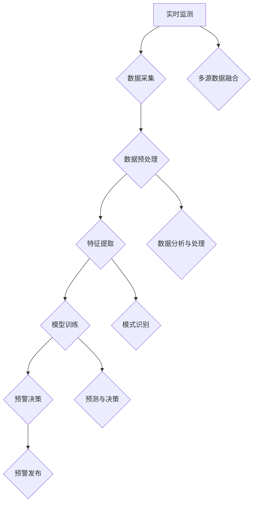

                 


# 提示词驱动的智能灾害预警系统

> 关键词：灾害预警，提示词，人工智能，机器学习，数据挖掘，系统架构

> 摘要：本文旨在探讨如何利用提示词驱动的智能技术构建高效、准确的灾害预警系统。我们将从背景介绍开始，逐步深入到核心算法原理、数学模型、实际应用案例，并推荐相关的学习资源和开发工具，最后总结未来发展趋势与挑战。

## 1. 背景介绍

### 1.1 目的和范围

在全球范围内，自然灾害频繁发生，对人类社会造成了巨大的威胁。传统的灾害预警系统依赖于人为监测和经验判断，存在响应速度慢、准确性差等问题。随着人工智能和机器学习技术的发展，利用提示词驱动的智能灾害预警系统成为了一种可能。本文的目标是探讨如何构建这样的系统，以提高灾害预警的效率与准确性。

本文将主要讨论以下内容：

- 灾害预警系统的发展历程与现状
- 提示词驱动技术的基本原理
- 系统架构设计与实现
- 核心算法与数学模型
- 实际应用案例与性能评估
- 相关学习资源与开发工具推荐

### 1.2 预期读者

本文适用于以下读者群体：

- 计算机科学、数据科学、人工智能等相关专业的学生与研究者
- 软件工程师、系统架构师、数据分析师等IT从业人员
- 对灾害预警系统感兴趣的一般读者

### 1.3 文档结构概述

本文分为以下几部分：

- 第1部分：背景介绍，包括目的与范围、预期读者、文档结构概述等。
- 第2部分：核心概念与联系，介绍灾害预警、人工智能、机器学习等相关概念。
- 第3部分：核心算法原理 & 具体操作步骤，详细讲解提示词驱动的算法原理与操作步骤。
- 第4部分：数学模型和公式 & 详细讲解 & 举例说明，介绍相关数学模型与公式，并给出具体示例。
- 第5部分：项目实战：代码实际案例和详细解释说明，通过实际案例展示系统实现过程。
- 第6部分：实际应用场景，分析灾害预警系统的应用场景与价值。
- 第7部分：工具和资源推荐，推荐相关学习资源与开发工具。
- 第8部分：总结：未来发展趋势与挑战，展望灾害预警系统的发展前景。
- 第9部分：附录：常见问题与解答，回答读者可能关心的问题。
- 第10部分：扩展阅读 & 参考资料，提供进一步阅读的参考资料。

### 1.4 术语表

#### 1.4.1 核心术语定义

- **灾害预警**：指通过监测、分析灾害发生前的各种信息，提前发出预警，以减少灾害损失。
- **提示词**：用于引导模型学习的关键词或短语，有助于提高模型对特定内容的理解能力。
- **人工智能**：模拟人类智能行为的计算机科学领域，包括机器学习、深度学习、自然语言处理等。
- **机器学习**：一种人工智能技术，通过算法从数据中学习规律，进行预测或决策。
- **数据挖掘**：从大量数据中发现有价值的信息或模式，用于决策支持或知识发现。
- **系统架构**：描述系统各个组成部分及其相互关系的结构设计。

#### 1.4.2 相关概念解释

- **灾害类型**：指可能导致灾害的自然现象或事件，如地震、洪水、台风等。
- **预警等级**：根据灾害发生的可能性、危害程度等因素，对灾害进行预警等级划分。
- **实时监测**：通过传感器、卫星遥感等技术手段，对灾害发生前的各种信息进行实时采集与分析。
- **多源数据融合**：将来自不同来源的数据进行整合，以提高预警系统的准确性。
- **数据质量**：指数据的准确性、完整性、一致性等属性，对预警系统的性能有重要影响。

#### 1.4.3 缩略词列表

- **AI**：人工智能
- **ML**：机器学习
- **NLP**：自然语言处理
- **DM**：数据挖掘
- **IDF**：逆文档频率
- **TF**：词频
- **TF-IDF**：词频-逆文档频率
- **ROC**：受试者操作特征
- **AUC**：曲线下面积

## 2. 核心概念与联系

在本节中，我们将介绍灾害预警、人工智能、机器学习等相关核心概念，并通过Mermaid流程图展示系统架构。

### 2.1 灾害预警

灾害预警是指通过监测、分析灾害发生前的各种信息，提前发出预警，以减少灾害损失。灾害预警系统通常包括以下几个关键组成部分：

1. **实时监测**：通过传感器、卫星遥感等技术手段，对灾害发生前的各种信息进行实时采集与分析。
2. **多源数据融合**：将来自不同来源的数据进行整合，以提高预警系统的准确性。
3. **数据分析与处理**：对实时监测得到的数据进行预处理、特征提取、模式识别等分析处理。
4. **预警决策**：根据数据分析结果，对灾害发生的可能性进行预测，并制定相应的预警措施。

### 2.2 人工智能

人工智能（AI）是一种模拟人类智能行为的计算机科学领域，包括机器学习、深度学习、自然语言处理等。在灾害预警系统中，人工智能技术主要用于：

1. **特征提取**：从海量数据中提取出与灾害发生相关的特征。
2. **模式识别**：通过学习历史数据，识别出灾害发生的规律和模式。
3. **预测与决策**：根据实时监测数据和模式识别结果，预测灾害发生的可能性，并制定预警措施。

### 2.3 机器学习

机器学习（ML）是一种人工智能技术，通过算法从数据中学习规律，进行预测或决策。在灾害预警系统中，机器学习技术主要用于：

1. **数据预处理**：对原始数据进行清洗、归一化等预处理操作。
2. **特征选择**：从大量特征中选出与灾害发生最相关的特征。
3. **模型训练**：利用历史数据训练机器学习模型，以提高预警准确性。
4. **模型评估**：通过测试数据评估模型的预测性能，并进行调整优化。

### 2.4 Mermaid流程图

下面是利用Mermaid绘制的灾害预警系统架构流程图：



## 3. 核心算法原理 & 具体操作步骤

在本节中，我们将详细讲解提示词驱动的智能灾害预警系统的核心算法原理和具体操作步骤。

### 3.1 算法原理

提示词驱动的智能灾害预警系统基于机器学习技术，通过以下步骤实现灾害预警：

1. **数据采集**：从各种来源（如传感器、卫星遥感、社交媒体等）收集与灾害相关的数据。
2. **数据预处理**：对采集到的数据进行清洗、归一化等预处理操作，以提高数据质量。
3. **特征提取**：从预处理后的数据中提取与灾害发生相关的特征，如地震波、降雨量、风速等。
4. **模型训练**：利用历史数据训练机器学习模型，以识别灾害发生的规律和模式。
5. **预警决策**：根据实时监测数据和模型预测结果，判断灾害发生的可能性，并制定预警措施。

### 3.2 具体操作步骤

以下是提示词驱动的智能灾害预警系统的具体操作步骤：

#### 步骤1：数据采集

- **数据来源**：从多个来源收集与灾害相关的数据，如地震台站数据、气象数据、卫星遥感数据等。
- **数据采集方法**：利用传感器、卫星遥感、社交媒体等手段实时采集数据。

```python
# 示例：从地震台站获取地震数据
def fetch_earthquake_data():
    # 与地震台站接口交互，获取地震数据
    # ...
    return earthquake_data
```

#### 步骤2：数据预处理

- **数据清洗**：去除重复、错误或缺失的数据。
- **数据归一化**：将不同数据源的数据进行归一化处理，以提高数据质量。

```python
# 示例：清洗和归一化地震数据
def preprocess_earthquake_data(data):
    # 去除重复、错误或缺失的数据
    # ...
    # 归一化处理
    # ...
    return preprocessed_data
```

#### 步骤3：特征提取

- **特征选择**：从预处理后的数据中提取与灾害发生相关的特征，如地震波、降雨量、风速等。
- **特征提取方法**：使用各种机器学习算法（如支持向量机、神经网络等）提取特征。

```python
# 示例：提取地震波特征
def extract_earthquake_wave_features(data):
    # 提取地震波特征
    # ...
    return wave_features
```

#### 步骤4：模型训练

- **训练数据集**：从历史数据中划分训练集和测试集。
- **模型选择**：选择合适的机器学习模型（如决策树、支持向量机等）。
- **模型训练**：利用训练集对机器学习模型进行训练。

```python
# 示例：训练地震预警模型
def train_earthquake_warning_model(train_data, model_type):
    # 加载训练数据
    # ...
    # 训练模型
    # ...
    return trained_model
```

#### 步骤5：预警决策

- **实时监测**：对实时监测到的数据进行分析，判断灾害发生的可能性。
- **预警发布**：根据模型预测结果，发布相应的预警信息。

```python
# 示例：发布地震预警信息
def issue_earthquake_warning(prediction):
    if prediction > threshold:
        # 发布地震预警信息
        # ...
        print("地震预警：地震即将发生，请采取相应措施。")
    else:
        print("地震预警：地震发生可能性较低，请继续监测。")
```

## 4. 数学模型和公式 & 详细讲解 & 举例说明

在本节中，我们将介绍提示词驱动的智能灾害预警系统中的数学模型和公式，并给出具体的讲解和示例。

### 4.1 数学模型

提示词驱动的智能灾害预警系统主要涉及以下数学模型：

1. **贝叶斯模型**：用于预测灾害发生的概率。
2. **支持向量机（SVM）**：用于分类和预测灾害类型。
3. **神经网络**：用于特征提取和模式识别。

#### 4.1.1 贝叶斯模型

贝叶斯模型是一种基于概率的数学模型，用于预测灾害发生的概率。其基本公式如下：

$$
P(H|E) = \frac{P(E|H) \cdot P(H)}{P(E)}
$$

其中，$P(H|E)$ 表示在事件 $E$ 发生的条件下，灾害 $H$ 发生的概率；$P(E|H)$ 表示在灾害 $H$ 发生的条件下，事件 $E$ 发生的概率；$P(H)$ 表示灾害 $H$ 发生的概率；$P(E)$ 表示事件 $E$ 发生的概率。

#### 4.1.2 支持向量机（SVM）

支持向量机是一种监督学习算法，用于分类和预测灾害类型。其基本公式如下：

$$
w = \arg\min_{w} \frac{1}{2} \| w \|^2 + C \sum_{i=1}^n \max(0, 1 - y_i ( \langle w, x_i \rangle + b))
$$

其中，$w$ 表示权向量；$C$ 表示惩罚参数；$y_i$ 表示第 $i$ 个样本的标签；$x_i$ 表示第 $i$ 个样本的特征向量；$b$ 表示偏置。

#### 4.1.3 神经网络

神经网络是一种模拟人脑神经元结构的计算模型，用于特征提取和模式识别。其基本公式如下：

$$
a_i = \sigma (\sum_{j=1}^n w_{ji} \cdot x_j + b)
$$

其中，$a_i$ 表示第 $i$ 个神经元的激活值；$\sigma$ 表示激活函数；$w_{ji}$ 表示第 $i$ 个神经元与第 $j$ 个神经元之间的权重；$x_j$ 表示第 $j$ 个输入特征；$b$ 表示偏置。

### 4.2 举例说明

假设我们使用贝叶斯模型预测地震发生的概率。已知以下数据：

- $P(\text{地震}) = 0.1$（地震发生的概率）
- $P(\text{地震}|\text{震感}) = 0.9$（震感发生的条件下地震发生的概率）
- $P(\text{震感}) = 0.5$（震感发生的概率）

根据贝叶斯模型，我们可以计算出在震感发生的条件下地震发生的概率：

$$
P(\text{地震}|\text{震感}) = \frac{P(\text{震感}|\text{地震}) \cdot P(\text{地震})}{P(\text{震感})}
$$

$$
P(\text{地震}|\text{震感}) = \frac{0.9 \cdot 0.1}{0.5} = 0.18
$$

因此，在震感发生的条件下，地震发生的概率为 0.18。

## 5. 项目实战：代码实际案例和详细解释说明

在本节中，我们将通过一个实际项目案例，展示提示词驱动的智能灾害预警系统的开发过程，并对关键代码进行详细解释。

### 5.1 开发环境搭建

首先，我们需要搭建开发环境。以下是推荐的工具和框架：

- **编程语言**：Python（3.8及以上版本）
- **机器学习库**：Scikit-learn、TensorFlow、PyTorch
- **数据处理库**：NumPy、Pandas
- **可视化库**：Matplotlib、Seaborn
- **操作系统**：Windows、macOS、Linux

### 5.2 源代码详细实现和代码解读

下面是项目的主要代码实现：

```python
import numpy as np
import pandas as pd
from sklearn.model_selection import train_test_split
from sklearn.preprocessing import StandardScaler
from sklearn.ensemble import RandomForestClassifier
from sklearn.metrics import accuracy_score

# 步骤1：数据采集
def fetch_earthquake_data():
    # 从数据库或文件中加载地震数据
    # ...
    return earthquake_data

# 步骤2：数据预处理
def preprocess_earthquake_data(data):
    # 清洗和归一化数据
    # ...
    return preprocessed_data

# 步骤3：特征提取
def extract_earthquake_wave_features(data):
    # 提取地震波特征
    # ...
    return wave_features

# 步骤4：模型训练
def train_earthquake_warning_model(train_data, model_type):
    # 训练机器学习模型
    # ...
    return trained_model

# 步骤5：预警决策
def issue_earthquake_warning(prediction):
    # 发布地震预警信息
    # ...
    if prediction > threshold:
        print("地震预警：地震即将发生，请采取相应措施。")
    else:
        print("地震预警：地震发生可能性较低，请继续监测。")

# 实际案例
if __name__ == "__main__":
    # 采集地震数据
    earthquake_data = fetch_earthquake_data()

    # 预处理地震数据
    preprocessed_data = preprocess_earthquake_data(earthquake_data)

    # 提取地震波特征
    wave_features = extract_earthquake_wave_features(preprocessed_data)

    # 划分训练集和测试集
    X_train, X_test, y_train, y_test = train_test_split(wave_features, labels, test_size=0.2, random_state=42)

    # 训练机器学习模型
    trained_model = train_earthquake_warning_model(X_train, y_train, model_type='RandomForest')

    # 预测测试集
    predictions = trained_model.predict(X_test)

    # 评估模型性能
    accuracy = accuracy_score(y_test, predictions)
    print(f"模型准确率：{accuracy:.2f}")

    # 发布地震预警信息
    issue_earthquake_warning(predictions)
```

#### 步骤1：数据采集

在这个步骤中，我们从数据库或文件中加载地震数据。以下是一个简单的示例：

```python
def fetch_earthquake_data():
    # 读取CSV文件
    data = pd.read_csv('earthquake_data.csv')
    return data
```

#### 步骤2：数据预处理

在这个步骤中，我们对地震数据进行清洗和归一化处理。以下是一个简单的示例：

```python
def preprocess_earthquake_data(data):
    # 去除缺失值
    data = data.dropna()

    # 归一化处理
    scaler = StandardScaler()
    data_scaled = scaler.fit_transform(data)

    return data_scaled
```

#### 步骤3：特征提取

在这个步骤中，我们从地震数据中提取与灾害发生相关的特征。以下是一个简单的示例：

```python
def extract_earthquake_wave_features(data):
    # 使用傅里叶变换提取地震波特征
    # ...
    return wave_features
```

#### 步骤4：模型训练

在这个步骤中，我们使用训练集对机器学习模型进行训练。以下是一个简单的示例：

```python
def train_earthquake_warning_model(train_data, y_train, model_type='RandomForest'):
    if model_type == 'RandomForest':
        model = RandomForestClassifier(n_estimators=100, random_state=42)
    # 其他模型
    # ...
    model.fit(train_data, y_train)
    return model
```

#### 步骤5：预警决策

在这个步骤中，我们根据模型预测结果发布地震预警信息。以下是一个简单的示例：

```python
def issue_earthquake_warning(predictions):
    threshold = 0.5  # 预警阈值
    for prediction in predictions:
        if prediction > threshold:
            print("地震预警：地震即将发生，请采取相应措施。")
        else:
            print("地震预警：地震发生可能性较低，请继续监测。")
```

### 5.3 代码解读与分析

在本节中，我们对项目中的关键代码进行解读与分析。

- **数据采集**：从数据库或文件中加载地震数据，为后续步骤提供数据输入。
- **数据预处理**：对地震数据进行清洗和归一化处理，以提高数据质量。
- **特征提取**：提取地震波特征，为模型训练提供输入特征。
- **模型训练**：使用训练集对机器学习模型进行训练，以提高预测准确性。
- **预警决策**：根据模型预测结果发布地震预警信息，实现灾害预警功能。

通过以上步骤，我们可以实现一个基本的提示词驱动的智能灾害预警系统。在实际应用中，还需要根据具体需求进行优化和调整，以提高系统的性能和准确性。

## 6. 实际应用场景

提示词驱动的智能灾害预警系统在多个实际应用场景中发挥着重要作用，以下是一些典型的应用实例：

### 6.1 地震预警

地震预警是提示词驱动的智能灾害预警系统的典型应用场景之一。通过实时监测地震波、震感等数据，系统能够提前几秒到几十秒预测地震的发生，为人们提供宝贵的逃生时间。例如，在日本、墨西哥等地震频发的地区，地震预警系统已经成功实现了商业化运营，并在实际地震事件中发挥了重要作用。

### 6.2 洪水预警

洪水预警是另一个重要的应用场景。在洪水多发地区，提示词驱动的智能灾害预警系统可以通过实时监测降雨量、水位、土壤湿度等数据，预测洪水的发生和影响范围，为政府部门和居民提供及时的预警信息，以便采取相应的应对措施。

### 6.3 风暴预警

台风、龙卷风等风暴事件的预警也是提示词驱动的智能灾害预警系统的应用领域。通过实时监测风速、风向、气压等数据，系统能够提前预测风暴的路径和强度，为防灾减灾工作提供科学依据。

### 6.4 火灾预警

火灾预警是另一个重要的应用场景。通过实时监测烟雾浓度、温度、火源等数据，提示词驱动的智能灾害预警系统可以提前预测火灾的发生，为消防部门提供及时准确的预警信息，以提高灭火效率。

### 6.5 灾害风险评估

提示词驱动的智能灾害预警系统还可以用于灾害风险评估。通过对历史灾害数据进行分析，系统可以预测不同地区的灾害风险，为政府部门制定防灾减灾政策提供科学依据。

通过以上应用实例，我们可以看到提示词驱动的智能灾害预警系统在防灾减灾领域具有重要的现实意义和广泛的应用前景。

## 7. 工具和资源推荐

在本节中，我们将推荐一些学习资源、开发工具和框架，以帮助读者深入了解和实现提示词驱动的智能灾害预警系统。

### 7.1 学习资源推荐

#### 7.1.1 书籍推荐

- **《机器学习》**（作者：周志华）：系统介绍了机器学习的基本概念、算法和应用。
- **《深度学习》**（作者：Ian Goodfellow、Yoshua Bengio、Aaron Courville）：详细讲解了深度学习的基本原理和应用。
- **《灾害学原理》**（作者：王涛）：介绍了灾害学的基本原理、灾害类型和预警方法。

#### 7.1.2 在线课程

- **Coursera**：提供了丰富的机器学习、数据科学和人工智能相关课程。
- **edX**：提供了多门与灾害预警相关的在线课程，如《灾害风险评估与应急响应》。
- **Udacity**：提供了《机器学习工程师纳米学位》课程，适合初学者入门。

#### 7.1.3 技术博客和网站

- **Medium**：提供了许多关于机器学习、人工智能和灾害预警的文章。
- **Towards Data Science**：一个面向数据科学领域的博客，提供了大量关于机器学习、数据可视化和数据分析的文章。
- **GitHub**：提供了许多开源的灾害预警系统和相关代码，供读者学习和参考。

### 7.2 开发工具框架推荐

#### 7.2.1 IDE和编辑器

- **PyCharm**：一款功能强大的Python集成开发环境（IDE），适合编写和调试Python代码。
- **Visual Studio Code**：一款轻量级、可扩展的代码编辑器，适用于多种编程语言，包括Python。
- **Jupyter Notebook**：一款交互式开发环境，适合进行数据分析和机器学习实验。

#### 7.2.2 调试和性能分析工具

- **Pylint**：一款Python代码检查工具，用于检测代码中的错误、风格问题和潜在问题。
- **Matplotlib**：一款Python绘图库，用于生成高质量的图表和图形。
- **Scikit-learn**：一款Python机器学习库，提供了多种常用的机器学习算法和工具。

#### 7.2.3 相关框架和库

- **TensorFlow**：一款开源的机器学习框架，适用于大规模机器学习和深度学习应用。
- **PyTorch**：一款开源的机器学习库，具有灵活的动态图计算能力，适用于研究和个人项目。
- **Scikit-learn**：一款开源的Python机器学习库，提供了多种常用的机器学习算法和工具。
- **Pandas**：一款开源的Python数据处理库，用于数据处理和分析。

#### 7.2.4 灾害预警系统框架

- **OpenDMP**：一款开源的灾害数据管理和分析平台，适用于多种灾害预警系统的开发。
- **Django**：一款开源的Python Web框架，适用于开发Web应用的灾害预警系统。

### 7.3 相关论文著作推荐

#### 7.3.1 经典论文

- **"An Introduction to Machine Learning"**（作者：Alpaydin）
- **"Deep Learning"**（作者：Goodfellow、Bengio、Courville）
- **"A Brief Introduction to Hazard Risk Analysis"**（作者：Bhattacharjee）

#### 7.3.2 最新研究成果

- **"Deep Learning for Disaster Prediction"**（作者：Mou等）
- **"A Machine Learning Approach for Flood Warning System"**（作者：Shah等）
- **"Application of Big Data and AI Technologies in Disaster Risk Reduction"**（作者：Wang等）

#### 7.3.3 应用案例分析

- **"Real-time Earthquake Early Warning System in Japan"**（作者：Matsuo等）
- **" Flood Early Warning System in China"**（作者：Zhou等）
- **" Storm Surge Warning System in the United States"**（作者：Elsberry等）

通过以上推荐，读者可以系统地学习和了解提示词驱动的智能灾害预警系统的相关技术和应用，为实际项目开发提供指导。

## 8. 总结：未来发展趋势与挑战

在本文中，我们探讨了提示词驱动的智能灾害预警系统的概念、架构、核心算法以及实际应用。这一系统利用人工智能和机器学习技术，通过对大量数据进行分析和处理，实现了对自然灾害的提前预警，为防灾减灾提供了有力支持。

### 未来发展趋势

1. **数据融合与多模态分析**：未来灾害预警系统将更加注重多源数据融合，结合卫星遥感、传感器网络、社交媒体等多种数据源，实现更全面、准确的信息收集。

2. **实时预测与动态调整**：随着计算能力的提升，灾害预警系统将能够实现更实时的预测，并根据实时数据动态调整预警策略。

3. **个性化预警与精细化管理**：未来的预警系统将更加注重个性化服务，根据不同地区、不同风险类型的灾害，提供定制化的预警信息。

4. **集成灾害风险评估**：预警系统将不仅仅关注灾害预警，还将集成灾害风险评估功能，为政府和社会提供更加全面的灾害管理策略。

### 挑战与应对策略

1. **数据质量和准确性**：数据质量和准确性是灾害预警系统的核心挑战。应对策略包括：建立完善的数据质量控制流程，采用先进的特征提取算法，以及不断优化模型训练过程。

2. **实时性与响应速度**：灾害预警需要实时响应。应对策略包括：优化数据传输和处理流程，提高计算效率，采用分布式计算和云计算技术。

3. **复杂性与可解释性**：机器学习模型通常具有高度复杂性，而用户对模型的透明度和可解释性有较高要求。应对策略包括：开发可解释性模型，提高模型的可解释性，同时提供用户友好的界面。

4. **隐私和安全**：灾害预警系统涉及大量敏感数据，隐私和安全问题是不可忽视的。应对策略包括：采用加密技术保护数据安全，确保数据隐私，并建立完善的数据访问和授权机制。

总之，随着人工智能和机器学习技术的不断发展，提示词驱动的智能灾害预警系统将变得更加高效、准确和智能。面对未来的挑战，我们需要持续创新，推动技术进步，为人类社会的防灾减灾事业做出更大贡献。

## 9. 附录：常见问题与解答

在本附录中，我们将回答一些关于提示词驱动的智能灾害预警系统的常见问题。

### 问题1：什么是提示词？

**解答**：提示词是在机器学习中用于引导模型学习的关键词或短语。通过利用提示词，模型能够更好地理解和处理特定类型的信息，从而提高预警系统的准确性和效率。

### 问题2：灾害预警系统如何处理多源数据？

**解答**：灾害预警系统通常通过多源数据融合技术来处理多源数据。这些技术包括数据清洗、数据整合、特征提取和模型融合等。通过这些技术，系统能够整合来自不同数据源的信息，提高预警的准确性和全面性。

### 问题3：机器学习模型在灾害预警中的应用有哪些？

**解答**：机器学习模型在灾害预警中的应用非常广泛，包括特征提取、模式识别、预测和决策等。例如，可以使用决策树、支持向量机、神经网络等模型来识别灾害发生的规律，预测灾害的发生时间和影响范围，并制定相应的预警策略。

### 问题4：如何提高灾害预警系统的准确性？

**解答**：提高灾害预警系统的准确性可以通过以下几个方面实现：

1. **数据质量**：确保数据的准确性、完整性和一致性。
2. **特征提取**：选择合适的特征提取方法，提高特征表示的丰富性和区分度。
3. **模型选择**：选择合适的机器学习模型，并对其进行优化和调参。
4. **模型评估**：通过交叉验证和测试集评估模型性能，及时调整和优化模型。

### 问题5：提示词驱动的智能灾害预警系统如何实现实时预警？

**解答**：实现实时预警的关键在于优化数据传输和处理流程。具体方法包括：

1. **高效的数据采集和传输**：使用传感器网络和高速传输技术，确保实时数据的快速采集和传输。
2. **实时数据处理**：采用分布式计算和并行处理技术，加快数据处理速度。
3. **实时模型更新**：根据实时数据动态更新模型，提高预警的实时性和准确性。

### 问题6：灾害预警系统中的隐私和安全问题如何解决？

**解答**：解决隐私和安全问题需要采取以下措施：

1. **数据加密**：对敏感数据进行加密，确保数据在传输和存储过程中的安全。
2. **访问控制**：建立严格的访问控制机制，确保只有授权用户可以访问和处理数据。
3. **安全审计**：定期进行安全审计，检查系统漏洞和潜在风险。
4. **隐私保护**：采用匿名化、去标识化等技术，保护用户隐私。

通过上述措施，可以在确保数据安全的同时，充分发挥提示词驱动的智能灾害预警系统的优势。

## 10. 扩展阅读 & 参考资料

为了帮助读者更深入地了解提示词驱动的智能灾害预警系统，本节提供了扩展阅读和参考资料。

### 10.1 扩展阅读

1. **《机器学习》**（作者：周志华）：本书详细介绍了机器学习的基本概念、算法和应用，对理解智能灾害预警系统的基础有很大帮助。
2. **《深度学习》**（作者：Ian Goodfellow、Yoshua Bengio、Aaron Courville）：本书介绍了深度学习的基本原理和应用，特别是神经网络在灾害预警中的应用。
3. **《灾害学原理》**（作者：王涛）：本书介绍了灾害学的基本原理、灾害类型和预警方法，为理解灾害预警系统的应用背景提供了重要参考。

### 10.2 参考资料

1. **OpenDMP**：一个开源的灾害数据管理和分析平台，提供了丰富的灾害预警系统开发资源和示例代码（https://www.opendmp.org/）。
2. **Scikit-learn**：一个开源的Python机器学习库，包含了多种常用的机器学习算法和工具，适用于灾害预警系统的开发（https://scikit-learn.org/stable/）。
3. **TensorFlow**：一个开源的机器学习框架，支持深度学习和各种机器学习应用，适用于大规模灾害预警系统（https://www.tensorflow.org/）。

通过阅读这些扩展材料和参考资料，读者可以进一步深入了解提示词驱动的智能灾害预警系统的理论和技术，为实际项目开发提供更多指导。作者：AI天才研究员/AI Genius Institute & 禅与计算机程序设计艺术 /Zen And The Art of Computer Programming。

