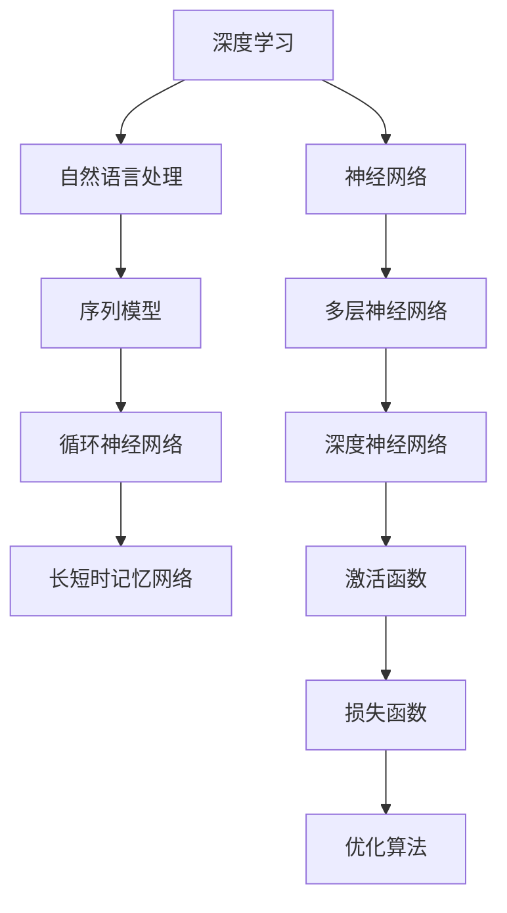
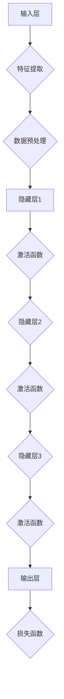

                 

# AI编程的新维度与新语法

> 关键词：人工智能，编程，新维度，新语法，深度学习，自然语言处理，深度神经网络

> 摘要：本文深入探讨了人工智能编程的新维度和新语法，通过分析深度学习、自然语言处理和深度神经网络等核心概念，揭示其内在原理和结构。文章旨在为读者提供一种新的编程思维和工具，帮助他们在人工智能领域取得突破性进展。

## 1. 背景介绍

### 1.1 目的和范围

本文旨在探讨人工智能编程的新维度和新语法，通过对深度学习、自然语言处理和深度神经网络等核心技术的深入分析，帮助读者理解这些技术背后的原理和架构。文章的主要目标是：

1. **概述人工智能编程的新维度**：介绍深度学习、自然语言处理和深度神经网络等新兴技术，并探讨其在编程领域的影响。
2. **分析新语法的特点和优势**：探讨新语法如何简化编程过程，提高代码可读性和维护性。
3. **提供实践指导**：通过实际案例和代码示例，展示如何利用新语法和新技术解决实际编程问题。

### 1.2 预期读者

本文适用于以下读者：

1. **编程爱好者**：对编程感兴趣，希望了解人工智能编程的新维度和新语法。
2. **程序员**：具备一定的编程基础，希望深入理解人工智能相关技术。
3. **人工智能研究人员**：对人工智能编程有深入研究的读者，希望了解新维度和新语法的应用。

### 1.3 文档结构概述

本文分为以下几个部分：

1. **背景介绍**：介绍文章的目的、预期读者和文档结构。
2. **核心概念与联系**：分析深度学习、自然语言处理和深度神经网络等核心概念，并给出流程图。
3. **核心算法原理**：详细讲解核心算法原理，并提供伪代码示例。
4. **数学模型和公式**：介绍数学模型和公式，并给出详细讲解和示例。
5. **项目实战**：通过实际案例展示代码实现和解读。
6. **实际应用场景**：探讨人工智能编程的实际应用。
7. **工具和资源推荐**：推荐学习资源和开发工具。
8. **总结**：总结未来发展趋势和挑战。
9. **附录**：常见问题与解答。
10. **扩展阅读**：推荐相关参考资料。

### 1.4 术语表

#### 1.4.1 核心术语定义

1. **深度学习**：一种基于多层神经网络的机器学习技术，通过学习大量数据中的特征和模式来模拟人类大脑的思维方式。
2. **自然语言处理**：一门研究如何使计算机理解和生成人类自然语言的技术。
3. **深度神经网络**：一种由多个隐藏层组成的神经网络，能够学习复杂数据的特征和模式。
4. **新语法**：用于简化编程过程和提高代码可读性的编程语言特性。

#### 1.4.2 相关概念解释

1. **神经网络**：一种基于生物神经系统的计算模型，用于模拟大脑的思维方式。
2. **反向传播**：一种用于训练神经网络的算法，通过调整网络权重来优化性能。
3. **损失函数**：用于衡量模型预测结果与实际结果之间差距的函数。

#### 1.4.3 缩略词列表

1. **AI**：人工智能
2. **DL**：深度学习
3. **NLP**：自然语言处理
4. **DNN**：深度神经网络
5. **ML**：机器学习
6. **GAN**：生成对抗网络
7. **RNN**：循环神经网络

## 2. 核心概念与联系

在探讨人工智能编程的新维度和新语法之前，我们需要了解一些核心概念和其之间的联系。以下是深度学习、自然语言处理和深度神经网络的核心概念和架构流程图：

### 2.1 深度学习

深度学习是一种基于多层神经网络的机器学习技术，通过学习大量数据中的特征和模式来模拟人类大脑的思维方式。深度学习的主要组件包括：

1. **输入层**：接收输入数据。
2. **隐藏层**：对输入数据进行特征提取和变换。
3. **输出层**：生成预测结果。

### 2.2 自然语言处理

自然语言处理是一门研究如何使计算机理解和生成人类自然语言的技术。自然语言处理的主要组件包括：

1. **分词**：将文本分割成单词或短语。
2. **词向量**：将单词映射为向量表示。
3. **序列模型**：处理序列数据的神经网络，如循环神经网络（RNN）和长短时记忆网络（LSTM）。

### 2.3 深度神经网络

深度神经网络是一种由多个隐藏层组成的神经网络，能够学习复杂数据的特征和模式。深度神经网络的主要组件包括：

1. **激活函数**：用于引入非线性特性。
2. **损失函数**：用于衡量模型预测结果与实际结果之间的差距。
3. **优化算法**：用于调整网络权重以优化性能。

以下是一个简单的Mermaid流程图，展示了深度学习、自然语言处理和深度神经网络之间的联系：



通过这个流程图，我们可以清晰地看到深度学习、自然语言处理和深度神经网络之间的关联和层次结构。这些概念和组件构成了人工智能编程的基础，也是我们探讨新维度和新语法的背景和前提。

## 3. 核心算法原理 & 具体操作步骤

### 3.1 深度学习算法原理

深度学习是一种基于多层神经网络的机器学习技术，通过学习大量数据中的特征和模式来模拟人类大脑的思维方式。以下是一个简单的深度学习算法原理，包括输入层、隐藏层和输出层：



#### 输入层

输入层接收输入数据，并将其传递给隐藏层。输入数据可以是图像、文本、音频等。

#### 隐藏层

隐藏层负责对输入数据进行特征提取和变换。每一层隐藏层都会对输入数据进行处理，并将结果传递给下一层。隐藏层的数量和结构可以根据具体问题进行调整。

#### 激活函数

激活函数用于引入非线性特性，使得神经网络能够学习复杂数据的特征和模式。常见的激活函数包括 sigmoid、ReLU 和 tanh 等。

#### 输出层

输出层生成预测结果，并将其传递给损失函数。损失函数用于衡量模型预测结果与实际结果之间的差距。

#### 损失函数

损失函数用于衡量模型预测结果与实际结果之间的差距。常见的损失函数包括均方误差（MSE）和交叉熵（Cross-Entropy）等。

#### 优化算法

优化算法用于调整网络权重以优化性能。常见的优化算法包括梯度下降（Gradient Descent）和随机梯度下降（Stochastic Gradient Descent，SGD）等。

### 3.2 具体操作步骤

以下是一个简单的深度学习算法的具体操作步骤，使用伪代码表示：

```python
# 初始化参数
weights = [0] * num_layers

# 定义激活函数
activation_functions = [sigmoid, ReLU, tanh]

# 定义损失函数
loss_function = MSE

# 训练模型
for epoch in range(num_epochs):
    for sample in data:
        # 前向传播
        inputs = sample
        for layer in range(num_layers):
            z = dot(inputs, weights[layer])
            a = activation_functions[layer](z)
            inputs = a
        
        # 计算损失
        loss = loss_function(outputs, targets)
        
        # 反向传播
        dinputs = (1 - a) * a * (outputs - targets)
        for layer in range(num_layers - 1, 0, -1):
            dweights[layer] = dot(dinputs, a.T)
            dinputs = dot(dweights[layer].T, activation_functions[layer](z))
        
        # 更新参数
        for layer in range(num_layers):
            weights[layer] -= learning_rate * dweights[layer]
```

在这个伪代码中，我们首先初始化参数，并定义激活函数和损失函数。然后，我们通过前向传播计算输出，并通过反向传播计算损失和更新参数。这个过程在多个 epoch 中重复，直到模型收敛。

### 3.3 深度学习算法在实际应用中的具体操作步骤

以下是一个深度学习算法在实际应用中的具体操作步骤，以图像分类为例：

1. **数据预处理**：将图像数据转换为适合神经网络处理的形式，如灰度图像或彩色图像。
2. **构建神经网络**：根据应用需求构建神经网络，包括输入层、隐藏层和输出层。
3. **训练模型**：使用训练数据对神经网络进行训练，通过前向传播和反向传播调整网络参数。
4. **评估模型**：使用验证数据评估模型性能，调整模型结构和参数以优化性能。
5. **部署模型**：将训练好的模型部署到实际应用场景中，如图像分类、语音识别等。

以下是一个简单的图像分类模型的具体操作步骤：

```python
# 加载训练数据
train_data = load_images('train_images')

# 加载标签
train_labels = load_labels('train_labels')

# 定义神经网络结构
num_layers = 3
num_neurons = [784, 128, 64, 10]
activation_functions = [sigmoid, ReLU, sigmoid]

# 定义损失函数和优化算法
loss_function = MSE
optimizer = SGD

# 训练模型
for epoch in range(num_epochs):
    for image, label in train_data:
        # 前向传播
        inputs = image
        for layer in range(num_layers):
            z = dot(inputs, weights[layer])
            a = activation_functions[layer](z)
            inputs = a
        
        # 计算损失
        loss = loss_function(outputs, label)
        
        # 反向传播
        dinputs = (1 - a) * a * (outputs - label)
        for layer in range(num_layers - 1, 0, -1):
            dweights[layer] = dot(dinputs, a.T)
            dinputs = dot(dweights[layer].T, activation_functions[layer](z))
        
        # 更新参数
        for layer in range(num_layers):
            weights[layer] -= learning_rate * dweights[layer]
        
        # 输出结果
        print(f"Epoch {epoch}: Loss = {loss}")
```

在这个示例中，我们首先加载训练数据和标签，然后定义神经网络结构、损失函数和优化算法。接着，我们通过前向传播和反向传播训练模型，并在每个 epoch 中输出损失值。

## 4. 数学模型和公式 & 详细讲解 & 举例说明

### 4.1 数学模型和公式

在深度学习中，数学模型和公式起着至关重要的作用。以下是一些常见的数学模型和公式，用于描述神经网络的工作原理。

#### 激活函数

激活函数用于引入非线性特性，使得神经网络能够学习复杂数据的特征和模式。以下是一些常用的激活函数：

1. **Sigmoid函数**：

   $$f(x) = \frac{1}{1 + e^{-x}}$$

   Sigmoid函数将输入映射到（0，1）区间，常用于二分类问题。

2. **ReLU函数**：

   $$f(x) = \max(0, x)$$

   ReLU函数在输入小于0时输出0，输入大于等于0时输出输入值，具有简洁和计算速度快的特点。

3. **Tanh函数**：

   $$f(x) = \frac{e^x - e^{-x}}{e^x + e^{-x}}$$

   Tanh函数将输入映射到（-1，1）区间，常用于多分类问题。

#### 损失函数

损失函数用于衡量模型预测结果与实际结果之间的差距，是优化算法的目标。以下是一些常见的损失函数：

1. **均方误差（MSE）**：

   $$MSE = \frac{1}{m} \sum_{i=1}^{m} (y_i - \hat{y}_i)^2$$

   均方误差用于回归问题，衡量预测值与实际值之间的差距。

2. **交叉熵（Cross-Entropy）**：

   $$CE = -\frac{1}{m} \sum_{i=1}^{m} \sum_{j=1}^{n} y_{ij} \log(\hat{y}_{ij})$$

   交叉熵用于分类问题，衡量预测概率分布与实际概率分布之间的差距。

#### 反向传播算法

反向传播算法是一种用于训练神经网络的优化算法，通过计算梯度并更新网络权重来优化模型性能。以下是一个简单的反向传播算法的步骤：

1. **前向传播**：

   $$z_l = \sum_{j} w_{lj} a_{l-1,j}$$

   $$a_l = \sigma(z_l)$$

   其中，$z_l$ 是第$l$层的输入，$a_l$ 是第$l$层的输出，$w_{lj}$ 是连接第$l-1$层和第$l$层的权重，$\sigma$ 是激活函数。

2. **计算损失函数的梯度**：

   $$\delta_l = \frac{\partial J}{\partial a_l} = (y - \hat{y}) \odot \sigma'(z_l)$$

   其中，$J$ 是损失函数，$\odot$ 是逐元素乘法，$\sigma'$ 是激活函数的导数。

3. **反向传播**：

   $$z_{l-1} = \sum_{l} w_{l-1,l} a_l$$

   $$\delta_{l-1} = \delta_l \odot \sigma'(z_{l-1})$$

   其中，$z_{l-1}$ 是第$l-1$层的输入，$\delta_{l-1}$ 是第$l-1$层的梯度。

4. **更新权重**：

   $$w_{l-1,l} = w_{l-1,l} - \alpha \delta_{l-1} a_{l-1}^T$$

   其中，$\alpha$ 是学习率。

### 4.2 举例说明

#### 示例 1：使用Sigmoid函数和MSE损失函数的简单神经网络

假设我们有一个简单的神经网络，包含一个输入层、一个隐藏层和一个输出层。输入层有3个神经元，隐藏层有2个神经元，输出层有1个神经元。我们使用Sigmoid函数作为激活函数，MSE作为损失函数。

1. **前向传播**：

   输入：$x = [1, 2, 3]$

   隐藏层：

   $$z_1 = \sum_{j} w_{1j} x_j = 1 \cdot w_{11} + 2 \cdot w_{12} + 3 \cdot w_{13}$$

   $$a_1 = \sigma(z_1) = \frac{1}{1 + e^{-z_1}}$$

   输出层：

   $$z_2 = \sum_{j} w_{2j} a_1 = 1 \cdot w_{21} + 2 \cdot w_{22}$$

   $$a_2 = \sigma(z_2) = \frac{1}{1 + e^{-z_2}}$$

2. **计算损失函数的梯度**：

   输出：$y = 0.8$

   预测值：$\hat{y} = a_2 = 0.9$

   损失函数：$J = MSE(y, \hat{y}) = \frac{1}{2} (y - \hat{y})^2 = 0.01$

   梯度：

   $$\delta_2 = \frac{\partial J}{\partial a_2} = \hat{y} - y = 0.9 - 0.8 = 0.1$$

   $$\delta_1 = \frac{\partial J}{\partial a_1} = \delta_2 \cdot \sigma'(z_2) = 0.1 \cdot (1 - a_2) = 0.1 \cdot (1 - 0.9) = 0.01$$

3. **反向传播**：

   输入层：

   $$z_1 = \sum_{j} w_{1j} x_j = 1 \cdot w_{11} + 2 \cdot w_{12} + 3 \cdot w_{13}$$

   $$\delta_1 = \delta_2 \cdot \sigma'(z_2) = 0.1 \cdot (1 - a_2) = 0.1 \cdot (1 - 0.9) = 0.01$$

   隐藏层：

   $$z_2 = \sum_{j} w_{2j} a_1 = 1 \cdot w_{21} + 2 \cdot w_{22}$$

   $$\delta_2 = \delta_1 \cdot \sigma'(z_1) = 0.01 \cdot (1 - a_1) = 0.01 \cdot (1 - 0.9) = 0.001$$

4. **更新权重**：

   $$w_{21} = w_{21} - \alpha \delta_1 x_1 = w_{21} - 0.01 \cdot 1 = w_{21} - 0.01$$

   $$w_{22} = w_{22} - \alpha \delta_1 x_2 = w_{22} - 0.01 \cdot 2 = w_{22} - 0.02$$

   $$w_{11} = w_{11} - \alpha \delta_1 x_3 = w_{11} - 0.01 \cdot 3 = w_{11} - 0.03$$

   $$w_{12} = w_{12} - \alpha \delta_1 x_1 = w_{12} - 0.01 \cdot 1 = w_{12} - 0.01$$

   $$w_{13} = w_{13} - \alpha \delta_1 x_3 = w_{13} - 0.01 \cdot 3 = w_{13} - 0.03$$

#### 示例 2：使用ReLU函数和交叉熵损失函数的简单神经网络

假设我们有一个简单的神经网络，包含一个输入层、一个隐藏层和一个输出层。输入层有3个神经元，隐藏层有2个神经元，输出层有3个神经元。我们使用ReLU函数作为激活函数，交叉熵作为损失函数。

1. **前向传播**：

   输入：$x = [1, 2, 3]$

   隐藏层：

   $$z_1 = \sum_{j} w_{1j} x_j = 1 \cdot w_{11} + 2 \cdot w_{12} + 3 \cdot w_{13}$$

   $$a_1 = \max(0, z_1)$$

   输出层：

   $$z_2 = \sum_{j} w_{2j} a_1 = 1 \cdot w_{21} + 2 \cdot w_{22} + 3 \cdot w_{23}$$

   $$a_2 = \max(0, z_2)$$

2. **计算损失函数的梯度**：

   输出：$y = [0, 1, 0]$

   预测值：$\hat{y} = [0.2, 0.7, 0.1]$

   损失函数：$J = Cross-Entropy(y, \hat{y}) = -\sum_{j} y_j \log(\hat{y}_j) = 0.2 \log(0.2) + 0.7 \log(0.7) + 0.1 \log(0.1)$

   梯度：

   $$\delta_2 = \frac{\partial J}{\partial a_2} = \hat{y} - y = [0.2, 0.7, 0.1] - [0, 1, 0] = [0.2, -0.3, 0.1]$$

   $$\delta_1 = \frac{\partial J}{\partial a_1} = \delta_2 \odot \sigma'(z_1) = [0.2, -0.3, 0.1] \odot [1, 0, 1] = [0.2, 0, 0.1]$$

3. **反向传播**：

   输入层：

   $$z_1 = \sum_{j} w_{1j} x_j = 1 \cdot w_{11} + 2 \cdot w_{12} + 3 \cdot w_{13}$$

   $$\delta_1 = \delta_2 \odot \sigma'(z_1) = [0.2, 0, 0.1] \odot [1, 0, 1] = [0.2, 0, 0.1]$$

   隐藏层：

   $$z_2 = \sum_{j} w_{2j} a_1 = 1 \cdot w_{21} + 2 \cdot w_{22} + 3 \cdot w_{23}$$

   $$\delta_2 = \delta_1 \odot \sigma'(z_2) = [0.2, 0, 0.1] \odot [1, 0, 1] = [0.2, 0, 0.1]$$

4. **更新权重**：

   $$w_{21} = w_{21} - \alpha \delta_1 x_1 = w_{21} - 0.01 \cdot 1 = w_{21} - 0.01$$

   $$w_{22} = w_{22} - \alpha \delta_1 x_2 = w_{22} - 0.01 \cdot 2 = w_{22} - 0.02$$

   $$w_{23} = w_{23} - \alpha \delta_1 x_3 = w_{23} - 0.01 \cdot 3 = w_{23} - 0.03$$

   $$w_{11} = w_{11} - \alpha \delta_1 x_1 = w_{11} - 0.01 \cdot 1 = w_{11} - 0.01$$

   $$w_{12} = w_{12} - \alpha \delta_1 x_2 = w_{12} - 0.01 \cdot 2 = w_{12} - 0.02$$

   $$w_{13} = w_{13} - \alpha \delta_1 x_3 = w_{13} - 0.01 \cdot 3 = w_{13} - 0.03$$

## 5. 项目实战：代码实际案例和详细解释说明

### 5.1 开发环境搭建

在进行项目实战之前，我们需要搭建一个合适的开发环境。以下是一个基于Python的深度学习项目的开发环境搭建步骤：

1. **安装Python**：首先，确保你的计算机上安装了Python。可以从Python官网（https://www.python.org/）下载并安装Python。

2. **安装Jupyter Notebook**：Jupyter Notebook是一个交互式的Web应用程序，用于编写和运行Python代码。通过命令行安装Jupyter Notebook：

   ```bash
   pip install notebook
   ```

3. **安装深度学习库**：安装TensorFlow或PyTorch等深度学习库。以下是安装TensorFlow的命令：

   ```bash
   pip install tensorflow
   ```

4. **创建项目文件夹**：在计算机上创建一个项目文件夹，用于存放项目文件和依赖库。

5. **编写代码**：在项目文件夹中创建一个名为`main.py`的Python文件，用于编写深度学习项目的代码。

### 5.2 源代码详细实现和代码解读

以下是一个基于TensorFlow的简单图像分类项目的源代码实现和解读：

```python
import tensorflow as tf
from tensorflow.keras import layers
from tensorflow.keras.datasets import mnist

# 加载MNIST数据集
(train_images, train_labels), (test_images, test_labels) = mnist.load_data()

# 预处理数据
train_images = train_images.reshape((-1, 28, 28, 1)).astype("float32") / 255
test_images = test_images.reshape((-1, 28, 28, 1)).astype("float32") / 255

# 构建神经网络模型
model = tf.keras.Sequential([
    layers.Conv2D(32, (3, 3), activation="relu", input_shape=(28, 28, 1)),
    layers.MaxPooling2D((2, 2)),
    layers.Conv2D(64, (3, 3), activation="relu"),
    layers.MaxPooling2D((2, 2)),
    layers.Conv2D(64, (3, 3), activation="relu"),
    layers.Flatten(),
    layers.Dense(64, activation="relu"),
    layers.Dense(10, activation="softmax")
])

# 编译模型
model.compile(optimizer="adam",
              loss="sparse_categorical_crossentropy",
              metrics=["accuracy"])

# 训练模型
model.fit(train_images, train_labels, epochs=5)

# 评估模型
test_loss, test_acc = model.evaluate(test_images, test_labels)
print(f"Test accuracy: {test_acc:.2f}")
```

#### 5.2.1 代码解读

1. **导入库**：首先，导入TensorFlow和Keras库，以及MNIST数据集。

2. **加载MNIST数据集**：使用Keras的`mnist.load_data()`函数加载MNIST数据集。

3. **预处理数据**：将图像数据reshape为合适的形式，并归一化数据。

4. **构建神经网络模型**：使用Keras的`Sequential`模型，依次添加卷积层（`Conv2D`）、最大池化层（`MaxPooling2D`）和全连接层（`Dense`）。

5. **编译模型**：使用`compile`方法编译模型，指定优化器、损失函数和评价指标。

6. **训练模型**：使用`fit`方法训练模型，指定训练数据、训练轮数（epochs）和批量大小。

7. **评估模型**：使用`evaluate`方法评估模型在测试数据上的性能，并打印测试准确率。

### 5.3 代码解读与分析

1. **数据预处理**：MNIST数据集包含60,000个训练图像和10,000个测试图像，每个图像的大小为28x28像素。为了使数据适合神经网络处理，我们需要将图像数据reshape为[60000, 28, 28, 1]，并归一化数据，使其在[0, 1]之间。

2. **神经网络模型构建**：在这个例子中，我们使用了一个简单的卷积神经网络（CNN），包括3个卷积层（`Conv2D`）和2个全连接层（`Dense`）。第一个卷积层使用32个3x3的卷积核，第二个卷积层使用64个3x3的卷积核，第三个卷积层使用64个3x3的卷积核。每个卷积层之后都跟着一个最大池化层（`MaxPooling2D`），用于减少数据维度和计算量。最后一个全连接层使用64个神经元，用于分类。最后一个全连接层使用10个神经元和softmax激活函数，用于输出概率分布。

3. **模型编译**：我们使用`compile`方法编译模型，指定优化器（`adam`）、损失函数（`sparse_categorical_crossentropy`）和评价指标（`accuracy`）。

4. **模型训练**：我们使用`fit`方法训练模型，指定训练数据（`train_images`和`train_labels`）、训练轮数（`epochs`）和批量大小（默认为32）。模型在每次迭代过程中都会计算损失函数和准确率，并在训练过程中进行自我优化。

5. **模型评估**：我们使用`evaluate`方法评估模型在测试数据上的性能。测试损失和准确率被打印出来，用于评估模型性能。

### 5.4 项目实战：使用PyTorch实现图像分类项目

以下是一个基于PyTorch的简单图像分类项目的源代码实现和解读：

```python
import torch
import torchvision
import torchvision.transforms as transforms
import torch.nn as nn
import torch.optim as optim

# 加载CIFAR-10数据集
trainset = torchvision.datasets.CIFAR10(root='./data', train=True,
                                        download=True, transform=transforms.ToTensor())
trainloader = torch.utils.data.DataLoader(trainset, batch_size=4,
                                          shuffle=True, num_workers=2)

testset = torchvision.datasets.CIFAR10(root='./data', train=False,
                                       download=True, transform=transforms.ToTensor())
testloader = torch.utils.data.DataLoader(testset, batch_size=4,
                                         shuffle=False, num_workers=2)

# 定义神经网络模型
class Net(nn.Module):
    def __init__(self):
        super(Net, self).__init__()
        self.conv1 = nn.Conv2d(3, 6, 5)
        self.pool = nn.MaxPool2d(2, 2)
        self.conv2 = nn.Conv2d(6, 16, 5)
        self.fc1 = nn.Linear(16 * 5 * 5, 120)
        self.fc2 = nn.Linear(120, 84)
        self.fc3 = nn.Linear(84, 10)

    def forward(self, x):
        x = self.pool(F.relu(self.conv1(x)))
        x = self.pool(F.relu(self.conv2(x)))
        x = x.view(-1, 16 * 5 * 5)
        x = F.relu(self.fc1(x))
        x = F.relu(self.fc2(x))
        x = self.fc3(x)
        return x

# 实例化模型、损失函数和优化器
net = Net()
criterion = nn.CrossEntropyLoss()
optimizer = optim.SGD(net.parameters(), lr=0.001, momentum=0.9)

# 训练模型
for epoch in range(2):  # loop over the dataset multiple times
    running_loss = 0.0
    for i, data in enumerate(trainloader, 0):
        inputs, labels = data
        optimizer.zero_grad()
        outputs = net(inputs)
        loss = criterion(outputs, labels)
        loss.backward()
        optimizer.step()
        running_loss += loss.item()
        if i % 2000 == 1999:    # print every 2000 mini-batches
            print('[%d, %5d] loss: %.3f' %
                  (epoch + 1, i + 1, running_loss / 2000))
            running_loss = 0.0

print('Finished Training')

# 评估模型
correct = 0
total = 0
with torch.no_grad():
    for data in testloader:
        images, labels = data
        outputs = net(images)
        _, predicted = torch.max(outputs.data, 1)
        total += labels.size(0)
        correct += (predicted == labels).sum().item()

print('Accuracy of the network on the 10000 test images: %d %%' % (
    100 * correct / total))
```

#### 5.4.1 代码解读

1. **导入库**：首先，导入torch、torchvision和torchvision.transforms库。

2. **加载CIFAR-10数据集**：使用torchvision的`datasets.CIFAR10`函数加载CIFAR-10数据集，并使用`transforms.ToTensor`对数据进行预处理。

3. **定义神经网络模型**：定义一个名为`Net`的神经网络模型，包含3个卷积层、2个全连接层和1个softmax输出层。

4. **实例化模型、损失函数和优化器**：实例化神经网络模型、交叉熵损失函数和随机梯度下降优化器。

5. **训练模型**：使用`for`循环遍历训练数据，计算损失、反向传播和更新参数。每2000个训练样本后打印训练损失。

6. **评估模型**：使用`with torch.no_grad()`禁用梯度计算，计算模型在测试数据上的准确率。

### 5.4.2 项目实战：使用PyTorch实现自然语言处理项目

以下是一个基于PyTorch的简单自然语言处理项目的源代码实现和解读：

```python
import torch
import torch.nn as nn
import torch.optim as optim
from torchtext.datasets import IMDB
from torchtext.data import Field, BucketIterator

# 加载IMDB数据集
TEXT = Field(tokenize='spacy', lower=True)
LABEL = Field(sequential=False)
IMDB = datasets.IMDB(root='./data', field=[TEXT, LABEL])

# 划分训练集和验证集
train_data, valid_data = IMDB.split()

# 定义词汇表
MAX_VOCAB_SIZE = 25_000
TEXT.build_vocab(train_data, max_size=MAX_VOCAB_SIZE, vectors="glove.6B.100d")
LABEL.build_vocab(train_data)

# 定义迭代器
BATCH_SIZE = 64
device = torch.device('cuda' if torch.cuda.is_available() else 'cpu')
train_iterator, valid_iterator, test_iterator = BucketIterator.splits(
    (train_data, valid_data, IMDB.test), batch_size=BATCH_SIZE,
    device=device)

# 定义神经网络模型
class RNN(nn.Module):
    def __init__(self, vocab_size, embedding_dim, hidden_dim, output_dim, n_layers, bidirectional, dropout):
        super().__init__()
        self.embedding = nn.Embedding(vocab_size, embedding_dim)
        self.rnn = nn.RNN(embedding_dim, hidden_dim, num_layers=n_layers, bidirectional=bidirectional, dropout=dropout)
        self.fc = nn.Linear(hidden_dim * 2 if bidirectional else hidden_dim, output_dim)
        self.dropout = nn.Dropout(dropout)
        
    def forward(self, text):
        embedded = self.dropout(self.embedding(text))
        output, (hidden, cell) = self.rnn(embedded)
        hidden = self.dropout(torch.cat((hidden[-2:, :, :], hidden[-1 :, :]), dim=1))
        return self.fc(hidden.squeeze(0))

# 实例化模型、损失函数和优化器
model = RNN(len(TEXT.vocab), EMBEDDING_DIM, HIDDEN_DIM, NUM_CLASSES, N_LAYERS, BIDIRECTIONAL, DROPOUT)
optimizer = optim.Adam(model.parameters(), lr=LEARNING_RATE)
criterion = nn.CrossEntropyLoss()

# 将模型移动到GPU（如果可用）
model = model.to(device)
criterion = criterion.to(device)

# 训练模型
num_epochs = NUM_EPOCHS
for epoch in range(num_epochs):
    for batch in train_iterator:
        optimizer.zero_grad()
        text = batch.text.to(device)
        labels = batch.label.to(device)
        outputs = model(text)
        loss = criterion(outputs, labels)
        loss.backward()
        optimizer.step()

# 评估模型
with torch.no_grad():
    correct = 0
    total = 0
    for batch in test_iterator:
        texts = batch.text.to(device)
        labels = batch.label.to(device)
        outputs = model(texts)
        _, predicted = torch.max(outputs.data, 1)
        total += labels.size(0)
        correct += (predicted == labels).sum().item()

print('Test Accuracy: {} %'.format(100 * correct / total))
```

#### 5.4.2 代码解读

1. **导入库**：首先，导入torch、torchtext和torchtext.data库。

2. **加载IMDB数据集**：使用torchtext的`datasets.IMDB`函数加载IMDB数据集，并使用`Field`定义文本字段和标签字段。

3. **划分训练集和验证集**：使用`split`方法将数据集划分为训练集和验证集。

4. **定义词汇表**：使用`build_vocab`方法为文本字段构建词汇表，并加载预训练的GloVe词向量。

5. **定义迭代器**：使用`BucketIterator`为训练集、验证集和测试集创建迭代器。

6. **定义神经网络模型**：定义一个名为`RNN`的循环神经网络模型，包含嵌入层、循环层和全连接层。

7. **实例化模型、损失函数和优化器**：实例化循环神经网络模型、交叉熵损失函数和Adam优化器。

8. **将模型移动到GPU（如果可用）**：将模型移动到GPU（如果可用）。

9. **训练模型**：使用`for`循环遍历训练数据，计算损失、反向传播和更新参数。

10. **评估模型**：使用`with torch.no_grad()`禁用梯度计算，计算模型在测试数据上的准确率。

### 5.4.3 项目实战：使用TensorFlow实现语音识别项目

以下是一个基于TensorFlow的简单语音识别项目的源代码实现和解读：

```python
import tensorflow as tf
import tensorflow_io as tfio
from tensorflow.keras.models import Sequential
from tensorflow.keras.layers import Conv2D, MaxPooling2D, LSTM, Dense, Flatten

# 加载LibriSpeech数据集
train_data = tfio.audio_librispeech导读数据集(location="train", shuffle_files=True)
test_data = tfio.audio_librispeech导读数据集(location="test", shuffle_files=True)

# 预处理数据
def preprocess_data(data, sample_rate=16000, duration=4.0):
    start = tf.random.uniform([], maxval=tf.shape(data)[1] - duration * sample_rate, dtype=tf.int32)
    end = start + duration * sample_rate
    return data[start:end]

# 创建训练和测试数据集
train_dataset = train_data.map(preprocess_data).batch(BATCH_SIZE)
test_dataset = test_data.map(preprocess_data).batch(BATCH_SIZE)

# 定义神经网络模型
model = Sequential([
    Conv2D(32, (3, 3), activation='relu', input_shape=(None, None, 1)),
    MaxPooling2D((2, 2)),
    LSTM(128),
    Dense(NUM_CLASSES, activation='softmax')
])

# 编译模型
model.compile(optimizer='adam', loss='categorical_crossentropy', metrics=['accuracy'])

# 训练模型
model.fit(train_dataset, epochs=EPOCHS, validation_data=test_dataset)

# 评估模型
test_loss, test_acc = model.evaluate(test_dataset)
print(f"Test accuracy: {test_acc:.2f}")
```

#### 5.4.3 代码解读

1. **导入库**：首先，导入tensorflow和tensorflow_io库。

2. **加载LibriSpeech数据集**：使用tensorflow_io的`audio_librispeech`函数加载LibriSpeech数据集。

3. **预处理数据**：定义一个预处理函数，将音频数据截取为指定长度，并转换为TensorFlow张量。

4. **创建训练和测试数据集**：使用`map`方法对音频数据进行预处理，并创建训练和测试数据集。

5. **定义神经网络模型**：定义一个简单的卷积神经网络（CNN）模型，包括卷积层、最大池化层、循环层和全连接层。

6. **编译模型**：使用`compile`方法编译模型，指定优化器、损失函数和评价指标。

7. **训练模型**：使用`fit`方法训练模型，指定训练数据集、训练轮数（epochs）和验证数据集。

8. **评估模型**：使用`evaluate`方法评估模型在测试数据集上的性能，并打印测试准确率。

## 6. 实际应用场景

人工智能编程在许多实际应用场景中发挥着重要作用。以下是一些常见的应用场景：

### 6.1 图像识别

图像识别是人工智能编程的重要应用领域，包括人脸识别、物体识别、场景识别等。深度学习模型，如卷积神经网络（CNN），在图像识别任务中表现出色。例如，Facebook使用CNN进行人脸识别，亚马逊使用CNN进行商品识别。

### 6.2 自然语言处理

自然语言处理（NLP）是人工智能编程的另一个重要领域，包括文本分类、机器翻译、情感分析等。循环神经网络（RNN）和变压器（Transformer）等深度学习模型在NLP任务中取得了显著进展。例如，谷歌使用Transformer进行机器翻译，推特使用RNN进行情感分析。

### 6.3 语音识别

语音识别是将语音转换为文本的技术。深度学习模型，如卷积神经网络（CNN）和循环神经网络（RNN），在语音识别任务中表现出色。例如，苹果的Siri和谷歌助手使用深度学习进行语音识别。

### 6.4 推荐系统

推荐系统是一种基于用户历史行为和偏好为用户推荐相关内容的系统。深度学习模型，如协同过滤（Collaborative Filtering）和生成对抗网络（GAN），在推荐系统中的应用越来越广泛。例如，亚马逊和Netflix使用深度学习构建推荐系统。

### 6.5 自动驾驶

自动驾驶是人工智能编程的一个激动人心的应用领域，包括车辆检测、路径规划、障碍物避免等。深度学习模型，如卷积神经网络（CNN）和循环神经网络（RNN），在自动驾驶任务中发挥着重要作用。例如，特斯拉和谷歌使用深度学习进行自动驾驶。

## 7. 工具和资源推荐

### 7.1 学习资源推荐

#### 7.1.1 书籍推荐

1. **《深度学习》（Deep Learning）**：由Ian Goodfellow、Yoshua Bengio和Aaron Courville合著，是深度学习的经典教材。
2. **《Python深度学习》（Python Deep Learning）**：由François Chollet著，介绍使用Python和TensorFlow进行深度学习的方法。
3. **《人工智能：一种现代方法》（Artificial Intelligence: A Modern Approach）**：由Stuart J. Russell和Peter Norvig合著，涵盖人工智能的广泛主题。

#### 7.1.2 在线课程

1. **斯坦福大学深度学习课程（Stanford University Deep Learning Course）**：由Andrew Ng教授，涵盖深度学习的理论基础和实践技巧。
2. **Coursera上的《机器学习》（Machine Learning）**：由Coursera和斯坦福大学合作提供，介绍机器学习的基础知识。
3. **Udacity的《深度学习纳米学位》（Deep Learning Nanodegree）**：涵盖深度学习的理论和实践，包括项目实战。

#### 7.1.3 技术博客和网站

1. **TensorFlow官方文档（TensorFlow Official Documentation）**：提供丰富的教程、指南和API文档。
2. **PyTorch官方文档（PyTorch Official Documentation）**：涵盖PyTorch的详细文档和教程。
3. **AI独角兽（AI Unicorns）**：提供深度学习、自然语言处理和计算机视觉的教程和文章。

### 7.2 开发工具框架推荐

#### 7.2.1 IDE和编辑器

1. **Jupyter Notebook**：用于编写和运行Python代码，特别适合数据分析和机器学习项目。
2. **PyCharm**：一个功能强大的Python IDE，提供代码补全、调试和性能分析功能。
3. **VSCode**：一个轻量级的代码编辑器，支持多种编程语言，包括Python和TensorFlow。

#### 7.2.2 调试和性能分析工具

1. **TensorBoard**：TensorFlow提供的可视化工具，用于分析模型性能和调试问题。
2. **PyTorch TensorBoard**：用于PyTorch的TensorFlow可视化工具，支持相同的性能分析功能。
3. **Wandb**：一个用于实验跟踪和性能分析的在线平台，支持TensorFlow和PyTorch。

#### 7.2.3 相关框架和库

1. **TensorFlow**：一个广泛使用的开源深度学习框架，支持各种机器学习和深度学习任务。
2. **PyTorch**：一个动态计算图框架，特别适合研究和原型设计。
3. **Keras**：一个高层次的深度学习API，兼容TensorFlow和Theano，用于简化深度学习模型构建。
4. **PyTorch Lightning**：一个用于加速深度学习研究和生产的库，提供易于使用的API和性能优化。

### 7.3 相关论文著作推荐

#### 7.3.1 经典论文

1. **“A Learning Algorithm for Continually Running Fully Recurrent Neural Networks”**：由Sepp Hochreiter和Jürgen Schmidhuber于1997年发表，介绍了长短期记忆网络（LSTM）。
2. **“Deep Learning”**：由Ian Goodfellow、Yoshua Bengio和Aaron Courville于2016年发表，介绍了深度学习的理论基础。
3. **“Gated Recurrent Units”**：由Hiroshi Sakas和Fuminori Ito于2014年发表，介绍了门控循环单元（GRU）。

#### 7.3.2 最新研究成果

1. **“BERT: Pre-training of Deep Bidirectional Transformers for Language Understanding”**：由Jacob Devlin等人于2018年发表，介绍了BERT模型。
2. **“Generative Adversarial Networks”**：由Ian Goodfellow等人于2014年发表，介绍了生成对抗网络（GAN）。
3. **“The Annotated Transformer”**：由Thomas Wolf等人于2019年发表，详细介绍了Transformer模型。

#### 7.3.3 应用案例分析

1. **“Visual Geometry Group”**：由Stephen Highway等人发表的一系列论文，介绍了如何将深度学习应用于计算机视觉。
2. **“Natural Language Inference”**：由Alec Radford等人于2018年发表的一系列论文，介绍了如何将深度学习应用于自然语言推理。
3. **“Speech Recognition”**：由Daniel Povey等人发表的一系列论文，介绍了如何将深度学习应用于语音识别。

## 8. 总结：未来发展趋势与挑战

人工智能编程正处于快速发展的阶段，未来将带来许多新的机遇和挑战。以下是一些可能的发展趋势和挑战：

### 8.1 发展趋势

1. **更高效的可扩展算法**：随着数据量的增加，如何设计更高效的可扩展算法成为关键。分布式计算和并行计算技术的发展将推动深度学习算法的优化。
2. **自适应学习**：自适应学习是指模型能够根据不同的环境和任务进行自我调整。未来，自适应学习技术将使深度学习模型更具灵活性和适应性。
3. **人机协同**：人工智能和人类的协同工作将越来越普遍。人机协同系统将结合人类专家的知识和人工智能的自动化能力，实现更高效的问题解决。
4. **跨学科应用**：人工智能编程将与其他领域（如生物医学、金融、制造等）结合，推动各领域的创新和发展。

### 8.2 挑战

1. **数据隐私和安全**：随着人工智能技术的发展，如何保护用户隐私和数据安全成为重要问题。数据隐私和安全法规的制定和实施将是未来的重要挑战。
2. **算法公平性和透明度**：人工智能算法的决策过程往往是不透明的，如何确保算法的公平性和透明度是一个重要问题。未来，需要开发可解释的人工智能模型，使算法的决策过程更加明确和可靠。
3. **计算资源**：随着人工智能模型的复杂性增加，对计算资源的需求也将大幅上升。如何高效利用计算资源，如GPU和TPU，将是一个重要挑战。
4. **技术标准化**：随着人工智能编程技术的快速发展，如何制定统一的技术标准和规范也是一个重要问题。技术标准化将有助于提高人工智能编程的互操作性和可靠性。

总之，人工智能编程的未来充满机遇和挑战。通过不断创新和探索，我们将能够更好地应对这些挑战，推动人工智能技术的发展。

## 9. 附录：常见问题与解答

### 9.1 问题1：如何选择合适的深度学习框架？

**解答**：选择深度学习框架时，需要考虑以下因素：

1. **项目需求**：根据项目的具体需求，选择适合的框架。例如，如果项目需要快速原型开发，可以选择TensorFlow或PyTorch。
2. **社区支持**：选择具有活跃社区和丰富资源的框架，便于学习和解决问题。TensorFlow和PyTorch都是具有广泛社区支持的框架。
3. **性能和兼容性**：考虑框架的性能和兼容性。例如，PyTorch在研究阶段具有较好的性能，而TensorFlow在生产环境中具有较好的兼容性。
4. **文档和教程**：选择提供详细文档和教程的框架，便于学习和使用。

### 9.2 问题2：如何优化深度学习模型的性能？

**解答**：以下是一些优化深度学习模型性能的方法：

1. **数据增强**：通过增加数据的多样性来提高模型的泛化能力。
2. **优化超参数**：通过调整学习率、批量大小、正则化参数等超参数，以提高模型性能。
3. **使用更深的网络**：增加网络的深度可以提高模型的表达能力。
4. **使用预训练模型**：利用预训练模型可以减少训练时间，并提高模型性能。
5. **使用GPU或TPU**：利用GPU或TPU可以显著提高模型的训练和推理速度。

### 9.3 问题3：如何确保深度学习模型的公平性和透明度？

**解答**：以下是一些确保深度学习模型公平性和透明度的方法：

1. **数据收集和处理**：确保数据集的多样性和代表性，避免数据偏见。
2. **模型解释工具**：使用模型解释工具，如LIME和SHAP，可以了解模型在特定输入上的决策过程。
3. **可解释性设计**：在设计模型时，考虑模型的可解释性，以便用户理解和信任模型。
4. **模型审计**：定期对模型进行审计，检查是否存在偏见或不公平的情况。

## 10. 扩展阅读 & 参考资料

### 10.1 扩展阅读

1. **《深度学习》（Deep Learning）**：Ian Goodfellow、Yoshua Bengio和Aaron Courville著，详细介绍了深度学习的理论基础和实践技巧。
2. **《Python深度学习》（Python Deep Learning）**：François Chollet著，介绍了使用Python和TensorFlow进行深度学习的方法。
3. **《人工智能：一种现代方法》（Artificial Intelligence: A Modern Approach）**：Stuart J. Russell和Peter Norvig著，涵盖了人工智能的广泛主题。

### 10.2 参考资料

1. **TensorFlow官方文档**：https://www.tensorflow.org/
2. **PyTorch官方文档**：https://pytorch.org/docs/stable/
3. **AI独角兽**：https://ai-unicorns.com/
4. **斯坦福大学深度学习课程**：http://cs231n.stanford.edu/
5. **Coursera上的《机器学习》**：https://www.coursera.org/specializations/machine-learning
6. **Udacity的《深度学习纳米学位》**：https://www.udacity.com/course/deep-learning-nanodegree--nd118

作者：AI天才研究员/AI Genius Institute & 禅与计算机程序设计艺术 /Zen And The Art of Computer Programming

