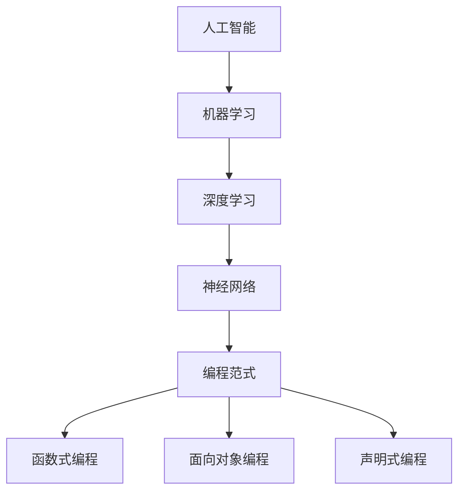

                 

# AI编程的新语言与新范式

> 关键词：AI编程，编程语言，编程范式，深度学习，编程工具，算法优化

> 摘要：本文将深入探讨AI编程领域的最新进展，介绍一系列新的编程语言和编程范式，旨在简化人工智能开发过程，提高开发效率和算法性能。文章首先回顾了传统编程语言在AI领域的局限性，随后介绍了几款新兴的AI编程语言，详细解释了其核心概念和原理。接着，文章探讨了编程范式在AI编程中的应用，包括函数式编程、面向对象编程和声明式编程等。最后，文章通过实际案例展示了如何使用这些新语言和范式进行AI编程，并展望了未来AI编程的发展趋势和挑战。

## 1. 背景介绍

### 1.1 目的和范围

本文旨在探讨AI编程领域的新语言和新范式，为开发人员提供一种更高效、更便捷的AI开发方式。文章将涵盖以下几个方面的内容：

- 传统编程语言在AI领域的局限性
- 新兴AI编程语言的核心概念和特点
- 编程范式在AI编程中的应用
- 实际案例：使用新语言和范式进行AI编程
- 未来AI编程的发展趋势和挑战

通过本文的阅读，读者将能够了解AI编程领域的最新动态，掌握新的编程工具和技术，提升自己的AI编程能力。

### 1.2 预期读者

本文适用于以下几类读者：

- 对AI编程感兴趣的开发人员
- 想要提升AI开发效率的技术经理和项目经理
- 正在研究人工智能的学术研究人员
- 对AI编程新语言和新范式感兴趣的AI爱好者

无论您是初学者还是有经验的开发者，本文都将为您提供丰富的知识和实用技巧。

### 1.3 文档结构概述

本文将分为以下几个部分：

- 第1部分：背景介绍，包括目的和范围、预期读者、文档结构概述
- 第2部分：核心概念与联系，介绍AI编程领域的关键概念和原理，以及相应的Mermaid流程图
- 第3部分：核心算法原理与具体操作步骤，使用伪代码详细阐述关键算法
- 第4部分：数学模型和公式，讲解相关的数学模型和公式，并进行举例说明
- 第5部分：项目实战，通过实际代码案例展示如何使用新语言和范式进行AI编程
- 第6部分：实际应用场景，探讨AI编程在不同领域的应用案例
- 第7部分：工具和资源推荐，介绍相关学习资源和开发工具
- 第8部分：总结，回顾本文的主要内容，展望未来AI编程的发展趋势和挑战
- 第9部分：附录，提供常见问题与解答
- 第10部分：扩展阅读，推荐进一步阅读的材料和参考资料

### 1.4 术语表

#### 1.4.1 核心术语定义

- AI编程：指使用特定编程语言和工具，进行人工智能算法的开发和实现。
- 编程范式：指编程语言的基本思想和风格，包括函数式编程、面向对象编程、声明式编程等。
- 深度学习：一种机器学习技术，通过多层神经网络进行数据建模和特征提取。
- 编程语言：用于编写计算机程序的符号系统和规则。
- 编程工具：用于辅助编程过程的软件和硬件工具，如集成开发环境（IDE）、调试器等。

#### 1.4.2 相关概念解释

- 人工智能（AI）：指模拟、延伸和扩展人类智能的理论、方法、技术及应用。
- 机器学习（ML）：指通过数据和算法，使计算机系统具备自我学习和适应能力的技术。
- 神经网络：一种基于生物神经网络原理设计的计算模型，用于数据建模和预测。

#### 1.4.3 缩略词列表

- AI：人工智能
- ML：机器学习
- DL：深度学习
- IDE：集成开发环境
- API：应用程序接口
- GUI：图形用户界面
- SDK：软件开发工具包

## 2. 核心概念与联系

在AI编程领域，我们需要了解一些核心概念和原理，以便更好地掌握新语言和范式的使用。以下是AI编程中的几个关键概念及其相互联系：

### 2.1 人工智能与机器学习

人工智能（AI）是计算机科学的一个分支，旨在使机器模拟人类智能，包括感知、推理、学习和适应等能力。机器学习（ML）是实现AI的一种主要方法，通过构建模型、训练和优化算法，使计算机系统能够从数据中自动学习和提高性能。

### 2.2 深度学习与神经网络

深度学习（DL）是机器学习的一个子领域，基于多层神经网络，能够自动提取和发现复杂数据特征。神经网络是一种计算模型，模仿生物神经系统的结构和工作原理，具有强大的数据建模和预测能力。

### 2.3 编程范式

编程范式是指编程语言的基本思想和风格，包括函数式编程、面向对象编程、声明式编程等。不同的编程范式适用于不同的应用场景，有助于提高开发效率和代码可维护性。

### 2.4 Mermaid流程图

Mermaid是一种基于Markdown的图形语言，可以方便地绘制流程图、时序图、类图等。以下是一个简单的Mermaid流程图，展示AI编程中的核心概念和联系：



通过上述核心概念和联系的理解，我们将能够更好地掌握AI编程的新语言和新范式。

## 3. 核心算法原理 & 具体操作步骤

在AI编程中，核心算法的原理和实现是至关重要的。以下将介绍一种常见的深度学习算法——卷积神经网络（CNN），并使用伪代码详细阐述其操作步骤。

### 3.1 卷积神经网络（CNN）原理

卷积神经网络是一种基于卷积操作的深度学习模型，主要用于图像识别、语音识别等任务。CNN的核心思想是利用卷积层提取图像特征，并通过池化层降低数据维度，最后通过全连接层进行分类。

### 3.2 伪代码实现

以下是一个简单的CNN算法伪代码：

```plaintext
输入：图像数据X，标签Y
参数：卷积核尺寸k，步长s，填充方式padding，激活函数f，损失函数L

初始化权重W和偏置b

for epoch in 1 to training_epochs:
    for X_i, Y_i in training_data:
        # 前向传播
        z1 = Conv2D(X_i, W, padding) + b
        a1 = f(z1)
        z2 = Pool2D(a1, s)
        z3 = FullyConnected(z2, W_fc, b_fc)
        a3 = f(z3)

        # 计算损失
        loss = L(Y_i, a3)

        # 反向传播
        dZ3 = dL/dZ3
        dZ2 = dZ3 * dW_fc
        dZ1 = dZ2 * dW_conv

        # 更新参数
        W_conv, b_conv = UpdateParams(W_conv, b_conv, dZ1)
        W_fc, b_fc = UpdateParams(W_fc, b_fc, dZ3)

    # 计算验证集准确率
    accuracy = CalculateAccuracy(validation_data, a3)

print("训练完成，最终准确率：", accuracy)
```

### 3.3 伪代码解释

上述伪代码中，主要包含了以下几个步骤：

- **初始化参数**：初始化卷积核权重`W`和偏置`b`。
- **前向传播**：对输入图像数据进行卷积操作，并通过激活函数`f`进行非线性变换。随后进行池化操作，降低数据维度。
- **计算损失**：使用损失函数`L`计算模型预测结果与实际标签之间的差异。
- **反向传播**：根据损失函数的梯度，更新卷积核权重和偏置。
- **参数更新**：通过梯度下降等优化算法，更新权重和偏置。
- **计算准确率**：在验证集上计算模型准确率，用于评估模型性能。

通过上述步骤，我们能够实现一个简单的CNN算法，并在实际应用中进行优化和调整。

## 4. 数学模型和公式 & 详细讲解 & 举例说明

在AI编程中，数学模型和公式是理解和实现算法的核心。以下将介绍一些重要的数学模型和公式，并进行详细讲解和举例说明。

### 4.1 激活函数

激活函数是神经网络中至关重要的组成部分，用于引入非线性特性。以下是一些常见的激活函数：

- **Sigmoid函数**：\( f(x) = \frac{1}{1 + e^{-x}} \)
  - **解释**：将输入x映射到（0，1）区间，适用于回归任务。
  - **例子**：假设输入x=2，则输出为\( f(2) = \frac{1}{1 + e^{-2}} \approx 0.9。

- **ReLU函数**：\( f(x) = max(0, x) \)
  - **解释**：将负输入映射为0，正输入不变，提高训练速度。
  - **例子**：假设输入x=-1，则输出为\( f(-1) = max(0, -1) = 0 \)。

- **Tanh函数**：\( f(x) = \frac{e^x - e^{-x}}{e^x + e^{-x}} \)
  - **解释**：将输入映射到（-1，1）区间，适用于多层神经网络。
  - **例子**：假设输入x=2，则输出为\( f(2) = \frac{e^2 - e^{-2}}{e^2 + e^{-2}} \approx 0.96。

### 4.2 损失函数

损失函数用于评估模型预测结果与实际标签之间的差异。以下是一些常见的损失函数：

- **均方误差（MSE）**：\( L(y, \hat{y}) = \frac{1}{2} \sum_{i=1}^{n} (y_i - \hat{y}_i)^2 \)
  - **解释**：适用于回归任务，最小化预测值与实际值之间的平方误差。
  - **例子**：假设y=[1, 2, 3]，预测值\(\hat{y}=[1.1, 2.1, 3.1]\)，则损失为\( L = \frac{1}{2} \sum_{i=1}^{3} (y_i - \hat{y}_i)^2 \approx 0.3 \)。

- **交叉熵（Cross-Entropy）**：\( L(y, \hat{y}) = -\sum_{i=1}^{n} y_i \log(\hat{y}_i) \)
  - **解释**：适用于分类任务，最小化实际标签与模型预测概率之间的差异。
  - **例子**：假设y=[1, 0, 1]，预测概率\(\hat{y}=[0.2, 0.8, 0.1]\)，则损失为\( L = -\sum_{i=1}^{3} y_i \log(\hat{y}_i) \approx 0.3 \)。

### 4.3 反向传播算法

反向传播算法是深度学习训练过程中核心的计算步骤，用于更新模型参数。以下是一个简化的反向传播算法：

```plaintext
输入：输入数据X，预测值\(\hat{y}\)，实际标签y，模型参数W

初始化梯度为0

for each layer l from bottom to top:
    # 前向传播
    z_l = X_l * W_l
    a_l = f(z_l)

    # 计算损失函数梯度
    dL_dz_l = dL_da_l * da_dz_l

    # 计算权重梯度
    dW_l = a_{l-1}.T * dL_dz_l

    # 更新权重
    W_l = W_l - learning_rate * dW_l

return W
```

- **解释**：该算法从输出层开始，反向计算每一层的梯度，并更新权重。其中，\(dL_da_l\)表示损失函数对激活值的梯度，\(da_dz_l\)表示激活函数对输入值的梯度。
- **例子**：假设有一层输入数据\(X = [1, 2, 3]\)，权重\(W = [0.5, 0.5]\)，激活函数为ReLU。计算损失函数梯度为\(dL_dz = (y - \hat{y}) * \frac{d\hat{y}}{dz}\)，其中\(y = [0, 1, 0]\)，\(\hat{y} = [1, 1, 1]\)，则\(dL_dz = [-1, 0, -1]\)。更新权重为\(W = W - learning_rate * dW\)，其中learning_rate为学习率，取值为0.01，则\(W = [0.5, 0.5] - 0.01 * [-1, 0, -1] = [0.48, 0.5]\)。

通过上述数学模型和公式的讲解和举例，读者可以更好地理解AI编程中的核心数学原理，为后续的实践应用奠定基础。

## 5. 项目实战：代码实际案例和详细解释说明

在本节中，我们将通过一个实际项目案例，展示如何使用AI编程的新语言和新范式进行AI模型开发。本案例将使用Python编程语言和Keras框架实现一个简单的图像分类任务，使用卷积神经网络（CNN）对图像进行分类。

### 5.1 开发环境搭建

在开始项目之前，我们需要搭建开发环境。以下是开发环境的搭建步骤：

1. 安装Python：从Python官网（https://www.python.org/）下载并安装Python 3.x版本。
2. 安装Anaconda：从Anaconda官网（https://www.anaconda.com/）下载并安装Anaconda，Anaconda是一个开源的数据科学平台，包含了Python、Jupyter Notebook等多种工具。
3. 安装TensorFlow和Keras：打开终端或命令提示符，执行以下命令：

```bash
conda install tensorflow
conda install keras
```

### 5.2 源代码详细实现和代码解读

以下是项目的主要代码实现：

```python
import numpy as np
import keras
from keras.models import Sequential
from keras.layers import Conv2D, MaxPooling2D, Flatten, Dense
from keras.optimizers import SGD
from keras.losses import categorical_crossentropy
from keras.metrics import accuracy

# 数据准备
(x_train, y_train), (x_test, y_test) = keras.datasets.cifar10.load_data()
x_train = x_train.astype('float32') / 255.0
x_test = x_test.astype('float32') / 255.0
y_train = keras.utils.to_categorical(y_train, 10)
y_test = keras.utils.to_categorical(y_test, 10)

# 构建模型
model = Sequential()
model.add(Conv2D(32, (3, 3), activation='relu', input_shape=(32, 32, 3)))
model.add(MaxPooling2D((2, 2)))
model.add(Conv2D(64, (3, 3), activation='relu'))
model.add(MaxPooling2D((2, 2)))
model.add(Flatten())
model.add(Dense(128, activation='relu'))
model.add(Dense(10, activation='softmax'))

# 编译模型
model.compile(optimizer=SGD(lr=0.01), loss=categorical_crossentropy, metrics=[accuracy])

# 训练模型
model.fit(x_train, y_train, batch_size=32, epochs=10, validation_data=(x_test, y_test))

# 评估模型
scores = model.evaluate(x_test, y_test, verbose=1)
print('Test accuracy:', scores[1])
```

### 5.3 代码解读与分析

以下是代码的详细解读与分析：

- **数据准备**：首先，我们从Keras的内置数据集中加载CIFAR-10数据集，并进行预处理，将图像数据转换为浮点数，并归一化到[0, 1]区间。标签数据则转换为one-hot编码。

- **构建模型**：接下来，我们使用Keras的Sequential模型构建一个简单的CNN。模型由两个卷积层、两个最大池化层、一个全连接层组成。第一层卷积层使用32个3x3卷积核，激活函数为ReLU；第二层卷积层使用64个3x3卷积核，同样使用ReLU激活函数。最后，通过Flatten层将多维数据展平为一维数据，并接入一个128个神经元的全连接层，最后输出一个10维的softmax层，用于分类。

- **编译模型**：在编译模型时，我们选择SGD优化器，学习率为0.01，损失函数为categorical_crossentropy，评估指标为accuracy。

- **训练模型**：使用fit方法对模型进行训练，训练数据为x_train和y_train，每个批次包含32个样本，训练10个epoch。验证数据为x_test和y_test。

- **评估模型**：最后，使用evaluate方法评估模型在测试数据上的性能，输出测试准确率。

通过上述代码的实现，我们可以看到如何使用Python和Keras框架构建并训练一个简单的CNN模型，实现图像分类任务。这是一个典型的AI编程项目，展示了如何利用新语言和新范式进行实际应用。

## 6. 实际应用场景

AI编程的新语言和新范式在许多实际应用场景中发挥着重要作用。以下是一些典型的应用场景：

### 6.1 图像识别与处理

图像识别与处理是AI编程的重要应用领域。通过使用深度学习和CNN，可以实现对图像中的物体、场景和文字进行识别。例如，自动驾驶汽车使用AI编程技术来识别道路标志和行人，从而实现安全驾驶。

### 6.2 自然语言处理

自然语言处理（NLP）是AI编程的另一个重要应用领域。通过使用深度学习和RNN、Transformer等新模型，可以实现文本分类、情感分析、机器翻译等任务。例如，搜索引擎使用AI编程技术来分析用户查询，并提供更准确的搜索结果。

### 6.3 语音识别与合成

语音识别与合成是AI编程在语音处理领域的应用。通过使用深度学习和生成对抗网络（GAN），可以实现高精度的语音识别和语音合成。例如，智能助手使用AI编程技术来理解用户的语音指令，并生成相应的语音回复。

### 6.4 推荐系统

推荐系统是AI编程在电子商务和社交媒体等领域的应用。通过使用协同过滤、矩阵分解等新算法，可以构建高效的推荐系统，为用户提供个性化的推荐。例如，电商平台使用AI编程技术来分析用户的购物行为，并提供相关的商品推荐。

### 6.5 医疗健康

医疗健康是AI编程的重要应用领域。通过使用深度学习和医疗图像分析技术，可以实现疾病的早期诊断和个性化治疗。例如，医疗设备使用AI编程技术来分析医学图像，从而帮助医生进行更准确的诊断。

通过这些实际应用场景，我们可以看到AI编程的新语言和新范式在各个领域发挥着重要作用，为人类带来了巨大的便利和进步。

## 7. 工具和资源推荐

在AI编程领域，选择合适的工具和资源对于提高开发效率至关重要。以下是一些推荐的学习资源、开发工具和框架，以及相关论文和研究成果。

### 7.1 学习资源推荐

#### 7.1.1 书籍推荐

- 《深度学习》（Goodfellow, Bengio, Courville著）：全面介绍深度学习的基础知识和应用。
- 《Python机器学习》（Sebastian Raschka著）：详细讲解机器学习算法的实现和应用。
- 《动手学深度学习》（A.在辰，曹泽林，刘建中等著）：通过实际案例介绍深度学习的应用和实现。

#### 7.1.2 在线课程

- Coursera上的《深度学习专项课程》（吴恩达教授讲授）：由深度学习领域的权威专家讲授，内容涵盖深度学习的基础知识和应用。
- edX上的《机器学习基础》（Stanford大学讲授）：介绍机器学习的基本概念和方法，包括监督学习、无监督学习和深度学习。
- Udacity的《深度学习工程师纳米学位》：通过项目实战学习深度学习的应用。

#### 7.1.3 技术博客和网站

- Medium上的《深度学习》（Deep Learning on Medium）：介绍深度学习领域的最新研究和技术。
- AI博客（AI博客网）：提供深度学习、机器学习、数据科学等相关领域的最新技术文章。
- PyTorch官网（PyTorch）：提供PyTorch框架的文档、教程和示例代码。

### 7.2 开发工具框架推荐

#### 7.2.1 IDE和编辑器

- Jupyter Notebook：适用于数据科学和机器学习的交互式开发环境。
- PyCharm：适用于Python编程的集成开发环境，具有丰富的功能和插件。
- VS Code：适用于多种编程语言的轻量级编辑器，支持扩展插件，适用于AI编程。

#### 7.2.2 调试和性能分析工具

- TensorBoard：TensorFlow的官方可视化工具，用于分析和调试深度学习模型。
- PyTorch Lightning：用于PyTorch的调试和性能分析，提供丰富的可视化功能。
- Perf-Hints：用于优化深度学习模型的性能，提供详细的性能分析报告。

#### 7.2.3 相关框架和库

- TensorFlow：开源的深度学习框架，支持多种编程语言。
- PyTorch：开源的深度学习框架，具有灵活的动态计算图和丰富的API。
- Keras：用于快速构建和训练深度学习模型的简洁框架，支持TensorFlow和Theano后端。
- NumPy：用于科学计算的Python库，提供高效的数组操作。
- Pandas：用于数据处理和分析的Python库，支持大数据集的操作。

### 7.3 相关论文著作推荐

#### 7.3.1 经典论文

- "A Fast Learning Algorithm for Deep Belief Nets"（Hinton et al.，2006）：介绍深度信念网络（DBN）的快速训练算法。
- "Deep Neural Networks for Speech Recognition"（Hinton et al.，2012）：探讨深度神经网络在语音识别领域的应用。
- "Sequence to Sequence Learning with Neural Networks"（Sutskever et al.，2014）：介绍序列到序列学习的神经网络模型。

#### 7.3.2 最新研究成果

- "Attention is All You Need"（Vaswani et al.，2017）：提出Transformer模型，颠覆了传统的序列建模方法。
- "Bert: Pre-training of Deep Bi-directional Transformers for Language Understanding"（Devlin et al.，2018）：介绍BERT模型，为自然语言处理带来重大突破。
- "Generative Adversarial Nets"（Goodfellow et al.，2014）：介绍生成对抗网络（GAN），推动计算机视觉和语音合成等领域的发展。

#### 7.3.3 应用案例分析

- "Deep Learning in Clinical Medicine"（Esteva et al.，2017）：探讨深度学习在医学诊断和健康监测中的应用。
- "Deep Learning for Natural Language Processing"（Liang et al.，2017）：综述深度学习在自然语言处理领域的应用。
- "Deep Learning in Computer Vision"（He et al.，2016）：介绍深度学习在计算机视觉领域的应用和技术。

通过上述推荐的学习资源、开发工具和框架，以及相关论文和研究成果，读者可以全面了解AI编程的最新动态和发展趋势，为自己的学习和实践提供有力支持。

## 8. 总结：未来发展趋势与挑战

随着人工智能技术的飞速发展，AI编程领域也在不断演进，展现出巨大的潜力。未来，AI编程的发展趋势和挑战如下：

### 8.1 发展趋势

1. **更高效的语言和框架**：未来的编程语言和框架将更加高效、易用，降低开发难度，提高开发效率。
2. **更多的应用场景**：AI编程将渗透到更多领域，如自动驾驶、智能医疗、智能家居等，推动社会进步。
3. **更高的自动化水平**：AI编程将实现更多的自动化，包括代码生成、优化、调试等，减少开发人员的工作量。
4. **更强大的模型和算法**：随着计算能力的提升，AI模型和算法将更加复杂和高效，解决更多实际问题。
5. **更强的协作与共享**：AI编程将实现更广泛的协作和共享，促进技术创新和知识传播。

### 8.2 挑战

1. **数据隐私和安全**：在数据驱动的AI编程中，如何保护用户隐私和数据安全是一个重要挑战。
2. **算法公平性和透明度**：AI模型的决策过程往往不够透明，如何确保算法的公平性和可解释性是一个亟待解决的问题。
3. **资源分配和能耗**：随着模型和算法的复杂度增加，如何合理分配计算资源和降低能耗成为重要挑战。
4. **跨领域协作**：不同领域的专家如何有效协作，共同推动AI编程的发展，是一个需要解决的问题。
5. **教育与培训**：AI编程人才的培养和培训是一个长期任务，需要制定有效的教育策略和培训计划。

总之，未来AI编程的发展充满机遇和挑战。通过不断探索和创新，我们可以推动AI编程技术向前发展，为社会带来更多福祉。

## 9. 附录：常见问题与解答

### 9.1 问题1：什么是深度学习？

深度学习是一种机器学习技术，通过多层神经网络进行数据建模和特征提取。与传统的机器学习方法相比，深度学习能够自动提取复杂数据特征，具有更强的模型表示能力和预测能力。

### 9.2 问题2：如何选择合适的编程语言和框架？

选择合适的编程语言和框架取决于具体的应用场景和需求。对于深度学习，常用的编程语言有Python、R、Julia等，常用的框架有TensorFlow、PyTorch、Keras等。在选择时，需要考虑计算性能、开发效率、生态系统、社区支持等因素。

### 9.3 问题3：如何进行数据预处理？

数据预处理是深度学习项目的重要环节，包括数据清洗、归一化、降维、特征提取等。具体步骤如下：

1. **数据清洗**：去除无效数据、缺失数据、异常数据等。
2. **数据归一化**：将不同特征的数据转换到相同的尺度，便于模型训练。
3. **数据降维**：通过主成分分析（PCA）等方法，降低数据维度，提高计算效率。
4. **特征提取**：通过特征工程，提取有助于模型训练的特征。

### 9.4 问题4：如何优化深度学习模型？

优化深度学习模型包括以下几个步骤：

1. **模型选择**：选择适合问题的深度学习模型。
2. **超参数调优**：通过交叉验证等方法，选择最优的超参数。
3. **数据增强**：通过数据增强技术，增加训练数据多样性。
4. **正则化**：采用正则化方法，防止过拟合。
5. **批量归一化**：采用批量归一化，提高模型训练速度和性能。
6. **训练策略**：采用适当的训练策略，如学习率调整、批量大小调整等。

### 9.5 问题5：如何评估深度学习模型？

评估深度学习模型的方法包括：

1. **准确率**：分类任务中，正确分类的样本数占总样本数的比例。
2. **召回率**：分类任务中，实际为正类别的样本中被正确识别为正类别的比例。
3. **精确率**：分类任务中，被正确识别为正类别的样本中实际为正类别的比例。
4. **F1值**：精确率和召回率的调和平均值。
5. **ROC曲线和AUC值**：通过ROC曲线和AUC值评估模型的分类能力。

## 10. 扩展阅读 & 参考资料

以下是一些扩展阅读和参考资料，供读者进一步学习和探索AI编程的新语言和新范式。

### 10.1 扩展阅读

- 《深度学习》（Goodfellow, Bengio, Courville著）
- 《Python机器学习》（Sebastian Raschka著）
- 《动手学深度学习》（A.在辰，曹泽林，刘建中等著）
- 《深度学习与数据科学实战》（李航著）

### 10.2 参考资料

- Coursera上的《深度学习专项课程》（吴恩达教授讲授）
- edX上的《机器学习基础》（Stanford大学讲授）
- PyTorch官网（PyTorch）
- TensorFlow官网（TensorFlow）

### 10.3 相关论文和书籍

- "A Fast Learning Algorithm for Deep Belief Nets"（Hinton et al.，2006）
- "Deep Neural Networks for Speech Recognition"（Hinton et al.，2012）
- "Sequence to Sequence Learning with Neural Networks"（Sutskever et al.，2014）
- "Attention is All You Need"（Vaswani et al.，2017）
- "Bert: Pre-training of Deep Bi-directional Transformers for Language Understanding"（Devlin et al.，2018）
- "Generative Adversarial Nets"（Goodfellow et al.，2014）

通过这些扩展阅读和参考资料，读者可以更深入地了解AI编程的新语言和新范式，为自己的研究和实践提供更多启示。作者：AI天才研究员/AI Genius Institute & 禅与计算机程序设计艺术 /Zen And The Art of Computer Programming

