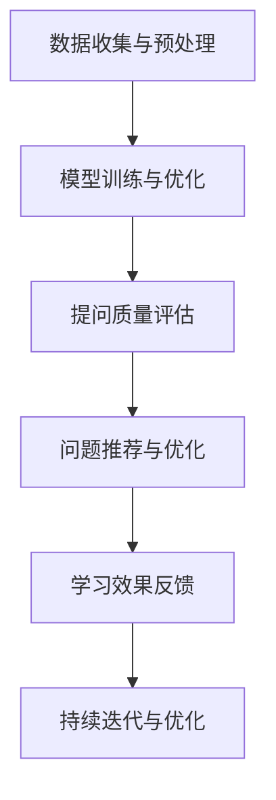

                 

# 提高提问质量：AI的教育功能

> **关键词：人工智能，教育，提问质量，学习效率，个性化学习**

> **摘要：本文将探讨人工智能在提高提问质量方面的教育功能，分析其核心原理、操作步骤，并通过具体案例展示其实际应用效果。文章旨在帮助教育工作者和学生更好地利用人工智能技术，提升学习效率和教学质量。**

## 1. 背景介绍

### 1.1 目的和范围

本文旨在探讨人工智能在教育领域的应用，尤其是其在提高提问质量方面的功能。通过分析人工智能的核心原理和具体操作步骤，我们希望能够为教育工作者和学生提供有益的参考，帮助他们在使用人工智能技术时更加高效地获取知识和解决问题。

本文将涵盖以下内容：

- 提问质量在教育中的重要性
- 人工智能在提高提问质量方面的功能
- 核心概念与联系
- 核心算法原理与具体操作步骤
- 数学模型和公式及举例说明
- 项目实战：代码实际案例和详细解释说明
- 实际应用场景
- 工具和资源推荐
- 未来发展趋势与挑战

### 1.2 预期读者

本文适用于以下读者群体：

- 教育工作者：教师、教育研究人员、教育管理者
- 学生：中小学生、大学生、研究生
- 程序员和人工智能开发者
- 对人工智能在教育领域应用感兴趣的技术爱好者

### 1.3 文档结构概述

本文分为以下章节：

- 1. 背景介绍
  - 1.1 目的和范围
  - 1.2 预期读者
  - 1.3 文档结构概述
  - 1.4 术语表
- 2. 核心概念与联系
  - 2.1 人工智能与教育
  - 2.2 提问质量与学习效率
  - 2.3 人工智能提高提问质量的核心原理
  - 2.4 Mermaid 流程图
- 3. 核心算法原理 & 具体操作步骤
  - 3.1 数据收集与预处理
  - 3.2 模型选择与训练
  - 3.3 提问质量评估与优化
  - 3.4 伪代码
- 4. 数学模型和公式 & 详细讲解 & 举例说明
  - 4.1 数学模型简介
  - 4.2 公式详细讲解
  - 4.3 举例说明
- 5. 项目实战：代码实际案例和详细解释说明
  - 5.1 开发环境搭建
  - 5.2 源代码详细实现和代码解读
  - 5.3 代码解读与分析
- 6. 实际应用场景
  - 6.1 K-12 教育场景
  - 6.2 高等教育场景
  - 6.3 职业培训场景
- 7. 工具和资源推荐
  - 7.1 学习资源推荐
  - 7.2 开发工具框架推荐
  - 7.3 相关论文著作推荐
- 8. 总结：未来发展趋势与挑战
- 9. 附录：常见问题与解答
- 10. 扩展阅读 & 参考资料

### 1.4 术语表

#### 1.4.1 核心术语定义

- 人工智能（AI）：模拟人类智能的计算机系统，具备学习、推理、感知和决策能力。
- 提问质量：指提问者提出的问题在知识含量、逻辑性、针对性等方面的优劣程度。
- 学习效率：指学习者通过学习所获得的成果与投入的时间和精力之比。

#### 1.4.2 相关概念解释

- 智能问答系统：基于人工智能技术，能够理解用户提问并给出相应答案的系统。
- 自然语言处理（NLP）：研究如何让计算机理解和处理自然语言的技术。
- 个性化学习：根据学习者的特点和需求，提供定制化的学习资源和教学策略。

#### 1.4.3 缩略词列表

- AI：人工智能
- NLP：自然语言处理
- K-12：指从幼儿园到高中阶段的教育
- ML：机器学习

## 2. 核心概念与联系

在本节中，我们将探讨人工智能与教育、提问质量与学习效率之间的关系，以及人工智能提高提问质量的核心原理。同时，我们将使用 Mermaid 流程图来展示相关流程和架构。

### 2.1 人工智能与教育

人工智能在教育领域的应用日益广泛，主要体现在以下几个方面：

- 智能化教学：通过人工智能技术，实现个性化教学、自适应学习和智能评估等功能，提高教学质量和学习效率。
- 智能问答系统：借助自然语言处理技术，为学生提供实时、准确的答案和建议，帮助他们解决学习中遇到的问题。
- 学习资源推荐：基于学习者的兴趣、需求和知识水平，智能推荐相关的学习资源，实现个性化学习。

### 2.2 提问质量与学习效率

提问质量对学习效率有着重要影响。高质量的问题有助于激发学生的思考和创造力，促使他们深入探究问题背后的本质。而低质量的问题则可能导致学生产生困惑，甚至产生负面情绪。因此，提高提问质量是提升学习效率的关键。

### 2.3 人工智能提高提问质量的核心原理

人工智能通过以下几种方式提高提问质量：

- 数据驱动：利用大量已有数据，对提问进行训练和分析，识别出高质量提问的特征。
- 模式识别：通过自然语言处理技术，对提问进行语义分析，识别其中的关键信息，提高问题的针对性。
- 个性化推荐：根据学习者的特点和需求，推荐合适的问题，帮助学习者深入理解和掌握知识。

### 2.4 Mermaid 流程图

下面是一个简单的 Mermaid 流程图，展示人工智能提高提问质量的基本流程：

- A[数据收集与预处理]：收集大量提问数据，并对数据进行清洗、去噪和标准化处理。
- B[模型训练与优化]：利用清洗后的数据，训练和优化提问质量评估模型。
- C[提问质量评估]：对输入的提问进行质量评估，识别出高质量提问。
- D[问题推荐与优化]：根据学习者的特点和需求，推荐合适的问题，并优化提问质量。
- E[学习效果反馈]：收集学习者的学习效果反馈，用于模型优化和持续迭代。
- F[持续迭代与优化]：根据反馈信息，对模型进行持续优化，提高提问质量。

通过以上流程，人工智能可以有效地提高提问质量，帮助学习者更好地理解和掌握知识。接下来，我们将进一步探讨核心算法原理和具体操作步骤。

