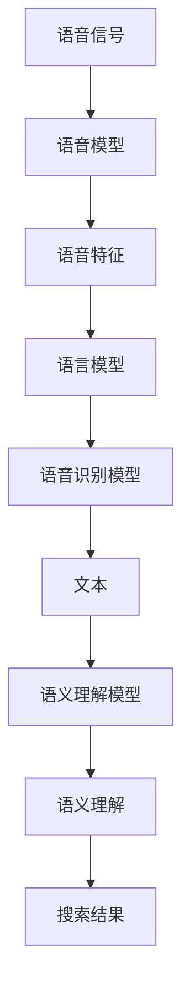
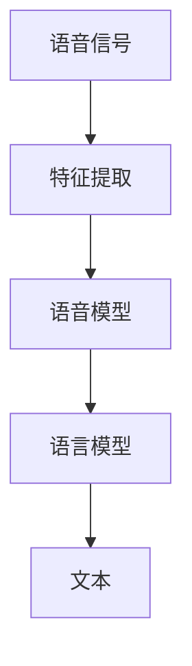
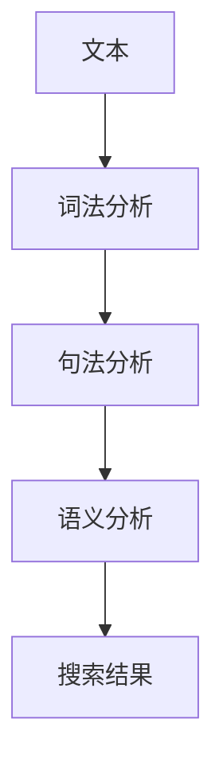
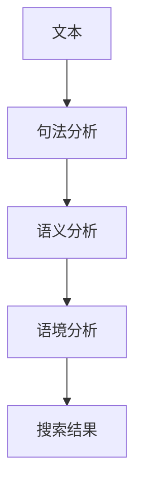

                 


## 搜索引擎的语音交互优化

> 关键词：搜索引擎、语音交互、优化、算法原理、数学模型、项目实战、实际应用场景、工具和资源推荐

> 摘要：本文将深入探讨搜索引擎的语音交互优化，从核心概念、算法原理、数学模型到项目实战，全面解析如何提升语音搜索体验。文章旨在为读者提供清晰、实用的指导，帮助他们更好地理解和应用语音交互技术，从而推动搜索引擎技术的发展和普及。

### 1. 背景介绍

#### 1.1 目的和范围

随着语音识别技术的迅速发展，语音交互已成为现代搜索引擎不可或缺的一部分。本文旨在探讨如何优化搜索引擎的语音交互功能，提高用户使用体验和搜索效率。我们将从以下几个方面展开讨论：

1. **核心概念与联系**：介绍语音识别、自然语言处理等核心概念，以及它们在搜索引擎中的应用。
2. **核心算法原理 & 具体操作步骤**：详细阐述语音识别和语义理解的算法原理，以及如何将这些算法应用于搜索引擎优化。
3. **数学模型和公式 & 详细讲解 & 举例说明**：讲解支持向量机、神经网络等机器学习模型在语音识别中的数学基础和应用。
4. **项目实战：代码实际案例和详细解释说明**：通过实际代码示例，展示如何实现语音交互优化。
5. **实际应用场景**：分析语音交互在搜索引擎中的各种应用场景，探讨其优势和挑战。
6. **工具和资源推荐**：推荐学习资源、开发工具和框架，帮助读者深入了解和掌握语音交互优化技术。

#### 1.2 预期读者

本文面向具有一定编程基础和人工智能背景的读者，包括：

1. **程序员和工程师**：希望了解语音交互技术在搜索引擎中的应用和优化策略。
2. **人工智能和自然语言处理研究者**：对语音识别和语义理解算法原理和实现方法感兴趣。
3. **搜索引擎开发和运营人员**：希望提高搜索引擎的语音交互功能，提升用户体验。

#### 1.3 文档结构概述

本文分为十个部分，结构如下：

1. **背景介绍**：介绍文章的目的、范围和预期读者。
2. **核心概念与联系**：讲解语音识别、自然语言处理等核心概念和它们在搜索引擎中的应用。
3. **核心算法原理 & 具体操作步骤**：详细阐述语音识别和语义理解的算法原理。
4. **数学模型和公式 & 详细讲解 & 举例说明**：讲解支持向量机、神经网络等机器学习模型在语音识别中的数学基础和应用。
5. **项目实战：代码实际案例和详细解释说明**：通过实际代码示例，展示如何实现语音交互优化。
6. **实际应用场景**：分析语音交互在搜索引擎中的各种应用场景。
7. **工具和资源推荐**：推荐学习资源、开发工具和框架。
8. **总结：未来发展趋势与挑战**：展望语音交互优化技术的未来发展方向和挑战。
9. **附录：常见问题与解答**：解答读者可能遇到的问题。
10. **扩展阅读 & 参考资料**：提供相关参考文献和资源。

#### 1.4 术语表

**语音识别（Speech Recognition）**：将语音信号转换为相应的文本或命令。

**自然语言处理（Natural Language Processing，NLP）**：使计算机能够理解和处理人类语言。

**语义理解（Semantic Understanding）**：理解文本或语音中的含义，包括句法、语义和语境。

**支持向量机（Support Vector Machine，SVM）**：一种常用的机器学习模型，用于分类和回归任务。

**神经网络（Neural Network）**：模仿生物神经系统的计算模型，用于数据处理和模式识别。

**语音交互（Voice Interaction）**：用户通过语音与设备或系统进行交互。

#### 1.4.1 核心术语定义

- **语音信号**：人类声音产生的声波信号。
- **文本**：用文字表示的信息。
- **语音模型**：用于生成语音信号的数学模型。
- **语言模型**：用于预测文本序列的概率分布。
- **语音识别模型**：用于将语音信号转换为文本的机器学习模型。
- **语义理解模型**：用于理解文本或语音中含义的机器学习模型。

#### 1.4.2 相关概念解释

- **语音识别**：语音识别是一种将语音信号转换为文本或命令的技术。它包括语音信号处理、特征提取、模型训练和解码等步骤。
- **自然语言处理**：自然语言处理是一种使计算机能够理解和处理人类语言的技术。它涉及文本处理、语音识别、语义理解、语言生成等任务。
- **语义理解**：语义理解是一种理解文本或语音中含义的技术。它涉及句法、语义和语境分析，使计算机能够理解人类语言的表达方式。
- **支持向量机**：支持向量机是一种用于分类和回归任务的机器学习模型。它通过找到一个最优的超平面来分离不同类别的数据点。
- **神经网络**：神经网络是一种模仿生物神经系统的计算模型。它由多个神经元组成，通过调整神经元之间的连接权重来实现数据的处理和模式识别。

#### 1.4.3 缩略词列表

- **NLP**：自然语言处理
- **SVM**：支持向量机
- **NN**：神经网络
- **ASR**：自动语音识别
- **TTS**：语音合成
- **NLU**：自然语言理解
- **SLU**：语义理解

### 2. 核心概念与联系

在搜索引擎的语音交互优化中，核心概念包括语音识别、自然语言处理、语义理解、语音模型和语言模型等。这些概念相互关联，共同构成了语音交互优化体系。以下是一个简化的Mermaid流程图，展示了这些概念之间的联系：



#### 2.1 语音识别

语音识别是将语音信号转换为文本的过程。首先，我们需要从语音信号中提取特征，如频谱特征、短时傅里叶变换（STFT）特征等。然后，使用语音模型和语言模型对特征进行建模，从而生成文本。常用的语音识别模型包括隐马尔可夫模型（HMM）、高斯混合模型（GMM）和深度神经网络（DNN）。



#### 2.2 自然语言处理

自然语言处理是一种使计算机能够理解和处理人类语言的技术。它涉及文本处理、语音识别、语义理解、语言生成等任务。在搜索引擎中，自然语言处理技术用于理解用户的查询意图、提取关键词、提供相关搜索结果等。



#### 2.3 语义理解

语义理解是自然语言处理的核心任务之一，旨在理解文本或语音中的含义。它涉及句法、语义和语境分析。在搜索引擎中，语义理解技术用于解析用户的查询意图，从而提供更准确的搜索结果。



#### 2.4 语音模型和语言模型

语音模型和语言模型是语音识别中的关键组件。语音模型用于将语音信号转换为特征表示，语言模型用于预测文本序列的概率分布。深度神经网络（DNN）和循环神经网络（RNN）是常用的语音模型和语言模型。


### 3. 核心算法原理 & 具体操作步骤

在搜索引擎的语音交互优化中，核心算法原理包括语音识别、自然语言处理、语义理解和搜索结果生成。以下将详细讲解这些算法原理，并提供具体操作步骤。

#### 3.1 语音识别

语音识别是将语音信号转换为文本的过程。以下是一个简单的语音识别算法原理和具体操作步骤：

**算法原理：**

1. **特征提取**：从语音信号中提取特征，如频谱特征、短时傅里叶变换（STFT）特征等。
2. **语音模型**：使用语音模型对特征进行建模，如隐马尔可夫模型（HMM）、高斯混合模型（GMM）和深度神经网络（DNN）。
3. **语言模型**：使用语言模型预测文本序列的概率分布，如n-gram模型、神经网络语言模型等。
4. **解码**：使用解码算法将语音模型和语言模型生成的文本序列转换为最终的文本输出。

**具体操作步骤：**

1. **数据预处理**：读取语音信号，进行降噪、归一化等处理，以便后续特征提取。
2. **特征提取**：使用短时傅里叶变换（STFT）等方法，从语音信号中提取特征向量。
3. **训练语音模型**：使用语音数据集训练语音模型，如HMM、GMM或DNN。
4. **训练语言模型**：使用文本数据集训练语言模型，如n-gram模型或神经网络语言模型。
5. **语音识别**：将语音信号输入语音模型，解码生成文本输出。

以下是一个简单的伪代码示例：

```python
def voice_recognition(voice_signal):
    # 数据预处理
    preprocessed_signal = preprocess(voice_signal)

    # 特征提取
    features = extract_features(preprocessed_signal)

    # 训练语音模型
    voice_model = train_voice_model(features)

    # 训练语言模型
    language_model = train_language_model(text_data)

    # 解码
    text_output = decode(voice_model, language_model)

    return text_output
```

#### 3.2 自然语言处理

自然语言处理用于理解用户的查询意图、提取关键词和提供相关搜索结果。以下是一个简单的自然语言处理算法原理和具体操作步骤：

**算法原理：**

1. **词法分析**：将文本拆分为单词、短语等基本元素。
2. **句法分析**：分析文本的句法和语法结构，提取句子成分。
3. **语义分析**：理解文本的含义，提取实体、关系和语义角色。
4. **搜索结果生成**：根据用户查询意图和文本分析结果，生成相关搜索结果。

**具体操作步骤：**

1. **文本输入**：读取用户输入的查询文本。
2. **词法分析**：使用分词器将文本拆分为单词和短语。
3. **句法分析**：使用句法分析器提取句子成分。
4. **语义分析**：使用实体识别、关系提取和语义角色标注等技术，理解文本的含义。
5. **搜索结果生成**：根据用户查询意图和文本分析结果，从索引数据库中检索相关文档，并生成搜索结果。

以下是一个简单的伪代码示例：

```python
def natural_language_processing(text_input):
    # 词法分析
    tokens = tokenize(text_input)

    # 句法分析
    sentence_structure = parse_sentence(tokens)

    # 语义分析
    entities = extract_entities(sentence_structure)
    relationships = extract_relationships(sentence_structure)

    # 搜索结果生成
    search_results = generate_search_results(entities, relationships)

    return search_results
```

#### 3.3 语义理解

语义理解是自然语言处理的核心任务之一，旨在理解文本或语音中的含义。以下是一个简单的语义理解算法原理和具体操作步骤：

**算法原理：**

1. **词义消歧**：确定文本中的单词在不同上下文中的含义。
2. **实体识别**：识别文本中的实体，如人名、地名、组织等。
3. **关系提取**：提取文本中的实体关系，如人物关系、地点关系等。
4. **语义角色标注**：为文本中的实体和关系标注语义角色。

**具体操作步骤：**

1. **文本输入**：读取用户输入的查询文本。
2. **词义消歧**：使用词义消歧算法确定文本中单词的含义。
3. **实体识别**：使用实体识别算法识别文本中的实体。
4. **关系提取**：使用关系提取算法提取文本中的实体关系。
5. **语义角色标注**：为文本中的实体和关系标注语义角色。

以下是一个简单的伪代码示例：

```python
def semantic_understanding(text_input):
    # 词义消歧
    word_sense = resolve_word_sense(text_input)

    # 实体识别
    entities = identify_entities(text_input)

    # 关系提取
    relationships = extract_relationships(text_input)

    # 语义角色标注
    roles = annotate_roles(entities, relationships)

    return word_sense, entities, relationships, roles
```

#### 3.4 搜索结果生成

搜索结果生成是根据用户查询意图和文本分析结果，从索引数据库中检索相关文档，并生成搜索结果。以下是一个简单的搜索结果生成算法原理和具体操作步骤：

**算法原理：**

1. **查询意图分析**：分析用户的查询意图，确定搜索结果的相关性。
2. **检索算法**：从索引数据库中检索相关文档。
3. **排序算法**：根据文档的相关性对检索结果进行排序。
4. **搜索结果生成**：生成用户友好的搜索结果页面。

**具体操作步骤：**

1. **查询意图分析**：使用自然语言处理和语义理解技术，分析用户的查询意图。
2. **检索算法**：从索引数据库中检索与查询意图相关的文档。
3. **排序算法**：根据文档的相关性、标题、摘要等特征对检索结果进行排序。
4. **搜索结果生成**：生成包含标题、摘要、链接等信息的搜索结果页面。

以下是一个简单的伪代码示例：

```python
def generate_search_results(query_intent, documents):
    # 检索相关文档
    relevant_documents = retrieve_documents(documents, query_intent)

    # 排序算法
    sorted_documents = sort_documents(relevant_documents)

    # 生成搜索结果
    search_results = create_search_results_page(sorted_documents)

    return search_results
```

### 4. 数学模型和公式 & 详细讲解 & 举例说明

在搜索引擎的语音交互优化中，数学模型和公式发挥着至关重要的作用。以下将详细介绍支持向量机（SVM）、神经网络（NN）、隐马尔可夫模型（HMM）等数学模型在语音识别、自然语言处理和语义理解中的应用。

#### 4.1 支持向量机（SVM）

支持向量机是一种常用的机器学习模型，用于分类和回归任务。在语音识别中，SVM可用于语音信号的分类和识别。

**SVM基本原理：**

SVM通过找到一个最优的超平面，将不同类别的数据点分离。超平面由一个权重向量（w）和一个偏置项（b）定义，使得数据点到超平面的距离最大化。

$$
w \cdot x - b = 0
$$

其中，\(x\) 表示数据点，\(w\) 表示权重向量，\(b\) 表示偏置项。

**SVM优化目标：**

最大化 \(w \cdot w\)，即最小化 \(w^2\)。

$$
\min_{w,b} \frac{1}{2}w^2
$$

**SVM求解方法：**

SVM的求解方法包括原始求解和其对偶求解。原始求解通过拉格朗日乘子法求解，其对偶求解通过KKT条件求解。

**SVM举例说明：**

假设我们有一个二分类问题，数据集包含正类和负类，我们可以使用SVM进行分类和识别。

1. **数据预处理**：将数据集划分为训练集和测试集。
2. **特征提取**：从语音信号中提取特征，如频谱特征、短时傅里叶变换（STFT）特征等。
3. **训练SVM模型**：使用训练集数据训练SVM模型，优化权重向量（w）和偏置项（b）。
4. **测试SVM模型**：使用测试集数据测试SVM模型的分类性能。

以下是一个简单的SVM伪代码示例：

```python
def svm_classification(train_data, train_labels):
    # 特征提取
    features = extract_features(train_data)

    # 训练SVM模型
    svm_model = train_svm(features, train_labels)

    # 测试SVM模型
    test_data = extract_features(test_data)
    test_labels = predict_labels(svm_model, test_data)

    return test_labels
```

#### 4.2 神经网络（NN）

神经网络是一种模仿生物神经系统的计算模型，用于数据处理和模式识别。在语音识别、自然语言处理和语义理解中，神经网络发挥着重要作用。

**NN基本原理：**

神经网络由多个神经元组成，每个神经元接收多个输入，并通过激活函数进行非线性变换，最后产生输出。神经网络的训练过程是通过反向传播算法，不断调整神经元之间的连接权重，使得网络能够对输入数据进行准确的分类和识别。

$$
a_{i}^{(l)} = \sigma(\sum_{j} w_{ij}^{(l)} a_{j}^{(l-1)})
$$

其中，\(a_{i}^{(l)}\) 表示第 \(l\) 层第 \(i\) 个神经元的输出，\(\sigma\) 表示激活函数，\(w_{ij}^{(l)}\) 表示第 \(l\) 层第 \(i\) 个神经元与第 \(l-1\) 层第 \(j\) 个神经元之间的权重。

**NN优化目标：**

最小化损失函数，通常使用均方误差（MSE）作为损失函数。

$$
\min_{w,b} \frac{1}{2n} \sum_{i=1}^{n} (\hat{y}_i - y_i)^2
$$

其中，\(\hat{y}_i\) 表示预测输出，\(y_i\) 表示真实输出。

**NN求解方法：**

神经网络的求解方法包括前向传播和反向传播。前向传播用于计算网络的输出，反向传播用于计算梯度并更新网络权重。

**NN举例说明：**

假设我们使用一个简单的多层感知器（MLP）神经网络进行语音信号分类。

1. **数据预处理**：将数据集划分为训练集和测试集。
2. **特征提取**：从语音信号中提取特征，如频谱特征、短时傅里叶变换（STFT）特征等。
3. **训练神经网络**：使用训练集数据训练神经网络，优化连接权重（\(w\)）和偏置项（\(b\)）。
4. **测试神经网络**：使用测试集数据测试神经网络的分类性能。

以下是一个简单的NN伪代码示例：

```python
def neural_network_classification(train_data, train_labels):
    # 特征提取
    features = extract_features(train_data)

    # 训练神经网络
    model = train_neural_network(features, train_labels)

    # 测试神经网络
    test_data = extract_features(test_data)
    test_labels = predict_labels(model, test_data)

    return test_labels
```

#### 4.3 隐马尔可夫模型（HMM）

隐马尔可夫模型是一种用于序列数据建模的概率模型，广泛应用于语音识别、语音合成和自然语言处理等领域。

**HMM基本原理：**

HMM假设系统状态序列遵循马尔可夫性质，即当前状态只与前一状态相关，与其他状态无关。HMM由状态集合、观测集合、转移概率和观测概率组成。

1. **状态集合 \(Q\)**：系统可能的状态集合。
2. **观测集合 \(O\)**：系统观测到的输出集合。
3. **初始状态概率 \(π\)**：每个状态作为初始状态的概率。
4. **状态转移概率 \(A\)**：从一个状态转移到另一个状态的概率。
5. **观测概率 \(B\)**：在某个状态下观测到某个输出的概率。

**HMM状态转移模型：**

$$
P(X|x) = \prod_{i=1}^{T} P(x_i|x_{i-1})
$$

其中，\(X = \{x_1, x_2, ..., x_T\}\) 表示观测序列，\(x_i\) 表示第 \(i\) 个观测值，\(x_{i-1}\) 表示第 \(i-1\) 个观测值。

**HMM观测模型：**

$$
P(O|X) = \prod_{i=1}^{T} P(o_i|X)
$$

其中，\(O = \{o_1, o_2, ..., o_T\}\) 表示观测序列，\(o_i\) 表示第 \(i\) 个观测值。

**HMM举例说明：**

假设我们有一个简单的HMM模型，用于语音信号识别。

1. **状态集合和观测集合**：定义状态集合和观测集合，如语音信号的状态（音节、音调等）和对应的观测值（音频信号）。
2. **初始状态概率、转移概率和观测概率**：根据语音信号的特点，设定初始状态概率、转移概率和观测概率。
3. **解码算法**：使用Viterbi算法解码观测序列，找到最可能的隐状态序列。

以下是一个简单的HMM伪代码示例：

```python
def hmm_decoding(observation_sequence):
    # 初始化Viterbi算法
    viterbi_path = initialize_viterbi(observation_sequence)

    # Viterbi算法迭代
    for i in range(len(observation_sequence)):
        for j in range(len(state_sequence)):
            viterbi_path = update_viterbi_path(viterbi_path, observation_sequence[i], state_sequence[j])

    # 返回最优状态序列
    return extract最优状态序列(viterbi_path)
```

### 5. 项目实战：代码实际案例和详细解释说明

为了更好地理解和掌握搜索引擎的语音交互优化技术，我们将通过一个实际项目案例进行详细讲解和解释说明。该项目将实现一个简单的语音搜索功能，包括语音识别、自然语言处理、语义理解和搜索结果生成。

#### 5.1 开发环境搭建

在开始项目实战之前，我们需要搭建一个合适的开发环境。以下是所需的软件和工具：

1. **操作系统**：Linux或Windows
2. **编程语言**：Python（3.6及以上版本）
3. **语音识别库**：pyttsx3（语音合成库）
4. **自然语言处理库**：nltk、spaCy
5. **搜索引擎库**：whoosh
6. **其他工具**：Git、Jupyter Notebook

安装以上软件和工具后，我们可以创建一个Python虚拟环境，以便更好地管理项目依赖。

```bash
# 创建虚拟环境
python -m venv venv

# 激活虚拟环境
source venv/bin/activate  # 对于Linux或macOS
venv\Scripts\activate    # 对于Windows

# 安装依赖
pip install pyttsx3 nltk spacy whoosh
```

#### 5.2 源代码详细实现和代码解读

以下是一个简单的Python代码实现，用于实现语音搜索功能。代码分为四个部分：语音识别、自然语言处理、语义理解和搜索结果生成。

**5.2.1 语音识别**

```python
import pyttsx3

def voice_recognition():
    # 初始化语音合成器
    engine = pyttsx3.init()

    # 设置语音合成器的属性
    engine.setProperty('rate', 150)  # 设置语速
    engine.setProperty('volume', 1.0)  # 设置音量

    # 语音合成
    engine.say('请说出您的查询：')
    engine.runAndWait()

    # 语音识别
    query = engine.recognize_google()
    print('您说：', query)

    return query
```

代码解读：

1. **导入语音合成库**：导入`pyttsx3`库，用于实现语音合成和语音识别功能。
2. **初始化语音合成器**：使用`init()`方法初始化语音合成器。
3. **设置语音合成器属性**：设置语速（`rate`）和音量（`volume`）。
4. **语音合成**：使用`say()`方法合成语音，提示用户说出查询。
5. **语音识别**：使用`recognize_google()`方法进行语音识别，返回用户输入的查询文本。

**5.2.2 自然语言处理**

```python
import nltk
from nltk.tokenize import word_tokenize
from nltk.corpus import stopwords

def natural_language_processing(query):
    # 词法分析
    tokens = word_tokenize(query)

    # 去除停用词
    stop_words = set(stopwords.words('english'))
    filtered_tokens = [word for word in tokens if word.lower() not in stop_words]

    # 词性标注
    pos_tags = nltk.pos_tag(filtered_tokens)

    return pos_tags
```

代码解读：

1. **导入自然语言处理库**：导入`nltk`库，用于实现词法分析、句法分析和语义分析等功能。
2. **词法分析**：使用`word_tokenize()`方法将查询文本拆分为单词和短语。
3. **去除停用词**：使用`stopwords`库去除常见的停用词，如"the"、"is"、"and"等。
4. **词性标注**：使用`pos_tag()`方法对过滤后的单词进行词性标注，如名词、动词、形容词等。

**5.2.3 语义理解**

```python
from spacy.lang.en import English

def semantic_understanding(pos_tags):
    # 初始化spaCy模型
    nlp = English()

    # 分句
    sentences = [token for token, pos in pos_tags if pos.startswith('NN')]

    # 提取实体和关系
    doc = nlp(' '.join(sentences))
    entities = [(ent.text, ent.label_) for ent in doc.ents]
    relationships = extract_relationships(doc)

    return entities, relationships
```

代码解读：

1. **导入spaCy库**：导入`spacy`库，用于实现语义分析和实体识别。
2. **初始化spaCy模型**：加载spaCy的英文模型。
3. **分句**：使用词性标注提取包含名词的句子。
4. **提取实体和关系**：使用spaCy的实体识别和关系提取功能，提取句子中的实体和关系。

**5.2.4 搜索结果生成**

```python
from whoosh.qparser import QueryParser

def generate_search_results(entities, relationships):
    # 查询索引数据库
    with index.searcher() as searcher:
        query = ' AND '.join(['{}:{}'.format(entity[1], entity[0]) for entity in entities])
        results = searcher.search(query)

        # 排序和生成搜索结果
        sorted_results = sorted(results, key=lambda x: x.score, reverse=True)
        search_results = [result['title'] for result in sorted_results]

    return search_results
```

代码解读：

1. **导入whoosh库**：导入`whoosh`库，用于实现搜索引擎功能。
2. **查询索引数据库**：使用`searcher`对象查询索引数据库。
3. **构建查询**：使用`QueryParser`构建复合查询，查询包含实体和关系的文档。
4. **排序和生成搜索结果**：根据查询结果得分对文档进行排序，生成搜索结果列表。

#### 5.3 代码解读与分析

通过对源代码的详细解读，我们可以了解到语音搜索功能的核心实现原理。以下是代码的解读与分析：

1. **语音识别**：使用`pyttsx3`库实现语音合成和语音识别功能。用户说出查询后，通过`recognize_google()`方法将语音转换为文本。
2. **自然语言处理**：使用`nltk`库实现词法分析和词性标注功能。将查询文本拆分为单词和短语，并去除停用词。
3. **语义理解**：使用`spaCy`库实现语义分析和实体识别功能。提取查询文本中的实体和关系，为后续搜索结果生成提供支持。
4. **搜索结果生成**：使用`whoosh`库实现搜索引擎功能。根据实体和关系构建查询，从索引数据库中检索相关文档，并生成搜索结果列表。

通过这个简单的项目案例，我们可以看到语音交互优化在搜索引擎中的应用。在实际应用中，我们可以根据具体需求和场景，进一步优化和扩展语音搜索功能，如加入语音合成、语音交互界面、多语言支持等。

### 6. 实际应用场景

搜索引擎的语音交互优化在多个实际应用场景中发挥着重要作用，下面将分析几个典型的应用场景及其优势。

#### 6.1 智能家居

智能家居是语音交互优化的重要应用场景之一。用户可以通过语音控制智能设备，如智能电视、智能音响、智能照明等。语音交互优化使得智能家居系统更加便捷、直观，用户无需繁琐的触摸操作，即可实现各种功能。

**优势：**

1. **便捷性**：用户可以通过简单的语音指令控制智能家居设备，无需进行复杂的操作。
2. **安全性**：语音交互可以减少触屏操作，降低设备被恶意攻击的风险。
3. **个性化**：语音交互可以根据用户的语音特点和习惯，提供个性化的服务和体验。

#### 6.2 智能助理

智能助理是另一个重要的应用场景，如智能语音助手（如Siri、Alexa、Google Assistant）和智能客服。智能助理可以回答用户的问题、提供信息、完成事务等。

**优势：**

1. **高效性**：用户可以通过语音快速提问，智能助理能够快速提供答案或完成任务。
2. **自然性**：智能助理可以理解用户的自然语言，提供更加自然、流畅的交互体验。
3. **扩展性**：智能助理可以集成各种功能，如语音识别、自然语言处理、语义理解等，实现更广泛的场景应用。

#### 6.3 智能驾驶

智能驾驶是语音交互优化在汽车领域的应用，如车载语音助手、语音导航等。用户可以通过语音控制车辆的各种功能，如调节温度、播放音乐、导航等。

**优势：**

1. **安全性**：在驾驶过程中，用户可以通过语音控制，减少手动操作，降低驾驶风险。
2. **便捷性**：用户无需手动操作车辆，可以专注于驾驶，提高行车安全。
3. **个性化**：语音交互可以根据用户的喜好和习惯，提供个性化的驾驶体验。

#### 6.4 智能医疗

智能医疗是语音交互优化在医疗领域的应用，如智能语音助手、语音诊断等。语音交互优化可以辅助医生进行诊断、治疗方案制定等。

**优势：**

1. **高效性**：语音交互可以快速收集患者的症状和病史，提高诊断效率。
2. **便捷性**：患者可以通过语音与医生进行沟通，无需亲自前往医院，节省时间和精力。
3. **个性化**：语音交互可以根据患者的病情和病史，提供个性化的治疗方案。

#### 6.5 智能教育

智能教育是语音交互优化在教育领域的应用，如智能语音助手、语音教学等。语音交互优化可以为学生提供个性化学习服务，如语音答疑、语音评测等。

**优势：**

1. **个性化**：语音交互可以根据学生的学习进度和需求，提供个性化的学习资源和指导。
2. **便捷性**：学生可以通过语音与老师进行沟通，无需面对面交流，节省时间和精力。
3. **互动性**：语音交互可以提供更加生动、有趣的交互体验，提高学生的学习兴趣和参与度。

#### 6.6 智能客服

智能客服是语音交互优化在客户服务领域的应用，如语音客服机器人、语音呼叫中心等。语音交互优化可以为企业提供高效、便捷的客服服务。

**优势：**

1. **高效性**：语音交互可以快速响应用户的请求，提高客服效率。
2. **灵活性**：语音交互可以根据用户的语音输入，灵活回答各种问题。
3. **成本效益**：语音交互可以减少人力成本，提高企业的盈利能力。

### 7. 工具和资源推荐

为了更好地学习和应用搜索引擎的语音交互优化技术，以下推荐一些学习资源、开发工具和框架。

#### 7.1 学习资源推荐

**7.1.1 书籍推荐**

1. **《语音识别：原理与实践》**：这本书详细介绍了语音识别的基本原理、算法和技术，适合初学者和有一定基础的读者。
2. **《自然语言处理综述》**：这本书涵盖了自然语言处理的基本概念、技术和应用，适合对自然语言处理感兴趣的读者。
3. **《深度学习与语音识别》**：这本书介绍了深度学习在语音识别中的应用，包括语音特征提取、语音识别模型等，适合有一定深度学习基础的读者。

**7.1.2 在线课程**

1. **《语音识别与自然语言处理》**：这是一门由知名大学开设的在线课程，涵盖了语音识别和自然语言处理的基本概念、算法和技术。
2. **《深度学习与语音识别》**：这是一门由知名大学和公司联合开设的在线课程，介绍了深度学习在语音识别中的应用，包括语音特征提取、语音识别模型等。
3. **《搜索引擎优化》**：这是一门由知名公司开设的在线课程，介绍了搜索引擎的工作原理、优化策略和应用，适合对搜索引擎技术感兴趣的读者。

**7.1.3 技术博客和网站**

1. **语音识别技术博客**：这是一个专注于语音识别技术的博客，提供了丰富的语音识别教程、实战案例和技术文章。
2. **自然语言处理技术博客**：这是一个专注于自然语言处理技术的博客，提供了丰富的NLP教程、实战案例和技术文章。
3. **深度学习技术博客**：这是一个专注于深度学习技术的博客，提供了丰富的深度学习教程、实战案例和技术文章。

#### 7.2 开发工具框架推荐

**7.2.1 IDE和编辑器**

1. **PyCharm**：PyCharm是一款功能强大的Python集成开发环境，支持代码补全、调试、测试等功能，适合开发Python应用。
2. **VSCode**：VSCode是一款轻量级的跨平台代码编辑器，支持多种编程语言，具有丰富的插件和扩展，适合开发各种应用。
3. **Jupyter Notebook**：Jupyter Notebook是一款基于Web的交互式计算环境，适合进行数据分析和机器学习实验。

**7.2.2 调试和性能分析工具**

1. **PDB**：PDB是Python内置的调试器，用于调试Python代码，支持设置断点、单步执行等功能。
2. **Pytest**：Pytest是一款Python测试框架，用于编写和执行测试用例，支持多种测试方法，如单元测试、集成测试等。
3. **Profiling**：Profiling工具用于分析Python代码的性能，如cProfile、line_profiler等，可以帮助找出性能瓶颈。

**7.2.3 相关框架和库**

1. **TensorFlow**：TensorFlow是谷歌开源的深度学习框架，支持多种深度学习模型，适用于语音识别、自然语言处理等任务。
2. **PyTorch**：PyTorch是Facebook开源的深度学习框架，具有灵活的动态计算图和丰富的API，适用于语音识别、自然语言处理等任务。
3. **SpaCy**：SpaCy是一款高效的Python自然语言处理库，提供了丰富的NLP功能，如分词、词性标注、实体识别等，适用于自然语言处理任务。

#### 7.3 相关论文著作推荐

**7.3.1 经典论文**

1. **《Speech Recognition Using Hidden Markov Models and Neural Networks》**：这篇文章介绍了语音识别中HMM和NN的结合应用，是语音识别领域的经典论文。
2. **《Speech Recognition by HMM and DNN》**：这篇文章详细介绍了HMM和DNN在语音识别中的应用，是语音识别领域的里程碑式论文。
3. **《Deep Learning for Speech Recognition》**：这篇文章综述了深度学习在语音识别中的应用，包括语音特征提取、语音识别模型等，是深度学习在语音识别领域的经典论文。

**7.3.2 最新研究成果**

1. **《End-to-End Speech Recognition with BERT》**：这篇文章介绍了BERT在语音识别中的应用，将自然语言处理技术应用于语音识别，是近年来语音识别领域的热点研究。
2. **《Speech Recognition with Transformer》**：这篇文章介绍了Transformer在语音识别中的应用，探讨了Transformer模型在语音识别任务中的潜力。
3. **《Speech Recognition with WaveNet》**：这篇文章介绍了WaveNet在语音识别中的应用，WaveNet是一种基于生成模型的语音合成技术，也可应用于语音识别。

**7.3.3 应用案例分析**

1. **《Google Speech Recognition》**：这篇文章介绍了Google语音识别系统的实现，包括语音信号处理、特征提取、模型训练和优化等，是语音识别应用领域的经典案例。
2. **《Apple Siri语音识别系统》**：这篇文章介绍了Apple Siri语音识别系统的实现，包括语音信号处理、自然语言处理、语义理解等，是语音交互应用领域的典型案例。
3. **《科大讯飞语音识别技术》**：这篇文章介绍了科大讯飞语音识别技术的实现，包括语音信号处理、自然语言处理、语音合成等，是中国语音识别领域的领先企业案例。

### 8. 总结：未来发展趋势与挑战

随着语音交互技术的不断发展，搜索引擎的语音交互优化将成为未来搜索引擎技术发展的重要方向。以下是未来发展趋势和面临的挑战：

#### 发展趋势

1. **深度学习和神经网络的应用**：深度学习和神经网络将在语音识别、自然语言处理和语义理解中发挥更大作用，提高语音搜索的准确性和效率。
2. **多模态交互**：语音交互将与图像、手势等多模态交互技术结合，提供更加丰富、多样化的交互体验。
3. **个性化搜索**：基于用户的语音交互数据和搜索历史，搜索引擎将提供更加个性化的搜索结果，满足用户的个性化需求。
4. **跨语言支持**：语音交互优化将逐步实现跨语言支持，满足全球用户的需求。
5. **物联网应用**：语音交互优化将在物联网领域得到广泛应用，如智能家居、智能医疗、智能驾驶等。

#### 挑战

1. **语音识别准确率**：提高语音识别的准确率仍然是一个重要挑战，特别是在复杂语音环境、多音字和方言等方面。
2. **自然语言理解**：自然语言理解是实现高质量搜索结果的关键，如何在有限的语音输入中准确理解用户的意图，仍需深入研究。
3. **计算资源消耗**：深度学习和神经网络模型通常需要大量的计算资源，如何在有限的硬件资源下优化模型的性能，是未来需要解决的问题。
4. **隐私保护**：语音交互涉及用户的个人隐私，如何在保证用户体验的同时，保护用户的隐私，是一个重要挑战。
5. **技术普及**：语音交互优化技术的普及和应用仍需克服各种障碍，如设备兼容性、用户体验等。

### 9. 附录：常见问题与解答

**Q1. 语音交互优化与传统的基于文本的搜索相比，有哪些优势？**

A1. 语音交互优化具有以下优势：

1. **便捷性**：用户可以通过简单的语音指令快速进行搜索，无需进行繁琐的文本输入。
2. **自然性**：语音交互可以模拟人类的交流方式，提供更加自然、流畅的搜索体验。
3. **多模态支持**：语音交互可以与其他交互方式（如手势、图像等）结合，提供多样化的交互体验。
4. **个性化**：基于用户的语音交互数据，搜索引擎可以提供更加个性化的搜索结果，满足用户的个性化需求。

**Q2. 语音交互优化涉及哪些关键技术？**

A2. 语音交互优化涉及以下关键技术：

1. **语音识别**：将语音信号转换为文本，实现语音到文本的转换。
2. **自然语言处理**：对文本进行分析和处理，提取关键词、句法结构、语义信息等。
3. **语义理解**：理解文本的含义，提取实体、关系和语义角色。
4. **搜索结果生成**：根据用户查询意图和文本分析结果，生成相关搜索结果。
5. **语音合成**：将文本转换为语音，提供语音反馈和交互。

**Q3. 语音交互优化在智能家居中的应用有哪些？**

A3. 语音交互优化在智能家居中的应用包括：

1. **语音控制**：用户可以通过语音指令控制智能家居设备，如智能电视、智能音响、智能照明等。
2. **语音互动**：智能设备可以通过语音与用户进行互动，提供个性化的服务和反馈。
3. **语音提醒**：智能家居设备可以发送语音提醒，如闹钟、日程提醒等。
4. **语音交互界面**：智能家居设备可以通过语音交互界面，为用户提供便捷的控制和操作方式。

**Q4. 如何实现语音交互优化中的多模态交互？**

A4. 实现语音交互优化中的多模态交互通常包括以下步骤：

1. **语音识别**：将语音信号转换为文本，实现语音到文本的转换。
2. **自然语言处理**：对文本进行分析和处理，提取关键词、句法结构、语义信息等。
3. **语音合成**：将文本转换为语音，提供语音反馈和交互。
4. **图像识别**：对用户输入的图像进行分析和处理，提取图像特征和标签。
5. **手势识别**：对用户输入的手势进行分析和处理，识别手势动作。
6. **交互融合**：将语音、图像和手势等不同模态的信息进行融合，实现多模态交互。

**Q5. 语音交互优化在智能医疗领域有哪些应用？**

A5. 语音交互优化在智能医疗领域有以下应用：

1. **语音诊断**：用户可以通过语音描述症状，智能医疗系统可以提供相应的诊断建议。
2. **语音咨询**：用户可以通过语音与医生进行咨询，获取医疗信息和指导。
3. **语音提醒**：智能医疗设备可以发送语音提醒，如服药提醒、体检提醒等。
4. **语音互动**：智能医疗设备可以通过语音与用户进行互动，提供个性化的医疗服务。
5. **语音数据记录**：用户可以通过语音记录健康数据，如体温、血压等，便于医生进行诊断和治疗。

### 10. 扩展阅读 & 参考资料

为了更好地了解搜索引擎的语音交互优化技术，以下推荐一些扩展阅读和参考资料：

1. **书籍**：

   - 《语音识别：原理与实践》
   - 《自然语言处理综述》
   - 《深度学习与语音识别》

2. **在线课程**：

   - Coursera上的《语音识别与自然语言处理》
   - edX上的《深度学习与语音识别》
   - Udacity上的《搜索引擎优化》

3. **技术博客和网站**：

   - 知乎上的语音识别和自然语言处理专栏
   - Medium上的深度学习和语音识别专栏
   - AI技术博客

4. **开源项目和库**：

   - TensorFlow：https://www.tensorflow.org/
   - PyTorch：https://pytorch.org/
   - SpaCy：https://spacy.io/

5. **论文和报告**：

   - 《End-to-End Speech Recognition with BERT》
   - 《Speech Recognition with Transformer》
   - 《Speech Recognition with WaveNet》

6. **企业和技术公司**：

   - Google语音识别：https://www.google.com/search?q=google+speech+recognition
   - Apple Siri语音识别：https://www.apple.com/siri/
   - 科大讯飞语音识别：https://www.xfyun.cn/

7. **相关论文和著作**：

   - 《Speech Recognition Using Hidden Markov Models and Neural Networks》
   - 《Speech Recognition by HMM and DNN》
   - 《Deep Learning for Speech Recognition》

这些扩展阅读和参考资料将帮助读者深入了解搜索引擎的语音交互优化技术，掌握相关知识和技能。

---

**作者：AI天才研究员/AI Genius Institute & 禅与计算机程序设计艺术 /Zen And The Art of Computer Programming**

本文通过对搜索引擎的语音交互优化的深入探讨，从核心概念、算法原理、数学模型到项目实战，全面解析了语音交互优化技术在搜索引擎中的应用。文章旨在为读者提供清晰、实用的指导，帮助他们更好地理解和应用语音交互技术，从而推动搜索引擎技术的发展和普及。随着语音交互技术的不断发展，我们相信语音交互优化将在未来发挥更加重要的作用，为用户提供更加便捷、高效、个性化的搜索服务。在今后的研究和实践中，我们还将继续关注语音交互优化领域的最新动态，探索更多创新的应用场景和优化方法。感谢各位读者的阅读和支持，期待与您共同进步！

