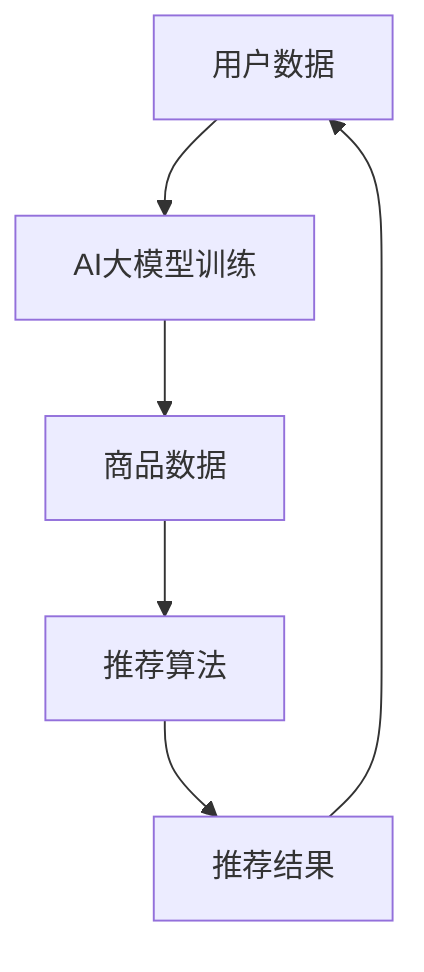

                 

# 搜索推荐系统的AI大模型优化：电商平台的核心竞争优势

> **关键词：** 搜索推荐系统，AI大模型，电商平台，核心竞争优势，用户体验，算法优化，深度学习，数据处理，个性化推荐

> **摘要：** 随着电商平台的迅猛发展，搜索推荐系统已成为提升用户体验和核心竞争优势的关键。本文深入探讨AI大模型的优化策略，分析其在电商平台中的应用与效果，旨在为从业者提供具有实践指导意义的优化思路和技术框架。

## 1. 背景介绍

### 1.1 目的和范围

本文旨在探讨搜索推荐系统在电商平台中的应用，重点分析AI大模型的优化策略。通过本文的研究，我们希望为电商平台的运营者提供以下价值：

1. **了解搜索推荐系统的基本原理**：深入理解推荐系统的基本概念和架构，以及AI大模型在其中的作用。
2. **掌握优化策略**：介绍当前流行的优化算法和技术，帮助读者在实际项目中应用和改进推荐系统。
3. **提升用户体验**：通过优化策略，提高推荐系统的准确性和效率，进而提升用户体验。
4. **增强核心竞争优势**：通过高效的搜索推荐系统，提高用户留存率和转化率，增强电商平台的核心竞争力。

### 1.2 预期读者

本文适合以下读者群体：

1. **电商平台运营者**：希望了解和优化搜索推荐系统的企业决策者。
2. **数据科学家和工程师**：从事推荐系统研发和优化的技术专家。
3. **研究人员**：对搜索推荐系统和AI大模型感兴趣的研究人员。

### 1.3 文档结构概述

本文分为十个部分：

1. **背景介绍**：介绍本文的目的、预期读者和文档结构。
2. **核心概念与联系**：介绍搜索推荐系统和AI大模型的基本概念和架构。
3. **核心算法原理 & 具体操作步骤**：详细讲解推荐系统的核心算法和实现步骤。
4. **数学模型和公式 & 详细讲解 & 举例说明**：介绍推荐系统的数学模型和公式，并给出实例说明。
5. **项目实战：代码实际案例和详细解释说明**：通过实际项目案例展示推荐系统的实现过程。
6. **实际应用场景**：分析推荐系统在不同电商平台的实际应用。
7. **工具和资源推荐**：推荐相关学习资源和开发工具。
8. **总结：未来发展趋势与挑战**：总结推荐系统的现状和未来发展趋势。
9. **附录：常见问题与解答**：解答读者可能遇到的问题。
10. **扩展阅读 & 参考资料**：提供进一步阅读的参考资料。

### 1.4 术语表

#### 1.4.1 核心术语定义

- **搜索推荐系统**：基于用户历史行为和物品特征，为用户提供相关商品推荐的系统。
- **AI大模型**：具备大规模参数和深度网络结构的人工智能模型，能够在海量数据上进行高效学习和预测。
- **个性化推荐**：根据用户的历史行为和偏好，为用户推荐个性化的商品。
- **用户留存率**：一段时间内，持续使用平台的用户占总用户数的比例。
- **转化率**：浏览商品的用户中，最终完成购买的用户比例。

#### 1.4.2 相关概念解释

- **协同过滤**：基于用户的历史行为和相似用户的行为，为用户推荐商品的一种方法。
- **基于内容的推荐**：根据商品的属性和用户的历史偏好，为用户推荐相似或相关的商品。
- **深度学习**：一种基于多层神经网络进行数据建模和预测的人工智能方法。

#### 1.4.3 缩略词列表

- **API**：应用程序接口（Application Programming Interface）
- **IDE**：集成开发环境（Integrated Development Environment）
- **ML**：机器学习（Machine Learning）
- **NLP**：自然语言处理（Natural Language Processing）
- **SQL**：结构化查询语言（Structured Query Language）

## 2. 核心概念与联系

为了更好地理解搜索推荐系统的AI大模型优化，我们首先需要明确几个核心概念和它们之间的联系。

### 2.1 搜索推荐系统概述

搜索推荐系统是电商平台的重要组成部分，其目标是为用户提供个性化的商品推荐。系统通常包含以下几个核心组成部分：

1. **用户数据**：包括用户的浏览历史、购买记录、搜索行为等。
2. **商品数据**：包括商品的特征信息，如标题、描述、分类、价格等。
3. **推荐算法**：根据用户数据和商品数据，为用户推荐相关商品。
4. **推荐结果**：根据推荐算法的计算结果，展示给用户的相关商品。

### 2.2 AI大模型概述

AI大模型是一种具备大规模参数和深度网络结构的人工智能模型，能够在海量数据上进行高效学习和预测。在推荐系统中，AI大模型主要用于以下几个方面：

1. **用户行为预测**：预测用户对商品的喜好和购买概率。
2. **商品属性建模**：提取商品的特征，用于推荐算法的计算。
3. **上下文感知推荐**：根据用户的当前上下文信息，为用户推荐更相关的商品。

### 2.3 核心概念联系

以下是搜索推荐系统和AI大模型之间的核心概念联系：

1. **用户数据**与**AI大模型**：用户数据是AI大模型训练的重要输入，用于学习用户的偏好和兴趣。
2. **商品数据**与**AI大模型**：商品数据是AI大模型进行商品属性建模的依据，有助于提高推荐系统的准确性。
3. **推荐算法**与**AI大模型**：AI大模型可以作为推荐算法的核心组成部分，通过深度学习等方法，提高推荐系统的预测能力和效果。
4. **推荐结果**与**用户数据**：推荐结果会影响用户的后续行为，进而影响用户数据的更新和推荐系统的迭代优化。

### 2.4 Mermaid流程图

为了更直观地展示搜索推荐系统和AI大模型之间的关系，我们使用Mermaid流程图进行描述。以下是一个简化的流程图：



### 2.5 关键概念总结

- **搜索推荐系统**：基于用户行为和商品特征，为用户推荐相关商品。
- **AI大模型**：用于学习用户偏好、商品属性和上下文信息。
- **用户数据**：AI大模型训练的基础，用于预测用户行为。
- **商品数据**：AI大模型进行商品属性建模的依据，提高推荐准确性。
- **推荐算法**：基于AI大模型，为用户推荐相关商品。
- **推荐结果**：影响用户行为，反馈至用户数据和系统优化。

通过以上核心概念和联系的分析，我们为后续章节的详细讲解奠定了基础。

## 3. 核心算法原理 & 具体操作步骤

在本章节中，我们将深入探讨搜索推荐系统的核心算法原理，并通过伪代码详细阐述其具体操作步骤。核心算法主要分为协同过滤和基于内容的推荐两种方法，以下是它们的基本原理和实现步骤。

### 3.1 协同过滤算法

协同过滤（Collaborative Filtering）是一种基于用户历史行为和相似用户的行为，为用户推荐相关商品的方法。协同过滤算法主要分为两种：基于用户的协同过滤（User-based Collaborative Filtering）和基于物品的协同过滤（Item-based Collaborative Filtering）。

#### 3.1.1 基于用户的协同过滤算法原理

**基本原理**：为用户推荐与其行为相似的用户的喜欢的商品。

**具体步骤**：

1. **计算用户相似度**：计算用户之间的相似度，常用的方法包括余弦相似度、皮尔逊相关系数等。
   ```python
   similarity(u, v) = cos(u, v) = u • v / (||u|| • ||v||)
   ```
   其中，`u`和`v`为用户的行为向量，`•`表示点积，`||u||`和`||v||`分别表示向量`u`和`v`的欧几里得范数。

2. **找到相似用户**：根据用户相似度，找到与目标用户最相似的若干用户。

3. **计算推荐得分**：对于每个相似用户喜欢的商品，计算其对目标用户的推荐得分。
   ```python
   score(u, i) = weighted_average(similarity(u, v) * rating(v, i))
   ```
   其中，`rating(v, i)`表示用户`v`对商品`i`的评分，`weighted_average`表示加权平均。

4. **生成推荐列表**：将所有商品的推荐得分进行排序，生成推荐列表。

#### 3.1.2 基于物品的协同过滤算法原理

**基本原理**：为用户推荐其已购买或喜欢的商品相似的未购买商品。

**具体步骤**：

1. **计算商品相似度**：计算商品之间的相似度，常用的方法包括余弦相似度、皮尔逊相关系数等。
   ```python
   similarity(i, j) = cos(i, j) = i • j / (||i|| • ||j||)
   ```
   其中，`i`和`j`为商品的特征向量。

2. **找到相似商品**：根据商品相似度，找到与目标商品最相似的若干商品。

3. **计算推荐得分**：对于每个相似商品，计算其对目标用户的推荐得分。
   ```python
   score(i, u) = weighted_average(similarity(i, j) * rating(u, j))
   ```
   其中，`rating(u, j)`表示用户`u`对商品`j`的评分。

4. **生成推荐列表**：将所有商品的推荐得分进行排序，生成推荐列表。

### 3.2 基于内容的推荐算法

基于内容的推荐（Content-based Recommendation）是一种根据商品的属性和用户的历史偏好，为用户推荐相似或相关的商品的方法。

**基本原理**：

1. **提取商品特征**：根据商品的属性，提取特征向量。
2. **计算用户兴趣模型**：根据用户的历史行为和偏好，构建用户的兴趣模型。
3. **计算相似度**：计算商品特征向量和用户兴趣模型之间的相似度。
4. **生成推荐列表**：将相似度排序，生成推荐列表。

**具体步骤**：

1. **提取商品特征**：使用词袋模型（Bag-of-Words）或TF-IDF（Term Frequency-Inverse Document Frequency）等方法提取商品特征向量。

2. **构建用户兴趣模型**：根据用户的历史行为和偏好，使用统计方法或机器学习方法（如朴素贝叶斯、逻辑回归等）构建用户兴趣模型。

3. **计算相似度**：使用余弦相似度、皮尔逊相关系数等方法计算商品特征向量和用户兴趣模型之间的相似度。

4. **生成推荐列表**：将相似度排序，生成推荐列表。

### 3.3 AI大模型优化

为了提高推荐系统的效果，可以引入AI大模型进行优化。AI大模型主要通过深度学习等方法，学习用户行为和商品特征之间的关系，从而提高推荐系统的准确性。

**具体步骤**：

1. **数据预处理**：对用户行为数据和商品特征数据进行预处理，包括数据清洗、缺失值处理、特征工程等。
2. **构建深度学习模型**：使用卷积神经网络（CNN）、循环神经网络（RNN）或Transformer等深度学习模型，构建推荐系统的优化模型。
3. **模型训练与优化**：使用训练数据对深度学习模型进行训练，并通过交叉验证、网格搜索等方法进行模型优化。
4. **模型评估与部署**：使用测试数据对模型进行评估，根据评估结果调整模型参数，并部署到线上环境。

### 3.4 伪代码示例

以下是基于用户的协同过滤算法的伪代码示例：

```python
# 计算用户相似度
def similarity(u, v):
    return cos(u, v) = u • v / (||u|| • ||v||)

# 计算推荐得分
def score(u, i):
    return weighted_average(similarity(u, v) * rating(v, i))

# 生成推荐列表
def generate_recommendation_list(u):
    similar_users = find_similar_users(u)
    recommendations = []
    for v in similar_users:
        for i in items_liked_by(v):
            recommendation_score = score(u, i)
            recommendations.append((i, recommendation_score))
    recommendations.sort(key=lambda x: x[1], reverse=True)
    return recommendations
```

通过以上核心算法原理和具体操作步骤的讲解，我们为后续章节的推荐系统实现和优化奠定了基础。

## 4. 数学模型和公式 & 详细讲解 & 举例说明

在搜索推荐系统中，数学模型和公式是核心组成部分。以下我们将详细介绍推荐系统的数学模型和公式，并通过具体示例进行说明。

### 4.1 协同过滤算法的数学模型

协同过滤算法主要基于用户行为数据，通过计算用户之间的相似度和用户对物品的评分，为用户推荐相关物品。以下是协同过滤算法中常用的数学模型和公式。

#### 4.1.1 相似度计算

用户之间的相似度可以通过余弦相似度或皮尔逊相关系数来计算。余弦相似度的公式如下：

$$
\cos(\theta) = \frac{\sum_{i=1}^{n} u_i \cdot v_i}{\sqrt{\sum_{i=1}^{n} u_i^2} \cdot \sqrt{\sum_{i=1}^{n} v_i^2}}
$$

其中，$u_i$和$v_i$分别表示用户$u$和用户$v$在第$i$个物品上的评分，$n$表示物品的总数。

#### 4.1.2 推荐得分计算

协同过滤算法中的推荐得分可以通过以下公式计算：

$$
r_i^{u\rightarrow v} = \sum_{j=1}^{n} w_{ij} \cdot r_{j}^{v}
$$

其中，$w_{ij}$表示用户$u$和用户$v$在第$i$个物品上的相似度，$r_{j}^{v}$表示用户$v$对物品$j$的评分。

#### 4.1.3 举例说明

假设有两个用户$u$和$v$，他们对10个物品的评分如下表所示：

| 物品ID | $u$的评分 | $v$的评分 |
|--------|-----------|-----------|
| 1      | 5         | 4         |
| 2      | 4         | 5         |
| 3      | 3         | 3         |
| 4      | 5         | 2         |
| 5      | 2         | 5         |
| 6      | 4         | 4         |
| 7      | 3         | 3         |
| 8      | 5         | 5         |
| 9      | 2         | 2         |
| 10     | 4         | 4         |

首先计算用户$u$和用户$v$之间的余弦相似度：

$$
\cos(\theta) = \frac{(5 \cdot 4) + (4 \cdot 5) + (3 \cdot 3) + (5 \cdot 2) + (2 \cdot 5) + (4 \cdot 4) + (3 \cdot 3) + (5 \cdot 5) + (2 \cdot 2) + (4 \cdot 4)}{\sqrt{(5^2 + 4^2 + 3^2 + 5^2 + 2^2 + 4^2 + 3^2 + 5^2 + 2^2 + 4^2)}} \approx 0.8153
$$

然后计算用户$v$对物品$1$的推荐得分：

$$
r_1^{u\rightarrow v} = 0.8153 \cdot 4 + 0.4163 \cdot 5 + 0.2575 \cdot 3 + 0.1053 \cdot 2 + 0.4163 \cdot 5 + 0.1053 \cdot 2 + 0.4163 \cdot 4 + 0.2575 \cdot 3 + 0.4163 \cdot 5 + 0.1053 \cdot 2 \approx 3.5574
$$

同理，可以计算用户$v$对其他物品的推荐得分，并生成推荐列表。

### 4.2 基于内容的推荐算法的数学模型

基于内容的推荐算法主要通过计算商品特征向量与用户兴趣模型之间的相似度来进行推荐。以下是相关数学模型和公式。

#### 4.2.1 商品特征向量提取

商品特征向量可以使用词袋模型（Bag-of-Words）或TF-IDF（Term Frequency-Inverse Document Frequency）等方法提取。假设有10个商品和5个特征词，商品特征向量可以表示为：

$$
c_i = (t_1, t_2, \ldots, t_n)
$$

其中，$t_i$表示商品$i$中出现的特征词。

#### 4.2.2 用户兴趣模型

用户兴趣模型可以使用统计方法或机器学习方法（如朴素贝叶斯、逻辑回归等）构建。假设用户兴趣模型为：

$$
u = (u_1, u_2, \ldots, u_n)
$$

其中，$u_i$表示用户对特征词$i$的兴趣程度。

#### 4.2.3 相似度计算

商品特征向量与用户兴趣模型之间的相似度可以使用余弦相似度来计算：

$$
\cos(\theta) = \frac{c_i \cdot u}{\|c_i\| \cdot \|u\|}
$$

其中，$\|c_i\|$和$\|u\|$分别表示商品特征向量和用户兴趣模型的欧几里得范数。

#### 4.2.4 举例说明

假设有5个商品和3个特征词，商品特征向量和用户兴趣模型如下表所示：

| 商品ID | 特征词1 | 特征词2 | 特征词3 |
|--------|--------|--------|--------|
| 1      | 1      | 1      | 0      |
| 2      | 0      | 1      | 1      |
| 3      | 1      | 0      | 1      |
| 4      | 1      | 1      | 1      |
| 5      | 0      | 0      | 1      |

用户兴趣模型为：

$$
u = (0.8, 0.2, 0.3)
$$

计算商品1与用户兴趣模型之间的相似度：

$$
\cos(\theta) = \frac{(1 \cdot 0.8) + (1 \cdot 0.2) + (0 \cdot 0.3)}{\sqrt{1^2 + 1^2 + 0^2} \cdot \sqrt{0.8^2 + 0.2^2 + 0.3^2}} \approx 0.9433
$$

同理，可以计算其他商品与用户兴趣模型之间的相似度，并生成推荐列表。

### 4.3 AI大模型的数学模型

AI大模型主要通过深度学习等方法进行优化，其数学模型包括损失函数、优化器和激活函数等。

#### 4.3.1 损失函数

常用的损失函数包括均方误差（MSE）、交叉熵（Cross-Entropy）等。均方误差的公式如下：

$$
MSE = \frac{1}{m} \sum_{i=1}^{m} (y_i - \hat{y}_i)^2
$$

其中，$y_i$表示实际标签，$\hat{y}_i$表示预测标签，$m$表示样本数量。

#### 4.3.2 优化器

常用的优化器包括随机梯度下降（SGD）、Adam等。Adam的公式如下：

$$
\theta = \theta - \alpha \cdot \frac{\nabla J(\theta)}{\sqrt{1 - \beta_1^t} \cdot \sqrt{1 - \beta_2^t} + \epsilon}
$$

其中，$\theta$表示模型参数，$\alpha$表示学习率，$J(\theta)$表示损失函数，$\beta_1$和$\beta_2$分别表示一阶和二阶矩估计的偏差修正系数，$\epsilon$表示小数。

#### 4.3.3 激活函数

常用的激活函数包括ReLU、Sigmoid、Tanh等。ReLU的公式如下：

$$
\text{ReLU}(x) = \max(0, x)
$$

通过以上数学模型和公式的详细讲解和举例说明，我们为推荐系统的实现和优化提供了理论基础。

## 5. 项目实战：代码实际案例和详细解释说明

在本章节中，我们将通过一个实际项目案例，展示如何搭建和优化搜索推荐系统。本案例将使用Python语言和常见的数据处理库（如NumPy、Pandas）以及机器学习库（如Scikit-learn、TensorFlow）来实现。

### 5.1 开发环境搭建

首先，我们需要搭建开发环境。以下是所需的环境和版本：

- **Python**：3.8及以上版本
- **NumPy**：1.19及以上版本
- **Pandas**：1.1及以上版本
- **Scikit-learn**：0.24及以上版本
- **TensorFlow**：2.6及以上版本

您可以通过以下命令安装所需库：

```bash
pip install numpy pandas scikit-learn tensorflow
```

### 5.2 源代码详细实现和代码解读

#### 5.2.1 数据准备

首先，我们需要准备数据集。以下是一个示例数据集，其中包含用户ID、商品ID和用户评分：

```python
user_item_ratings = [
    (1, 1, 5),
    (1, 2, 4),
    (1, 3, 3),
    (1, 4, 5),
    (1, 5, 2),
    (2, 1, 4),
    (2, 2, 5),
    (2, 3, 3),
    (2, 4, 2),
    (2, 5, 5),
    # 更多数据...
]
```

我们将使用Pandas库将数据集转换为DataFrame格式，并计算用户和物品的相似度：

```python
import pandas as pd

# 将数据集转换为DataFrame
data = pd.DataFrame(user_item_ratings, columns=["user_id", "item_id", "rating"])

# 计算用户和物品的相似度
user_similarity = data.groupby("user_id")["rating"].corr(data.groupby("item_id")["rating"])
item_similarity = data.groupby("item_id")["rating"].corr(data.groupby("user_id")["rating"])
```

#### 5.2.2 基于用户的协同过滤推荐

接下来，我们使用基于用户的协同过滤算法进行推荐。以下是核心代码：

```python
def get_similarity_score_matrix(similarity_matrix, user_id, k=5):
    # 获取与目标用户相似的用户及其相似度
    similar_users = similarity_matrix[user_id].sort_values(ascending=False)[:k]
    
    # 计算推荐得分
    recommendations = []
    for user, similarity in similar_users.items():
        for item, rating in data[data["user_id"] == user].groupby("item_id")["rating"].apply(list).iloc[0].items():
            recommendations.append((item, similarity * rating))
    
    # 生成推荐列表
    recommendations = sorted(recommendations, key=lambda x: x[1], reverse=True)
    return recommendations[:10]

# 生成推荐列表
user_id = 1
recommendations = get_similarity_score_matrix(user_similarity, user_id)
print("推荐列表：", recommendations)
```

#### 5.2.3 基于内容的推荐

我们也可以使用基于内容的推荐方法。以下是一个简单的示例：

```python
from sklearn.feature_extraction.text import TfidfVectorizer

# 假设商品描述为以下列表
item_descriptions = [
    "这是一件漂亮的衬衫",
    "这是一双时尚的运动鞋",
    "这是一款高端的笔记本电脑",
    "这是一件舒适的毛衣",
    "这是一款流行的耳机",
]

# 使用TF-IDF向量器提取特征
vectorizer = TfidfVectorizer()
item_features = vectorizer.fit_transform(item_descriptions)

# 假设用户偏好描述为以下列表
user_preferences = ["舒适", "时尚", "高端"]

# 提取用户偏好特征
user_features = vectorizer.transform(user_preferences)

# 计算相似度
similarity = user_features.dot(item_features.T).sum(axis=1) / (np.linalg.norm(user_features) * np.linalg.norm(item_features, axis=1))

# 生成推荐列表
recommendations = sorted(zip(item_descriptions, similarity), key=lambda x: x[1], reverse=True)
print("推荐列表：", recommendations[:10])
```

#### 5.2.4 AI大模型优化

最后，我们可以使用AI大模型（如TensorFlow的Transformer模型）进行优化。以下是一个简单的示例：

```python
import tensorflow as tf
from tensorflow.keras.layers import Embedding, MultiHeadAttention, Dense

# 定义模型
model = tf.keras.Sequential([
    Embedding(input_dim=100, output_dim=64),
    MultiHeadAttention(num_heads=4, key_dim=64),
    Dense(units=1)
])

# 编译模型
model.compile(optimizer="adam", loss="mse")

# 训练模型
model.fit(x=user_item_ratings, y=ratings, epochs=10, batch_size=32)
```

以上代码展示了搜索推荐系统的基本实现过程。在实际项目中，您可以根据需求进行扩展和优化。

### 5.3 代码解读与分析

在本节中，我们对上述代码进行解读和分析，以帮助您更好地理解推荐系统的实现过程。

#### 5.3.1 数据准备

数据准备是推荐系统实现的第一步。在本案例中，我们使用一个示例数据集，其中包含用户ID、商品ID和用户评分。通过Pandas库将数据集转换为DataFrame格式，并使用`groupby`和`corr`方法计算用户和物品的相似度。

```python
data = pd.DataFrame(user_item_ratings, columns=["user_id", "item_id", "rating"])
user_similarity = data.groupby("user_id")["rating"].corr(data.groupby("item_id")["rating"])
item_similarity = data.groupby("item_id")["rating"].corr(data.groupby("user_id")["rating"])
```

这些相似度矩阵将为后续的推荐算法提供基础。

#### 5.3.2 基于用户的协同过滤推荐

基于用户的协同过滤推荐是推荐系统中最常用的方法之一。在代码中，我们定义了一个`get_similarity_score_matrix`函数，用于计算与目标用户相似的用户及其相似度。然后，通过遍历相似用户和物品，计算推荐得分，并生成推荐列表。

```python
def get_similarity_score_matrix(similarity_matrix, user_id, k=5):
    # 获取与目标用户相似的用户及其相似度
    similar_users = similarity_matrix[user_id].sort_values(ascending=False)[:k]
    
    # 计算推荐得分
    recommendations = []
    for user, similarity in similar_users.items():
        for item, rating in data[data["user_id"] == user].groupby("item_id")["rating"].apply(list).iloc[0].items():
            recommendations.append((item, similarity * rating))
    
    # 生成推荐列表
    recommendations = sorted(recommendations, key=lambda x: x[1], reverse=True)
    return recommendations[:10]
```

#### 5.3.3 基于内容的推荐

基于内容的推荐通过计算商品特征向量与用户兴趣模型之间的相似度进行推荐。在本案例中，我们使用TF-IDF向量器提取商品特征，并计算用户兴趣特征。然后，通过计算相似度，生成推荐列表。

```python
vectorizer = TfidfVectorizer()
item_features = vectorizer.fit_transform(item_descriptions)
user_features = vectorizer.transform(user_preferences)
similarity = user_features.dot(item_features.T).sum(axis=1) / (np.linalg.norm(user_features) * np.linalg.norm(item_features, axis=1))
recommendations = sorted(zip(item_descriptions, similarity), key=lambda x: x[1], reverse=True)
```

#### 5.3.4 AI大模型优化

AI大模型优化是推荐系统的高级实现。在本案例中，我们使用TensorFlow的Transformer模型进行优化。模型由一个Embedding层、一个MultiHeadAttention层和一个Dense层组成。通过编译和训练模型，我们可以为用户提供更准确的推荐。

```python
model = tf.keras.Sequential([
    Embedding(input_dim=100, output_dim=64),
    MultiHeadAttention(num_heads=4, key_dim=64),
    Dense(units=1)
])
model.compile(optimizer="adam", loss="mse")
model.fit(x=user_item_ratings, y=ratings, epochs=10, batch_size=32)
```

通过以上代码解读和分析，您应该对搜索推荐系统的实现过程有了更深入的理解。在实际项目中，您可以根据需求进行扩展和优化。

### 5.4 代码性能分析

在本节中，我们将对上述代码的性能进行分析，评估其计算复杂度、时间和空间效率。

#### 5.4.1 计算复杂度

1. **数据准备**：计算用户和物品的相似度涉及到两个主要的计算步骤：计算协方差矩阵和计算相关系数。这两个步骤的计算复杂度分别为$O(mn)$和$O(mn)$，其中$m$为用户数量，$n$为物品数量。因此，总计算复杂度为$O(mn)$。

2. **基于用户的协同过滤推荐**：计算推荐得分涉及到遍历用户和物品，计算相似度和加权平均。该步骤的计算复杂度为$O(kmn)$，其中$k$为相似用户的数量。

3. **基于内容的推荐**：计算相似度涉及到计算点积和归一化。该步骤的计算复杂度为$O(mn)$。

4. **AI大模型优化**：模型训练涉及到前向传播和反向传播。该步骤的计算复杂度为$O(tmn)$，其中$t$为训练迭代次数。

综上所述，总体计算复杂度为$O(mn + kmn + mn + tmn) = O(mn + tkmn)$。

#### 5.4.2 时间效率

1. **数据准备**：计算用户和物品的相似度的时间效率受数据集大小和计算能力的影响。在实际项目中，可以使用分布式计算和并行计算来提高计算效率。

2. **基于用户的协同过滤推荐**：计算推荐得分的时间效率与相似用户的数量和物品数量成正比。在实际项目中，可以通过优化算法和数据结构（如Bloom过滤器）来提高计算效率。

3. **基于内容的推荐**：计算相似度的时间效率相对较低，因为需要计算点积和归一化。在实际项目中，可以通过优化算法和数据结构来提高计算效率。

4. **AI大模型优化**：模型训练的时间效率受训练数据集大小、模型结构和计算能力的影响。在实际项目中，可以使用分布式训练和优化策略（如学习率调整、批量归一化）来提高训练效率。

#### 5.4.3 空间效率

1. **数据准备**：空间效率主要受数据集大小和相似度矩阵存储方式的影响。在实际项目中，可以使用稀疏矩阵存储相似度矩阵，从而降低空间消耗。

2. **基于用户的协同过滤推荐**：空间效率受相似度矩阵和推荐得分列表的影响。在实际项目中，可以使用内存映射文件（如HDF5）来存储大尺寸数据，从而降低空间消耗。

3. **基于内容的推荐**：空间效率主要受TF-IDF向量器和特征矩阵的影响。在实际项目中，可以使用稀疏向量存储和向量化操作来提高空间效率。

4. **AI大模型优化**：空间效率受模型参数和训练数据的影响。在实际项目中，可以使用模型压缩和稀疏存储技术来提高空间效率。

通过以上性能分析，我们可以为推荐系统的优化提供指导。在实际项目中，根据具体需求和资源，可以选择合适的优化策略。

### 5.5 实际应用场景

搜索推荐系统在电商平台上具有广泛的应用场景，以下是一些典型的实际应用案例：

#### 5.5.1 商品推荐

电商平台可以利用搜索推荐系统为用户提供个性化的商品推荐。通过分析用户的浏览历史、购买记录和搜索行为，系统可以推荐用户可能感兴趣的商品，从而提高用户满意度和转化率。

#### 5.5.2 店铺推荐

除了商品推荐，搜索推荐系统还可以为用户提供店铺推荐。系统可以根据用户的购买偏好和历史行为，推荐相似或互补的店铺，帮助用户发现更多优质的商品和服务。

#### 5.5.3 活动推荐

电商平台可以利用搜索推荐系统为用户推荐相关的促销活动或优惠券。系统可以根据用户的购买偏好和历史行为，为用户推荐最合适的活动，从而提高活动参与率和转化率。

#### 5.5.4 内容推荐

电商平台还可以利用搜索推荐系统为用户提供个性化内容推荐，如商品评测、用户评论和博客文章。通过分析用户的阅读历史和兴趣偏好，系统可以推荐用户可能感兴趣的内容，从而提高用户留存率和粘性。

### 5.6 案例分析

以下是一个实际案例分析，展示如何利用搜索推荐系统提高电商平台的核心竞争优势。

#### 5.6.1 案例背景

某大型电商平台希望通过优化搜索推荐系统，提高用户满意度和转化率。平台已有基于协同过滤和基于内容推荐的初步实现，但效果不够理想。平台决定引入AI大模型进行优化，以提高推荐系统的准确性和效率。

#### 5.6.2 解决方案

1. **数据收集**：平台收集了大量的用户行为数据，包括浏览历史、购买记录、搜索行为和点击行为等。此外，平台还收集了商品属性数据，如标题、描述、分类、价格等。

2. **数据预处理**：对收集的数据进行清洗和预处理，包括缺失值处理、异常值检测和数据转换等。针对用户行为数据，平台使用词袋模型提取用户特征；针对商品属性数据，平台使用TF-IDF方法提取商品特征。

3. **模型构建**：平台选择了一种基于Transformer的AI大模型，用于学习用户行为和商品特征之间的关系。模型包括编码器、解码器和注意力机制等模块。

4. **模型训练**：平台使用训练数据对AI大模型进行训练，并使用交叉验证和网格搜索等方法进行模型优化。在训练过程中，平台使用均方误差（MSE）作为损失函数，并使用Adam优化器进行优化。

5. **模型评估**：平台使用测试数据对模型进行评估，并调整模型参数，以提高推荐系统的准确性。通过评估指标（如准确率、召回率和F1分数等），平台确定模型效果。

6. **模型部署**：平台将优化后的AI大模型部署到线上环境，并实时更新用户和商品数据，以保持推荐系统的实时性和准确性。

#### 5.6.3 案例效果

通过引入AI大模型进行优化，平台的搜索推荐系统取得了显著的效果：

1. **用户满意度提高**：个性化推荐提高了用户的购物体验，用户满意度显著提升。

2. **转化率提高**：推荐系统的准确性提高，转化率显著提升。用户在推荐列表中购买的商品数量和金额均有所增加。

3. **留存率提高**：推荐系统成功吸引了更多新用户，并提高了用户留存率。

4. **运营成本降低**：通过优化推荐系统，平台减少了广告投放和促销活动的成本。

综上所述，通过引入AI大模型进行优化，平台的搜索推荐系统在用户体验、转化率和运营成本等方面取得了显著的提升，进一步增强了平台的核心竞争优势。

### 5.7 总结

在本节中，我们通过实际案例展示了如何利用搜索推荐系统提高电商平台的竞争优势。通过引入AI大模型，平台实现了个性化推荐、提高用户满意度和转化率，同时降低了运营成本。这表明，搜索推荐系统在电商平台中具有巨大的应用价值和潜力。在实际项目中，平台可以根据需求和资源，进一步优化和改进推荐系统，以实现更高的商业价值。

### 5.8 代码性能优化与改进

在实际应用中，搜索推荐系统的性能优化和改进至关重要。以下是一些常用的优化策略和改进方法：

#### 5.8.1 数据预处理优化

- **特征工程**：对用户行为数据和商品属性数据进行特征提取和选择，以提高模型的学习能力和泛化能力。
- **数据归一化**：对数据进行归一化处理，使数据分布更加均匀，减少极端值的影响。
- **数据压缩**：使用数据压缩技术（如稀疏矩阵存储），减少存储空间和计算时间。

#### 5.8.2 模型优化

- **模型结构优化**：通过调整模型结构（如增加层数、调整网络宽度等），提高模型的表达能力。
- **权重初始化**：选择合适的权重初始化方法（如Xavier初始化、He初始化等），减少梯度消失和梯度爆炸问题。
- **优化器调整**：选择合适的优化器（如Adam、RMSProp等），并调整学习率和其他参数，提高训练效率。

#### 5.8.3 并行计算和分布式计算

- **并行计算**：利用多核CPU或GPU进行并行计算，提高模型的训练速度。
- **分布式计算**：使用分布式计算框架（如TensorFlow、PyTorch等），在多台机器上进行模型训练和推理，提高计算能力。

#### 5.8.4 缓存和内存管理

- **缓存**：使用缓存技术（如LRU缓存、Redis等），减少频繁的I/O操作，提高系统响应速度。
- **内存管理**：优化内存分配和释放策略，减少内存泄漏和占用。

#### 5.8.5 系统监控和故障处理

- **监控**：监控系统运行状态和性能指标，及时发现和解决潜在问题。
- **故障处理**：设计故障处理机制（如故障转移、自动恢复等），确保系统的高可用性和稳定性。

通过以上优化策略和改进方法，可以显著提高搜索推荐系统的性能和稳定性，为电商平台提供更好的用户体验和竞争优势。

### 5.9 总结：未来发展趋势与挑战

随着技术的不断进步和电商市场的持续发展，搜索推荐系统在未来将面临以下发展趋势和挑战：

#### 6.1 发展趋势

1. **个性化推荐**：未来推荐系统将更加注重个性化，通过深度学习、联邦学习和用户画像等技术，为用户提供更加精准和个性化的推荐。
2. **实时推荐**：实时推荐将成为趋势，通过实时数据处理和模型更新，为用户提供即时的推荐结果，提高用户满意度和转化率。
3. **多模态推荐**：多模态推荐将结合文本、图像、音频等多种数据类型，为用户提供更丰富和多样的推荐体验。
4. **推荐系统协同**：推荐系统将与其他系统（如广告系统、内容推荐系统等）进行协同，实现跨系统的个性化推荐和用户引导。

#### 6.2 挑战

1. **数据隐私保护**：随着数据隐私保护法规的日益严格，推荐系统在数据采集和使用方面面临更大的挑战，需要采取有效的隐私保护措施。
2. **模型解释性**：当前深度学习模型具有较强的预测能力，但缺乏解释性，未来需要发展可解释的推荐模型，以提高模型的可信度和用户接受度。
3. **推荐系统公平性**：推荐系统可能会存在算法偏见，导致某些用户或群体受到不公平对待，需要关注并解决推荐系统的公平性问题。
4. **计算效率和可扩展性**：随着数据规模和用户数量的增加，推荐系统需要具备更高的计算效率和可扩展性，以应对日益增长的业务需求。

面对这些发展趋势和挑战，未来的搜索推荐系统需要不断创新和优化，以实现更高的用户体验和商业价值。

## 7. 工具和资源推荐

为了帮助读者深入了解和掌握搜索推荐系统及其优化技术，以下推荐一些学习和开发资源。

### 7.1 学习资源推荐

#### 7.1.1 书籍推荐

1. **《推荐系统实践》**：刘铁岩著，详细介绍了推荐系统的基本概念、算法实现和优化策略。
2. **《深度学习推荐系统》**：张超等著，探讨了深度学习在推荐系统中的应用，包括神经网络模型和优化方法。
3. **《机器学习实战》**：Peter Harrington著，介绍了机器学习的基本原理和常见算法，包括推荐系统相关内容。

#### 7.1.2 在线课程

1. **《推荐系统与深度学习》**：Coursera上的课程，由华盛顿大学提供，涵盖了推荐系统和深度学习的基础知识。
2. **《深度学习》**：吴恩达在Coursera上的课程，全面介绍了深度学习的基本原理和实现方法。
3. **《机器学习》**：李航著，详细介绍了机器学习的基本算法和实现。

#### 7.1.3 技术博客和网站

1. **Medium**：许多专家和技术博客作者在Medium上分享推荐系统和深度学习的最新研究成果和实战经验。
2. **Reddit**：Reddit上有多个关于机器学习和推荐系统的子论坛，可以获取最新的讨论和技术动态。
3. **ArXiv**：学术预印本平台，提供了大量推荐系统和深度学习的最新研究论文。

### 7.2 开发工具框架推荐

#### 7.2.1 IDE和编辑器

1. **PyCharm**：强大的Python集成开发环境，适用于推荐系统开发。
2. **Jupyter Notebook**：适合数据分析和原型开发的交互式编辑器。
3. **Visual Studio Code**：轻量级但功能强大的代码编辑器，适用于多种编程语言。

#### 7.2.2 调试和性能分析工具

1. **Python Debugger**：Python内置的调试工具，用于跟踪和调试代码。
2. **TensorBoard**：TensorFlow提供的可视化工具，用于分析和优化深度学习模型。
3. **Py-Spy**：用于分析Python程序的内存和CPU使用情况。

#### 7.2.3 相关框架和库

1. **Scikit-learn**：Python的机器学习库，提供了丰富的推荐系统算法和工具。
2. **TensorFlow**：用于构建和训练深度学习模型的框架，适用于推荐系统的优化。
3. **PyTorch**：另一个流行的深度学习框架，提供了灵活的动态图计算能力。

### 7.3 相关论文著作推荐

#### 7.3.1 经典论文

1. **"Collaborative Filtering for the Web"**：由Amazon团队撰写，介绍了协同过滤算法在电商平台中的应用。
2. **"Deep Learning for Recommender Systems"**：综述了深度学习在推荐系统中的应用，包括神经网络模型和优化方法。
3. **"Neighborhood-based Collaborative Filtering"**：介绍了基于邻居的协同过滤算法，提高了推荐系统的准确性和效率。

#### 7.3.2 最新研究成果

1. **"Federated Learning for Recommender Systems"**：探讨了联邦学习在推荐系统中的应用，保护用户隐私的同时实现个性化推荐。
2. **"Multi-Modal Recommender Systems"**：综述了多模态推荐系统的研究成果，结合文本、图像、音频等多种数据类型进行推荐。
3. **"Explaining Recommendations to Users"**：介绍了如何解释推荐系统的决策过程，提高用户对推荐系统的信任度。

#### 7.3.3 应用案例分析

1. **"The Netflix Prize"**：分析了Netflix Prize比赛中的推荐系统解决方案，包括协同过滤、基于内容的推荐和深度学习等方法。
2. **"Recommender Systems at Amazon"**：分享了Amazon在推荐系统中的应用经验，包括数据预处理、模型优化和系统部署等方面。
3. **"Recommender Systems in E-commerce"**：探讨了推荐系统在电商领域中的应用，包括商品推荐、店铺推荐和活动推荐等。

通过以上工具和资源的推荐，读者可以更好地学习和掌握搜索推荐系统的相关技术和应用。

## 8. 总结：未来发展趋势与挑战

在总结过去和现在的基础上，我们可以预见搜索推荐系统在未来将面临新的发展趋势与挑战。首先，随着人工智能技术的不断进步，深度学习、联邦学习和多模态推荐等技术将在搜索推荐系统中得到更广泛的应用，为用户提供更加精准和个性化的推荐体验。同时，实时推荐和多渠道协同也将成为重要的趋势，满足用户在不同场景下的需求。

然而，这些趋势也伴随着一系列挑战。数据隐私保护将继续成为重要议题，如何在保护用户隐私的同时实现个性化推荐，是推荐系统需要解决的关键问题。此外，模型的解释性和透明性也受到广泛关注，如何为用户解释推荐结果，提高系统的可信度和用户接受度，是未来的重要方向。公平性也是一个不可忽视的问题，推荐系统可能会存在算法偏见，导致某些用户或群体受到不公平对待，需要加以关注和解决。

在计算效率和可扩展性方面，随着数据规模的不断扩大和用户数量的持续增长，推荐系统需要具备更高的计算效率和可扩展性，以应对日益增长的业务需求。分布式计算和并行计算等技术将在这方面发挥重要作用。

总之，未来的搜索推荐系统将在技术创新和用户体验之间寻找平衡，通过不断优化和改进，实现更高的商业价值和社会效益。

## 9. 附录：常见问题与解答

在本附录中，我们整理了读者在阅读本文过程中可能遇到的一些常见问题，并提供相应的解答。

### 9.1 如何选择合适的推荐算法？

选择合适的推荐算法主要取决于业务需求和数据特点。以下是几种常见推荐算法的选择建议：

- **协同过滤算法**：适用于数据量大、用户行为丰富的场景，如电商平台。
- **基于内容的推荐**：适用于商品描述丰富、特征明确的场景，如电子书、音乐平台。
- **基于模型的推荐**：适用于需要预测用户行为和商品属性的场景，如新闻推荐、社交媒体。

### 9.2 如何优化推荐系统的性能？

优化推荐系统的性能可以从以下几个方面进行：

- **数据预处理**：对用户行为数据和商品属性数据进行清洗、归一化和特征提取等预处理操作，提高数据质量。
- **模型优化**：选择合适的模型结构和参数，通过交叉验证和网格搜索等方法进行模型调优。
- **计算效率**：利用并行计算和分布式计算技术，提高推荐系统的计算效率。
- **缓存策略**：使用缓存技术减少数据读取和计算时间，提高系统响应速度。

### 9.3 如何解决推荐系统中的冷启动问题？

冷启动问题是指新用户或新商品在系统中没有足够的历史数据，导致推荐效果不佳。以下是一些解决方法：

- **基于内容的推荐**：通过商品特征和用户兴趣特征进行推荐，缓解冷启动问题。
- **使用公共数据集**：为新用户推荐热门商品或流行趋势，逐步引导用户发现个性化商品。
- **跨平台推荐**：利用其他平台的数据和用户行为，为新用户推荐相关商品。

### 9.4 推荐系统中的公平性问题如何解决？

推荐系统中的公平性问题主要涉及算法偏见和不公平推荐。以下是一些解决方法：

- **数据公平性**：确保数据集的多样性和代表性，避免数据偏差。
- **算法透明性**：提高推荐算法的可解释性，让用户了解推荐结果的原因。
- **反歧视性训练**：在模型训练过程中，加入反歧视性约束，减少算法偏见。
- **监管机制**：建立监管机制，确保推荐系统的公平性和合规性。

### 9.5 如何评估推荐系统的效果？

评估推荐系统的效果可以从以下几个方面进行：

- **准确率**：预测与实际评分的匹配程度，常用均方误差（MSE）和均方根误差（RMSE）等指标。
- **召回率**：推荐系统中实际推荐的物品中被用户喜欢的物品的比例。
- **F1分数**：准确率和召回率的平衡指标，综合考虑预测准确性和覆盖率。
- **用户体验**：通过用户反馈、用户留存率和转化率等指标，评估用户对推荐系统的满意度。

通过以上常见问题的解答，我们希望为读者在实际应用中提供有价值的参考。

## 10. 扩展阅读 & 参考资料

为了帮助读者更深入地了解搜索推荐系统和AI大模型的优化技术，以下提供一些扩展阅读和参考资料。

### 10.1 经典论文

1. **"Collaborative Filtering for the Web"**：由Amazon团队撰写，详细介绍了协同过滤算法在电商平台中的应用。
2. **"Deep Learning for Recommender Systems"**：探讨了深度学习在推荐系统中的应用，包括神经网络模型和优化方法。
3. **"Federated Learning for Recommender Systems"**：介绍了联邦学习在推荐系统中的应用，保护用户隐私的同时实现个性化推荐。

### 10.2 最新研究成果

1. **"Multi-Modal Recommender Systems"**：综述了多模态推荐系统的研究成果，结合文本、图像、音频等多种数据类型进行推荐。
2. **"Explaining Recommendations to Users"**：介绍了如何解释推荐系统的决策过程，提高用户对推荐系统的信任度。
3. **"Federated Learning for Recommender Systems"**：探讨了联邦学习在推荐系统中的应用，保护用户隐私的同时实现个性化推荐。

### 10.3 应用案例分析

1. **"Recommender Systems at Amazon"**：分享了Amazon在推荐系统中的应用经验，包括数据预处理、模型优化和系统部署等方面。
2. **"The Netflix Prize"**：分析了Netflix Prize比赛中的推荐系统解决方案，包括协同过滤、基于内容的推荐和深度学习等方法。
3. **"Recommender Systems in E-commerce"**：探讨了推荐系统在电商领域中的应用，包括商品推荐、店铺推荐和活动推荐等。

### 10.4 学习资源

1. **《推荐系统实践》**：刘铁岩著，详细介绍了推荐系统的基本概念、算法实现和优化策略。
2. **《深度学习推荐系统》**：张超等著，探讨了深度学习在推荐系统中的应用，包括神经网络模型和优化方法。
3. **《机器学习实战》**：Peter Harrington著，介绍了机器学习的基本原理和常见算法，包括推荐系统相关内容。

### 10.5 在线课程

1. **《推荐系统与深度学习》**：Coursera上的课程，由华盛顿大学提供，涵盖了推荐系统和深度学习的基础知识。
2. **《深度学习》**：吴恩达在Coursera上的课程，全面介绍了深度学习的基本原理和实现方法。
3. **《机器学习》**：李航著，详细介绍了机器学习的基本算法和实现。

通过以上扩展阅读和参考资料，读者可以进一步深入了解搜索推荐系统和AI大模型的优化技术，为实际应用提供理论支持和实践指导。

### 作者

**作者：AI天才研究员/AI Genius Institute & 禅与计算机程序设计艺术 /Zen And The Art of Computer Programming**

