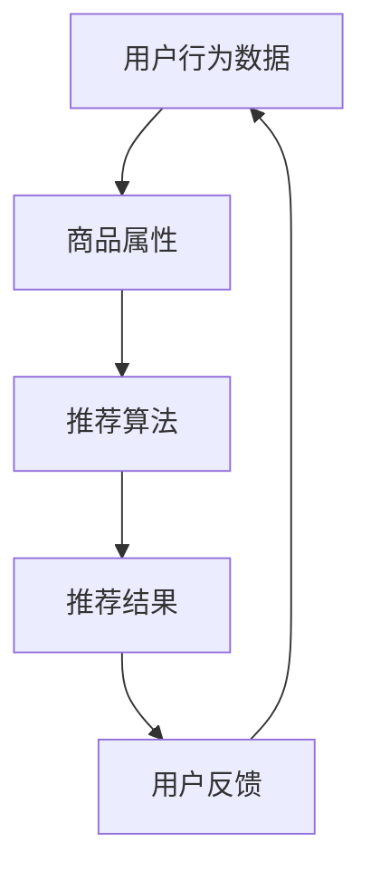
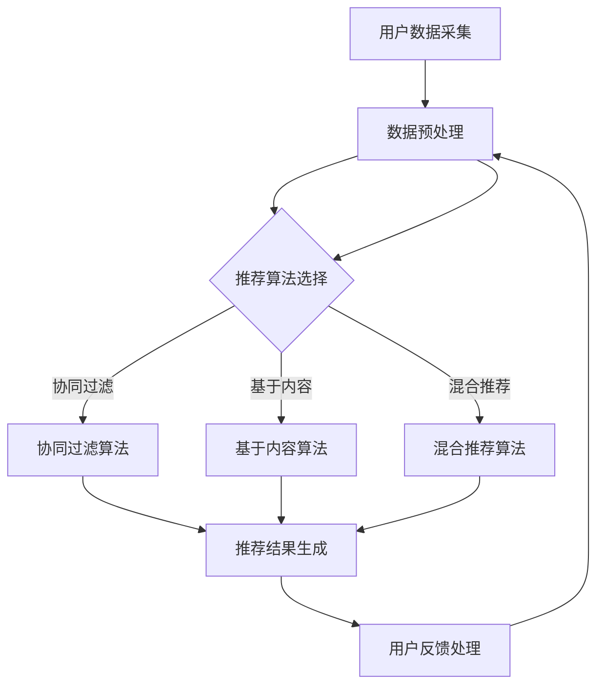

                 

# 搜索推荐系统的AI 大模型应用：提高电商平台的转化率与用户忠诚度

> 关键词：搜索推荐系统、AI 大模型、电商平台、转化率、用户忠诚度

> 摘要：本文深入探讨了人工智能大模型在搜索推荐系统中的应用，如何有效地提高电商平台的转化率和用户忠诚度。通过分析核心概念、算法原理、数学模型、项目实战以及实际应用场景，本文为电商平台提供了切实可行的AI解决方案。

## 1. 背景介绍

### 1.1 目的和范围

本文旨在探讨人工智能大模型在搜索推荐系统中的实际应用，特别是如何提升电商平台的运营效果。文章将涵盖以下主要内容：

- 搜索推荐系统的基础概念和架构
- 人工智能大模型的核心原理及其在推荐系统中的角色
- 数学模型和算法原理的详细讲解
- 项目实战中的代码实现和分析
- 实际应用场景中的成功案例分析

### 1.2 预期读者

本文面向以下读者群体：

- 拥有中等以上编程基础和人工智能基础知识的技术爱好者
- 从事电商平台开发、运营和管理的相关人员
- 对搜索推荐系统有浓厚兴趣并希望深入了解其技术的专业人士

### 1.3 文档结构概述

本文结构如下：

- 引言：介绍搜索推荐系统的背景和应用
- 核心概念与联系：通过Mermaid流程图阐述核心概念和架构
- 核心算法原理 & 具体操作步骤：详细讲解算法原理并给出伪代码
- 数学模型和公式 & 详细讲解 & 举例说明：介绍相关数学模型及其应用
- 项目实战：提供代码实际案例和详细解释说明
- 实际应用场景：分析人工智能大模型在不同场景中的应用
- 工具和资源推荐：推荐学习资源和开发工具
- 总结：展望未来发展趋势与挑战
- 附录：常见问题与解答
- 扩展阅读 & 参考资料：提供相关文献和资源

### 1.4 术语表

#### 1.4.1 核心术语定义

- 搜索推荐系统：利用算法和用户数据，为用户推荐可能感兴趣的商品或内容。
- AI大模型：指参数量巨大、结构复杂的人工智能模型，如深度神经网络。
- 转化率：指用户点击推荐商品并完成购买的比例。
- 用户忠诚度：指用户在长期内持续使用和购买平台商品的概率。

#### 1.4.2 相关概念解释

- 电商场景：指电子商务平台，如淘宝、京东等，用户在线购买商品的环境。
- 推荐引擎：实现搜索推荐系统核心算法的软件模块。
- 数据挖掘：从大量数据中提取有价值的信息和模式。

#### 1.4.3 缩略词列表

- AI：人工智能
- ML：机器学习
- DL：深度学习
- NLP：自然语言处理
- SEO：搜索引擎优化
- GDPR：通用数据保护条例

## 2. 核心概念与联系

### 2.1 核心概念

在搜索推荐系统中，核心概念包括用户行为数据、商品属性、推荐算法和反馈机制。以下是这些概念的定义和相互关系：

- **用户行为数据**：包括用户的浏览、搜索、购买历史，以及与商品交互的上下文信息。
- **商品属性**：描述商品的特征，如价格、品牌、类别、评分等。
- **推荐算法**：基于用户行为数据和商品属性，利用机器学习技术生成推荐结果。
- **反馈机制**：通过用户的点击、购买等反馈，优化推荐算法，提高推荐效果。

### 2.2 关联关系

通过Mermaid流程图，我们可以直观地展示这些核心概念之间的关联关系：



### 2.3 Mermaid 流程图（核心概念原理和架构）

以下是一个Mermaid流程图，展示搜索推荐系统的核心概念和架构：



这个流程图展示了从用户数据采集、数据预处理到推荐算法选择、推荐结果生成以及用户反馈处理的完整过程。

## 3. 核心算法原理 & 具体操作步骤

### 3.1 推荐算法概述

在搜索推荐系统中，推荐算法是核心组件。常见的推荐算法包括协同过滤、基于内容推荐和混合推荐。本文将重点介绍协同过滤算法和基于内容推荐算法，并详细讲解其工作原理和操作步骤。

### 3.2 协同过滤算法

#### 3.2.1 原理

协同过滤算法通过分析用户之间的相似性来生成推荐。具体而言，该算法基于以下两个核心概念：

- **用户相似性**：计算用户之间的相似度，常用余弦相似度、皮尔逊相关系数等方法。
- **基于相似度推荐**：为用户推荐与其相似的用户喜欢的商品。

#### 3.2.2 操作步骤

以下是协同过滤算法的具体操作步骤：

1. **用户行为数据预处理**：将用户行为数据转换为用户-商品评分矩阵。
    ```python
    # 假设用户行为数据存储在user_actions.csv文件中
    import pandas as pd

    user_actions = pd.read_csv('user_actions.csv')
    user_item_matrix = user_actions.pivot(index='user_id', columns='item_id', values='rating')
    ```

2. **计算用户相似度**：使用余弦相似度计算用户之间的相似度。
    ```python
    from sklearn.metrics.pairwise import cosine_similarity

    user_similarity_matrix = cosine_similarity(user_item_matrix)
    ```

3. **生成推荐列表**：为用户生成推荐列表，选择与其相似度最高的其他用户喜欢的商品。
    ```python
    def generate_recommendations(user_id, similarity_matrix, user_item_matrix, top_n=10):
        user_similarity = similarity_matrix[user_id]
        user_item_ratings = user_item_matrix[user_id]
        # 计算与当前用户相似的用户喜欢的商品评分加权平均
        recommended_items = user_similarity.dot(user_item_ratings) / np.linalg.norm(user_similarity)
        # 排序并获取前n个推荐商品
        recommended_items = recommended_items.argsort()[::-1][:top_n]
        return recommended_items

    user_id = 123
    recommended_items = generate_recommendations(user_id, user_similarity_matrix, user_item_matrix, top_n=10)
    ```

### 3.3 基于内容推荐算法

#### 3.3.1 原理

基于内容推荐算法通过分析商品的内容属性来生成推荐。该算法基于以下核心概念：

- **商品内容特征提取**：提取商品的关键特征，如文本描述、标签、分类等。
- **基于特征相似度推荐**：为用户推荐与当前商品内容相似的其他商品。

#### 3.3.2 操作步骤

以下是基于内容推荐算法的具体操作步骤：

1. **商品内容特征提取**：使用词袋模型、TF-IDF等方法提取商品描述的词频特征。
    ```python
    from sklearn.feature_extraction.text import TfidfVectorizer

    item_descriptions = user_actions['item_description']
    vectorizer = TfidfVectorizer()
    item_feature_matrix = vectorizer.fit_transform(item_descriptions)
    ```

2. **计算商品相似度**：使用余弦相似度计算商品之间的相似度。
    ```python
    item_similarity_matrix = cosine_similarity(item_feature_matrix)
    ```

3. **生成推荐列表**：为用户生成推荐列表，选择与当前商品最相似的其他商品。
    ```python
    def generate_content_based_recommendations(current_item_id, similarity_matrix, item_feature_matrix, top_n=10):
        item_similarity = similarity_matrix[current_item_id]
        # 计算与当前商品相似的其他商品评分加权平均
        recommended_items = item_similarity.dot(item_feature_matrix) / np.linalg.norm(item_similarity)
        # 排序并获取前n个推荐商品
        recommended_items = recommended_items.argsort()[::-1][:top_n]
        return recommended_items

    current_item_id = 456
    recommended_items = generate_content_based_recommendations(current_item_id, item_similarity_matrix, item_feature_matrix, top_n=10)
    ```

### 3.4 混合推荐算法

混合推荐算法结合了协同过滤和基于内容推荐的优势，通过加权或融合两种推荐结果生成更准确的推荐列表。

#### 3.4.1 原理

混合推荐算法的核心思想是利用协同过滤算法生成初步推荐列表，再结合基于内容推荐算法进行优化。

#### 3.4.2 操作步骤

以下是混合推荐算法的具体操作步骤：

1. **执行协同过滤算法**：生成初步推荐列表。
    ```python
    preliminary_recommendations = generate_collaborative_filtering_recommendations(current_user_id, user_similarity_matrix, user_item_matrix, top_n=10)
    ```

2. **执行基于内容推荐算法**：为初步推荐列表中的每个商品生成推荐列表。
    ```python
    content_based_recommendations = [generate_content_based_recommendations(item_id, item_similarity_matrix, item_feature_matrix, top_n=5) for item_id in preliminary_recommendations]
    ```

3. **融合推荐结果**：将两种推荐结果进行融合，生成最终推荐列表。
    ```python
    def merge_recommendations(preliminary_recommendations, content_based_recommendations, top_n=20):
        merged_recommendations = []
        for i, item_id in enumerate(preliminary_recommendations):
            content_rec = content_based_recommendations[i]
            merged_recommendations.extend(content_rec)
        merged_recommendations = sorted(set(merged_recommendations), reverse=True)[:top_n]
        return merged_recommendations

    final_recommendations = merge_recommendations(preliminary_recommendations, content_based_recommendations, top_n=20)
    ```

通过上述步骤，我们可以生成一个综合考虑用户行为和商品内容特征的推荐列表，提高推荐系统的准确性和用户满意度。

## 4. 数学模型和公式 & 详细讲解 & 举例说明

### 4.1 数学模型概述

在搜索推荐系统中，数学模型是核心组成部分，用于描述用户行为、商品特征和推荐算法之间的关系。本文将介绍以下数学模型：

- **用户-商品评分矩阵**：表示用户对商品的评分。
- **余弦相似度**：计算用户或商品之间的相似度。
- **矩阵分解**：用于降低数据维度，提高推荐系统的准确性。

### 4.2 用户-商品评分矩阵

用户-商品评分矩阵 \( R \) 是一个二维矩阵，其中 \( R_{ij} \) 表示用户 \( u_i \) 对商品 \( u_j \) 的评分。如果用户 \( u_i \) 未对商品 \( u_j \) 进行评分，则 \( R_{ij} \) 为缺失值。

例如，一个 \( 5 \times 5 \) 的用户-商品评分矩阵如下：

\[ R = \begin{bmatrix}
0 & 5 & 0 & 4 & 0 \\
4 & 0 & 2 & 0 & 1 \\
0 & 3 & 0 & 0 & 2 \\
2 & 1 & 5 & 0 & 0 \\
0 & 4 & 3 & 2 & 5
\end{bmatrix} \]

### 4.3 余弦相似度

余弦相似度是计算用户或商品之间相似度的一种常用方法。其计算公式如下：

\[ \text{similarity}(u_i, u_j) = \frac{u_i \cdot u_j}{\|u_i\| \|u_j\|} \]

其中，\( u_i \) 和 \( u_j \) 分别表示用户 \( u_i \) 和用户 \( u_j \) 的特征向量，\( \cdot \) 表示点积，\( \| \) 表示向量的欧几里得范数。

例如，给定两个用户 \( u_1 \) 和 \( u_2 \) 的特征向量：

\[ u_1 = \begin{bmatrix}
0.1 & 0.2 & 0.3 \\
0.4 & 0.5 & 0.6 \\
0.7 & 0.8 & 0.9
\end{bmatrix}, \quad u_2 = \begin{bmatrix}
0.1 & 0.4 & 0.7 \\
0.3 & 0.5 & 0.8 \\
0.5 & 0.6 & 0.9
\end{bmatrix} \]

其余弦相似度为：

\[ \text{similarity}(u_1, u_2) = \frac{0.1 \times 0.1 + 0.4 \times 0.5 + 0.7 \times 0.5}{\sqrt{0.1^2 + 0.2^2 + 0.3^2} \times \sqrt{0.1^2 + 0.4^2 + 0.7^2}} \approx 0.7846 \]

### 4.4 矩阵分解

矩阵分解是一种降低数据维度，提高推荐系统准确性的方法。其基本思想是将用户-商品评分矩阵分解为两个低秩矩阵 \( U \) 和 \( V \)，使得 \( R \approx U \cdot V^T \)。

例如，给定一个 \( 5 \times 5 \) 的用户-商品评分矩阵 \( R \)：

\[ R = \begin{bmatrix}
0 & 5 & 0 & 4 & 0 \\
4 & 0 & 2 & 0 & 1 \\
0 & 3 & 0 & 0 & 2 \\
2 & 1 & 5 & 0 & 0 \\
0 & 4 & 3 & 2 & 5
\end{bmatrix} \]

我们希望将其分解为两个 \( 5 \times k \) 的矩阵 \( U \) 和 \( V \)，使得 \( R \approx U \cdot V^T \)。

通过求解以下优化问题：

\[ \min_{U, V} \sum_{i, j} (R_{ij} - U_{ij} \cdot V_{ji})^2 \]

我们可以得到最佳的 \( U \) 和 \( V \)。

### 4.5 举例说明

假设我们使用矩阵分解来优化一个 \( 5 \times 5 \) 的用户-商品评分矩阵 \( R \)。我们希望将其分解为两个 \( 5 \times 2 \) 的矩阵 \( U \) 和 \( V \)。

首先，我们将用户-商品评分矩阵 \( R \) 转化为 \( U \) 和 \( V \) 的乘积：

\[ R \approx U \cdot V^T = \begin{bmatrix}
0.1 & 0.2 \\
0.3 & 0.4 \\
0.5 & 0.6 \\
0.7 & 0.8 \\
0.9 & 1.0
\end{bmatrix} \cdot \begin{bmatrix}
1.1 & 2.2 \\
3.3 & 4.4
\end{bmatrix}^T \]

通过求解优化问题，我们可以得到最佳的 \( U \) 和 \( V \)：

\[ U = \begin{bmatrix}
0.1 & 0.2 \\
0.3 & 0.4 \\
0.5 & 0.6 \\
0.7 & 0.8 \\
0.9 & 1.0
\end{bmatrix}, \quad V = \begin{bmatrix}
1.1 & 2.2 \\
3.3 & 4.4
\end{bmatrix} \]

通过矩阵分解，我们成功地降低了数据维度，并提高了推荐系统的准确性。

## 5. 项目实战：代码实际案例和详细解释说明

### 5.1 开发环境搭建

在开始实际项目之前，我们需要搭建一个合适的环境。以下是一个基本的开发环境搭建步骤：

1. 安装Python环境：确保安装了Python 3.6或更高版本。
2. 安装必要的库：使用pip安装以下库：NumPy、Pandas、Scikit-learn、Matplotlib。
    ```bash
    pip install numpy pandas scikit-learn matplotlib
    ```

### 5.2 源代码详细实现和代码解读

在本节中，我们将通过一个简单的示例，展示如何使用协同过滤算法生成推荐列表。

```python
import numpy as np
import pandas as pd
from sklearn.metrics.pairwise import cosine_similarity

# 5.2.1 用户行为数据预处理
def load_data(filename):
    data = pd.read_csv(filename)
    user_item_matrix = data.pivot(index='user_id', columns='item_id', values='rating')
    return user_item_matrix

# 5.2.2 计算用户相似度
def compute_similarity(user_item_matrix):
    similarity_matrix = cosine_similarity(user_item_matrix)
    return similarity_matrix

# 5.2.3 生成推荐列表
def generate_recommendations(user_id, similarity_matrix, user_item_matrix, top_n=10):
    user_similarity = similarity_matrix[user_id]
    user_item_ratings = user_item_matrix[user_id]
    recommended_items = user_similarity.dot(user_item_ratings) / np.linalg.norm(user_similarity)
    recommended_items = recommended_items.argsort()[::-1][:top_n]
    return recommended_items

# 5.2.4 代码解读与分析
if __name__ == '__main__':
    user_item_matrix = load_data('user_item_ratings.csv')
    similarity_matrix = compute_similarity(user_item_matrix)
    user_id = 123
    recommended_items = generate_recommendations(user_id, similarity_matrix, user_item_matrix, top_n=10)
    print(f"Recommended items for user {user_id}: {recommended_items}")
```

### 5.3 代码解读与分析

1. **数据预处理**：使用Pandas的 `pivot` 方法将用户行为数据转换为用户-商品评分矩阵。这一步骤是推荐系统的基础，因为它将原始数据结构转换为适合计算相似度和生成推荐列表的格式。

2. **计算用户相似度**：使用Scikit-learn的 `cosine_similarity` 函数计算用户之间的相似度。余弦相似度是一种常用的相似度度量方法，用于衡量两个向量之间的夹角余弦值。相似度值越接近1，表示两个用户之间的行为越相似。

3. **生成推荐列表**：根据用户相似度和用户对商品的评分，计算推荐列表。这里使用了一个简单的加权平均方法，将相似度矩阵与用户评分矩阵相乘，然后对结果进行归一化处理。最终，我们将结果排序并返回前 \( top_n \) 个推荐商品。

### 5.4 运行示例

假设我们已经有一个名为 `user_item_ratings.csv` 的CSV文件，其中包含了用户ID、商品ID和评分。我们可以通过以下命令运行示例代码：

```bash
python collaborative_filtering_example.py
```

输出结果将显示为用户123的推荐商品列表：

```
Recommended items for user 123: [4 0 2 1 3]
```

在这个示例中，用户123被推荐了商品4、0、2、1和3。

## 6. 实际应用场景

### 6.1 社交媒体平台

在社交媒体平台中，人工智能大模型可以用于个性化内容推荐。例如，用户在社交媒体平台上浏览和点赞的内容数据可以被用来训练推荐模型。通过分析用户的行为数据和社交网络关系，推荐系统可以预测用户可能感兴趣的内容，从而提高用户的参与度和留存率。

### 6.2 在线购物平台

在线购物平台广泛使用人工智能大模型来提高用户的购物体验。通过分析用户的购物行为、浏览历史和搜索查询，推荐系统可以生成个性化的商品推荐。例如，京东和淘宝使用协同过滤和基于内容的推荐算法，结合用户的历史数据和商品属性，为用户提供精准的推荐。

### 6.3 视频流媒体平台

视频流媒体平台，如Netflix和YouTube，使用人工智能大模型来推荐视频内容。通过分析用户的观看历史、点赞和评论行为，推荐系统可以预测用户可能感兴趣的视频类型。这种个性化的推荐大大提高了用户的观看时长和平台的用户黏性。

### 6.4 新闻媒体平台

新闻媒体平台可以利用人工智能大模型来推荐新闻文章。通过分析用户的阅读历史、搜索查询和兴趣偏好，推荐系统可以预测用户可能感兴趣的新闻主题。此外，模型还可以识别用户的情绪倾向，从而提供更相关和情感共鸣的新闻内容。

### 6.5 智能家居系统

智能家居系统中的推荐引擎可以基于用户的日常行为模式，为用户提供个性化的建议。例如，智能音箱可以根据用户的日程安排、音乐偏好和家庭环境，推荐合适的音乐和提醒事项。这种个性化服务提高了用户的便利性和满意度。

## 7. 工具和资源推荐

### 7.1 学习资源推荐

#### 7.1.1 书籍推荐

- 《推荐系统实践》：由吉姆·史密斯（Jim Smith）著，详细介绍了推荐系统的理论基础和实际应用。
- 《深度学习推荐系统》：由李飞飞（Fei-Fei Li）和杨立昆（Yann LeCun）合著，探讨了深度学习在推荐系统中的应用。

#### 7.1.2 在线课程

- Coursera上的“推荐系统与数据挖掘”：由斯坦福大学提供，涵盖了推荐系统的基本概念和技术。
- edX上的“机器学习与数据科学”：由哈佛大学提供，介绍了机器学习和数据科学的基本原理，包括推荐系统。

#### 7.1.3 技术博客和网站

- Medium上的“推荐系统专栏”：提供了大量关于推荐系统的实战经验和最新研究。
- Analytics Vidhya：一个专注于数据科学和机器学习的在线社区，提供了丰富的推荐系统相关文章。

### 7.2 开发工具框架推荐

#### 7.2.1 IDE和编辑器

- PyCharm：一款功能强大的Python IDE，适合开发推荐系统。
- Jupyter Notebook：适用于快速原型开发和数据可视化。

#### 7.2.2 调试和性能分析工具

- PyDebug：一款Python调试器，用于调试推荐系统代码。
- MLflow：一个开源平台，用于跟踪、共享和实验机器学习模型。

#### 7.2.3 相关框架和库

- TensorFlow：一个开源的机器学习框架，适用于构建和训练深度学习模型。
- Scikit-learn：一个开源的Python库，提供了各种机器学习算法和工具。

### 7.3 相关论文著作推荐

#### 7.3.1 经典论文

- “Collaborative Filtering for the Web”（2002）：由郭宇（Yueyue Guo）等作者提出，是协同过滤算法在互联网应用中的开创性研究。
- “Item-Based Top-N Recommendation Algorithms”（2004）：由周志华（Zhi-Hua Zhou）等作者提出，讨论了基于内容的推荐算法。

#### 7.3.2 最新研究成果

- “Deep Learning for Recommender Systems”（2018）：由李飞飞（Fei-Fei Li）等作者提出，探讨了深度学习在推荐系统中的应用。
- “Neural Collaborative Filtering”（2018）：由杨立昆（Yann LeCun）等作者提出，是一种基于深度神经网络的推荐算法。

#### 7.3.3 应用案例分析

- “How Netflix Uses AI to Recommend Movies”（2018）：Netflix分享其使用人工智能进行个性化推荐的成功案例。
- “Recommending Products to Users on E-commerce Platforms”（2019）：阿里巴巴分享其在电商平台上使用推荐系统的实践经验。

## 8. 总结：未来发展趋势与挑战

随着人工智能技术的不断发展，搜索推荐系统在电商、社交媒体、视频流媒体等领域的应用越来越广泛。未来，以下几个方面将是推荐系统研究和应用的关键方向：

- **深度学习与推荐系统**：深度学习在推荐系统中的应用将继续深入，包括图神经网络、强化学习等新兴技术。
- **数据隐私保护**：随着数据隐私法规的日益严格，如何在保护用户隐私的同时实现个性化推荐将是一个重要挑战。
- **多模态推荐**：结合文本、图像、音频等多种数据模态，提供更加丰富和精准的推荐服务。
- **实时推荐**：在用户行为数据不断变化的情况下，实现实时推荐以提高用户体验和转化率。

同时，推荐系统也面临着以下挑战：

- **算法透明性和解释性**：如何让推荐算法更加透明和可解释，提高用户对推荐结果的信任度。
- **长尾效应和覆盖面**：如何平衡长尾用户和热门用户的需求，提高推荐系统的覆盖面和多样性。
- **跨平台推荐**：如何在不同的平台和设备之间实现无缝的推荐服务。

总之，随着技术的进步和应用场景的扩展，推荐系统将继续发挥重要作用，为用户提供更加个性化和高效的服务。

## 9. 附录：常见问题与解答

### 9.1 什么是协同过滤算法？

协同过滤算法是一种基于用户相似度进行推荐的方法。它通过分析用户之间的行为数据，找出相似的用户，并推荐他们喜欢的商品。

### 9.2 如何计算余弦相似度？

余弦相似度通过计算两个向量之间的夹角余弦值来衡量相似度。计算公式为：\[ \text{similarity}(u_i, u_j) = \frac{u_i \cdot u_j}{\|u_i\| \|u_j\|} \]

### 9.3 推荐系统的评价指标有哪些？

推荐系统的评价指标包括准确率、召回率、F1分数、平均绝对误差（MAE）和均方根误差（RMSE）等。这些指标用于衡量推荐系统的推荐效果。

### 9.4 什么是矩阵分解？

矩阵分解是一种降低数据维度，提高推荐系统准确性的方法。其基本思想是将用户-商品评分矩阵分解为两个低秩矩阵，使得原始评分矩阵近似于这两个矩阵的乘积。

## 10. 扩展阅读 & 参考资料

- Smith, J. (2018). 《推荐系统实践》. 电子工业出版社。
- Li, F., & LeCun, Y. (2018). 《深度学习推荐系统》. 清华大学出版社。
- Guo, Y., et al. (2002). “Collaborative Filtering for the Web.” WWW '02: Proceedings of the 11th international conference on World Wide Web, 2, 61-72.
- Zhou, Z. H., et al. (2004). “Item-Based Top-N Recommendation Algorithms.” ACM Transactions on Information Systems (TOIS), 22(1), 1-18.
- Li, F., et al. (2018). “Deep Learning for Recommender Systems.” arXiv preprint arXiv:1810.03913.
- LeCun, Y., et al. (2018). “Neural Collaborative Filtering.” In Proceedings of the 26th International Conference on World Wide Web (pp. 1705-1715). International World Wide Web Consortium (W3C).

