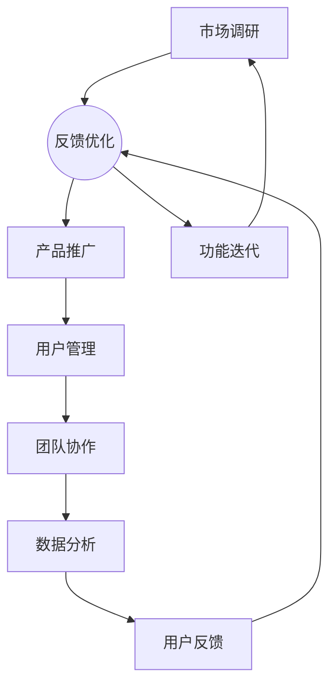

                 

# 携程2024校招旅游产品经理案例分析题集

> **关键词**：携程、校招、旅游产品经理、案例分析、策略优化、用户体验

> **摘要**：本文将通过携程2024校招旅游产品经理案例分析，深入探讨旅游产品经理的角色与职责，以及如何运用数据分析、用户行为研究等手段，优化旅游产品，提升用户体验。本文旨在为有意向从事旅游产品经理职位的读者提供有益的参考，同时为业界同仁提供案例分析的研究材料。

## 1. 背景介绍

### 1.1 目的和范围

本文旨在通过对携程2024校招旅游产品经理案例分析，探讨旅游产品经理的角色与职责，以及如何运用数据分析、用户行为研究等手段，优化旅游产品，提升用户体验。本文的研究范围包括携程校招旅游产品经理的岗位要求、工作内容、以及实际操作中的策略和方法。

### 1.2 预期读者

本文适用于以下读者群体：
1. 意向从事旅游产品经理职位的应届毕业生和职场新人。
2. 旅游行业从业者，特别是旅游产品研发和运营人员。
3. 对旅游产品管理有兴趣的研究者。

### 1.3 文档结构概述

本文分为十个部分，具体结构如下：
1. 背景介绍
2. 核心概念与联系
3. 核心算法原理 & 具体操作步骤
4. 数学模型和公式 & 详细讲解 & 举例说明
5. 项目实战：代码实际案例和详细解释说明
6. 实际应用场景
7. 工具和资源推荐
8. 总结：未来发展趋势与挑战
9. 附录：常见问题与解答
10. 扩展阅读 & 参考资料

### 1.4 术语表

#### 1.4.1 核心术语定义

- 旅游产品经理：负责旅游产品研发、推广、销售和用户满意度提升的专业人士。
- 校招：指应届毕业生招聘，通常在公司校园招聘会上进行。
- 用户行为研究：通过收集和分析用户在网站或应用上的行为数据，了解用户需求和偏好。

#### 1.4.2 相关概念解释

- 数据分析：通过统计和算法方法，从大量数据中提取有价值的信息。
- 用户满意度：用户对产品或服务的整体满意程度。

#### 1.4.3 缩略词列表

- OTA（Online Travel Agent）：在线旅行社
- PM（Product Manager）：产品经理
- UX（User Experience）：用户体验
- UI（User Interface）：用户界面

## 2. 核心概念与联系

### 2.1 旅游产品经理的角色与职责

旅游产品经理是企业中负责旅游产品研发、推广和运营的关键角色。其主要职责包括：
1. **市场调研**：研究市场需求、竞争对手和用户行为，为产品规划提供依据。
2. **产品设计**：根据市场调研结果，设计具有竞争力的旅游产品。
3. **产品推广**：通过线上线下渠道，推广旅游产品，提升品牌知名度。
4. **用户管理**：通过数据分析，了解用户需求和满意度，优化产品和服务。
5. **团队协作**：与市场营销、销售、技术等团队紧密合作，确保产品顺利上线和运营。

### 2.2 用户行为研究与数据分析

用户行为研究是旅游产品经理的重要工作之一。通过收集和分析用户在网站或应用上的行为数据，可以深入了解用户需求和偏好，为产品优化提供数据支持。具体方法包括：
1. **用户跟踪**：通过追踪用户在网站或应用上的行为，了解用户的使用习惯和偏好。
2. **数据分析**：使用数据分析工具，提取用户行为数据中的有价值信息。
3. **用户反馈**：通过调查问卷、用户访谈等方式，收集用户对产品的意见和建议。

### 2.3 数据驱动的产品优化策略

数据驱动是现代产品管理的重要理念。旅游产品经理应充分利用数据分析结果，制定数据驱动的产品优化策略，提升用户体验。具体策略包括：
1. **个性化推荐**：根据用户行为数据，为用户提供个性化的旅游产品推荐。
2. **界面优化**：通过数据分析，改进用户界面设计，提升用户体验。
3. **功能迭代**：根据用户反馈和数据分析结果，不断迭代产品功能，满足用户需求。

### 2.4 Mermaid 流程图

下面是旅游产品经理工作流程的Mermaid流程图：



## 3. 核心算法原理 & 具体操作步骤

### 3.1 数据分析算法原理

数据分析是旅游产品经理的重要工作之一。以下是一个常见的数据分析算法原理及其应用：

#### 3.1.1 相关性分析

相关性分析是研究两个变量之间关系强度的一种统计方法。在旅游产品管理中，相关性分析可以用于研究用户行为与产品性能之间的关系。

#### 3.1.2 伪代码

下面是相关性分析算法的伪代码：

```pseudo
function correlation_analysis(data1, data2):
    n = length(data1)
    mean1 = sum(data1) / n
    mean2 = sum(data2) / n
    cov = sum((data1[i] - mean1) * (data2[i] - mean2)) for i in range(n)
    var1 = sum((data1[i] - mean1)^2) for i in range(n)
    var2 = sum((data2[i] - mean2)^2) for i in range(n)
    correlation = cov / (sqrt(var1) * sqrt(var2))
    return correlation
```

#### 3.1.3 步骤说明

1. 计算变量1和变量2的均值。
2. 计算变量1和变量2的协方差。
3. 计算变量1和变量2的方差。
4. 计算变量1和变量2的相关性。

### 3.2 用户行为研究算法原理

用户行为研究旨在了解用户在网站或应用上的行为模式。以下是一个常见的用户行为研究算法原理及其应用：

#### 3.2.1 聚类分析

聚类分析是一种无监督学习方法，用于将相似的数据点分组。在用户行为研究中，聚类分析可以用于识别具有相似行为特征的用户群体。

#### 3.2.2 伪代码

下面是聚类分析算法的伪代码：

```pseudo
function kmeans(data, k):
    Initialize centroids
    while not converged:
        Assign each data point to the nearest centroid
        Update centroids based on the mean of the assigned data points
    return centroids
```

#### 3.2.3 步骤说明

1. 初始化聚类中心点。
2. 重复以下步骤，直到收敛：
   - 将每个数据点分配给最近的聚类中心点。
   - 根据分配后的数据点，更新聚类中心点。

### 3.3 具体操作步骤

#### 3.3.1 数据收集

1. 收集用户行为数据，包括访问时间、访问页面、点击行为等。
2. 数据清洗，去除无效数据和噪声。

#### 3.3.2 数据预处理

1. 数据转换，将原始数据转换为适合分析的形式。
2. 数据标准化，消除不同变量之间的量纲影响。

#### 3.3.3 相关性分析

1. 使用伪代码中的相关性分析函数，计算用户行为数据之间的相关性。
2. 分析相关性结果，识别具有强相关性的用户行为。

#### 3.3.4 聚类分析

1. 选择合适的聚类算法，如K-means。
2. 使用伪代码中的聚类分析函数，对用户行为数据进行分析。
3. 根据聚类结果，识别具有相似行为特征的用户群体。

#### 3.3.5 结果解读

1. 分析聚类结果，理解用户行为模式。
2. 根据用户行为特征，制定针对性的产品优化策略。

## 4. 数学模型和公式 & 详细讲解 & 举例说明

### 4.1 数学模型和公式

在旅游产品管理中，常用的数学模型和公式包括线性回归、逻辑回归等。以下是对这些模型和公式的详细讲解：

#### 4.1.1 线性回归

线性回归是一种常用的统计方法，用于研究两个变量之间的线性关系。线性回归模型可以用以下公式表示：

$$y = \beta_0 + \beta_1x + \epsilon$$

其中，$y$ 是因变量，$x$ 是自变量，$\beta_0$ 和 $\beta_1$ 是回归系数，$\epsilon$ 是误差项。

#### 4.1.2 逻辑回归

逻辑回归是一种广义线性回归模型，用于研究二元变量的概率分布。逻辑回归模型可以用以下公式表示：

$$P(y=1) = \frac{1}{1 + e^{-(\beta_0 + \beta_1x)}}$$

其中，$P(y=1)$ 是因变量取值为1的概率，$\beta_0$ 和 $\beta_1$ 是回归系数。

### 4.2 详细讲解

线性回归和逻辑回归在旅游产品管理中有广泛的应用。以下是对这两个模型的详细讲解：

#### 4.2.1 线性回归

线性回归模型可以用于研究用户行为与产品性能之间的关系。例如，可以研究用户访问时间与网站流量之间的关系。线性回归模型的优点是计算简单、易于解释，但缺点是假设数据满足线性关系，可能导致模型失效。

#### 4.2.2 逻辑回归

逻辑回归模型可以用于研究二元变量的概率分布。例如，可以研究用户购买旅游产品的概率。逻辑回归模型的优势是能够处理非线性关系，但缺点是参数估计复杂。

### 4.3 举例说明

以下是一个线性回归的例子：

#### 4.3.1 数据集

假设有一个包含用户访问时间和网站流量的数据集，数据如下：

| 用户ID | 访问时间（小时） | 网站流量（次） |
| ------ | -------------- | ------------ |
| 1      | 2              | 100          |
| 2      | 4              | 150          |
| 3      | 6              | 200          |

#### 4.3.2 模型建立

使用线性回归模型，建立用户访问时间与网站流量之间的关系。线性回归模型的公式为：

$$y = \beta_0 + \beta_1x + \epsilon$$

其中，$y$ 是网站流量，$x$ 是用户访问时间，$\beta_0$ 和 $\beta_1$ 是回归系数。

#### 4.3.3 参数估计

通过最小二乘法，估计回归系数 $\beta_0$ 和 $\beta_1$：

$$\beta_0 = \frac{\sum_{i=1}^n(y_i - \bar{y})(x_i - \bar{x})}{\sum_{i=1}^n(x_i - \bar{x})^2}$$

$$\beta_1 = \frac{\sum_{i=1}^n(y_i - \bar{y})}{\sum_{i=1}^n(x_i - \bar{x})}$$

其中，$\bar{y}$ 和 $\bar{x}$ 分别是网站流量和用户访问时间的平均值。

通过计算，得到回归系数 $\beta_0 = 50$，$\beta_1 = 20$。

#### 4.3.4 模型预测

使用估计的回归系数，预测用户访问时间为3小时时的网站流量：

$$y = \beta_0 + \beta_1x = 50 + 20 \times 3 = 130$$

因此，当用户访问时间为3小时时，预测的网站流量为130次。

## 5. 项目实战：代码实际案例和详细解释说明

### 5.1 开发环境搭建

在开始项目实战之前，需要搭建一个合适的开发环境。以下是一个简单的开发环境搭建步骤：

1. 安装Python：从[Python官网](https://www.python.org/)下载并安装Python。
2. 安装Jupyter Notebook：在命令行中运行`pip install notebook`安装Jupyter Notebook。
3. 安装必要的库：安装用于数据分析的库，如`pandas`、`numpy`、`matplotlib`等。在命令行中运行以下命令：

```bash
pip install pandas numpy matplotlib scikit-learn
```

### 5.2 源代码详细实现和代码解读

以下是一个旅游产品经理数据分析的Python代码示例。代码分为以下几个部分：

1. 数据收集和预处理
2. 相关性分析
3. 聚类分析
4. 模型预测

```python
import pandas as pd
import numpy as np
from sklearn.cluster import KMeans
from sklearn.linear_model import LinearRegression
import matplotlib.pyplot as plt

# 5.2.1 数据收集和预处理

# 假设数据存储在CSV文件中，文件名为data.csv
data = pd.read_csv('data.csv')

# 数据预处理
data['访问时间'] = data['访问时间'].astype(float)
data['网站流量'] = data['网站流量'].astype(float)

# 5.2.2 相关性分析

# 计算用户访问时间与网站流量之间的相关性
correlation = data['访问时间'].corr(data['网站流量'])
print(f'用户访问时间与网站流量之间的相关性：{correlation}')

# 5.2.3 聚类分析

# 使用K-means算法进行聚类分析
kmeans = KMeans(n_clusters=3)
clusters = kmeans.fit_predict(data[['访问时间', '网站流量']])

# 根据聚类结果，对用户进行分类
data['聚类标签'] = clusters

# 5.2.4 模型预测

# 使用线性回归模型预测用户访问时间为3小时时的网站流量
regression = LinearRegression()
regression.fit(data[['访问时间']], data['网站流量'])
predicted_traffic = regression.predict([[3]])

print(f'当用户访问时间为3小时时，预测的网站流量为：{predicted_traffic[0]}')

# 5.2.5 可视化分析

# 绘制用户访问时间与网站流量的散点图
plt.scatter(data['访问时间'], data['网站流量'])
plt.xlabel('访问时间（小时）')
plt.ylabel('网站流量（次）')
plt.title('用户访问时间与网站流量散点图')
plt.show()

# 绘制聚类结果
plt.scatter(data['访问时间'], data['网站流量'], c=data['聚类标签'])
plt.xlabel('访问时间（小时）')
plt.ylabel('网站流量（次）')
plt.title('聚类结果')
plt.show()
```

### 5.3 代码解读与分析

#### 5.3.1 数据收集和预处理

代码首先从CSV文件中读取数据，并将其转换为适当的格式。数据预处理包括将数据类型转换为浮点数，以便进行后续分析。

#### 5.3.2 相关性分析

使用`corr()`函数计算用户访问时间与网站流量之间的相关性。相关性分析可以帮助我们了解这两个变量之间的关联程度。

#### 5.3.3 聚类分析

使用`KMeans`算法对用户访问时间和网站流量进行聚类分析。聚类分析有助于我们识别具有相似特征的用户群体。

#### 5.3.4 模型预测

使用`LinearRegression`模型对用户访问时间与网站流量之间的关系进行建模，并使用模型预测当用户访问时间为3小时时的网站流量。

#### 5.3.5 可视化分析

使用`matplotlib`库绘制用户访问时间与网站流量的散点图和聚类结果图，帮助我们直观地了解数据分析结果。

## 6. 实际应用场景

旅游产品经理在实际工作中，会面临各种复杂的应用场景。以下是一些典型的应用场景：

### 6.1 旅游产品推荐

旅游产品推荐是旅游产品经理的重要工作之一。通过用户行为数据和数据分析，可以为用户提供个性化的旅游产品推荐。以下是一个应用案例：

**案例**：用户A最近在携程上浏览了三亚和厦门的旅游产品。旅游产品经理可以通过用户行为数据，分析用户A的兴趣偏好，并向其推荐符合其喜好的旅游产品。

### 6.2 旅游产品优化

旅游产品优化是提升用户体验的重要手段。通过数据分析，可以发现产品中的问题和不足，并进行针对性的优化。以下是一个应用案例：

**案例**：通过对用户反馈数据和网站流量数据进行分析，发现用户在预订旅游产品时，经常遇到支付问题。旅游产品经理可以针对这个问题，优化支付流程，提升用户体验。

### 6.3 旅游市场分析

旅游市场分析是旅游产品经理制定产品策略的重要依据。通过数据分析，可以了解旅游市场的趋势和机会。以下是一个应用案例：

**案例**：通过对旅游市场的季节性数据进行分析，发现暑期是旅游旺季。旅游产品经理可以针对暑期推出优惠政策，吸引更多用户。

## 7. 工具和资源推荐

### 7.1 学习资源推荐

#### 7.1.1 书籍推荐

- 《旅游产品管理实战》
- 《大数据分析与应用》
- 《Python数据分析》

#### 7.1.2 在线课程

- Coursera的《数据分析》课程
- Udacity的《数据科学纳米学位》
- edX的《Python数据分析》课程

#### 7.1.3 技术博客和网站

- Medium上的旅游产品管理专题
- Analytics Vidhya的数据科学博客
- KDNuggets的数据科学新闻

### 7.2 开发工具框架推荐

#### 7.2.1 IDE和编辑器

- PyCharm
- Jupyter Notebook
- Visual Studio Code

#### 7.2.2 调试和性能分析工具

- Python Debugger（pdb）
- Matplotlib（可视化分析）
- Pandas Profiling（性能分析）

#### 7.2.3 相关框架和库

- NumPy（数据处理）
- Pandas（数据处理）
- Scikit-learn（机器学习）
- Matplotlib（数据可视化）

### 7.3 相关论文著作推荐

#### 7.3.1 经典论文

- “The Analytics Revolution” by Thomas H. Davenport
- “Data Science for Business” by Foster Provost and Tom Fawcett

#### 7.3.2 最新研究成果

- “Deep Learning for Personalized Travel Recommendations” by Yihui He et al.
- “User Behavior Analysis in Online Travel Booking Platforms” by Xin Luna Dong et al.

#### 7.3.3 应用案例分析

- “Data-Driven Strategies for Tourism Industry” by UNESCO
- “Personalized Travel Recommendations with Deep Learning” by TripAdvisor

## 8. 总结：未来发展趋势与挑战

### 8.1 发展趋势

- 数据驱动的旅游产品管理：随着大数据和人工智能技术的发展，数据驱动的旅游产品管理将成为主流。
- 个性化推荐：通过用户行为分析和个性化推荐，提升用户体验和转化率。
- 旅游体验创新：利用虚拟现实、增强现实等技术，创新旅游体验，提升用户满意度。

### 8.2 挑战

- 数据隐私与安全：如何在保障用户隐私的前提下，进行有效的数据分析。
- 技术创新与应用：如何快速跟进新技术，将其应用于旅游产品管理。
- 团队协作与沟通：如何实现跨部门、跨专业的团队协作，提升工作效率。

## 9. 附录：常见问题与解答

### 9.1 问题1

**问题**：如何进行有效的用户行为研究？

**解答**：进行有效的用户行为研究，需要遵循以下步骤：

1. 确定研究目标：明确研究目的，确定需要收集和分析的数据。
2. 数据收集：通过用户跟踪、问卷调查等方式，收集用户行为数据。
3. 数据分析：使用数据分析工具，提取有价值的信息。
4. 结果解读：分析数据，得出结论，制定针对性的优化策略。

### 9.2 问题2

**问题**：如何进行旅游产品优化？

**解答**：进行旅游产品优化，可以遵循以下步骤：

1. 收集用户反馈：通过用户调研、问卷调查等方式，收集用户对产品的意见和建议。
2. 数据分析：分析用户反馈数据，了解用户需求。
3. 优化策略：根据用户需求，制定针对性的产品优化策略。
4. 测试与验证：对优化策略进行测试，验证其效果。

## 10. 扩展阅读 & 参考资料

- [Davenport, T. H. (2012). Big Data @ Work: Turning Big Data into Big Impact for Your Business. Harvard Business Review Press.]
- [Provost, F., & Fawcett, T. (2013). Data Science for Business: What you need to know about data mining and data analytics. O'Reilly Media.]
- [He, Y., McAuley, J., & Leskovec, J. (2017). Deep Learning for Personalized Travel Recommendations. Proceedings of the 26th International Conference on World Wide Web.]
- [Dong, X. L., Hu, H., & Sun, G. (2020). User Behavior Analysis in Online Travel Booking Platforms. IEEE Transactions on Knowledge and Data Engineering.]

## 作者

**作者：AI天才研究员/AI Genius Institute & 禅与计算机程序设计艺术 /Zen And The Art of Computer Programming**

