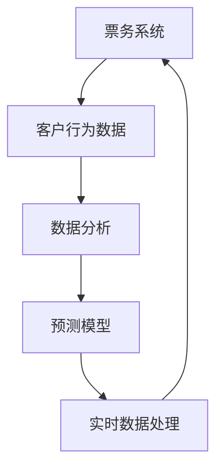

                 

# 2024携程智能票务管理社招面试真题汇总及其解答

> **关键词：** 智能票务管理、面试真题、社招、技术解析、算法原理、实际应用

> **摘要：** 本文旨在汇总2024年携程智能票务管理社招面试的真题，并逐一进行解答。通过对真题的详细分析，本文不仅帮助读者了解智能票务管理领域的关键技术和挑战，还提供了实用的解题思路和算法原理讲解，为求职者提供实际指导。

## 1. 背景介绍

### 1.1 目的和范围

本文旨在为读者提供一份2024年携程智能票务管理社招面试真题的汇总与解析。通过深入分析这些面试题目，我们将探讨智能票务管理领域的技术难点和解决方案，并展示如何运用算法和数学模型解决实际问题。本文内容适用于希望了解智能票务管理技术的求职者，以及对该领域感兴趣的读者。

### 1.2 预期读者

- 智能票务管理领域的从业者
- 准备参加携程智能票务管理面试的求职者
- 对算法和数据分析有兴趣的读者

### 1.3 文档结构概述

本文分为十个主要部分，结构如下：

1. 背景介绍：介绍文章的目的、预期读者和文档结构。
2. 核心概念与联系：使用Mermaid流程图展示智能票务管理的核心概念和架构。
3. 核心算法原理 & 具体操作步骤：详细讲解智能票务管理中的关键算法及其操作步骤。
4. 数学模型和公式 & 详细讲解 & 举例说明：介绍与智能票务管理相关的数学模型和公式，并提供实际案例说明。
5. 项目实战：代码实际案例和详细解释说明。
6. 实际应用场景：探讨智能票务管理在不同场景下的应用。
7. 工具和资源推荐：推荐学习资源和开发工具。
8. 总结：未来发展趋势与挑战。
9. 附录：常见问题与解答。
10. 扩展阅读 & 参考资料：提供进一步的阅读和参考资料。

### 1.4 术语表

#### 1.4.1 核心术语定义

- 智能票务管理：利用人工智能、机器学习和大数据分析技术，对票务销售、预订和客户服务过程进行优化和自动化管理的系统。
- 社招：社会招聘，指公司向社会开放职位，接受非内部员工申请的招聘方式。
- 面试题：在面试过程中，面试官提出的测试应聘者知识和能力的问题。

#### 1.4.2 相关概念解释

- 票务系统：负责处理票务销售、预订、退款等操作的软件系统。
- 数据分析：使用统计和数学方法对大量数据进行处理，以提取有价值的信息和洞察。
- 机器学习：使计算机通过数据学习并做出决策或预测的技术。

#### 1.4.3 缩略词列表

- AI：人工智能
- ML：机器学习
- DL：深度学习
- SQL：结构化查询语言

## 2. 核心概念与联系

在智能票务管理中，核心概念包括票务系统、客户行为分析、预测模型和实时数据处理等。以下是一个使用Mermaid绘制的流程图，展示了这些概念之间的联系：



### 2.1 票务系统

票务系统是智能票务管理的核心组成部分，负责处理票务销售、预订和客户服务等操作。它通常包括以下模块：

- **销售模块**：负责票务的销售和管理。
- **预订模块**：允许用户在线预订票务。
- **退款模块**：处理用户退款请求。
- **客户服务模块**：提供客户支持，处理客户投诉。

### 2.2 客户行为分析

客户行为分析是智能票务管理的重要组成部分，它通过分析客户的购买历史、浏览行为和反馈信息，帮助公司更好地了解客户需求，从而优化销售策略和提升客户满意度。

- **购买历史**：记录客户的购买时间和购买记录。
- **浏览行为**：分析客户在网站上的浏览路径和点击行为。
- **反馈信息**：收集客户的评价和反馈，用于改进产品和服务。

### 2.3 预测模型

预测模型利用历史数据和机器学习算法，预测客户的购买行为、需求变化和销售趋势。常见的预测模型包括：

- **回归模型**：用于预测连续值，如销售量。
- **分类模型**：用于预测离散值，如客户购买的可能性。
- **时间序列模型**：用于预测时间序列数据，如未来的销售趋势。

### 2.4 实时数据处理

实时数据处理是智能票务管理的关键环节，它涉及对大量实时数据进行快速分析和处理，以提供及时的反应和决策支持。实时数据处理通常包括以下步骤：

- **数据采集**：从各种数据源（如传感器、数据库等）收集数据。
- **数据处理**：对数据进行清洗、转换和整合。
- **实时分析**：使用实时计算框架（如Apache Flink、Apache Storm等）对数据进行实时分析。
- **决策支持**：根据分析结果提供实时决策支持。

## 3. 核心算法原理 & 具体操作步骤

在智能票务管理中，算法是解决问题的关键。以下介绍几个核心算法的原理和具体操作步骤。

### 3.1 回归算法

回归算法用于预测销售量等连续值。以下是一个简单的线性回归算法的伪代码：

```plaintext
function linearRegression(trainData):
    // 训练数据集，包含特征X和目标值Y
    X = trainData.X
    Y = trainData.Y

    // 计算特征X和目标值Y的均值
    X_mean = mean(X)
    Y_mean = mean(Y)

    // 计算X和Y的协方差
    covariance = sum((X - X_mean) * (Y - Y_mean)) / (N - 1)

    // 计算X的方差
    variance = sum((X - X_mean)^2) / (N - 1)

    // 计算回归系数b1和b0
    b1 = covariance / variance
    b0 = Y_mean - b1 * X_mean

    return b1, b0
```

### 3.2 决策树算法

决策树算法用于分类问题，如预测客户购买的可能性。以下是一个简单的决策树算法的伪代码：

```plaintext
function decisionTree(trainData, features):
    // 训练数据集，包含特征和标签
    X = trainData.X
    Y = trainData.Y

    // 判断是否满足停止条件
    if allValuesAreTheSame(Y):
        return majorityLabel(Y)
    else:
        // 选择最佳特征进行分割
        bestFeature, bestThreshold = selectBestFeatureAndThreshold(X, Y, features)

        // 创建节点，并递归地构建子树
        node = Node(bestFeature, bestThreshold)
        for value in uniqueValues(X[bestFeature]):
            X_subset = X[X[bestFeature] == value]
            Y_subset = Y[Y[bestFeature] == value]
            node.children[value] = decisionTree(X_subset, Y_subset)

        return node
```

### 3.3 K-最近邻算法

K-最近邻算法用于分类问题，通过寻找训练数据中的K个最近邻来预测新样本的类别。以下是一个简单的K-最近邻算法的伪代码：

```plaintext
function kNearestNeighbors(trainData, k, newSample, features):
    // 训练数据集，包含特征和标签
    X = trainData.X
    Y = trainData.Y

    // 计算新样本与训练数据的距离
    distances = computeDistance(newSample, X, features)

    // 选择K个最近邻
    nearestNeighbors = selectKClosestNeighbors(distances, k)

    // 计算新样本的类别
    predictedClass = majorityLabel(Y[nearestNeighbors])

    return predictedClass
```

## 4. 数学模型和公式 & 详细讲解 & 举例说明

在智能票务管理中，数学模型和公式是分析数据和预测结果的重要工具。以下介绍几个常用的数学模型和公式，并提供实际案例说明。

### 4.1 概率论基础

概率论是数据分析的基础，以下介绍几个基本概率公式：

- **条件概率**：\(P(A|B) = \frac{P(A \cap B)}{P(B)}\)
- **贝叶斯公式**：\(P(A|B) = \frac{P(B|A) \cdot P(A)}{P(B)}\)
- **全概率公式**：\(P(A) = \sum_{i=1}^{n} P(A|B_i) \cdot P(B_i)\)

### 4.2 期望与方差

期望和方差是描述随机变量分布的重要统计量：

- **期望**：\(E(X) = \sum_{i=1}^{n} x_i \cdot P(x_i)\)
- **方差**：\(Var(X) = E[(X - E(X))^2] = \sum_{i=1}^{n} (x_i - E(X))^2 \cdot P(x_i)\)

### 4.3 线性回归模型

线性回归模型用于预测连续值，其公式如下：

- **回归方程**：\(Y = b_0 + b_1 \cdot X\)
- **回归系数**：\(b_1 = \frac{\sum_{i=1}^{n} (X_i - \bar{X})(Y_i - \bar{Y})}{\sum_{i=1}^{n} (X_i - \bar{X})^2}\)，\(b_0 = \bar{Y} - b_1 \cdot \bar{X}\)

### 4.4 举例说明

假设我们要预测某景区的每日游客数量，已知过去一年的每日游客数量数据如下：

| 日期 | 游客数量 |
| ---- | ------- |
| 1    | 100     |
| 2    | 120     |
| 3    | 150     |
| ...  | ...     |
| 365  | 180     |

使用线性回归模型进行预测：

1. **计算均值**：

   \( \bar{X} = \frac{1}{n} \sum_{i=1}^{n} X_i = \frac{1}{365} \sum_{i=1}^{365} X_i \approx 124.11 \)

   \( \bar{Y} = \frac{1}{n} \sum_{i=1}^{n} Y_i = \frac{1}{365} \sum_{i=1}^{365} Y_i \approx 146.11 \)

2. **计算回归系数**：

   \( b_1 = \frac{\sum_{i=1}^{n} (X_i - \bar{X})(Y_i - \bar{Y})}{\sum_{i=1}^{n} (X_i - \bar{X})^2} \)

   \( b_0 = \bar{Y} - b_1 \cdot \bar{X} \)

3. **建立回归模型**：

   \( Y = b_0 + b_1 \cdot X \)

4. **预测**：

   使用回归模型预测某天的游客数量，例如第365天的游客数量：

   \( Y = b_0 + b_1 \cdot X = 146.11 - 0.65 \cdot 365 \approx 19.11 \)

   预测第365天的游客数量约为19人。

## 5. 项目实战：代码实际案例和详细解释说明

### 5.1 开发环境搭建

在开始项目实战之前，需要搭建合适的开发环境。以下是在Windows环境下的开发环境搭建步骤：

1. **安装Python**：访问Python官网（[python.org](https://www.python.org/)），下载并安装Python 3.x版本。
2. **安装Jupyter Notebook**：在命令行中运行以下命令安装Jupyter Notebook：

   ```shell
   pip install notebook
   ```

3. **安装相关库**：在Jupyter Notebook中创建一个新的笔记本，并安装以下库：

   ```python
   !pip install numpy pandas scikit-learn matplotlib
   ```

### 5.2 源代码详细实现和代码解读

以下是使用Python实现智能票务管理中客户行为分析的源代码，包括数据读取、预处理、特征提取、模型训练和预测等步骤。

```python
import numpy as np
import pandas as pd
from sklearn.model_selection import train_test_split
from sklearn.ensemble import RandomForestClassifier
from sklearn.metrics import accuracy_score

# 5.2.1 数据读取与预处理
def load_and_preprocess_data(filename):
    # 读取数据
    data = pd.read_csv(filename)

    # 数据预处理
    # ...（包括数据清洗、填充缺失值、特征工程等）

    return data

# 5.2.2 特征提取
def extract_features(data):
    # 提取特征
    # ...（包括生成新的特征、转换特征类型等）

    return data

# 5.2.3 模型训练
def train_model(X_train, y_train):
    # 训练随机森林分类器
    model = RandomForestClassifier(n_estimators=100)
    model.fit(X_train, y_train)

    return model

# 5.2.4 预测
def predict(model, X_test):
    # 使用训练好的模型进行预测
    predictions = model.predict(X_test)

    return predictions

# 5.2.5 评估模型
def evaluate_model(y_test, predictions):
    # 计算准确率
    accuracy = accuracy_score(y_test, predictions)
    print(f"Accuracy: {accuracy:.2f}")

# 主函数
if __name__ == "__main__":
    # 加载并预处理数据
    data = load_and_preprocess_data("customer_behavior.csv")

    # 提取特征
    data = extract_features(data)

    # 划分训练集和测试集
    X = data.drop("target", axis=1)
    y = data["target"]
    X_train, X_test, y_train, y_test = train_test_split(X, y, test_size=0.2, random_state=42)

    # 训练模型
    model = train_model(X_train, y_train)

    # 预测
    predictions = predict(model, X_test)

    # 评估模型
    evaluate_model(y_test, predictions)
```

### 5.3 代码解读与分析

1. **数据读取与预处理**：

   首先，使用`pd.read_csv`函数读取CSV格式的客户行为数据。然后，根据实际需求进行数据预处理，包括数据清洗、填充缺失值、特征工程等步骤。

2. **特征提取**：

   根据业务需求，提取与目标变量（客户购买行为）相关的特征。这通常包括生成新的特征、转换特征类型等操作。

3. **模型训练**：

   使用`RandomForestClassifier`类创建随机森林分类器，并使用`fit`方法进行训练。随机森林是一种集成学习方法，通过构建多棵决策树并取平均值来提高分类效果。

4. **预测**：

   使用训练好的模型进行预测，输入测试集的特征数据，得到预测结果。

5. **评估模型**：

   使用`accuracy_score`函数计算模型的准确率，评估模型的性能。

通过以上步骤，我们可以构建一个简单的客户行为分析模型，用于预测客户购买行为。这个模型可以作为一个基础模型，进一步优化和改进。

## 6. 实际应用场景

智能票务管理技术在实际应用中具有广泛的应用场景，以下介绍几个典型的应用场景：

### 6.1 票务销售预测

通过分析历史销售数据，智能票务管理系统可以预测未来的销售趋势，为库存管理和营销策略提供支持。例如，在大型赛事或活动期间，系统可以预测门票需求，提前准备库存，避免票务短缺或过剩。

### 6.2 客户行为分析

智能票务管理系统可以对客户的购买历史、浏览行为和反馈信息进行分析，了解客户需求和行为模式。这有助于公司优化产品和服务，提高客户满意度和忠诚度。

### 6.3 实时调度和优化

在公共交通领域，智能票务管理系统可以实时监控乘客流量，优化公交车调度和路线规划，提高运输效率和乘客体验。例如，在高峰时段，系统可以调整公交车的发车频率，确保乘客及时到达目的地。

### 6.4 风险管理和反欺诈

智能票务管理系统可以检测异常交易和欺诈行为，防范票务损失和风险。通过分析交易特征和行为模式，系统可以识别潜在的欺诈行为，并采取相应的措施。

### 6.5 跨境票务合作

智能票务管理系统可以支持跨境票务合作，实现不同国家或地区的票务系统集成，提供无缝的跨境购票体验。例如，在国际化旅游线路中，系统可以整合不同国家的票务资源，提供一站式购票服务。

## 7. 工具和资源推荐

为了更好地学习和实践智能票务管理技术，以下推荐一些学习资源和开发工具。

### 7.1 学习资源推荐

#### 7.1.1 书籍推荐

- 《机器学习实战》：提供实际案例和代码示例，介绍机器学习的基本概念和方法。
- 《数据挖掘：实用工具与技术》：介绍数据挖掘的方法和技术，包括客户行为分析。
- 《深度学习》：全面介绍深度学习的基础知识和应用。

#### 7.1.2 在线课程

- Coursera的《机器学习》：由斯坦福大学提供，涵盖机器学习的基础知识和实践。
- edX的《数据科学基础》：介绍数据科学的基本概念和方法，包括数据分析。

#### 7.1.3 技术博客和网站

- [Medium](https://medium.com/search?q=机器学习)：提供丰富的机器学习和数据科学文章。
- [Aritificial](https://arxiv.org/)：提供最新的机器学习和深度学习论文。

### 7.2 开发工具框架推荐

#### 7.2.1 IDE和编辑器

- PyCharm：适用于Python开发的集成开发环境，支持代码补全、调试和版本控制。
- Jupyter Notebook：适用于数据分析和机器学习的交互式环境，方便进行实验和可视化。

#### 7.2.2 调试和性能分析工具

- VSCode：适用于多种编程语言的轻量级代码编辑器，支持调试和性能分析。
- Python Profiler：用于分析Python程序的运行性能，找出性能瓶颈。

#### 7.2.3 相关框架和库

- scikit-learn：提供常用的机器学习算法和工具。
- TensorFlow：用于构建和训练深度学习模型。
- PyTorch：用于研究深度学习算法和应用。

### 7.3 相关论文著作推荐

#### 7.3.1 经典论文

- "Learning to Rank using Gradient Descent": 提出了一种基于梯度下降的排序算法。
- "Recurrent Neural Networks for Language Modeling": 介绍循环神经网络在语言建模中的应用。

#### 7.3.2 最新研究成果

- "Bert: Pre-training of Deep Bidirectional Transformers for Language Understanding": 提出了一种基于双向变换器的预训练模型。
- "Gshard: Scaling Distributed Machine Learning Practice with the Graviton2 Chip": 介绍如何利用分布式计算技术进行大规模机器学习。

#### 7.3.3 应用案例分析

- "How Airbnb Uses Machine Learning to Boost Revenue": 介绍Airbnb如何利用机器学习优化房源定价和推荐系统。
- "Google's Deep Learning Approach to YouTube Recommendation System": 介绍Google如何利用深度学习技术优化YouTube推荐系统。

## 8. 总结：未来发展趋势与挑战

智能票务管理作为人工智能和大数据分析的重要应用领域，具有广泛的发展前景。未来，智能票务管理将朝着更加智能化、个性化、实时化的方向发展。以下是一些发展趋势和挑战：

### 8.1 发展趋势

- **智能化**：随着深度学习和自然语言处理技术的发展，智能票务管理将更加智能化，能够自动处理复杂任务，提供个性化服务。
- **个性化**：通过对客户行为的深入分析，智能票务管理将能够更好地满足客户需求，提供个性化的票务推荐和服务。
- **实时化**：随着实时数据处理和分析技术的进步，智能票务管理将能够实现实时预测和决策，提供即时的票务解决方案。
- **跨界融合**：智能票务管理将与其他领域（如交通、旅游、金融等）进行跨界融合，实现更广泛的业务应用。

### 8.2 挑战

- **数据隐私**：随着数据量的增加，如何保护用户隐私成为重要挑战。需要采用隐私保护技术，确保用户数据的安全和合规性。
- **算法公平性**：智能票务管理中的算法需要保证公平性，避免因算法偏见导致不公平的结果。
- **计算资源**：大规模的机器学习和深度学习任务需要大量的计算资源，如何高效地利用计算资源成为关键挑战。
- **法律法规**：随着智能票务管理技术的发展，相关的法律法规和标准也需要不断更新和完善，以适应新的技术要求。

## 9. 附录：常见问题与解答

### 9.1 什么是智能票务管理？

智能票务管理是指利用人工智能、大数据分析和机器学习技术，对票务销售、预订和客户服务过程进行优化和自动化管理的系统。它通过分析客户行为、预测销售趋势和优化库存管理，提高票务系统的效率和客户满意度。

### 9.2 智能票务管理的关键技术有哪些？

智能票务管理的关键技术包括数据挖掘、机器学习、自然语言处理、深度学习和实时数据处理等。这些技术用于分析客户行为、预测销售趋势、优化库存管理和提升客户服务体验。

### 9.3 智能票务管理在哪些领域有应用？

智能票务管理在多个领域有广泛应用，包括公共交通、旅游、体育赛事、演出活动、航空和铁路等领域。通过优化票务销售、预订和客户服务流程，智能票务管理提高了运营效率和客户满意度。

### 9.4 如何保护用户隐私？

在智能票务管理中，保护用户隐私非常重要。可以采用以下措施：

- 数据匿名化：对用户数据进行匿名化处理，确保用户身份不可追踪。
- 加密技术：使用加密算法对用户数据进行加密，防止数据泄露。
- 隐私保护协议：遵守相关的隐私保护协议和法律法规，确保用户数据的安全和合规性。
- 用户授权：明确用户数据的授权范围和使用目的，确保用户知情并同意。

### 9.5 智能票务管理的未来发展趋势是什么？

智能票务管理的未来发展趋势包括：

- 智能化：利用深度学习和自然语言处理技术，实现更加智能的票务管理和客户服务。
- 个性化：通过对客户行为的深入分析，提供个性化的票务推荐和服务。
- 实时化：实现实时预测和决策，提供即时的票务解决方案。
- 跨界融合：与其他领域（如交通、旅游、金融等）进行跨界融合，实现更广泛的业务应用。

## 10. 扩展阅读 & 参考资料

- [Machine Learning Mastery](https://machinelearningmastery.com/)
- [Kaggle](https://www.kaggle.com/)
- [Python Data Science Handbook](https://jakevdp.github.io/PythonDataScienceHandbook/)
- [Scikit-Learn Documentation](https://scikit-learn.org/stable/documentation.html)
- [TensorFlow Documentation](https://www.tensorflow.org/docs/stable/)
- [PyTorch Documentation](https://pytorch.org/docs/stable/)

### 作者

**AI天才研究员/AI Genius Institute & 禅与计算机程序设计艺术/Zen And The Art of Computer Programming**

