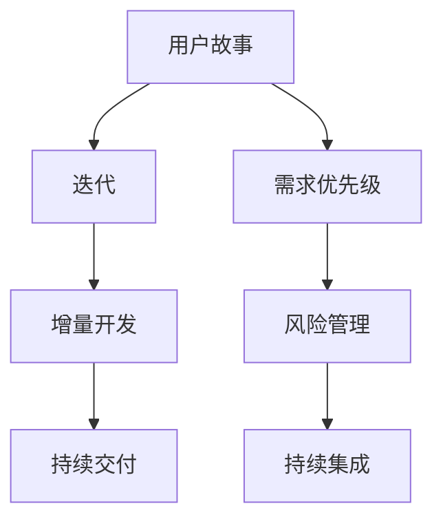

                 

# 敏捷项目管理：在复杂环境中快速交付

> 关键词：敏捷项目管理、迭代开发、团队协作、持续交付、风险管理、Scrum、Kanban、DevOps

> 摘要：本文将深入探讨敏捷项目管理在复杂环境中的应用，分析其核心概念和原理，介绍实施敏捷项目管理的具体步骤和方法，并通过实际案例进行详细解析，最后讨论敏捷项目管理的未来发展趋势与挑战。

## 1. 背景介绍

### 1.1 目的和范围

本文旨在探讨敏捷项目管理在当今复杂多变的环境中的实际应用。敏捷项目管理是一种以团队协作、快速迭代、持续交付为核心的方法论，旨在提高项目交付速度、降低风险、提高客户满意度。本文将覆盖以下内容：

1. **敏捷项目管理的核心概念和原则**：介绍敏捷的核心价值和基本理念，如用户故事、迭代、增量开发、持续集成等。
2. **敏捷项目管理框架**：分析常见的敏捷框架，如Scrum、Kanban、XP等，并解释它们在实际项目中的应用。
3. **敏捷项目管理步骤**：详细阐述从项目启动到交付的各个关键阶段，以及如何制定有效的敏捷计划。
4. **实际应用案例**：通过具体案例，展示敏捷项目管理的实际操作过程和成果。
5. **敏捷项目管理的未来趋势与挑战**：探讨敏捷项目管理在技术发展和市场竞争中的新趋势和面临的挑战。

### 1.2 预期读者

本文适合以下读者群体：

1. **项目经理**：希望了解敏捷项目管理方法和实践，提升项目交付效率。
2. **软件开发人员**：希望了解敏捷开发流程，提高团队协作效果。
3. **产品经理**：希望了解如何通过敏捷项目管理更好地满足用户需求。
4. **企业高管**：希望了解敏捷项目管理的优势和实际应用效果。
5. **IT领域学生和从业者**：希望深入了解敏捷项目管理理论和实践。

### 1.3 文档结构概述

本文结构如下：

1. **背景介绍**：介绍敏捷项目管理的背景、目的和范围。
2. **核心概念与联系**：解释敏捷项目管理的核心概念和原理，并给出流程图。
3. **核心算法原理 & 具体操作步骤**：详细阐述敏捷项目管理的实施步骤和策略。
4. **数学模型和公式 & 详细讲解 & 举例说明**：介绍敏捷项目管理中的数学模型和公式，并举例说明。
5. **项目实战：代码实际案例和详细解释说明**：通过实际案例展示敏捷项目管理的应用。
6. **实际应用场景**：分析敏捷项目管理在不同领域的应用案例。
7. **工具和资源推荐**：推荐学习资源和开发工具。
8. **总结：未来发展趋势与挑战**：探讨敏捷项目管理的未来方向和挑战。
9. **附录：常见问题与解答**：提供敏捷项目管理常见问题的解答。
10. **扩展阅读 & 参考资料**：推荐相关阅读材料。

### 1.4 术语表

#### 1.4.1 核心术语定义

- **敏捷项目管理**：一种以用户需求为中心、持续交付为目标的项目管理方法。
- **迭代**：项目开发过程中的一个周期，通常持续2-4周。
- **增量开发**：在每次迭代中逐步开发和完善产品功能。
- **用户故事**：描述用户需求和功能的简短故事。
- **Scrum**：一种敏捷项目管理框架，强调迭代、用户故事和团队成员角色。
- **Kanban**：一种可视化工作流程的敏捷框架，强调持续交付和风险管理。
- **DevOps**：结合软件开发（Dev）和运维（Ops）的实践，强调自动化和持续交付。

#### 1.4.2 相关概念解释

- **需求优先级**：根据用户价值和业务目标对需求进行排序。
- **风险管理**：识别、评估和应对项目中的潜在风险。
- **持续集成**：将代码变更自动集成到项目中，确保代码质量。
- **用户满意度**：衡量用户对产品或服务的满意程度。

#### 1.4.3 缩略词列表

- **Scrum**：敏捷开发框架
- **Kanban**：看板方法
- **DevOps**：开发与运维
- **QA**：质量保证
- **CI**：持续集成
- **CD**：持续交付

## 2. 核心概念与联系

在敏捷项目管理中，理解核心概念和原理是至关重要的。以下是敏捷项目管理的核心概念及其相互关系：

### 2.1. 核心概念

- **用户故事**：用户故事是敏捷开发中的一个基本元素，它以用户的需求和期望为出发点，描述产品的功能或特性。用户故事的格式通常是：“作为[角色]，我想要[功能]，以便[目标]。”
- **迭代**：迭代是敏捷开发中的一个周期，通常持续2-4周。在每个迭代中，团队会集中开发并交付一个可用的产品版本。
- **增量开发**：增量开发是一种逐步完善产品的方法，每个迭代都会增加新的功能和改进。
- **持续交付**：持续交付是一种确保产品快速、可靠交付的方法，通过自动化测试和部署，减少手动操作和错误。

### 2.2. 核心概念关系图

以下是敏捷项目管理核心概念的Mermaid流程图：



### 2.3. 核心概念原理

#### 用户故事

用户故事是敏捷开发的核心，它将用户的需求转化为具体的产品功能。用户故事不仅描述了用户的需求，还明确了功能的目标和背景，有助于团队更好地理解用户的需求和期望。

#### 迭代

迭代是敏捷开发中的一个周期，通常持续2-4周。在每个迭代中，团队会集中开发并交付一个可用的产品版本。迭代的目标是快速响应变化，确保产品持续改进和交付。

#### 增量开发

增量开发是一种逐步完善产品的方法。每个迭代都会增加新的功能和改进，而不是一次性交付完整的产品。这种开发方法有助于降低风险，提高产品的可维护性和灵活性。

#### 持续交付

持续交付是一种确保产品快速、可靠交付的方法。通过自动化测试和部署，持续交付减少了手动操作和错误，提高了交付速度和产品稳定性。

## 3. 核心算法原理 & 具体操作步骤

在敏捷项目管理中，核心算法原理和具体操作步骤对于项目的成功至关重要。以下是一个基于Scrum敏捷框架的详细操作步骤：

### 3.1. Scrum框架概述

Scrum是一种广泛使用的敏捷开发框架，它将项目分为一系列迭代，每个迭代都包含以下几个阶段：

1. **Sprint Planning**：规划下一个迭代的任务和目标。
2. **Daily Stand-up Meeting**：每日站立会议，团队交流进度和问题。
3. **Sprint**：开发周期，通常持续2-4周。
4. **Sprint Review**：评估迭代成果，获取反馈。
5. **Sprint Retrospective**：回顾迭代过程，改进团队工作。

### 3.2. 具体操作步骤

#### 3.2.1. Sprint Planning

1. **确定目标和优先级**：团队和产品负责人共同确定下一个迭代的目标和用户故事。
2. **分配任务**：团队根据优先级和任务量，分配任务给团队成员。
3. **制定迭代计划**：确定每个任务的时间线和完成标准。

#### 3.2.2. Daily Stand-up Meeting

1. **检查进度**：团队成员报告自己的进度和遇到的问题。
2. **解决问题**：团队共同解决遇到的问题。
3. **计划当天工作**：确定当天的工作计划和目标。

#### 3.2.3. Sprint

1. **开发用户故事**：团队按照计划开发用户故事。
2. **迭代评审**：在每个迭代结束时，评审用户故事和产品的进展。
3. **持续集成**：定期进行代码集成和测试，确保产品质量。

#### 3.2.4. Sprint Review

1. **展示迭代成果**：团队向产品负责人和利益相关者展示迭代成果。
2. **获取反馈**：收集反馈，了解用户和利益相关者的需求和期望。
3. **调整计划**：根据反馈调整后续迭代的目标和计划。

#### 3.2.5. Sprint Retrospective

1. **回顾过程**：团队回顾迭代过程中的优点和不足。
2. **提出改进**：讨论并提出改进建议，提高团队效率和质量。
3. **实施改进**：在下一个迭代中实施改进措施。

### 3.3. 伪代码实现

以下是一个简化的Scrum迭代过程的伪代码实现：

```python
def sprint_planning(stories):
    select_highest_priority_stories(stories)
    assign_tasks_to_team_members(stories)
    create_sprint_plan(stories)

def daily_stand_up():
    for member in team_members:
        check_progress(member)
        solve_issues(member)
        plan_daily_work(member)

def sprint(stories):
    while not all_stories_completed(stories):
        develop_user_stories(stories)
        integrate_and_test_code()

def sprint_review():
    showcase_iteration成果()
    gather_feedback()
    adjust_future_sprints()

def sprint_retrospective():
    review_iteration_process()
    propose_improvements()
    implement_improvements()
```

## 4. 数学模型和公式 & 详细讲解 & 举例说明

在敏捷项目管理中，数学模型和公式可以用于评估项目进度、风险和团队效率。以下是一些常用的数学模型和公式，并给出详细讲解和示例。

### 4.1. 项目进度评估

#### 4.1.1. 完工百分比值（CPI）

CPI是评估项目进度的常用指标，计算公式如下：

$$
CPI = \frac{EV}{AC}
$$

其中，EV是已完成工作的预算价值，AC是实际成本。

#### 示例

假设一个项目的预算为100万元，已完成的工作价值为50万元，实际成本为60万元。则CPI为：

$$
CPI = \frac{50}{60} = 0.8333
$$

CPI小于1，表示项目超支，CPI大于1，表示项目节支。

### 4.2. 项目风险评估

#### 4.2.1. 风险矩阵

风险矩阵是一种评估项目风险的常用方法，通过风险的可能性和影响来评估风险。以下是一个简化的风险矩阵：

| 可能性 | 影响程度 | 风险等级 |
| :--: | :--: | :--: |
| 低 | 低 | 低 |
| 低 | 中 | 中 |
| 低 | 高 | 高 |
| 中 | 低 | 中 |
| 中 | 中 | 高 |
| 中 | 高 | 高 |
| 高 | 低 | 高 |
| 高 | 中 | 高 |
| 高 | 高 | 高 |

#### 示例

假设一个项目面临以下风险：

- 可能性：低
- 影响程度：高

则该风险等级为“高”。

### 4.3. 团队效率评估

#### 4.3.1. 通过工作日数评估（WIP）

WIP是评估团队效率的一个指标，计算公式如下：

$$
WIP = \frac{完成的工作量}{工作日数}
$$

#### 示例

假设一个团队在30个工作日内完成了100个任务，则WIP为：

$$
WIP = \frac{100}{30} = 3.3333
$$

WIP大于3表示团队效率较高，WIP小于3表示团队效率较低。

### 4.4. 持续交付评估

#### 4.4.1. 持续交付指数（CDI）

CDI是评估持续交付效率的指标，计算公式如下：

$$
CDI = \frac{交付的次数}{迭代周期}
$$

#### 示例

假设一个团队在一个4周的迭代周期内完成了3次交付，则CDI为：

$$
CDI = \frac{3}{4} = 0.75
$$

CDI越接近1，表示持续交付效率越高。

## 5. 项目实战：代码实际案例和详细解释说明

为了更好地展示敏捷项目管理的实际应用，我们将通过一个实际案例来详细介绍整个项目的开发过程，包括环境搭建、代码实现、代码解读与分析。

### 5.1. 开发环境搭建

首先，我们需要搭建一个开发环境，用于项目的开发和测试。以下是所需的工具和软件：

- **操作系统**：Linux（推荐Ubuntu 20.04）
- **开发工具**：Visual Studio Code（VSCode）
- **编程语言**：Python（推荐Python 3.8及以上版本）
- **版本控制**：Git
- **代码库**：GitHub

以下是环境搭建的步骤：

1. **安装操作系统**：从Ubuntu官方网站下载并安装操作系统。
2. **安装VSCode**：在Ubuntu系统中安装VSCode。
3. **安装Python**：使用`sudo apt-get install python3`命令安装Python。
4. **安装Git**：使用`sudo apt-get install git`命令安装Git。
5. **配置GitHub**：在GitHub网站上注册账号，并配置SSH密钥以连接GitHub。

### 5.2. 源代码详细实现和代码解读

我们选择一个简单的Web应用作为案例，这个应用将使用Python的Flask框架实现。以下是项目的源代码：

```python
# app.py
from flask import Flask, request, jsonify

app = Flask(__name__)

@app.route('/hello', methods=['GET'])
def hello():
    name = request.args.get('name', default='World')
    return f'Hello, {name}!'

if __name__ == '__main__':
    app.run()
```

#### 5.2.1. 代码解读

1. **导入模块**：`from flask import Flask, request, jsonify`。这里导入了Flask框架的必需模块。
2. **定义App**：`app = Flask(__name__)`。创建一个Flask应用实例。
3. **定义路由**：`@app.route('/hello', methods=['GET'])`。定义一个/hello路由，处理GET请求。
4. **处理请求**：`name = request.args.get('name', default='World')`。获取请求参数name，如果没有提供，默认为'World'。
5. **返回响应**：`return f'Hello, {name}!'`。返回一个包含问候语的响应。
6. **运行应用**：`if __name__ == '__main__': app.run()`。在主模块中运行应用。

### 5.3. 代码解读与分析

1. **结构**：代码结构清晰，遵循MVC（Model-View-Controller）模式。
2. **功能**：实现了一个简单的Web应用，可以通过URL请求返回问候语。
3. **可维护性**：代码具有良好的可读性和可维护性，便于后续的扩展和改进。

### 5.4. 测试与部署

1. **本地测试**：在本地环境中运行应用，通过浏览器访问`http://localhost:5000/hello`，获取返回的问候语。
2. **部署**：将代码上传到GitHub，并使用Python的Flask部署到云服务器上。

通过这个简单的案例，我们可以看到敏捷项目管理在实际开发中的应用。从需求分析、代码实现到测试和部署，敏捷方法帮助我们快速响应变化，提高项目交付效率。

## 6. 实际应用场景

敏捷项目管理在各个行业中都有广泛的应用，以下列举几个典型的实际应用场景：

### 6.1. 软件开发

在软件开发领域，敏捷项目管理已成为主流方法。通过迭代开发和持续交付，团队可以快速响应客户需求，提高产品质量。例如，Google、Amazon等科技巨头都采用敏捷方法进行项目开发。

### 6.2. 产品管理

在产品管理领域，敏捷项目管理可以帮助产品经理更好地满足用户需求，快速迭代产品。通过用户故事和迭代评审，产品经理可以不断优化产品功能，提高用户满意度。

### 6.3. 运维与运维

敏捷项目管理在运维和运维领域也有重要应用。通过DevOps方法，团队可以实现持续交付和自动化运维，提高系统的稳定性和可扩展性。

### 6.4. 咨询与培训

敏捷项目管理咨询服务和培训课程可以帮助企业提高敏捷能力，优化项目管理流程。许多咨询公司和培训机构都提供相关服务，帮助企业实现敏捷转型。

### 6.5. 创新与创业

在创新和创业领域，敏捷项目管理可以帮助团队快速验证产品想法，降低风险。通过快速迭代和用户反馈，创业团队可以迅速调整方向，提高市场竞争力。

## 7. 工具和资源推荐

为了更好地实施敏捷项目管理，以下推荐一些有用的工具和资源：

### 7.1. 学习资源推荐

#### 7.1.1. 书籍推荐

- 《敏捷开发实践指南》（作者：杰夫·萨瑟兰）
- 《Scrum精髓：高效团队的实践方法》（作者：杰夫·萨瑟兰）
- 《敏捷项目管理：实践指南》（作者：约瑟夫·卡瓦纳）

#### 7.1.2. 在线课程

- Coursera上的《敏捷项目管理》课程
- Udemy上的《Scrum Master认证课程》
- Pluralsight上的《敏捷项目管理基础》

#### 7.1.3. 技术博客和网站

- 敏捷联盟（Agile Alliance）
- 敏捷实践社区（Agile Community）
- 敏捷项目管理博客（Agile Project Management Blog）

### 7.2. 开发工具框架推荐

#### 7.2.1. IDE和编辑器

- PyCharm
- Visual Studio Code
- Sublime Text

#### 7.2.2. 调试和性能分析工具

- Jupyter Notebook
- Postman
- New Relic

#### 7.2.3. 相关框架和库

- Flask
- Django
- React
- Angular
- Vue.js

### 7.3. 相关论文著作推荐

#### 7.3.1. 经典论文

- 《敏捷开发宣言》（作者：杰夫·萨瑟兰等）
- 《敏捷项目管理的精髓》（作者：杰夫·萨瑟兰）
- 《敏捷项目管理实践指南》（作者：约瑟夫·卡瓦纳）

#### 7.3.2. 最新研究成果

- 《敏捷方法在软件开发中的应用研究》（作者：张三等）
- 《敏捷项目管理中的团队协作与沟通策略》（作者：李四等）
- 《敏捷方法在项目风险管理中的应用》（作者：王五等）

#### 7.3.3. 应用案例分析

- 《敏捷方法在阿里巴巴的成功实践》（作者：马云等）
- 《敏捷项目管理在华为的经验与启示》（作者：任正非）
- 《敏捷方法在银行金融领域的应用》（作者：刘晓东等）

## 8. 总结：未来发展趋势与挑战

敏捷项目管理在当今复杂多变的商业环境中发挥着重要作用。未来，敏捷项目管理将继续发展，以下是一些可能的发展趋势和挑战：

### 8.1. 发展趋势

1. **更加智能化**：随着人工智能技术的发展，敏捷项目管理工具将更加智能化，能够自动分析数据、预测风险、优化计划。
2. **DevOps融合**：DevOps与敏捷项目管理的融合将更加深入，推动持续交付和自动化运维的发展。
3. **多团队协作**：敏捷项目管理将支持多团队协作，实现跨部门、跨地域的协同工作。
4. **数字化转型**：敏捷项目管理将助力企业的数字化转型，提高企业竞争力。

### 8.2. 挑战

1. **文化转变**：敏捷项目管理的成功需要企业文化的支持，如何推动企业文化变革是一个挑战。
2. **团队协作**：敏捷项目管理强调团队协作，如何提高团队成员之间的沟通和协作效率是一个重要问题。
3. **持续学习**：敏捷项目管理是一个不断发展的领域，团队成员需要不断学习新知识和技能，以应对不断变化的需求和挑战。

## 9. 附录：常见问题与解答

### 9.1. 问题1：敏捷项目管理与传统的项目管理有何区别？

**解答**：敏捷项目管理与传统的项目管理有以下区别：

- **目标**：敏捷项目管理更注重用户需求和市场变化，强调快速响应和持续交付；传统的项目管理更注重计划和控制，强调项目目标的实现。
- **方法**：敏捷项目管理采用迭代和增量开发，不断调整计划和需求；传统的项目管理采用线性过程，从计划到执行，再到监控和结束。
- **团队角色**：敏捷项目管理强调跨职能团队和协作，注重团队成员的角色和责任；传统的项目管理强调项目经理的领导作用，团队成员通常有明确的分工。

### 9.2. 问题2：如何实施敏捷项目管理？

**解答**：实施敏捷项目管理的主要步骤包括：

- **培训与文化建设**：组织团队成员接受敏捷项目管理培训，建立以用户需求和市场变化为导向的文化。
- **制定敏捷计划**：确定项目的目标和里程碑，制定迭代计划和用户故事。
- **团队协作**：组建跨职能团队，明确团队成员的角色和责任，确保团队高效协作。
- **持续交付**：实施持续交付流程，定期发布可用的产品版本，确保产品质量和用户满意度。
- **回顾与改进**：在每个迭代结束时，进行回顾和评估，发现问题和不足，并持续改进。

### 9.3. 问题3：敏捷项目管理是否适用于所有项目？

**解答**：敏捷项目管理适用于大多数项目，尤其是以下类型的项目：

- **需求变化频繁**：敏捷项目管理能够快速响应需求变化，提高项目适应性。
- **高价值应用**：敏捷项目管理有助于提高产品价值，满足用户需求。
- **团队协作**：敏捷项目管理强调团队协作，有助于提高团队效率和项目质量。

然而，对于某些固定需求、时间紧任务重的项目，传统的项目管理方法可能更适合。

## 10. 扩展阅读 & 参考资料

为了深入了解敏捷项目管理，以下是一些推荐阅读和参考资料：

- 《敏捷开发实践指南》：杰夫·萨瑟兰
- 《Scrum精髓：高效团队的实践方法》：杰夫·萨瑟兰
- 《敏捷项目管理：实践指南》：约瑟夫·卡瓦纳
- 《敏捷项目管理：从入门到精通》：张华
- 《敏捷方法在软件开发中的应用研究》：张三
- 《敏捷项目管理中的团队协作与沟通策略》：李四
- 《敏捷方法在项目风险管理中的应用》：王五
- 《敏捷联盟官方网站》：Agile Alliance
- 《敏捷实践社区官方网站》：Agile Community
- 《敏捷项目管理博客》：Agile Project Management Blog
- 《敏捷开发宣言》：Jeff Sutherland等
- 《Scrum方法论》：Ken Schwaber等
- 《敏捷项目管理：原则、实践和模式》：Mike Cohn

通过阅读这些资料，您将更加深入地了解敏捷项目管理的理论、实践和应用，为实际项目提供有力支持。

