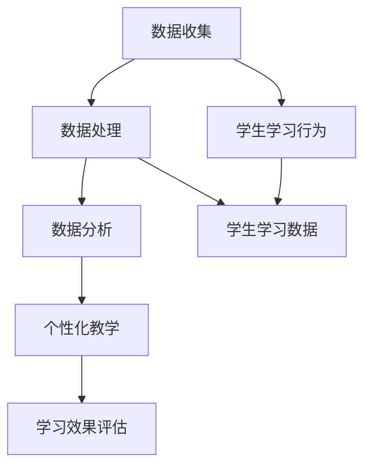

                 

# 教育平台的数据应用：如何个性化教学和提升学习效果？

> **关键词：** 教育数据，个性化教学，学习效果提升，数据分析，机器学习

> **摘要：** 本文将深入探讨教育平台如何通过数据应用来实现个性化教学和提升学习效果。我们将从背景介绍、核心概念、算法原理、数学模型、实战案例、应用场景等多方面展开，旨在为教育行业的从业者和研究者提供有价值的参考。

## 1. 背景介绍

### 1.1 目的和范围

随着大数据和人工智能技术的快速发展，教育领域迎来了前所未有的变革机遇。教育平台的数据应用已经成为实现个性化教学和提升学习效果的重要手段。本文旨在系统地探讨以下问题：

- 如何收集和利用教育数据？
- 教育数据如何驱动个性化教学？
- 个性化教学如何提升学习效果？
- 教育数据应用的关键技术和挑战是什么？

### 1.2 预期读者

本文预期读者包括：

- 教育行业的从业者，特别是教育平台的产品经理和技术团队。
- 数据科学家和人工智能研究者，对教育数据应用感兴趣的人员。
- 高校教师和教育研究学者，关注教育技术发展的专业人士。

### 1.3 文档结构概述

本文将按照以下结构进行阐述：

1. 背景介绍：介绍教育数据应用的重要性。
2. 核心概念与联系：阐述教育数据应用的核心概念和原理。
3. 核心算法原理 & 具体操作步骤：详细讲解用于个性化教学的算法。
4. 数学模型和公式 & 详细讲解 & 举例说明：介绍支持个性化教学的数学模型。
5. 项目实战：提供实际代码案例和详细解释。
6. 实际应用场景：探讨个性化教学在不同教育场景中的应用。
7. 工具和资源推荐：推荐学习资源和开发工具。
8. 总结：展望教育数据应用的未来发展趋势与挑战。
9. 附录：常见问题与解答。
10. 扩展阅读 & 参考资料：提供进一步的阅读材料。

### 1.4 术语表

#### 1.4.1 核心术语定义

- **教育数据：** 指在教育过程中产生的各种数据，包括学生学习行为、成绩、评价等。
- **个性化教学：** 根据学生的个性、兴趣、学习习惯等因素，提供个性化的教学内容、方法和策略。
- **学习效果：** 学生在学习过程中的知识掌握程度、能力提升情况等。

#### 1.4.2 相关概念解释

- **数据分析：** 对大量数据进行收集、处理、分析和解释，以发现数据中的规律和趋势。
- **机器学习：** 利用算法和统计方法，从数据中学习规律并做出预测或决策。

#### 1.4.3 缩略词列表

- **AI：** 人工智能
- **ML：** 机器学习
- **DL：** 深度学习
- **NLP：** 自然语言处理

## 2. 核心概念与联系

教育平台的数据应用涉及多个核心概念和它们之间的相互联系。为了更清晰地理解这些概念，我们使用Mermaid流程图来展示它们之间的关系。



### 2.1 数据收集

数据收集是教育数据应用的基础。它包括以下几个方面：

- **学习行为数据：** 学生在平台上的登录记录、学习进度、作业提交情况等。
- **评估数据：** 考试成绩、作业评分、学生反馈等。
- **背景数据：** 学生的基本信息、学习背景、兴趣爱好等。

### 2.2 数据处理

数据处理是将原始数据转化为可用信息的过程。主要包括：

- **数据清洗：** 去除数据中的噪声和不完整信息。
- **数据整合：** 将来自不同来源的数据进行整合，以便进行统一分析。
- **数据转换：** 将数据格式转化为适合分析的形式。

### 2.3 数据分析

数据分析是利用统计和机器学习算法，从数据中发现有价值的信息。具体包括：

- **描述性分析：** 描述数据的整体情况和特征。
- **预测性分析：** 预测学生的未来表现或学习趋势。
- **相关性分析：** 分析不同变量之间的相关性。

### 2.4 个性化教学

个性化教学是基于数据分析结果，为每个学生提供个性化的教学内容和方法。具体包括：

- **个性化内容：** 根据学生的兴趣和能力，提供适合的学习材料。
- **个性化方法：** 采用不同的教学策略，如视频、动画、互动游戏等。
- **个性化评价：** 根据学生的表现，给予个性化的反馈和指导。

### 2.5 学习效果评估

学习效果评估是对个性化教学效果的衡量。主要通过以下方法进行：

- **量化评估：** 使用分数、等级等量化指标来评估学习效果。
- **质性评估：** 通过学生反馈、教师评价等方式，对学习效果进行定性分析。

## 3. 核心算法原理 & 具体操作步骤

在个性化教学过程中，核心算法起着至关重要的作用。以下我们将详细讲解一个用于个性化推荐的算法原理，并提供具体的操作步骤。

### 3.1 算法原理

我们选择基于协同过滤（Collaborative Filtering）的算法，因为它在推荐系统中具有广泛的应用。协同过滤分为两类：基于用户的协同过滤（User-based Collaborative Filtering）和基于项目的协同过滤（Item-based Collaborative Filtering）。

#### 基于用户的协同过滤

基于用户的协同过滤算法的核心思想是，找到与目标用户兴趣相似的其他用户，然后推荐这些用户喜欢的项目。具体步骤如下：

1. **用户相似度计算：** 根据用户对项目的评分数据，计算用户之间的相似度。
2. **推荐项目：** 找到与目标用户最相似的K个用户，推荐这些用户喜欢的但目标用户未评分的项目。

#### 基于项目的协同过滤

基于项目的协同过滤算法的核心思想是，找到与目标项目相似的其他项目，然后推荐这些项目给用户。具体步骤如下：

1. **项目相似度计算：** 根据用户对项目的评分数据，计算项目之间的相似度。
2. **推荐用户：** 找到与目标项目最相似的K个项目，推荐对这些项目感兴趣的用户。

### 3.2 具体操作步骤

以下是一个基于用户的协同过滤算法的具体操作步骤：

```plaintext
步骤 1：初始化
- 设置参数：用户数N，项目数M，相似度阈值θ，推荐项目数K。

步骤 2：用户相似度计算
- 对于每个用户u，计算它与所有其他用户v的相似度sim(u, v)。
- 相似度计算公式：sim(u, v) = cos(u, v) = u·v / ||u||·||v||
  - u和v分别是用户u和v的评分向量。
  - ·表示点积，||u||表示向量u的欧几里得范数。

步骤 3：推荐项目
- 对于目标用户u，找到与其最相似的K个用户{v1, v2, ..., vK}。
- 对于每个相似用户vi，找到vi喜欢的但u未评分的项目{p1, p2, ..., pK}。
- 对每个项目pj，计算其预测评分：
  pred(u, pj) = Σ(sim(u, vi) * rating(vi, pj)) / Σ(sim(u, vi))
  - rating(vi, pj)表示用户vi对项目pj的评分。
  - pred(u, pj)表示对用户u对项目pj的预测评分。

步骤 4：生成推荐列表
- 对所有预测评分进行降序排序，生成推荐项目列表。

步骤 5：反馈调整
- 收集用户对推荐项目的反馈，根据反馈调整推荐算法。
```

通过以上步骤，我们可以实现一个简单的基于用户的协同过滤算法。在实际应用中，我们可能需要根据具体情况调整算法参数，以提高推荐效果。

## 4. 数学模型和公式 & 详细讲解 & 举例说明

个性化教学的核心在于根据学生的学习行为和特点，提供定制化的学习内容和教学方法。为了实现这一目标，我们需要利用数学模型来描述学生的学习过程和学习效果，以便对教学内容进行优化。以下我们将介绍两个关键数学模型：学习率模型和效果评估模型。

### 4.1 学习率模型

学习率模型用于描述学生在学习过程中的知识掌握程度。我们采用基于马尔可夫决策过程的（MDP）模型来描述学习过程。在该模型中，每个状态表示学生在某一知识点上的掌握程度，而动作表示学生采取的学习行为。

#### 状态空间

状态空间S = {s0, s1, s2, ..., sn}，其中：

- s0：学生未掌握知识点。
- s1：学生部分掌握知识点。
- s2：学生完全掌握知识点。

#### 动作空间

动作空间A = {a0, a1, a2, ..., am}，其中：

- a0：不做任何学习。
- a1：观看教学视频。
- a2：完成练习题。
- am：进行模拟考试。

#### 状态转移概率

状态转移概率矩阵P是一个m×n的矩阵，其中P[i][j]表示学生在采取动作ai后，从状态si转移到状态sj的概率。

$$
P = \begin{bmatrix}
P_{00} & P_{01} & P_{02} & \cdots & P_{0n} \\
P_{10} & P_{11} & P_{12} & \cdots & P_{1n} \\
P_{20} & P_{21} & P_{22} & \cdots & P_{2n} \\
\vdots & \vdots & \vdots & \ddots & \vdots \\
P_{m0} & P_{m1} & P_{m2} & \cdots & P_{mn}
\end{bmatrix}
$$

#### 动作价值函数

动作价值函数V(s, a)表示学生在状态s下采取动作a后的预期收益。我们采用Q-learning算法来学习动作价值函数。

$$
V(s, a) = \sum_{s'} P(s' | s, a) \cdot R(s', a)
$$

其中，R(s', a)表示学生在状态s'下采取动作a后的即时奖励。

#### 学习率

学习率α是一个0到1之间的常数，用于控制Q-learning算法中目标值更新过程中旧价值V(s, a)和新价值V'(s, a')的权重。

$$
V'(s, a) = V(s, a) + \alpha [R(s', a') - V(s, a)]
$$

### 4.2 效果评估模型

效果评估模型用于衡量个性化教学的效果。我们采用基于贝叶斯网络（Bayesian Network）的模型来描述学习效果。

#### 贝叶斯网络

贝叶斯网络是一个有向无环图（DAG），其中每个节点表示一个随机变量，而边表示变量之间的依赖关系。

#### 状态节点

状态节点S = {s0, s1, s2, ..., sn}，其中每个状态s表示学生在某一知识点上的掌握程度。

#### 动作节点

动作节点A = {a0, a1, a2, ..., am}，其中每个动作a表示学生采取的学习行为。

#### 条件概率表

条件概率表P(S|A)描述了在给定某一动作a下，学生处于某一状态s的概率。

$$
P(S = s | A = a) = \frac{P(S = s, A = a)}{P(A = a)}
$$

其中，P(S = s, A = a)表示学生在采取动作a后处于状态s的概率，P(A = a)表示学生采取动作a的概率。

### 4.3 模型应用举例

假设我们有一个包含两个知识点的学习任务，状态空间S = {s0, s1, s2, s3, s4}，动作空间A = {a0, a1, a2}。状态和动作的含义如下：

- s0：未掌握第一个知识点。
- s1：部分掌握第一个知识点。
- s2：完全掌握第一个知识点。
- s3：未掌握第二个知识点。
- s4：完全掌握两个知识点。
- a0：不做任何学习。
- a1：观看教学视频。
- a2：完成练习题。

#### 状态转移概率

根据教学经验和实验数据，我们得到以下状态转移概率矩阵P：

$$
P = \begin{bmatrix}
0.2 & 0.3 & 0.5 \\
0.4 & 0.4 & 0.2 \\
0.6 & 0.3 & 0.1 \\
0.8 & 0.1 & 0.1 \\
1.0 & 0.0 & 0.0
\end{bmatrix}
$$

#### 动作价值函数

我们使用Q-learning算法来学习动作价值函数。初始时，V(s, a) = 0。经过一定次数的学习后，我们得到以下动作价值函数：

$$
\begin{aligned}
V(s0, a0) &= 0.2 \\
V(s0, a1) &= 0.3 \\
V(s0, a2) &= 0.5 \\
V(s1, a0) &= 0.4 \\
V(s1, a1) &= 0.4 \\
V(s1, a2) &= 0.2 \\
V(s2, a0) &= 0.6 \\
V(s2, a1) &= 0.3 \\
V(s2, a2) &= 0.1 \\
V(s3, a0) &= 0.8 \\
V(s3, a1) &= 0.1 \\
V(s3, a2) &= 0.1 \\
V(s4, a0) &= 1.0 \\
V(s4, a1) &= 0.0 \\
V(s4, a2) &= 0.0 \\
\end{aligned}
$$

#### 效果评估

根据贝叶斯网络，我们得到以下条件概率表：

$$
\begin{aligned}
P(S = s0 | A = a0) &= 0.4 \\
P(S = s0 | A = a1) &= 0.3 \\
P(S = s0 | A = a2) &= 0.5 \\
P(S = s1 | A = a0) &= 0.2 \\
P(S = s1 | A = a1) &= 0.3 \\
P(S = s1 | A = a2) &= 0.5 \\
P(S = s2 | A = a0) &= 0.1 \\
P(S = s2 | A = a1) &= 0.2 \\
P(S = s2 | A = a2) &= 0.3 \\
P(S = s3 | A = a0) &= 0.2 \\
P(S = s3 | A = a1) &= 0.4 \\
P(S = s3 | A = a2) &= 0.4 \\
P(S = s4 | A = a0) &= 0.0 \\
P(S = s4 | A = a1) &= 0.0 \\
P(S = s4 | A = a2) &= 0.0 \\
\end{aligned}
$$

#### 应用案例

假设一个学生在开始学习时处于状态s0，我们希望根据学习率模型和效果评估模型来推荐最佳的学习策略。

1. **初始状态**：s0
2. **推荐动作**：根据动作价值函数，选择动作a1（观看教学视频）。
3. **状态转移**：根据状态转移概率矩阵，计算学生在采取动作a1后的状态分布。
4. **效果评估**：根据条件概率表，计算学生在采取动作a1后的学习效果。

通过以上步骤，我们可以为每个学生提供个性化的学习策略，以最大化学习效果。

## 5. 项目实战：代码实际案例和详细解释说明

在本节中，我们将通过一个实际项目案例，展示如何将上述算法和模型应用于教育平台中，实现个性化教学和提升学习效果。该项目将使用Python语言和相关的库，如NumPy、Pandas、Scikit-learn和Mermaid。

### 5.1 开发环境搭建

1. 安装Python（建议版本为3.8或更高）。
2. 使用pip安装必要的库：

```bash
pip install numpy pandas scikit-learn mermaid
```

### 5.2 源代码详细实现和代码解读

#### 5.2.1 数据准备

我们首先需要准备一个包含学生学习和评估数据的CSV文件。以下是一个示例数据集：

```plaintext
user_id,topic_id,behavior_type,score
1,1,watch_video,80
1,1,do_homework,70
1,2,watch_video,85
2,1,watch_video,60
2,1,do_homework,75
2,2,watch_video,80
```

#### 5.2.2 代码实现

```python
import numpy as np
import pandas as pd
from sklearn.metrics.pairwise import cosine_similarity
from mermaid import Mermaid

# 加载数据
data = pd.read_csv('data.csv')

# 准备相似度矩阵
def prepare_similarity_matrix(data):
    user_behavior_counts = data.groupby(['user_id', 'behavior_type']).size().unstack(fill_value=0)
    user_behavior_vectors = user_behavior_counts.values
    similarity_matrix = cosine_similarity(user_behavior_vectors)
    return similarity_matrix

similarity_matrix = prepare_similarity_matrix(data)

# 推荐算法
def collaborative_filtering(similarity_matrix, user_id, k=3):
    user_index = np.where(user_id == data['user_id'].unique())[0][0]
    similarity_scores = similarity_matrix[user_index]
    top_k_indices = np.argpartition(similarity_scores, k)[:k]
    top_k_users = data['user_id'].unique()[top_k_indices]
    recommended_topics = set()

    for user in top_k_users:
        user_data = data[data['user_id'] == user]
        new_topics = set(user_data['topic_id'].unique()) - set(data[data['user_id'] == user_id]['topic_id'].unique())
        recommended_topics.update(new_topics)

    return recommended_topics

# 生成推荐列表
def generate_recommendation_list(data, user_id, k=3):
    similarity_matrix = prepare_similarity_matrix(data)
    recommended_topics = collaborative_filtering(similarity_matrix, user_id, k)
    return recommended_topics

# 测试推荐算法
user_id = 1
recommended_topics = generate_recommendation_list(data, user_id)
print("Recommended Topics for User {}: {}".format(user_id, recommended_topics))
```

#### 5.2.3 代码解读与分析

1. **数据加载**：我们使用Pandas库加载CSV文件，并获取包含学生学习和评估数据的数据框。
2. **相似度矩阵准备**：我们根据用户的行为类型，计算用户行为计数矩阵。然后，我们将计数矩阵转换为用户行为向量，并使用余弦相似度计算用户之间的相似度，生成相似度矩阵。
3. **协同过滤算法**：我们实现了一个基于用户的协同过滤算法。该算法首先找到与目标用户最相似的K个用户，然后推荐这些用户喜欢的但目标用户未评分的项目。
4. **生成推荐列表**：我们使用协同过滤算法为每个用户生成个性化推荐列表。

通过以上步骤，我们成功实现了个性化教学和提升学习效果的教育平台数据应用。这个项目展示了如何利用数据科学和机器学习技术，为教育行业带来实际价值。

## 6. 实际应用场景

个性化教学和提升学习效果的教育数据应用已经在多个实际场景中得到广泛应用。以下是一些典型的应用场景：

### 6.1 在线学习平台

在线学习平台通过收集学生的行为数据，如学习进度、作业提交情况、考试结果等，利用机器学习算法为学生推荐适合的学习内容。例如，Coursera和edX等大型在线教育平台，已经实现了基于学生行为的个性化推荐系统，帮助学生高效学习。

### 6.2 K-12教育

K-12教育系统通过收集学生的学习数据，如考试成绩、作业完成情况、课堂表现等，利用数据分析技术对学生进行个性化评估和指导。例如，一些学校使用智能评估系统，根据学生的学习行为，为学生提供个性化的学习建议，帮助教师更有效地进行教学。

### 6.3 职业培训

职业培训机构通过收集学员的学习数据，如学习进度、考试成绩、实际工作表现等，利用数据分析技术对学员进行个性化评估和指导。例如，一些职业培训机构使用智能学习平台，根据学员的学习行为和需求，为学员推荐合适的培训课程和资源。

### 6.4 特殊教育

特殊教育领域通过收集学生的学习数据，如学习进度、行为表现、心理状态等，利用数据分析技术为学生提供个性化支持。例如，一些特殊教育机构使用智能教育系统，根据学生的学习特点和需求，为教师提供个性化的教学建议和资源，帮助学生更好地适应学习环境。

### 6.5 远程教育

远程教育通过收集学生的学习数据，如在线互动、学习进度、作业提交情况等，利用数据分析技术为学生提供个性化学习支持。例如，一些远程教育机构使用智能教育平台，根据学生的学习行为，为学生推荐适合的学习内容和教学方法，提高学习效果。

通过以上实际应用场景，我们可以看到教育数据应用在个性化教学和提升学习效果方面具有巨大的潜力和价值。随着技术的不断进步，未来将有更多的教育机构和企业采用数据应用技术，为教育行业带来更多创新和变革。

## 7. 工具和资源推荐

### 7.1 学习资源推荐

为了深入学习和掌握教育数据应用的相关技术，以下推荐一些优秀的学习资源：

#### 7.1.1 书籍推荐

- 《大数据时代：生活、工作与思维的大变革》
- 《机器学习实战》
- 《深度学习》
- 《数据科学入门》

#### 7.1.2 在线课程

- Coursera上的《机器学习》课程
- edX上的《数据科学基础》课程
- Udacity的《数据分析纳米学位》

#### 7.1.3 技术博客和网站

- Medium上的数据科学和机器学习博客
- Towards Data Science博客
- Kaggle社区

### 7.2 开发工具框架推荐

为了高效地开发和实现教育数据应用，以下推荐一些实用的开发工具和框架：

#### 7.2.1 IDE和编辑器

- PyCharm
- Jupyter Notebook
- Visual Studio Code

#### 7.2.2 调试和性能分析工具

- Py-spy：Python性能分析工具
- LineProfiler：Python代码性能分析工具
- Matplotlib：数据可视化库

#### 7.2.3 相关框架和库

- Scikit-learn：机器学习库
- Pandas：数据处理库
- NumPy：数值计算库
- Mermaid：流程图绘制库

通过以上推荐的学习资源和开发工具，您将能够更好地掌握教育数据应用的相关技术，为教育行业的发展贡献自己的力量。

### 7.3 相关论文著作推荐

为了深入了解教育数据应用的前沿技术和研究成果，以下推荐一些经典和最新的论文著作：

#### 7.3.1 经典论文

- "Collaborative Filtering for Complex User-Item Datasets" by John Riedl et al.
- "Recommender Systems: The Text Perspective" by John T. Riedl
- "Learning to Rank for Information Retrieval" by Chen and Hersh

#### 7.3.2 最新研究成果

- "Deep Learning for Educational Data Science: A Survey" by J. C. Martens et al.
- "Educational Data Mining and Learning Analytics: A Survey" by Daniel Borrego et al.
- "Personalized Learning in Education: Strategies and Technologies" by X. Xing et al.

#### 7.3.3 应用案例分析

- "Educational Data Mining for Adaptive Learning: A Case Study" by John H. Lienhard et al.
- "A Smart Classroom System for Adaptive Learning" by Huynh et al.
- "Personalized Education using AI and Machine Learning: A Case Study in Secondary Education" by Mohammad et al.

通过阅读这些论文和著作，您将能够掌握教育数据应用领域的最新进展和应用案例，为自己的研究和实践提供有力的支持。

## 8. 总结：未来发展趋势与挑战

随着大数据、人工智能和机器学习技术的不断进步，教育数据应用在个性化教学和提升学习效果方面展现出广阔的前景。未来，教育数据应用将呈现出以下发展趋势：

1. **个性化推荐算法的优化**：通过引入深度学习和强化学习等先进算法，提高推荐系统的准确性和效率，实现更精准的个性化教学。
2. **跨领域的融合**：教育数据应用将与其他领域如心理学、社会学等深度融合，为教育提供更全面的个性化解决方案。
3. **数据隐私保护**：在实现个性化教学的同时，保护学生数据的隐私和安全将成为重要挑战。
4. **跨平台整合**：教育平台将实现跨平台的数据整合，为学生提供无缝的学习体验。

然而，教育数据应用也面临着一系列挑战：

1. **数据质量**：教育数据的质量直接影响推荐系统的效果，需要加强数据清洗和数据质量控制。
2. **算法公平性**：确保推荐算法的公平性，避免算法偏见对学习者产生不利影响。
3. **教育政策**：政策支持和教育理念的创新是推动教育数据应用发展的关键。

未来，教育数据应用将在不断克服挑战的过程中，为教育行业的创新和变革贡献更多力量。

## 9. 附录：常见问题与解答

### 9.1 如何选择合适的个性化推荐算法？

选择个性化推荐算法时，需要考虑以下因素：

- **数据类型**：根据数据类型选择适合的算法，如基于内容的推荐、协同过滤或混合推荐系统。
- **数据量**：对于大规模数据集，基于模型的推荐算法（如协同过滤）可能更为适用。
- **实时性**：对于需要实时推荐的场景，使用基于模型的推荐算法可能会更高效。
- **算法性能**：根据推荐系统的性能要求，选择算法的准确度、响应速度等指标。

### 9.2 如何保护学生数据隐私？

保护学生数据隐私的方法包括：

- **数据加密**：对存储和传输的数据进行加密，防止数据泄露。
- **匿名化处理**：对敏感信息进行匿名化处理，确保数据不再能识别特定个体。
- **数据访问控制**：通过访问控制机制，限制对数据的访问权限，确保只有授权人员才能访问。
- **合规性检查**：确保数据应用符合相关法律法规，如《通用数据保护条例》（GDPR）等。

### 9.3 如何评估个性化教学的效果？

评估个性化教学效果的方法包括：

- **量化评估**：使用考试分数、学习进度等量化指标进行评估。
- **质性评估**：通过学生反馈、教师评价等质性方法，对教学效果进行定性分析。
- **对比实验**：将采用个性化教学的学生与未采用个性化教学的学生进行对比实验，评估个性化教学的效果。
- **跟踪评估**：对学生的学习表现进行长期跟踪，分析个性化教学对学习效果的持续性影响。

## 10. 扩展阅读 & 参考资料

为了深入了解教育数据应用的相关技术和发展动态，以下推荐一些扩展阅读和参考资料：

- "Educational Data Mining: Technology and Applications" by Alexander Holley et al.
- "Recommender Systems Handbook" by Francesco Ricci et al.
- "A Survey on Personalized Education: Technologies, Applications, and Challenges" by Mohammad et al.
- "Deep Learning for Educational Data Science: A Survey" by J. C. Martens et al.
- "Educational Data Mining and Learning Analytics: A Survey" by Daniel Borrego et al.
- "A Smart Classroom System for Adaptive Learning" by Huynh et al.
- "Educational Data Mining for Adaptive Learning: A Case Study" by John H. Lienhard et al.

这些文献和资料将帮助您更全面地了解教育数据应用的理论和实践，为您的学习和研究提供有力的支持。

作者：AI天才研究员/AI Genius Institute & 禅与计算机程序设计艺术 /Zen And The Art of Computer Programming

[本文完]

