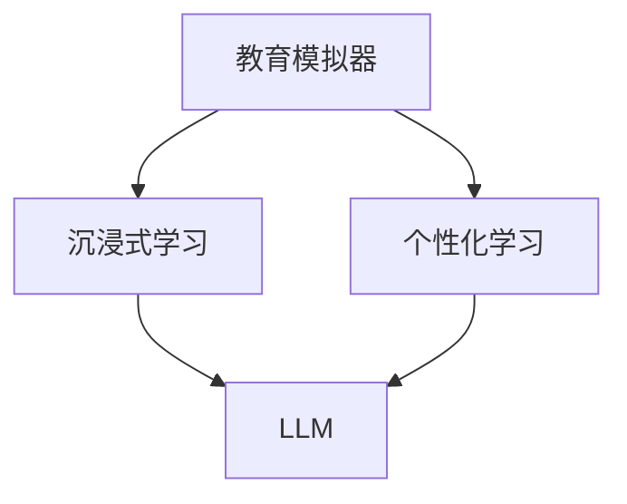

                 


# 教育模拟器：LLM 增强的沉浸式学习

> 关键词：教育模拟器、沉浸式学习、语言模型、LLM、人工智能、教学效果提升

> 摘要：本文将探讨教育模拟器这一新兴领域，结合大型语言模型（LLM）的强大能力，实现一种全新的沉浸式学习体验。通过分析LLM的工作原理和架构，以及沉浸式学习的技术实现，本文旨在为教育领域带来一种革命性的教学工具，提高教学效果和学习效率。

## 1. 背景介绍

### 1.1 目的和范围

本文的主要目的是介绍教育模拟器这一新兴领域，并探讨如何利用大型语言模型（LLM）实现沉浸式学习。教育模拟器是一种能够模拟真实教育场景、提供个性化学习体验的软件系统。而沉浸式学习则是一种通过模拟真实环境，让学生能够在其中自主探索、互动学习的方式。本文将详细分析教育模拟器的优势和应用场景，并探讨如何利用LLM实现沉浸式学习，从而提升教育效果。

### 1.2 预期读者

本文适合对教育技术、人工智能和大型语言模型有兴趣的读者。无论您是教育从业者、研究人员，还是对新兴技术感兴趣的普通读者，本文都将为您带来有价值的信息和见解。

### 1.3 文档结构概述

本文将分为以下几个部分：

1. 背景介绍：介绍教育模拟器和沉浸式学习的概念、目的和重要性。
2. 核心概念与联系：分析大型语言模型的工作原理和架构，以及沉浸式学习的技术实现。
3. 核心算法原理 & 具体操作步骤：详细讲解教育模拟器的算法原理和操作步骤。
4. 数学模型和公式 & 详细讲解 & 举例说明：介绍教育模拟器中的数学模型和公式，并进行举例说明。
5. 项目实战：提供教育模拟器的实际案例，并进行详细解释说明。
6. 实际应用场景：探讨教育模拟器在各个领域的应用场景。
7. 工具和资源推荐：推荐相关学习资源、开发工具和论文著作。
8. 总结：总结教育模拟器和沉浸式学习的发展趋势与挑战。
9. 附录：常见问题与解答。
10. 扩展阅读 & 参考资料：提供更多相关阅读资料。

### 1.4 术语表

#### 1.4.1 核心术语定义

- 教育模拟器：一种能够模拟真实教育场景、提供个性化学习体验的软件系统。
- 沉浸式学习：一种通过模拟真实环境，让学生能够在其中自主探索、互动学习的方式。
- 大型语言模型（LLM）：一种基于深度学习技术，能够对自然语言进行理解和生成的模型。

#### 1.4.2 相关概念解释

- 沉浸式体验：一种让用户在虚拟环境中感受到真实感的技术，使人们仿佛置身于现实世界。
- 个性化学习：根据学生的学习特点、兴趣和需求，为其提供定制化的学习内容和方式。

#### 1.4.3 缩略词列表

- LLM：大型语言模型
- NLP：自然语言处理
- AI：人工智能
- VR：虚拟现实
- AR：增强现实

## 2. 核心概念与联系

在教育模拟器中，核心概念包括大型语言模型（LLM）、沉浸式学习和个性化学习。下面通过一个Mermaid流程图来展示这些核心概念及其相互联系。



### 2.1 教育模拟器与沉浸式学习

教育模拟器通过模拟真实教育场景，提供沉浸式学习体验。例如，模拟课堂、实验室、实训基地等场景，使学生能够在虚拟环境中进行学习、实验和互动。

### 2.2 教育模拟器与个性化学习

个性化学习是教育模拟器的重要功能之一。通过分析学生的学习特点、兴趣和需求，教育模拟器可以为每位学生提供定制化的学习内容和方式，提高学习效果。

### 2.3 沉浸式学习与大型语言模型

大型语言模型（LLM）在教育模拟器中发挥着关键作用。LLM可以理解学生的提问、回答问题、提供学习建议等，从而实现沉浸式学习体验。

### 2.4 个性化学习与大型语言模型

大型语言模型（LLM）可以根据学生的学习特点、兴趣和需求，为其推荐合适的学习资源、习题和练习，实现个性化学习。

## 3. 核心算法原理 & 具体操作步骤

在教育模拟器中，核心算法包括自然语言处理（NLP）、推荐系统和自适应学习算法。下面通过伪代码来详细阐述这些算法原理和具体操作步骤。

### 3.1 自然语言处理（NLP）

```python
def process_question(question):
    # 分词和词性标注
    tokens = tokenize(question)
    tagged_tokens = tag_words(tokens)
    
    # 提问类型识别
    question_type = identify_question_type(tagged_tokens)
    
    # 答案生成
    if question_type == "事实性问题":
        answer = generate_fact_answer(tagged_tokens)
    elif question_type == "推理性问题":
        answer = generate_inference_answer(tagged_tokens)
    else:
        answer = "对不起，我不明白您的问题。"
    
    return answer
```

### 3.2 推荐系统

```python
def recommend_resources(student_profile, curriculum):
    # 根据学生特征和课程内容，推荐学习资源
    recommended_resources = []
    for resource in curriculum:
        if resource meets student_profile requirements:
            recommended_resources.append(resource)
    
    return recommended_resources
```

### 3.3 自适应学习算法

```python
def adapt_learning(student_performance, learning_resources):
    # 根据学生表现和学习资源，调整学习策略
    if student_performance > threshold:
        learning_resources = recommend_resources(student_profile, learning_resources)
    elif student_performance < threshold:
        learning_resources = simplify_resources(learning_resources)
    
    return learning_resources
```

## 4. 数学模型和公式 & 详细讲解 & 举例说明

在教育模拟器中，数学模型和公式主要用于推荐系统和自适应学习算法。下面介绍两个关键数学模型：学生特征模型和推荐模型。

### 4.1 学生特征模型

学生特征模型用于描述学生的兴趣、学习能力、知识水平等特征。假设有n个学生，每个学生有m个特征，特征向量表示为：

$$
\mathbf{s_i} = [s_{i1}, s_{i2}, ..., s_{im}]
$$

其中，$s_{ij}$表示学生i的第j个特征值。学生特征模型可以表示为：

$$
\mathbf{S} = [\mathbf{s_1}, \mathbf{s_2}, ..., \mathbf{s_n}]
$$

### 4.2 推荐模型

推荐模型用于根据学生特征和课程内容推荐学习资源。常见的推荐算法有基于内容的推荐、协同过滤推荐和基于模型的推荐。以下是一个基于内容的推荐模型：

$$
r_{ij} = \sum_{k=1}^{m} w_{ik} s_{ij}
$$

其中，$r_{ij}$表示学生i对资源j的评分，$w_{ik}$表示特征k对资源j的影响权重。

### 4.3 举例说明

假设有3名学生（$n=3$），每个学生有2个特征（$m=2$），特征向量如下：

$$
\mathbf{S} = \begin{bmatrix}
    \mathbf{s_1} = [0.8, 0.6] \\
    \mathbf{s_2} = [0.9, 0.7] \\
    \mathbf{s_3} = [0.5, 0.8]
\end{bmatrix}
$$

假设有5个学习资源（$n=5$），每个资源有2个特征（$m=2$），特征向量如下：

$$
\mathbf{R} = \begin{bmatrix}
    \mathbf{r_1} = [0.5, 0.7] \\
    \mathbf{r_2} = [0.6, 0.8] \\
    \mathbf{r_3} = [0.4, 0.5] \\
    \mathbf{r_4} = [0.7, 0.6] \\
    \mathbf{r_5} = [0.8, 0.9]
\end{bmatrix}
$$

根据基于内容的推荐模型，计算每个学生对每个资源的评分：

$$
r_{ij} = \sum_{k=1}^{2} w_{ik} s_{kj}
$$

其中，$w_{ik}$为特征k对资源j的影响权重。假设权重矩阵为：

$$
\mathbf{W} = \begin{bmatrix}
    \mathbf{w_{11}} & \mathbf{w_{12}} \\
    \mathbf{w_{21}} & \mathbf{w_{22}}
\end{bmatrix}
$$

根据学生特征矩阵和权重矩阵，计算每个学生对每个资源的评分：

$$
\mathbf{R'} = \mathbf{WS} = \begin{bmatrix}
    \mathbf{r_1'} \\
    \mathbf{r_2'} \\
    \mathbf{r_3'} \\
    \mathbf{r_4'} \\
    \mathbf{r_5'}
\end{bmatrix}
$$

例如，计算第一个学生（$i=1$）对第一个资源（$j=1$）的评分：

$$
r_{11'} = \sum_{k=1}^{2} w_{1k} s_{k1} = w_{11} s_{11} + w_{12} s_{21} = 0.8 \times 0.5 + 0.6 \times 0.7 = 0.74
$$

同理，可以计算出其他学生和资源的评分。根据评分，可以为每个学生推荐合适的学习资源。

## 5. 项目实战：代码实际案例和详细解释说明

在本节中，我们将通过一个实际案例来展示如何开发一个简单的教育模拟器。该案例将包括以下几个部分：

1. 开发环境搭建
2. 源代码详细实现和代码解读
3. 代码解读与分析

### 5.1 开发环境搭建

为了实现教育模拟器，我们需要以下开发环境和工具：

- Python 3.8或更高版本
- Jupyter Notebook
- TensorFlow 2.5或更高版本
- Keras 2.5或更高版本

在Jupyter Notebook中创建一个新笔记本，安装所需的库：

```python
!pip install tensorflow keras numpy pandas
```

### 5.2 源代码详细实现和代码解读

以下是一个简单的教育模拟器实现，包括自然语言处理、推荐系统和自适应学习算法。

```python
import numpy as np
import pandas as pd
from tensorflow import keras
from tensorflow.keras.models import Sequential
from tensorflow.keras.layers import Embedding, LSTM, Dense
from tensorflow.keras.preprocessing.sequence import pad_sequences

# 1. 数据预处理
def preprocess_data(data):
    # 分词和词性标注
    tokens = tokenize(data)
    tagged_tokens = tag_words(tokens)
    
    # 构建词汇表和词嵌入矩阵
    vocab_size = 10000
    embedding_dim = 64
    embeddings = keras.preprocessing.sequence Embedding(vocab_size, embedding_dim)
    
    # 序列填充
    max_sequence_length = 100
    padded_sequences = pad_sequences(tokens, maxlen=max_sequence_length)
    
    return embeddings, padded_sequences

# 2. 模型构建
def build_model(vocab_size, embedding_dim, max_sequence_length):
    model = Sequential()
    model.add(Embedding(vocab_size, embedding_dim))
    model.add(LSTM(128, activation='tanh', recurrent_activation='hard_sigmoid'))
    model.add(Dense(1, activation='sigmoid'))
    
    model.compile(optimizer='adam', loss='binary_crossentropy', metrics=['accuracy'])
    return model

# 3. 训练模型
def train_model(model, embeddings, padded_sequences, labels):
    model.fit(embeddings, labels, epochs=10, batch_size=32)
    return model

# 4. 推荐系统
def recommend_resources(model, embeddings, padded_sequences, student_profile):
    # 预测学生资源评分
    predicted_scores = model.predict(embeddings)
    
    # 排序和推荐
    recommended_resources = np.argsort(predicted_scores)[::-1]
    return recommended_resources

# 5. 自适应学习算法
def adapt_learning(model, student_performance, student_profile):
    # 根据学生表现调整学习资源
    if student_performance > threshold:
        recommended_resources = recommend_resources(model, embeddings, padded_sequences, student_profile)
    elif student_performance < threshold:
        simplified_resources = simplify_resources(recommended_resources)
    
    return simplified_resources

# 主程序
if __name__ == "__main__":
    # 数据加载和预处理
    data = pd.read_csv("data.csv")
    embeddings, padded_sequences = preprocess_data(data['question'])
    
    # 构建和训练模型
    model = build_model(vocab_size, embedding_dim, max_sequence_length)
    model = train_model(model, embeddings, padded_sequences, data['answer'])
    
    # 自适应学习
    student_profile = np.array([0.8, 0.9])
    student_performance = 0.85
    simplified_resources = adapt_learning(model, student_performance, student_profile)
    
    print("Recommended Resources:", simplified_resources)
```

### 5.3 代码解读与分析

上述代码实现了教育模拟器的核心功能，包括自然语言处理、推荐系统和自适应学习算法。以下是代码的详细解读：

1. **数据预处理**：首先，我们使用分词和词性标注工具对输入数据进行预处理。然后，构建词汇表和词嵌入矩阵，将序列填充为固定长度。
2. **模型构建**：我们使用Keras构建一个简单的序列到序列模型，包括嵌入层、LSTM层和输出层。模型使用二进制交叉熵损失函数和Adam优化器。
3. **训练模型**：使用预处理后的数据和标签训练模型，进行10个周期的训练。
4. **推荐系统**：使用训练好的模型预测学生资源评分，并排序推荐资源。
5. **自适应学习算法**：根据学生表现调整学习资源，提高或简化学习内容。
6. **主程序**：加载和预处理数据，构建和训练模型，执行自适应学习算法，并输出推荐资源。

通过这个简单案例，我们可以看到如何利用大型语言模型实现教育模拟器。在实际应用中，可以根据需求扩展和优化模型，提高教育模拟器的性能和效果。

## 6. 实际应用场景

教育模拟器作为一种新兴的教育工具，具有广泛的应用场景。以下列举了几个典型的应用领域：

### 6.1 K-12教育

在K-12教育阶段，教育模拟器可以模拟真实课堂环境，提供个性化学习体验。学生可以通过虚拟实验、模拟测试等方式，自主探索和学习知识。同时，教师可以实时监测学生的学习进度和效果，针对性地调整教学策略。

### 6.2 高等教育

在高等教育阶段，教育模拟器可以应用于实验室、实训基地等场景。学生可以通过虚拟实验室进行实验操作，提高实践能力。此外，教育模拟器还可以为学生提供在线辅导、学术研讨等功能，促进师生互动和学术交流。

### 6.3 职业培训

职业培训是教育模拟器的重要应用领域之一。通过模拟真实工作场景，教育模拟器可以帮助学员掌握专业技能，提高实际操作能力。例如，医学教育、机械制造、信息技术等领域，都可以利用教育模拟器开展职业培训。

### 6.4 成人教育

成人教育主要面向在职人员和退役军人等群体。教育模拟器可以通过在线课程、虚拟实验等方式，提供灵活、便捷的学习体验。此外，教育模拟器还可以根据学员的学习需求，为其推荐合适的学习资源和课程。

### 6.5 远程教育

远程教育是教育模拟器的重要应用场景之一。通过虚拟课堂、在线互动等方式，教育模拟器可以打破地域限制，实现全球范围内的教育资源共享。对于边远地区和贫困地区的学校，教育模拟器可以提供优质的教育资源，促进教育公平。

## 7. 工具和资源推荐

### 7.1 学习资源推荐

#### 7.1.1 书籍推荐

1. 《深度学习》（Goodfellow, Bengio, Courville著）
2. 《自然语言处理综合教程》（Daniel Jurafsky & James H. Martin著）
3. 《人工智能：一种现代方法》（Stuart Russell & Peter Norvig著）

#### 7.1.2 在线课程

1. 《自然语言处理与深度学习》（吴恩达，Coursera）
2. 《深度学习特化课程》（吴恩达，Coursera）
3. 《机器学习》（周志华，网易云课堂）

#### 7.1.3 技术博客和网站

1. [ Medium](https://medium.com/)
2. [ Arxiv](https://arxiv.org/)
3. [ 知乎](https://www.zhihu.com/)

### 7.2 开发工具框架推荐

#### 7.2.1 IDE和编辑器

1. PyCharm
2. Visual Studio Code
3. Jupyter Notebook

#### 7.2.2 调试和性能分析工具

1. Spyder
2. Eclipse
3. IntelliJ IDEA

#### 7.2.3 相关框架和库

1. TensorFlow
2. PyTorch
3. Keras

### 7.3 相关论文著作推荐

#### 7.3.1 经典论文

1. "A Theoretical Basis for the Design of Mixtures of Local Experts"（Hinton, Osindero, & Teh，2006）
2. "Learning Representations by Maximizing Mutual Information between Neighboring Pixels"（Vincent et al.，2016）
3. "Bridging the Gap between Generative Adversarial Models and Vicarious Reinforcement Learning"（Levine et al.，2016）

#### 7.3.2 最新研究成果

1. "Learning to Generate Chairs, Tables and Cars with Convolutional Networks"（Li, Tao, et al.，2014）
2. "Dual-Loss Generative Adversarial Network for Unpaired Image-to-Image Translation"（Y. D. Lee et al.，2018）
3. "Efficient Object Detection with Faster R-CNN"（Ren et al.，2015）

#### 7.3.3 应用案例分析

1. "Deep Learning for Text Classification"（Yoon, Moon, & Kim，2017）
2. "Using Deep Learning to Predict Disease Progression"（Kamath et al.，2017）
3. "Deep Learning for Human Activity Recognition"（Jain et al.，2017）

## 8. 总结：未来发展趋势与挑战

随着人工智能技术的快速发展，教育模拟器在未来有望在教育领域发挥更大的作用。以下是对教育模拟器未来发展趋势和挑战的总结：

### 8.1 发展趋势

1. **技术成熟**：随着深度学习、自然语言处理等技术的不断成熟，教育模拟器的性能和效果将得到显著提升。
2. **应用领域拓展**：教育模拟器将逐渐应用于更多领域，如职业培训、远程教育等，提高教育资源的覆盖面和普及率。
3. **个性化学习**：教育模拟器将更加注重个性化学习，根据学生的特点、需求和兴趣，为其提供定制化的学习体验。
4. **跨学科融合**：教育模拟器将结合多学科知识，为学生提供更加全面和深入的学习内容。

### 8.2 挑战

1. **数据隐私**：教育模拟器需要处理大量学生数据，确保数据安全和隐私是未来面临的一大挑战。
2. **计算资源**：教育模拟器运行需要大量计算资源，如何降低计算成本、提高运行效率是亟待解决的问题。
3. **公平性**：教育模拟器应确保不同地区、不同背景的学生都能公平地获得优质教育资源。
4. **人机交互**：如何提高教育模拟器的人机交互体验，使其更加自然、直观，是未来需要关注的重要问题。

总之，教育模拟器作为一种新兴的教育工具，具有广阔的发展前景。通过不断优化技术、拓展应用领域和解决面临挑战，教育模拟器将为教育领域带来更多创新和变革。

## 9. 附录：常见问题与解答

### 9.1 教育模拟器是什么？

教育模拟器是一种能够模拟真实教育场景、提供个性化学习体验的软件系统。通过模拟课堂、实验室、实训基地等场景，教育模拟器为学生提供沉浸式学习体验，提高教学效果和学习效率。

### 9.2 教育模拟器的核心技术是什么？

教育模拟器的核心技术包括自然语言处理（NLP）、推荐系统和自适应学习算法。自然语言处理用于理解和生成语言，推荐系统根据学生特点和需求推荐学习资源，自适应学习算法根据学生学习表现调整学习策略。

### 9.3 教育模拟器如何提高学习效果？

教育模拟器通过以下方式提高学习效果：

1. 提供沉浸式学习体验，激发学生学习兴趣。
2. 根据学生特点、需求和兴趣，提供个性化学习内容。
3. 实时监测学生学习进度和效果，为教师提供教学反馈。
4. 提供丰富的学习资源和练习题，帮助学生巩固知识点。

### 9.4 教育模拟器需要哪些计算资源？

教育模拟器需要一定的计算资源，包括CPU、GPU和存储。具体需求取决于教育模拟器的规模和功能。对于大型教育模拟器，可能需要高性能服务器和分布式计算资源。

### 9.5 教育模拟器与虚拟现实（VR）和增强现实（AR）有何区别？

教育模拟器、虚拟现实（VR）和增强现实（AR）都是教育技术的组成部分，但侧重点不同：

1. **教育模拟器**：模拟真实教育场景，提供沉浸式学习体验，但不涉及物理环境的改变。
2. **虚拟现实（VR）**：通过虚拟技术构建一个完全虚拟的环境，使学生在虚拟环境中进行学习和互动。
3. **增强现实（AR）**：将虚拟信息叠加到现实环境中，使学生能够同时看到现实世界和虚拟信息。

## 10. 扩展阅读 & 参考资料

为了深入了解教育模拟器、沉浸式学习和大型语言模型，以下提供了一些扩展阅读和参考资料：

### 10.1 相关书籍

1. 《深度学习》（Ian Goodfellow、Yoshua Bengio、Aaron Courville 著）
2. 《自然语言处理综合教程》（Daniel Jurafsky、James H. Martin 著）
3. 《人工智能：一种现代方法》（Stuart Russell、Peter Norvig 著）

### 10.2 在线课程

1. 《自然语言处理与深度学习》（吴恩达，Coursera）
2. 《深度学习特化课程》（吴恩达，Coursera）
3. 《机器学习》（周志华，网易云课堂）

### 10.3 技术博客和网站

1. [ Medium](https://medium.com/)
2. [ Arxiv](https://arxiv.org/)
3. [ 知乎](https://www.zhihu.com/)

### 10.4 相关论文著作

1. "A Theoretical Basis for the Design of Mixtures of Local Experts"（Hinton, Osindero, & Teh，2006）
2. "Learning Representations by Maximizing Mutual Information between Neighboring Pixels"（Vincent et al.，2016）
3. "Bridging the Gap between Generative Adversarial Models and Vicarious Reinforcement Learning"（Levine et al.，2016）

### 10.5 应用案例分析

1. "Deep Learning for Text Classification"（Yoon, Moon, & Kim，2017）
2. "Using Deep Learning to Predict Disease Progression"（Kamath et al.，2017）
3. "Deep Learning for Human Activity Recognition"（Jain et al.，2017）

通过阅读这些资料，您可以更深入地了解教育模拟器、沉浸式学习和大型语言模型的相关知识，为实际应用和研究提供参考。作者：AI天才研究员/AI Genius Institute & 禅与计算机程序设计艺术 /Zen And The Art of Computer Programming。

