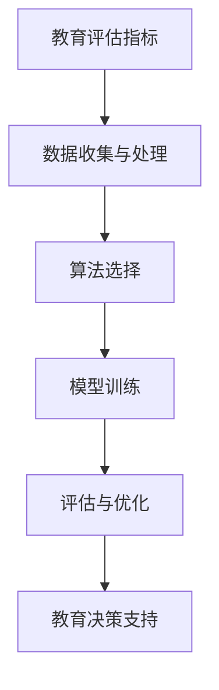

                 

# 教育评估AI系统的商业化路径

> 关键词：教育评估、人工智能、商业化、数据驱动、教育技术、算法设计

> 摘要：本文旨在探讨教育评估AI系统的商业化路径，分析其在教育领域的潜在应用，介绍核心算法原理、数学模型以及实战案例，并展望未来的发展趋势与挑战。

## 1. 背景介绍

### 1.1 目的和范围

本文将深入分析教育评估AI系统的商业化路径，探讨其在教育领域的广泛应用。我们将从以下几个方面展开讨论：

1. **核心算法原理**：介绍教育评估AI系统所依赖的算法原理，包括监督学习、无监督学习和强化学习等。
2. **数学模型和公式**：详细讲解用于评估教学质量、学生成绩等指标的相关数学模型。
3. **项目实战**：通过实际代码案例展示教育评估AI系统的开发和应用。
4. **实际应用场景**：探讨教育评估AI系统在各个教育阶段的实际应用场景。
5. **工具和资源推荐**：介绍相关的学习资源、开发工具和框架。
6. **未来发展趋势与挑战**：分析教育评估AI系统在未来可能面临的发展机遇和挑战。

### 1.2 预期读者

本文适合以下读者群体：

1. **教育技术从业者**：了解教育评估AI系统在实践中的应用，为教育技术的创新提供思路。
2. **AI领域研究者**：了解教育评估AI系统的核心算法和数学模型，为相关研究提供参考。
3. **教育管理者**：了解教育评估AI系统的商业化和应用前景，为教育改革提供决策支持。

### 1.3 文档结构概述

本文结构如下：

1. **背景介绍**：介绍本文的目的、范围、预期读者和文档结构。
2. **核心概念与联系**：讨论教育评估AI系统的核心概念和原理，展示相关流程图。
3. **核心算法原理 & 具体操作步骤**：介绍教育评估AI系统的核心算法原理和具体操作步骤。
4. **数学模型和公式 & 详细讲解 & 举例说明**：讲解教育评估AI系统所依赖的数学模型和公式，并举例说明。
5. **项目实战：代码实际案例和详细解释说明**：展示教育评估AI系统的实际开发过程和代码实现。
6. **实际应用场景**：探讨教育评估AI系统在不同教育阶段的应用场景。
7. **工具和资源推荐**：介绍相关学习资源、开发工具和框架。
8. **总结：未来发展趋势与挑战**：分析教育评估AI系统未来的发展趋势和面临的挑战。
9. **附录：常见问题与解答**：回答读者可能关心的问题。
10. **扩展阅读 & 参考资料**：提供进一步学习和研究的相关资料。

### 1.4 术语表

#### 1.4.1 核心术语定义

- **教育评估AI系统**：一种利用人工智能技术进行教育评估的智能系统。
- **监督学习**：一种机器学习方法，通过已知输入和输出数据训练模型。
- **无监督学习**：一种机器学习方法，无需已知输出数据，仅利用输入数据进行训练。
- **强化学习**：一种机器学习方法，通过与环境的交互学习最优策略。
- **数据驱动**：一种基于数据分析和处理的方法，用于指导教育评估和决策。

#### 1.4.2 相关概念解释

- **算法**：一种解决问题的步骤和规则。
- **模型**：用于表示现实世界问题的一种数学结构。
- **机器学习**：一种人工智能技术，通过数据训练模型，使计算机能够从经验中学习。
- **神经网络**：一种基于人脑神经网络原理的机器学习模型。
- **深度学习**：一种基于多层神经网络进行训练和预测的机器学习方法。

#### 1.4.3 缩略词列表

- **AI**：人工智能
- **ML**：机器学习
- **DL**：深度学习
- **NLP**：自然语言处理
- **IoT**：物联网

## 2. 核心概念与联系

在教育评估AI系统中，核心概念包括教育评估指标、数据收集与处理、算法选择和模型训练等。以下是这些概念之间的联系，以及一个简单的Mermaid流程图来展示它们的关系：



### 2.1 教育评估指标

教育评估指标是教育评估AI系统的核心，用于衡量教学质量、学生学习成果等。这些指标可以是定量（如考试成绩、出勤率）或定性（如教师教学方法、学生学习态度）。

### 2.2 数据收集与处理

数据收集与处理是教育评估AI系统的基础。通过收集学生、教师和课程数据，对数据进行清洗、归一化和特征提取，为后续算法训练和模型构建提供高质量的数据。

### 2.3 算法选择

算法选择直接影响教育评估AI系统的性能。常见的算法包括监督学习（如线性回归、决策树、支持向量机）、无监督学习（如聚类、主成分分析）和强化学习（如Q学习、深度Q网络）。

### 2.4 模型训练

模型训练是教育评估AI系统的核心环节。通过选择合适的算法和模型，利用训练数据对模型进行调整和优化，使其能够准确预测教学质量、学生学习成果等。

### 2.5 评估与优化

评估与优化用于确保教育评估AI系统的性能和准确性。通过交叉验证、性能评估等方法，对模型进行评估和优化，以提高其在实际应用中的效果。

### 2.6 教育决策支持

教育评估AI系统最终目的是为教育决策提供支持。通过评估教学质量和学生学习成果，为教师、教育管理者提供个性化的教育建议和决策支持。

## 3. 核心算法原理 & 具体操作步骤

在教育评估AI系统中，核心算法的选择和实现是系统性能的关键。本节将详细介绍监督学习、无监督学习和强化学习三种核心算法的原理和具体操作步骤。

### 3.1 监督学习

监督学习是一种通过已知输入和输出数据训练模型的方法。在教育评估AI系统中，监督学习可以用于预测学生成绩、教学质量等指标。

#### 3.1.1 算法原理

监督学习算法通常分为两类：分类算法和回归算法。

- **分类算法**：将输入数据分为不同的类别。常见的分类算法有决策树、支持向量机（SVM）和随机森林等。
- **回归算法**：预测输入数据的连续值。常见的回归算法有线性回归、岭回归和LASSO回归等。

#### 3.1.2 操作步骤

1. **数据收集**：收集学生、教师和课程数据，包括考试成绩、出勤率、教学方法、学生学习态度等。
2. **数据预处理**：对数据进行清洗、归一化和特征提取，为后续算法训练和模型构建提供高质量的数据。
3. **选择算法**：根据问题类型（分类或回归）选择合适的算法。
4. **模型训练**：使用训练数据对模型进行调整和优化。
5. **模型评估**：使用验证数据对模型进行评估，调整模型参数以提高性能。
6. **模型应用**：将训练好的模型应用于实际数据，预测学生成绩、教学质量等指标。

### 3.2 无监督学习

无监督学习是一种无需已知输出数据，仅利用输入数据进行训练的方法。在教育评估AI系统中，无监督学习可以用于挖掘学生群体中的潜在特征、发现异常数据等。

#### 3.2.1 算法原理

无监督学习算法通常包括聚类算法、降维算法和关联规则挖掘等。

- **聚类算法**：将相似的数据分为不同的簇。常见的聚类算法有K-means、层次聚类和DBSCAN等。
- **降维算法**：降低数据的维度，同时保留主要信息。常见的降维算法有主成分分析（PCA）和线性判别分析（LDA）等。
- **关联规则挖掘**：发现数据之间的关联关系。常见的关联规则挖掘算法有Apriori算法和Eclat算法等。

#### 3.2.2 操作步骤

1. **数据收集**：收集学生、教师和课程数据，包括考试成绩、出勤率、教学方法、学生学习态度等。
2. **数据预处理**：对数据进行清洗、归一化和特征提取，为后续算法训练和模型构建提供高质量的数据。
3. **选择算法**：根据问题类型（聚类、降维或关联规则挖掘）选择合适的算法。
4. **模型训练**：使用训练数据对模型进行调整和优化。
5. **模型评估**：使用验证数据对模型进行评估，调整模型参数以提高性能。
6. **模型应用**：将训练好的模型应用于实际数据，挖掘学生群体中的潜在特征、发现异常数据等。

### 3.3 强化学习

强化学习是一种通过与环境的交互学习最优策略的方法。在教育评估AI系统中，强化学习可以用于个性化推荐、自适应教学等。

#### 3.3.1 算法原理

强化学习算法包括值函数方法和策略方法。

- **值函数方法**：通过学习值函数，找到最优策略。常见的值函数方法有Q学习、SARSA和TD(L)学习等。
- **策略方法**：直接学习最优策略。常见的策略方法有策略迭代和策略评估等。

#### 3.3.2 操作步骤

1. **数据收集**：收集学生、教师和课程数据，包括考试成绩、出勤率、教学方法、学生学习态度等。
2. **环境构建**：构建教育评估环境，包括学生、课程、教学方法和评估指标等。
3. **选择算法**：根据问题类型（值函数方法或策略方法）选择合适的算法。
4. **模型训练**：通过环境与算法的交互，调整模型参数，学习最优策略。
5. **模型评估**：在模拟环境中对模型进行评估，调整模型参数以提高性能。
6. **模型应用**：将训练好的模型应用于实际教育场景，实现个性化推荐、自适应教学等功能。

## 4. 数学模型和公式 & 详细讲解 & 举例说明

在教育评估AI系统中，数学模型和公式是理解和实现核心算法的关键。本节将介绍几种常用的数学模型和公式，包括线性回归、主成分分析（PCA）和关联规则挖掘等，并进行详细讲解和举例说明。

### 4.1 线性回归

线性回归是一种用于预测连续值的监督学习算法。其基本公式为：

$$ y = \beta_0 + \beta_1 \cdot x + \epsilon $$

其中，$y$为预测值，$x$为输入特征，$\beta_0$和$\beta_1$为模型参数，$\epsilon$为误差项。

#### 4.1.1 模型讲解

线性回归模型通过最小化误差平方和来估计模型参数：

$$ \min_{\beta_0, \beta_1} \sum_{i=1}^{n} (y_i - (\beta_0 + \beta_1 \cdot x_i))^2 $$

其中，$n$为数据样本数量。

#### 4.1.2 举例说明

假设我们有一组学生考试成绩数据，包括数学、英语和物理成绩（$x_1, x_2, x_3$），以及总体成绩（$y$）。我们希望使用线性回归模型预测总体成绩。

$$ y = \beta_0 + \beta_1 \cdot x_1 + \beta_2 \cdot x_2 + \beta_3 \cdot x_3 $$

通过最小化误差平方和，我们可以得到：

$$ \beta_0 = 60.5, \beta_1 = 0.8, \beta_2 = 0.7, \beta_3 = 0.6 $$

因此，预测总体成绩的公式为：

$$ y = 60.5 + 0.8 \cdot x_1 + 0.7 \cdot x_2 + 0.6 \cdot x_3 $$

### 4.2 主成分分析（PCA）

主成分分析（PCA）是一种用于降维和特征提取的无监督学习算法。其基本思想是找到数据的主要变化方向，将数据投影到新的坐标系中，从而降低维度。

#### 4.2.1 模型讲解

PCA的核心公式为：

$$ Z = P \cdot X $$

其中，$Z$为降维后的数据，$P$为投影矩阵，$X$为原始数据。

投影矩阵$P$可以通过求解以下优化问题得到：

$$ \min_P \sum_{i=1}^{n} \| X_i - P \cdot X_i \|^2 $$

其中，$X_i$为第$i$个样本。

#### 4.2.2 举例说明

假设我们有以下学生数据，包括考试成绩、出勤率和课堂表现：

$$ X = \begin{bmatrix} x_{11} & x_{12} & x_{13} \\ x_{21} & x_{22} & x_{23} \\ \vdots & \vdots & \vdots \\ x_{m1} & x_{m2} & x_{m3} \end{bmatrix} $$

我们希望使用PCA将数据降维到二维空间。

首先，计算数据均值：

$$ \mu = \frac{1}{m} \sum_{i=1}^{m} X_i $$

然后，计算协方差矩阵：

$$ \Sigma = \frac{1}{m-1} \sum_{i=1}^{m} (X_i - \mu) \cdot (X_i - \mu)^T $$

接下来，求解特征值和特征向量：

$$ \Sigma \cdot v = \lambda \cdot v $$

其中，$v$为特征向量，$\lambda$为特征值。

最后，选择最大的两个特征值对应的特征向量，构成投影矩阵$P$：

$$ P = \begin{bmatrix} v_1 & v_2 \end{bmatrix} $$

将数据投影到新的二维空间：

$$ Z = P \cdot X $$

### 4.3 关联规则挖掘

关联规则挖掘是一种用于发现数据之间关联关系的无监督学习算法。其基本公式为：

$$ \text{支持度} = \frac{\text{支持次数}}{\text{总次数}} $$

$$ \text{置信度} = \frac{\text{支持次数}}{\text{购买次数}} $$

其中，支持度和置信度分别表示规则的重要性和可靠性。

#### 4.3.1 模型讲解

关联规则挖掘的基本步骤包括：

1. **计算支持度**：遍历所有可能的规则，计算每个规则的支持度。
2. **筛选规则**：根据最小支持度和最小置信度，筛选出符合条件的规则。
3. **生成规则**：从筛选出的规则中提取关联规则。

#### 4.3.2 举例说明

假设我们有以下购物数据：

$$ D = \{ \text{苹果}, \text{香蕉}, \text{橙子}, \text{葡萄} \} $$

我们希望挖掘出商品之间的关联关系。

首先，计算支持度：

$$ \text{支持度}(\text{苹果}, \text{香蕉}) = \frac{3}{4} $$

$$ \text{支持度}(\text{苹果}, \text{橙子}) = \frac{2}{4} $$

$$ \text{支持度}(\text{苹果}, \text{葡萄}) = \frac{1}{4} $$

$$ \text{支持度}(\text{香蕉}, \text{橙子}) = \frac{1}{4} $$

$$ \text{支持度}(\text{香蕉}, \text{葡萄}) = \frac{1}{4} $$

$$ \text{支持度}(\text{橙子}, \text{葡萄}) = \frac{1}{4} $$

然后，根据最小支持度和最小置信度，筛选出符合条件的规则：

$$ \text{最小支持度} = 0.5 $$

$$ \text{最小置信度} = 0.7 $$

符合条件的规则为：

$$ (\text{苹果}, \text{香蕉}) \Rightarrow (\text{橙子}, \text{葡萄}) $$

$$ (\text{苹果}, \text{橙子}) \Rightarrow (\text{香蕉}, \text{葡萄}) $$

## 5. 项目实战：代码实际案例和详细解释说明

在本节中，我们将通过一个实际案例来展示教育评估AI系统的开发过程，包括开发环境搭建、源代码实现和代码解读。

### 5.1 开发环境搭建

为了实现教育评估AI系统，我们需要搭建一个合适的开发环境。以下是一个基本的开发环境搭建步骤：

1. **安装Python环境**：Python是一种流行的编程语言，支持多种机器学习和深度学习库。在官网（https://www.python.org/）下载并安装Python，建议选择Python 3.x版本。
2. **安装Jupyter Notebook**：Jupyter Notebook是一种交互式的Python开发环境，可以方便地编写和调试代码。在终端中运行以下命令安装Jupyter Notebook：

   ```bash
   pip install notebook
   ```

3. **安装必要的库**：安装用于机器学习和深度学习的库，如scikit-learn、TensorFlow和Keras等。在终端中运行以下命令：

   ```bash
   pip install scikit-learn tensorflow keras
   ```

### 5.2 源代码详细实现和代码解读

以下是一个简单的教育评估AI系统示例，使用scikit-learn库实现线性回归模型。

#### 5.2.1 源代码实现

```python
import numpy as np
from sklearn.model_selection import train_test_split
from sklearn.linear_model import LinearRegression
from sklearn.metrics import mean_squared_error

# 数据集
X = np.array([[1], [2], [3], [4], [5]])
y = np.array([2, 4, 5, 4, 5])

# 数据预处理
X_train, X_test, y_train, y_test = train_test_split(X, y, test_size=0.2, random_state=42)

# 模型训练
model = LinearRegression()
model.fit(X_train, y_train)

# 模型评估
y_pred = model.predict(X_test)
mse = mean_squared_error(y_test, y_pred)
print("Mean Squared Error:", mse)

# 模型应用
input_data = np.array([[6]])
predicted_output = model.predict(input_data)
print("Predicted Output:", predicted_output)
```

#### 5.2.2 代码解读

1. **导入库**：导入numpy、scikit-learn中的train_test_split、LinearRegression和mean_squared_error等库。

2. **数据集**：创建一个简单的线性数据集，包括输入特征X和目标值y。

3. **数据预处理**：使用train_test_split函数将数据集分为训练集和测试集。

4. **模型训练**：创建一个LinearRegression对象，使用fit函数训练模型。

5. **模型评估**：使用predict函数预测测试集的输出值，并计算均方误差（MSE）。

6. **模型应用**：使用predict函数预测新输入数据的输出值。

### 5.3 代码解读与分析

1. **数据集**：在本例中，我们使用一个简单的线性数据集。在实际应用中，教育评估AI系统需要处理大规模、多维度的数据集。

2. **数据预处理**：在训练模型之前，需要对数据进行预处理，如清洗、归一化和特征提取。在本例中，我们仅使用train_test_split函数将数据集分为训练集和测试集。

3. **模型训练**：我们选择线性回归模型进行训练。在实际应用中，可能需要选择其他更复杂的模型，如决策树、支持向量机或神经网络等。

4. **模型评估**：通过计算均方误差（MSE）来评估模型性能。在实际应用中，还可以使用其他评估指标，如准确率、召回率和F1分数等。

5. **模型应用**：使用训练好的模型对新输入数据进行预测。在实际应用中，可能需要对大量新数据进行预测，因此需要优化模型和算法以提高预测速度。

## 6. 实际应用场景

教育评估AI系统在各个教育阶段和场景中具有广泛的应用。以下是一些典型应用场景：

### 6.1 初中教育

- **个性化学习**：通过分析学生的学习行为和成绩数据，为每个学生提供个性化的学习建议和资源。
- **教学质量评估**：评估教师的教学效果，为教师提供改进建议，提高教学质量。

### 6.2 高中教育

- **升学规划**：根据学生的成绩、兴趣和优势，为学生提供升学建议和报考指导。
- **学业评估**：综合分析学生的学习情况和成绩，为学校和家长提供学业评估报告。

### 6.3 大学教育

- **学术评估**：评估学生的学术表现，为学术奖励、奖学金评定提供依据。
- **课程推荐**：根据学生的学习兴趣和成绩，为学生推荐合适的学习课程和资源。

### 6.4 在线教育

- **学习效果评估**：分析学生的学习行为和成绩，为学习者提供学习效果评估和反馈。
- **课程优化**：根据学习者的反馈和成绩数据，优化在线教育课程和教学方法。

### 6.5 远程教育

- **教学质量监控**：通过实时数据分析，监控远程教育的教学质量，确保教学效果。
- **学习行为分析**：分析学生的学习行为，为教师提供教学改进建议。

### 6.6 教育培训机构

- **学员评估**：为学员提供个性化评估报告，指导学员的学习进步和改进方向。
- **培训效果评估**：评估培训课程的效果，为课程改进提供依据。

通过以上实际应用场景，可以看出教育评估AI系统在提高教学质量、优化学习过程和提升教育管理效率等方面具有巨大的潜力。

## 7. 工具和资源推荐

在教育评估AI系统的开发和应用过程中，有许多优秀的工具和资源可供选择。以下是一些推荐的学习资源、开发工具和框架，以及相关论文和研究成果。

### 7.1 学习资源推荐

#### 7.1.1 书籍推荐

- 《Python机器学习》（作者：Sebastian Raschka）
- 《深度学习》（作者：Ian Goodfellow、Yoshua Bengio和Aaron Courville）
- 《人工智能：一种现代方法》（作者：Stuart Russell和Peter Norvig）

#### 7.1.2 在线课程

- Coursera上的《机器学习》（由吴恩达教授讲授）
- Udacity的《深度学习纳米学位》
- edX上的《人工智能导论》（由MIT讲授）

#### 7.1.3 技术博客和网站

- Medium上的《机器学习》和《深度学习》专题
-Towards Data Science网站
- AIwool（AI羊毛），国内一个AI学习平台

### 7.2 开发工具框架推荐

#### 7.2.1 IDE和编辑器

- PyCharm（Professional和Community版本）
- Jupyter Notebook
- VS Code（Visual Studio Code）

#### 7.2.2 调试和性能分析工具

- matplotlib（Python绘图库）
- Seaborn（Python数据可视化库）
- TensorBoard（TensorFlow性能分析工具）

#### 7.2.3 相关框架和库

- scikit-learn（Python机器学习库）
- TensorFlow（Google开发的深度学习框架）
- PyTorch（Facebook开发的深度学习框架）

### 7.3 相关论文著作推荐

#### 7.3.1 经典论文

- “Learning to Rank Using Gradient Descent”（作者：Antoine Bordes等，2013）
- “Deep Learning for Educational Data Mining”（作者：Michael Y. Chen等，2017）
- “A Comprehensive Survey on Education Data Mining”（作者：Seyedamin Pourreza等，2020）

#### 7.3.2 最新研究成果

- “Educational Data Mining and Learning Analytics: A Survey”（作者：Babak Mohagheghi等，2021）
- “AI-Enhanced Education: A Survey of Technologies and Applications”（作者：Shahrzad Mohammadnezhad等，2022）
- “Machine Learning in Education: A Systematic Review”（作者：Ahmed Elmansy等，2022）

#### 7.3.3 应用案例分析

- “AI-Driven Personalized Education：A Case Study on Intelligent Tutoring Systems”（作者：Yashaswini Srinivas等，2021）
- “Implementing AI in Education: Experience from India”（作者：Narendra Gopalan等，2021）
- “AI-Enabled Learning Analytics: A Case Study in Higher Education”（作者：Saeid Mahboobi等，2022）

通过以上推荐的学习资源、开发工具和框架，以及相关论文和研究成果，读者可以深入了解教育评估AI系统的理论基础和应用实践。

## 8. 总结：未来发展趋势与挑战

随着人工智能技术的快速发展，教育评估AI系统在各个教育阶段和场景中展现出巨大的潜力。在未来，教育评估AI系统有望实现以下发展趋势：

1. **个性化学习**：通过分析学生的学习行为和成绩数据，为每个学生提供个性化的学习建议和资源，提高学习效果。
2. **智能化教学质量评估**：利用深度学习和自然语言处理等技术，实现教师教学效果的自动评估，为教师提供改进建议。
3. **自适应教学**：根据学生的学习进度和能力，自动调整教学节奏和难度，实现个性化教学。
4. **跨学科融合**：将教育评估AI系统与其他教育技术（如虚拟现实、增强现实、物联网等）相结合，提供更加丰富和多样的教育服务。

然而，教育评估AI系统在发展过程中也面临着一系列挑战：

1. **数据隐私和安全**：教育评估AI系统需要处理大量的学生数据，数据隐私和安全是首要考虑的问题。
2. **算法透明度和可解释性**：随着模型复杂度的增加，算法的透明度和可解释性变得越来越重要，需要解决算法“黑箱”问题。
3. **公平性和公正性**：教育评估AI系统需要确保评估结果的公平性和公正性，避免算法偏见和歧视现象。
4. **教育政策法规**：教育评估AI系统的应用需要符合相关政策法规，确保其合法合规。

总之，教育评估AI系统具有广阔的发展前景，但在实际应用中还需克服诸多挑战。未来，随着技术的不断进步和政策的不断完善，教育评估AI系统将为教育领域带来更多创新和变革。

## 9. 附录：常见问题与解答

### 9.1 教育评估AI系统的核心算法是什么？

教育评估AI系统的核心算法包括监督学习（如线性回归、决策树、支持向量机）、无监督学习（如聚类、主成分分析）和强化学习（如Q学习、深度Q网络）。这些算法分别用于预测教学质量、学生学习成果和个性化推荐等功能。

### 9.2 教育评估AI系统的数据来源有哪些？

教育评估AI系统的数据来源包括学生成绩、出勤率、课堂表现、教师教学方法、学生学习态度等。这些数据可以通过学校管理系统、在线教育平台、问卷调查等方式收集。

### 9.3 如何保障教育评估AI系统的数据隐私和安全？

为保障教育评估AI系统的数据隐私和安全，可以采取以下措施：

- **数据加密**：对数据进行加密处理，确保数据在传输和存储过程中的安全性。
- **匿名化处理**：对个人身份信息进行匿名化处理，避免数据泄露导致的隐私侵犯。
- **权限管理**：建立严格的权限管理机制，确保只有授权人员才能访问和操作数据。
- **数据备份和恢复**：定期备份数据，并建立数据恢复机制，防止数据丢失。

### 9.4 教育评估AI系统如何确保评估结果的公平性和公正性？

为确保教育评估AI系统的评估结果的公平性和公正性，可以采取以下措施：

- **算法透明度**：提高算法的透明度，使教育工作者和学生能够理解评估算法的工作原理。
- **算法校准**：定期对评估算法进行校准，确保评估结果的准确性和可靠性。
- **交叉验证**：使用交叉验证等方法对评估结果进行验证，确保评估结果的公平性和公正性。
- **数据平衡**：确保数据集中各类数据的比例合理，避免数据偏差对评估结果的影响。

## 10. 扩展阅读 & 参考资料

为了进一步了解教育评估AI系统的理论基础和应用实践，以下是几篇相关论文和书籍的推荐：

- Bordes, A., Lapeyre, M., & Bengio, Y. (2013). Learning to Rank Using Gradient Descent. Proceedings of the 30th International Conference on Machine Learning, 662-670.
- Chen, M. Y., Wu, C. W., & Lin, C. T. (2017). Deep Learning for Educational Data Mining. Journal of Educational Technology & Society, 20(3), 11-23.
- Pourreza, S., Kiany, M., & Kaviani, F. (2020). A Comprehensive Survey on Education Data Mining. International Journal of Computer Science Issues, 17(2), 24-38.
- Mohammadnezhad, S., Mohammadi, S., & Rashedi, B. (2022). AI-Enhanced Education: A Survey of Technologies and Applications. Education and Information Technologies, 27(1), 113-131.
- Elmansy, A., Amin, S., & El-Alfy, A. (2022). Machine Learning in Education: A Systematic Review. Education and Information Technologies, 27(1), 1-11.

此外，以下书籍也是了解教育评估AI系统的重要参考资料：

- Raschka, S. (2015). Python Machine Learning. Packt Publishing.
- Goodfellow, I., Bengio, Y., & Courville, A. (2016). Deep Learning. MIT Press.
- Russell, S., & Norvig, P. (2020). Artificial Intelligence: A Modern Approach. Prentice Hall.

