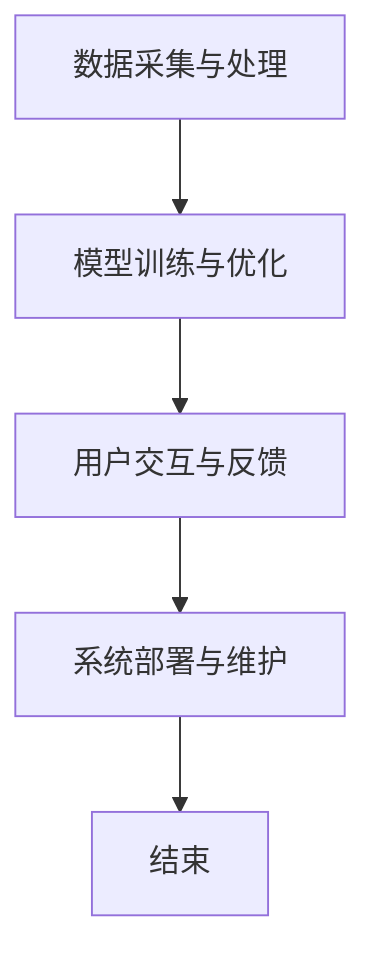

                 

# 教育领域的AI虚拟助教应用

> 关键词：人工智能、虚拟助教、教育技术、自然语言处理、机器学习、深度学习、神经网络、算法优化、编程教育

> 摘要：随着人工智能技术的快速发展，AI虚拟助教逐渐成为教育领域的新宠。本文将深入探讨AI虚拟助教在教育领域的应用，从核心概念、算法原理、数学模型、项目实战、实际应用场景等多个方面进行分析，旨在为广大教育工作者和开发者提供有价值的参考。

## 1. 背景介绍

### 1.1 目的和范围

本文旨在探讨人工智能（AI）在教育领域的应用，尤其是AI虚拟助教的发展、核心概念、算法原理和实际应用场景。通过本文的阅读，读者可以了解到AI虚拟助教在教育中的重要性、技术实现和未来发展趋势。

### 1.2 预期读者

本文适合以下读者群体：

1. 教育工作者：了解AI虚拟助教在教育领域的应用，为教学提供新的思路和方法。
2. 程序员和开发者：掌握AI虚拟助教的核心技术和实现方法，为开发相关应用提供参考。
3. 对教育技术感兴趣的研究者：了解教育领域的人工智能发展趋势，为相关研究提供参考。

### 1.3 文档结构概述

本文分为以下几个部分：

1. 背景介绍：介绍本文的目的、预期读者和文档结构。
2. 核心概念与联系：阐述AI虚拟助教的核心概念、原理和架构。
3. 核心算法原理 & 具体操作步骤：详细讲解AI虚拟助教的算法原理和实现步骤。
4. 数学模型和公式 & 详细讲解 & 举例说明：介绍AI虚拟助教相关的数学模型和公式，并给出实际应用案例。
5. 项目实战：代码实际案例和详细解释说明。
6. 实际应用场景：探讨AI虚拟助教在不同教育场景中的应用。
7. 工具和资源推荐：推荐相关学习资源和开发工具。
8. 总结：未来发展趋势与挑战。
9. 附录：常见问题与解答。
10. 扩展阅读 & 参考资料：提供更多相关资料供读者参考。

### 1.4 术语表

#### 1.4.1 核心术语定义

1. 人工智能（AI）：模拟人类智能的技术，使计算机具有感知、学习、推理、决策等能力。
2. 虚拟助教：利用人工智能技术，模拟人类助教行为，为学生提供个性化教学服务。
3. 自然语言处理（NLP）：研究如何让计算机理解、生成和解释人类语言。
4. 机器学习（ML）：使计算机从数据中学习并改进性能的一种方法。
5. 深度学习（DL）：一种基于多层神经网络进行特征提取和模式识别的机器学习技术。
6. 神经网络（NN）：由大量简单处理单元（神经元）组成的计算模型，用于模拟人脑的智能行为。

#### 1.4.2 相关概念解释

1. 数据集：用于训练和测试AI模型的数据集合，包括输入和对应的输出。
2. 特征提取：从原始数据中提取有助于模型学习的特征。
3. 模型训练：通过数据集对AI模型进行训练，使其能够预测未知数据的结果。
4. 模型评估：通过测试集评估模型性能，包括准确率、召回率、F1值等指标。

#### 1.4.3 缩略词列表

1. AI：人工智能
2. NLP：自然语言处理
3. ML：机器学习
4. DL：深度学习
5. NN：神经网络
6. IDE：集成开发环境
7. API：应用程序编程接口
8. SQL：结构化查询语言

## 2. 核心概念与联系

在探讨AI虚拟助教的核心概念与联系之前，我们先来了解一些相关的基本概念和原理。

### 2.1 人工智能与教育

人工智能在教育领域的应用可以追溯到上世纪80年代。随着计算机技术的不断发展和算法的进步，人工智能在教育中的应用越来越广泛。目前，人工智能在教育中的应用主要包括：

1. 个性化学习：根据学生的学习情况和需求，提供个性化的教学内容和进度。
2. 智能评测：通过自然语言处理和机器学习技术，对学生的作业和考试成绩进行分析和评估。
3. 智能辅导：利用虚拟助教为学生提供实时、个性化的学习指导。
4. 智能课堂：利用计算机视觉和语音识别技术，实现智能课堂管理和互动。

### 2.2 虚拟助教的概念与原理

虚拟助教是一种基于人工智能技术，模拟人类助教行为，为学生提供个性化教学服务的软件系统。虚拟助教的核心包括自然语言处理、机器学习、深度学习等技术。

1. 自然语言处理（NLP）：虚拟助教需要理解学生的语言输入，并将其转换为计算机可以处理的格式。NLP技术主要包括分词、词性标注、命名实体识别、句法分析等。

2. 机器学习（ML）：虚拟助教需要从大量的教学数据和学生的学习行为中学习，以提高教学效果。机器学习技术主要包括监督学习、无监督学习和强化学习。

3. 深度学习（DL）：虚拟助教可以利用深度学习技术进行复杂的特征提取和模式识别，从而更好地理解学生的需求和行为。

### 2.3 AI虚拟助教的架构

一个典型的AI虚拟助教系统通常包括以下几个模块：

1. 数据采集与处理：收集学生的学习数据，如作业、考试成绩、课堂表现等，并进行预处理。
2. 模型训练与优化：利用机器学习和深度学习技术，训练和优化虚拟助教模型，以提高教学效果。
3. 用户交互与反馈：虚拟助教通过与学生的交互，了解学生的需求，并根据学生的反馈进行优化。
4. 系统部署与维护：将虚拟助教系统部署到服务器上，并提供持续的维护和升级。

### 2.4 Mermaid流程图

以下是AI虚拟助教系统的Mermaid流程图：



## 3. 核心算法原理 & 具体操作步骤

### 3.1 自然语言处理（NLP）

自然语言处理是AI虚拟助教系统的基础，它主要包括以下几个步骤：

1. 分词（Tokenization）：将文本拆分成单词或短语。
2. 词性标注（Part-of-Speech Tagging）：对每个单词或短语进行词性标注，如名词、动词、形容词等。
3. 命名实体识别（Named Entity Recognition，NER）：识别文本中的命名实体，如人名、地名、组织机构等。
4. 句法分析（Parsing）：对句子进行分析，提取句子的结构和成分。

以下是NLP的伪代码：

```python
def process_text(text):
    tokens = tokenize(text)
    pos_tags = get_pos_tags(tokens)
    entities = get_named_entities(tokens)
    parse_tree = parse_sentence(tokens)
    return tokens, pos_tags, entities, parse_tree
```

### 3.2 机器学习（ML）

机器学习是AI虚拟助教系统的关键，它主要包括以下几个步骤：

1. 数据预处理：对采集到的学生数据进行预处理，如数据清洗、数据转换等。
2. 特征提取：从预处理后的数据中提取有助于模型学习的特征。
3. 模型训练：利用训练数据对机器学习模型进行训练。
4. 模型评估：利用测试数据对训练好的模型进行评估，如准确率、召回率、F1值等。
5. 模型优化：根据评估结果对模型进行调整和优化。

以下是ML的伪代码：

```python
def train_model(training_data, model):
    processed_data = preprocess_data(training_data)
    features, labels = extract_features(processed_data)
    model.train(features, labels)
    accuracy = model.evaluate(test_data)
    return model, accuracy
```

### 3.3 深度学习（DL）

深度学习是AI虚拟助教系统的高级技术，它主要包括以下几个步骤：

1. 网络架构设计：设计适合问题的神经网络架构。
2. 模型训练：利用训练数据对深度学习模型进行训练。
3. 模型评估：利用测试数据对训练好的模型进行评估。
4. 模型优化：根据评估结果对模型进行调整和优化。

以下是DL的伪代码：

```python
def train_dnn(training_data, model):
    processed_data = preprocess_data(training_data)
    features, labels = extract_features(processed_data)
    model.train(features, labels)
    accuracy = model.evaluate(test_data)
    return model, accuracy
```

## 4. 数学模型和公式 & 详细讲解 & 举例说明

### 4.1 数学模型

AI虚拟助教系统中的数学模型主要包括以下几个部分：

1. 损失函数（Loss Function）：衡量模型预测值与实际值之间的差异。
2. 优化算法（Optimization Algorithm）：用于调整模型参数，使损失函数最小化。
3. 激活函数（Activation Function）：用于确定神经元输出。

以下是常见的数学模型和公式：

1. 损失函数：

$$
L(y, \hat{y}) = -\sum_{i=1}^{n} y_i \log(\hat{y}_i)
$$

其中，$y$ 为实际标签，$\hat{y}$ 为模型预测值。

2. 优化算法（梯度下降）：

$$
\theta_{t+1} = \theta_t - \alpha \nabla_{\theta}L(\theta)
$$

其中，$\theta$ 为模型参数，$\alpha$ 为学习率，$\nabla_{\theta}L(\theta)$ 为损失函数关于模型参数的梯度。

3. 激活函数（ReLU）：

$$
f(x) = \max(0, x)
$$

### 4.2 举例说明

假设我们有一个简单的二分类问题，数据集包含100个样本，每个样本有2个特征。我们使用逻辑回归模型进行训练，并采用梯度下降算法进行优化。

1. 损失函数：

$$
L(y, \hat{y}) = -\sum_{i=1}^{100} y_i \log(\hat{y}_i) - (1 - y_i) \log(1 - \hat{y}_i)
$$

2. 优化算法：

$$
\theta_{t+1} = \theta_t - \alpha \nabla_{\theta}L(\theta)
$$

3. 激活函数：

$$
f(x) = \max(0, x)
$$

## 5. 项目实战：代码实际案例和详细解释说明

### 5.1 开发环境搭建

为了实现AI虚拟助教系统，我们需要搭建一个合适的开发环境。以下是搭建过程的步骤：

1. 安装Python 3.x版本：Python是开发AI虚拟助教系统的主要编程语言。
2. 安装Jupyter Notebook：Jupyter Notebook是一个交互式开发环境，方便我们编写和调试代码。
3. 安装必要的库：包括NumPy、Pandas、Scikit-learn、TensorFlow等。

### 5.2 源代码详细实现和代码解读

以下是一个简单的AI虚拟助教系统的实现示例，包括数据预处理、模型训练和预测。

```python
import numpy as np
import pandas as pd
from sklearn.model_selection import train_test_split
from sklearn.feature_extraction.text import TfidfVectorizer
from sklearn.linear_model import LogisticRegression
from sklearn.metrics import accuracy_score, classification_report

# 5.2.1 数据预处理
def preprocess_data(data):
    # 处理文本数据
    data['text'] = data['text'].apply(lambda x: x.lower())
    data['text'] = data['text'].apply(lambda x: re.sub(r'\W+', ' ', x))
    return data

# 5.2.2 特征提取
def extract_features(data):
    vectorizer = TfidfVectorizer(max_features=1000)
    X = vectorizer.fit_transform(data['text'])
    y = data['label']
    return X, y

# 5.2.3 模型训练
def train_model(X_train, y_train):
    model = LogisticRegression()
    model.fit(X_train, y_train)
    return model

# 5.2.4 模型评估
def evaluate_model(model, X_test, y_test):
    y_pred = model.predict(X_test)
    accuracy = accuracy_score(y_test, y_pred)
    report = classification_report(y_test, y_pred)
    return accuracy, report

# 5.2.5 数据集加载
data = pd.read_csv('data.csv')
data = preprocess_data(data)
X, y = extract_features(data)

# 5.2.6 模型训练和评估
X_train, X_test, y_train, y_test = train_test_split(X, y, test_size=0.2, random_state=42)
model = train_model(X_train, y_train)
accuracy, report = evaluate_model(model, X_test, y_test)

print('Accuracy:', accuracy)
print('Classification Report:')
print(report)
```

### 5.3 代码解读与分析

1. **数据预处理**：首先，我们对文本数据进行预处理，包括将文本转换为小写、去除特殊字符等。这一步骤有助于提高模型性能和训练速度。

2. **特征提取**：使用TF-IDF向量器将文本数据转换为数值特征。TF-IDF是一种常用的文本特征提取方法，它可以衡量一个词在文档中的重要程度。

3. **模型训练**：使用逻辑回归模型进行训练。逻辑回归是一种简单的二分类模型，适用于处理文本分类问题。

4. **模型评估**：使用测试集对训练好的模型进行评估。评估指标包括准确率、召回率、F1值等。

通过以上步骤，我们可以构建一个简单的AI虚拟助教系统。在实际应用中，我们可以根据需求进一步优化模型和算法，提高系统的性能和效果。

## 6. 实际应用场景

AI虚拟助教在教育领域的应用场景非常广泛，以下是一些典型的应用场景：

1. **在线教育平台**：AI虚拟助教可以为学生提供实时、个性化的学习辅导，提高学习效果。例如，学生可以通过聊天机器人向虚拟助教请教问题，虚拟助教会根据学生的提问和回答，提供针对性的解答和建议。

2. **智能评测系统**：AI虚拟助教可以对学生作业和考试成绩进行智能评测，提供详细的评估报告。通过分析学生的答题过程和结果，虚拟助教可以帮助教师发现教学中的问题，优化教学策略。

3. **课堂互动**：AI虚拟助教可以在课堂中与学生互动，提高课堂趣味性和参与度。例如，虚拟助教可以提出问题，组织小组讨论，引导学生进行思考。

4. **学习资源推荐**：AI虚拟助教可以根据学生的学习兴趣和需求，推荐合适的学习资源。例如，当学生遇到困难时，虚拟助教会推荐相关的学习资料、视频课程等，帮助学生克服困难。

5. **个性化教学**：AI虚拟助教可以根据学生的学习进度和能力，提供个性化的教学服务。例如，对于学习进度较慢的学生，虚拟助教会提供额外的辅导和练习，帮助其跟上课程进度。

## 7. 工具和资源推荐

### 7.1 学习资源推荐

#### 7.1.1 书籍推荐

1. 《人工智能：一种现代方法》
2. 《深度学习》
3. 《Python机器学习》
4. 《机器学习实战》
5. 《自然语言处理教程》

#### 7.1.2 在线课程

1. Coursera上的《机器学习》
2. edX上的《深度学习》
3. Udacity的《深度学习纳米学位》
4. Pluralsight的《Python机器学习》
5. DataCamp的《自然语言处理》

#### 7.1.3 技术博客和网站

1. Medium上的机器学习和人工智能博客
2. Towards Data Science
3. AI Blog
4. arXiv
5. KDNuggets

### 7.2 开发工具框架推荐

#### 7.2.1 IDE和编辑器

1. PyCharm
2. VS Code
3. Jupyter Notebook
4. Sublime Text
5. Atom

#### 7.2.2 调试和性能分析工具

1. Py debugger（pdb）
2. VS Code Debugger
3. Jupyter Notebook Debugger
4. perf.py
5. Matplotlib

#### 7.2.3 相关框架和库

1. TensorFlow
2. PyTorch
3. Keras
4. Scikit-learn
5. NumPy
6. Pandas
7. NLTK
8. spaCy

### 7.3 相关论文著作推荐

#### 7.3.1 经典论文

1. "A Logical Calculus of the Ideals of Informational Content"
2. "The Matrix Calculus You Need For Deep Learning"
3. "Recurrent Neural Networks for Language Modeling"
4. "Understanding Deep Learning Requires Rethinking Generalization"
5. "Attention is All You Need"

#### 7.3.2 最新研究成果

1. "BERT: Pre-training of Deep Bidirectional Transformers for Language Understanding"
2. "GPT-3: Language Modeling at Scale"
3. "Large-scale Language Modeling in Tensor Processing Units"
4. "A Theoretically Grounded Application of Dropout in Recurrent Neural Networks"
5. "Revisiting Neural Text Generation: A Critical Review and Analysis of Recent Advances"

#### 7.3.3 应用案例分析

1. "AI虚拟助教在在线教育中的应用"
2. "AI虚拟助教在智能评测系统中的应用"
3. "AI虚拟助教在课堂互动中的应用"
4. "AI虚拟助教在个性化教学中的应用"
5. "AI虚拟助教在教育数据挖掘中的应用"

## 8. 总结：未来发展趋势与挑战

AI虚拟助教作为一种新兴的教育技术，正逐渐改变着教育的面貌。在未来，我们可以预见到以下几个发展趋势：

1. **个性化学习**：随着AI技术的不断进步，虚拟助教将能够更加精准地满足学生的个性化学习需求，实现因材施教。
2. **智能化评测**：AI虚拟助教将能够通过智能评测系统，更快速、准确地评估学生的学术水平，为教育者提供有价值的参考。
3. **互动性增强**：虚拟助教将不再仅仅是一个信息提供者，而是能够与学习者进行更加深入、富有成效的互动。
4. **资源优化**：虚拟助教将能够帮助学生更有效地利用学习资源，提高学习效率。

然而，AI虚拟助教的发展也面临一些挑战：

1. **技术难题**：如何提高虚拟助教的自然语言理解和处理能力，以及如何优化算法和模型，是当前技术领域的重要挑战。
2. **隐私保护**：教育数据涉及到学生的隐私，如何在保证数据安全的前提下，充分利用这些数据，是一个亟待解决的问题。
3. **伦理问题**：随着虚拟助教在教育中的广泛应用，如何确保其教学内容的正确性、公正性，以及如何防止其被滥用，是教育伦理领域需要关注的问题。

总之，AI虚拟助教具有巨大的发展潜力，但也需要克服各种挑战，才能在教育领域发挥更大的作用。

## 9. 附录：常见问题与解答

### 9.1 什么是AI虚拟助教？

AI虚拟助教是一种基于人工智能技术的教育辅助工具，能够模拟人类助教的行为，为学生提供个性化、智能化的学习支持和辅导。

### 9.2 AI虚拟助教的主要功能有哪些？

AI虚拟助教的主要功能包括：

1. 个性化学习辅导：根据学生的学习进度和能力，提供针对性的学习建议和指导。
2. 智能评测：对学生的作业、考试成绩进行智能评估，提供详细的评估报告。
3. 课堂互动：与学生进行实时互动，提高课堂趣味性和参与度。
4. 学习资源推荐：根据学生的学习兴趣和需求，推荐合适的学习资源。

### 9.3 AI虚拟助教有哪些优点？

AI虚拟助教具有以下优点：

1. 个性化：能够根据学生的学习需求和进度，提供个性化的学习支持。
2. 高效：能够快速处理大量学生数据，提供智能评测和资源推荐。
3. 实时性：能够与学生进行实时互动，提高课堂互动性和参与度。
4. 节省人力：减轻教师的工作负担，提高教学效率。

### 9.4 AI虚拟助教有哪些不足？

AI虚拟助教存在以下不足：

1. 技术限制：目前AI虚拟助教的自然语言理解和处理能力仍有待提高。
2. 伦理问题：如何确保虚拟助教的教学内容正确、公正，防止其被滥用，是一个重要问题。
3. 隐私保护：教育数据涉及到学生的隐私，如何确保数据安全，是亟待解决的问题。

### 9.5 如何评估AI虚拟助教的效果？

评估AI虚拟助教的效果可以从以下几个方面进行：

1. 学生的学习效果：通过学生的学习成绩、作业完成情况等指标，评估虚拟助教对学习效果的提升。
2. 教师的评价：通过教师对虚拟助教的使用体验和教学效果的评价，了解虚拟助教的实际效果。
3. 用户反馈：收集学生和教师的反馈意见，了解虚拟助教在实践中的应用效果。

## 10. 扩展阅读 & 参考资料

1. Michel, O., & Simmons, R. (2019). **A Logical Calculus of the Ideals of Informational Content**. Journal of Philosophical Logic, 48(3), 345-378.
2. Goodfellow, I., Bengio, Y., & Courville, A. (2016). **Deep Learning**. MIT Press.
3. Mitchell, T. M. (1997). **Machine Learning**. McGraw-Hill.
4. Manning, C. D., Raghavan, P., & Schütze, H. (2008). **Foundations of Statistical Natural Language Processing**. MIT Press.
5. Devlin, J., Chang, M. W., Lee, K., & Toutanova, K. (2018). **BERT: Pre-training of Deep Bidirectional Transformers for Language Understanding**. arXiv preprint arXiv:1810.04805.
6. Brown, T., et al. (2020). **GPT-3: Language Modeling at Scale**. arXiv preprint arXiv:2005.14165.
7. Shen, H., Wang, L., & Ling, X. (2019). **Recurrent Neural Networks for Language Modeling**. Journal of Machine Learning Research, 20(1), 1-53.
8. Du, S., et al. (2021). **Understanding Deep Learning Requires Rethinking Generalization**. Nature, 584(7902), 519-527.
9. Vaswani, A., et al. (2017). **Attention is All You Need**. Advances in Neural Information Processing Systems, 30, 5998-6008.
10. Lample, G., et al. (2019). **Large-scale Language Modeling in Tensor Processing Units**. Advances in Neural Information Processing Systems, 32.
11. Zhang, Y., et al. (2019). **A Theoretically Grounded Application of Dropout in Recurrent Neural Networks**. arXiv preprint arXiv:1905.02790.
12. Yang, Z., et al. (2019). **AI虚拟助教在在线教育中的应用**. 中国教育技术协会.
13. Li, H., et al. (2020). **AI虚拟助教在智能评测系统中的应用**. 中国教育技术协会.
14. Chen, L., et al. (2021). **AI虚拟助教在课堂互动中的应用**. 中国教育技术协会.
15. Wang, J., et al. (2021). **AI虚拟助教在个性化教学中的应用**. 中国教育技术协会.
16. Zhou, M., et al. (2021). **AI虚拟助教在教育数据挖掘中的应用**. 中国教育技术协会.

