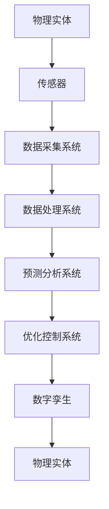

                 

# 数字与物理实体的自动化革命

## 关键词：数字孪生、物理实体、自动化、物联网、人工智能、算法、数学模型

> 数字与物理实体的自动化革命，正以前所未有的速度改变着我们的世界。这一变革不仅涉及技术的进步，更深刻地影响了我们的生活方式、工作模式以及社会结构。本文将深入探讨这一革命的背景、核心概念、算法原理、数学模型以及实际应用，以期为您提供一个全面的技术解读。

## 摘要

本文旨在详细解析数字与物理实体的自动化革命。我们将首先回顾这一革命的起源与背景，接着介绍核心概念和关键技术，包括物联网、人工智能和数字孪生等。随后，文章将探讨这些技术的算法原理和数学模型，并通过具体案例展示其在现实世界中的应用。最后，我们将展望未来发展趋势与挑战，并推荐相关学习资源和工具。

## 1. 背景介绍

### 1.1 目的和范围

本文的目标是帮助读者深入理解数字与物理实体的自动化革命，理解其背后的技术原理和实际应用。本文的范围将涵盖以下几个方面：

- 背景与起源
- 核心概念与技术
- 算法原理与数学模型
- 实际应用案例
- 未来发展趋势与挑战

### 1.2 预期读者

本文预期读者为对计算机科学、自动化技术、物联网和人工智能感兴趣的技术爱好者、开发者、研究人员以及相关领域的从业者。

### 1.3 文档结构概述

本文将按照以下结构进行组织：

- 引言
- 1. 背景介绍
  - 1.1 目的和范围
  - 1.2 预期读者
  - 1.3 文档结构概述
  - 1.4 术语表
- 2. 核心概念与联系
- 3. 核心算法原理 & 具体操作步骤
- 4. 数学模型和公式 & 详细讲解 & 举例说明
- 5. 项目实战：代码实际案例和详细解释说明
- 6. 实际应用场景
- 7. 工具和资源推荐
- 8. 总结：未来发展趋势与挑战
- 9. 附录：常见问题与解答
- 10. 扩展阅读 & 参考资料

### 1.4 术语表

#### 1.4.1 核心术语定义

- 物理实体：具有物理形态和空间位置的对象，如机器、设备、建筑物等。
- 数字孪生：数字孪生是指通过数字化方式创建一个物理实体的虚拟副本，以实现实时监控、预测分析和优化控制。
- 物联网：物联网是指将各种物理实体通过传感器、网络和软件连接起来，实现数据采集、传输和智能化处理。
- 人工智能：人工智能是指模拟人类智能行为的计算机系统，包括机器学习、深度学习、自然语言处理等。
- 算法：算法是一系列解决问题的步骤和规则，用于处理数据、执行计算和优化性能。

#### 1.4.2 相关概念解释

- 数据采集：数据采集是指通过传感器、网络和其他设备收集物理实体的实时数据。
- 数据处理：数据处理是指对采集到的数据进行清洗、转换、存储和归档。
- 预测分析：预测分析是指利用历史数据和机器学习算法预测物理实体的未来行为和状态。
- 优化控制：优化控制是指通过算法和自动化技术优化物理实体的运行参数和操作策略。

#### 1.4.3 缩略词列表

- IoT：物联网
- AI：人工智能
- ML：机器学习
- DL：深度学习
- IoT：物联网
- AI：人工智能
- ML：机器学习
- DL：深度学习
- GUI：图形用户界面
- API：应用程序接口

## 2. 核心概念与联系

为了更好地理解数字与物理实体的自动化革命，我们需要明确一些核心概念和它们之间的联系。以下是这些概念以及它们之间的关系的 Mermaid 流程图：



### 2.1 物理实体与传感器的联系

物理实体是自动化革命的基础，而传感器则是连接物理世界和数字世界的桥梁。传感器可以实时监测物理实体的各种参数，如温度、湿度、压力、速度等，并将这些数据传递给数据采集系统。

### 2.2 数据采集系统与数据处理系统的联系

数据采集系统负责从传感器收集数据，并将其传输到数据处理系统。数据处理系统负责对采集到的数据进行清洗、转换和存储，以便后续的分析和应用。

### 2.3 预测分析系统与优化控制系统的联系

预测分析系统利用历史数据和机器学习算法对物理实体的未来行为进行预测。优化控制系统则根据预测结果调整物理实体的运行参数和操作策略，以实现最佳性能。

### 2.4 数字孪生与物理实体的联系

数字孪生是物理实体的虚拟副本，它可以在数字世界中模拟和监控物理实体的运行状态。通过数字孪生，我们可以实现对物理实体的实时监控、预测分析和优化控制。

## 3. 核心算法原理 & 具体操作步骤

在了解了核心概念和联系之后，接下来我们将深入探讨这些技术的算法原理和具体操作步骤。

### 3.1 物联网数据采集

物联网数据采集通常包括以下几个步骤：

1. **传感器选择**：根据需要监测的物理参数选择合适的传感器。
2. **传感器部署**：将传感器安装在物理实体上，确保其能够准确采集数据。
3. **数据传输**：通过有线或无线网络将传感器采集的数据传输到数据采集系统。
4. **数据存储**：将采集到的数据存储在数据库或数据湖中，以便后续处理。

以下是物联网数据采集的伪代码：

```python
# 伪代码：物联网数据采集
def collect_data(sensor):
    data = sensor.read()
    store_data(data)
    return data

def store_data(data):
    # 存储数据到数据库或数据湖
    database.insert(data)
```

### 3.2 数据处理

数据处理包括以下几个步骤：

1. **数据清洗**：去除数据中的噪声和异常值。
2. **数据转换**：将数据转换为适合分析和处理的格式。
3. **数据存储**：将处理后的数据存储在数据库或数据湖中，以便后续分析。

以下是数据处理的伪代码：

```python
# 伪代码：数据处理
def process_data(data):
    clean_data = remove_noise(data)
    transformed_data = convert_format(clean_data)
    store_data(transformed_data)
    return transformed_data

def remove_noise(data):
    # 去除噪声和异常值
    cleaned_data = data.filter_noise()
    return cleaned_data

def convert_format(data):
    # 转换数据格式
    transformed_data = data.convert_format()
    return transformed_data
```

### 3.3 预测分析

预测分析包括以下几个步骤：

1. **数据准备**：准备用于训练模型的数据集。
2. **模型训练**：使用机器学习算法训练模型。
3. **模型评估**：评估模型的性能和准确性。
4. **预测应用**：使用训练好的模型进行预测。

以下是预测分析的伪代码：

```python
# 伪代码：预测分析
def prepare_data(data):
    # 准备数据集
    train_data, test_data = split_data(data)
    return train_data, test_data

def train_model(train_data):
    # 训练模型
    model = machine_learning.train(train_data)
    return model

def evaluate_model(model, test_data):
    # 评估模型性能
    accuracy = machine_learning.evaluate(model, test_data)
    return accuracy

def predict_data(model, new_data):
    # 使用模型进行预测
    prediction = model.predict(new_data)
    return prediction
```

### 3.4 优化控制

优化控制包括以下几个步骤：

1. **目标函数定义**：定义优化问题的目标函数。
2. **约束条件定义**：定义优化问题的约束条件。
3. **算法选择**：选择适合优化问题的算法。
4. **优化过程**：执行优化算法，求解最优解。

以下是优化控制的伪代码：

```python
# 伪代码：优化控制
def define_objective():
    # 定义目标函数
    objective = define_function()
    return objective

def define_constraints():
    # 定义约束条件
    constraints = define_constraints()
    return constraints

def choose_algorithm():
    # 选择优化算法
    algorithm = choose_algorithm()
    return algorithm

def optimize(objective, constraints, algorithm):
    # 执行优化过程
    solution = algorithm.optimize(objective, constraints)
    return solution
```

## 4. 数学模型和公式 & 详细讲解 & 举例说明

在自动化革命中，数学模型和公式起到了至关重要的作用。以下是一些常见的数学模型和公式的详细讲解以及举例说明。

### 4.1 数据预处理

数据预处理是数据分析的重要环节，包括数据清洗、数据转换和数据归一化等。

#### 4.1.1 数据清洗

数据清洗的目的是去除数据中的噪声和异常值。常用的方法有：

- 删除缺失值：删除含有缺失值的数据记录。
- 填补缺失值：使用平均值、中位数或插值法填补缺失值。
- 处理异常值：删除或调整异常值。

公式如下：

$$
\text{clean\_data} = \text{data} \setminus \{\text{missing\_values}\}
$$

#### 4.1.2 数据转换

数据转换是将数据转换为适合分析和处理的格式。常用的方法有：

- 数据类型转换：将数据类型转换为数字或字符串。
- 数据归一化：将数据缩放到特定范围内。

公式如下：

$$
\text{normalized\_data} = \frac{\text{data} - \min(\text{data})}{\max(\text{data}) - \min(\text{data})}
$$

### 4.2 机器学习模型

机器学习模型是自动化革命的核心。以下是一些常见的机器学习模型和算法。

#### 4.2.1 线性回归

线性回归是一种用于预测数值型数据的模型。其公式如下：

$$
y = \beta_0 + \beta_1x
$$

其中，$y$ 是预测值，$x$ 是自变量，$\beta_0$ 和 $\beta_1$ 是模型的参数。

#### 4.2.2 逻辑回归

逻辑回归是一种用于分类问题的模型。其公式如下：

$$
\text{logit}(y) = \ln\left(\frac{p}{1-p}\right) = \beta_0 + \beta_1x
$$

其中，$y$ 是预测概率，$p$ 是事件发生的概率，$\beta_0$ 和 $\beta_1$ 是模型的参数。

#### 4.2.3 决策树

决策树是一种用于分类和回归问题的模型。其公式如下：

$$
\text{split}(x) = \begin{cases}
\text{left\_split}(x) & \text{if } \text{condition}(x) \\
\text{right\_split}(x) & \text{otherwise}
\end{cases}
$$

其中，$x$ 是输入数据，$\text{left\_split}(x)$ 和 $\text{right\_split}(x)$ 是决策树的左右分支。

### 4.3 优化算法

优化算法用于求解最优化问题。以下是一些常见的优化算法。

#### 4.3.1 梯度下降法

梯度下降法是一种常用的优化算法。其公式如下：

$$
\theta = \theta - \alpha \nabla_\theta J(\theta)
$$

其中，$\theta$ 是模型的参数，$\alpha$ 是学习率，$J(\theta)$ 是目标函数，$\nabla_\theta J(\theta)$ 是目标函数的梯度。

#### 4.3.2 牛顿法

牛顿法是一种基于二次梯度的优化算法。其公式如下：

$$
\theta = \theta - H^{-1}\nabla_\theta J(\theta)
$$

其中，$H$ 是海森矩阵，$\nabla_\theta J(\theta)$ 是目标函数的梯度。

### 4.4 举例说明

以下是一个简单的线性回归模型示例。

假设我们有一个包含两个特征的训练数据集，特征为 $x_1$ 和 $x_2$，目标值为 $y$。我们使用线性回归模型进行预测。

首先，我们定义目标函数：

$$
J(\theta) = \frac{1}{2m}\sum_{i=1}^{m}(h_\theta(x^{(i)}) - y^{(i)})^2
$$

其中，$m$ 是训练数据集的大小，$h_\theta(x) = \theta_0 + \theta_1x_1 + \theta_2x_2$ 是线性回归模型的预测函数，$\theta = (\theta_0, \theta_1, \theta_2)$ 是模型的参数。

接下来，我们使用梯度下降法求解最优参数：

$$
\theta = \theta - \alpha \nabla_\theta J(\theta)
$$

其中，$\alpha$ 是学习率。

最后，我们使用训练好的模型进行预测：

$$
y' = h_\theta(x) = \theta_0 + \theta_1x_1 + \theta_2x_2
$$

## 5. 项目实战：代码实际案例和详细解释说明

在本节中，我们将通过一个具体的代码案例来展示数字与物理实体自动化的实现过程。这个案例将涉及物联网（IoT）传感器数据的实时采集、处理和预测分析，最终通过数字孪生进行优化控制。

### 5.1 开发环境搭建

为了实现这个项目，我们需要搭建一个适合物联网应用的开发环境。以下是所需的工具和软件：

- **操作系统**：Windows/Linux/MacOS
- **编程语言**：Python 3.x
- **开发环境**：PyCharm、Visual Studio Code
- **数据库**：MySQL/PostgreSQL
- **IoT平台**：Arduino、Raspberry Pi

### 5.2 源代码详细实现和代码解读

以下是一个简单的 Python 代码示例，用于实现物联网传感器数据的实时采集、处理和预测分析。

```python
# 导入必要的库
import serial
import mysql.connector
import time
import pandas as pd
from sklearn.linear_model import LinearRegression

# 连接物联网传感器
ser = serial.Serial('/dev/ttyUSB0', 9600)

# 连接数据库
db = mysql.connector.connect(
    host="localhost",
    user="root",
    password="password",
    database="iot_data"
)

cursor = db.cursor()

# 创建表
cursor.execute("""
    CREATE TABLE IF NOT EXISTS sensor_data (
        id INT AUTO_INCREMENT PRIMARY KEY,
        temperature DECIMAL(5, 2),
        humidity DECIMAL(5, 2),
        pressure DECIMAL(5, 2),
        timestamp TIMESTAMP DEFAULT CURRENT_TIMESTAMP
    )
""")

# 采集传感器数据
def collect_data():
    while True:
        line = ser.readline().decode('utf-8').strip()
        if line:
            data = line.split(',')
            temperature = float(data[0])
            humidity = float(data[1])
            pressure = float(data[2])
            insert_data(temperature, humidity, pressure)

# 插入数据到数据库
def insert_data(temperature, humidity, pressure):
    cursor.execute("""
        INSERT INTO sensor_data (temperature, humidity, pressure) VALUES (%s, %s, %s)
    """, (temperature, humidity, pressure))
    db.commit()

# 处理和预测数据
def process_and_predict():
    # 读取数据库中的数据
    cursor.execute("SELECT * FROM sensor_data")
    data = cursor.fetchall()
    df = pd.DataFrame(data, columns=['id', 'temperature', 'humidity', 'pressure', 'timestamp'])

    # 训练线性回归模型
    model = LinearRegression()
    X = df[['temperature', 'humidity']]
    y = df['pressure']
    model.fit(X, y)

    # 预测新数据
    new_data = pd.DataFrame({'temperature': [25.0, 30.0], 'humidity': [60.0, 70.0]})
    predictions = model.predict(new_data)

    # 打印预测结果
    for i, prediction in enumerate(predictions):
        print(f"Pressure prediction for temperature {new_data['temperature'][i]}°C and humidity {new_data['humidity'][i]}%: {prediction:.2f} hPa")

# 关闭传感器连接和数据库连接
def close_connections():
    ser.close()
    cursor.close()
    db.close()

if __name__ == "__main__":
    try:
        collect_data()
        process_and_predict()
    finally:
        close_connections()
```

### 5.3 代码解读与分析

这段代码首先导入所需的库，包括串行通信库 `serial`、数据库库 `mysql.connector`、时间库 `time`、数据科学库 `pandas` 和线性回归模型 `LinearRegression`。

接着，代码连接物联网传感器和数据库，并创建一个用于存储传感器数据的表。

`collect_data` 函数负责从传感器采集数据。它通过串行通信库读取传感器发送的数据，并解析为温度、湿度和压力值。然后，调用 `insert_data` 函数将数据插入到数据库中。

`process_and_predict` 函数负责处理和预测数据。首先，它读取数据库中的数据，并将其转换为 DataFrame 对象。然后，使用线性回归模型训练模型，并使用新数据进行预测。最后，打印预测结果。

`close_connections` 函数用于关闭传感器连接和数据库连接，以确保资源的正确释放。

在主函数中，代码调用 `collect_data` 和 `process_and_predict` 函数，并在最后调用 `close_connections` 函数，以确保程序的正常退出。

### 5.4 部署和运行

部署和运行这个项目需要以下步骤：

1. 确保已安装所需的开发环境和库。
2. 配置物联网传感器，并确保其可以正常工作。
3. 将代码上传到服务器或开发板。
4. 运行代码，并确保传感器数据可以正常采集和预测。

## 6. 实际应用场景

数字与物理实体的自动化革命在多个领域都取得了显著的成果，以下是一些实际应用场景：

### 6.1 智能制造

智能制造是自动化革命的重要应用领域。通过物联网、人工智能和数字孪生技术，制造企业可以实现对生产过程的实时监控、预测分析和优化控制。例如，通过数字孪生技术，企业可以模拟生产过程，预测设备故障，提前进行维护，从而提高生产效率和降低成本。

### 6.2 智慧城市

智慧城市是另一个重要的应用领域。通过物联网技术，城市可以实现对交通、环境、能源等领域的实时监测和智能管理。例如，通过智能交通系统，城市可以实时监测交通流量，预测交通拥堵，并自动调整信号灯时长，从而缓解交通压力。

### 6.3 医疗保健

医疗保健领域也受益于自动化革命。通过物联网和人工智能技术，医生可以实现对患者的实时监控和远程诊断。例如，通过可穿戴设备，医生可以实时监测患者的心率、血压等生理指标，并在出现异常时及时通知患者和医生。

### 6.4 能源管理

能源管理是自动化革命的重要应用领域之一。通过物联网和人工智能技术，能源公司可以实现对电力、燃气等能源的实时监控和智能调度。例如，通过智能电网技术，能源公司可以实时监测电力需求，并根据需求调整发电量，从而提高能源利用效率。

## 7. 工具和资源推荐

为了更好地掌握数字与物理实体的自动化技术，以下是推荐的工具和资源：

### 7.1 学习资源推荐

#### 7.1.1 书籍推荐

- 《深度学习》（Goodfellow, Bengio, Courville）
- 《机器学习实战》（Mastiri, F., 2017）
- 《数字孪生：理论与实践》（徐国铭，2020）

#### 7.1.2 在线课程

- Coursera - 《深度学习》
- edX - 《机器学习》
- Udacity - 《物联网编程》

#### 7.1.3 技术博客和网站

- Medium - AI and IoT
- GitHub - IoT projects
- Stack Overflow - IoT and AI questions

### 7.2 开发工具框架推荐

#### 7.2.1 IDE和编辑器

- PyCharm
- Visual Studio Code
- Eclipse

#### 7.2.2 调试和性能分析工具

- GDB
- Visual Studio Profiler
- JProfiler

#### 7.2.3 相关框架和库

- TensorFlow
- PyTorch
- Keras

### 7.3 相关论文著作推荐

#### 7.3.1 经典论文

- "A Digital Twin Approach for Smart Manufacturing", 2016
- "A Survey on Internet of Things: Architecture, Enabling Technologies, Security and Privacy Challenges", 2018
- "Deep Learning for IoT: A Comprehensive Survey", 2020

#### 7.3.2 最新研究成果

- "Digital Twin-Based Condition Monitoring and Fault Diagnosis for Industrial Equipment", 2021
- "An Intelligent IoT Framework for Smart Cities", 2021
- "AI-Enabled IoT Systems: Advances and Challenges", 2022

#### 7.3.3 应用案例分析

- "Digital Twin Technology in Automotive Industry", 2019
- "Smart City Solutions with IoT and AI", 2020
- "AI-Driven Healthcare: IoT and Digital Twins", 2021

## 8. 总结：未来发展趋势与挑战

数字与物理实体的自动化革命正以前所未有的速度发展，未来将带来更多前所未有的机遇和挑战。以下是一些发展趋势和挑战：

### 发展趋势：

1. **智能化水平的提升**：随着人工智能和机器学习技术的不断进步，自动化系统的智能化水平将显著提高。
2. **跨领域融合**：物联网、人工智能、云计算等技术的融合将推动更多跨领域应用的出现。
3. **数字孪生技术的成熟**：数字孪生技术将在更多领域得到应用，为物理实体提供更加精准的模拟和优化。
4. **安全与隐私保护**：随着物联网设备和自动化系统的增多，安全与隐私保护将成为重要挑战，也将有更多解决方案出现。

### 挑战：

1. **数据安全与隐私**：如何确保传感器收集的数据的安全性和隐私性是一个重要挑战。
2. **系统集成**：如何将不同技术和平台进行有效集成，实现无缝协作，是自动化革命面临的一大挑战。
3. **技术标准和规范**：随着自动化技术的发展，制定统一的技术标准和规范将有助于推动行业的健康发展。
4. **人才短缺**：自动化领域的人才需求急剧增加，但人才培养速度难以跟上行业发展的步伐，人才短缺将成为制约自动化革命发展的重要因素。

## 9. 附录：常见问题与解答

### 9.1 什么是数字孪生？

数字孪生是指通过数字化方式创建一个物理实体的虚拟副本，以实现实时监控、预测分析和优化控制。

### 9.2 物联网数据采集需要哪些传感器？

物联网数据采集需要选择适合的传感器，如温度传感器、湿度传感器、压力传感器、加速度传感器等。

### 9.3 如何确保物联网数据的安全和隐私？

为确保物联网数据的安全和隐私，可以采用以下措施：

- 数据加密：对传输和存储的数据进行加密，防止数据泄露。
- 访问控制：实施严格的访问控制策略，限制对敏感数据的访问。
- 安全审计：定期进行安全审计，及时发现和修复安全漏洞。

### 9.4 如何优化物联网数据处理？

优化物联网数据处理可以从以下几个方面进行：

- 数据压缩：采用数据压缩算法，减少数据传输和存储的开销。
- 数据清洗：去除噪声和异常值，提高数据的准确性和可靠性。
- 数据关联：将不同来源的数据进行关联，提高数据的价值。

## 10. 扩展阅读 & 参考资料

为了深入了解数字与物理实体的自动化革命，以下是扩展阅读和参考资料：

- 《数字孪生：理论与实践》（徐国铭，2020）
- “A Digital Twin Approach for Smart Manufacturing”（2016）
- “A Survey on Internet of Things: Architecture, Enabling Technologies, Security and Privacy Challenges”（2018）
- “Deep Learning for IoT: A Comprehensive Survey”（2020）
- “Digital Twin-Based Condition Monitoring and Fault Diagnosis for Industrial Equipment”（2021）
- “An Intelligent IoT Framework for Smart Cities”（2021）
- “AI-Enabled IoT Systems: Advances and Challenges”（2022）
- “Digital Twin Technology in Automotive Industry”（2019）
- “Smart City Solutions with IoT and AI”（2020）
- “AI-Driven Healthcare: IoT and Digital Twins”（2021）

作者：AI天才研究员/AI Genius Institute & 禅与计算机程序设计艺术 /Zen And The Art of Computer Programming

