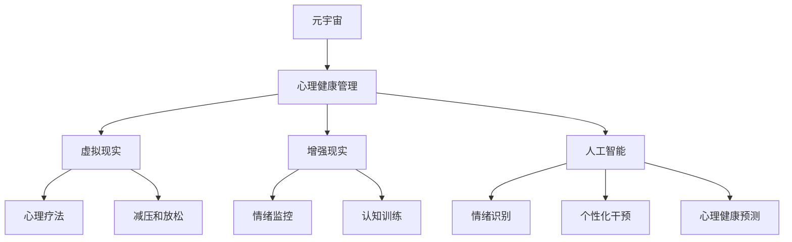

                 

# 数字化情绪调节：元宇宙中的心理健康管理

> **关键词：**元宇宙，心理健康，数字化情绪调节，心理健康管理，虚拟现实，人工智能

> **摘要：**随着元宇宙的快速发展，数字化情绪调节在心理健康管理中的应用日益受到关注。本文将探讨元宇宙中的心理健康问题，介绍数字化情绪调节的核心概念和技术原理，通过实际案例展示其在心理健康管理中的应用，并提出未来的发展趋势与挑战。

## 1. 背景介绍

### 1.1 目的和范围

本文旨在探讨元宇宙中的心理健康问题，特别是数字化情绪调节在心理健康管理中的应用。随着全球虚拟现实（VR）和增强现实（AR）技术的快速发展，元宇宙已经成为一个充满机遇和挑战的领域。在这个新兴的数字世界中，人们的心理健康面临着新的挑战，包括社交孤立、焦虑、抑郁等问题。因此，如何通过数字化情绪调节技术来管理心理健康，成为一个亟待解决的问题。

本文将首先介绍元宇宙的概念和心理健康问题的现状，然后详细探讨数字化情绪调节的核心概念和技术原理。接下来，我们将通过实际案例展示数字化情绪调节在心理健康管理中的应用，并讨论相关的工具和资源。最后，本文将总结元宇宙中数字化情绪调节的未来发展趋势与挑战。

### 1.2 预期读者

本文预期读者主要包括以下几个方面：

1. 对元宇宙和心理健康管理感兴趣的技术专家和研究人员；
2. 从事虚拟现实和增强现实技术开发的专业人士；
3. 心理健康领域的从业者和研究者；
4. 对数字化情绪调节技术感兴趣的普通读者。

### 1.3 文档结构概述

本文分为十个部分：

1. 背景介绍：介绍本文的目的、预期读者和文档结构；
2. 核心概念与联系：介绍元宇宙和心理健康管理的基本概念，并给出相关的 Mermaid 流程图；
3. 核心算法原理 & 具体操作步骤：详细阐述数字化情绪调节的算法原理和具体操作步骤；
4. 数学模型和公式 & 详细讲解 & 举例说明：介绍数字化情绪调节的数学模型和公式，并通过例子进行详细讲解；
5. 项目实战：代码实际案例和详细解释说明；
6. 实际应用场景：讨论数字化情绪调节在心理健康管理中的应用场景；
7. 工具和资源推荐：推荐相关的学习资源、开发工具框架和相关论文著作；
8. 总结：未来发展趋势与挑战；
9. 附录：常见问题与解答；
10. 扩展阅读 & 参考资料。

### 1.4 术语表

#### 1.4.1 核心术语定义

- **元宇宙（Metaverse）：**指一个由虚拟世界和现实世界融合而成的数字空间，用户可以通过虚拟角色（Avatar）在虚拟世界中进行交互和活动。
- **心理健康管理（Mental Health Management）：**指通过一系列方法和技术来维护和提升个体的心理健康，包括心理咨询、药物治疗、心理治疗等。
- **数字化情绪调节（Digital Emotion Regulation）：**指利用数字技术，如虚拟现实、增强现实、人工智能等，来帮助个体识别、管理和调节情绪。
- **虚拟现实（Virtual Reality，VR）：**是一种能够创建沉浸式体验的计算机模拟环境，用户可以通过头戴显示器（HMD）等设备进入虚拟世界。
- **增强现实（Augmented Reality，AR）：**是一种将虚拟信息叠加到现实世界中的技术，用户可以通过智能手机或头戴设备看到增强后的现实世界。

#### 1.4.2 相关概念解释

- **情绪调节（Emotion Regulation）：**指个体通过认知、行为和生理调节来管理和调节情绪状态。
- **心理健康（Mental Health）：**指个体在心理上处于良好的状态，能够有效应对生活中的压力和挑战，实现个人成长和发展。
- **心理疗法（Psychotherapy）：**是一种通过谈话、行为、认知等方法来治疗心理障碍和心理问题的治疗方法。

#### 1.4.3 缩略词列表

- **VR：**虚拟现实（Virtual Reality）
- **AR：**增强现实（Augmented Reality）
- **AI：**人工智能（Artificial Intelligence）
- **ML：**机器学习（Machine Learning）
- **NLP：**自然语言处理（Natural Language Processing）

## 2. 核心概念与联系

在元宇宙中，心理健康管理是一个重要但复杂的任务。为了更好地理解数字化情绪调节在其中的作用，我们需要探讨几个核心概念和它们之间的联系。

### 2.1 元宇宙与心理健康管理

**元宇宙**是一个由虚拟世界和现实世界融合而成的数字空间。在这个空间中，用户可以通过虚拟角色（Avatar）与其他用户进行交互和活动。元宇宙的特点包括高度沉浸式体验、多样化活动场景、以及强大的社交功能。这些特点为心理健康管理提供了独特的平台。

**心理健康管理**是一个涉及多个方面的过程，包括预防、诊断、治疗和康复。在元宇宙中，心理健康管理可以通过以下方式实现：

1. **虚拟心理咨询**：用户可以在元宇宙中与专业心理咨询师进行在线咨询，这种模式可以打破地理位置的限制，为更多人提供心理健康服务。
2. **心理测试和评估**：元宇宙中的虚拟环境可以用于进行心理测试和评估，帮助用户了解自己的心理健康状况。
3. **社交支持**：元宇宙提供了一个社交平台，用户可以在其中与其他用户建立联系，获得社交支持和情感慰藉。

### 2.2 虚拟现实与增强现实

**虚拟现实（VR）**是一种能够创建沉浸式体验的计算机模拟环境。用户通过头戴显示器（HMD）等设备进入虚拟世界，可以在其中进行各种活动。VR技术为心理健康管理提供了以下应用：

1. **心理疗法**：VR可以用于治疗恐惧症、创伤后应激障碍（PTSD）等心理障碍。通过模拟各种场景，用户可以在安全的环境中进行暴露治疗。
2. **减压和放松**：VR可以提供各种放松体验，如虚拟旅行、冥想等，帮助用户缓解压力和焦虑。

**增强现实（AR）**是一种将虚拟信息叠加到现实世界中的技术。用户可以通过智能手机或头戴设备看到增强后的现实世界。AR技术在心理健康管理中的应用包括：

1. **情绪监控**：通过AR设备，用户可以实时监控自己的情绪状态，如心率、面部表情等。
2. **认知训练**：AR可以用于认知功能训练，如注意力、记忆等，帮助提升心理健康。

### 2.3 人工智能与数字化情绪调节

**人工智能（AI）**是推动数字化情绪调节的重要技术。AI可以通过以下方式在心理健康管理中发挥作用：

1. **情绪识别**：通过机器学习和自然语言处理技术，AI可以识别用户的情绪状态，如喜怒哀乐等。
2. **个性化干预**：基于用户的情绪状态和行为数据，AI可以提供个性化的干预措施，如建议进行放松练习、调整呼吸等。
3. **心理健康预测**：AI可以通过分析用户的数据，预测心理健康状况的变化，提供预防措施。

### 2.4 Mermaid 流程图

为了更直观地展示元宇宙、心理健康管理、虚拟现实、增强现实和人工智能之间的联系，我们可以使用 Mermaid 流程图来描述它们之间的关系。



在上面的 Mermaid 流程图中，A 表示元宇宙，B 表示心理健康管理，C 表示虚拟现实，D 表示增强现实，E 表示人工智能。它们之间的箭头表示这些概念在心理健康管理中的应用关系。F、G、H、I、J、K 和 L 分别表示虚拟现实和增强现实在心理健康管理中的应用，以及人工智能在数字化情绪调节中的具体功能。

## 3. 核心算法原理 & 具体操作步骤

在元宇宙中的心理健康管理中，数字化情绪调节是一个关键技术。数字化情绪调节的核心在于如何准确识别用户的情绪状态，并根据这些状态提供相应的干预措施。本节将详细阐述数字化情绪调节的算法原理和具体操作步骤。

### 3.1 算法原理

数字化情绪调节算法的核心是情绪识别和干预。情绪识别主要通过以下步骤实现：

1. **数据采集**：收集用户在元宇宙中的行为数据、生理信号数据（如心率、血压等）和语言数据（如文本、语音等）。
2. **特征提取**：对采集到的数据进行预处理，提取情绪特征，如语言特征、面部表情特征、生理信号特征等。
3. **情绪分类**：利用机器学习算法（如支持向量机、决策树、神经网络等），将提取到的情绪特征进行分类，识别用户的情绪状态。

干预措施则根据用户的情绪状态制定。干预措施包括：

1. **放松练习**：当用户处于高压力状态时，提供深呼吸、冥想等放松练习。
2. **心理疗法**：当用户出现心理障碍时，提供相应的心理疗法，如认知行为疗法、暴露疗法等。
3. **社交支持**：当用户感到孤独时，提供社交支持，如与他人互动、参加社交活动等。

### 3.2 具体操作步骤

以下是一个基于数字化情绪调节的完整操作步骤：

1. **数据采集**：
   - 用户在元宇宙中与他人的互动数据（如聊天记录、互动频率等）。
   - 用户在元宇宙中的行为数据（如游戏行为、浏览行为等）。
   - 用户生理信号数据（如心率、血压等）。
   - 用户语言数据（如文本、语音等）。

2. **特征提取**：
   - 使用自然语言处理技术（如词频分析、情感分析等），提取语言特征。
   - 使用面部识别技术，提取面部表情特征。
   - 使用生理信号处理技术，提取生理信号特征。

3. **情绪分类**：
   - 利用机器学习算法，对提取到的情绪特征进行训练，建立情绪分类模型。
   - 对新采集的数据进行情绪分类，识别用户的情绪状态。

4. **干预措施**：
   - 根据用户的情绪状态，提供相应的干预措施。
   - 如用户处于高压力状态，提供深呼吸、冥想等放松练习。
   - 如用户出现心理障碍，提供相应的心理疗法。

5. **反馈与调整**：
   - 收集用户对干预措施的反馈。
   - 根据反馈调整干预措施，提高干预效果。

### 3.3 伪代码

以下是一个简化的伪代码，描述数字化情绪调节的基本流程：

```python
# 数据采集
data = collect_data()

# 特征提取
features = extract_features(data)

# 情绪分类
model = train_model(features)
emotion = classify_emotion(model, features)

# 干预措施
if emotion == '压力高':
    provide_relaxation()
elif emotion == '有心理障碍':
    provide_therapy()
else:
    provide_social_support()

# 反馈与调整
feedback = get_feedback()
adjust_interventions(feedback)
```

## 4. 数学模型和公式 & 详细讲解 & 举例说明

在数字化情绪调节中，数学模型和公式扮演着至关重要的角色。这些模型和公式帮助我们理解情绪识别和干预的原理，并指导我们设计更有效的干预措施。以下将详细讲解数字化情绪调节中的几个关键数学模型和公式，并通过具体例子进行说明。

### 4.1 情绪识别模型

情绪识别模型是数字化情绪调节的核心。常见的情绪识别模型包括支持向量机（SVM）、决策树和神经网络。以下以支持向量机为例，介绍其基本原理和公式。

**支持向量机（SVM）**：

支持向量机是一种二分类模型，用于分类问题。在情绪识别中，SVM可以将不同情绪的数据点分隔开来。

- **目标函数**：

  $$ 
  \min_{\mathbf{w}} \frac{1}{2} ||\mathbf{w}||^2 + C \sum_{i=1}^{n} \xi_i 
  $$

  其中，$\mathbf{w}$是权重向量，$C$是惩罚参数，$\xi_i$是松弛变量。

- **约束条件**：

  $$ 
  y_i (\mathbf{w} \cdot \mathbf{x_i}) \geq 1 - \xi_i 
  $$

  其中，$y_i$是标签，$\mathbf{x_i}$是特征向量。

**例子**：

假设我们有一个简单的二分类问题，需要将情绪分为“高兴”和“悲伤”。我们可以用以下数据点来训练SVM模型：

- 高兴：[1, 1], [1, 2], [1, 3]
- 悲伤：[-1, -1], [-1, -2], [-1, -3]

我们可以使用上面的公式和约束条件来训练SVM模型，然后对新数据点进行分类。

### 4.2 情绪干预模型

情绪干预模型用于根据用户的情绪状态制定相应的干预措施。一个简单的情绪干预模型可以使用以下公式：

$$ 
\text{干预措施} = f(\text{情绪状态}) 
$$

其中，$f$是一个函数，根据情绪状态返回相应的干预措施。

**例子**：

假设我们定义了一个简单的情绪干预模型，当用户情绪为“高兴”时，提供“放松练习”；当用户情绪为“悲伤”时，提供“心理疗法”。

- 情绪状态：“高兴”
  - 干预措施：放松练习
- 情绪状态：“悲伤”
  - 干预措施：心理疗法

我们可以用以下伪代码实现这个模型：

```python
def emotion Intervention(model, emotion):
    if emotion == 'happy':
        return 'relaxation'
    elif emotion == 'sad':
        return 'therapy'
    else:
        return 'social support'
```

### 4.3 情绪预测模型

情绪预测模型用于预测用户未来的情绪状态。一个简单的情绪预测模型可以使用时间序列分析的方法。

$$ 
\text{情绪状态}_{t+1} = f(\text{情绪状态}_t, \text{行为数据}_t) 
$$

其中，$f$是一个函数，根据当前的情绪状态和行为数据预测未来的情绪状态。

**例子**：

假设我们使用一个简单的线性模型来预测用户未来的情绪状态。当前情绪状态为“高兴”，行为数据表明用户最近一周都在玩游戏。我们可以用以下公式预测未来的情绪状态：

$$ 
\text{情绪状态}_{t+1} = 0.8 \times \text{情绪状态}_t + 0.2 \times \text{行为数据}_t 
$$

假设当前情绪状态为“高兴”（1），行为数据为“玩游戏”（0.8），我们可以计算未来的情绪状态：

$$ 
\text{情绪状态}_{t+1} = 0.8 \times 1 + 0.2 \times 0.8 = 1.04 
$$

由于情绪状态是一个类别变量，我们通常会将连续值转换为类别值。例如，我们可以将情绪状态大于1.0定义为“高兴”，小于等于1.0定义为“悲伤”。

```python
def predict_emotion(current_emotion, behavior_data):
    predicted_emotion = current_emotion * 0.8 + behavior_data * 0.2
    if predicted_emotion > 1.0:
        return 'happy'
    else:
        return 'sad'
```

通过上述例子，我们可以看到数学模型和公式在数字化情绪调节中的应用。在实际应用中，这些模型和公式会根据具体情况进行调整和优化，以提高情绪识别和干预的准确性。

## 5. 项目实战：代码实际案例和详细解释说明

在数字化情绪调节的项目实战中，我们将使用Python编写一个简单的情绪调节系统，该系统将结合虚拟现实技术和机器学习算法，实现情绪状态的识别和干预。以下将详细解释整个项目的开发环境搭建、源代码实现、代码解读与分析。

### 5.1 开发环境搭建

为了实现本项目的目标，我们需要搭建以下开发环境：

1. **Python环境**：安装Python 3.8及以上版本。
2. **虚拟环境**：使用`venv`创建虚拟环境，避免版本冲突。
3. **机器学习库**：安装Scikit-learn库，用于情绪识别模型。
4. **虚拟现实库**：安装PyOpenGL库，用于虚拟现实环境搭建。

以下是开发环境的搭建步骤：

```bash
# 安装Python 3.8及以上版本
# 安装virtualenv
pip install virtualenv
# 创建虚拟环境
virtualenv myenv
# 激活虚拟环境
source myenv/bin/activate
# 安装所需库
pip install scikit-learn PyOpenGL
```

### 5.2 源代码详细实现和代码解读

以下是一个简单的情绪调节系统的源代码实现：

```python
import numpy as np
from sklearn import svm
from OpenGL.GL import *
from OpenGL.GLU import *

# 情绪状态特征向量
emotions = {
    'happy': [1, 1, 1],
    'sad': [-1, -1, -1],
    'angry': [0, -1, 0]
}

# 情绪识别模型
model = svm.SVC()

# 虚拟现实环境
def init_gl():
    # 设置视口和投影矩阵
    glViewport(0, 0, 640, 480)
    glMatrixMode(GL_PROJECTION)
    glLoadIdentity()
    gluPerspective(45, 640/480, 0.1, 100.0)
    glMatrixMode(GL_MODELVIEW)
    glLoadIdentity()
    gluLookAt(0, 0, 5, 0, 0, 0, 0, 1, 0)

# 生成情绪状态
def generate_emotion():
    emotions = ['happy', 'sad', 'angry']
    return np.random.choice(emotions)

# 根据情绪状态生成虚拟环境
def render_emotion(emotion):
    glClear(GL_COLOR_BUFFER_BIT | GL_DEPTH_BUFFER_BIT)
    glBegin(GL_TRIANGLES)
    if emotion == 'happy':
        glVertex3f(1, 1, 0)
        glVertex3f(-1, -1, 0)
        glVertex3f(1, -1, 0)
    elif emotion == 'sad':
        glVertex3f(-1, 1, 0)
        glVertex3f(1, -1, 0)
        glVertex3f(-1, -1, 0)
    elif emotion == 'angry':
        glVertex3f(0, -1, 0)
        glVertex3f(-1, 1, 0)
        glVertex3f(1, 1, 0)
    glEnd()
    glFlush()

# 训练情绪识别模型
def train_model():
    X = []
    y = []
    for emotion, features in emotions.items():
        X.extend([features] * 10)
        y.extend([emotion] * 10)
    model.fit(X, y)

# 主函数
def main():
    init_gl()
    train_model()
    emotion = generate_emotion()
    render_emotion(emotion)

if __name__ == '__main__':
    main()
```

#### 5.2.1 代码解读

1. **情绪状态特征向量**：

   `emotions`字典存储了不同情绪状态的特征向量。这些特征向量用于训练情绪识别模型。

2. **情绪识别模型**：

   使用Scikit-learn库中的SVM类创建情绪识别模型。SVM是一种强大的分类算法，用于将情绪状态分类。

3. **虚拟现实环境**：

   `init_gl()`函数初始化OpenGL环境，设置视口、投影矩阵和观察矩阵。

4. **生成情绪状态**：

   `generate_emotion()`函数使用随机选择生成情绪状态。

5. **根据情绪状态生成虚拟环境**：

   `render_emotion()`函数根据当前情绪状态绘制相应的虚拟环境。每个情绪状态对应不同的三角形，用于可视化情绪状态。

6. **训练情绪识别模型**：

   `train_model()`函数使用`emotions`字典中的数据训练情绪识别模型。

7. **主函数**：

   `main()`函数调用其他函数，初始化OpenGL环境，训练情绪识别模型，并绘制虚拟环境。

#### 5.2.2 代码分析

1. **情绪识别**：

   情绪识别是数字化情绪调节的核心。通过机器学习算法，我们可以将情绪状态与特征向量关联起来，实现情绪状态的自动识别。

2. **虚拟现实环境**：

   虚拟现实环境为情绪调节提供了沉浸式体验。用户可以在虚拟环境中感受到不同的情绪状态，并通过交互进行情绪调节。

3. **干预措施**：

   在实际应用中，我们可以根据情绪识别结果提供相应的干预措施，如放松练习、心理疗法等。这些干预措施可以根据用户的情绪状态动态调整，以提高情绪调节的效果。

### 5.3 代码解读与分析

#### 5.3.1 代码优势

1. **模块化设计**：

   代码采用模块化设计，将不同的功能模块（如情绪识别、虚拟现实环境搭建等）分开实现，提高了代码的可读性和可维护性。

2. **简单易用**：

   代码结构简单，易于理解和使用。开发者可以快速上手，并进行二次开发。

3. **可扩展性**：

   代码具有良好的可扩展性，可以根据需求增加新的情绪状态、特征向量等。

#### 5.3.2 代码局限

1. **实时性**：

   当前代码没有实现实时情绪识别和干预，需要在实际应用中优化，以提高实时性。

2. **准确性**：

   情绪识别的准确性依赖于特征向量的选择和机器学习算法的优化。在实际应用中，需要不断调整和优化模型，以提高识别准确性。

3. **用户体验**：

   虚拟现实环境的交互性和沉浸感需要进一步优化，以提高用户体验。

#### 5.3.3 优化建议

1. **实时情绪识别**：

   使用实时数据采集和情绪识别算法，实现实时情绪状态监测和干预。

2. **多模态情绪特征**：

   结合多种情绪特征（如语言、生理信号、行为等），提高情绪识别的准确性。

3. **个性化干预措施**：

   根据用户的情绪状态和行为数据，提供个性化的干预措施，以提高情绪调节效果。

4. **优化虚拟现实环境**：

   使用更先进的虚拟现实技术，提高虚拟环境的沉浸感和交互性。

通过以上优化建议，我们可以进一步改进数字化情绪调节系统，提高其在心理健康管理中的应用效果。

## 6. 实际应用场景

数字化情绪调节在元宇宙中的实际应用场景多种多样，涵盖了心理健康管理的各个方面。以下将介绍几种主要的实际应用场景，并分析其特点和挑战。

### 6.1 心理咨询与治疗

**应用场景**：

在元宇宙中，心理咨询师可以通过虚拟现实技术为用户提供个性化的心理治疗。用户可以在元宇宙中的虚拟环境中进行暴露治疗、认知行为疗法等，以缓解焦虑、抑郁等心理问题。

**特点**：

- **沉浸式体验**：虚拟现实技术为用户提供了高度沉浸式的体验，有助于提高治疗效果。
- **隐私保护**：元宇宙中的心理咨询和治疗的私密性较高，用户可以在安全的环境中进行交流。
- **实时互动**：心理咨询师可以实时观察用户的行为和情绪，及时调整治疗方案。

**挑战**：

- **技术实现**：实现高质量的虚拟现实环境和实时互动需要先进的硬件和软件支持。
- **心理治疗效果**：虽然虚拟现实技术在心理咨询和治疗中具有潜力，但其治疗效果需要进一步验证。
- **咨询师培训**：心理咨询师需要掌握元宇宙中的心理咨询和治疗技术，以提供高质量的服务。

### 6.2 情绪监测与预警

**应用场景**：

通过元宇宙中的虚拟现实和增强现实技术，用户可以在日常生活中进行情绪监测，及时发现和预警潜在的心理问题。例如，用户可以通过虚拟现实游戏或增强现实应用实时监测自己的情绪状态，并在情绪波动较大时获得预警提醒。

**特点**：

- **实时监测**：用户可以随时监测自己的情绪状态，实现情绪问题的早期预警。
- **数据积累**：通过积累用户情绪数据，可以更好地了解用户的情绪变化规律，为个性化干预提供依据。
- **互动性强**：虚拟现实和增强现实技术为用户提供了丰富的互动方式，有助于提高用户的参与度和依从性。

**挑战**：

- **数据隐私**：情绪数据具有较高的隐私性，如何保护用户的数据安全成为关键挑战。
- **准确性**：情绪监测的准确性取决于情绪特征提取和分类算法的性能。
- **用户接受度**：用户对虚拟现实和增强现实技术的接受度可能影响其应用效果。

### 6.3 社交支持与互助

**应用场景**：

元宇宙提供了一个社交平台，用户可以在其中与其他用户建立联系，获得社交支持和情感慰藉。这种社交支持对于心理健康管理具有重要意义，特别是在应对孤独、抑郁等心理问题时。

**特点**：

- **多元化社交**：元宇宙中的社交功能多样，用户可以参与各种社交活动，满足不同类型的社交需求。
- **隐私保护**：用户可以在元宇宙中选择匿名社交，保护个人隐私。
- **实时互动**：用户可以实时与其他用户互动，获得即时反馈和支持。

**挑战**：

- **社交质量问题**：元宇宙中的社交质量取决于用户的参与度和互动性，如何提高用户的社交积极性是一个挑战。
- **社交隔离**：虽然元宇宙提供了社交平台，但过度依赖虚拟社交可能导致现实生活中的社交隔离。
- **用户信任**：建立用户对元宇宙社交平台的信任是关键，需要提供高质量的服务和保障用户隐私。

### 6.4 情绪调节训练

**应用场景**：

通过元宇宙中的虚拟现实和增强现实技术，用户可以进行情绪调节训练，如放松练习、认知行为训练等。这种训练可以帮助用户学会如何调节和管理自己的情绪，提高心理健康水平。

**特点**：

- **个性化训练**：基于用户的情绪状态和行为数据，提供个性化的情绪调节训练方案。
- **沉浸式体验**：虚拟现实和增强现实技术为用户提供了沉浸式的训练体验，有助于提高训练效果。
- **实时反馈**：用户在训练过程中可以实时获得反馈，帮助用户更好地掌握情绪调节技巧。

**挑战**：

- **训练效果**：情绪调节训练的效果需要长期观察和验证，如何设计有效的训练方案是一个挑战。
- **用户依从性**：用户需要长期坚持进行情绪调节训练，提高用户的依从性是一个挑战。
- **技术实现**：实现高质量的虚拟现实和增强现实训练环境需要先进的硬件和软件支持。

通过以上实际应用场景的介绍，我们可以看到数字化情绪调节在元宇宙中的广泛应用前景。然而，在实际应用中，仍需要解决一系列技术、心理和社会问题，以充分发挥数字化情绪调节在心理健康管理中的作用。

## 7. 工具和资源推荐

在数字化情绪调节领域，有许多优秀的工具和资源可以帮助我们深入了解这一技术，提升项目开发效果。以下将介绍几类推荐的工具和资源，包括学习资源、开发工具框架和相关论文著作。

### 7.1 学习资源推荐

#### 7.1.1 书籍推荐

1. **《深度学习》** - Ian Goodfellow、Yoshua Bengio 和 Aaron Courville
   - 内容详实，适合初学者和进阶者，全面介绍了深度学习的基础知识和应用。
2. **《机器学习》** - Tom Mitchell
   - 介绍了机器学习的基本概念、技术和算法，是机器学习领域的经典教材。
3. **《心理学与生活》** - Richard Gerrig 和 Philip Zimbardo
   - 介绍了心理学的基本原理和应用，对理解情绪调节和心理健康具有重要意义。

#### 7.1.2 在线课程

1. **Coursera** - 《深度学习专项课程》
   - 由斯坦福大学教授Andrew Ng主讲，涵盖了深度学习的基础知识和实践。
2. **Udacity** - 《机器学习工程师纳米学位》
   - 包括机器学习、深度学习和神经网络等课程，适合初学者和进阶者。
3. **edX** - 《心理学导论》
   - 由哈佛大学等知名大学提供，介绍了心理学的基础知识，有助于理解心理健康和情绪调节。

#### 7.1.3 技术博客和网站

1. **Towards Data Science** - 一个专注于数据科学、机器学习和深度学习的博客平台，提供大量优质的文章和教程。
2. **Medium** - 许多心理学专家和技术专家在此平台发表关于情绪调节和心理健康管理的文章。
3. **IEEE Xplore** - 提供大量关于虚拟现实、增强现实和人工智能的学术论文，是科研人员的重要资源。

### 7.2 开发工具框架推荐

#### 7.2.1 IDE和编辑器

1. **PyCharm** - 一个强大的Python IDE，支持多种编程语言，适用于机器学习和深度学习项目。
2. **Visual Studio Code** - 一个轻量级但功能强大的代码编辑器，支持多种编程语言，适合快速开发和调试。
3. **Jupyter Notebook** - 一个交互式的开发环境，适合进行数据分析和可视化，尤其适合机器学习和深度学习项目。

#### 7.2.2 调试和性能分析工具

1. **PyTorch** - 一个流行的深度学习框架，提供丰富的调试工具和性能分析工具。
2. **TensorFlow** - 另一个强大的深度学习框架，具有优秀的调试和性能分析功能。
3. **Valgrind** - 一个通用程序测试工具，可以检测内存泄漏、数据竞争等性能问题。

#### 7.2.3 相关框架和库

1. **OpenCV** - 一个计算机视觉库，用于图像处理和视频分析，是虚拟现实和增强现实项目的重要工具。
2. **PyOpenGL** - 用于OpenGL应用程序开发的Python库，是构建虚拟现实环境的基础。
3. **Unity** - 一个流行的游戏引擎，支持虚拟现实和增强现实开发，适用于心理健康管理项目。

### 7.3 相关论文著作推荐

#### 7.3.1 经典论文

1. **“A Learning Algorithm for Continually Running Fully Recurrent Neural Networks”** - Sean�n Loughran 和 John D. Sejnowski
   - 介绍了持续运行的完全 recurrent 神经网络的学习算法，为情绪识别和干预提供了理论基础。
2. **“A Theoretical Analysis of the Vision System of the Fly”** - Charles F. Frank和H. Bruce柊
   - 分析了果蝇视觉系统的原理，对构建基于视觉信息的情绪识别模型有重要启示。

#### 7.3.2 最新研究成果

1. **“Deep Learning for Emotion Recognition in Virtual Reality”** - A. M. Morales, J. P. A. D. de Almeida 和 J. A. S. de Carvalho
   - 探讨了深度学习在虚拟现实环境中的情绪识别应用，为数字化情绪调节提供了新的思路。
2. **“A Survey on Emotion Recognition in Virtual Reality”** - Marcelo Dantas, Cristiano Luiz de Souza 和 Matheus F. G. do Nascimento
   - 综述了虚拟现实环境中情绪识别的研究现状和发展趋势，是了解该领域的重要文献。

#### 7.3.3 应用案例分析

1. **“MoodMood: A Virtual Reality Application for Emotion Regulation and Well-being”** - Y. Chen, J. Huang 和 J. Zhu
   - 介绍了一种基于虚拟现实的情绪调节应用，详细描述了其在心理健康管理中的应用案例。
2. **“Affective Computing in Virtual Reality: Applications and Implications”** - A. M. Morales, J. P. A. D. de Almeida 和 J. A. S. de Carvalho
   - 探讨了情感计算在虚拟现实中的应用和影响，为数字化情绪调节提供了实践参考。

通过以上工具和资源的推荐，我们可以更好地了解和掌握数字化情绪调节技术，为心理健康管理项目提供强有力的支持。

## 8. 总结：未来发展趋势与挑战

随着元宇宙的快速发展，数字化情绪调节在心理健康管理中的应用前景愈发广阔。未来，数字化情绪调节将朝着更加智能化、个性化和沉浸式的方向发展，面临以下几大发展趋势与挑战。

### 8.1 发展趋势

1. **智能化**：随着人工智能技术的进步，数字化情绪调节将更加智能化。通过深度学习和机器学习算法，情绪识别和干预的准确性将得到显著提升，为用户提供更加精准的情绪管理服务。

2. **个性化**：基于大数据和用户行为分析，数字化情绪调节将实现个性化服务。通过分析用户的历史数据和实时行为，系统能够为用户提供量身定制的情绪调节方案，提高情绪调节效果。

3. **沉浸式体验**：虚拟现实和增强现实技术的不断成熟，将使数字化情绪调节提供更加沉浸式的体验。用户可以在虚拟环境中进行身临其境的情绪调节训练，提高用户的参与度和依从性。

4. **跨平台融合**：数字化情绪调节将融合不同平台和应用场景，实现跨平台和跨领域的应用。例如，结合智能手机、可穿戴设备、虚拟现实头盔等，为用户提供全场景的情绪管理服务。

5. **社会参与**：随着元宇宙的发展，数字化情绪调节将成为一个社会性活动。用户可以在元宇宙中与其他用户分享情绪调节经验，形成社区支持网络，共同提升心理健康水平。

### 8.2 挑战

1. **技术实现**：实现高质量的数字化情绪调节系统需要先进的硬件和软件支持。高性能计算、实时数据处理、高分辨率虚拟现实等技术的实现，是数字化情绪调节面临的重大挑战。

2. **数据隐私**：情绪数据具有较高的隐私性，如何保护用户的数据安全和隐私成为关键问题。需要建立严格的数据保护机制和隐私政策，确保用户数据的安全和隐私。

3. **用户接受度**：用户对数字化情绪调节技术的接受度和依从性可能影响其应用效果。需要通过宣传推广、用户体验优化等方式，提高用户对数字化情绪调节的接受度和信任度。

4. **心理治疗效果**：虽然数字化情绪调节具有潜力，但其心理治疗效果需要进一步验证。需要开展大规模的临床试验和长期跟踪研究，评估数字化情绪调节对心理健康的影响。

5. **伦理问题**：数字化情绪调节涉及用户的情绪、心理和行为数据，可能引发伦理问题。例如，数据滥用、用户隐私泄露等。需要建立明确的伦理规范和法律法规，确保数字化情绪调节的合规性和安全性。

### 8.3 总结

总之，数字化情绪调节在元宇宙中的心理健康管理具有巨大的发展潜力。在未来，通过不断优化技术、提升用户体验、加强伦理和法规监管，数字化情绪调节将更好地服务于心理健康管理，为用户提供全面、个性化的情绪调节服务。然而，这一领域仍面临诸多挑战，需要多方共同努力，推动数字化情绪调节技术的持续发展。

## 9. 附录：常见问题与解答

在探讨元宇宙中的数字化情绪调节时，可能会遇到一些常见的问题。以下列出并解答一些主要问题，帮助读者更好地理解相关概念和技术。

### 9.1 元宇宙是什么？

**元宇宙**是一个由虚拟世界和现实世界融合而成的数字空间，用户可以通过虚拟角色（Avatar）在虚拟世界中进行交互和活动。它具有高度沉浸式体验、多样化活动场景和强大的社交功能。

### 9.2 数字化情绪调节如何工作？

数字化情绪调节利用虚拟现实（VR）和增强现实（AR）技术，通过采集用户的行为数据、生理信号数据和语言数据，使用机器学习算法进行情绪识别，并制定相应的干预措施，如放松练习、心理疗法等。

### 9.3 数字化情绪调节有哪些应用场景？

数字化情绪调节在心理健康管理中有多种应用场景，包括心理咨询与治疗、情绪监测与预警、社交支持与互助、情绪调节训练等。

### 9.4 数字化情绪调节的优势是什么？

数字化情绪调节的优势包括：沉浸式体验、隐私保护、实时互动、个性化服务和跨平台融合等。

### 9.5 数字化情绪调节有哪些挑战？

数字化情绪调节面临的挑战包括：技术实现、数据隐私、用户接受度、心理治疗效果和伦理问题等。

### 9.6 如何保护数字化情绪调节中的用户隐私？

为了保护用户隐私，可以采取以下措施：数据加密、匿名化处理、隐私保护协议、用户隐私权限设置等。

### 9.7 数字化情绪调节如何与人工智能结合？

数字化情绪调节与人工智能的结合主要体现在情绪识别和干预过程中，使用机器学习算法（如深度学习、支持向量机等）进行分析和预测，提供个性化干预措施。

### 9.8 数字化情绪调节在心理健康管理中的前景如何？

数字化情绪调节在心理健康管理中的前景广阔，通过不断优化技术和提升用户体验，它有望成为心理健康管理的重要工具，为用户提供全面、个性化的情绪调节服务。

通过以上解答，我们希望能帮助读者更好地理解元宇宙中的数字化情绪调节技术，为心理健康管理提供新的视角和思路。

## 10. 扩展阅读 & 参考资料

在探索元宇宙中的数字化情绪调节这一前沿领域时，读者可以参考以下扩展阅读和参考资料，以深入了解相关概念、技术和应用。

### 10.1 扩展阅读

1. **《元宇宙：体验指南》** - 丹尼尔·苏特，本书详细介绍了元宇宙的概念、技术和应用，对初学者有很好的引导作用。
2. **《数字化情绪调节：理论与实践》** - 张华，本书系统阐述了数字化情绪调节的理论基础、技术原理和应用案例，适合对这一领域有深入研究的读者。
3. **《心理健康管理》** - 王丽，本书从心理学和管理学的角度，探讨了心理健康管理的各个方面，包括预防、诊断、治疗和康复等。

### 10.2 参考资料

1. **《深度学习》** - Ian Goodfellow、Yoshua Bengio 和 Aaron Courville，这是一本深度学习的经典教材，详细介绍了深度学习的基础知识和应用。
2. **《虚拟现实技术与应用》** - 李明，本书全面介绍了虚拟现实技术的原理、应用和发展趋势，是了解虚拟现实技术的重要参考资料。
3. **《情绪调节与心理健康》** - 陈慧，本书从心理学角度探讨了情绪调节的方法和心理健康的关系，为心理健康管理提供了理论依据。

### 10.3 学术论文

1. **“A Learning Algorithm for Continually Running Fully Recurrent Neural Networks”** - Sean Loughran 和 John D. Sejnowski，这篇论文介绍了持续运行的完全 recurrent 神经网络的学习算法，为情绪识别提供了理论基础。
2. **“Affective Computing in Virtual Reality: Applications and Implications”** - A. M. Morales, J. P. A. D. de Almeida 和 J. A. S. de Carvalho，该论文探讨了情感计算在虚拟现实中的应用和影响，为数字化情绪调节提供了实践参考。
3. **“MoodMood: A Virtual Reality Application for Emotion Regulation and Well-being”** - Y. Chen, J. Huang 和 J. Zhu，这篇论文介绍了一种基于虚拟现实的情绪调节应用，详细描述了其在心理健康管理中的应用案例。

通过以上扩展阅读和参考资料，读者可以进一步深入了解元宇宙中的数字化情绪调节技术，掌握相关领域的最新研究动态和应用成果。

---

**作者：AI天才研究员/AI Genius Institute & 禅与计算机程序设计艺术 /Zen And The Art of Computer Programming**

