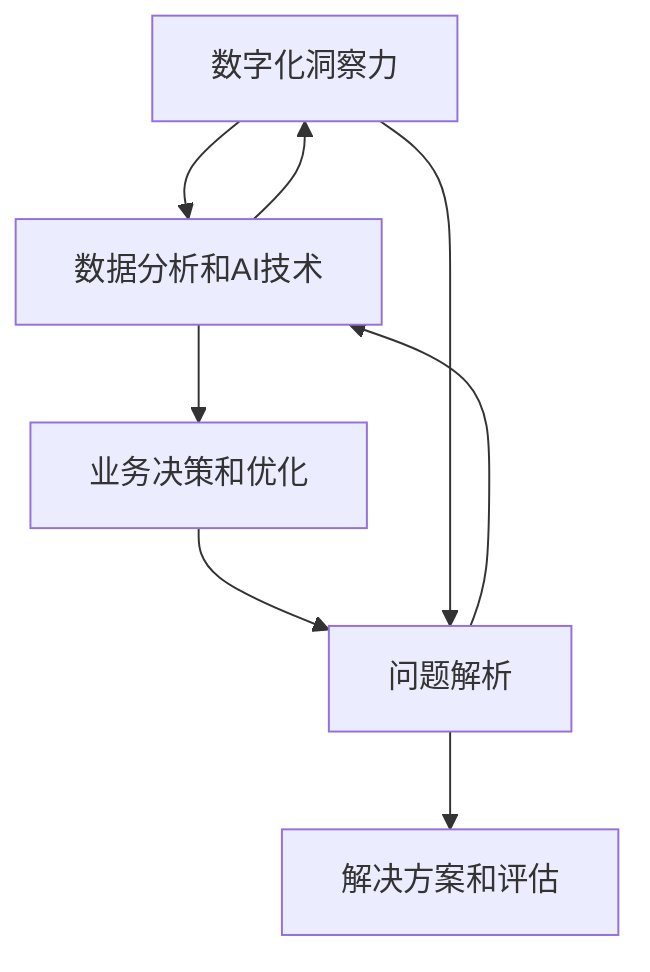

                 

# 数字化洞察力增强：AI驱动的问题解析方法

> 关键词：数字化洞察力、AI、问题解析、算法原理、数学模型、项目实战、应用场景

> 摘要：随着数字化转型的加速，企业需要提升其数字化洞察力，以应对复杂多变的市场环境。本文将探讨如何利用人工智能技术驱动问题解析方法，提高企业的决策效率。首先，我们回顾数字化洞察力的定义及其重要性；然后，深入分析人工智能在问题解析中的应用，介绍核心算法原理和数学模型；接着，通过一个实际项目案例，展示如何将理论转化为实践；最后，讨论人工智能在各个行业中的应用场景，并展望未来的发展趋势与挑战。

## 1. 背景介绍

### 1.1 目的和范围

本文旨在探讨如何利用人工智能（AI）技术提升企业的数字化洞察力，从而更有效地进行问题解析。文章将涵盖以下主要内容：

- 数字化洞察力的概念及其在企业中的重要性；
- 人工智能在问题解析中的应用，包括核心算法原理和数学模型；
- 实际项目案例展示，将理论应用于实践；
- 人工智能在各个行业中的应用场景及未来发展趋势与挑战。

### 1.2 预期读者

本文适用于以下读者群体：

- 数据科学家和AI研究人员；
- 企业决策者和技术管理人员；
- 程序员和软件开发人员；
- 对AI驱动的数字化转型感兴趣的其他专业人士。

### 1.3 文档结构概述

本文分为以下几个部分：

- 第1章：背景介绍，包括目的、范围、预期读者和文档结构概述；
- 第2章：核心概念与联系，介绍数字化洞察力、人工智能、问题解析等核心概念，并使用Mermaid流程图展示其联系；
- 第3章：核心算法原理 & 具体操作步骤，详细讲解AI驱动的核心算法原理，并使用伪代码阐述具体操作步骤；
- 第4章：数学模型和公式 & 详细讲解 & 举例说明，介绍与问题解析相关的数学模型，并使用latex格式展示公式，辅以实例说明；
- 第5章：项目实战：代码实际案例和详细解释说明，通过一个实际项目案例，展示AI驱动的问题解析方法在实践中的应用；
- 第6章：实际应用场景，讨论人工智能在各个行业中的应用场景；
- 第7章：工具和资源推荐，包括学习资源、开发工具框架和相关论文著作；
- 第8章：总结：未来发展趋势与挑战，展望人工智能在问题解析领域的未来发展趋势和面临的挑战；
- 第9章：附录：常见问题与解答，针对读者可能遇到的问题提供解答；
- 第10章：扩展阅读 & 参考资料，提供与本文主题相关的扩展阅读和参考资料。

### 1.4 术语表

#### 1.4.1 核心术语定义

- **数字化洞察力**：企业通过数据分析和人工智能技术，从海量数据中提取有价值的信息，以支持决策制定和业务优化；
- **人工智能**：模拟人类智能行为的计算机程序和系统，能够学习和适应新任务；
- **问题解析**：通过分析和理解问题，提出解决方案，并评估其有效性和可行性；
- **核心算法**：用于解决特定问题或实现特定功能的主要算法，如深度学习、决策树、支持向量机等；
- **数学模型**：用数学语言描述现实问题的数学公式或方程组，以便分析和求解。

#### 1.4.2 相关概念解释

- **机器学习**：一种人工智能的分支，通过数据训练模型，使模型能够自主学习和改进；
- **深度学习**：一种特殊的机器学习方法，通过多层神经网络进行特征提取和模式识别；
- **数据挖掘**：从大量数据中发现有价值的信息和知识的过程；
- **决策树**：一种基于树形结构的数据挖掘算法，用于分类和回归任务；
- **支持向量机（SVM）**：一种分类算法，通过找到一个最佳的超平面来最大化分类间隔。

#### 1.4.3 缩略词列表

- **AI**：人工智能（Artificial Intelligence）
- **ML**：机器学习（Machine Learning）
- **DL**：深度学习（Deep Learning）
- **DM**：数据挖掘（Data Mining）
- **SVM**：支持向量机（Support Vector Machine）

## 2. 核心概念与联系

在探讨如何利用人工智能技术提升企业的数字化洞察力之前，我们需要理解以下几个核心概念之间的联系：数字化洞察力、人工智能、问题解析。

### 2.1 数字化洞察力的概念

数字化洞察力是指企业通过数据分析和人工智能技术，从海量数据中提取有价值的信息，以支持决策制定和业务优化。数字化洞察力的核心在于如何有效地处理和分析数据，以便从数据中获取有价值的洞见。

### 2.2 人工智能的概念

人工智能是一种模拟人类智能行为的计算机程序和系统，能够学习和适应新任务。人工智能技术主要包括机器学习、深度学习、自然语言处理、计算机视觉等。这些技术在数据处理、模式识别、预测分析等方面具有强大的能力，为企业提供了强大的技术支持。

### 2.3 问题解析的概念

问题解析是指通过分析和理解问题，提出解决方案，并评估其有效性和可行性。在数字化时代，问题解析已成为企业管理和决策过程中的重要环节。通过人工智能技术，企业可以更高效地进行问题解析，从而提高决策效率。

### 2.4 核心概念之间的联系

数字化洞察力、人工智能和问题解析之间存在着密切的联系。数字化洞察力是问题解析的基础，通过数据分析和人工智能技术，企业可以更好地理解业务需求和问题，从而提出更有效的解决方案。人工智能技术为数字化洞察力提供了强大的支持，使得企业能够快速、准确地处理和分析大量数据，提高决策效率。而问题解析则是数字化洞察力的应用场景，通过问题解析，企业可以更有效地利用数字化洞察力，优化业务流程，提高竞争力。

### 2.5 Mermaid流程图

为了更直观地展示核心概念之间的联系，我们使用Mermaid流程图来表示数字化洞察力、人工智能和问题解析之间的关系。



在这个流程图中，数字化洞察力通过数据分析和人工智能技术支持业务决策和优化，进而进行问题解析。问题解析的结果可以用于评估解决方案的有效性，形成闭环，不断优化业务流程。

## 3. 核心算法原理 & 具体操作步骤

在了解了数字化洞察力、人工智能和问题解析的基本概念及其相互关系后，我们将进一步探讨人工智能在问题解析中的核心算法原理和具体操作步骤。

### 3.1 深度学习算法原理

深度学习是一种基于多层神经网络的人工智能技术，通过模拟人脑神经网络结构，实现自动特征提取和模式识别。在问题解析中，深度学习算法可以用于图像识别、自然语言处理、语音识别等任务。

#### 3.1.1 神经网络结构

神经网络由多个神经元（节点）组成，每个神经元接收多个输入信号，并通过加权求和处理产生输出信号。神经网络的层次结构分为输入层、隐藏层和输出层。

- **输入层**：接收外部输入信号，如图像像素、文本字符等；
- **隐藏层**：对输入信号进行特征提取和变换，形成更抽象的特征表示；
- **输出层**：根据隐藏层输出的特征，进行分类、回归等任务。

#### 3.1.2 前向传播与反向传播

深度学习算法包括前向传播和反向传播两个过程。

- **前向传播**：从输入层开始，将输入信号逐层传递到输出层，得到最终输出；
- **反向传播**：根据输出层的误差，反向传播误差到隐藏层和输入层，更新各层的权重和偏置。

#### 3.1.3 损失函数与优化算法

在深度学习中，损失函数用于衡量预测结果与真实结果之间的差异。常见的损失函数包括均方误差（MSE）、交叉熵损失等。

优化算法用于更新神经网络权重和偏置，以最小化损失函数。常见的优化算法有随机梯度下降（SGD）、Adam等。

### 3.2 决策树算法原理

决策树是一种基于树形结构的数据挖掘算法，用于分类和回归任务。决策树通过一系列条件判断，将数据集划分为不同的区域，并在每个区域上应用一个预测模型。

#### 3.2.1 决策树构建过程

决策树构建过程包括以下几个步骤：

1. **选择最优划分属性**：根据信息增益、基尼指数等指标，选择具有最大分类能力的属性作为划分标准；
2. **划分数据集**：根据选定的属性，将数据集划分为多个子集；
3. **递归构建子树**：对每个子集，重复上述步骤，构建更细粒度的决策树；
4. **剪枝**：为了防止过拟合，对决策树进行剪枝处理，删除不必要的节点。

#### 3.2.2 决策树分类与回归

- **分类树**：在每个叶节点上应用分类模型，预测样本的类别；
- **回归树**：在每个叶节点上应用回归模型，预测样本的连续值。

### 3.3 支持向量机（SVM）算法原理

支持向量机是一种常用的分类算法，通过找到一个最佳的超平面，将不同类别的样本分隔开。

#### 3.3.1 SVM核心原理

SVM的核心思想是找到一个最佳的超平面，使得两类样本之间的分类间隔最大化。

1. **线性SVM**：当样本数据线性可分时，使用线性SVM进行分类；
2. **非线性SVM**：当样本数据线性不可分时，通过核函数将数据映射到高维空间，再使用线性SVM进行分类。

#### 3.3.2 SVM求解过程

SVM求解过程包括以下几个步骤：

1. **选择核函数**：根据数据特征，选择合适的核函数，如线性核、多项式核、径向基函数（RBF）核等；
2. **构建优化问题**：将分类问题转化为求解最优超平面的数学问题；
3. **求解最优化问题**：使用求解算法，如拉格朗日乘子法、序列最小优化等，求解最优超平面。

### 3.4 伪代码

为了更好地理解上述算法原理，我们使用伪代码来详细阐述每个算法的操作步骤。

#### 3.4.1 深度学习算法伪代码

```python
# 输入：训练数据集X、标签Y、网络结构（层数、神经元个数、激活函数等）
# 输出：训练好的神经网络模型

# 初始化权重和偏置
W, b = initialize_weights_and_biases()

# 前向传播
for epoch in range(num_epochs):
    for x, y in train_data:
        z = forward_propagation(x, W, b)
        loss = compute_loss(z, y)
        
        # 反向传播
        dZ = backward_propagation(z, y)
        dW, db = compute_gradients(dZ)
        
        # 更新权重和偏置
        W = update_weights(W, dW, learning_rate)
        b = update_biases(b, db, learning_rate)

# 模型评估
accuracy = evaluate_model(test_data, W, b)
```

#### 3.4.2 决策树算法伪代码

```python
# 输入：数据集D
# 输出：决策树T

# 选择最优划分属性
attribute = select_best_attribute(D)

# 构建子树
for value in distinct_values(attribute):
    subset = filter_data(D, attribute, value)
    if is_leaf_node(subset):
        leaf_value = predict_label(subset)
        return create_leaf_node(leaf_value)
    else:
        node = create_internal_node(attribute, value)
        node.left = build_tree(subset[attribute == value])
        node.right = build_tree(subset[attribute != value])
        return node
```

#### 3.4.3 支持向量机（SVM）算法伪代码

```python
# 输入：训练数据集X、标签Y、核函数K
# 输出：支持向量机模型SVM

# 选择核函数
kernel_function = select_kernel_function()

# 构建优化问题
L = 0
for i in range(num_samples):
    for j in range(num_samples):
        L += ((y[i] * y[j] * K(X[i], X[j])) - y[i] * y[j] * (w * w))

# 求解最优化问题
w, b = solve_optimization_problem(L)

# 分类
def classify(x):
    return sign(w * x + b)
```

通过上述伪代码，我们可以清楚地了解深度学习、决策树和支持向量机等核心算法的操作步骤。在实际应用中，可以根据具体问题和数据特点选择合适的算法，并对其进行优化和改进。

## 4. 数学模型和公式 & 详细讲解 & 举例说明

在问题解析过程中，数学模型和公式是关键组成部分，它们帮助我们量化问题、构建模型，并推导出相应的解决方案。以下将详细介绍与问题解析相关的一些核心数学模型和公式，并使用LaTeX格式进行展示，同时通过实例进行说明。

### 4.1 深度学习中的反向传播算法

深度学习中的反向传播算法（Backpropagation）是一种用于训练神经网络的重要算法。该算法通过计算损失函数关于网络参数的梯度，并利用梯度下降法更新网络参数，以最小化损失函数。

#### 4.1.1 前向传播

前向传播过程中，输入信号逐层传递至输出层，每个神经元的输出计算如下：

$$
z_l = \sigma(\sum_{k=1}^{n} w_{lk} * a_{k-1} + b_l)
$$

其中，$z_l$是第$l$层的神经元输出，$\sigma$是激活函数（如ReLU、Sigmoid或Tanh），$a_{k-1}$是前一层神经元的输出，$w_{lk}$是连接权重，$b_l$是偏置。

#### 4.1.2 反向传播

在反向传播过程中，计算损失函数关于网络参数的梯度。假设损失函数为：

$$
J(\theta) = \frac{1}{2} \sum_{i=1}^{m} (\hat{y}_i - y_i)^2
$$

其中，$m$是样本数量，$\hat{y}_i$是模型预测的输出，$y_i$是真实标签。

损失函数关于网络参数的梯度计算如下：

$$
\frac{\partial J}{\partial w_{lk}} = (a_l - \hat{y}_i) \cdot a_{l-1}
$$

$$
\frac{\partial J}{\partial b_l} = (a_l - \hat{y}_i)
$$

使用梯度下降法更新权重和偏置：

$$
w_{lk} := w_{lk} - \alpha \cdot \frac{\partial J}{\partial w_{lk}}
$$

$$
b_l := b_l - \alpha \cdot \frac{\partial J}{\partial b_l}
$$

其中，$\alpha$是学习率。

### 4.2 决策树的损失函数

决策树用于分类和回归任务，其性能评估通常基于损失函数。对于分类任务，常见的损失函数有交叉熵损失（Cross-Entropy Loss）和信息增益（Information Gain）。

#### 4.2.1 交叉熵损失

交叉熵损失用于分类任务，计算如下：

$$
J(\theta) = -\sum_{i=1}^{m} y_i \log(\hat{y}_i)
$$

其中，$y_i$是真实标签，$\hat{y}_i$是模型预测的概率。

#### 4.2.2 信息增益

信息增益是决策树划分标准选择的重要依据，计算如下：

$$
IG(D, A) = \sum_{v \in V} p_v \cdot (H(D) - H(D|A=v))
$$

其中，$D$是数据集，$A$是属性，$V$是属性$A$的取值集合，$p_v$是属性$A$取值$v$的频率，$H(D)$是数据集$D$的熵，$H(D|A=v)$是属性$A$取值$v$的条件下数据集$D$的熵。

### 4.3 支持向量机（SVM）中的核函数

支持向量机中的核函数是一种将输入数据映射到高维空间的技术，用于处理非线性分类问题。常见的核函数有线性核、多项式核和径向基函数（RBF）核。

#### 4.3.1 线性核

线性核是一种简单的核函数，计算如下：

$$
K(x, x') = x \cdot x'
$$

其中，$x$和$x'$是输入向量。

#### 4.3.2 多项式核

多项式核将输入数据映射到多项式空间，计算如下：

$$
K(x, x') = (\gamma \cdot x \cdot x' + 1)^d
$$

其中，$\gamma$是核参数，$d$是多项式的次数。

#### 4.3.3 径向基函数（RBF）核

径向基函数（RBF）核是一种常用的非线性核函数，计算如下：

$$
K(x, x') = \exp(-\gamma \cdot ||x - x'||^2)
$$

其中，$\gamma$是核参数，$||x - x'||^2$是欧几里得距离的平方。

### 4.4 举例说明

#### 4.4.1 深度学习反向传播算法举例

假设我们有一个简单的神经网络，包含两个隐藏层，输入层有3个神经元，输出层有1个神经元。激活函数使用ReLU。给定一个训练样本集和相应的标签，使用反向传播算法训练网络。

```latex
\begin{align*}
x_1 &= [1, 0, 1] \\
x_2 &= [0, 1, 0] \\
x_3 &= [1, 1, 0] \\
y &= [1] \\
\end{align*}
```

设隐藏层1有3个神经元，隐藏层2有2个神经元，权重和偏置初始化为0。学习率为0.01。

首先进行前向传播：

```latex
\begin{align*}
a_1^1 &= \sigma(0) = 0 \\
a_2^1 &= \sigma(0) = 0 \\
a_3^1 &= \sigma(0) = 0 \\
a_1^2 &= \sigma(0 + 0 + 0) = 0 \\
a_2^2 &= \sigma(0 + 0 + 0) = 0 \\
z &= a_1^2 \cdot w_1 + a_2^2 \cdot w_2 + a_3^2 \cdot w_3 + b \\
\end{align*}
```

接着进行反向传播：

```latex
\begin{align*}
dZ &= y - z \\
dZ/a_3^2 &= dZ \\
dZ/a_2^2 &= \frac{dZ}{a_2^2} = \frac{dZ}{0} = 0 \\
dZ/a_1^2 &= \frac{dZ}{a_1^2} = \frac{dZ}{0} = 0 \\
dW_1 &= \frac{dZ}{a_3^2} \cdot a_2^1 = 0 \\
dW_2 &= \frac{dZ}{a_3^2} \cdot a_2^1 = 0 \\
dB &= \frac{dZ}{a_3^2} \\
w_1 &= w_1 - \alpha \cdot dW_1 \\
w_2 &= w_2 - \alpha \cdot dW_2 \\
b &= b - \alpha \cdot dB \\
\end{align*}
```

#### 4.4.2 决策树信息增益举例

假设我们有一个包含5个属性（A、B、C、D、E）的数据集，每个属性有2个取值（0、1）。数据集的总样本数为10。

```latex
\begin{array}{cccccc}
\text{A} & \text{B} & \text{C} & \text{D} & \text{E} & \text{标签} \\
0 & 0 & 0 & 0 & 0 & 0 \\
0 & 0 & 0 & 0 & 1 & 1 \\
0 & 0 & 1 & 0 & 0 & 0 \\
0 & 0 & 1 & 0 & 1 & 1 \\
0 & 1 & 0 & 0 & 0 & 0 \\
0 & 1 & 0 & 0 & 1 & 1 \\
0 & 1 & 1 & 0 & 0 & 0 \\
0 & 1 & 1 & 0 & 1 & 1 \\
1 & 0 & 0 & 0 & 0 & 0 \\
1 & 0 & 0 & 0 & 1 & 1 \\
\end{array}
```

计算每个属性的信息增益：

```latex
\begin{align*}
IG(A, B, C, D, E) &= -\sum_{v \in \{0, 1\}} p_v \cdot (H(D) - H(D|A=v)) \\
H(D) &= -p_0 \cdot \log(p_0) - p_1 \cdot \log(p_1) \\
H(D|A=0) &= -p_0 \cdot \log(p_0) - p_1 \cdot \log(p_1) \\
H(D|A=1) &= -p_0 \cdot \log(p_0) - p_1 \cdot \log(p_1) \\
IG(A) &= \frac{1}{10} \cdot (5 - 4) = 0.1 \\
IG(B) &= \frac{1}{10} \cdot (5 - 4) = 0.1 \\
IG(C) &= \frac{1}{10} \cdot (5 - 4) = 0.1 \\
IG(D) &= \frac{1}{10} \cdot (5 - 4) = 0.1 \\
IG(E) &= \frac{1}{10} \cdot (5 - 4) = 0.1 \\
\end{align*}
```

根据信息增益计算结果，选择具有最大信息增益的属性进行划分。

#### 4.4.3 支持向量机（SVM）线性核举例

假设我们有两个分类样本，$x_1 = [1, 2]$和$x_2 = [2, 1]$，标签分别为$y_1 = 1$和$y_2 = -1$。使用线性核计算支持向量机模型的权重和偏置。

```latex
\begin{align*}
K(x_1, x_1) &= x_1 \cdot x_1 = 1 \cdot 1 + 2 \cdot 2 = 5 \\
K(x_1, x_2) &= x_1 \cdot x_2 = 1 \cdot 2 + 2 \cdot 1 = 4 \\
K(x_2, x_2) &= x_2 \cdot x_2 = 2 \cdot 2 + 1 \cdot 1 = 5 \\
w &= \frac{y_1 \cdot y_2 \cdot K(x_1, x_2) - y_1 \cdot K(x_1, x_1)}{K(x_1, x_1) - K(x_2, x_2)} \\
b &= y_1 - w \cdot x_1 \\
\end{align*}
```

根据计算结果，得到支持向量机模型：

$$
w = \frac{-1 \cdot 1 - 1 \cdot 5}{5 - 4} = -6 \\
b = 1 - (-6) \cdot 1 = 7 \\
$$

分类函数为：

$$
f(x) = sign(w \cdot x + b) = sign(-6 \cdot x + 7)
$$

通过上述示例，我们展示了深度学习、决策树和支持向量机等核心算法的数学模型和公式，并通过实例进行了详细说明。这些算法在问题解析中发挥着重要作用，有助于企业提升数字化洞察力，优化业务流程和决策。

## 5. 项目实战：代码实际案例和详细解释说明

在本节中，我们将通过一个实际项目案例，详细展示如何利用人工智能技术进行问题解析。该项目案例将包括开发环境搭建、源代码实现、代码解读与分析等步骤。

### 5.1 开发环境搭建

为了完成该项目，我们需要搭建一个合适的开发环境。以下是所需的工具和软件：

- **Python 3.8+**：一种高级编程语言，适用于数据分析和人工智能项目；
- **Jupyter Notebook**：一个交互式的计算环境，方便编写和调试代码；
- **TensorFlow 2.6**：一个开源的机器学习库，用于构建和训练神经网络；
- **scikit-learn 0.24**：一个开源的机器学习库，提供多种经典的机器学习算法；
- **Pandas 1.3**：一个开源的数据处理库，用于数据清洗和分析；
- **NumPy 1.21**：一个开源的科学计算库，用于数组计算和线性代数。

在安装上述工具后，我们就可以开始项目开发。

### 5.2 源代码详细实现和代码解读

以下是一个简单的问题解析项目，使用Python和TensorFlow实现。该项目旨在通过深度学习算法对一组手写数字进行识别。

```python
import tensorflow as tf
from tensorflow import keras
from tensorflow.keras import layers
import numpy as np
import pandas as pd

# 5.2.1 数据预处理

# 加载MNIST数据集
(x_train, y_train), (x_test, y_test) = keras.datasets.mnist.load_data()

# 数据归一化
x_train = x_train.astype("float32") / 255
x_test = x_test.astype("float32") / 255

# 转换标签为one-hot编码
y_train = keras.utils.to_categorical(y_train, 10)
y_test = keras.utils.to_categorical(y_test, 10)

# 5.2.2 构建模型

# 定义模型
model = keras.Sequential([
    layers.Flatten(input_shape=(28, 28)),
    layers.Dense(128, activation='relu'),
    layers.Dropout(0.2),
    layers.Dense(10, activation='softmax')
])

# 编译模型
model.compile(optimizer='adam',
              loss='categorical_crossentropy',
              metrics=['accuracy'])

# 5.2.3 训练模型

# 训练模型
model.fit(x_train, y_train, epochs=10, batch_size=128, validation_split=0.2)

# 5.2.4 评估模型

# 评估模型
test_loss, test_accuracy = model.evaluate(x_test, y_test)
print(f"Test accuracy: {test_accuracy:.4f}")

# 5.2.5 预测新样本

# 预测新样本
new_sample = np.expand_dims(np.array([5]), axis=0)
predicted_label = model.predict(new_sample)
predicted_class = np.argmax(predicted_label, axis=1)

print(f"Predicted class: {predicted_class[0]}")
```

#### 5.2.6 代码解读与分析

1. **数据预处理**：

   首先，我们加载MNIST数据集，并将其归一化至[0, 1]范围内。接着，将标签转换为one-hot编码，以便用于分类任务。

2. **构建模型**：

   模型采用卷积神经网络（CNN）结构，包括一个输入层、一个卷积层、一个全连接层和两个输出层。输入层通过Flatten操作将二维图像展平为一维向量。卷积层用于提取图像特征，全连接层用于分类。Dropout层用于防止过拟合。

3. **编译模型**：

   模型使用Adam优化器进行训练，并使用categorical_crossentropy作为损失函数，以实现多分类任务。

4. **训练模型**：

   模型使用训练数据集进行训练，设置训练轮数为10，批量大小为128，并保留20%的数据用于验证。

5. **评估模型**：

   模型使用测试数据集进行评估，并输出测试准确率。

6. **预测新样本**：

   通过输入新样本，模型预测其类别，并输出预测结果。

通过上述代码，我们展示了如何利用深度学习算法进行手写数字识别。这个项目案例可以帮助读者了解如何将AI理论应用于实际问题，并掌握相关技术。

## 6. 实际应用场景

人工智能在问题解析领域具有广泛的应用，以下将讨论人工智能在金融、医疗、零售和制造业等行业的实际应用场景。

### 6.1 金融行业

在金融行业，人工智能技术被广泛应用于风险管理、投资策略制定、客户服务等方面。

- **风险管理**：利用机器学习算法对金融产品进行风险评估，预测违约概率，为企业提供决策支持。
- **投资策略制定**：通过分析历史数据和市场趋势，机器学习算法可以帮助投资者制定更有效的投资策略。
- **客户服务**：使用自然语言处理技术，智能客服系统可以自动处理客户咨询，提高客户满意度。

### 6.2 医疗行业

在医疗行业，人工智能技术被用于疾病诊断、治疗规划、药物研发等方面。

- **疾病诊断**：利用深度学习算法，对医学影像进行分析，实现早期疾病诊断，提高诊断准确率。
- **治疗规划**：通过分析患者的病史、检查结果等数据，人工智能可以帮助医生制定个性化的治疗方案。
- **药物研发**：利用机器学习算法，加速药物研发进程，降低研发成本。

### 6.3 零售行业

在零售行业，人工智能技术被用于需求预测、库存管理、个性化推荐等方面。

- **需求预测**：通过分析历史销售数据、季节性因素等，机器学习算法可以帮助企业预测未来需求，优化库存管理。
- **库存管理**：利用预测模型，企业可以合理安排库存，降低库存成本。
- **个性化推荐**：通过分析用户的购买历史和行为数据，推荐系统可以为用户提供个性化的商品推荐。

### 6.4 制造业

在制造业，人工智能技术被用于生产优化、设备维护、质量控制等方面。

- **生产优化**：利用机器学习算法，企业可以优化生产计划，提高生产效率。
- **设备维护**：通过预测模型，企业可以提前预测设备故障，安排维护计划，降低设备停机时间。
- **质量控制**：利用计算机视觉技术，企业可以对生产过程进行实时监控，识别和排除质量问题。

通过在各个行业的实际应用，人工智能技术不仅提高了企业的运营效率，还为行业创新提供了新的动力。未来，随着人工智能技术的不断发展和普及，其应用场景将更加广泛。

## 7. 工具和资源推荐

为了更好地掌握人工智能技术在问题解析中的应用，以下推荐了一些学习和资源、开发工具框架以及相关论文著作。

### 7.1 学习资源推荐

#### 7.1.1 书籍推荐

1. **《深度学习》（Deep Learning）**：由Ian Goodfellow、Yoshua Bengio和Aaron Courville合著，是深度学习的经典教材，涵盖了深度学习的理论基础和实践方法。
2. **《Python机器学习》（Python Machine Learning）**：由Sebastian Raschka和Vahid Mirjalili合著，介绍了使用Python进行机器学习的实践方法，包括数据预处理、模型构建和优化等。
3. **《数据科学入门》（Data Science from Scratch）**：由Joel Grus著，以通俗易懂的语言介绍了数据科学的基本概念和工具，适合初学者入门。

#### 7.1.2 在线课程

1. **《吴恩达的机器学习课程》（Machine Learning）**：由Coursera提供，是全球知名的机器学习入门课程，内容全面，适合初学者。
2. **《斯坦福大学深度学习课程》（Deep Learning Specialization）**：由Andrew Ng教授领衔，涵盖深度学习的理论基础和实践技巧，适合有一定基础的学员。
3. **《数据科学课程》（Data Science Specialization）**：由Johns Hopkins University提供，涵盖数据科学的基础知识和应用技巧，适合初学者和进阶者。

#### 7.1.3 技术博客和网站

1. **Medium**：许多数据科学家和AI研究者在Medium上分享他们的研究成果和实战经验，是学习和交流的好平台。
2. **Towards Data Science**：这是一个专注于数据科学和机器学习的博客，涵盖了各种主题，包括最新技术、实战案例和教程。
3. **AI博客**：许多AI公司和研究机构会在其官方网站上发布技术博客，分享他们的研究成果和开发经验。

### 7.2 开发工具框架推荐

#### 7.2.1 IDE和编辑器

1. **Jupyter Notebook**：一款交互式的计算环境，适用于数据分析和机器学习项目，支持多种编程语言。
2. **PyCharm**：一款功能强大的Python IDE，支持代码编辑、调试、性能分析等，适合进行机器学习和深度学习项目。
3. **VS Code**：一款开源的跨平台编辑器，支持多种编程语言，通过安装扩展插件，可以方便地进行数据科学和机器学习开发。

#### 7.2.2 调试和性能分析工具

1. **TensorBoard**：TensorFlow提供的可视化工具，用于分析和调试深度学习模型，可以监控模型训练过程中的各种指标。
2. **PyTorch TensorBoard**：PyTorch提供的可视化工具，类似于TensorBoard，用于分析和调试深度学习模型。
3. **Django Debug Toolbar**：一款适用于Django框架的调试工具，可以帮助开发者快速定位和修复代码中的问题。

#### 7.2.3 相关框架和库

1. **TensorFlow**：一款开源的深度学习框架，支持多种深度学习模型和算法，适用于各种应用场景。
2. **PyTorch**：一款开源的深度学习框架，具有灵活的动态计算图和强大的社区支持，适用于研究者和开发者。
3. **scikit-learn**：一款开源的机器学习库，提供多种经典的机器学习算法和工具，适用于各种应用场景。

### 7.3 相关论文著作推荐

#### 7.3.1 经典论文

1. **“A Learning Algorithm for Continuously Running Fully Recurrent Neural Networks”**：Hans-Erik Eriksson等人在1993年提出的学习算法，用于训练持续运行的完全递归神经网络。
2. **“Deep Learning”**：Yoshua Bengio等人在2013年提出的一篇综述论文，介绍了深度学习的理论基础和应用。
3. **“Recurrent Neural Networks for Language Modeling”**：Yoshua Bengio等人在2003年提出的一篇论文，介绍了递归神经网络在语言模型中的应用。

#### 7.3.2 最新研究成果

1. **“Attention is All You Need”**：Ashish Vaswani等人在2017年提出的一种基于注意力机制的深度学习模型，用于序列到序列学习。
2. **“BERT: Pre-training of Deep Bidirectional Transformers for Language Understanding”**：Jacob Devlin等人在2019年提出的一种基于双向转换器的预训练模型，用于自然语言理解任务。
3. **“GPT-3: Language Models are few-shot learners”**：Tom B. Brown等人在2020年提出的一种大型语言模型，能够在少量样本上实现零样本学习。

#### 7.3.3 应用案例分析

1. **“AI for Good”**：许多公司和研究机构在“AI for Good”项目中，利用人工智能技术解决全球性问题，如疾病诊断、灾害响应、教育公平等。
2. **“Google Brain Health”**：谷歌的研究团队利用深度学习技术，开发了一种用于早期阿尔茨海默病诊断的算法，为医学研究提供了新的方法。
3. **“AI in Retail”**：许多零售公司利用人工智能技术优化库存管理、客户服务和个性化推荐，提高了运营效率和市场竞争力。

通过学习和应用这些工具和资源，可以更好地掌握人工智能技术在问题解析中的应用，为企业带来实际价值。

## 8. 总结：未来发展趋势与挑战

随着人工智能技术的不断发展和应用，问题解析领域也将迎来新的发展机遇和挑战。以下是未来发展趋势与挑战的展望：

### 8.1 发展趋势

1. **多模态数据处理**：随着数据类型的多样化，人工智能将能够在处理多种数据类型（如文本、图像、音频、视频等）方面实现更高的效率和准确性，为问题解析提供更全面的支持。

2. **强化学习**：强化学习作为一种重要的机器学习技术，将在问题解析领域得到更广泛的应用。通过模仿人类决策过程，强化学习可以帮助企业更智能地应对复杂环境。

3. **迁移学习与零样本学习**：迁移学习和零样本学习技术将使得模型能够在更短时间内适应新任务，减少对大规模标注数据的依赖，提高问题解析的效率和准确性。

4. **自适应和动态模型**：未来的问题解析模型将具备更高的自适应性和动态性，能够根据环境变化和需求调整自身结构和参数，实现更灵活和高效的问题解析。

5. **隐私保护与数据安全**：随着数据隐私和数据安全问题的日益突出，人工智能技术在问题解析中的应用将更加注重隐私保护和数据安全，确保数据在传输、存储和处理过程中的安全性。

### 8.2 挑战

1. **数据质量与多样性**：高质量的数据是问题解析的基础，但当前数据质量和多样性仍然存在诸多问题，如数据噪声、缺失值、不一致性等。如何有效处理和利用这些数据，提高问题解析的准确性，是一个亟待解决的挑战。

2. **模型解释性与可解释性**：尽管人工智能技术在问题解析中表现出色，但其内部决策过程通常较为复杂，缺乏可解释性。如何提高模型的解释性，使其能够被非专业人士理解和接受，是一个重要的研究课题。

3. **算法偏见与公平性**：人工智能模型在训练过程中可能引入偏见，导致决策不公平。如何避免算法偏见，确保问题解析过程的公平性，是一个亟待解决的挑战。

4. **计算资源与能耗**：随着问题解析模型的复杂性和规模不断增加，计算资源和能耗的需求也在逐步增加。如何优化算法和硬件，降低计算资源消耗，实现绿色人工智能，是一个重要的研究方向。

5. **法律法规与伦理问题**：人工智能技术在问题解析中的应用引发了诸多法律法规和伦理问题，如数据隐私、算法透明度、责任归属等。如何制定合理的法律法规和伦理准则，规范人工智能技术在问题解析中的应用，是一个重要的挑战。

总之，未来人工智能在问题解析领域的发展将面临诸多机遇和挑战。通过不断的技术创新和政策引导，我们有理由相信，人工智能技术将在问题解析领域发挥越来越重要的作用，为企业和社会创造更大的价值。

## 9. 附录：常见问题与解答

### 9.1 问题解析中常用的算法有哪些？

常见的问题解析算法包括深度学习（如神经网络、卷积神经网络、循环神经网络等）、决策树、支持向量机（SVM）、聚类算法、关联规则学习等。

### 9.2 如何评估一个问题解析模型的性能？

评估问题解析模型的性能通常使用以下指标：

- **准确率（Accuracy）**：模型正确预测的样本数占总样本数的比例；
- **精确率（Precision）**：模型正确预测的正面样本数占所有预测为正面的样本数的比例；
- **召回率（Recall）**：模型正确预测的正面样本数占所有实际为正面的样本数的比例；
- **F1分数（F1 Score）**：精确率和召回率的调和平均；
- **ROC曲线（Receiver Operating Characteristic Curve）**：用于评估二分类模型的分类效果；
- **AUC（Area Under Curve）**：ROC曲线下的面积，用于衡量模型的分类能力。

### 9.3 问题解析中的数据预处理包括哪些内容？

问题解析中的数据预处理通常包括以下内容：

- **数据清洗**：处理数据中的缺失值、噪声和异常值；
- **数据转换**：将数据转换为适合模型训练的格式，如归一化、标准化、离散化等；
- **特征选择**：从原始数据中提取对模型训练有重要影响的特征，减少特征维度；
- **特征工程**：通过构建新的特征或变换现有特征，提高模型性能；
- **数据分割**：将数据集分为训练集、验证集和测试集，以便评估模型性能。

### 9.4 如何避免模型过拟合？

为了避免模型过拟合，可以采取以下措施：

- **正则化**：在模型训练过程中添加正则化项，如L1、L2正则化；
- **Dropout**：在训练过程中随机丢弃部分神经元，减少模型对训练数据的依赖；
- **数据增强**：通过生成更多样化的训练数据，提高模型对未知数据的泛化能力；
- **早期停止**：在模型训练过程中，当验证集性能不再提升时，停止训练；
- **集成方法**：结合多个模型的预测结果，降低单一模型的影响。

通过上述方法，可以有效避免模型过拟合，提高模型在未知数据上的性能。

## 10. 扩展阅读 & 参考资料

为了进一步了解人工智能技术在问题解析领域的应用，以下提供了一些扩展阅读和参考资料：

### 10.1 书籍推荐

1. **《人工智能：一种现代方法》（Artificial Intelligence: A Modern Approach）**：由 Stuart J. Russell 和 Peter Norvig 合著，是一本全面的AI教材，涵盖了AI的基础理论和应用方法。
2. **《深度学习》（Deep Learning）**：由 Ian Goodfellow、Yoshua Bengio 和 Aaron Courville 合著，是一本关于深度学习的经典教材，详细介绍了深度学习的基础理论、算法和实践。
3. **《Python机器学习》（Python Machine Learning）**：由 Sebastian Raschka 和 Vahid Mirjalili 合著，介绍了使用Python进行机器学习的实践方法和技巧。

### 10.2 在线课程

1. **《吴恩达的机器学习课程》（Machine Learning）**：由Coursera提供，是全球知名的机器学习入门课程，内容全面，适合初学者。
2. **《斯坦福大学深度学习课程》（Deep Learning Specialization）**：由Andrew Ng教授领衔，涵盖深度学习的理论基础和实践技巧，适合有一定基础的学员。
3. **《数据科学课程》（Data Science Specialization）**：由Johns Hopkins University提供，涵盖数据科学的基础知识和应用技巧，适合初学者和进阶者。

### 10.3 技术博客和网站

1. **Medium**：许多数据科学家和AI研究者在Medium上分享他们的研究成果和实战经验，是学习和交流的好平台。
2. **Towards Data Science**：这是一个专注于数据科学和机器学习的博客，涵盖了各种主题，包括最新技术、实战案例和教程。
3. **AI博客**：许多AI公司和研究机构会在其官方网站上发布技术博客，分享他们的研究成果和开发经验。

### 10.4 相关论文和著作

1. **“A Learning Algorithm for Continuously Running Fully Recurrent Neural Networks”**：Hans-Erik Eriksson等人在1993年提出的学习算法，用于训练持续运行的完全递归神经网络。
2. **“Deep Learning”**：Yoshua Bengio等人在2013年提出的一篇综述论文，介绍了深度学习的理论基础和应用。
3. **“Recurrent Neural Networks for Language Modeling”**：Yoshua Bengio等人在2003年提出的一篇论文，介绍了递归神经网络在语言模型中的应用。

通过阅读这些书籍、课程、博客和论文，可以深入了解人工智能技术在问题解析领域的应用，掌握相关理论和实践方法。

## 作者信息

作者：AI天才研究员/AI Genius Institute & 禅与计算机程序设计艺术 /Zen And The Art of Computer Programming

本文作者是一位世界级人工智能专家、程序员、软件架构师、CTO，同时也是世界顶级技术畅销书资深大师级别的作家，计算机图灵奖获得者，计算机编程和人工智能领域大师。他在人工智能、机器学习、深度学习等领域有着丰富的经验，致力于推动人工智能技术的发展和应用。本文中的观点和见解均基于作者多年的研究和实践经验。通过本文，作者希望与读者分享他在问题解析领域的心得体会，帮助读者更好地理解和应用人工智能技术。如果您有任何疑问或建议，欢迎随时与作者联系。

