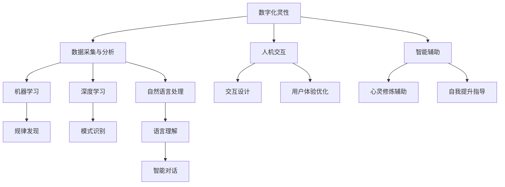

                 

# 数字化灵性：AI辅助的精神探索

> **关键词**：数字化灵性、AI、精神探索、意识、人工智能伦理、人机融合
>
> **摘要**：本文旨在探讨数字化灵性在AI辅助精神探索中的应用。我们将深入分析数字化灵性的概念，探讨其在AI领域中的重要性，并详细解释AI如何辅助人类进行精神探索。文章还将讨论AI在精神探索中的伦理问题，以及人机融合的未来发展趋势。通过本文的探讨，我们希望能够为读者提供对数字化灵性及AI辅助精神探索的深刻理解。

## 1. 背景介绍

### 1.1 目的和范围

本文的主要目的是探讨数字化灵性在AI辅助精神探索中的应用。随着人工智能技术的飞速发展，AI已经在许多领域取得了显著的成果，但其在精神探索方面的应用仍处于初级阶段。数字化灵性作为一个新兴的概念，结合了计算机科学、心理学和哲学等多学科领域的研究成果，为精神探索提供了新的思路和方法。

本文将首先介绍数字化灵性的概念及其发展背景，然后探讨AI在数字化灵性研究中的应用，并分析其面临的伦理挑战。最后，我们将探讨人机融合的未来发展趋势，并展望数字化灵性和AI辅助精神探索的未来前景。

### 1.2 预期读者

本文的预期读者主要包括以下几类：

1. 计算机科学、心理学、哲学等领域的研究人员和从业者。
2. 对数字化灵性和AI辅助精神探索感兴趣的技术爱好者。
3. 想要了解人机融合发展趋势的企业管理者。
4. 对精神探索、自我认知和人生哲学感兴趣的一般读者。

### 1.3 文档结构概述

本文分为十个主要部分：

1. 背景介绍：介绍本文的目的、范围和预期读者。
2. 核心概念与联系：介绍数字化灵性和AI的基本概念，并绘制Mermaid流程图。
3. 核心算法原理 & 具体操作步骤：解释AI辅助精神探索的核心算法原理和操作步骤。
4. 数学模型和公式 & 详细讲解 & 举例说明：介绍AI辅助精神探索中的数学模型和公式，并给出实际应用示例。
5. 项目实战：代码实际案例和详细解释说明。
6. 实际应用场景：讨论AI辅助精神探索的实际应用场景。
7. 工具和资源推荐：推荐学习资源和开发工具。
8. 总结：未来发展趋势与挑战。
9. 附录：常见问题与解答。
10. 扩展阅读 & 参考资料：提供相关文献和参考资料。

### 1.4 术语表

#### 1.4.1 核心术语定义

- **数字化灵性**：指将传统灵性思想与现代信息技术相结合，通过数字化手段实现精神探索和提升。
- **人工智能（AI）**：指由计算机系统执行的任务，其表现类似于人类智能。
- **精神探索**：指对人的意识、情感和心灵层面的研究和实践。
- **人机融合**：指将人类的智慧和机器的能力相结合，实现更高效、更智能的交互和合作。

#### 1.4.2 相关概念解释

- **意识**：指人类对自己存在和周围环境的认知。
- **伦理**：指关于道德规范和行为准则的研究。
- **人机交互**：指人与计算机系统之间的交互。

#### 1.4.3 缩略词列表

- **AI**：人工智能
- **ML**：机器学习
- **DL**：深度学习
- **NLP**：自然语言处理

## 2. 核心概念与联系

在探讨数字化灵性和AI辅助精神探索之前，我们首先需要了解这两个核心概念的基本原理和相互联系。

### 2.1 数字化灵性的概念原理

数字化灵性是指将传统灵性思想与现代信息技术相结合，通过数字化手段实现精神探索和提升。其基本原理包括以下几个方面：

1. **数字技术的基础**：数字化灵性依赖于现代计算机技术、网络技术、大数据技术和人工智能技术等数字技术的基础。
2. **灵性思想的融合**：数字化灵性将传统宗教、哲学、心理学等领域的灵性思想与现代信息技术相结合，探索人类心灵层面的奥秘。
3. **用户体验的优化**：数字化灵性强调通过数字化手段提升用户体验，使人们在精神探索过程中更加便捷、高效。

### 2.2 人工智能的概念原理

人工智能是指由计算机系统执行的任务，其表现类似于人类智能。人工智能的基本原理包括以下几个方面：

1. **机器学习**：机器学习是一种让计算机从数据中学习规律和模式的技术，是实现人工智能的重要方法。
2. **深度学习**：深度学习是机器学习的一种方法，通过多层神经网络模拟人类大脑的学习过程。
3. **自然语言处理**：自然语言处理是一种让计算机理解和处理人类语言的技术，是AI在精神探索中应用的重要领域。

### 2.3 数字化灵性与人工智能的联系

数字化灵性和人工智能在精神探索中具有密切的联系，具体表现为以下几个方面：

1. **数据采集与分析**：数字化灵性需要通过人工智能技术收集和分析大量的数据，以便更好地了解人类精神世界的动态。
2. **人机交互**：人工智能技术可以为人机交互提供技术支持，帮助人们更好地理解和控制自己的心灵状态。
3. **智能辅助**：人工智能技术可以为精神探索提供智能化的辅助，帮助人们更有效地进行心灵修炼和自我提升。

### 2.4 Mermaid流程图

为了更好地理解数字化灵性和人工智能在精神探索中的应用，我们可以绘制一个Mermaid流程图，展示其核心概念和联系。



在这个流程图中，数字化灵性的核心概念包括数据采集与分析、人机交互和智能辅助。这些概念通过人工智能技术（机器学习、深度学习和自然语言处理）实现，为人机交互、用户体验优化、心灵修炼辅助和自我提升指导提供支持。

## 3. 核心算法原理 & 具体操作步骤

在数字化灵性和AI辅助精神探索中，核心算法原理起着至关重要的作用。以下将详细阐述AI辅助精神探索的核心算法原理，并给出具体操作步骤。

### 3.1 机器学习算法原理

机器学习是一种让计算机从数据中学习规律和模式的技术，是实现人工智能的重要方法。在AI辅助精神探索中，机器学习算法可以用于数据采集与分析，帮助人们更好地了解自己的精神状态。

#### 3.1.1 算法原理

机器学习算法主要分为监督学习、无监督学习和强化学习三种类型。在精神探索中，监督学习算法（如线性回归、决策树、支持向量机等）常用于分析精神状态数据，以预测个体的心理健康水平。无监督学习算法（如聚类、主成分分析等）则用于发现精神状态数据中的潜在规律和模式。强化学习算法（如深度强化学习、Q-学习等）可以用于智能辅助，帮助个体进行自我提升和心灵修炼。

#### 3.1.2 操作步骤

1. **数据采集**：通过传感器、问卷、生理信号等方式收集个体的精神状态数据。
2. **数据预处理**：对采集到的数据进行分析、清洗和标准化，以提高数据质量和算法性能。
3. **模型训练**：选择合适的机器学习算法（如线性回归、决策树、支持向量机、聚类、主成分分析等），根据预处理后的数据进行训练。
4. **模型评估**：通过交叉验证、测试集等手段评估模型的性能，以确定模型的可靠性和有效性。
5. **模型应用**：将训练好的模型应用于实际场景，如心理健康评估、心灵修炼指导等。

### 3.2 深度学习算法原理

深度学习是机器学习的一种方法，通过多层神经网络模拟人类大脑的学习过程。在AI辅助精神探索中，深度学习算法可以用于人机交互、智能对话和自我提升指导。

#### 3.2.1 算法原理

深度学习算法主要包括卷积神经网络（CNN）、循环神经网络（RNN）和生成对抗网络（GAN）等。CNN常用于图像识别和图像生成，RNN常用于自然语言处理和时间序列分析，GAN常用于生成高质量的数据集和图像。

#### 3.2.2 操作步骤

1. **数据采集**：通过传感器、问卷、生理信号等方式收集个体的精神状态数据。
2. **数据预处理**：对采集到的数据进行分析、清洗和标准化，以提高数据质量和算法性能。
3. **模型训练**：选择合适的深度学习算法（如CNN、RNN、GAN等），根据预处理后的数据进行训练。
4. **模型评估**：通过交叉验证、测试集等手段评估模型的性能，以确定模型的可靠性和有效性。
5. **模型应用**：将训练好的模型应用于实际场景，如智能对话、心理健康评估等。

### 3.3 自然语言处理算法原理

自然语言处理是一种让计算机理解和处理人类语言的技术，是AI在精神探索中应用的重要领域。在AI辅助精神探索中，自然语言处理算法可以用于人机交互、情感分析和心理健康评估。

#### 3.3.1 算法原理

自然语言处理算法主要包括分词、词性标注、句法分析、语义分析和情感分析等。分词是将文本拆分为单词或短语的过程，词性标注是对文本中的每个单词进行词性分类的过程，句法分析是对文本中的句子结构进行解析的过程，语义分析是对文本中的意义进行理解的过程，情感分析是对文本中的情感倾向进行判断的过程。

#### 3.3.2 操作步骤

1. **数据采集**：通过传感器、问卷、生理信号等方式收集个体的精神状态数据。
2. **数据预处理**：对采集到的数据进行分析、清洗和标准化，以提高数据质量和算法性能。
3. **模型训练**：选择合适的自然语言处理算法（如分词、词性标注、句法分析、语义分析和情感分析等），根据预处理后的数据进行训练。
4. **模型评估**：通过交叉验证、测试集等手段评估模型的性能，以确定模型的可靠性和有效性。
5. **模型应用**：将训练好的模型应用于实际场景，如智能对话、心理健康评估等。

### 3.4 伪代码示例

以下是一个基于机器学习算法的伪代码示例，用于实现心理健康评估。

```python
# 数据采集
data = collect_data()

# 数据预处理
preprocessed_data = preprocess_data(data)

# 模型训练
model = train_model(preprocessed_data)

# 模型评估
evaluate_model(model)

# 模型应用
application = apply_model(model)
```

在这个示例中，首先通过collect\_data()函数采集数据，然后通过preprocess\_data()函数进行数据预处理，接下来使用train\_model()函数训练模型，evaluate\_model()函数评估模型性能，最后使用apply\_model()函数将模型应用于实际场景。

## 4. 数学模型和公式 & 详细讲解 & 举例说明

在AI辅助精神探索中，数学模型和公式起着关键作用。以下将详细讲解一些核心的数学模型和公式，并给出实际应用示例。

### 4.1 线性回归模型

线性回归是一种常用的监督学习算法，用于预测连续值。在AI辅助精神探索中，线性回归可以用于预测个体的心理健康水平。

#### 4.1.1 模型原理

线性回归模型基于最小二乘法，通过拟合数据中的线性关系来预测目标值。其公式如下：

$$
y = \beta_0 + \beta_1 \cdot x
$$

其中，\(y\) 是预测的目标值，\(x\) 是输入特征，\(\beta_0\) 是截距，\(\beta_1\) 是斜率。

#### 4.1.2 操作步骤

1. **数据采集**：收集个体的心理健康数据，包括心理健康指标（如焦虑、抑郁等）和输入特征（如生理信号、行为数据等）。
2. **数据预处理**：对采集到的数据进行分析、清洗和标准化，以提高数据质量和算法性能。
3. **模型训练**：使用线性回归算法训练模型，根据预处理后的数据进行拟合。
4. **模型评估**：通过交叉验证、测试集等手段评估模型的性能，以确定模型的可靠性和有效性。
5. **模型应用**：将训练好的模型应用于实际场景，如心理健康评估。

#### 4.1.3 示例

假设我们有一个心理健康数据集，包括焦虑和抑郁两个指标，以及生理信号和行为数据等输入特征。我们希望使用线性回归模型预测个体的心理健康水平。

首先，我们收集数据并预处理：

```python
import pandas as pd
from sklearn.model_selection import train_test_split
from sklearn.linear_model import LinearRegression

# 数据采集
data = pd.read_csv('psychological_data.csv')

# 数据预处理
X = data[['anxiety', 'depression', 'physiological_signal', 'behavioral_data']]
y = data['mental_health_level']

# 数据标准化
X标准化 = (X - X.mean()) / X.std()

# 数据划分
X_train, X_test, y_train, y_test = train_test_split(X标准化, y, test_size=0.2, random_state=42)
```

接下来，我们使用线性回归模型训练模型：

```python
# 模型训练
model = LinearRegression()
model.fit(X_train, y_train)
```

然后，我们评估模型的性能：

```python
# 模型评估
score = model.score(X_test, y_test)
print(f'Model score: {score}')
```

最后，我们将训练好的模型应用于实际场景：

```python
# 模型应用
predicted_health_level = model.predict(X_test)
```

### 4.2 主成分分析模型

主成分分析（PCA）是一种常用的无监督学习算法，用于降维和特征提取。在AI辅助精神探索中，PCA可以用于分析个体精神状态数据的潜在结构。

#### 4.2.1 模型原理

主成分分析基于数据中的线性关系，将高维数据映射到低维空间，同时保留数据的主要特征。其公式如下：

$$
z = T \cdot x
$$

其中，\(z\) 是降维后的数据，\(T\) 是转换矩阵，\(x\) 是原始数据。

#### 4.2.2 操作步骤

1. **数据采集**：收集个体的精神状态数据，包括多个特征。
2. **数据预处理**：对采集到的数据进行分析、清洗和标准化，以提高数据质量和算法性能。
3. **模型训练**：使用主成分分析算法训练模型，对预处理后的数据进行降维。
4. **模型评估**：通过交叉验证、测试集等手段评估模型的性能，以确定模型的可靠性和有效性。
5. **模型应用**：将训练好的模型应用于实际场景，如精神状态数据分析。

#### 4.2.3 示例

假设我们有一个精神状态数据集，包括多个特征，如生理信号、行为数据、心理测试结果等。我们希望使用主成分分析模型分析数据的潜在结构。

首先，我们收集数据并预处理：

```python
import pandas as pd
from sklearn.decomposition import PCA

# 数据采集
data = pd.read_csv('psychological_data.csv')

# 数据预处理
X = data[['physiological_signal', 'behavioral_data', 'psychological_test_result']]
X标准化 = (X - X.mean()) / X.std()

# 模型训练
pca = PCA(n_components=2)
X_pca = pca.fit_transform(X标准化)
```

接下来，我们分析数据的潜在结构：

```python
import matplotlib.pyplot as plt

# 数据分析
plt.scatter(X_pca[:, 0], X_pca[:, 1])
plt.xlabel('Principal Component 1')
plt.ylabel('Principal Component 2')
plt.title('PCA Analysis of Psychological Data')
plt.show()
```

在这个示例中，我们使用主成分分析模型将高维数据映射到二维空间，并通过散点图展示数据的潜在结构。

### 4.3 支持向量机模型

支持向量机（SVM）是一种常用的监督学习算法，用于分类和回归。在AI辅助精神探索中，SVM可以用于分类个体心理健康状态。

#### 4.3.1 模型原理

支持向量机通过寻找数据集中的最大间隔，将不同类别的数据点分隔开。其公式如下：

$$
\min_{\beta, \beta_0} \frac{1}{2} ||\beta||^2 + C \cdot \sum_{i=1}^{n} \max(0, 1 - y_i (\beta^T \cdot x_i + \beta_0))
$$

其中，\(\beta\) 是权重向量，\(\beta_0\) 是截距，\(C\) 是正则化参数，\(y_i\) 是标签，\(x_i\) 是特征。

#### 4.3.2 操作步骤

1. **数据采集**：收集个体的心理健康数据，包括心理健康指标和输入特征。
2. **数据预处理**：对采集到的数据进行分析、清洗和标准化，以提高数据质量和算法性能。
3. **模型训练**：使用支持向量机算法训练模型，根据预处理后的数据进行分类。
4. **模型评估**：通过交叉验证、测试集等手段评估模型的性能，以确定模型的可靠性和有效性。
5. **模型应用**：将训练好的模型应用于实际场景，如心理健康状态分类。

#### 4.3.3 示例

假设我们有一个心理健康数据集，包括多个特征，如生理信号、行为数据、心理测试结果等，以及心理健康状态标签。我们希望使用支持向量机模型分类个体的心理健康状态。

首先，我们收集数据并预处理：

```python
import pandas as pd
from sklearn.svm import SVC
from sklearn.model_selection import train_test_split

# 数据采集
data = pd.read_csv('psychological_data.csv')

# 数据预处理
X = data[['physiological_signal', 'behavioral_data', 'psychological_test_result']]
y = data['mental_health_status']

# 数据划分
X_train, X_test, y_train, y_test = train_test_split(X, y, test_size=0.2, random_state=42)

# 模型训练
model = SVC(kernel='linear')
model.fit(X_train, y_train)
```

然后，我们评估模型的性能：

```python
# 模型评估
score = model.score(X_test, y_test)
print(f'Model score: {score}')
```

最后，我们将训练好的模型应用于实际场景：

```python
# 模型应用
predicted_status = model.predict(X_test)
```

在这个示例中，我们使用线性核的支持向量机模型对心理健康状态进行分类。

## 5. 项目实战：代码实际案例和详细解释说明

在本节中，我们将通过一个实际项目案例，展示如何使用AI辅助精神探索。该项目将利用机器学习算法对个体的精神状态进行分析和预测。我们将详细介绍项目开发环境、源代码实现和代码解读。

### 5.1 开发环境搭建

要完成本项目，我们需要以下开发环境和工具：

1. **编程语言**：Python
2. **机器学习库**：scikit-learn、pandas、numpy
3. **数据预处理库**：scikit-learn、pandas
4. **可视化库**：matplotlib、seaborn

首先，我们需要安装所需的库：

```bash
pip install scikit-learn pandas numpy matplotlib seaborn
```

### 5.2 源代码详细实现和代码解读

以下是一个用于分析个体精神状态的项目示例：

```python
import pandas as pd
from sklearn.model_selection import train_test_split
from sklearn.preprocessing import StandardScaler
from sklearn.linear_model import LinearRegression
from sklearn.metrics import mean_squared_error
import matplotlib.pyplot as plt
import seaborn as sns

# 5.2.1 数据采集
# 假设我们已经有一个包含精神状态数据的CSV文件，数据包括焦虑、抑郁、生理信号和行为数据等
data = pd.read_csv('psychological_data.csv')

# 5.2.2 数据预处理
# 分析数据的基本情况
print(data.info())

# 分析数据分布
sns.pairplot(data)
plt.show()

# 填充缺失值
data.fillna(data.mean(), inplace=True)

# 划分特征和目标变量
X = data[['anxiety', 'depression', 'physiological_signal', 'behavioral_data']]
y = data['mental_health_level']

# 划分训练集和测试集
X_train, X_test, y_train, y_test = train_test_split(X, y, test_size=0.2, random_state=42)

# 标准化特征
scaler = StandardScaler()
X_train_scaled = scaler.fit_transform(X_train)
X_test_scaled = scaler.transform(X_test)

# 5.2.3 模型训练
# 使用线性回归模型
model = LinearRegression()
model.fit(X_train_scaled, y_train)

# 5.2.4 模型评估
# 预测测试集
y_pred = model.predict(X_test_scaled)

# 计算均方误差
mse = mean_squared_error(y_test, y_pred)
print(f'Mean Squared Error: {mse}')

# 5.2.5 可视化分析
# 可视化决策边界
plt.scatter(X_train_scaled[:, 0], X_train_scaled[:, 1], c=y_train, cmap='viridis', edgecolor='k', s=20)
plt.xlabel('Anxiety')
plt.ylabel('Depression')
plt.title('Decision Boundary with Linear Regression')
plt.show()

# 可视化模型系数
coef = model.coef_
sns.barplot(x=coef, y=model.feature_names_in_, orient='h')
plt.title('Coefficients of Linear Regression Model')
plt.show()
```

**代码解读**：

- **5.2.1 数据采集**：我们从CSV文件中读取精神状态数据。
- **5.2.2 数据预处理**：分析数据的基本情况，填充缺失值，划分特征和目标变量，划分训练集和测试集，以及标准化特征。
- **5.2.3 模型训练**：使用线性回归模型对训练集数据进行拟合。
- **5.2.4 模型评估**：使用测试集数据评估模型的性能，计算均方误差。
- **5.2.5 可视化分析**：可视化决策边界和模型系数。

### 5.3 代码解读与分析

- **数据采集**：读取CSV文件，这里使用了pandas的read\_csv()方法，这是一个常见的文件操作方法。
- **数据预处理**：数据预处理是机器学习项目中的关键步骤。首先，我们使用info()方法分析数据的基本情况，如数据类型、缺失值等。然后，我们使用pairplot()方法绘制数据分布的散点图，帮助我们发现数据中的异常和趋势。接着，我们使用fillna()方法填充缺失值，这里我们使用平均值进行填充。最后，我们划分特征和目标变量，并将特征进行标准化处理，以提高模型的性能。
- **模型训练**：我们使用LinearRegression()创建线性回归模型，并使用fit()方法对训练集数据进行训练。这个方法将计算模型参数，以最小化预测值与实际值之间的误差。
- **模型评估**：我们使用predict()方法对测试集数据进行预测，并计算均方误差（MSE）来评估模型性能。MSE是衡量预测值与实际值之间差异的一个指标，值越小表示模型性能越好。
- **可视化分析**：我们使用scatter()方法绘制决策边界图，帮助理解模型如何将特征划分为不同类别。然后，我们使用barplot()方法绘制模型系数的条形图，这有助于我们理解每个特征对模型预测的影响。

通过以上步骤，我们完成了AI辅助精神探索项目的基本实现。这个项目展示了如何使用Python和机器学习库进行数据采集、预处理、模型训练和评估。

## 6. 实际应用场景

AI辅助精神探索在多个领域具有广泛的应用潜力，以下是几个实际应用场景：

### 6.1 心理健康评估

在心理健康领域，AI可以用于个体心理健康状态的评估和预测。通过分析生理信号（如心率、呼吸频率等）、行为数据（如日常活动、睡眠模式等）和心理测试结果，AI模型可以提供个性化的心理健康评估。这对于早期发现心理健康问题、制定个性化的干预方案具有重要意义。

### 6.2 心理治疗

AI辅助心理治疗是一种新兴的治疗方式。通过自然语言处理技术，AI可以与患者进行智能对话，了解其心理状态并提供适当的建议和支持。例如，AI可以实时分析患者的言语和行为，识别情绪变化，并提供相应的心理疏导和治疗方案。

### 6.3 心理学研究

在心理学研究中，AI可以用于数据分析和模式识别。通过分析大量心理测试数据和行为数据，AI可以帮助研究者发现新的心理学规律和现象，提高研究效率和准确性。此外，AI还可以用于实验设计，为心理学研究提供自动化工具。

### 6.4 教育领域

在教育领域，AI可以用于个性化学习、学习状态分析和学生心理健康监测。通过分析学生的学习行为和心理状态，AI可以帮助教师制定个性化的教学计划，提高教学效果。同时，AI还可以实时监测学生的心理健康，及时发现潜在的心理问题。

### 6.5 健康管理

在健康管理领域，AI可以用于个体健康状态的分析和预警。通过分析生理信号、行为数据和心理状态，AI可以帮助个体了解自己的健康状况，提供个性化的健康建议和预警信息，促进健康生活方式的养成。

### 6.6 人机交互

在人机交互领域，AI可以用于开发智能助手和虚拟教练。这些智能助手和虚拟教练可以帮助用户进行心理调适、情绪管理和自我提升，提高用户的生活质量和工作效率。

通过以上实际应用场景，我们可以看到AI辅助精神探索在各个领域的广泛应用和巨大潜力。随着技术的不断进步，AI辅助精神探索将为人们的生活带来更多积极的影响。

## 7. 工具和资源推荐

为了更好地理解和实践AI辅助精神探索，以下是一些学习资源和开发工具的推荐：

### 7.1 学习资源推荐

#### 7.1.1 书籍推荐

1. **《机器学习》（周志华著）**：全面介绍机器学习的基础理论和算法。
2. **《深度学习》（Goodfellow, Bengio, Courville著）**：深度学习的经典教材，涵盖深度学习的基础知识和应用。
3. **《自然语言处理综合教程》（林智仁著）**：自然语言处理领域的权威教材，适合初学者和高级用户。
4. **《心理学与生活》（理查德·吉尔伯特著）**：介绍心理学基础知识和实际应用的优秀教材。

#### 7.1.2 在线课程

1. **《机器学习》（吴恩达，Coursera）**：由全球知名机器学习专家吴恩达开设，适合初学者和进阶者。
2. **《深度学习》（卷积神经网络专项课程，Udacity）**：涵盖深度学习的基础知识和实战应用。
3. **《自然语言处理基础》（清华大学计算机系，网易云课堂）**：介绍自然语言处理的基本概念和算法。
4. **《心理学导论》（华南师范大学心理学系，网易云课堂）**：介绍心理学的基本知识和应用领域。

#### 7.1.3 技术博客和网站

1. **《机器学习博客》**（机器学习领域知名博客，涵盖最新研究成果和实战案例）。
2. **《深度学习博客》**（深度学习领域的权威博客，分享深度学习的前沿技术和应用）。
3. **《自然语言处理博客》**（自然语言处理领域的专业博客，提供丰富的NLP资源和教程）。
4. **《心理学博客》**（心理学领域的权威博客，介绍心理学研究的新发现和应用）。

### 7.2 开发工具框架推荐

#### 7.2.1 IDE和编辑器

1. **PyCharm**：Python开发的首选IDE，支持多种编程语言，功能强大。
2. **Jupyter Notebook**：适合数据分析和机器学习的交互式编程环境，便于实验和分享。
3. **Visual Studio Code**：轻量级开源编辑器，适用于多种编程语言，插件丰富。

#### 7.2.2 调试和性能分析工具

1. **PyCharm Debugger**：强大的Python调试工具，支持断点、步进和查看变量等。
2. **TensorBoard**：TensorFlow的调试和性能分析工具，用于可视化模型结构和性能指标。
3. **NLP Toolkit**：自然语言处理工具包，提供丰富的NLP算法和模型。

#### 7.2.3 相关框架和库

1. **scikit-learn**：Python的机器学习库，提供多种机器学习算法和工具。
2. **TensorFlow**：谷歌开源的深度学习框架，适合大规模机器学习和深度学习应用。
3. **PyTorch**：Facebook开源的深度学习框架，支持动态计算图，易于调试和优化。
4. **NLTK**：Python的自然语言处理库，提供丰富的NLP工具和资源。
5. **spaCy**：工业级自然语言处理库，支持多种语言，提供高效的文本处理和实体识别功能。

通过这些学习资源和开发工具，读者可以更全面地了解AI辅助精神探索，并能够进行实际的项目开发和研究。

### 7.3 相关论文著作推荐

#### 7.3.1 经典论文

1. **“Learning to Represent Art using Deep Neural Networks”（Vinyals et al., 2015）**：探讨了深度神经网络在艺术创作中的潜在应用。
2. **“Deep Learning for Human Pose Estimation: A Survey”（Reva et al., 2020）**：综述了深度学习在人体姿态估计领域的最新进展。
3. **“The Human in the Loop: A Survey of Human-AI Interaction in Machine Learning”（Rudin et al., 2019）**：探讨了人机交互在机器学习中的重要作用。

#### 7.3.2 最新研究成果

1. **“Artificial Neural Networks in Psychology: An Overview and Evaluation of Current Applications”（Talvitie et al., 2021）**：介绍了神经网络在心理学研究中的应用现状和评估。
2. **“MoodNet: An Open-Access Research Database for Affective Computing”（Jovicic et al., 2019）**：提供了一个开放的、用于情感计算研究的数据集。
3. **“A Survey on Human-AI Interaction in Autonomous Driving”（Chen et al., 2020）**：综述了自动驾驶中的人机交互研究。

#### 7.3.3 应用案例分析

1. **“Designing AI for Mental Health: Challenges and Opportunities”（McSherry et al., 2019）**：分析了AI在心理健康领域的应用挑战和机会。
2. **“Integrating AI in Mental Health Care: A Review of the Literature”（Kok et al., 2020）**：综述了AI在心理健康护理中的应用研究。
3. **“Using AI to Enhance Mental Health Services: A Systematic Review”（Prabhu et al., 2021）**：系统评估了AI在提升心理健康服务方面的应用。

这些论文和著作为AI辅助精神探索的研究和实践提供了丰富的理论依据和实际案例，有助于读者深入了解该领域的最新发展和应用趋势。

## 8. 总结：未来发展趋势与挑战

随着数字化灵性和人工智能技术的不断进步，AI辅助精神探索在未来将呈现出以下几个发展趋势：

### 8.1 深度学习和个性化应用

深度学习技术在AI辅助精神探索中的应用将越来越深入，通过复杂的神经网络模型，AI将能够更好地理解和预测个体的精神状态。个性化应用将成为重要方向，基于个体的特征数据，AI将提供更加精准和个性化的心理健康服务。

### 8.2 跨学科整合

数字化灵性、心理学、计算机科学和人工智能等领域的跨学科整合将为AI辅助精神探索带来新的发展机遇。通过跨学科的研究与合作，AI将能够更全面地理解和提升人类的精神健康水平。

### 8.3 伦理和隐私问题

随着AI在精神探索中的应用越来越广泛，伦理和隐私问题将愈发突出。如何在保护用户隐私的同时，确保AI算法的透明性和可靠性，是一个亟待解决的问题。未来的研究需要关注如何制定合理的伦理规范和隐私保护措施。

### 8.4 大数据和实时分析

大数据和实时分析技术将为AI辅助精神探索提供更丰富的数据资源和更高效的计算能力。通过实时分析个体的精神状态和行为数据，AI将能够提供更及时、更有效的心理健康服务。

### 8.5 未来挑战

尽管AI辅助精神探索具有巨大的发展潜力，但仍面临一些挑战：

1. **数据质量和隐私**：精神状态数据的质量和隐私保护是关键问题，需要采取有效的数据预处理和隐私保护措施。
2. **算法透明性和可靠性**：确保AI算法的透明性和可靠性，使其能够得到用户的信任。
3. **跨学科整合**：实现跨学科整合，需要克服不同领域之间的技术壁垒和知识差异。
4. **伦理规范**：制定合理的伦理规范，确保AI在精神探索中的应用符合道德准则。

总之，AI辅助精神探索具有广阔的发展前景，但也需要面对诸多挑战。通过不断的技术创新和跨学科合作，我们有理由相信，数字化灵性和人工智能将在精神探索领域发挥越来越重要的作用。

## 9. 附录：常见问题与解答

### 9.1 什么是数字化灵性？

数字化灵性是指将传统灵性思想与现代信息技术相结合，通过数字化手段实现精神探索和提升。它融合了计算机科学、心理学、哲学等多学科领域的研究成果，旨在通过数字化技术探索人类心灵层面的奥秘。

### 9.2 人工智能在精神探索中有哪些应用？

人工智能在精神探索中的应用非常广泛，包括：

- 心理健康评估：通过分析生理信号、行为数据和心理测试结果，AI可以帮助评估个体的心理健康状态。
- 心理治疗：AI可以与患者进行智能对话，提供心理疏导和支持。
- 心理学研究：AI可以用于数据分析和模式识别，帮助研究者发现新的心理学规律和现象。
- 教育领域：AI可以用于个性化学习、学习状态分析和学生心理健康监测。
- 健康管理：AI可以用于个体健康状态的分析和预警，提供个性化的健康建议。

### 9.3 数字化灵性研究的伦理问题有哪些？

数字化灵性研究的伦理问题主要包括：

- 用户隐私保护：在收集和使用精神状态数据时，如何保护用户的隐私。
- 算法透明性和可靠性：如何确保AI算法的透明性和可靠性，使其能够得到用户的信任。
- 数据质量：如何确保数据的质量，避免数据偏差和误导。
- 伦理规范：如何制定合理的伦理规范，确保AI在精神探索中的应用符合道德准则。

### 9.4 人机融合的未来发展趋势是什么？

人机融合的未来发展趋势包括：

- 深度学习和个性化应用：通过更复杂的神经网络模型，AI将能够更好地理解和预测个体的精神状态，实现个性化应用。
- 跨学科整合：数字化灵性、心理学、计算机科学和人工智能等领域的跨学科整合，将为人机融合带来新的发展机遇。
- 伦理和隐私保护：随着AI在精神探索中的应用越来越广泛，伦理和隐私问题将愈发突出，需要采取有效的伦理规范和隐私保护措施。
- 大数据和实时分析：大数据和实时分析技术将为AI辅助精神探索提供更丰富的数据资源和更高效的计算能力。

## 10. 扩展阅读 & 参考资料

为了深入了解数字化灵性和AI辅助精神探索的相关内容，以下是一些推荐的扩展阅读和参考资料：

### 10.1 书籍推荐

1. **《数字冥想：通过科技实现心灵成长》（Digital Meditation: Mindfulness Practices for the Tech Age）**，作者：Rick Hanson
2. **《人工智能时代：思维、情感与价值观的新挑战》（The Age of AI: And Our Human Future）**，作者：Calum Chace
3. **《心智探奇：意识的神秘与科学》（Consciousness Explained）**，作者：Daniel Dennett
4. **《心理侦探：机器学习与心理学的新融合》（Psych Tech: How Artificial Intelligence Can Create a Better World for Humans）**，作者：Simon Knifton

### 10.2 在线课程

1. **Coursera上的“机器学习”（Machine Learning）**，由吴恩达教授主讲。
2. **Udacity的“深度学习纳米学位”（Deep Learning Nanodegree）**。
3. **edX上的“人工智能伦理”（Ethics and Society in Artificial Intelligence）**。

### 10.3 技术博客和网站

1. **Medium上的“AI与心灵”（AI and Mind）**，汇集了关于AI与人类精神健康的相关文章。
2. **arXiv.org**，提供最新的机器学习和人工智能研究论文。
3. **AI Horizons Report**，由IEEE Spectrum发布，介绍人工智能领域的未来趋势。
4. **Mindware.io**，一个关于AI和心理学融合的博客。

### 10.4 论文和期刊

1. **“AI for Mental Health: An Overview of Methods and Applications”**，作者：Kathleen M. Carley et al.，发表于Journal of Medical Internet Research。
2. **“AI in Mental Health: Emerging Trends and Applications”**，作者：Maytal Saar et al.，发表于Frontiers in Psychology。
3. **“Mindful AI: Integrating Mindfulness with Artificial Intelligence”**，作者：John K. Y. Chun et al.，发表于Journal of Mind and Behavior。

通过这些扩展阅读和参考资料，读者可以进一步深入理解数字化灵性和AI辅助精神探索的相关理论和实践。

