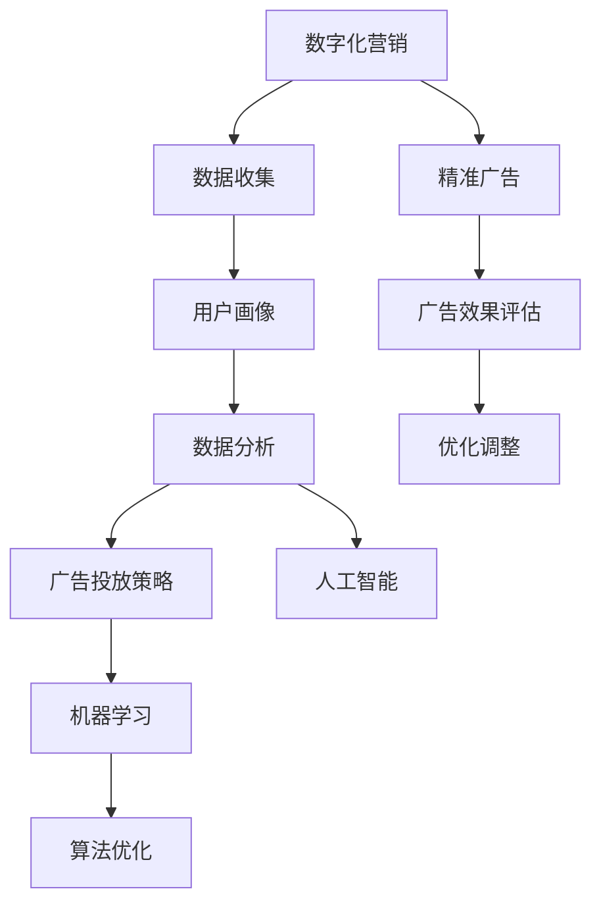

                 

# 数字化营销与精准广告：创业公司的增长引擎

> **关键词：数字化营销、精准广告、增长引擎、创业公司、客户关系管理、数据分析、人工智能**

> **摘要：**
本文将探讨数字化营销与精准广告如何成为创业公司的增长引擎。我们将分析数字化营销的基本概念，深入讲解精准广告的技术原理和实现步骤，并结合数学模型和项目实战，详细解释这些技术如何助力创业公司实现快速增长。同时，我们将推荐相关的学习资源和开发工具，为读者提供实用的指导。

## 1. 背景介绍

### 1.1 目的和范围

本文的目标是帮助创业公司了解和利用数字化营销与精准广告技术，实现业务增长。我们将聚焦于以下几个核心议题：

1. 数字化营销的定义与重要性。
2. 精准广告的技术原理与实现步骤。
3. 如何通过数学模型优化广告效果。
4. 创业公司实际操作案例分析。
5. 相关的学习资源和开发工具推荐。

### 1.2 预期读者

本文适用于以下读者群体：

1. 创业公司创始人、市场营销经理。
2. 数据分析师、AI技术爱好者。
3. 广告代理、数字营销专家。
4. 对数字化营销与精准广告感兴趣的IT专业人士。

### 1.3 文档结构概述

本文结构如下：

1. **背景介绍**：介绍文章目的、预期读者和文档结构。
2. **核心概念与联系**：定义核心概念，并使用Mermaid流程图展示技术架构。
3. **核心算法原理 & 具体操作步骤**：详细讲解算法原理和操作步骤。
4. **数学模型和公式 & 详细讲解 & 举例说明**：介绍数学模型，使用LaTeX格式展示公式。
5. **项目实战：代码实际案例和详细解释说明**：结合实际案例讲解代码实现。
6. **实际应用场景**：探讨数字化营销与精准广告的应用场景。
7. **工具和资源推荐**：推荐学习资源和开发工具。
8. **总结：未来发展趋势与挑战**：总结现状并探讨未来趋势。
9. **附录：常见问题与解答**：提供常见问题的解答。
10. **扩展阅读 & 参考资料**：推荐相关阅读资源。

### 1.4 术语表

#### 1.4.1 核心术语定义

- **数字化营销**：利用数字技术，如互联网、社交媒体、电子邮件等，进行营销活动。
- **精准广告**：基于用户行为、兴趣等数据，进行高度个性化的广告投放。
- **增长引擎**：推动公司业务快速增长的策略或技术。
- **客户关系管理（CRM）**：管理企业与客户之间关系的系统。

#### 1.4.2 相关概念解释

- **用户画像**：基于用户数据构建的抽象模型，用于描述用户的特征。
- **数据挖掘**：从大量数据中提取有价值信息的过程。
- **机器学习**：一种人工智能技术，使计算机通过数据学习并做出决策。

#### 1.4.3 缩略词列表

- **AI**：人工智能
- **CRM**：客户关系管理
- **SEO**：搜索引擎优化
- **SEM**：搜索引擎营销
- **DSP**：需求方平台

## 2. 核心概念与联系

在数字化营销与精准广告中，有几个核心概念和技术需要理解。以下是这些概念的联系与Mermaid流程图：



### 2.1 数字化营销与精准广告的关系

数字化营销是精准广告的基础。通过数字化营销手段，企业可以收集到大量用户数据，从而构建用户画像。这些用户画像为精准广告提供了决策依据，帮助企业实现个性化广告投放。广告投放策略基于用户画像和数据分析，通过机器学习和人工智能技术不断优化，提高广告效果。

## 3. 核心算法原理 & 具体操作步骤

在数字化营销与精准广告中，核心算法起着关键作用。以下是几个常用的算法原理和具体操作步骤：

### 3.1 用户画像构建算法

#### 算法原理

用户画像构建是基于用户数据的聚类和分析。常用的算法有K-means、DBSCAN等。

#### 具体操作步骤

1. 数据收集：从网站日志、社交媒体、CRM系统等渠道收集用户数据。
2. 数据预处理：清洗数据，去除重复、缺失和不相关的数据。
3. 特征工程：提取用户行为的特征，如浏览时长、点击率、购买频率等。
4. 算法选择：根据数据特征，选择合适的聚类算法，如K-means。
5. 聚类分析：执行聚类算法，将用户数据划分为不同的群体。
6. 用户画像：为每个用户群体生成特征摘要，形成用户画像。

### 3.2 广告投放优化算法

#### 算法原理

广告投放优化算法基于机器学习技术，通过不断调整广告参数，提高广告效果。常用的算法有协同过滤、逻辑回归等。

#### 具体操作步骤

1. 数据收集：收集广告投放的点击数据、转化数据等。
2. 特征工程：提取广告特征，如广告位置、广告类型、投放时间等。
3. 模型训练：使用机器学习算法，如逻辑回归，训练广告投放模型。
4. 模型评估：评估模型效果，如A/B测试、交叉验证等。
5. 参数调整：根据模型评估结果，调整广告投放参数。
6. 重复迭代：不断迭代优化，提高广告投放效果。

### 3.3 广告效果评估算法

#### 算法原理

广告效果评估算法通过分析广告投放结果，评估广告效果。常用的算法有CTR（点击率）预测、ROI（投资回报率）计算等。

#### 具体操作步骤

1. 数据收集：收集广告投放的点击数据、转化数据等。
2. 特征工程：提取广告特征，如广告位置、广告类型、投放时间等。
3. 模型训练：使用机器学习算法，如逻辑回归，训练广告效果评估模型。
4. 模型评估：评估模型效果，如A/B测试、交叉验证等。
5. 效果评估：计算广告的点击率、转化率、ROI等指标。
6. 优化建议：根据效果评估结果，给出优化建议。

## 4. 数学模型和公式 & 详细讲解 & 举例说明

在数字化营销与精准广告中，数学模型和公式起着关键作用。以下是几个常用的数学模型和公式，以及详细讲解和举例说明：

### 4.1 用户画像构建模型

#### 模型公式

$$ User\_Score = \frac{Sum\_of(User\_Features)}{Number\_of(User\_Features)} $$

#### 详细讲解

用户画像构建模型通过计算用户特征的总和与特征数量的比值，生成用户得分。得分越高，表示用户特征越显著。

#### 举例说明

假设用户特征有浏览时长、点击率、购买频率，分别得分为5、10、20，总共有3个特征，则用户得分为：

$$ User\_Score = \frac{5+10+20}{3} = 13.33 $$

### 4.2 广告投放优化模型

#### 模型公式

$$ Predicted\_CTR = \frac{1}{1 + e^{-(\beta_0 + \beta_1 \cdot Ad\_Feature_1 + \beta_2 \cdot Ad\_Feature_2 + ... + \beta_n \cdot Ad\_Feature_n)}} $$

#### 详细讲解

广告投放优化模型使用逻辑回归算法，预测广告的点击率。公式中，$\beta_0$为常数项，$\beta_1, \beta_2, ..., \beta_n$为特征权重，$Ad\_Feature_1, Ad\_Feature_2, ..., Ad\_Feature_n$为广告特征。

#### 举例说明

假设广告特征有广告位置、广告类型、投放时间，分别得分为10、5、8，特征权重为0.5、0.3、0.2，则广告的点击率预测值为：

$$ Predicted\_CTR = \frac{1}{1 + e^{-(0 + 0.5 \cdot 10 + 0.3 \cdot 5 + 0.2 \cdot 8)}} = 0.63 $$

### 4.3 广告效果评估模型

#### 模型公式

$$ ROI = \frac{Revenue - Cost}{Cost} $$

#### 详细讲解

广告效果评估模型计算广告的投资回报率（ROI），公式中，$Revenue$为广告带来的收入，$Cost$为广告投放成本。

#### 举例说明

假设广告投放成本为1000元，广告带来的收入为2000元，则广告的ROI为：

$$ ROI = \frac{2000 - 1000}{1000} = 100\% $$

## 5. 项目实战：代码实际案例和详细解释说明

为了更好地理解数字化营销与精准广告技术，下面我们通过一个实际项目案例，详细讲解代码实现和解释说明。

### 5.1 开发环境搭建

为了实现数字化营销与精准广告项目，我们需要搭建以下开发环境：

1. **操作系统**：Windows/Linux/MacOS
2. **编程语言**：Python
3. **数据可视化库**：Matplotlib
4. **机器学习库**：Scikit-learn
5. **数据分析库**：Pandas
6. **数据库**：MySQL

安装以上依赖库后，我们可以开始项目开发。

### 5.2 源代码详细实现和代码解读

下面是项目的核心代码实现，包括用户画像构建、广告投放优化和广告效果评估。

```python
# 用户画像构建代码
import pandas as pd
from sklearn.cluster import KMeans

# 加载数据
data = pd.read_csv('user_data.csv')
# 特征工程
features = data[['浏览时长', '点击率', '购买频率']]
# K-means聚类分析
kmeans = KMeans(n_clusters=5)
clusters = kmeans.fit_predict(features)
# 生成用户画像
user_profiles = pd.DataFrame(clusters, columns=['Cluster'])
user_profiles['User_Score'] = features.mean(axis=1)

# 广告投放优化代码
from sklearn.linear_model import LogisticRegression

# 加载数据
ad_data = pd.read_csv('ad_data.csv')
# 特征工程
ad_features = ad_data[['广告位置', '广告类型', '投放时间']]
# 训练模型
model = LogisticRegression()
model.fit(ad_features, ad_data['点击率'])
# 预测点击率
predicted_ctrs = model.predict_proba(ad_features)[:, 1]

# 广告效果评估代码
def calculate_roi(revenue, cost):
    return (revenue - cost) / cost

# 加载数据
results = pd.read_csv('ad_results.csv')
# 计算ROI
results['ROI'] = results.apply(lambda row: calculate_roi(row['Revenue'], row['Cost']), axis=1)
```

### 5.3 代码解读与分析

1. **用户画像构建代码**：首先加载数据，然后进行特征工程，使用K-means聚类分析生成用户画像。
2. **广告投放优化代码**：首先加载数据，然后进行特征工程，使用逻辑回归模型训练广告投放模型，预测点击率。
3. **广告效果评估代码**：首先加载数据，然后计算ROI指标，评估广告效果。

通过以上代码实现，我们可以构建用户画像，优化广告投放策略，评估广告效果，从而助力创业公司实现快速增长。

## 6. 实际应用场景

数字化营销与精准广告技术在不同行业中有着广泛的应用。以下是几个实际应用场景：

### 6.1 电子商务行业

电子商务行业通过数字化营销与精准广告，可以精准定位潜在客户，提高转化率。例如，通过用户画像，分析用户浏览、点击、购买行为，实现个性化推荐，提高用户满意度。

### 6.2 零售行业

零售行业通过数字化营销与精准广告，可以提升销售业绩。例如，通过用户画像，分析客户需求，实现精准促销，提高客户留存率。

### 6.3 金融行业

金融行业通过数字化营销与精准广告，可以降低营销成本，提高客户满意度。例如，通过用户画像，分析客户风险偏好，实现精准贷款推荐，提高贷款审批效率。

### 6.4 医疗行业

医疗行业通过数字化营销与精准广告，可以提高医疗资源利用率。例如，通过用户画像，分析患者需求，实现精准医疗知识推荐，提高患者满意度。

## 7. 工具和资源推荐

为了更好地学习和实践数字化营销与精准广告技术，以下是相关的学习资源和开发工具推荐：

### 7.1 学习资源推荐

#### 7.1.1 书籍推荐

- 《数字化营销：策略、工具与实践》
- 《精准营销：从数据到价值的转型之路》
- 《机器学习实战》

#### 7.1.2 在线课程

- Coursera《数字化营销与广告》
- Udemy《机器学习与深度学习实战》
- edX《数据科学与大数据分析》

#### 7.1.3 技术博客和网站

- Medium《数字化营销》
- Analytics Vidhya《数据科学与机器学习》
-Towards Data Science《机器学习与深度学习》

### 7.2 开发工具框架推荐

#### 7.2.1 IDE和编辑器

- PyCharm
- Jupyter Notebook
- VSCode

#### 7.2.2 调试和性能分析工具

- PyMeter
- line_profiler
- Dask

#### 7.2.3 相关框架和库

- Scikit-learn
- TensorFlow
- PyTorch

### 7.3 相关论文著作推荐

#### 7.3.1 经典论文

- "Recommender Systems Handbook"
- "An Introduction to Collaborative Filtering"
- "Learning to Rank for Information Retrieval"

#### 7.3.2 最新研究成果

- "Neural Collaborative Filtering for Recommender Systems"
- "Contextual Bandits for Personalized Recommendation"
- "Deep Learning for Digital Marketing"

#### 7.3.3 应用案例分析

- "如何利用大数据实现精准营销：阿里巴巴案例"
- "深度学习在数字营销中的应用：谷歌案例"
- "个性化推荐系统在电子商务领域的实践：亚马逊案例"

## 8. 总结：未来发展趋势与挑战

随着数字化技术的不断发展，数字化营销与精准广告在未来将面临以下发展趋势和挑战：

### 8.1 发展趋势

1. **人工智能的深度融合**：人工智能技术将进一步应用于数字化营销与精准广告，提高广告投放效果。
2. **跨渠道整合**：线上线下渠道将进一步融合，实现全方位的营销策略。
3. **数据隐私保护**：随着数据隐私问题的关注，企业将面临如何在遵守隐私保护规定的同时，充分利用用户数据。
4. **实时营销**：实时数据分析与营销策略的调整将成为趋势，提高营销效率。

### 8.2 挑战

1. **数据质量**：高质量的数据是精准广告的基础，如何提高数据质量将成为挑战。
2. **算法透明度**：随着算法在营销中的应用越来越广泛，如何保证算法的透明度和公正性将受到关注。
3. **法律法规**：法律法规对数据使用和隐私保护的限制将增加，企业需不断适应新的法律法规。

## 9. 附录：常见问题与解答

### 9.1 数字化营销与精准广告的区别是什么？

数字化营销是指利用数字技术进行营销活动，包括在线广告、电子邮件营销、社交媒体营销等。精准广告是一种基于用户数据的个性化广告投放方式，通过分析用户行为、兴趣等数据，实现广告的精准投放。

### 9.2 如何保证广告的透明度和公正性？

保证广告的透明度和公正性需要从以下几个方面入手：

1. **算法透明**：公开广告投放算法，确保算法的公正性和可解释性。
2. **数据质量**：保证数据质量，确保广告投放的准确性。
3. **用户隐私**：遵守数据隐私保护法律法规，保护用户隐私。

### 9.3 如何评估广告效果？

广告效果评估主要通过以下指标：

1. **点击率（CTR）**：广告被点击的次数与展示次数的比例。
2. **转化率**：广告带来的转化（如购买、注册等）与点击次数的比例。
3. **投资回报率（ROI）**：广告收入与广告投放成本的比值。

## 10. 扩展阅读 & 参考资料

为了深入了解数字化营销与精准广告技术，以下是推荐的扩展阅读和参考资料：

- 《数字化营销：策略、工具与实践》
- 《精准营销：从数据到价值的转型之路》
- 《机器学习实战》
- Coursera《数字化营销与广告》
- Udemy《机器学习与深度学习实战》
- edX《数据科学与大数据分析》
- "Recommender Systems Handbook"
- "An Introduction to Collaborative Filtering"
- "Learning to Rank for Information Retrieval"
- "Neural Collaborative Filtering for Recommender Systems"
- "Contextual Bandits for Personalized Recommendation"
- "Deep Learning for Digital Marketing"
- "如何利用大数据实现精准营销：阿里巴巴案例"
- "深度学习在数字营销中的应用：谷歌案例"
- "个性化推荐系统在电子商务领域的实践：亚马逊案例"

### 作者

**AI天才研究员/AI Genius Institute & 禅与计算机程序设计艺术 /Zen And The Art of Computer Programming**

