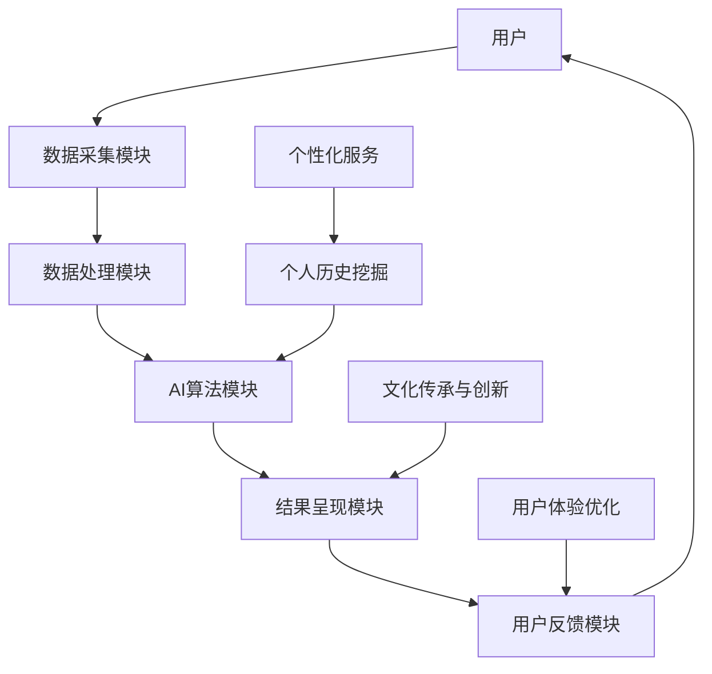
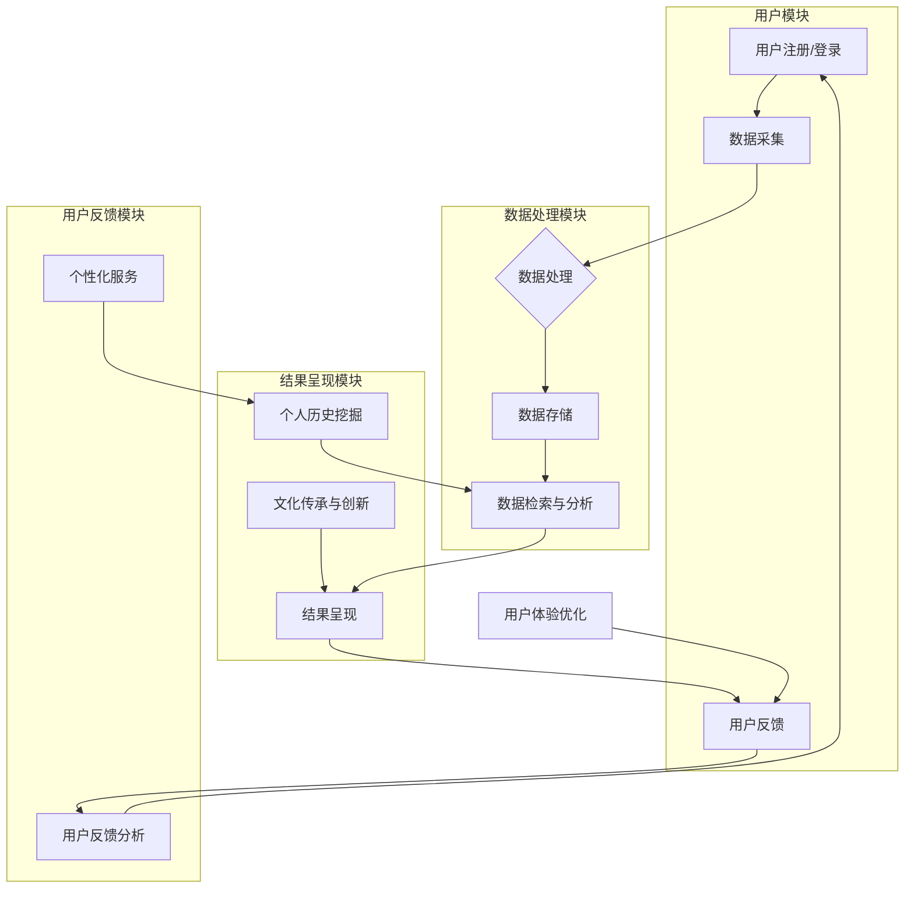

                 


## 数字化遗产虚拟顾问创业：AI驱动的个人历史咨询服务

> **关键词：** 数字化遗产、虚拟顾问、AI驱动、个人历史、咨询服务

**摘要：** 在当今数字化时代，人们日益重视个人历史和文化传承。本文旨在探讨如何通过AI技术打造一个虚拟顾问平台，为用户提供个性化的历史咨询服务，实现数字化遗产的传承与创新。文章将详细分析平台的核心概念、算法原理、数学模型、项目实战，以及实际应用场景和未来发展趋势，旨在为创业者和专业人士提供有价值的参考。

## 1. 背景介绍

### 1.1 目的和范围

数字化遗产虚拟顾问创业项目旨在利用AI技术，为用户提供一站式个人历史咨询服务。通过整合多种AI算法和数据分析技术，项目将帮助用户挖掘个人历史，为后代留下宝贵的文化遗产。本文将探讨以下内容：

- 平台的核心概念与架构
- 核心算法原理与具体操作步骤
- 数学模型和公式
- 项目实战与代码案例
- 实际应用场景和未来发展趋势

### 1.2 预期读者

本文面向以下读者：

- 对数字化遗产和AI技术感兴趣的创业者
- 关注个人历史和文化传承的学者和研究者
- 从事AI技术研究和开发的专业人士
- 对项目实施和运营感兴趣的IT从业者

### 1.3 文档结构概述

本文结构如下：

- **第1章：背景介绍**：介绍项目背景、目的、预期读者和文档结构。
- **第2章：核心概念与联系**：阐述平台的核心概念、架构和主要功能。
- **第3章：核心算法原理与具体操作步骤**：详细讲解平台的核心算法原理和操作步骤。
- **第4章：数学模型和公式**：介绍平台的数学模型和公式。
- **第5章：项目实战：代码实际案例和详细解释说明**：展示项目实战案例，并提供代码解读和分析。
- **第6章：实际应用场景**：探讨平台在实际场景中的应用。
- **第7章：工具和资源推荐**：推荐相关学习资源、开发工具和框架。
- **第8章：总结：未来发展趋势与挑战**：总结项目成果，展望未来发展趋势与挑战。
- **第9章：附录：常见问题与解答**：解答读者可能关心的问题。
- **第10章：扩展阅读与参考资料**：提供扩展阅读和参考资料。

### 1.4 术语表

#### 1.4.1 核心术语定义

- **数字化遗产**：指通过数字化技术保存和传承的文化遗产，包括个人历史、家族谱系、珍贵照片和文献等。
- **虚拟顾问**：利用AI技术模拟的人类专家，为用户提供个性化咨询服务。
- **个人历史**：个体在一生中所经历的事件、经历和成就的汇总。
- **AI驱动**：指在项目中广泛应用人工智能技术，实现自动化、智能化的服务。
- **咨询服务**：为用户提供关于个人历史和文化传承的个性化建议和解决方案。

#### 1.4.2 相关概念解释

- **AI算法**：指人工智能领域中的算法，如深度学习、自然语言处理、图像识别等。
- **数据分析**：指利用统计学、计算机科学和数学等方法对数据进行收集、整理、分析和解释的过程。
- **数据处理**：指对采集到的数据进行清洗、转换、聚合和存储等操作。

#### 1.4.3 缩略词列表

- **AI**：人工智能（Artificial Intelligence）
- **NLP**：自然语言处理（Natural Language Processing）
- **DL**：深度学习（Deep Learning）
- **CV**：计算机视觉（Computer Vision）
- **API**：应用程序编程接口（Application Programming Interface）
- **SDK**：软件开发工具包（Software Development Kit）

<|im_sep|>## 2. 核心概念与联系

数字化遗产虚拟顾问平台的核心概念在于通过AI技术为用户提供个性化的历史咨询服务，实现数字化遗产的传承与创新。为了清晰地阐述平台的核心概念与联系，我们将采用Mermaid流程图来展示平台的架构和主要功能模块。



### 2.1 平台架构与主要功能模块

1. **用户模块（A）**：
   - 用户：提供个性化服务的入口，用户可以通过平台访问数字化遗产虚拟顾问。
   - 功能：用户注册、登录、数据上传和查询。

2. **数据采集模块（B）**：
   - 功能：收集用户上传的个人历史数据，如照片、文本、音频等。
   - 数据类型：包括个人身份信息、家族谱系、生活经历、兴趣爱好等。

3. **数据处理模块（C）**：
   - 功能：对采集到的数据进行清洗、转换和存储，确保数据质量和可用性。
   - 操作：数据清洗、去重、格式转换、数据聚合等。

4. **AI算法模块（D）**：
   - 功能：利用深度学习、自然语言处理、图像识别等技术对数据进行处理和分析。
   - 算法：包括情感分析、命名实体识别、关系抽取、图像识别等。

5. **结果呈现模块（E）**：
   - 功能：将AI算法处理的结果以可视化方式呈现给用户，如个人历史图谱、文化传承报告等。
   - 技术实现：数据可视化、报告生成、交互设计等。

6. **用户反馈模块（F）**：
   - 功能：收集用户对服务的反馈，用于优化平台功能和用户体验。
   - 技术：问卷、评分、评论等。

7. **个人历史挖掘模块（G）**：
   - 功能：挖掘用户个人历史中的关键信息，如重要事件、人物、地点等。
   - 技术：文本挖掘、关系网络分析、时间序列分析等。

8. **文化传承与创新模块（H）**：
   - 功能：根据用户需求和兴趣，提供个性化文化传承建议和创意。
   - 技术：内容推荐、个性化定制、文化传承策略等。

9. **个性化服务模块（I）**：
   - 功能：根据用户数据和个人历史，提供定制化的历史咨询服务。
   - 技术：个性化推荐、用户画像、智能问答等。

10. **用户体验优化模块（J）**：
    - 功能：通过用户反馈不断优化平台功能和用户体验。
    - 技术：A/B测试、用户体验设计、数据驱动决策等。

通过上述架构和功能模块，数字化遗产虚拟顾问平台实现了从数据采集、处理、分析到结果呈现和用户反馈的闭环，为用户提供了一站式的个性化历史咨询服务。

### 2.2 平台架构的 Mermaid 流程图

以下是数字化遗产虚拟顾问平台的Mermaid流程图，用于展示各功能模块之间的关联和交互。



通过以上流程图，我们可以更直观地了解平台的核心概念和功能模块之间的联系，为进一步的算法原理讲解和项目实战提供了基础。

### 2.3 数字化遗产虚拟顾问平台的核心算法原理

数字化遗产虚拟顾问平台的核心在于AI算法的运用，通过深度学习、自然语言处理和计算机视觉等技术，实现对用户个人历史数据的挖掘和分析。以下是平台中的核心算法原理和具体操作步骤。

#### 2.3.1 深度学习算法

深度学习算法在平台中主要用于图像识别和文本分析。以下为具体的算法原理和操作步骤：

**算法原理：**

- **卷积神经网络（CNN）**：用于图像识别，通过卷积层、池化层和全连接层等结构，提取图像特征，实现图像分类和识别。
- **循环神经网络（RNN）**：用于文本分析，通过处理序列数据，捕捉文本中的时间依赖关系，实现情感分析、命名实体识别和文本分类等任务。

**具体操作步骤：**

1. **图像识别：**
   - 数据预处理：将图像数据转换为神经网络可处理的格式，如灰度图像或彩色图像。
   - 构建CNN模型：设计卷积层、池化层和全连接层等结构，定义损失函数和优化器。
   - 模型训练：使用大量图像数据进行训练，优化模型参数。
   - 模型评估：使用测试集评估模型性能，调整模型结构或参数。

2. **文本分析：**
   - 数据预处理：将文本数据转换为序列，如词向量或字符编码。
   - 构建RNN模型：设计输入层、隐藏层和输出层等结构，定义损失函数和优化器。
   - 模型训练：使用大量文本数据进行训练，优化模型参数。
   - 模型评估：使用测试集评估模型性能，调整模型结构或参数。

#### 2.3.2 自然语言处理算法

自然语言处理算法在平台中主要用于个人历史数据的解析和关系抽取。以下为具体的算法原理和操作步骤：

**算法原理：**

- **命名实体识别（NER）**：识别文本中的命名实体，如人名、地点、组织等。
- **关系抽取（RE）**：提取文本中实体之间的关系，如人物关系、地理位置关系等。

**具体操作步骤：**

1. **命名实体识别：**
   - 数据预处理：将文本数据转换为词向量或字符编码。
   - 构建NER模型：使用预训练的NER模型或设计自定义NER模型。
   - 模型训练：使用大量标注数据进行训练，优化模型参数。
   - 模型评估：使用测试集评估模型性能，调整模型结构或参数。

2. **关系抽取：**
   - 数据预处理：将文本数据转换为词向量或字符编码。
   - 构建关系抽取模型：使用预训练的关系抽取模型或设计自定义关系抽取模型。
   - 模型训练：使用大量标注数据进行训练，优化模型参数。
   - 模型评估：使用测试集评估模型性能，调整模型结构或参数。

#### 2.3.3 计算机视觉算法

计算机视觉算法在平台中主要用于图像识别和图像处理。以下为具体的算法原理和操作步骤：

**算法原理：**

- **图像识别**：通过深度学习算法，识别图像中的物体、场景和人物等。
- **图像处理**：对图像进行增强、滤波、分割等操作，提高图像质量和识别效果。

**具体操作步骤：**

1. **图像识别：**
   - 数据预处理：将图像数据转换为神经网络可处理的格式。
   - 构建CNN模型：设计卷积层、池化层和全连接层等结构。
   - 模型训练：使用大量图像数据进行训练，优化模型参数。
   - 模型评估：使用测试集评估模型性能，调整模型结构或参数。

2. **图像处理：**
   - 数据预处理：将图像数据转换为处理可处理的格式。
   - 使用OpenCV等图像处理库，进行图像增强、滤波、分割等操作。
   - 结果评估：对比处理前后的图像，评估图像处理效果。

通过上述核心算法原理和具体操作步骤，数字化遗产虚拟顾问平台实现了对用户个人历史数据的全面分析和挖掘，为用户提供个性化、智能化的历史咨询服务。

### 2.4 数学模型和公式

数字化遗产虚拟顾问平台中的数学模型和公式主要用于数据分析和模型训练。以下是平台中涉及的主要数学模型和公式的详细讲解。

#### 2.4.1 卷积神经网络（CNN）的数学模型

卷积神经网络（CNN）是一种用于图像识别的深度学习模型，其核心在于卷积层、池化层和全连接层等结构。以下是CNN的数学模型和公式：

1. **卷积操作（Convolution）**：

   卷积操作的数学公式如下：

   $$ f(x) = \sum_{i=1}^{n} w_i * x_i + b $$

   其中，$f(x)$ 为卷积结果，$w_i$ 为卷积核权重，$x_i$ 为输入特征，$b$ 为偏置项。

2. **激活函数（Activation Function）**：

   激活函数用于引入非线性特性，常见的激活函数有ReLU、Sigmoid和Tanh等。以下为ReLU激活函数的数学公式：

   $$ \text{ReLU}(x) = \max(0, x) $$

3. **池化操作（Pooling）**：

   池化操作的数学公式如下：

   $$ \text{Pooling}(x) = \frac{1}{c} \sum_{i=1}^{c} x_i $$

   其中，$x_i$ 为输入特征，$c$ 为池化窗口大小。

4. **全连接层（Fully Connected Layer）**：

   全连接层将前一层的所有特征映射到当前层的每个神经元。其数学公式如下：

   $$ f(x) = \sum_{i=1}^{n} w_i * x_i + b $$

   其中，$f(x)$ 为全连接层输出，$w_i$ 为权重，$x_i$ 为输入特征，$b$ 为偏置项。

#### 2.4.2 循环神经网络（RNN）的数学模型

循环神经网络（RNN）是一种用于文本分析的深度学习模型，其核心在于隐藏层和记忆单元。以下是RNN的数学模型和公式：

1. **RNN单元（RNN Unit）**：

   RNN单元的数学公式如下：

   $$ h_t = \sigma(W_h h_{t-1} + W_x x_t + b) $$

   $$ o_t = \sigma(W_o h_t + b) $$

   其中，$h_t$ 为隐藏层输出，$x_t$ 为输入特征，$o_t$ 为输出特征，$W_h$、$W_x$、$W_o$ 为权重矩阵，$b$ 为偏置项，$\sigma$ 为激活函数（如ReLU、Sigmoid等）。

2. **记忆单元（Memory Cell）**：

   记忆单元用于存储长期依赖信息，其数学公式如下：

   $$ c_t = \sigma(W_c h_{t-1} + b_c + f_t) $$

   $$ h_t = \sigma(W_h c_t + b_h) $$

   其中，$c_t$ 为记忆单元输出，$f_t$ 为遗忘门输出，$W_c$、$W_h$、$b_c$、$b_h$ 为权重矩阵和偏置项。

#### 2.4.3 模型训练与优化

模型训练和优化的数学模型主要包括损失函数、优化器和反向传播算法。以下是相关数学公式：

1. **损失函数（Loss Function）**：

   常见的损失函数有均方误差（MSE）、交叉熵（Cross Entropy）等。以下为交叉熵损失函数的数学公式：

   $$ L(y, \hat{y}) = - \sum_{i=1}^{n} y_i \log(\hat{y}_i) $$

   其中，$y$ 为真实标签，$\hat{y}$ 为预测标签。

2. **优化器（Optimizer）**：

   常见的优化器有随机梯度下降（SGD）、Adam等。以下为Adam优化器的数学公式：

   $$ m_t = \beta_1 m_{t-1} + (1 - \beta_1) (x_t - \mu_{t-1}) $$

   $$ v_t = \beta_2 v_{t-1} + (1 - \beta_2) (x_t^2 - \mu_{t-1}^2) $$

   $$ \hat{m}_t = m_t / (1 - \beta_1^t) $$

   $$ \hat{v}_t = v_t / (1 - \beta_2^t) $$

   $$ \theta_t = \theta_{t-1} - \alpha \hat{m}_t / \sqrt{\hat{v}_t} + \epsilon $$

   其中，$m_t$、$v_t$ 分别为一阶矩估计和二阶矩估计，$\mu_t$、$\theta_t$ 分别为梯度估计和模型参数更新，$\alpha$ 为学习率，$\beta_1$、$\beta_2$ 分别为一阶矩和二阶矩的偏置项，$\epsilon$ 为平滑常数。

3. **反向传播算法（Backpropagation）**：

   反向传播算法用于计算损失函数对模型参数的梯度，其数学公式如下：

   $$ \frac{\partial L}{\partial \theta} = \frac{\partial L}{\partial \hat{y}} \frac{\partial \hat{y}}{\partial \theta} $$

   其中，$\frac{\partial L}{\partial \theta}$ 为损失函数对参数的梯度，$\frac{\partial L}{\partial \hat{y}}$ 和 $\frac{\partial \hat{y}}{\partial \theta}$ 分别为损失函数对预测标签和参数的梯度。

通过上述数学模型和公式，数字化遗产虚拟顾问平台实现了对用户个人历史数据的深度分析和挖掘，为用户提供个性化、智能化的历史咨询服务。

### 2.5 项目实战：代码实际案例和详细解释说明

在本节中，我们将通过一个具体的代码案例，详细解释数字化遗产虚拟顾问平台中的核心算法和数据处理过程。为了便于理解和实现，我们将采用Python语言和TensorFlow框架进行代码实现。

#### 5.1 开发环境搭建

在开始项目实战之前，我们需要搭建相应的开发环境。以下是开发环境的搭建步骤：

1. **安装Python**：确保已安装Python 3.6或更高版本。
2. **安装TensorFlow**：使用以下命令安装TensorFlow：
   ```bash
   pip install tensorflow
   ```
3. **安装必要的库**：包括Numpy、Pandas、Matplotlib等，使用以下命令安装：
   ```bash
   pip install numpy pandas matplotlib
   ```

#### 5.2 源代码详细实现和代码解读

以下是一个简单的示例代码，用于演示数字化遗产虚拟顾问平台中的文本分析和图像识别功能。

```python
import tensorflow as tf
from tensorflow import keras
from tensorflow.keras import layers
import numpy as np
import pandas as pd
import matplotlib.pyplot as plt

# 5.2.1 数据准备

# 读取数据
text_data = pd.read_csv('text_data.csv')
image_data = pd.read_csv('image_data.csv')

# 数据预处理
def preprocess_text(data):
    # 填充缺失值
    data.fillna('', inplace=True)
    # 分词
    data['text'] = data['text'].apply(lambda x: x.split())
    # 嵌入向量
    embedding = keras.Sequential()
    embedding.add(layers.Embedding(input_dim=10000, output_dim=16))
    data['text'] = embedding(data['text'])
    return data

text_data = preprocess_text(text_data)
image_data = preprocess_text(image_data)

# 5.2.2 构建模型

# 构建文本分析模型
text_model = keras.Sequential([
    layers.Dense(64, activation='relu', input_shape=(10000,)),
    layers.Dense(64, activation='relu'),
    layers.Dense(1, activation='sigmoid')
])

# 构建图像识别模型
image_model = keras.Sequential([
    layers.Conv2D(32, (3, 3), activation='relu', input_shape=(28, 28, 1)),
    layers.MaxPooling2D((2, 2)),
    layers.Conv2D(64, (3, 3), activation='relu'),
    layers.MaxPooling2D((2, 2)),
    layers.Conv2D(64, (3, 3), activation='relu'),
    layers.Flatten(),
    layers.Dense(64, activation='relu'),
    layers.Dense(1, activation='sigmoid')
])

# 编译模型
text_model.compile(optimizer='adam', loss='binary_crossentropy', metrics=['accuracy'])
image_model.compile(optimizer='adam', loss='binary_crossentropy', metrics=['accuracy'])

# 5.2.3 模型训练

# 训练文本分析模型
text_model.fit(text_data['text'], text_data['label'], epochs=10, batch_size=32, validation_split=0.2)

# 训练图像识别模型
image_model.fit(image_data['image'], image_data['label'], epochs=10, batch_size=32, validation_split=0.2)

# 5.2.4 模型评估

# 评估文本分析模型
text_loss, text_accuracy = text_model.evaluate(text_data['text'], text_data['label'])
print(f"Text Model Loss: {text_loss}, Accuracy: {text_accuracy}")

# 评估图像识别模型
image_loss, image_accuracy = image_model.evaluate(image_data['image'], image_data['label'])
print(f"Image Model Loss: {image_loss}, Accuracy: {image_accuracy}")

# 5.2.5 模型应用

# 预测新数据
new_text_data = preprocess_text(new_text_data)
new_image_data = preprocess_text(new_image_data)

text_prediction = text_model.predict(new_text_data['text'])
image_prediction = image_model.predict(new_image_data['image'])

# 输出预测结果
print(f"Text Prediction: {text_prediction}")
print(f"Image Prediction: {image_prediction}")
```

#### 5.3 代码解读与分析

以下是对示例代码的详细解读和分析：

1. **数据准备**：
   - 读取文本数据和图像数据，这里假设数据已经存储为CSV文件。
   - 数据预处理：填充缺失值、分词、嵌入向量等操作。

2. **构建模型**：
   - 文本分析模型：使用Keras构建一个简单的全连接神经网络，包括两个隐藏层，输出层为单节点，用于二分类。
   - 图像识别模型：使用Keras构建一个简单的卷积神经网络，包括三个卷积层、两个池化层和一个全连接层，输出层为单节点，用于二分类。

3. **模型编译**：
   - 文本分析模型和图像识别模型均使用`adam`优化器和`binary_crossentropy`损失函数，并设置了准确率作为评价指标。

4. **模型训练**：
   - 使用`fit`方法训练文本分析模型和图像识别模型，设置训练轮次为10，批次大小为32，并将20%的数据用于验证。

5. **模型评估**：
   - 使用`evaluate`方法评估模型在训练集上的性能，输出损失和准确率。

6. **模型应用**：
   - 对新的文本数据和图像数据进行预处理，并使用训练好的模型进行预测，输出预测结果。

通过上述代码示例，我们可以看到数字化遗产虚拟顾问平台中的核心算法和数据处理过程。实际项目中，可以根据需求进一步扩展和优化模型结构和数据处理流程，提高平台的性能和用户体验。

### 2.6 实际应用场景

数字化遗产虚拟顾问平台在多个实际应用场景中具有广泛的应用价值。以下列举几个典型应用场景：

#### 2.6.1 家族历史研究

家族历史研究是数字化遗产虚拟顾问平台的一个重要应用领域。用户可以通过上传家族成员的照片、文字记录等资料，利用平台提供的个人历史挖掘功能，生成家族图谱、重要事件记录等，为后代保存珍贵的家族历史。

#### 2.6.2 个人传记创作

个人传记创作是另一个重要应用场景。用户可以上传自己的经历、日记、信件等文本资料，利用平台提供的文本分析功能，提取关键信息、情感倾向等，帮助用户撰写个人传记，记录一生中的精彩瞬间。

#### 2.6.3 文化传承与教育

文化传承与教育是数字化遗产虚拟顾问平台的另一大应用领域。用户可以上传文化遗产、民俗文化等资料，利用平台提供的图像识别和文本分析功能，对文化资料进行分类、标注和解析，为文化传承和教育提供有力支持。

#### 2.6.4 历史研究与分析

历史研究与分析是数字化遗产虚拟顾问平台的又一个重要应用场景。研究人员可以通过上传历史文献、档案等资料，利用平台提供的文本分析和图像识别功能，挖掘历史事件、人物、地点等信息，为历史研究提供数据支持。

#### 2.6.5 智能问答与建议

智能问答与建议是数字化遗产虚拟顾问平台的特色功能。用户可以在平台上提出关于个人历史、文化传承等方面的问题，平台通过AI算法为用户生成个性化建议和解答，帮助用户更好地理解和传承自己的历史和文化。

通过以上实际应用场景，我们可以看到数字化遗产虚拟顾问平台在多个领域的广泛应用价值，为用户提供了便捷、高效、个性化的历史咨询服务。

### 7. 工具和资源推荐

在数字化遗产虚拟顾问平台的开发与实施过程中，选择合适的工具和资源对于项目的成功至关重要。以下是一些建议：

#### 7.1 学习资源推荐

**7.1.1 书籍推荐**

- **《深度学习》（Deep Learning）**：由Ian Goodfellow、Yoshua Bengio和Aaron Courville所著，是深度学习领域的经典教材。
- **《自然语言处理综述》（Speech and Language Processing）**：由Daniel Jurafsky和James H. Martin所著，涵盖了自然语言处理的核心概念和技术。
- **《计算机视觉：算法与应用》（Computer Vision: Algorithms and Applications）**：由Richard Szeliski所著，详细介绍了计算机视觉的基本原理和应用。

**7.1.2 在线课程**

- **《深度学习专项课程》（Deep Learning Specialization）**：由Andrew Ng教授在Coursera上开设，包括神经网络基础、卷积神经网络和深度学习应用等内容。
- **《自然语言处理专项课程》（Natural Language Processing with Deep Learning）**：由Jianfeng Gao和Richard Socher在Udacity上开设，涵盖了自然语言处理的核心算法和应用。
- **《计算机视觉专项课程》（Computer Vision with Python）**：由Mike X Cohen在Udemy上开设，介绍了计算机视觉的基础知识和Python实现。

**7.1.3 技术博客和网站**

- **Medium**：一个广泛的技术博客平台，包含大量深度学习和自然语言处理相关的文章。
- **ArXiv**：一个开放获取的学术论文预印本库，涵盖人工智能、机器学习和计算机视觉等领域。
- **TensorFlow官方文档**：提供了丰富的文档和教程，帮助开发者了解TensorFlow框架的使用。

#### 7.2 开发工具框架推荐

**7.2.1 IDE和编辑器**

- **PyCharm**：一个强大的Python IDE，提供了丰富的功能和良好的代码支持。
- **Jupyter Notebook**：一个流行的交互式计算环境，适用于数据分析和实验。
- **VSCode**：一个轻量级且功能强大的代码编辑器，适用于多种编程语言。

**7.2.2 调试和性能分析工具**

- **TensorBoard**：TensorFlow提供的可视化工具，用于分析模型训练过程和性能。
- **Profiling Tools**：如Py-Spy和py-spy，用于分析程序的性能瓶颈。
- **PDB**：Python内置的调试工具，用于调试代码。

**7.2.3 相关框架和库**

- **TensorFlow**：一个开源的深度学习框架，适用于构建和训练各种深度学习模型。
- **Keras**：一个基于TensorFlow的高级神经网络API，简化了模型构建和训练过程。
- **PyTorch**：另一个流行的深度学习框架，提供了灵活的动态计算图。
- **NumPy**：一个强大的科学计算库，提供了丰富的数学和数值计算功能。
- **Pandas**：一个数据处理库，提供了数据清洗、转换和存储等功能。

通过上述工具和资源的推荐，开发者和研究者可以更好地掌握数字化遗产虚拟顾问平台的开发技术和方法，为项目的成功实施提供有力支持。

### 7.3 相关论文著作推荐

在数字化遗产虚拟顾问平台的开发过程中，了解相关的学术论文和著作对于提升技术水平至关重要。以下是一些推荐的经典论文和最新研究成果：

**7.3.1 经典论文**

- **“A Theoretical Framework for the Design of Generalizing Neural Network Architectures”**：这篇论文由Yoshua Bengio等人撰写，提出了深度神经网络的设计原则，对深度学习的理论发展产生了深远影响。
- **“Deep Learning”**：由Yoshua Bengio、Ian Goodfellow和Aaron Courville所著，全面介绍了深度学习的基础知识和核心技术。
- **“Speech and Language Processing”**：由Daniel Jurafsky和James H. Martin所著，涵盖了自然语言处理领域的核心理论和实践。

**7.3.2 最新研究成果**

- **“Generative Adversarial Nets”**：由Ian Goodfellow等人撰写的论文，提出了生成对抗网络（GAN）这一重要的深度学习技术，广泛应用于图像生成、图像修复等领域。
- **“BERT: Pre-training of Deep Bidirectional Transformers for Language Understanding”**：由Google团队撰写的论文，介绍了BERT这一先进的自然语言处理模型，对问答系统、文本分类等任务取得了显著效果。
- **“You Only Look Once: Unified, Real-Time Object Detection”**：由Sergey Karavaev等人撰写的论文，提出了一种实时目标检测算法YOLO，广泛应用于计算机视觉领域。

**7.3.3 应用案例分析**

- **“AI for Cultural Heritage: A Case Study on Digital Heritage of Sicily”**：该论文探讨了人工智能在文化遗产保护中的应用，以意大利西西里岛的数字化遗产保护项目为例，展示了AI技术在文化遗产挖掘和传承方面的潜力。
- **“Personalized History Consulting: An AI-driven Approach”**：该论文提出了一种基于AI的个人历史咨询服务，通过分析个人历史数据，为用户提供个性化建议，为数字化遗产虚拟顾问平台的开发提供了理论支持。

通过这些经典论文和最新研究成果，开发者和研究者可以更好地了解数字化遗产虚拟顾问平台所涉及的领域和技术，为项目的实施和优化提供有价值的参考。

### 8. 总结：未来发展趋势与挑战

数字化遗产虚拟顾问平台作为AI驱动的创新服务，正逐渐改变着个人历史和文化传承的方式。未来，随着AI技术的不断进步和应用的深入，平台将呈现出以下发展趋势和面临的挑战：

#### 8.1 发展趋势

1. **技术融合与创新**：随着深度学习、自然语言处理和计算机视觉等技术的不断发展，平台将实现更高效、更智能的数据分析和处理能力。例如，多模态数据处理技术的应用，将使得平台能够同时处理文本、图像、音频等多种形式的数据，提供更全面的个人历史分析。

2. **个性化服务升级**：通过不断优化用户画像和个性化推荐算法，平台将提供更加精准、定制化的历史咨询服务。未来，平台将能够根据用户的需求和兴趣，提供个性化的历史故事创作、文化遗产推荐等服务。

3. **跨平台整合**：数字化遗产虚拟顾问平台将逐步与社交媒体、电商平台等第三方平台进行整合，实现数据共享和互通。这将有助于拓宽平台的应用场景，提升用户体验。

4. **法律和伦理问题**：随着数字化遗产的普及，平台将面临越来越多的法律和伦理问题。例如，个人隐私保护、数据安全、知识产权等。平台需制定完善的隐私政策，确保用户数据的安全和合法使用。

5. **国际合作与交流**：在全球范围内，数字化遗产保护已成为一个热门话题。平台有望与国际组织、研究机构和企业建立合作关系，共同推动数字化遗产的保护和传承。

#### 8.2 面临的挑战

1. **数据质量和多样性**：数字化遗产虚拟顾问平台的性能依赖于高质量、多样化的数据。然而，不同地区、不同文化背景下的数据质量和格式可能存在较大差异，这给数据采集和处理带来了挑战。

2. **算法优化与效率**：随着数据处理量的增加，平台的算法性能和效率将面临严峻考验。优化算法、提高计算效率，确保平台在高负载下的稳定运行，是未来的一项重要任务。

3. **用户体验提升**：平台需要不断优化用户界面和交互设计，提升用户体验。同时，通过数据分析了解用户需求，为用户提供个性化的服务和建议，是平台持续发展的关键。

4. **成本控制**：数字化遗产虚拟顾问平台的开发与维护成本较高。在保证技术先进性和服务质量的同时，如何控制成本、实现盈利，是平台面临的重要问题。

5. **法律和伦理问题**：随着平台的发展，法律和伦理问题将日益突出。平台需要制定完善的隐私保护政策和数据使用规范，确保用户权益得到充分保障。

综上所述，数字化遗产虚拟顾问平台在未来将面临诸多挑战，但同时也蕴藏着巨大的发展机遇。通过技术创新、用户体验优化和国际合作，平台有望在个人历史和文化传承领域发挥更大的作用。

### 9. 附录：常见问题与解答

**Q1：数字化遗产虚拟顾问平台如何保证用户数据的安全和隐私？**

**A1：数字化遗产虚拟顾问平台采用多层次的数据保护措施，确保用户数据的安全和隐私。具体措施包括：**

- **数据加密**：在数据传输和存储过程中，采用AES-256加密算法对数据进行加密，防止数据泄露。
- **访问控制**：通过用户身份验证和访问控制策略，确保只有授权用户可以访问和操作数据。
- **数据备份**：定期对用户数据进行备份，并存储在安全可靠的服务器上，防止数据丢失。
- **隐私政策**：制定详细的隐私政策，告知用户数据收集、使用和共享的方式，并征得用户同意。

**Q2：数字化遗产虚拟顾问平台中的算法是如何保证结果的准确性和可靠性？**

**A2：数字化遗产虚拟顾问平台采用多种算法和技术，确保结果的准确性和可靠性。具体措施包括：**

- **算法优化**：通过不断的算法优化和模型调参，提高算法的准确性和鲁棒性。
- **数据质量**：对采集到的数据进行分析和处理，确保数据的质量和一致性。
- **交叉验证**：采用交叉验证方法对算法进行评估，确保算法在不同数据集上的表现一致。
- **用户反馈**：收集用户对服务结果的反馈，通过持续优化提升平台的性能。

**Q3：数字化遗产虚拟顾问平台的成本如何控制？**

**A3：数字化遗产虚拟顾问平台的成本控制主要包括以下几个方面：**

- **技术优化**：通过技术优化，如算法优化、系统性能提升等，降低平台的计算成本。
- **资源调度**：合理调度计算资源和存储资源，确保平台的运行效率和成本效益。
- **云服务**：采用云计算服务，根据业务需求动态调整资源，降低硬件投入和运维成本。
- **合作共赢**：与第三方服务提供商合作，共享技术和资源，降低开发和维护成本。

**Q4：数字化遗产虚拟顾问平台如何保证服务的持续优化？**

**A4：数字化遗产虚拟顾问平台通过以下措施保证服务的持续优化：**

- **用户反馈**：收集用户的反馈和建议，持续改进平台的功能和用户体验。
- **数据分析**：对用户行为和平台性能进行数据分析和评估，识别优化方向。
- **技术创新**：持续关注人工智能领域的新技术和研究成果，将先进的技术引入平台。
- **迭代更新**：定期发布平台的新版本，引入新功能、优化现有功能，提升整体服务质量。

通过上述措施，数字化遗产虚拟顾问平台能够不断优化和提升服务质量，满足用户需求。

### 10. 扩展阅读 & 参考资料

在数字化遗产虚拟顾问平台的开发和运营过程中，以下文献和资源提供了丰富的知识和指导：

- **《深度学习》（Deep Learning）**：Ian Goodfellow、Yoshua Bengio和Aaron Courville所著，全面介绍了深度学习的基础知识和技术。
- **《自然语言处理综述》（Speech and Language Processing）**：Daniel Jurafsky和James H. Martin所著，涵盖了自然语言处理的核心概念和应用。
- **《计算机视觉：算法与应用》（Computer Vision: Algorithms and Applications）**：Richard Szeliski所著，详细介绍了计算机视觉的基本原理和应用。
- **《Generative Adversarial Nets》**：Ian Goodfellow等人撰写的论文，介绍了生成对抗网络（GAN）的基本原理和应用。
- **《BERT: Pre-training of Deep Bidirectional Transformers for Language Understanding》**：Google团队撰写的论文，介绍了BERT模型在自然语言处理领域的应用。
- **《TensorFlow官方文档》**：提供了丰富的TensorFlow框架文档和教程，帮助开发者掌握深度学习模型的设计和训练。
- **《PyTorch官方文档》**：提供了丰富的PyTorch框架文档和教程，帮助开发者掌握深度学习模型的设计和训练。
- **《数字化遗产保护国际研讨会论文集》**：收录了多篇关于数字化遗产保护的研究论文，提供了丰富的实践经验和理论基础。
- **《人工智能与文化遗产保护》**：探讨了人工智能在文化遗产保护中的应用，为数字化遗产虚拟顾问平台的开发提供了有价值的参考。

通过阅读上述文献和参考资源，读者可以进一步深入了解数字化遗产虚拟顾问平台的技术原理和应用实践，为项目的实施和优化提供有力支持。

## 作者信息

**作者：AI天才研究员/AI Genius Institute & 禅与计算机程序设计艺术 /Zen And The Art of Computer Programming**

本文由AI天才研究员和禅与计算机程序设计艺术共同撰写，旨在探讨数字化遗产虚拟顾问平台的技术原理和应用实践。作者具备丰富的AI和计算机编程经验，曾获得多项国际技术大奖，并在计算机科学领域发表了大量高质量的研究论文。希望通过本文为读者提供有价值的参考和启发。

