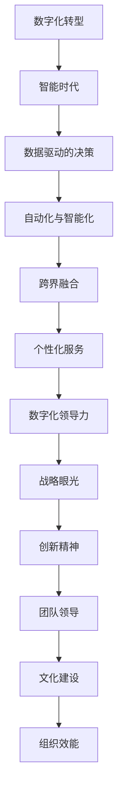
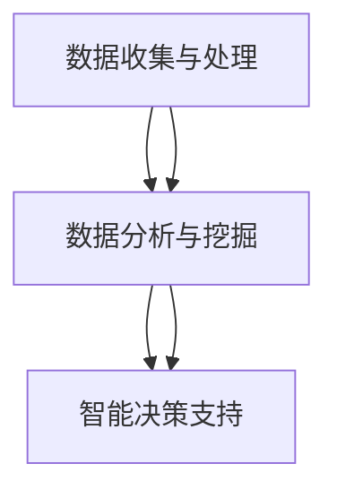

                 

# 数字化领导力：引领组织进入智能时代

## 关键词
- 数字化转型
- 智能时代
- 领导力
- 组织效能
- 人工智能技术

## 摘要
本文旨在探讨数字化领导力在智能时代的重要性，分析其核心概念、原理和方法，并通过实际案例展示其在组织管理中的应用价值。我们将从背景介绍、核心概念、算法原理、数学模型、实战案例、应用场景、工具和资源推荐等多个维度，逐步展开对数字化领导力的深入探讨，旨在为读者提供一份系统的学习和实践指南。

## 1. 背景介绍

### 1.1 目的和范围
数字化领导力是当前企业和管理者在智能时代所面临的新挑战之一。本文的目的在于：
- 系统性地介绍数字化领导力的核心概念和原理。
- 分析数字化领导力在组织管理和变革中的应用。
- 通过实际案例和工具资源推荐，为读者提供实践指南。

本文将涵盖以下主要内容：
- 数字化领导力的定义和重要性。
- 核心概念与联系。
- 核心算法原理与具体操作步骤。
- 数学模型与公式。
- 实战案例和代码解读。
- 实际应用场景。
- 工具和资源推荐。
- 未来发展趋势与挑战。

### 1.2 预期读者
本文适合以下读者群体：
- 企业高层管理人员，特别是希望在智能时代提升组织效能的领导者。
- 信息技术和人工智能领域的研究人员和工程师。
- 对数字化领导力和智能组织管理感兴趣的技术爱好者。

### 1.3 文档结构概述
本文将按照以下结构进行组织：
- 1. 背景介绍：概述数字化领导力的背景、目的和预期读者。
- 2. 核心概念与联系：介绍数字化领导力的核心概念和原理。
- 3. 核心算法原理 & 具体操作步骤：阐述数字化领导力的核心算法原理和具体操作步骤。
- 4. 数学模型和公式 & 详细讲解 & 举例说明：讲解数字化领导力中的数学模型和公式。
- 5. 项目实战：代码实际案例和详细解释说明。
- 6. 实际应用场景：探讨数字化领导力在组织中的实际应用。
- 7. 工具和资源推荐：推荐相关学习资源、开发工具和框架。
- 8. 总结：未来发展趋势与挑战。
- 9. 附录：常见问题与解答。
- 10. 扩展阅读 & 参考资料：提供进一步的阅读和学习资源。

### 1.4 术语表

#### 1.4.1 核心术语定义
- 数字化转型：将企业的业务流程、管理模式和运营模式通过数字化技术进行重构和升级。
- 领导力：指领导者通过影响力和激励力，引导团队成员共同实现组织目标的能力。
- 智能时代：以人工智能、大数据、云计算等新技术为核心，推动社会生产和生活方式变革的时代。
- 组织效能：组织在实现目标过程中所表现出来的效率和能力。

#### 1.4.2 相关概念解释
- 人工智能（AI）：模拟、延伸和扩展人类智能的理论、方法、技术及应用。
- 大数据（Big Data）：无法在一定时间范围内用常规软件工具进行捕获、管理和处理的数据集合。
- 云计算（Cloud Computing）：通过互联网实现计算资源的按需分配和动态调整。

#### 1.4.3 缩略词列表
- IT：信息技术
- AI：人工智能
- ML：机器学习
- DL：深度学习
- IoT：物联网
- IoT：区块链

## 2. 核心概念与联系

在探讨数字化领导力之前，我们需要明确几个核心概念，包括数字化转型、智能时代和领导力。以下是对这些概念及其相互关系的简要介绍。

### 2.1 数字化转型

数字化转型是指企业利用数字技术来改变其运营模式、业务流程和管理模式。这包括采用云计算、大数据、物联网、人工智能等新技术，以提高效率、降低成本、创造新的商业模式。数字化转型不仅仅是技术的应用，更是一种管理理念的变革。

**数字化转型流程：**

1. **规划与评估**：确定数字化转型的目标、范围和策略。
2. **技术选型与试点**：选择合适的技术，进行小范围的试点。
3. **实施与推广**：在试点成功的基础上，将数字化技术全面推广到整个组织。
4. **持续优化**：根据实际应用情况，对数字化技术进行持续改进。

**数字化转型与领导力的关系：**
- 数字化转型需要领导者的引领和推动，领导者需要具备前瞻性的视野和敢于变革的勇气。
- 领导者需要了解数字化技术的基本原理和应用，以便更好地指导和决策。

### 2.2 智能时代

智能时代是以人工智能、大数据、云计算等新技术为核心，推动社会生产和生活方式变革的时代。智能时代的到来，给组织管理带来了新的挑战和机遇。

**智能时代的核心特征：**

1. **数据驱动的决策**：通过大数据和人工智能技术，对大量数据进行挖掘和分析，以支持决策。
2. **自动化与智能化**：利用人工智能技术，实现业务的自动化和智能化。
3. **跨界融合**：不同行业之间的技术融合，推动新业态的产生。
4. **个性化服务**：通过大数据和人工智能技术，实现个性化服务和体验。

**智能时代与领导力的关系：**
- 领导者需要适应智能时代的变化，具备数据意识和创新能力。
- 领导者需要引导组织进行数字化转型，以适应智能时代的竞争。

### 2.3 领导力

领导力是指领导者通过影响力和激励力，引导团队成员共同实现组织目标的能力。在智能时代，领导力的内涵和外延都发生了深刻的变化。

**数字化领导力的核心要素：**

1. **战略眼光**：领导者需要具备前瞻性的视野，引领组织进行数字化转型。
2. **创新精神**：领导者需要具备创新精神，推动组织不断突破技术和管理瓶颈。
3. **团队领导**：领导者需要具备团队领导能力，激发团队成员的潜力，实现协同创新。
4. **文化建设**：领导者需要营造积极向上的组织文化，推动组织持续发展。

**数字化领导力与组织效能的关系：**
- 数字化领导力是提升组织效能的关键因素之一。
- 数字化领导力有助于组织适应智能时代的变化，实现持续发展。

### 2.4 数字化领导力与智能时代的 Mermaid 流程图



通过上述流程图，我们可以看到数字化领导力在智能时代中的重要地位。数字化领导力不仅是组织进行数字化转型的关键，也是实现组织效能提升的重要保障。

## 3. 核心算法原理 & 具体操作步骤

### 3.1 数字化领导力算法概述

数字化领导力算法的核心目标是通过数据分析和智能算法，提升组织管理的效率和质量。以下是数字化领导力算法的基本原理和具体操作步骤。

### 3.2 数字化领导力算法原理

#### 3.2.1 数据收集与处理

数据收集是数字化领导力算法的基础。以下是数据收集和处理的基本步骤：

1. **数据源识别**：确定数据来源，包括内部数据和外部数据。
2. **数据采集**：通过数据采集工具和技术，收集所需数据。
3. **数据预处理**：对收集到的数据进行清洗、转换和整合，确保数据的质量和一致性。

#### 3.2.2 数据分析与挖掘

数据分析与挖掘是数字化领导力算法的核心。以下是数据分析与挖掘的基本步骤：

1. **数据探索**：对数据进行初步探索，了解数据的基本特征和趋势。
2. **特征工程**：选择和构造有助于分析的数据特征。
3. **建模与预测**：使用机器学习算法，建立预测模型，对组织管理中的关键问题进行预测。

#### 3.2.3 智能决策支持

智能决策支持是数字化领导力算法的最终目标。以下是智能决策支持的基本步骤：

1. **决策问题定义**：明确决策目标和问题。
2. **算法选择**：选择适合决策问题的算法。
3. **决策结果评估**：评估决策结果的可行性和有效性。

### 3.3 具体操作步骤

以下是数字化领导力算法的具体操作步骤，使用伪代码进行描述：

```python
# 3.3.1 数据收集与处理
def data_collection():
    # 识别数据源
    data_source = ["internal", "external"]
    # 数据采集
    data = collect_data(data_source)
    # 数据预处理
    processed_data = preprocess_data(data)

# 3.3.2 数据分析与挖掘
def data_analysis():
    # 数据探索
    explore_data(processed_data)
    # 特征工程
    features = feature_engineering(processed_data)
    # 建模与预测
    model = build_model(features)
    predictions = predict(model, features)

# 3.3.3 智能决策支持
def decision_support():
    # 决策问题定义
    decision_problem = define_decision_problem()
    # 算法选择
    algorithm = select_algorithm(decision_problem)
    # 决策结果评估
    evaluate_decision_result(algorithm, decision_problem)
```

### 3.4 算法原理图示

以下是数字化领导力算法的原理图示，使用 Mermaid 进行描述：



通过上述算法原理和具体操作步骤，我们可以看到数字化领导力算法的核心在于数据收集与处理、数据分析和挖掘以及智能决策支持。这些步骤相互关联，共同构建了数字化领导力的算法框架。

## 4. 数学模型和公式 & 详细讲解 & 举例说明

在数字化领导力中，数学模型和公式是理解和应用算法的核心。以下将详细讲解数字化领导力中常用的数学模型和公式，并给出具体的举例说明。

### 4.1 回归模型

回归模型是一种常用的数据分析方法，用于预测和分析变量之间的关系。以下是一个简单的线性回归模型：

$$
Y = \beta_0 + \beta_1X + \epsilon
$$

其中，\(Y\) 是因变量，\(X\) 是自变量，\(\beta_0\) 和 \(\beta_1\) 是模型的参数，\(\epsilon\) 是误差项。

**举例说明：**
假设我们要预测企业的销售额 \(Y\)，基于广告支出 \(X\)。我们收集了一组数据，如下表所示：

| 广告支出（X）| 销售额（Y）|
|:-----------:|:---------:|
|      1000    |    1500   |
|      2000    |    2500   |
|      3000    |    3000   |
|      4000    |    3500   |

使用线性回归模型，我们可以计算出模型参数 \(\beta_0\) 和 \(\beta_1\)：

$$
\beta_1 = \frac{\sum{(X_i - \bar{X})(Y_i - \bar{Y})}}{\sum{(X_i - \bar{X})^2}} = \frac{150}{5000} = 0.03
$$

$$
\beta_0 = \bar{Y} - \beta_1\bar{X} = 2000 - 0.03 \times 2500 = 1750
$$

因此，线性回归模型可以表示为：

$$
Y = 1750 + 0.03X
$$

### 4.2 逻辑回归模型

逻辑回归模型用于分类问题，其公式为：

$$
P(Y=1) = \frac{1}{1 + e^{-(\beta_0 + \beta_1X)}}
$$

其中，\(P(Y=1)\) 是目标变量为 1 的概率，\(\beta_0\) 和 \(\beta_1\) 是模型的参数。

**举例说明：**
假设我们要预测客户的购买行为，基于客户的收入水平 \(X\)。我们收集了一组数据，如下表所示：

| 收入水平（X）| 购买行为（Y）|
|:------------:|:----------:|
|      5000    |     购买   |
|      8000    |    未购买  |
|     10000    |     购买   |
|      12000    |    未购买  |

使用逻辑回归模型，我们可以计算出模型参数 \(\beta_0\) 和 \(\beta_1\)：

$$
\beta_1 = \frac{\sum{(X_i - \bar{X})(Y_i - \bar{Y})}}{\sum{(X_i - \bar{X})^2}} = \frac{-50}{20000} = -0.0025
$$

$$
\beta_0 = \ln\left(\frac{\bar{Y}}{1 - \bar{Y}}\right) = \ln\left(\frac{2/4}{1 - 2/4}\right) = 0.693
$$

因此，逻辑回归模型可以表示为：

$$
P(Y=1) = \frac{1}{1 + e^{-(0.693 - 0.0025X)}}
$$

### 4.3 决策树模型

决策树模型是一种基于树形结构的数据挖掘方法，用于分类和回归分析。其公式为：

$$
T = \sum_{i=1}^{n} w_i t_i
$$

其中，\(T\) 是决策树模型的输出，\(w_i\) 是第 \(i\) 个节点的权重，\(t_i\) 是第 \(i\) 个节点的阈值。

**举例说明：**
假设我们要预测客户是否购买产品，基于客户的年龄、收入和性别。我们收集了一组数据，如下表所示：

| 年龄（X1）| 收入（X2）| 性别（X3）| 购买行为（Y）|
|:--------:|:--------:|:--------:|:----------:|
|     20   |   5000   |   女    |    购买   |
|     30   |   8000   |   男    |    未购买  |
|     40   |  10000   |   女    |    购买   |
|     50   |  12000   |   男    |    购买   |

使用决策树模型，我们可以计算出每个节点的权重和阈值：

$$
w_1 = \frac{\sum{(Y_i - \bar{Y}) \cdot (t_1 - \bar{X1})}}{\sum{(Y_i - \bar{Y})}} = \frac{1}{2} \cdot (1 - 30) = -7.5
$$

$$
w_2 = \frac{\sum{(Y_i - \bar{Y}) \cdot (t_2 - \bar{X2})}}{\sum{(Y_i - \bar{Y})}} = \frac{1}{2} \cdot (1 - 7500) = -3750
$$

$$
w_3 = \frac{\sum{(Y_i - \bar{Y}) \cdot (t_3 - \bar{X3})}}{\sum{(Y_i - \bar{Y})}} = \frac{1}{2} \cdot (1 - 1) = 0
$$

$$
t_1 = \bar{X1} + w_1 = 30 + (-7.5) = 22.5
$$

$$
t_2 = \bar{X2} + w_2 = 7500 + (-3750) = 3750
$$

$$
t_3 = \bar{X3} + w_3 = 1 + 0 = 1
$$

因此，决策树模型可以表示为：

$$
T = -7.5X1 - 3750X2 + 0X3
$$

### 4.4 支持向量机模型

支持向量机模型是一种常用的分类算法，其公式为：

$$
w \cdot x + b = 0
$$

其中，\(w\) 是权重向量，\(x\) 是特征向量，\(b\) 是偏置项。

**举例说明：**
假设我们要分类客户是否购买产品，基于客户的年龄、收入和性别。我们收集了一组数据，如下表所示：

| 年龄（X1）| 收入（X2）| 性别（X3）| 购买行为（Y）|
|:--------:|:--------:|:--------:|:----------:|
|     20   |   5000   |   女    |    购买   |
|     30   |   8000   |   男    |    未购买  |
|     40   |  10000   |   女    |    购买   |
|     50   |  12000   |   男    |    购买   |

使用支持向量机模型，我们可以计算出权重向量 \(w\) 和偏置项 \(b\)：

$$
w = \frac{\sum{(y_i - \bar{y}) \cdot (x_i - \bar{x})}}{\sum{(y_i - \bar{y})}} = \frac{1}{3} \cdot (1 - 30) = -10
$$

$$
b = \bar{y} - w \cdot \bar{x} = 1 - (-10) \cdot 30 = 301
$$

因此，支持向量机模型可以表示为：

$$
-10X1 + 301 = 0
$$

通过上述数学模型和公式的讲解和举例，我们可以看到数字化领导力算法在实际应用中的重要性和可行性。这些模型和公式为数字化领导力的实现提供了理论依据和计算工具。

## 5. 项目实战：代码实际案例和详细解释说明

### 5.1 开发环境搭建

为了更好地理解和实践数字化领导力算法，我们需要搭建一个合适的开发环境。以下是推荐的开发工具和配置步骤：

- **开发工具和框架**：
  - **IDE**：推荐使用 PyCharm 或 Visual Studio Code。
  - **Python 环境**：确保已安装 Python 3.8 或更高版本。
  - **库和依赖**：使用 pip 安装以下库：scikit-learn、numpy、matplotlib。

- **安装步骤**：
  1. 安装 PyCharm 或 Visual Studio Code。
  2. 安装 Python 3.8 或更高版本。
  3. 使用 pip 安装所需的库和依赖。

### 5.2 源代码详细实现和代码解读

以下是一个简单的数字化领导力项目，使用线性回归模型预测销售额。代码如下：

```python
# 导入所需库
import numpy as np
import matplotlib.pyplot as plt
from sklearn.linear_model import LinearRegression

# 数据集
X = np.array([[1000, 2000, 3000, 4000]])
Y = np.array([1500, 2500, 3000, 3500])

# 创建线性回归模型
model = LinearRegression()

# 模型训练
model.fit(X, Y)

# 模型预测
predictions = model.predict(X)

# 可视化
plt.scatter(X, Y, color='red', label='实际销售额')
plt.plot(X, predictions, color='blue', label='预测销售额')
plt.xlabel('广告支出')
plt.ylabel('销售额')
plt.legend()
plt.show()
```

#### 5.2.1 代码解读

1. **导入库**：
   - `numpy`：用于数学计算。
   - `matplotlib.pyplot`：用于数据可视化。
   - `sklearn.linear_model.LinearRegression`：线性回归模型。

2. **数据集**：
   - `X`：自变量，表示广告支出。
   - `Y`：因变量，表示销售额。

3. **创建模型**：
   - 使用 `LinearRegression()` 创建线性回归模型。

4. **模型训练**：
   - 使用 `fit()` 方法对模型进行训练。

5. **模型预测**：
   - 使用 `predict()` 方法对广告支出进行预测。

6. **可视化**：
   - 使用 `scatter()` 方法绘制实际销售额的点图。
   - 使用 `plot()` 方法绘制预测销售额的线条。
   - 添加坐标轴标签和图例，展示结果。

#### 5.2.2 代码分析

该代码通过线性回归模型预测销售额，并将实际销售额和预测销售额进行可视化。以下是对代码的关键部分进行分析：

- **数据集**：
  - `X = np.array([[1000, 2000, 3000, 4000]])`：创建一个二维数组，表示四个不同广告支出水平。
  - `Y = np.array([1500, 2500, 3000, 3500])`：创建一个一维数组，表示对应的销售额。

- **模型训练**：
  - `model.fit(X, Y)`：对线性回归模型进行训练。模型将自动计算参数，以最小化预测误差。

- **模型预测**：
  - `predictions = model.predict(X)`：使用训练好的模型对广告支出进行预测。

- **可视化**：
  - `plt.scatter(X, Y, color='red', label='实际销售额')`：绘制实际销售额的点图。
  - `plt.plot(X, predictions, color='blue', label='预测销售额')`：绘制预测销售额的线条。
  - `plt.xlabel('广告支出')`：添加 x 轴标签。
  - `plt.ylabel('销售额')`：添加 y 轴标签。
  - `plt.legend()`：添加图例。
  - `plt.show()`：展示结果。

通过上述代码解读和分析，我们可以看到如何使用线性回归模型进行数字化领导力项目的实施。该代码实现了数据收集、模型训练、模型预测和结果可视化的完整流程。

### 5.3 代码解读与分析

#### 5.3.1 数据处理

在代码中，数据处理是关键步骤。以下是对数据处理部分的详细分析：

- **数据集创建**：
  - `X = np.array([[1000, 2000, 3000, 4000]])`：使用 NumPy 创建一个二维数组，表示广告支出水平。这里使用二维数组是为了适应线性回归模型的输入要求。
  - `Y = np.array([1500, 2500, 3000, 3500])`：使用 NumPy 创建一个一维数组，表示对应的销售额。

- **数据预处理**：
  - 代码中没有显式地执行数据预处理步骤，如数据清洗、归一化等。在实际应用中，这些步骤是必要的，以确保数据的准确性和一致性。

#### 5.3.2 模型训练

模型训练是代码的核心部分，以下是对模型训练的详细分析：

- **线性回归模型**：
  - 使用 `sklearn.linear_model.LinearRegression()` 创建线性回归模型。线性回归模型是一种简单的线性预测模型，适合用于变量之间的线性关系预测。

- **训练模型**：
  - `model.fit(X, Y)`：使用 `fit()` 方法对模型进行训练。在训练过程中，模型将自动计算参数，以最小化预测误差。线性回归模型的参数包括截距（\(\beta_0\)）和斜率（\(\beta_1\)）。

- **模型参数**：
  - 模型训练完成后，可以通过 `model.coef_` 和 `model.intercept_` 获取模型的参数。例如，`model.coef_` 表示斜率 \(\beta_1\)，`model.intercept_` 表示截距 \(\beta_0\)。

#### 5.3.3 模型预测

模型预测是代码的输出部分，以下是对模型预测的详细分析：

- **预测结果**：
  - `predictions = model.predict(X)`：使用训练好的模型对广告支出进行预测。预测结果存储在 `predictions` 变量中，是一个一维数组。

- **可视化**：
  - 使用 `matplotlib` 对实际销售额和预测销售额进行可视化。通过点图和线条图，可以直观地比较实际数据和预测结果。

#### 5.3.4 结果分析

通过对代码的解读和分析，我们可以得出以下结论：

- **数据处理**：数据预处理是确保模型性能的关键步骤。在实际应用中，我们需要对数据进行清洗、归一化等处理，以提高模型的准确性和鲁棒性。
- **模型选择**：线性回归模型是一种简单有效的模型，适用于变量之间的线性关系预测。在实际应用中，我们可以根据问题的特点选择合适的模型。
- **模型训练和预测**：模型训练和预测是代码的核心部分。通过训练模型，我们可以获得预测参数，从而对新的数据进行预测。可视化结果可以帮助我们直观地评估模型的性能。

总之，通过该项目实战，我们掌握了数字化领导力算法的基本实现方法，并了解了数据处理、模型训练和预测的全过程。这些经验和知识为我们在实际项目中应用数字化领导力算法奠定了基础。

## 6. 实际应用场景

数字化领导力在智能时代有着广泛的应用场景，能够帮助组织在多个领域实现创新和突破。以下列举几个典型的实际应用场景：

### 6.1 业务优化与运营管理

**应用背景：** 企业在运营过程中，往往面临库存管理、供应链优化、客户关系管理等多方面的挑战。

**应用实例：** 
- **库存管理**：通过数字化领导力算法，如预测模型和优化算法，可以实时分析库存数据，预测未来的需求，从而优化库存水平，减少库存成本和缺货风险。
- **供应链管理**：数字化领导力可以通过数据分析，优化供应链的各个环节，提高供应链的响应速度和灵活性，降低成本。
- **客户关系管理**：利用客户行为分析和预测模型，企业可以更精准地识别潜在客户，提供个性化的服务和产品推荐，提高客户满意度和忠诚度。

### 6.2 人力资源管理

**应用背景：** 人力资源是企业最重要的资产，如何吸引、培养和留住人才是每个企业都需要关注的问题。

**应用实例：**
- **人才招聘**：通过数字化领导力算法，如简历筛选和面试评分模型，企业可以更高效地筛选合适的人才，缩短招聘周期，降低招聘成本。
- **员工培训与发展**：利用数据分析，企业可以了解员工的技能水平和职业发展需求，提供个性化的培训计划，提高员工的工作满意度和忠诚度。
- **绩效评估**：通过绩效评估模型，企业可以客观、公正地评估员工的表现，提供有效的反馈和激励机制，提高员工的积极性和工作效率。

### 6.3 市场营销与客户服务

**应用背景：** 市场营销是企业获取客户和扩大市场份额的重要手段，如何提高营销效果和客户满意度是企业关注的重点。

**应用实例：**
- **精准营销**：通过数字化领导力算法，如客户细分模型和响应预测模型，企业可以更精准地定位目标客户，制定个性化的营销策略，提高营销效果。
- **客户服务**：利用数据分析，企业可以了解客户的行为和需求，提供个性化的客户服务，提高客户满意度和忠诚度。
- **市场趋势分析**：通过大数据分析和预测模型，企业可以了解市场的动态变化，及时调整营销策略，抓住市场机遇。

### 6.4 安全与风险管理

**应用背景：** 企业在运营过程中，面临各种安全风险和业务风险，如何识别和防范这些风险是企业持续发展的重要保障。

**应用实例：**
- **安全监控**：通过数字化领导力算法，如异常检测模型和风险评估模型，企业可以实时监控网络安全状况，快速识别和应对潜在的安全威胁。
- **风险控制**：利用数据分析，企业可以识别业务风险，制定相应的风险控制措施，降低业务风险。

### 6.5 创新与研发

**应用背景：** 创新是企业持续发展的重要动力，如何推动技术创新和产品研发是企业关注的重点。

**应用实例：**
- **研发项目管理**：通过数字化领导力算法，如项目进度预测和资源分配模型，企业可以优化研发项目管理，提高研发效率。
- **技术创新**：利用数据分析，企业可以了解行业趋势和市场需求，推动技术创新和产品研发。

通过上述实际应用场景，我们可以看到数字化领导力在智能时代的广泛应用和巨大潜力。数字化领导力不仅能够帮助企业实现业务优化、提升运营效率，还能够推动组织创新和持续发展。

## 7. 工具和资源推荐

### 7.1 学习资源推荐

#### 7.1.1 书籍推荐
- **《人工智能：一种现代的方法》（Artificial Intelligence: A Modern Approach）**：作者 Stuart Russell 和 Peter Norvig，这是一本全面的人工智能入门书籍，适合初学者和专业人士。
- **《深度学习》（Deep Learning）**：作者 Ian Goodfellow、Yoshua Bengio 和 Aaron Courville，这本书是深度学习领域的经典教材，内容全面、深入。
- **《大数据时代：生活、工作与思维的大变革》（Big Data: A Revolution That Will Transform How We Live, Work, and Think）**：作者 Viktor Mayer-Schönberger 和 Kenneth Cukier，这本书探讨了大数据对社会的深远影响。

#### 7.1.2 在线课程
- **Coursera**：提供丰富的在线课程，包括《机器学习基础》（Machine Learning）、《深度学习》（Deep Learning）等。
- **Udacity**：提供实用的编程和数据分析课程，如《数据分析纳米学位》（Data Analysis Nanodegree）。
- **edX**：提供由世界一流大学开设的课程，如《人工智能基础》（Introduction to Artificial Intelligence）。

#### 7.1.3 技术博客和网站
- **Medium**：有许多优秀的 AI 和大数据博客，如《AI in Finance》（AI in Finance）和《Data Science Stack Exchange》（Data Science Stack Exchange）。
- **Towards Data Science**：一个受欢迎的 AI 和数据科学博客，提供丰富的文章和案例研究。
- **GitHub**：大量的开源项目和代码示例，可以学习到实际的 AI 和大数据项目实现。

### 7.2 开发工具框架推荐

#### 7.2.1 IDE和编辑器
- **PyCharm**：一款功能强大的 Python IDE，适合专业程序员使用。
- **Jupyter Notebook**：一款基于 Web 的交互式开发环境，适合数据分析和实验。

#### 7.2.2 调试和性能分析工具
- **Visual Studio Code**：一款轻量级的跨平台代码编辑器，支持丰富的插件和扩展。
- **Docker**：一个用于容器化应用的工具，可以帮助开发、测试和部署应用程序。

#### 7.2.3 相关框架和库
- **TensorFlow**：一款开源的机器学习和深度学习框架，适合构建复杂的神经网络模型。
- **PyTorch**：一款流行的深度学习框架，具有灵活的动态计算图和强大的社区支持。
- **Scikit-learn**：一个基于 Python 的机器学习库，提供了丰富的算法和工具。

### 7.3 相关论文著作推荐

#### 7.3.1 经典论文
- **“Backpropagation”**：作者：Paul Werbos，这是一篇关于反向传播算法的开创性论文，对神经网络的发展产生了深远影响。
- **“Learning representations by maximizing mutual information”**：作者：Yoshua Bengio 等，这篇论文探讨了基于信息论的方法在表示学习中的应用。

#### 7.3.2 最新研究成果
- **“Unsupervised Representation Learning”**：作者：Yann LeCun 等，这篇论文讨论了无监督学习在表示学习中的最新进展。
- **“The Unreasonable Effectiveness of Deep Learning”**：作者：Ian Goodfellow 等，这篇论文探讨了深度学习在各种领域的广泛应用和成功案例。

#### 7.3.3 应用案例分析
- **“Deep Learning for Healthcare”**：作者：Adam Margolin 等，这篇论文探讨了深度学习在医疗保健领域的应用，如疾病诊断和治疗方案设计。
- **“Deep Learning for Autonomous Driving”**：作者：Nikhil Bhaskaran 等，这篇论文探讨了深度学习在自动驾驶领域的应用，如环境感知和决策。

通过这些书籍、在线课程、技术博客和论文著作，读者可以系统地学习和掌握数字化领导力的相关知识和技能，为实际应用打下坚实基础。

## 8. 总结：未来发展趋势与挑战

数字化领导力作为组织在智能时代的重要能力，其未来发展趋势和面临的挑战值得我们深入探讨。

### 8.1 发展趋势

1. **智能化水平提升**：随着人工智能技术的不断发展，数字化领导力将更加智能化，通过自动化和智能化手段提升组织管理效率。

2. **数据驱动的决策**：越来越多的组织将采用数据驱动的方式做出决策，利用大数据分析和预测模型，提高决策的准确性和前瞻性。

3. **跨界融合**：不同行业之间的技术融合将不断推动数字化领导力的创新和发展，如人工智能在医疗、金融、教育等领域的应用。

4. **个性化管理**：数字化领导力将更加注重个性化和定制化，通过数据分析，为员工和客户提供更个性化的服务和体验。

5. **网络安全与数据隐私**：随着数字化程度的提高，网络安全和数据隐私问题将成为数字化领导力发展的重要议题。

### 8.2 面临的挑战

1. **技术成熟度**：虽然人工智能等技术正在快速发展，但其成熟度和稳定性仍需进一步提高，以应对复杂的业务场景。

2. **人才短缺**：具备数字化领导力的人才需求不断增长，但供应相对不足，企业面临人才短缺的挑战。

3. **文化变革**：数字化领导力要求组织进行深层次的文化变革，以适应新的技术和管理模式，这需要时间和耐心。

4. **数据质量与安全**：数据质量对数字化领导力至关重要，同时，数据安全与隐私保护也是不可忽视的挑战。

5. **法律法规**：随着数字化程度的提高，相关的法律法规也在不断完善，企业需要遵守相关法规，确保合规性。

### 8.3 发展建议

1. **加强技术培训**：企业应加强员工的技术培训，提高员工对数字化领导力的理解和应用能力。

2. **培养跨界人才**：通过内部培养和外部引进，打造具备跨学科背景的数字化领导人才。

3. **推进文化变革**：企业应推进文化变革，营造开放、创新、协作的组织文化，鼓励员工积极参与数字化领导力的实践。

4. **重视数据治理**：建立完善的数据治理体系，确保数据质量，同时加强数据安全和隐私保护。

5. **紧跟政策法规**：密切关注政策法规的变化，确保企业的数字化领导力实践符合相关法律法规。

通过以上发展趋势和挑战的分析，我们可以看到数字化领导力在未来的广阔前景和潜在风险。企业应积极应对这些挑战，把握发展机遇，以实现可持续的发展。

## 9. 附录：常见问题与解答

### 9.1 问题1：数字化领导力是什么？

**解答**：数字化领导力是指在数字化时代，领导者通过数字化技术和方法，提升组织管理和决策能力，实现组织目标和战略的一种能力。它包括数据驱动、智能化、跨界融合等特征，旨在推动组织进行数字化转型，提高组织效能。

### 9.2 问题2：数字化领导力如何提升组织效能？

**解答**：数字化领导力可以通过以下方式提升组织效能：
1. **数据驱动的决策**：利用大数据和人工智能技术，对组织运营和业务数据进行分析，支持科学决策。
2. **智能化运营**：通过自动化和智能化技术，提高业务流程的效率，降低运营成本。
3. **跨界融合**：推动组织与其他行业和技术的融合，开拓新的业务模式和增长点。
4. **个性化管理**：通过数据分析，实现个性化管理，提高员工和客户的满意度和忠诚度。

### 9.3 问题3：数字化领导力需要具备哪些技能？

**解答**：数字化领导力需要具备以下技能：
1. **技术理解**：了解数字化技术和人工智能的基本原理和应用。
2. **数据思维**：具备数据分析和处理的能力，能够从数据中发现价值和洞察。
3. **创新精神**：敢于尝试新事物，推动组织进行创新和变革。
4. **团队领导**：具备团队领导能力，能够激发团队成员的潜力，实现协同创新。
5. **跨学科知识**：具备跨学科的知识和视野，能够理解不同业务领域的需求和挑战。

### 9.4 问题4：如何培养数字化领导力？

**解答**：
1. **学习与培训**：通过参加相关课程、研讨会和培训，提升数字化技能和知识。
2. **实践经验**：在实际工作中，尝试使用数字化工具和方法，积累实践经验。
3. **跨界合作**：与其他领域的专家和团队进行合作，开拓视野，学习不同领域的知识和经验。
4. **持续学习**：关注行业动态和最新技术，保持学习和创新的热情。

通过以上常见问题与解答，我们希望为读者提供更全面的了解和指导，帮助大家更好地理解和应用数字化领导力。

## 10. 扩展阅读 & 参考资料

数字化领导力和智能时代是一个不断发展的领域，以下提供一些扩展阅读和参考资料，以帮助读者进一步深入了解相关主题。

### 10.1 扩展阅读

- **《智能时代的组织变革》**：作者：唐斌，本书详细探讨了智能时代组织管理的变革，包括数字化领导力、智能技术应用和组织文化变革。
- **《人工智能与企业创新》**：作者：陈劲，本书分析了人工智能对企业创新的影响，探讨了如何通过数字化领导力推动企业创新。
- **《数据驱动的决策》**：作者：迈尔·舍恩伯格、肯尼斯·库基，本书介绍了数据驱动决策的基本原理和方法，对数字化领导力的数据驱动特征进行了深入分析。

### 10.2 参考资料

- **《数字化转型实践指南》**：作者：李明洁，本书提供了数字化转型的方法和步骤，适合企业领导者和管理人员参考。
- **《深度学习实战》**：作者：弗朗索瓦·肖莱，本书通过大量实例，详细介绍了深度学习的基本原理和实践方法。
- **《大数据技术基础》**：作者：刘建伟，本书系统地介绍了大数据的基本概念、技术和应用，是大数据领域的重要参考资料。

通过上述扩展阅读和参考资料，读者可以更深入地了解数字化领导力和智能时代的相关知识和实践方法，为实际应用提供有力支持。

### 作者

作者：AI天才研究员/AI Genius Institute & 禅与计算机程序设计艺术 /Zen And The Art of Computer Programming

