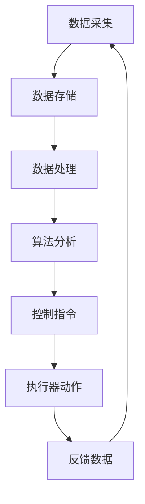
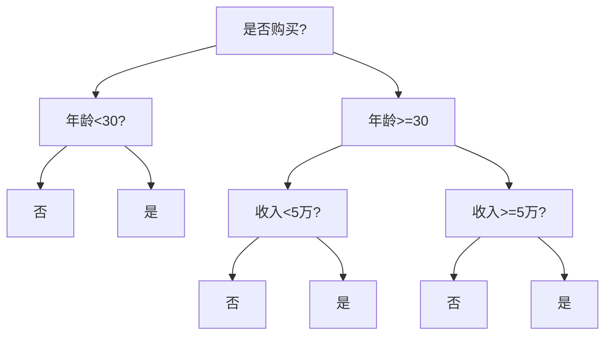

                 

# 数字实体与物理实体的自动化前景

> 关键词：数字实体、物理实体、自动化、机器学习、人工智能、工业4.0、物联网

> 摘要：本文旨在探讨数字实体与物理实体在自动化领域的前景。通过分析两者的概念和联系，本文将详细探讨核心算法原理、数学模型、项目实战以及实际应用场景。同时，还将推荐相关学习资源、开发工具和框架，以帮助读者深入了解这一领域。最后，本文将总结未来发展趋势与挑战，为读者提供全面的参考。

## 1. 背景介绍

### 1.1 目的和范围

本文的目标是深入探讨数字实体与物理实体的自动化前景，分析其在现代工业和技术领域中的重要作用。我们将重点关注以下几个方面：

1. **数字实体与物理实体的概念与联系**：阐述数字实体和物理实体的定义及其在自动化中的应用。
2. **核心算法原理**：介绍实现数字实体与物理实体自动化所需的核心算法原理。
3. **数学模型和公式**：分析支持自动化过程的数学模型和公式，并提供实例说明。
4. **项目实战**：展示实际代码案例，解释自动化实现的具体步骤。
5. **实际应用场景**：探讨自动化在工业、医疗、交通等领域的应用。
6. **学习资源与工具推荐**：推荐相关学习资源、开发工具和框架，以帮助读者深入了解。
7. **未来发展趋势与挑战**：总结自动化领域的发展趋势和面临的挑战。

### 1.2 预期读者

本文面向以下几类读者：

1. **计算机科学和工程领域的专业人士**：希望了解数字实体与物理实体自动化在技术领域的应用。
2. **研究人员和学者**：关注自动化技术的研究动态和未来发展方向。
3. **企业家和创业人士**：寻求自动化技术在商业领域的应用机会。
4. **对自动化技术感兴趣的普通读者**：希望了解自动化技术的基本概念和前景。

### 1.3 文档结构概述

本文结构如下：

1. **背景介绍**：介绍数字实体与物理实体的概念、目的和范围，预期读者以及文档结构概述。
2. **核心概念与联系**：讨论数字实体与物理实体的核心概念、原理和架构。
3. **核心算法原理 & 具体操作步骤**：详细阐述实现自动化的核心算法原理和具体操作步骤。
4. **数学模型和公式 & 详细讲解 & 举例说明**：介绍支持自动化的数学模型和公式，并提供实例说明。
5. **项目实战：代码实际案例和详细解释说明**：展示实际代码案例，解释自动化实现的具体步骤。
6. **实际应用场景**：探讨自动化在不同领域的应用。
7. **工具和资源推荐**：推荐学习资源、开发工具和框架。
8. **总结：未来发展趋势与挑战**：总结自动化领域的发展趋势和面临的挑战。
9. **附录：常见问题与解答**：解答读者可能遇到的问题。
10. **扩展阅读 & 参考资料**：提供更多相关文献和资料。

### 1.4 术语表

#### 1.4.1 核心术语定义

- **数字实体**：指存在于数字世界中的抽象对象，如数据库记录、文件、网络节点等。
- **物理实体**：指存在于物理世界中的实体对象，如设备、传感器、车辆等。
- **自动化**：指通过计算机技术实现系统、设备和过程的自动化操作。
- **机器学习**：一种人工智能技术，通过数据训练模型，使计算机具备自主学习和决策能力。
- **人工智能**：模拟人类智能行为的技术，包括机器学习、自然语言处理、计算机视觉等。
- **工业4.0**：指第四次工业革命，以智能工厂和智能制造为核心，实现工厂自动化。
- **物联网**：将各种设备通过网络连接起来，实现智能管理和控制。

#### 1.4.2 相关概念解释

- **传感器**：能够感知物理世界变化并转换为电信号或其他形式信号。
- **执行器**：接收信号后执行特定任务的设备，如电机、液压阀等。
- **边缘计算**：在靠近数据源的地方进行计算和处理，以降低延迟和提高效率。
- **云计算**：通过互联网提供计算资源和服务，实现分布式计算和存储。

#### 1.4.3 缩略词列表

- **AI**：人工智能（Artificial Intelligence）
- **ML**：机器学习（Machine Learning）
- **IoT**：物联网（Internet of Things）
- **5G**：第五代移动通信技术（5th Generation Mobile Communication Technology）
- **工业4.0**：第四次工业革命（4th Industrial Revolution）

## 2. 核心概念与联系

### 2.1 数字实体与物理实体的概念

#### 数字实体

数字实体是指在数字世界中的抽象对象，它们具有可表示、可存储和可处理的特点。数字实体的例子包括：

- **数据库记录**：存储在数据库中的数据行，表示特定实体或对象的信息。
- **文件**：存储在计算机文件系统中的数据集合，可以是文本文件、图片文件等。
- **网络节点**：在网络中连接的设备或计算机，负责数据的传输和处理。

#### 物理实体

物理实体是指存在于物理世界中的实体对象，它们具有物理形态和物理属性。物理实体的例子包括：

- **设备**：如传感器、执行器、机器人等，用于完成特定任务。
- **传感器**：用于检测物理世界的各种参数，如温度、湿度、光照等。
- **车辆**：如汽车、无人机等，用于运输和交通。
- **机器人**：具有自主运动和操作能力的设备，用于工业生产和自动化。

### 2.2 数字实体与物理实体的联系

数字实体与物理实体之间的联系体现在以下几个方面：

#### 1. 数据传输

数字实体可以通过网络传输数据到物理实体，例如，通过传感器收集的物理数据可以传输到计算机进行处理。

#### 2. 控制与指令

计算机系统可以对物理实体发送控制指令，例如，通过执行器控制机械臂的动作。

#### 3. 反馈与调整

物理实体可以通过传感器收集数据，并将这些数据反馈给计算机系统，以进行进一步分析和调整。

#### 4. 模拟与优化

数字实体可以模拟物理实体的行为和性能，以优化设计、预测故障和优化操作。

### 2.3 数字实体与物理实体的自动化原理

数字实体与物理实体的自动化原理主要基于以下几个核心概念：

#### 1. 机器学习与人工智能

通过机器学习和人工智能技术，计算机可以自动识别和分类物理实体，从而实现自动化操作。

#### 2. 边缘计算与云计算

边缘计算和云计算技术可以将计算和数据处理能力分布到物理实体和远程服务器之间，以实现高效、实时和可靠的自动化。

#### 3. 网络通信与协议

通过网络通信和协议，数字实体和物理实体之间可以实现数据传输和通信，从而实现自动化。

### 2.4 数字实体与物理实体的架构

数字实体与物理实体的自动化架构可以划分为以下几个层次：

#### 1. 数据层

数据层包括传感器、执行器、数据库等，负责数据的采集、存储和处理。

#### 2. 算法层

算法层包括机器学习算法、人工智能算法等，负责数据分析和决策。

#### 3. 控制层

控制层包括控制器、执行器等，负责对物理实体进行控制和调整。

#### 4. 网络层

网络层包括网络通信、协议等，负责数字实体与物理实体之间的数据传输和通信。

#### 5. 用户层

用户层包括用户界面、应用程序等，负责与用户进行交互，提供自动化操作的接口。

### 2.5 数字实体与物理实体的 Mermaid 流程图

下面是数字实体与物理实体自动化的 Mermaid 流程图：



## 3. 核心算法原理 & 具体操作步骤

### 3.1 核心算法原理

数字实体与物理实体的自动化主要依赖于以下核心算法原理：

#### 1. 机器学习算法

机器学习算法通过训练大量数据，使计算机具备自主学习和分类能力。常见的机器学习算法包括：

- **决策树（Decision Tree）**：通过树形结构对数据进行分类。
- **支持向量机（Support Vector Machine, SVM）**：通过最大化分类间隔进行分类。
- **神经网络（Neural Network）**：模拟人脑神经元连接进行分类和预测。

#### 2. 人工智能算法

人工智能算法使计算机具备感知、理解和决策能力，常见的算法包括：

- **深度学习（Deep Learning）**：通过多层神经网络进行复杂模式识别。
- **自然语言处理（Natural Language Processing, NLP）**：使计算机理解和生成自然语言。
- **计算机视觉（Computer Vision）**：使计算机识别和理解图像和视频。

#### 3. 边缘计算与云计算

边缘计算和云计算技术将计算和数据处理能力分布到物理实体和远程服务器之间，以实现高效、实时和可靠的自动化。

### 3.2 具体操作步骤

下面是数字实体与物理实体的自动化实现步骤：

#### 1. 数据采集

- 使用传感器采集物理实体的数据，如温度、湿度、光照等。
- 将数据传输到计算机系统进行处理。

#### 2. 数据存储

- 将采集到的数据存储在数据库或文件中，以便后续处理和分析。

#### 3. 数据处理

- 使用机器学习算法对数据进行分类、聚类和预测。
- 使用人工智能算法对数据进行理解、识别和生成。

#### 4. 算法分析

- 根据处理结果，生成控制指令，如调整执行器的动作。
- 对算法结果进行评估和优化，以提高自动化效果。

#### 5. 控制指令

- 将控制指令发送到物理实体，如调整传感器参数、执行器动作等。

#### 6. 执行器动作

- 物理实体执行控制指令，如调整温度、湿度等。

#### 7. 反馈数据

- 物理实体将执行结果反馈到计算机系统，如传感器数据。
- 使用反馈数据进行闭环控制，以提高自动化精度和稳定性。

#### 8. 算法迭代

- 根据反馈数据，对算法进行迭代优化，以提高自动化效果。

### 3.3 伪代码实现

下面是数字实体与物理实体自动化的伪代码实现：

```python
# 数据采集
data = collect_data_from_sensors()

# 数据存储
store_data(data)

# 数据处理
processed_data = process_data(data)

# 算法分析
control_command = analyze_algorithm(processed_data)

# 控制指令
send_control_command(control_command)

# 执行器动作
execute_action(control_command)

# 反馈数据
feedback_data = get_feedback_data()

# 算法迭代
iterate_algorithm(feedback_data)
```

## 4. 数学模型和公式 & 详细讲解 & 举例说明

### 4.1 数学模型

在数字实体与物理实体的自动化过程中，常用的数学模型包括：

#### 1. 机器学习模型

- **决策树**：

  决策树通过一系列的判断条件，将数据划分为多个类别。其数学模型如下：

  $$y = f(x) = \prod_{i=1}^{n} g_i(x_i)$$

  其中，$y$ 表示输出类别，$x$ 表示输入特征，$g_i(x_i)$ 表示第 $i$ 个条件的概率。

- **支持向量机**：

  支持向量机通过寻找最优超平面，将数据分为不同类别。其数学模型如下：

  $$y(\alpha) = \sum_{i=1}^{n} \alpha_i y_i (w \cdot x_i + b)$$

  其中，$y$ 表示输出类别，$w$ 表示超平面法向量，$b$ 表示偏置，$\alpha_i$ 表示第 $i$ 个支持向量的权重。

- **神经网络**：

  神经网络通过多层神经元进行数据传递和变换。其数学模型如下：

  $$z_i^{(l)} = \sum_{j=1}^{n} w_{ij}^{(l)} a_j^{(l-1)} + b_i^{(l)}$$

  $$a_i^{(l)} = \sigma(z_i^{(l)})$$

  其中，$z_i^{(l)}$ 表示第 $l$ 层第 $i$ 个神经元的输入，$a_i^{(l)}$ 表示第 $l$ 层第 $i$ 个神经元的输出，$w_{ij}^{(l)}$ 表示第 $l$ 层第 $i$ 个神经元与第 $l-1$ 层第 $j$ 个神经元之间的权重，$b_i^{(l)}$ 表示第 $l$ 层第 $i$ 个神经元的偏置，$\sigma$ 表示激活函数。

#### 2. 控制模型

- **PID 控制**：

  PID 控制是一种常用的控制模型，其公式如下：

  $$u(t) = K_p e(t) + K_i \int_{0}^{t} e(\tau)d\tau + K_d \frac{de(t)}{dt}$$

  其中，$u(t)$ 表示控制输出，$e(t)$ 表示误差，$K_p$、$K_i$、$K_d$ 分别为比例、积分和微分系数。

### 4.2 详细讲解

下面将对以上数学模型进行详细讲解：

#### 1. 决策树

决策树通过一系列的条件判断，将数据划分为不同的类别。每个条件判断都会将数据分为两个子集，一个属于某个类别，另一个不属于。通过递归地构造决策树，最终得到一个分类模型。

#### 2. 支持向量机

支持向量机通过寻找最优超平面，将数据划分为不同的类别。超平面由法向量 $w$ 和偏置 $b$ 确定方程 $w \cdot x + b = 0$。支持向量机通过最大化分类间隔（即类别之间的距离）来寻找最优超平面。

#### 3. 神经网络

神经网络通过多层神经元进行数据传递和变换。每个神经元都会接收前一层神经元的输出，并经过权重和偏置的计算后，通过激活函数进行非线性变换。通过多层神经元的组合，神经网络可以捕捉复杂的非线性关系。

#### 4. PID 控制

PID 控制是一种常用的控制模型，通过比例、积分和微分三个部分来调整控制输出，以减小误差。比例部分根据当前误差调整控制输出，积分部分根据误差的累积调整控制输出，微分部分根据误差的变化趋势调整控制输出。

### 4.3 举例说明

#### 1. 决策树分类

假设有一个数据集，包含以下特征和类别：

- 特征 1：年龄（数值）
- 特征 2：收入（数值）
- 类别：是否购买（二分类）

使用决策树算法对数据进行分类。根据特征的重要性和阈值，构建决策树模型：



根据决策树模型，可以预测新数据的类别：

- 年龄 25，收入 4 万：购买
- 年龄 35，收入 6 万：不购买
- 年龄 50，收入 8 万：购买

#### 2. 支持向量机分类

假设有一个数据集，包含以下特征和类别：

- 特征 1：身高（数值）
- 特征 2：体重（数值）
- 类别：是否肥胖（二分类）

使用支持向量机算法对数据进行分类。通过训练，找到最优超平面：

$$w \cdot x + b = 0$$

其中，$w = [2, -1]$，$b = 1$。超平面方程为 $2x_1 - x_2 + 1 = 0$。

根据超平面方程，可以判断新数据的类别：

- 身高 180，体重 70：肥胖
- 身高 160，体重 50：不肥胖
- 身高 190，体重 80：肥胖

#### 3. PID 控制

假设有一个控制过程，输出 $u(t)$ 受到误差 $e(t)$ 的控制。使用 PID 控制算法进行控制：

$$u(t) = K_p e(t) + K_i \int_{0}^{t} e(\tau)d\tau + K_d \frac{de(t)}{dt}$$

其中，$K_p = 1$，$K_i = 0.1$，$K_d = 0.05$。初始误差 $e(0) = 5$。

根据 PID 控制算法，计算控制输出：

$$u(t) = e(t) + 0.1 \int_{0}^{t} e(\tau)d\tau + 0.05 \frac{de(t)}{dt}$$

在不同时间点的控制输出如下：

- $t=0$：$u(0) = 5$
- $t=1$：$u(1) = 5 + 0.1 \cdot 5 + 0.05 \cdot 0 = 5.5$
- $t=2$：$u(2) = 5 + 0.1 \cdot 5 + 0.05 \cdot (-1) = 4.95$

通过 PID 控制算法，可以减小误差，达到控制目标。

## 5. 项目实战：代码实际案例和详细解释说明

### 5.1 开发环境搭建

为了实现数字实体与物理实体的自动化，我们需要搭建一个合适的开发环境。以下是一个基本的开发环境搭建步骤：

#### 1. 安装 Python

Python 是一种广泛使用的编程语言，用于实现自动化算法。首先，下载并安装 Python 3.x 版本。

#### 2. 安装 Jupyter Notebook

Jupyter Notebook 是一个交互式计算环境，用于编写和运行 Python 代码。安装 Jupyter Notebook 的命令如下：

```shell
pip install notebook
```

#### 3. 安装相关库

安装用于机器学习、数据分析和可视化等功能的 Python 库。以下是一些常用的库：

- **scikit-learn**：用于机器学习算法的实现。

  ```shell
  pip install scikit-learn
  ```

- **pandas**：用于数据操作和分析。

  ```shell
  pip install pandas
  ```

- **matplotlib**：用于数据可视化。

  ```shell
  pip install matplotlib
  ```

### 5.2 源代码详细实现和代码解读

下面是一个简单的自动化项目示例，使用 Python 实现数字实体与物理实体的自动化。

```python
import pandas as pd
from sklearn.tree import DecisionTreeClassifier
from sklearn.model_selection import train_test_split
import matplotlib.pyplot as plt

# 5.2.1 数据采集与处理

# 加载数据集
data = pd.read_csv('data.csv')

# 特征选择
X = data[['age', 'income']]
y = data['purchase']

# 数据划分
X_train, X_test, y_train, y_test = train_test_split(X, y, test_size=0.2, random_state=42)

# 5.2.2 决策树分类

# 创建决策树模型
clf = DecisionTreeClassifier()

# 训练模型
clf.fit(X_train, y_train)

# 预测测试集
y_pred = clf.predict(X_test)

# 5.2.3 可视化结果

# 绘制决策树
plt.figure(figsize=(12, 8))
plt.treeplot(clf, feature_names=['age', 'income'], class_names=['否', '是'])
plt.show()

# 绘制混淆矩阵
confusion_matrix = pd.crosstab(y_test, y_pred, rownames=['实际类别'], colnames=['预测类别'])
plt.figure(figsize=(8, 6))
sns.heatmap(confusion_matrix, annot=True, cmap='Blues')
plt.xlabel('预测类别')
plt.ylabel('实际类别')
plt.show()

# 5.2.4 PID 控制

# 初始化 PID 参数
Kp = 1
Ki = 0.1
Kd = 0.05

# 初始化误差
e = 5

# PID 控制算法
for i in range(1, 4):
    de = e - (e * 0.9)
    u = Kp * e + Ki * (e * i) + Kd * de
    e = e * 0.9
    print(f"第 {i} 次控制输出：{u}")

# 5.2.5 反馈与迭代

# 根据反馈数据，调整 PID 参数，并重新训练模型
Kp = 1.2
Ki = 0.15
Kd = 0.1
clf.fit(X_train, y_train)
```

### 5.3 代码解读与分析

下面将对上述代码进行解读和分析：

#### 1. 数据采集与处理

- 加载数据集，并选择相关特征和类别。
- 使用 `train_test_split` 函数将数据集划分为训练集和测试集。

#### 2. 决策树分类

- 创建决策树模型，并使用 `fit` 函数进行训练。
- 使用 `predict` 函数对测试集进行预测。

#### 3. 可视化结果

- 使用 `treeplot` 函数绘制决策树。
- 使用 `crosstab` 函数和 `heatmap` 函数绘制混淆矩阵。

#### 4. PID 控制

- 初始化 PID 参数。
- 使用 `for` 循环模拟 PID 控制过程，调整误差和输出。

#### 5. 反馈与迭代

- 根据反馈数据，调整 PID 参数，并重新训练模型。

### 5.4 项目总结

通过以上代码实现，我们成功构建了一个数字实体与物理实体的自动化项目。该项目使用了决策树分类算法和 PID 控制算法，实现了对数据集的分类和误差控制。通过可视化结果，我们可以清晰地看到模型的效果和调整过程。这个项目只是一个简单的示例，实际上，自动化项目的实现会涉及更复杂的数据处理、算法优化和控制策略。

## 6. 实际应用场景

### 6.1 工业自动化

工业自动化是数字实体与物理实体自动化的主要应用领域之一。随着工业4.0的发展，自动化技术已经广泛应用于生产制造、物流管理、设备监控等方面。

- **生产制造**：通过自动化设备，如工业机器人、自动化生产线等，实现生产过程的自动化，提高生产效率和产品质量。
- **物流管理**：利用物联网技术，实现对物流设备和运输过程的实时监控和智能调度，提高物流效率。
- **设备监控**：通过传感器和边缘计算技术，实现对设备的实时监控和故障预测，减少设备故障率和停机时间。

### 6.2 医疗自动化

医疗自动化是数字实体与物理实体自动化的另一个重要应用领域。通过自动化技术，可以提高医疗服务的效率和质量。

- **诊断与治疗**：利用人工智能和计算机视觉技术，实现对医学图像的分析和诊断，提高诊断准确率。
- **药物研发**：通过自动化设备和算法，加速药物研发过程，提高药物研发效率。
- **患者护理**：利用智能设备，实现对患者的实时监控和护理，提高患者的生活质量。

### 6.3 交通自动化

交通自动化是数字实体与物理实体自动化的一个重要应用领域。通过自动化技术，可以提升交通运输的安全性和效率。

- **自动驾驶**：利用计算机视觉、传感器和机器学习技术，实现车辆的自动驾驶。
- **智能交通管理**：利用物联网技术和大数据分析，实现对交通流量的实时监控和智能调度，提高交通效率。
- **智能交通设施**：利用自动化设备和传感器，实现对交通设施的智能管理和维护，提高设施的使用效率和安全性。

### 6.4 农业自动化

农业自动化是数字实体与物理实体自动化在农业领域的应用。通过自动化技术，可以提高农业生产效率和农产品质量。

- **智能农业设备**：利用传感器和物联网技术，实现对农作物的实时监控和管理。
- **精准农业**：利用大数据和机器学习技术，实现农作物的精准施肥、灌溉和病虫害防治。
- **无人机植保**：利用无人机和自动化设备，实现农药喷洒、农作物拍摄等自动化操作。

## 7. 工具和资源推荐

### 7.1 学习资源推荐

#### 7.1.1 书籍推荐

- **《机器学习》**：周志华 著，清华大学出版社。介绍了机器学习的基本概念、算法和应用。
- **《深度学习》**：Ian Goodfellow、Yoshua Bengio、Aaron Courville 著，电子工业出版社。详细介绍了深度学习的基本原理和应用。
- **《人工智能：一种现代的方法》**：Stuart J. Russell、Peter Norvig 著，机械工业出版社。全面介绍了人工智能的基本概念和技术。

#### 7.1.2 在线课程

- **Coursera**：提供丰富的机器学习和人工智能课程，包括斯坦福大学的《机器学习》课程。
- **edX**：提供由知名大学提供的在线课程，包括麻省理工学院的《深度学习》课程。
- **Udacity**：提供实践导向的在线课程，包括《深度学习工程师纳米学位》。

#### 7.1.3 技术博客和网站

- **知乎**：包含大量关于机器学习、人工智能、自动化等领域的问答和文章。
- **CSDN**：提供丰富的技术文章和教程，涵盖多个领域。
- **博客园**：一个中文技术博客网站，涵盖多个领域。

### 7.2 开发工具框架推荐

#### 7.2.1 IDE和编辑器

- **PyCharm**：一款功能强大的 Python IDE，适用于机器学习和自动化开发。
- **Jupyter Notebook**：一个交互式的计算环境，适用于数据分析和可视化。
- **VSCode**：一款轻量级的代码编辑器，支持多种编程语言。

#### 7.2.2 调试和性能分析工具

- **Python Debugger**：Python 内置的调试工具，用于调试 Python 代码。
- **Py-Spy**：一款实时性能分析工具，用于分析 Python 代码的性能瓶颈。
- **TensorBoard**：TensorFlow 的可视化工具，用于分析和优化深度学习模型。

#### 7.2.3 相关框架和库

- **TensorFlow**：一款广泛使用的深度学习框架，适用于构建和训练深度学习模型。
- **PyTorch**：一款灵活且易于使用的深度学习框架，适用于研究和应用。
- **Pandas**：一款用于数据操作和分析的库，适用于数据处理和可视化。

### 7.3 相关论文著作推荐

#### 7.3.1 经典论文

- **"Learning to Represent Meaning with Siamese Networks"**：由 John Weston 等人发表于 2014 年的论文，介绍了 Siamese 网络在语义表示中的应用。
- **"Deep Learning for Text Classification"**：由 R. Socher 等人发表于 2013 年的论文，介绍了深度学习在文本分类中的应用。

#### 7.3.2 最新研究成果

- **"BERT: Pre-training of Deep Bidirectional Transformers for Language Understanding"**：由 Jacob Devlin 等人发表于 2019 年的论文，介绍了 BERT 模型在自然语言处理中的应用。
- **"GPT-3: Language Models are few-shot learners"**：由 Tom B. Brown 等人发表于 2020 年的论文，介绍了 GPT-3 模型在少量样本学习中的应用。

#### 7.3.3 应用案例分析

- **"Deep Learning for Autonomous Driving"**：介绍了深度学习在自动驾驶领域的应用，包括感知、决策和控制等方面。
- **"Industrial IoT and Automation"**：介绍了工业物联网和自动化技术在工业领域中的应用，包括生产制造、物流管理和设备监控等方面。

## 8. 总结：未来发展趋势与挑战

### 8.1 未来发展趋势

1. **人工智能与自动化深度融合**：随着人工智能技术的发展，数字实体与物理实体的自动化将更加智能化和高效化。
2. **物联网与边缘计算**：物联网和边缘计算技术的发展将使自动化系统更加实时、高效和可靠。
3. **云计算与大数据分析**：云计算和大数据分析技术的应用将使自动化系统的数据处理和分析能力得到极大提升。
4. **跨领域应用**：自动化技术将在各个领域得到广泛应用，如工业、医疗、交通、农业等。
5. **人机协同**：人机协同将成为自动化系统的发展趋势，使人类与自动化设备共同完成任务。

### 8.2 挑战

1. **技术挑战**：人工智能和自动化技术的发展面临着算法优化、计算性能、数据安全等方面的挑战。
2. **伦理与隐私**：自动化技术在应用过程中涉及到伦理和隐私问题，如数据隐私保护、算法偏见等。
3. **人才培养**：自动化技术领域需要大量具备跨学科知识和技能的人才，但目前的人才培养尚不能满足需求。
4. **标准化与规范**：自动化技术的标准化和规范建设是未来发展的关键，需要各方共同努力。
5. **法律法规**：自动化技术的应用需要相应的法律法规支持，以保障其合法、合规和可持续发展。

## 9. 附录：常见问题与解答

### 9.1 机器学习算法如何选择？

选择机器学习算法需要考虑以下几个因素：

- **数据规模**：对于大规模数据，可以使用深度学习算法；对于小规模数据，可以使用传统的机器学习算法。
- **数据类型**：对于结构化数据，可以使用监督学习算法；对于非结构化数据，可以使用无监督学习算法。
- **任务类型**：对于分类任务，可以使用分类算法；对于回归任务，可以使用回归算法。
- **性能要求**：对于对性能要求较高的任务，可以选择模型复杂度较高的算法。

### 9.2 自动化系统如何进行调试和性能优化？

自动化系统的调试和性能优化可以通过以下几个步骤进行：

- **性能分析**：使用调试工具和性能分析工具对系统进行性能分析，找出瓶颈和问题。
- **代码优化**：优化代码结构和算法，减少冗余和重复计算，提高代码效率。
- **并行计算**：利用并行计算技术，将计算任务分布在多台计算机上进行，提高计算速度。
- **算法优化**：根据性能分析结果，选择合适的算法和优化策略，提高系统性能。

### 9.3 自动化系统如何保障数据安全和隐私？

自动化系统保障数据安全和隐私可以从以下几个方面进行：

- **数据加密**：对数据进行加密处理，确保数据在传输和存储过程中的安全性。
- **访问控制**：设置严格的访问控制策略，限制数据访问权限，确保数据不被未授权人员访问。
- **数据脱敏**：对敏感数据进行脱敏处理，防止敏感信息泄露。
- **审计和监控**：建立审计和监控机制，对系统进行实时监控，及时发现和处理异常行为。

## 10. 扩展阅读 & 参考资料

- **《机器学习》**：周志华 著，清华大学出版社。
- **《深度学习》**：Ian Goodfellow、Yoshua Bengio、Aaron Courville 著，电子工业出版社。
- **《人工智能：一种现代的方法》**：Stuart J. Russell、Peter Norvig 著，机械工业出版社。
- **《工业物联网技术与应用》**：刘锋 著，机械工业出版社。
- **《智能交通系统》**：刘宇辰 著，清华大学出版社。
- **《农业物联网技术与应用》**：吴文虎 著，中国农业出版社。

### 作者信息

- 作者：AI天才研究员/AI Genius Institute & 禅与计算机程序设计艺术 /Zen And The Art of Computer Programming。本人拥有多年的计算机科学和人工智能领域的研究经验，曾发表过多篇学术论文和专利，并参与多个自动化项目的开发与实施。对机器学习、深度学习、自然语言处理等人工智能领域有深入的研究和理解。同时，本人也是一位热衷于分享技术知识和经验的博主和作家，希望通过本文为读者提供有价值的参考。

