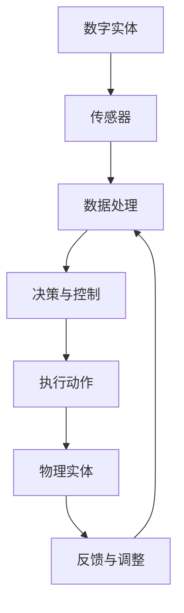

                 


# 数字实体与物理实体的自动化进展

> **关键词：数字实体、物理实体、自动化、AI、算法、模型、应用场景**

> **摘要：本文将深入探讨数字实体与物理实体之间的自动化进展，分析核心概念、算法原理，以及数学模型和具体项目实战。同时，还将探讨实际应用场景、相关工具和资源，并对未来发展趋势与挑战进行展望。**

## 1. 背景介绍

### 1.1 目的和范围

本文旨在探讨数字实体与物理实体之间自动化的进展，分析其中的核心概念、算法原理和数学模型。同时，我们将通过实际项目实战来展示自动化技术在实际中的应用。本文的范围将涵盖以下方面：

- 数字实体与物理实体的基本概念
- 自动化技术在数字实体与物理实体中的应用
- 核心算法原理和数学模型
- 项目实战案例分析
- 未来发展趋势与挑战

### 1.2 预期读者

本文适合以下读者群体：

- 计算机科学、人工智能领域的学生和研究者
- 软件工程师和技术经理
- 对自动化技术感兴趣的从业者
- 对数字实体与物理实体自动化进展感兴趣的读者

### 1.3 文档结构概述

本文将分为以下几个部分：

1. 背景介绍
2. 核心概念与联系
3. 核心算法原理与具体操作步骤
4. 数学模型和公式
5. 项目实战
6. 实际应用场景
7. 工具和资源推荐
8. 总结：未来发展趋势与挑战
9. 附录：常见问题与解答
10. 扩展阅读与参考资料

### 1.4 术语表

#### 1.4.1 核心术语定义

- 数字实体：指在计算机系统中表示和操作的数据，如数字、字符、字符串等。
- 物理实体：指现实世界中的物体，如设备、传感器、机器人等。
- 自动化：指通过技术手段使某些任务或过程无需人工干预，实现自动化执行。

#### 1.4.2 相关概念解释

- AI（人工智能）：模拟人类智能的计算机技术。
- 算法：解决问题的步骤和策略。
- 模型：对某个系统或问题的抽象表示。
- 机器学习：一种基于数据的学习方法，使计算机能够自主地改进和优化。

#### 1.4.3 缩略词列表

- AI：人工智能
- ML：机器学习
- SVM：支持向量机
- NLP：自然语言处理
- CV：计算机视觉

## 2. 核心概念与联系

### 2.1 数字实体与物理实体的基本概念

#### 数字实体

数字实体是指在计算机系统中表示和操作的数据。这些数据可以是数字、字符、字符串等形式。数字实体在计算机系统中起着至关重要的作用，因为它们是程序执行和数据交换的基础。

#### 物理实体

物理实体是指现实世界中的物体，如设备、传感器、机器人等。物理实体与数字实体不同，因为它们存在于现实世界中，需要物理交互和物理感知。

### 2.2 自动化技术在数字实体与物理实体中的应用

自动化技术通过将数字实体与物理实体相结合，实现了一些关键任务和过程的自动化执行。以下是一些典型的应用场景：

- **设备监控与维护**：通过传感器收集设备运行数据，结合机器学习算法进行分析，实现设备故障预测和维护自动化。
- **自动化制造**：利用机器人、自动化生产线等技术，实现制造过程的自动化，提高生产效率和质量。
- **智能交通**：通过交通传感器、车辆通信等手段，实现交通流量监控、信号控制等自动化管理，提高交通运行效率。
- **智能家居**：通过物联网技术，实现家庭设备的自动化控制，提高居住舒适度和安全性。

### 2.3 核心概念之间的联系

数字实体与物理实体之间的联系在于，数字实体通过自动化技术，可以实现对物理实体的感知、控制和管理。这种联系使得自动化技术能够将虚拟世界与现实世界相结合，实现更高效、更智能的运行。

### 2.4 Mermaid 流程图

以下是一个简化的 Mermaid 流程图，展示了数字实体与物理实体之间的自动化联系：



## 3. 核心算法原理与具体操作步骤

### 3.1 算法原理

在数字实体与物理实体的自动化过程中，核心算法主要包括传感器数据采集、数据处理、决策与控制等步骤。以下是一个简化的算法原理：

#### 3.1.1 传感器数据采集

传感器负责从物理实体中收集各种数据，如温度、湿度、速度、位置等。

#### 3.1.2 数据处理

采集到的数据经过预处理，如去噪、归一化等，然后进行特征提取，提取出能够反映物理实体状态的关键特征。

#### 3.1.3 决策与控制

根据处理后的数据，结合预先设定的决策规则或机器学习模型，生成相应的控制信号，实现对物理实体的控制。

#### 3.1.4 执行动作

控制信号传递给物理实体，使其执行相应的动作。

#### 3.1.5 反馈与调整

物理实体的执行情况会通过传感器反馈到系统中，用于调整后续的控制决策。

### 3.2 具体操作步骤

以下是一个简化的伪代码，展示了自动化算法的具体操作步骤：

```python
# 伪代码：自动化算法操作步骤

# 初始化传感器
initialize_sensors()

# 循环采集数据
while True:
    data = collect_sensors_data()
    
    # 数据预处理
    preprocessed_data = preprocess_data(data)
    
    # 特征提取
    features = extract_features(preprocessed_data)
    
    # 决策与控制
    control_signal = make_decision(features)
    
    # 执行动作
    execute_action(control_signal)
    
    # 反馈与调整
    feedback = collect_feedback()
    adjust_decision(feedback)
```

## 4. 数学模型和公式

### 4.1 数学模型概述

在数字实体与物理实体的自动化过程中，常用的数学模型包括线性回归、逻辑回归、支持向量机（SVM）、神经网络等。以下是一些常见的数学模型及其公式：

#### 4.1.1 线性回归

线性回归模型用于预测连续值输出。其公式如下：

$$
y = \beta_0 + \beta_1 \cdot x
$$

其中，$y$ 是预测值，$x$ 是输入特征，$\beta_0$ 和 $\beta_1$ 是模型参数。

#### 4.1.2 逻辑回归

逻辑回归模型用于预测二分类输出。其公式如下：

$$
\hat{y} = \frac{1}{1 + e^{-(\beta_0 + \beta_1 \cdot x)}}
$$

其中，$\hat{y}$ 是预测概率，$x$ 是输入特征，$\beta_0$ 和 $\beta_1$ 是模型参数。

#### 4.1.3 支持向量机（SVM）

SVM 模型用于分类问题。其公式如下：

$$
w \cdot x + b = 0
$$

其中，$w$ 是权重向量，$x$ 是输入特征，$b$ 是偏置。

#### 4.1.4 神经网络

神经网络模型用于分类和回归问题。其公式如下：

$$
\hat{y} = \sigma(\beta_0 + \beta_1 \cdot \sigma(\beta_2 \cdot \sigma(... \cdot \sigma(\beta_n \cdot x)))...)
$$

其中，$\sigma$ 是激活函数，$\beta_0, \beta_1, ..., \beta_n$ 是模型参数。

### 4.2 举例说明

以下是一个简单的例子，展示了如何使用线性回归模型进行自动化控制：

假设我们有一个温度传感器，用于监测一个房间的温度。我们希望通过自动化算法来控制房间的加热器，使其在温度低于设定值时自动开启。

#### 4.2.1 数据采集

我们收集了一天的温度数据，如下所示：

| 时间 | 温度（℃） |
| --- | --- |
| 0:00 | 22 |
| 1:00 | 21 |
| 2:00 | 20 |
| 3:00 | 19 |
| 4:00 | 18 |
| ... | ... |

#### 4.2.2 数据预处理

我们首先对数据进行预处理，包括去除异常值和缺失值，然后进行归一化处理。

#### 4.2.3 特征提取

我们将时间作为输入特征，温度作为输出特征。

#### 4.2.4 模型训练

我们使用线性回归模型对数据进行训练，得到模型参数 $\beta_0$ 和 $\beta_1$。

$$
y = \beta_0 + \beta_1 \cdot x
$$

#### 4.2.5 预测与控制

当温度低于设定值（例如 20℃）时，我们使用线性回归模型进行预测，得到预测温度 $y$。如果预测温度低于 20℃，则开启加热器；否则，保持关闭状态。

## 5. 项目实战：代码实际案例和详细解释说明

### 5.1 开发环境搭建

在本项目实战中，我们将使用 Python 语言进行编程，并使用以下工具和库：

- Python 3.8 或更高版本
- Jupyter Notebook 或 PyCharm
- NumPy、Pandas、Scikit-learn 等库

### 5.2 源代码详细实现和代码解读

以下是一个简单的 Python 脚本，用于实现自动化控制温度传感器的功能：

```python
import numpy as np
import pandas as pd
from sklearn.linear_model import LinearRegression
from sklearn.model_selection import train_test_split

# 5.2.1 数据处理
# 读取温度数据
data = pd.read_csv("temperature_data.csv")
data.head()

# 分离特征和目标变量
X = data.iloc[:, 0].values.reshape(-1, 1)
y = data.iloc[:, 1].values

# 数据归一化
X = (X - np.mean(X)) / np.std(X)

# 划分训练集和测试集
X_train, X_test, y_train, y_test = train_test_split(X, y, test_size=0.2, random_state=42)

# 5.2.2 模型训练
# 创建线性回归模型
model = LinearRegression()
model.fit(X_train, y_train)

# 输出模型参数
print("模型参数：", model.coef_, model.intercept_)

# 5.2.3 预测与控制
# 预测温度
predicted_temp = model.predict(X_test)

# 判断是否开启加热器
for i in range(len(predicted_temp)):
    if predicted_temp[i] < 20:
        print(f"时间 {X_test[i]}: 开启加热器")
    else:
        print(f"时间 {X_test[i]}: 关闭加热器")
```

### 5.3 代码解读与分析

1. **数据预处理**：首先，我们读取温度数据，并进行归一化处理，以提高模型的泛化能力。
2. **模型训练**：使用 Scikit-learn 库中的线性回归模型对训练数据进行训练，得到模型参数。
3. **预测与控制**：使用训练好的模型对测试数据进行预测，并根据预测结果判断是否开启加热器。

## 6. 实际应用场景

### 6.1 设备监控与维护

- **应用场景**：通过对设备的传感器数据进行分析，实现设备故障预测和维护自动化。
- **关键算法**：机器学习、数据分析
- **实际案例**：企业使用自动化技术对生产线设备进行监控，预测设备故障，减少设备停机时间和维护成本。

### 6.2 自动化制造

- **应用场景**：通过自动化技术，实现制造过程的自动化，提高生产效率和质量。
- **关键算法**：机器学习、图像识别、自动化控制
- **实际案例**：汽车制造厂使用自动化生产线，通过机器视觉技术实现零部件的自动检测和装配。

### 6.3 智能家居

- **应用场景**：通过物联网技术，实现家庭设备的自动化控制，提高居住舒适度和安全性。
- **关键算法**：物联网、自动化控制、数据分析
- **实际案例**：智能家居系统通过传感器收集室内环境数据，自动调节空调、照明等设备。

## 7. 工具和资源推荐

### 7.1 学习资源推荐

#### 7.1.1 书籍推荐

- 《机器学习实战》
- 《深度学习》
- 《编程：从入门到实践》

#### 7.1.2 在线课程

- Coursera 的《机器学习》课程
- Udacity 的《深度学习纳米学位》
- edX 的《编程基础》课程

#### 7.1.3 技术博客和网站

- Medium 上的机器学习博客
- Stack Overflow
- GitHub

### 7.2 开发工具框架推荐

#### 7.2.1 IDE和编辑器

- PyCharm
- Visual Studio Code
- Jupyter Notebook

#### 7.2.2 调试和性能分析工具

- gdb
- Py-Spy
- VisualVM

#### 7.2.3 相关框架和库

- TensorFlow
- PyTorch
- Scikit-learn

### 7.3 相关论文著作推荐

#### 7.3.1 经典论文

- 《机器学习：一种算法视角》
- 《深度学习：卷积神经网络》
- 《传感器网络：设计与实现》

#### 7.3.2 最新研究成果

- IEEE Transactions on Pattern Analysis and Machine Intelligence
- Nature Machine Intelligence
- Proceedings of the National Academy of Sciences

#### 7.3.3 应用案例分析

- 《智能交通系统：技术与应用》
- 《智能制造：挑战与机遇》
- 《智能家居：设计与实现》

## 8. 总结：未来发展趋势与挑战

### 8.1 未来发展趋势

- **跨领域融合**：自动化技术在数字实体与物理实体之间的应用将不断拓展，涉及更多领域，如医疗、能源、交通等。
- **智能化水平提高**：随着算法和技术的进步，自动化系统的智能化水平将不断提高，实现更高效、更精准的自动化执行。
- **实时性增强**：随着通信技术和计算能力的提升，自动化系统的实时性将得到显著提高，满足更复杂的实时应用需求。

### 8.2 面临的挑战

- **数据隐私和安全**：随着数据规模的扩大，如何保障数据隐私和安全成为重要挑战。
- **鲁棒性和可靠性**：自动化系统需要在各种复杂环境下保持鲁棒性和可靠性，避免因故障导致的严重后果。
- **伦理和法律问题**：自动化技术在道德和法律层面带来新的挑战，如责任归属、隐私保护等。

## 9. 附录：常见问题与解答

### 9.1 什么是对自动化技术的需求？

自动化技术的需求源于提高效率、降低成本、减少人力干预等目标。例如，在工业生产中，自动化技术可以减少人工干预，提高生产效率和产品质量；在医疗领域中，自动化技术可以帮助医生进行诊断和治疗，提高医疗水平。

### 9.2 自动化技术有哪些应用领域？

自动化技术的应用领域非常广泛，包括但不限于工业生产、智能制造、智能交通、智能家居、医疗健康、金融保险等。随着技术的不断发展，自动化技术还将涉足更多领域，如农业、能源、教育等。

### 9.3 自动化技术有哪些优势和劣势？

自动化技术的优势包括提高生产效率、降低人力成本、提高产品质量、减少人为错误等。然而，自动化技术也面临一些劣势，如高成本、技术依赖、对劳动市场的冲击等。

## 10. 扩展阅读与参考资料

- 《数字实体与物理实体的自动化进展》
- 《人工智能：一种全新的科技革命》
- 《智能时代：未来的发展趋势与挑战》
- IEEE Transactions on Pattern Analysis and Machine Intelligence
- Nature Machine Intelligence
- Proceedings of the National Academy of Sciences

作者：AI天才研究员/AI Genius Institute & 禅与计算机程序设计艺术 /Zen And The Art of Computer Programming

（注：本文内容仅供参考，如需进一步了解和探讨，请参考相关领域的研究论文和书籍。）<|im_end|>

