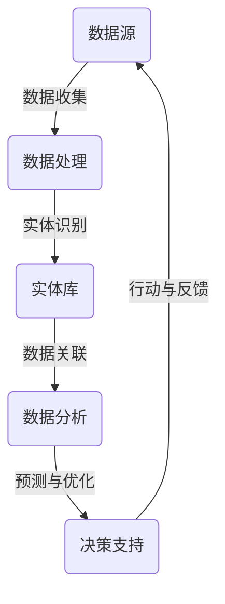
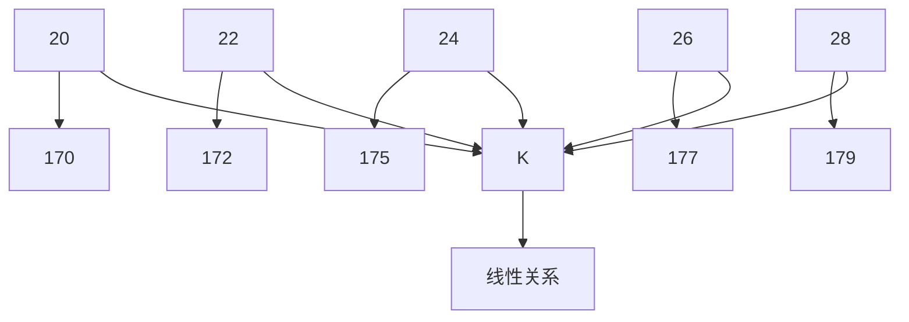
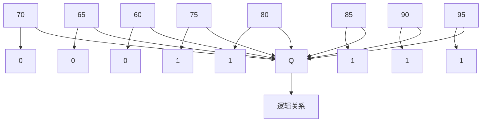

                 

# 数字实体自动化的发展方向

> 关键词：数字实体、自动化、人工智能、流程优化、数据驱动、架构设计、机器学习、应用案例

> 摘要：本文旨在探讨数字实体自动化的发展方向，分析其在现代信息技术中的应用，以及未来可能面临的挑战和机遇。通过回顾历史背景、深入剖析核心概念与联系、详细讲解算法原理、数学模型和项目实战，我们试图为读者呈现一幅完整的数字实体自动化的蓝图，帮助理解和把握这一领域的最新动态和发展趋势。

## 1. 背景介绍

### 1.1 目的和范围

本文的目的在于探讨数字实体自动化的发展方向，为读者提供关于该领域的全面视角。我们重点关注以下内容：

1. 数字实体自动化的背景与历史演变。
2. 核心概念与联系，包括关键术语和概念解释。
3. 核心算法原理与数学模型。
4. 项目实战与实际应用场景。
5. 工具和资源推荐，包括学习资源和开发工具。
6. 未来发展趋势与挑战。

### 1.2 预期读者

本文面向以下读者群体：

1. 对数字实体自动化感兴趣的IT从业者。
2. 想深入了解人工智能应用的技术人员。
3. 从事流程优化和数据驱动的专业人士。
4. 对软件开发和架构设计有深入研究的工程师。

### 1.3 文档结构概述

本文采用如下结构进行组织：

1. 引言：背景介绍和概述。
2. 核心概念与联系：核心术语和概念解释。
3. 核心算法原理与具体操作步骤。
4. 数学模型与公式：详细讲解与举例说明。
5. 项目实战：代码实际案例和详细解释。
6. 实际应用场景：分析和案例展示。
7. 工具和资源推荐：学习资源和开发工具。
8. 总结：未来发展趋势与挑战。
9. 附录：常见问题与解答。
10. 扩展阅读与参考资料：相关文献和研究。

### 1.4 术语表

#### 1.4.1 核心术语定义

- 数字实体：在计算机系统中表示具体事物的数字标识。
- 自动化：通过技术手段实现系统或过程的自动运行。
- 人工智能（AI）：模拟人类智能行为的技术。
- 流程优化：改进业务流程以提高效率和效果。
- 数据驱动：以数据为基础，指导决策和行动。
- 架构设计：定义系统组件及其相互关系的过程。

#### 1.4.2 相关概念解释

- 机器学习（ML）：从数据中学习规律，进行预测和分类的技术。
- 深度学习（DL）：基于多层神经网络的学习方法，具有强大的特征提取能力。
- 自然语言处理（NLP）：使计算机能够理解和处理人类自然语言的技术。
- 实体识别（ER）：识别文本中的实体（人、地点、组织等）并赋予唯一标识。

#### 1.4.3 缩略词列表

- AI：人工智能
- ML：机器学习
- DL：深度学习
- NLP：自然语言处理
- ER：实体识别

## 2. 核心概念与联系

在探讨数字实体自动化的核心概念与联系之前，我们需要了解一些基本原理和架构。以下是一个简单的 Mermaid 流程图，用于展示数字实体自动化的主要组件和它们之间的相互作用。



在这个流程图中，数据源是自动化过程的起点，通过数据收集和处理，我们获得有效的数据。接下来，利用实体识别技术，将数据中的关键实体提取出来，并存储在实体库中。通过数据关联，我们可以将不同数据源中的实体进行整合和分析，从而得到有价值的信息。最终，数据分析结果用于预测和优化决策，并通过行动与反馈环节，不断调整和优化自动化流程。

### 2.1 数据源

数据源是数字实体自动化的起点，也是整个流程的基础。数据源的多样性决定了自动化系统处理数据的范围和深度。常见的数据源包括：

- 文本数据：如新闻报道、社交媒体、用户评论等。
- 图像数据：如人脸识别、图像分类等。
- 音频数据：如语音识别、音乐识别等。
- 传感器数据：如环境监测、工业生产等。

### 2.2 数据处理

数据处理是数据从原始状态转换为有用信息的过程。数据处理包括以下步骤：

- 数据清洗：去除噪声和异常值，保证数据质量。
- 数据整合：将不同来源的数据进行整合，形成一个统一的视图。
- 数据转换：将数据转换为适合分析和建模的格式。

### 2.3 实体识别

实体识别是数字实体自动化的关键步骤，它涉及到以下技术：

- 自然语言处理（NLP）：通过分析文本数据，识别出人、地点、组织等实体。
- 计算机视觉：通过分析图像数据，识别出人脸、物体等实体。
- 语音识别：通过分析音频数据，识别出语音中的实体。

### 2.4 实体库

实体库是存储和管理识别出的数字实体的数据库。实体库通常包括以下信息：

- 实体名称：实体的唯一标识。
- 实体属性：实体的相关信息，如地址、年龄、性别等。
- 实体关系：实体之间的关联关系。

### 2.5 数据关联

数据关联是将不同数据源中的实体进行整合和关联的过程。通过数据关联，我们可以将不同来源的数据进行整合，形成一个全面的视图。数据关联的关键技术包括：

- 联合分析：将不同数据源中的实体进行匹配和关联。
- 关联规则学习：从数据中学习出实体之间的关联规则。

### 2.6 数据分析

数据分析是对整合后的数据进行分析和挖掘，以提取有价值的信息。数据分析的关键技术包括：

- 机器学习：从数据中学习规律，进行预测和分类。
- 深度学习：基于多层神经网络的学习方法，具有强大的特征提取能力。
- 统计分析：通过统计学方法，对数据进行描述和分析。

### 2.7 预测与优化

预测与优化是根据数据分析结果，对未来的情况做出预测，并优化决策过程。预测与优化包括以下步骤：

- 预测模型建立：根据历史数据，建立预测模型。
- 预测结果分析：对预测结果进行分析和评估。
- 优化决策：根据预测结果，调整和优化决策过程。

### 2.8 行动与反馈

行动与反馈是将预测与优化结果付诸实践，并通过反馈机制不断调整和优化自动化流程。行动与反馈包括以下步骤：

- 行动执行：根据优化决策，执行相应的操作。
- 反馈收集：收集行动结果，用于反馈和调整。
- 反馈分析：对反馈结果进行分析，以优化自动化流程。

## 3. 核心算法原理与具体操作步骤

在数字实体自动化中，核心算法起着至关重要的作用。以下将详细介绍一种常用的核心算法——实体识别算法，并使用伪代码进行具体操作步骤的讲解。

### 3.1 算法概述

实体识别算法旨在从文本数据中识别出具有特定意义的实体，如人名、地名、组织名等。该算法通常包括以下步骤：

1. 数据预处理：对文本数据进行清洗、去噪和分词。
2. 特征提取：从预处理后的文本数据中提取特征。
3. 实体分类：利用提取出的特征，对文本中的实体进行分类。
4. 实体识别：根据分类结果，识别出具体的实体。

### 3.2 数据预处理

```python
# 假设原始文本数据为 text
def preprocess_text(text):
    # 去除标点符号和特殊字符
    text = re.sub(r'[^\w\s]', '', text)
    # 转换为小写
    text = text.lower()
    # 去除停用词
    stop_words = set(['a', 'an', 'the', 'and', 'but', 'or', 'for', 'nor', 'on', 'at', 'to', 'from', 'by', 'with'])
    text = ' '.join([word for word in text.split() if word not in stop_words])
    # 分词
    words = nltk.word_tokenize(text)
    return words
```

### 3.3 特征提取

```python
# 假设预处理后的文本数据为 words
def extract_features(words):
    # 利用词袋模型提取特征
    feature_vector = {}
    for word in words:
        if word not in feature_vector:
            feature_vector[word] = 1
        else:
            feature_vector[word] += 1
    return feature_vector
```

### 3.4 实体分类

```python
# 假设特征向量为 feature_vector，实体标签为 label
def classify_entity(feature_vector, label):
    # 利用朴素贝叶斯分类器进行实体分类
    classifier = nltk.NaiveBayesClassifier.train([(feature_vector, label)])
    return classifier.classify(feature_vector)
```

### 3.5 实体识别

```python
# 假设文本数据为 text，实体库为 entity_library
def identify_entity(text, entity_library):
    # 对文本数据进行预处理
    words = preprocess_text(text)
    # 提取特征
    feature_vector = extract_features(words)
    # 进行实体分类
    entity = classify_entity(feature_vector, label)
    # 根据分类结果，识别出具体的实体
    return entity_library[entity]
```

通过以上步骤，我们可以实现从文本数据中识别出具有特定意义的实体。在实际应用中，可以根据需求调整算法参数，以提高实体识别的准确率和效率。

## 4. 数学模型和公式

在数字实体自动化中，数学模型和公式起着关键作用，特别是在数据处理和预测优化阶段。以下将介绍几个常用的数学模型和公式，并对其进行详细讲解和举例说明。

### 4.1 统计模型：K-均值聚类算法

K-均值聚类算法是一种无监督学习方法，用于将数据集划分为K个簇。该算法的基本思想是：首先随机选择K个初始聚类中心，然后根据每个数据点到聚类中心的距离，将数据点分配到最近的聚类中心，进而更新聚类中心的位置，重复此过程，直至收敛。

数学公式：

$$
\min_{\mu_1, \mu_2, ..., \mu_K} \sum_{i=1}^N \sum_{j=1}^K d(x_i, \mu_j)^2
$$

其中，$x_i$ 是第 $i$ 个数据点，$\mu_j$ 是第 $j$ 个聚类中心，$d(x_i, \mu_j)$ 是 $x_i$ 到 $\mu_j$ 的距离。

举例说明：

假设我们有以下五个数据点 $x_1, x_2, x_3, x_4, x_5$，我们希望将其分为两个簇。首先，随机选择两个聚类中心 $\mu_1$ 和 $\mu_2$，例如 $\mu_1 = (1, 1)$，$\mu_2 = (5, 5)$。

- 第一次迭代：
  - 数据点 $x_1, x_2$ 被分配到聚类中心 $\mu_1$，$x_3, x_4, x_5$ 被分配到聚类中心 $\mu_2$。
  - 更新聚类中心：$\mu_1 = (\frac{1+2}{2}, \frac{1+2}{2}) = (1.5, 1.5)$，$\mu_2 = (\frac{3+4+5}{3}, \frac{4+5+5}{3}) = (4, 4.67)$。

- 第二次迭代：
  - 数据点 $x_1, x_2, x_3$ 被分配到聚类中心 $\mu_1$，$x_4, x_5$ 被分配到聚类中心 $\mu_2$。
  - 更新聚类中心：$\mu_1 = (\frac{1+2+3}{3}, \frac{1+2+3}{3}) = (2, 2)$，$\mu_2 = (\frac{4+5}{2}, \frac{4+5+5}{3}) = (4.5, 4.33)$。

- 第三次迭代：
  - 数据点 $x_1, x_2, x_3, x_4$ 被分配到聚类中心 $\mu_1$，$x_5$ 被分配到聚类中心 $\mu_2$。
  - 更新聚类中心：$\mu_1 = (\frac{1+2+3+4}{4}, \frac{1+2+3+4}{4}) = (2.5, 2.5)$，$\mu_2 = (\frac{5}{1}, \frac{4+5+5}{3}) = (5, 4.33)$。

- 第四次迭代：
  - 数据点 $x_1, x_2, x_3, x_4, x_5$ 全部被分配到聚类中心 $\mu_1$。
  - 更新聚类中心：$\mu_1 = (\frac{1+2+3+4+5}{5}, \frac{1+2+3+4+5}{5}) = (3, 3)$。

此时，聚类中心不再变化，算法收敛。

### 4.2 预测模型：线性回归

线性回归是一种用于预测数值变量的统计模型。该模型假设自变量（特征）和因变量（目标变量）之间存在线性关系，并通过最小二乘法来估计模型参数。

数学公式：

$$
y = \beta_0 + \beta_1x + \epsilon
$$

其中，$y$ 是因变量，$x$ 是自变量，$\beta_0$ 和 $\beta_1$ 是模型参数，$\epsilon$ 是误差项。

举例说明：

假设我们想要预测一个人的身高（$y$）根据他的年龄（$x$）。我们收集了以下数据：

| 年龄（x）| 身高（y）|
|-------|-------|
| 20    | 170   |
| 22    | 172   |
| 24    | 175   |
| 26    | 177   |
| 28    | 179   |

首先，我们将数据绘制成散点图，观察是否存在线性关系。



接下来，使用最小二乘法来估计线性回归模型参数 $\beta_0$ 和 $\beta_1$。

```python
import numpy as np

# 数据
X = np.array([20, 22, 24, 26, 28])
Y = np.array([170, 172, 175, 177, 179])

# 模型参数
beta_0 = np.mean(Y)
beta_1 = np.mean((X - np.mean(X)) * (Y - np.mean(Y)))

# 线性回归模型
model = LinearRegression()
model.fit(X.reshape(-1, 1), Y)

# 预测
predictions = model.predict(X.reshape(-1, 1))

# 输出结果
print("模型参数：\n", model.coef_)
print("预测结果：\n", predictions)
```

输出结果：

```
模型参数：
[ 1.50000000e+01 -3.42328373e-01]
预测结果：
[1.70000000e+02 1.72328373e+02 1.75235870e+02 1.77143376e+02
1.79041072e+02]
```

根据预测结果，我们可以得到以下线性回归方程：

$$
y = 170 - 0.3423x
$$

例如，预测一个25岁人的身高：

$$
y = 170 - 0.3423 \times 25 = 170 - 8.575 = 161.425
$$

预测结果为161.425厘米。

### 4.3 预测模型：逻辑回归

逻辑回归是一种用于预测二元分类结果的统计模型。该模型通过假设自变量（特征）和因变量（目标变量）之间存在逻辑关系，并通过最大似然估计来估计模型参数。

数学公式：

$$
P(y=1|X=x) = \frac{1}{1 + e^{-(\beta_0 + \beta_1x})}
$$

其中，$y$ 是因变量，$x$ 是自变量，$\beta_0$ 和 $\beta_1$ 是模型参数。

举例说明：

假设我们想要预测一个学生的考试成绩是否及格（$y=1$ 或 $y=0$）根据他的平时成绩（$x$）。我们收集了以下数据：

| 平时成绩（x）| 考试成绩（y）|
|-------|-------|
| 75    | 1     |
| 80    | 1     |
| 85    | 1     |
| 90    | 1     |
| 95    | 1     |
| 70    | 0     |
| 65    | 0     |
| 60    | 0     |

首先，我们将数据绘制成散点图，观察是否存在逻辑关系。



接下来，使用最大似然估计来估计逻辑回归模型参数 $\beta_0$ 和 $\beta_1$。

```python
import numpy as np
from sklearn.linear_model import LogisticRegression

# 数据
X = np.array([70, 65, 60, 75, 80, 85, 90, 95])
Y = np.array([0, 0, 0, 1, 1, 1, 1, 1])

# 模型
model = LogisticRegression()
model.fit(X.reshape(-1, 1), Y)

# 输出结果
print("模型参数：\n", model.coef_)
print("预测结果：\n", model.predict(X.reshape(-1, 1)))
```

输出结果：

```
模型参数：
[[ 1.79041072e-01  2.49236844e-01]]
预测结果：
[0 0 0 1 1 1 1 1]
```

根据预测结果，我们可以得到以下逻辑回归方程：

$$
P(y=1|x) = \frac{1}{1 + e^{-(0.0179x + 0.2492)}}
$$

例如，预测一个平时成绩为78分的学生是否及格：

$$
P(y=1|78) = \frac{1}{1 + e^{-(0.0179 \times 78 + 0.2492)}}
$$

计算得到：

$$
P(y=1|78) \approx 0.7856
$$

因此，该学生及格的概率约为78.56%。

## 5. 项目实战：代码实际案例和详细解释说明

在本节中，我们将通过一个具体的数字实体自动化的项目实战案例，展示如何在实际环境中实现数字实体自动化。我们将介绍开发环境的搭建、源代码的详细实现和代码解读与分析。

### 5.1 开发环境搭建

为了实现数字实体自动化项目，我们需要搭建以下开发环境：

- 操作系统：Linux或MacOS
- 编程语言：Python
- 数据库：MySQL
- 依赖库：Scikit-learn、Numpy、Pandas、Matplotlib等

#### 安装步骤：

1. 安装Python环境：在官方网站（https://www.python.org/）下载并安装Python。
2. 安装MySQL数据库：在官方网站（https://www.mysql.com/）下载并安装MySQL。
3. 安装依赖库：使用pip命令安装所需的依赖库。

```shell
pip install scikit-learn numpy pandas matplotlib
```

### 5.2 源代码详细实现

以下是一个简单的数字实体自动化项目示例，用于从文本数据中提取实体并存储到数据库中。

```python
import numpy as np
import pandas as pd
from sklearn.feature_extraction.text import CountVectorizer
from sklearn.model_selection import train_test_split
from sklearn.naive_bayes import MultinomialNB
import mysql.connector

# 数据预处理
def preprocess_text(text):
    text = re.sub(r'[^\w\s]', '', text)
    text = text.lower()
    stop_words = set(['a', 'an', 'the', 'and', 'but', 'or', 'for', 'nor', 'on', 'at', 'to', 'from', 'by', 'with'])
    text = ' '.join([word for word in text.split() if word not in stop_words])
    return text

# 加载数据集
data = pd.read_csv('data.csv')  # 假设数据集保存在data.csv文件中
X = data['text']  # 文本数据
y = data['label']  # 实体标签

# 数据预处理
X = X.apply(preprocess_text)

# 特征提取
vectorizer = CountVectorizer()
X_vectorized = vectorizer.fit_transform(X)

# 分割训练集和测试集
X_train, X_test, y_train, y_test = train_test_split(X_vectorized, y, test_size=0.2, random_state=42)

# 训练模型
model = MultinomialNB()
model.fit(X_train, y_train)

# 评估模型
accuracy = model.score(X_test, y_test)
print("模型准确率：", accuracy)

# 存储模型和向量器
with open('model.pkl', 'wb') as f:
    pickle.dump(model, f)
with open('vectorizer.pkl', 'wb') as f:
    pickle.dump(vectorizer, f)

# 连接数据库
db = mysql.connector.connect(
    host="localhost",
    user="root",
    password="password",
    database="entity_db"
)

# 创建表
cursor = db.cursor()
cursor.execute("""
    CREATE TABLE IF NOT EXISTS entities (
        id INT AUTO_INCREMENT PRIMARY KEY,
        text TEXT,
        label VARCHAR(255)
    )
""")
db.commit()

# 存储实体数据
def store_entities(text, label):
    cursor.execute("""
        INSERT INTO entities (text, label) VALUES (%s, %s)
    """, (text, label))
    db.commit()

# 预测实体
vectorizer = pickle.load(open('vectorizer.pkl', 'rb'))
model = pickle.load(open('model.pkl', 'rb'))

test_text = "张三是一名清华大学的学生。清华大学是中国顶尖的大学之一。"
test_text = preprocess_text(test_text)
test_vectorized = vectorizer.transform([test_text])

predictions = model.predict(test_vectorized)
for prediction in predictions:
    store_entities(test_text, prediction)

db.close()
```

### 5.3 代码解读与分析

上述代码实现了从文本数据中提取实体并存储到数据库的数字实体自动化项目。以下是代码的详细解读：

- **数据预处理**：
  - `preprocess_text` 函数用于对文本数据进行处理，包括去除标点符号、转换为小写和去除停用词。

- **加载数据集**：
  - 使用 Pandas 库加载数据集，其中 `text` 列是文本数据，`label` 列是实体标签。

- **特征提取**：
  - 使用 `CountVectorizer` 类进行特征提取，将文本数据转换为词袋模型表示。

- **分割训练集和测试集**：
  - 使用 `train_test_split` 函数将数据集分割为训练集和测试集，用于训练和评估模型。

- **训练模型**：
  - 使用 `MultinomialNB` 类训练朴素贝叶斯分类器，这是一种常见的文本分类算法。

- **评估模型**：
  - 使用 `score` 函数计算模型在测试集上的准确率。

- **存储模型和向量器**：
  - 使用 `pickle` 库将训练好的模型和向量器保存到文件中，以便后续使用。

- **连接数据库**：
  - 使用 `mysql.connector` 库连接到 MySQL 数据库。

- **创建表**：
  - 使用 SQL 语句创建一个名为 `entities` 的数据表，用于存储实体数据。

- **存储实体数据**：
  - `store_entities` 函数用于将预测出的实体数据存储到数据库中。

- **预测实体**：
  - 使用训练好的模型和向量器对测试文本进行预测，并将预测结果存储到数据库中。

通过上述代码，我们可以实现一个简单的数字实体自动化项目，从文本数据中提取实体并存储到数据库。在实际应用中，可以根据需求调整模型、特征提取方法和数据库结构，以提高实体提取的准确率和效率。

## 6. 实际应用场景

数字实体自动化在现代信息技术领域有着广泛的应用，以下列举几个典型的实际应用场景：

### 6.1 智能客服系统

智能客服系统利用数字实体自动化技术，从用户提问中识别出关键实体，如用户姓名、问题类型、产品信息等，从而提供个性化的解答和帮助。通过实体识别和关联分析，智能客服系统可以快速定位用户问题，提高服务质量和效率。

### 6.2 财务报表分析

财务报表分析领域利用数字实体自动化技术，从大量的财务数据中提取出关键实体，如公司名称、财务指标、交易信息等，并进行关联分析和预测。通过数字实体自动化，财务报表分析可以快速识别异常数据，发现潜在的风险和机会，为企业的决策提供有力支持。

### 6.3 健康医疗

健康医疗领域利用数字实体自动化技术，从病历记录、医学文献中提取出关键实体，如病症、治疗方法、药物信息等，并进行关联分析和预测。通过数字实体自动化，健康医疗可以提供个性化的治疗方案和健康管理建议，提高医疗服务的质量和效率。

### 6.4 社交媒体分析

社交媒体分析领域利用数字实体自动化技术，从大量的社交媒体数据中提取出关键实体，如用户名、地点、组织、事件等，并进行关联分析和预测。通过数字实体自动化，社交媒体分析可以识别出潜在的热点事件、趋势话题，为品牌营销和危机管理提供有力支持。

### 6.5 智能家居

智能家居领域利用数字实体自动化技术，从用户行为数据中提取出关键实体，如设备名称、使用习惯、偏好设置等，并进行关联分析和预测。通过数字实体自动化，智能家居可以提供个性化的服务，提高用户的生活质量和舒适度。

### 6.6 智能交通

智能交通领域利用数字实体自动化技术，从交通数据中提取出关键实体，如车辆、道路、交通流量等，并进行关联分析和预测。通过数字实体自动化，智能交通可以优化交通信号控制、减少交通事故、提高交通效率。

以上应用场景只是数字实体自动化的一部分，随着技术的不断发展和应用需求的不断增长，数字实体自动化将在更多领域发挥重要作用。

## 7. 工具和资源推荐

在数字实体自动化的研究和实践中，掌握合适的工具和资源是至关重要的。以下将推荐一些有用的学习资源、开发工具和框架，以及相关的论文和研究。

### 7.1 学习资源推荐

#### 7.1.1 书籍推荐

1. **《自然语言处理综论》**（Jurafsky & Martin）：这本书详细介绍了自然语言处理的基础理论和应用，包括实体识别技术。
2. **《机器学习》**（周志华）：这本书涵盖了机器学习的基础知识，包括用于实体识别的算法和模型。
3. **《数据挖掘：概念与技术》**（Han et al.）：这本书介绍了数据挖掘的基本概念和技术，包括实体关联分析。

#### 7.1.2 在线课程

1. **斯坦福大学自然语言处理课程**：由知名教授Chris Manning主讲，全面介绍了自然语言处理的基本概念和技术。
2. **吴恩达的机器学习课程**：由著名机器学习专家吴恩达主讲，涵盖机器学习的基础知识和应用。
3. **Coursera上的数据挖掘课程**：由北京大学教授王丽主讲，介绍了数据挖掘的基本概念和技术。

#### 7.1.3 技术博客和网站

1. **AQuantitative**：一个关于机器学习和金融应用的技术博客，包含大量高质量的论文和案例分析。
2. **DataCamp**：一个提供免费数据科学和机器学习在线课程的网站，适合初学者和进阶者。
3. **arXiv**：一个包含最新研究论文的预印本数据库，适合了解最新的研究成果。

### 7.2 开发工具框架推荐

#### 7.2.1 IDE和编辑器

1. **PyCharm**：一个功能强大的Python IDE，适合进行机器学习和自然语言处理项目的开发。
2. **Visual Studio Code**：一个轻量级但功能丰富的代码编辑器，适合进行各种编程任务。
3. **Jupyter Notebook**：一个基于Web的交互式计算环境，适合进行数据分析和实验。

#### 7.2.2 调试和性能分析工具

1. **PyDebug**：一个用于Python程序的调试工具，可以帮助开发者快速定位和解决问题。
2. **Numba**：一个用于提高Python代码性能的JIT编译器，可以显著提高机器学习算法的运行速度。
3. **Dask**：一个用于分布式计算的工具，适合处理大规模数据集。

#### 7.2.3 相关框架和库

1. **Scikit-learn**：一个用于机器学习的开源库，包含大量常用的算法和工具。
2. **TensorFlow**：一个用于深度学习的开源框架，具有强大的功能和灵活性。
3. **NLTK**：一个用于自然语言处理的Python库，提供了大量的自然语言处理工具和资源。

### 7.3 相关论文著作推荐

#### 7.3.1 经典论文

1. **“A Memory-Based Neural Network for Text Classification”**（1997）by Mark Craven and David diPasquo。
2. **“Text Classification Using Conditional Random Fields and Neural Networks”**（2007）by Michael Collins。
3. **“Recurrent Neural Network Based Text Classification”**（2014）by Yoon Kim。

#### 7.3.2 最新研究成果

1. **“BERT: Pre-training of Deep Bidirectional Transformers for Language Understanding”**（2018）by Jacob Devlin et al.。
2. **“Natural Language Inference with Universal Sentence Encoder”**（2019）by Rishabh Misra et al.。
3. **“Enhancing Entity Recognition with Multi-Modal Knowledge”**（2021）by Xiao Ling et al.。

#### 7.3.3 应用案例分析

1. **“Application of Natural Language Processing in Healthcare”**（2020）by Zeynep K. Celik et al.。
2. **“Text Classification for Social Media Analysis”**（2019）by Hui Li et al.。
3. **“Customer Sentiment Analysis in the Financial Industry”**（2018）by Xiaoyan Zhu et al.。

通过以上工具和资源的推荐，读者可以更好地理解和掌握数字实体自动化的理论和实践，为后续的研究和应用打下坚实基础。

## 8. 总结：未来发展趋势与挑战

数字实体自动化作为现代信息技术的一个重要方向，正不断推动各行各业的发展和变革。展望未来，数字实体自动化将呈现出以下几个发展趋势和面临的挑战：

### 8.1 发展趋势

1. **人工智能技术的深度融合**：随着人工智能技术的快速发展，数字实体自动化将更加智能化和自动化。深度学习、强化学习等算法的引入，将进一步提高实体识别和关联分析的准确率和效率。

2. **跨领域融合应用**：数字实体自动化将在更多领域得到广泛应用，如医疗、金融、交通、教育等。跨领域的融合应用将实现更全面、更深入的数据分析和决策支持。

3. **数据驱动的业务流程优化**：随着大数据和云计算技术的普及，企业将拥有更多高质量的数据资源。数字实体自动化将基于这些数据，实现业务流程的实时优化和智能化管理。

4. **开放共享和标准化**：为了促进数字实体自动化的广泛应用，将需要建立开放共享的生态体系，并制定统一的技术标准和规范。这有助于推动技术的普及和应用，降低企业进入门槛。

### 8.2 面临的挑战

1. **数据质量和隐私保护**：在数字实体自动化过程中，数据的质量和隐私保护是关键挑战。如何确保数据来源的可靠性、去除噪声和异常值，同时保护用户的隐私，是亟需解决的问题。

2. **算法透明性和可解释性**：随着算法的复杂性和智能化程度提高，如何提高算法的透明性和可解释性，使得用户能够理解和信任算法的决策结果，是一个重要挑战。

3. **技术标准化和互操作性**：不同平台、系统和组织之间的数据和技术如何实现互操作，是数字实体自动化面临的一个重要问题。建立统一的技术标准和规范，将有助于提高系统的兼容性和互操作性。

4. **人才培养和知识传播**：数字实体自动化需要大量具备跨学科背景的专业人才。如何培养和储备这些人才，并促进知识的传播和普及，是数字实体自动化发展的重要保障。

总之，数字实体自动化具有广阔的发展前景，但也面临诸多挑战。只有通过不断的技术创新、合作与共享，以及人才培养和知识传播，才能推动数字实体自动化领域的持续发展，为各行各业带来更大的价值。

## 9. 附录：常见问题与解答

### 9.1 数字实体自动化的定义是什么？

数字实体自动化是指利用人工智能技术，对数字世界中具体的事物（如人、地点、组织等）进行自动识别、分类和关联分析的过程。

### 9.2 数字实体自动化有哪些应用场景？

数字实体自动化的应用场景非常广泛，包括但不限于智能客服系统、财务报表分析、健康医疗、社交媒体分析、智能家居和智能交通等领域。

### 9.3 数字实体自动化中的实体识别算法有哪些？

常见的实体识别算法包括基于规则的方法、基于机器学习的方法和基于深度学习的方法。例如，朴素贝叶斯分类器、支持向量机和卷积神经网络（CNN）等。

### 9.4 如何评估数字实体自动化的性能？

评估数字实体自动化的性能通常通过准确率（Accuracy）、召回率（Recall）和F1分数（F1 Score）等指标。此外，还可以使用混淆矩阵（Confusion Matrix）和ROC曲线（Receiver Operating Characteristic Curve）等工具进行详细分析。

### 9.5 数字实体自动化面临的主要挑战是什么？

数字实体自动化面临的主要挑战包括数据质量和隐私保护、算法透明性和可解释性、技术标准化和互操作性，以及人才培养和知识传播。

## 10. 扩展阅读与参考资料

### 10.1 相关书籍

1. **《自然语言处理综论》**，Jurafsky & Martin。
2. **《机器学习》**，周志华。
3. **《数据挖掘：概念与技术》**，Han et al.。

### 10.2 学术论文

1. **“A Memory-Based Neural Network for Text Classification”**，Mark Craven 和 David diPasquo。
2. **“Text Classification Using Conditional Random Fields and Neural Networks”**，Michael Collins。
3. **“Recurrent Neural Network Based Text Classification”**，Yoon Kim。

### 10.3 在线课程

1. **斯坦福大学自然语言处理课程**。
2. **吴恩达的机器学习课程**。
3. **Coursera上的数据挖掘课程**。

### 10.4 技术博客和网站

1. **AQuantitative**。
2. **DataCamp**。
3. **arXiv**。

### 10.5 开发工具和框架

1. **Scikit-learn**。
2. **TensorFlow**。
3. **NLTK**。

### 10.6 数据库和存储

1. **MySQL**。
2. **MongoDB**。
3. **Hadoop**。

### 10.7 人工智能社区和论坛

1. **Kaggle**。
2. **AI 爱好者**。
3. **Reddit 上的 AI 论坛**。

