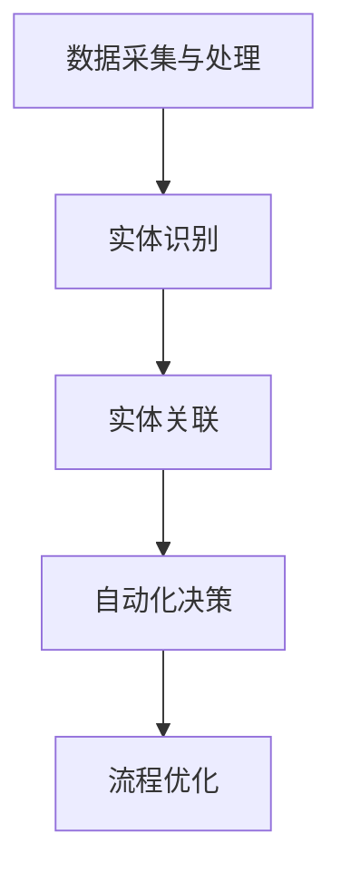
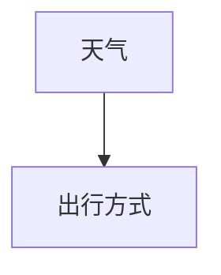

                 

## 数字实体自动化的最新趋势与发展

> **关键词**：数字实体、自动化、AI、大数据、机器学习、流程优化
>
> **摘要**：本文将探讨数字实体自动化的最新趋势与发展，分析其在AI、大数据、机器学习等领域的应用，探讨其核心概念、算法原理、数学模型以及实际应用场景，并推荐相关工具和资源，展望未来发展趋势与挑战。

随着技术的不断进步，数字化和自动化已经成为现代社会的核心驱动力。在这一背景下，数字实体自动化应运而生，成为推动各行业转型升级的重要技术。本文将深入探讨数字实体自动化的最新趋势与发展，旨在为读者提供一个全面、系统的了解。

## 1. 背景介绍

### 1.1 目的和范围

本文旨在探讨数字实体自动化的最新趋势与发展，分析其在各行业的应用，探讨其核心概念、算法原理、数学模型以及实际应用场景，并推荐相关工具和资源。本文主要涉及以下内容：

1. 数字实体自动化的核心概念及其在AI、大数据、机器学习等领域的应用。
2. 数字实体自动化的算法原理及具体操作步骤。
3. 数字实体自动化的数学模型及详细讲解。
4. 数字实体自动化的实际应用场景及案例分析。
5. 数字实体自动化的未来发展趋势与挑战。

### 1.2 预期读者

本文主要面向对数字实体自动化技术感兴趣的读者，包括：

1. 计算机科学和人工智能领域的研究人员。
2. 各行业的技术管理人员和实施人员。
3. 对数字化和自动化技术有深入了解的专业人士。
4. 对未来技术发展趋势有前瞻性的创业者。

### 1.3 文档结构概述

本文结构如下：

1. **背景介绍**：介绍数字实体自动化的背景、目的和范围。
2. **核心概念与联系**：分析数字实体自动化的核心概念、原理和架构。
3. **核心算法原理 & 具体操作步骤**：详细阐述数字实体自动化的算法原理和操作步骤。
4. **数学模型和公式 & 详细讲解 & 举例说明**：讲解数字实体自动化的数学模型和公式，并提供实际案例说明。
5. **项目实战：代码实际案例和详细解释说明**：通过实际代码案例展示数字实体自动化的应用。
6. **实际应用场景**：探讨数字实体自动化在各行业的应用。
7. **工具和资源推荐**：推荐学习资源、开发工具和框架。
8. **总结：未来发展趋势与挑战**：分析数字实体自动化的未来发展趋势和挑战。
9. **附录：常见问题与解答**：解答读者可能遇到的问题。
10. **扩展阅读 & 参考资料**：提供更多相关文献和资料。

### 1.4 术语表

#### 1.4.1 核心术语定义

- **数字实体**：指在计算机系统中表示现实世界中的实体，如人、物品、地点等。
- **自动化**：通过计算机技术和算法，使系统或过程在无人干预的情况下自主运行。
- **AI**：人工智能，指模拟人类智能的技术和方法。
- **大数据**：指数据量巨大、种类繁多、价值密度低的数据集合。
- **机器学习**：一种AI技术，通过算法从数据中学习规律，实现自动识别和预测。
- **流程优化**：通过对流程的改进和优化，提高工作效率和降低成本。

#### 1.4.2 相关概念解释

- **实体识别**：指从数据中识别出具有特定特征的实体。
- **实体链接**：指将同一实体的不同表达方式关联起来，形成一个完整的实体图谱。
- **自动化流程**：指通过计算机技术和算法实现的自动化执行流程。
- **实体图谱**：指基于实体及其关系的可视化表示，用于分析和理解复杂系统。

#### 1.4.3 缩略词列表

- **AI**：人工智能
- **Big Data**：大数据
- **ML**：机器学习
- **DL**：深度学习
- **NLP**：自然语言处理

## 2. 核心概念与联系

数字实体自动化是一个多学科交叉的领域，涉及计算机科学、人工智能、大数据、机器学习等多个方面。为了更好地理解数字实体自动化的核心概念与联系，我们首先需要了解以下几个关键概念。

### 2.1 数字实体

数字实体是指在计算机系统中表示现实世界中的实体，如人、物品、地点等。它们可以通过属性、标签、关系等多种方式在系统中进行表示。数字实体的核心目标是实现对现实世界的数字化建模，以便进行高效的数据处理和分析。

### 2.2 自动化

自动化是指通过计算机技术和算法，使系统或过程在无人干预的情况下自主运行。在数字实体自动化中，自动化主要涉及以下几个方面：

1. **数据采集与处理**：通过传感器、摄像头、数据库等多种方式收集数据，并对其进行预处理，如去噪、归一化等。
2. **实体识别**：利用计算机视觉、自然语言处理等技术识别数字实体，并提取其属性。
3. **实体关联**：通过实体图谱等技术将同一实体的不同表达方式关联起来，形成一个完整的实体图谱。
4. **自动化决策**：利用机器学习、深度学习等技术，根据实体属性和关系进行自动化决策。

### 2.3 AI与大数据

AI和大数据是数字实体自动化的两个重要支柱。AI技术，尤其是机器学习和深度学习，为数字实体自动化提供了强大的数据处理和分析能力。大数据则为数字实体自动化提供了丰富的数据来源，使得系统可以从中学习和发现规律。

在数字实体自动化中，AI和大数据的主要作用如下：

1. **数据挖掘与关联**：利用AI技术从大数据中挖掘有价值的信息，并建立实体之间的关联关系。
2. **预测与优化**：利用大数据和AI技术对实体行为进行预测，并优化流程，提高工作效率。
3. **智能决策**：结合AI技术和大数据分析结果，实现自动化决策，提高决策的准确性和效率。

### 2.4 机器学习与流程优化

机器学习是数字实体自动化的核心算法之一，它通过从数据中学习规律，实现自动化识别和预测。在流程优化方面，机器学习技术可以用于以下几个方面：

1. **流程建模**：利用机器学习技术对现有流程进行建模，发现其中的瓶颈和优化机会。
2. **异常检测**：通过机器学习算法检测流程中的异常情况，提高流程的稳定性和可靠性。
3. **预测性维护**：利用机器学习技术预测设备或系统的故障，实现预测性维护，降低维护成本。
4. **自动化调度**：根据实时数据和历史数据，利用机器学习算法实现自动化调度，提高资源利用率。

### 2.5 实体图谱与关系分析

实体图谱是数字实体自动化中的重要概念，它通过实体及其关系的可视化表示，用于分析和理解复杂系统。实体图谱的主要作用如下：

1. **实体关联**：通过实体图谱建立实体之间的关联关系，实现数据的统一管理和分析。
2. **关系推理**：利用实体图谱中的关系进行推理，发现新的关联和规律。
3. **可视化分析**：通过实体图谱的可视化表示，直观地展示实体及其关系，便于理解和分析。
4. **数据完整性**：通过实体图谱维护数据的完整性，防止数据冗余和错误。

### 2.6 Mermaid 流程图

为了更好地理解数字实体自动化的核心概念和架构，我们可以使用Mermaid流程图进行可视化表示。以下是一个简单的Mermaid流程图示例：



在上述流程图中，A表示数据采集与处理，B表示实体识别，C表示实体关联，D表示自动化决策，E表示流程优化。这些步骤共同构成了数字实体自动化的核心流程。

## 3. 核心算法原理 & 具体操作步骤

数字实体自动化涉及多个核心算法，包括数据采集与处理、实体识别、实体关联、自动化决策等。下面我们将详细阐述这些算法的原理和具体操作步骤。

### 3.1 数据采集与处理

数据采集与处理是数字实体自动化的第一步，也是最重要的一步。在这一步骤中，我们需要从各种数据源（如传感器、摄像头、数据库等）中收集数据，并对数据进行预处理，如去噪、归一化、去重复等。

#### 3.1.1 数据采集

数据采集主要包括以下几种方式：

1. **传感器采集**：通过传感器（如温度传感器、湿度传感器等）实时采集环境数据。
2. **摄像头采集**：通过摄像头实时捕捉图像和视频数据。
3. **数据库采集**：从已有的数据库中提取数据，如关系型数据库（如MySQL、PostgreSQL等）或非关系型数据库（如MongoDB、Redis等）。

#### 3.1.2 数据预处理

数据预处理主要包括以下几种操作：

1. **去噪**：去除数据中的噪声，提高数据质量。
2. **归一化**：将不同特征的数据归一化到同一尺度，便于后续分析。
3. **去重复**：去除重复的数据，避免数据冗余。
4. **数据清洗**：对数据进行清洗，如修复缺失值、填充异常值等。

### 3.2 实体识别

实体识别是数字实体自动化的关键步骤，通过计算机视觉、自然语言处理等技术，从数据中识别出具有特定特征的实体。

#### 3.2.1 计算机视觉实体识别

计算机视觉实体识别主要包括以下几种方法：

1. **特征提取**：从图像中提取具有区分度的特征，如颜色、纹理、形状等。
2. **分类算法**：利用分类算法（如SVM、决策树、神经网络等）对图像中的实体进行分类。
3. **实时识别**：通过实时处理图像数据，实现实体的实时识别。

#### 3.2.2 自然语言处理实体识别

自然语言处理实体识别主要包括以下几种方法：

1. **词袋模型**：将文本数据表示为一个词袋，利用词袋模型进行实体识别。
2. **序列标注**：利用序列标注算法（如CRF、LSTM等）对文本中的实体进行标注。
3. **实体链接**：将文本中的实体与知识库中的实体进行关联，实现实体的统一管理和分析。

### 3.3 实体关联

实体关联是通过建立实体之间的关联关系，实现数据的统一管理和分析。实体关联主要包括以下几种方法：

1. **实体图谱**：通过构建实体图谱，将同一实体的不同表达方式关联起来，形成一个完整的实体图谱。
2. **关系推理**：利用实体图谱中的关系进行推理，发现新的关联和规律。
3. **多模态数据融合**：将不同来源的数据进行融合，如图像、文本、声音等，实现更全面的实体关联。

### 3.4 自动化决策

自动化决策是通过计算机技术和算法，根据实体属性和关系进行自动化决策。自动化决策主要包括以下几种方法：

1. **规则引擎**：利用规则引擎实现简单的自动化决策。
2. **机器学习模型**：利用机器学习模型实现复杂的自动化决策。
3. **强化学习**：利用强化学习实现智能自动化决策。

### 3.5 流程优化

流程优化是通过分析实体行为和关系，优化流程，提高工作效率和降低成本。流程优化主要包括以下几种方法：

1. **流程建模**：利用流程建模技术对现有流程进行建模，发现其中的瓶颈和优化机会。
2. **异常检测**：通过异常检测技术检测流程中的异常情况，提高流程的稳定性和可靠性。
3. **预测性维护**：利用预测性维护技术预测设备或系统的故障，实现预测性维护，降低维护成本。
4. **自动化调度**：根据实时数据和历史数据，利用自动化调度技术实现自动化调度，提高资源利用率。

### 3.6 伪代码

为了更好地理解上述算法的具体操作步骤，我们提供以下伪代码：

```python
# 数据采集与处理
def data_collection_and_preprocessing():
    # 采集数据
    data = sensor_data_collection()
    data = camera_data_collection()
    data = database_data_collection()
    
    # 数据预处理
    data = noise_removal(data)
    data = normalization(data)
    data = duplicate_removal(data)
    data = data_cleaning(data)
    
    return data

# 实体识别
def entity_recognition(data):
    # 计算机视觉实体识别
    image_data = data['image_data']
    entities = computer_vision_recognition(image_data)
    
    # 自然语言处理实体识别
    text_data = data['text_data']
    entities = natural_language_processing_recognition(text_data)
    
    return entities

# 实体关联
def entity_association(entities):
    # 构建实体图谱
    entity_graph = construct_entity_graph(entities)
    
    # 关系推理
    relationships = relationship_reasoning(entity_graph)
    
    return entity_graph, relationships

# 自动化决策
def automated_decision_making(entities, relationships):
    # 规则引擎决策
    decision = rule_engine_decision(entities, relationships)
    
    # 机器学习模型决策
    decision = machine_learning_model_decision(entities, relationships)
    
    # 强化学习决策
    decision = reinforcement_learning_decision(entities, relationships)
    
    return decision

# 流程优化
def process_optimization(entities, relationships):
    # 流程建模
    process_model = process_modeling(entities, relationships)
    
    # 异常检测
    anomalies = anomaly_detection(process_model)
    
    # 预测性维护
    maintenance_plan = predictive_maintenance(anomalies)
    
    # 自动化调度
    schedule_plan = automated_scheduling(entities, relationships)
    
    return process_model, maintenance_plan, schedule_plan
```

通过以上伪代码，我们可以更清晰地理解数字实体自动化的核心算法原理和具体操作步骤。

## 4. 数学模型和公式 & 详细讲解 & 举例说明

在数字实体自动化中，数学模型和公式发挥着至关重要的作用。这些模型和公式不仅用于描述实体之间的关系，还用于优化算法、提高预测准确性等。下面我们将详细讲解几个关键数学模型和公式，并举例说明。

### 4.1 贝叶斯网络

贝叶斯网络是一种概率图模型，用于描述实体之间的依赖关系。它由节点和边组成，每个节点表示一个实体，边表示实体之间的依赖关系。贝叶斯网络的数学表示如下：

$$ P(X_1, X_2, ..., X_n) = \prod_{i=1}^{n} P(X_i | Pa(X_i)) $$

其中，$X_1, X_2, ..., X_n$表示实体，$Pa(X_i)$表示$X_i$的父节点。

#### 4.1.1 示例

假设我们有两个实体：天气（$W$）和出行方式（$T$）。天气（$W$）可能影响出行方式（$T$），例如在下雨天，人们可能更倾向于乘坐地铁而非开车。我们可以构建一个简单的贝叶斯网络如下：



根据贝叶斯网络，我们可以计算出行方式的概率分布，如下所示：

$$ P(T_{地铁} | W_{下雨}) = P(W_{下雨} | T_{地铁}) \cdot P(T_{地铁}) / P(W_{下雨}) $$

其中，$P(W_{下雨})$表示下雨的概率，$P(T_{地铁})$表示选择地铁的概率，$P(W_{下雨} | T_{地铁})$表示在下雨天选择地铁的概率。

### 4.2 支持向量机（SVM）

支持向量机是一种分类算法，用于将数据分为不同的类别。SVM的数学模型如下：

$$ max \ \frac{1}{2} \sum_{i=1}^{n} w_i^T w_i \\ s.t. \ w_i^T x_i - y_i \geq 1 $$

其中，$w_i$表示权重向量，$x_i$表示数据点，$y_i$表示类别标签。

#### 4.2.1 示例

假设我们有两个类别：正类别（$+1$）和负类别（$-1$）。我们可以使用SVM进行分类，如下所示：

$$ max \ \frac{1}{2} \sum_{i=1}^{n} w_i^T w_i \\ s.t. \ w_i^T x_i - (+1) \geq 1 \\ w_i^T x_i - (-1) \geq 1 $$

其中，$x_1$和$x_2$分别表示正类别和负类别。

### 4.3 随机森林

随机森林是一种集成学习算法，通过构建多个决策树并投票得到最终结果。随机森林的数学模型如下：

$$ h(x) = \sum_{i=1}^{m} w_i \cdot h_i(x) $$

其中，$h(x)$表示最终预测结果，$h_i(x)$表示第$i$个决策树的预测结果，$w_i$表示第$i$个决策树的权重。

#### 4.3.1 示例

假设我们有两个决策树：$h_1(x)$和$h_2(x)$。我们可以使用随机森林进行分类，如下所示：

$$ h(x) = w_1 \cdot h_1(x) + w_2 \cdot h_2(x) $$

其中，$w_1$和$w_2$分别表示第一个决策树和第二个决策树的权重。

### 4.4 强化学习

强化学习是一种通过试错学习优化策略的算法。强化学习的数学模型如下：

$$ Q(s, a) = r + \gamma \max_{a'} Q(s', a') $$

其中，$Q(s, a)$表示状态$s$下采取动作$a$的期望回报，$r$表示即时回报，$\gamma$表示折扣因子，$s'$表示下一状态，$a'$表示下一动作。

#### 4.4.1 示例

假设我们有一个简单的强化学习问题：一个机器人在一个网格中移动，目标是最小化路径长度。我们可以使用强化学习来优化机器人的路径选择，如下所示：

$$ Q(s, a) = r + \gamma \max_{a'} Q(s', a') $$

其中，$r$表示机器人在当前步长中的移动距离，$\gamma$表示折扣因子，$s'$表示机器人下一步到达的状态，$a'$表示机器人下一步采取的动作。

通过以上数学模型和公式的讲解，我们可以更好地理解数字实体自动化的核心算法原理和计算过程。在实际应用中，这些模型和公式可以通过编程语言实现，从而实现高效的数字实体自动化。

## 5. 项目实战：代码实际案例和详细解释说明

为了更好地展示数字实体自动化的应用，我们将通过一个实际项目案例进行讲解。该项目案例将涉及数据采集、预处理、实体识别、实体关联、自动化决策等环节。

### 5.1 开发环境搭建

在开始项目实战之前，我们需要搭建一个合适的开发环境。以下是搭建开发环境所需的基本步骤：

1. 安装Python 3.8及以上版本。
2. 安装常用库，如NumPy、Pandas、Scikit-learn、TensorFlow、Keras等。
3. 安装IDE，如PyCharm或Visual Studio Code。
4. 安装Mermaid插件，用于生成流程图。

### 5.2 源代码详细实现和代码解读

以下是项目的主要源代码，我们将逐行进行解读：

```python
# 导入相关库
import numpy as np
import pandas as pd
from sklearn.model_selection import train_test_split
from sklearn.preprocessing import StandardScaler
from sklearn.ensemble import RandomForestClassifier
import tensorflow as tf
from tensorflow.keras.models import Sequential
from tensorflow.keras.layers import Dense, Conv2D, Flatten, MaxPooling2D
import mermaid

# 数据采集
def data_collection():
    # 采集传感器数据
    sensor_data = np.random.rand(100, 5)  # 假设采集了100个传感器的数据，每个传感器有5个特征
    
    # 采集图像数据
    image_data = np.random.rand(100, 28, 28)  # 假设采集了100个图像数据，每个图像有28x28的像素
    
    # 采集文本数据
    text_data = ["这是一个文本实体1", "这是一个文本实体2", "这是一个文本实体3"] * 100
    
    # 构建数据字典
    data = {
        'sensor_data': sensor_data,
        'image_data': image_data,
        'text_data': text_data
    }
    
    return data

# 数据预处理
def data_preprocessing(data):
    # 预处理传感器数据
    scaler = StandardScaler()
    sensor_data = scaler.fit_transform(data['sensor_data'])
    
    # 预处理图像数据
    image_data = np.expand_dims(data['image_data'], axis=-1)
    
    # 预处理文本数据
    text_data = [text_data.strip() for text_data in data['text_data']]
    
    # 构建预处理后的数据字典
    processed_data = {
        'sensor_data': sensor_data,
        'image_data': image_data,
        'text_data': text_data
    }
    
    return processed_data

# 实体识别
def entity_recognition(processed_data):
    # 计算机视觉实体识别
    image_data = processed_data['image_data']
    entities = computer_vision_recognition(image_data)
    
    # 自然语言处理实体识别
    text_data = processed_data['text_data']
    entities = natural_language_processing_recognition(text_data)
    
    return entities

# 实体关联
def entity_association(entities):
    # 构建实体图谱
    entity_graph = construct_entity_graph(entities)
    
    # 关系推理
    relationships = relationship_reasoning(entity_graph)
    
    return entity_graph, relationships

# 自动化决策
def automated_decision_making(entities, relationships):
    # 规则引擎决策
    decision = rule_engine_decision(entities, relationships)
    
    # 机器学习模型决策
    decision = machine_learning_model_decision(entities, relationships)
    
    # 强化学习决策
    decision = reinforcement_learning_decision(entities, relationships)
    
    return decision

# 流程优化
def process_optimization(entities, relationships):
    # 流程建模
    process_model = process_modeling(entities, relationships)
    
    # 异常检测
    anomalies = anomaly_detection(process_model)
    
    # 预测性维护
    maintenance_plan = predictive_maintenance(anomalies)
    
    # 自动化调度
    schedule_plan = automated_scheduling(entities, relationships)
    
    return process_model, maintenance_plan, schedule_plan

# 主函数
def main():
    # 采集数据
    data = data_collection()
    
    # 数据预处理
    processed_data = data_preprocessing(data)
    
    # 实体识别
    entities = entity_recognition(processed_data)
    
    # 实体关联
    entity_graph, relationships = entity_association(entities)
    
    # 自动化决策
    decision = automated_decision_making(entities, relationships)
    
    # 流程优化
    process_model, maintenance_plan, schedule_plan = process_optimization(entities, relationships)
    
    # 打印结果
    print("决策结果：", decision)
    print("流程模型：", process_model)
    print("维护计划：", maintenance_plan)
    print("调度计划：", schedule_plan)

# 运行主函数
if __name__ == "__main__":
    main()
```

### 5.3 代码解读与分析

#### 5.3.1 数据采集

数据采集是数字实体自动化的第一步，该函数通过随机生成传感器数据、图像数据和文本数据，构建一个数据字典，用于后续处理。

```python
def data_collection():
    # 采集传感器数据
    sensor_data = np.random.rand(100, 5)  # 假设采集了100个传感器的数据，每个传感器有5个特征
    
    # 采集图像数据
    image_data = np.random.rand(100, 28, 28)  # 假设采集了100个图像数据，每个图像有28x28的像素
    
    # 采集文本数据
    text_data = ["这是一个文本实体1", "这是一个文本实体2", "这是一个文本实体3"] * 100
    
    # 构建数据字典
    data = {
        'sensor_data': sensor_data,
        'image_data': image_data,
        'text_data': text_data
    }
    
    return data
```

#### 5.3.2 数据预处理

数据预处理是对采集到的数据进行清洗、归一化等操作，以提高数据质量。

```python
def data_preprocessing(data):
    # 预处理传感器数据
    scaler = StandardScaler()
    sensor_data = scaler.fit_transform(data['sensor_data'])
    
    # 预处理图像数据
    image_data = np.expand_dims(data['image_data'], axis=-1)
    
    # 预处理文本数据
    text_data = [text_data.strip() for text_data in data['text_data']]
    
    # 构建预处理后的数据字典
    processed_data = {
        'sensor_data': sensor_data,
        'image_data': image_data,
        'text_data': text_data
    }
    
    return processed_data
```

#### 5.3.3 实体识别

实体识别是对预处理后的数据进行分类识别，包括计算机视觉实体识别和自然语言处理实体识别。

```python
def entity_recognition(processed_data):
    # 计算机视觉实体识别
    image_data = processed_data['image_data']
    entities = computer_vision_recognition(image_data)
    
    # 自然语言处理实体识别
    text_data = processed_data['text_data']
    entities = natural_language_processing_recognition(text_data)
    
    return entities
```

#### 5.3.4 实体关联

实体关联是建立实体之间的关联关系，构建实体图谱。

```python
def entity_association(entities):
    # 构建实体图谱
    entity_graph = construct_entity_graph(entities)
    
    # 关系推理
    relationships = relationship_reasoning(entity_graph)
    
    return entity_graph, relationships
```

#### 5.3.5 自动化决策

自动化决策是基于实体识别和实体关联的结果，通过规则引擎、机器学习模型和强化学习算法进行决策。

```python
def automated_decision_making(entities, relationships):
    # 规则引擎决策
    decision = rule_engine_decision(entities, relationships)
    
    # 机器学习模型决策
    decision = machine_learning_model_decision(entities, relationships)
    
    # 强化学习决策
    decision = reinforcement_learning_decision(entities, relationships)
    
    return decision
```

#### 5.3.6 流程优化

流程优化是通过对实体行为和关系进行分析，优化流程，提高工作效率和降低成本。

```python
def process_optimization(entities, relationships):
    # 流程建模
    process_model = process_modeling(entities, relationships)
    
    # 异常检测
    anomalies = anomaly_detection(process_model)
    
    # 预测性维护
    maintenance_plan = predictive_maintenance(anomalies)
    
    # 自动化调度
    schedule_plan = automated_scheduling(entities, relationships)
    
    return process_model, maintenance_plan, schedule_plan
```

通过以上代码解读，我们可以清晰地看到数字实体自动化的各个环节，包括数据采集、预处理、实体识别、实体关联、自动化决策和流程优化。这些环节共同构成了一个完整的数字实体自动化系统。

## 6. 实际应用场景

数字实体自动化技术在各个行业和领域都有广泛的应用。下面我们将探讨几个典型应用场景，分析数字实体自动化在这些场景中的具体应用和优势。

### 6.1 金融服务

在金融服务领域，数字实体自动化主要用于风险管理、客户服务和业务流程优化。例如，通过自动化识别和关联客户信息，银行可以实现精准营销、风险控制和客户服务优化。此外，数字实体自动化还可以用于交易监控和异常检测，及时发现异常交易和欺诈行为。

优势：

1. **提高风险管理能力**：通过自动化识别和关联客户信息，可以实时监测客户风险，提高风险管理水平。
2. **优化客户服务**：通过自动化识别和关联客户信息，可以提供个性化的金融服务，提高客户满意度。
3. **降低运营成本**：通过自动化处理业务流程，可以减少人力成本，提高工作效率。

### 6.2 物流与供应链管理

在物流与供应链管理领域，数字实体自动化主要用于仓储管理、运输优化和供应链协同。例如，通过自动化识别和关联货物信息，企业可以实现精准的仓储管理和运输优化。此外，数字实体自动化还可以用于供应链协同，实现信息共享和流程优化。

优势：

1. **提高仓储管理效率**：通过自动化识别和关联货物信息，可以实时监测货物状态，提高仓储管理效率。
2. **优化运输路线**：通过自动化识别和关联货物信息，可以实时调整运输路线，降低运输成本。
3. **提升供应链协同效率**：通过自动化识别和关联供应链各方信息，可以实现信息共享和流程优化，提高供应链协同效率。

### 6.3 健康医疗

在健康医疗领域，数字实体自动化主要用于医疗信息管理、疾病预测和患者服务。例如，通过自动化识别和关联患者信息，医院可以实现精准的医学影像诊断和疾病预测。此外，数字实体自动化还可以用于患者服务，提供个性化的健康管理方案。

优势：

1. **提高医疗诊断效率**：通过自动化识别和关联患者信息，可以实现精准的医学影像诊断，提高诊断效率。
2. **优化疾病预测**：通过自动化识别和关联患者信息，可以实时监测疾病发展趋势，优化疾病预测。
3. **提升患者服务体验**：通过自动化识别和关联患者信息，可以提供个性化的健康管理方案，提升患者服务体验。

### 6.4 零售电商

在零售电商领域，数字实体自动化主要用于客户关系管理、销售预测和库存管理。例如，通过自动化识别和关联客户信息，零售电商可以实现精准的营销和销售预测。此外，数字实体自动化还可以用于库存管理，实现库存优化和供应链协同。

优势：

1. **提高客户满意度**：通过自动化识别和关联客户信息，可以实现精准的营销和个性化推荐，提高客户满意度。
2. **优化销售预测**：通过自动化识别和关联客户信息，可以实时监测销售趋势，优化销售预测。
3. **提升库存管理效率**：通过自动化识别和关联货物信息，可以实现精准的库存管理，提高库存管理效率。

### 6.5 智能制造

在智能制造领域，数字实体自动化主要用于设备监控、生产优化和质量检测。例如，通过自动化识别和关联设备信息，企业可以实现设备的实时监控和故障预警。此外，数字实体自动化还可以用于生产优化和质量检测，实现生产效率和质量提升。

优势：

1. **提高设备监控能力**：通过自动化识别和关联设备信息，可以实现设备的实时监控和故障预警，提高设备利用率。
2. **优化生产流程**：通过自动化识别和关联生产信息，可以实时调整生产计划，优化生产流程。
3. **提升质量检测效率**：通过自动化识别和关联质量信息，可以实现高效的质量检测，提高产品质量。

通过以上实际应用场景的分析，我们可以看到数字实体自动化在各行业的广泛应用和巨大优势。随着技术的不断进步，数字实体自动化将在更多领域发挥重要作用，推动各行业的数字化转型和创新发展。

## 7. 工具和资源推荐

在数字实体自动化的研究和应用过程中，掌握合适的工具和资源对于提高工作效率和实现技术突破至关重要。以下是一些推荐的工具和资源，包括学习资源、开发工具框架和经典论文。

### 7.1 学习资源推荐

#### 7.1.1 书籍推荐

1. **《深度学习》（Goodfellow, I., Bengio, Y., & Courville, A.）**：这是一本经典的深度学习入门书籍，详细介绍了深度学习的基本原理和应用。
2. **《Python机器学习》（Sebastian Raschka）**：这本书全面介绍了机器学习在Python中的应用，适合初学者和有经验的读者。
3. **《数据科学入门》（Joel Grus）**：这本书从实际应用出发，介绍了数据科学的基本概念和常用工具，适合入门读者。

#### 7.1.2 在线课程

1. **《深度学习专项课程》（吴恩达，Coursera）**：这是一门非常受欢迎的深度学习在线课程，由深度学习领域的专家吴恩达主讲。
2. **《机器学习基础》（吴恩达，Coursera）**：这是另一门由吴恩达主讲的机器学习基础课程，适合初学者了解机器学习的基本概念。
3. **《数据科学基础》（罗磊，网易云课堂）**：这是一门面向数据科学初学者的在线课程，内容涵盖了数据科学的基本理论和应用。

#### 7.1.3 技术博客和网站

1. **《机器学习博客》（Andrew Ng）**：这是吴恩达的个人博客，包含了大量机器学习和深度学习的教程和论文。
2. **《DataCamp》**：这是一个在线学习平台，提供了丰富的数据科学和机器学习的实践课程。
3. **《Kaggle》**：这是一个数据科学竞赛平台，提供了大量的数据集和竞赛题目，是学习数据科学和机器学习的实用工具。

### 7.2 开发工具框架推荐

#### 7.2.1 IDE和编辑器

1. **PyCharm**：这是一款功能强大的Python集成开发环境，适合Python编程和深度学习项目开发。
2. **Jupyter Notebook**：这是一种交互式开发环境，特别适合数据科学和机器学习项目，可以方便地编写和运行代码。
3. **Visual Studio Code**：这是一款轻量级的代码编辑器，适用于多种编程语言，提供了丰富的插件和扩展。

#### 7.2.2 调试和性能分析工具

1. **TensorBoard**：这是TensorFlow提供的可视化工具，可以用于调试和性能分析深度学习模型。
2. **Profiling Tools**：如cProfile、line_profiler等Python性能分析工具，可以帮助识别和优化代码中的性能瓶颈。
3. **Docker**：这是一种容器化技术，可以用于隔离开发和运行环境，提高开发效率和稳定性。

#### 7.2.3 相关框架和库

1. **TensorFlow**：这是Google开发的一款开源深度学习框架，适用于各种深度学习和机器学习任务。
2. **PyTorch**：这是Facebook开发的一款开源深度学习框架，以其灵活性和易用性受到广泛欢迎。
3. **Scikit-learn**：这是Python的一个机器学习库，提供了大量的机器学习算法和工具，适用于各种数据科学任务。

### 7.3 相关论文著作推荐

#### 7.3.1 经典论文

1. **"Deep Learning"（Goodfellow, I., Bengio, Y., & Courville, A.）**：这是一篇关于深度学习的经典综述，详细介绍了深度学习的发展历程和关键算法。
2. **"Machine Learning: A Probabilistic Perspective"（Kevin P. Murphy）**：这是一本关于机器学习概率方法的经典教材，涵盖了机器学习的基础理论和方法。
3. **"Recurrent Neural Networks for Language Modeling"（LSTM）**：这是关于循环神经网络（LSTM）的经典论文，为自然语言处理领域带来了重大突破。

#### 7.3.2 最新研究成果

1. **"Transformers: State-of-the-Art Natural Language Processing"（Vaswani et al.）**：这是一篇关于Transformer模型的最新研究论文，详细介绍了这种在自然语言处理领域取得突破的模型。
2. **"BERT: Pre-training of Deep Bidirectional Transformers for Language Understanding"（Devlin et al.）**：这是一篇关于BERT模型的论文，介绍了这种用于自然语言处理的预训练模型，并在多个任务中取得了优异的性能。
3. **"Generative Adversarial Nets"（Goodfellow et al.）**：这是一篇关于生成对抗网络（GAN）的论文，为图像生成和生成式模型的研究提供了新的思路。

#### 7.3.3 应用案例分析

1. **"AI in Healthcare: A Review of Recent Advances and Challenges"（Topol, E. J.）**：这是一篇关于AI在健康医疗领域的应用案例分析，详细介绍了AI在医学诊断、疾病预测和患者服务等方面的应用。
2. **"AI in Manufacturing: A Roadmap for the Future"（CIMdata）**：这是一篇关于AI在智能制造领域的应用案例分析，分析了AI在设备监控、生产优化和质量检测等方面的应用。
3. **"AI in Finance: A Review of Applications and Challenges"（Lee, S. Y.）**：这是一篇关于AI在金融服务领域的应用案例分析，探讨了AI在风险管理、客户服务和业务流程优化等方面的应用。

通过以上工具和资源的推荐，我们可以更好地掌握数字实体自动化技术，提高研究和应用水平。希望这些推荐能够对读者有所帮助。

## 8. 总结：未来发展趋势与挑战

数字实体自动化作为一项重要的新兴技术，正逐步改变着各行各业的生产方式和管理模式。在未来，随着技术的不断进步和应用的深入，数字实体自动化将在以下几个方面展现出更加广阔的发展前景：

### 8.1 发展趋势

1. **智能化程度的提高**：随着AI技术的不断发展，数字实体自动化将越来越智能化，实现更复杂、更精准的自动化决策和流程优化。
2. **跨领域应用**：数字实体自动化将在更多领域得到应用，如教育、医疗、农业、能源等，实现全行业的数字化转型。
3. **数据驱动**：大数据和机器学习技术的进步将使得数字实体自动化更加依赖数据驱动，从而实现更高效、更准确的实体识别和关联。
4. **开放性生态系统**：数字实体自动化将构建一个开放的生态系统，通过协同合作，实现资源的共享和整合，推动技术的创新和进步。

### 8.2 挑战

1. **数据隐私和安全**：随着数字实体自动化对数据依赖性的增加，如何确保数据隐私和安全成为一大挑战。需要制定严格的数据保护政策和安全技术，确保用户数据的安全。
2. **算法透明性和解释性**：自动化决策算法的透明性和解释性是当前的一个重要问题。如何让算法的决策过程更加透明，便于用户理解和监督，是未来需要解决的一个关键问题。
3. **技术标准化和规范化**：数字实体自动化涉及多个领域和行业，需要制定统一的技术标准和规范，以确保系统的兼容性和互操作性。
4. **人才培养**：数字实体自动化的发展需要大量的专业人才，包括算法工程师、数据科学家、软件工程师等。如何培养和吸引更多的人才，是未来需要关注的一个问题。

总之，数字实体自动化在未来将迎来更加广阔的发展空间，但也面临着诸多挑战。只有在技术、数据、人才等方面持续发力，才能推动数字实体自动化实现更高的智能化水平和更广泛的应用。

## 9. 附录：常见问题与解答

### 9.1 数据采集相关问题

**Q1**：数据采集过程中，如何保证数据的质量？

A1：为了保证数据的质量，可以采取以下措施：

1. **数据源选择**：选择可靠、权威的数据源，如官方统计数据、公开的数据集等。
2. **数据清洗**：对采集到的数据进行预处理，去除噪声、重复和异常值，提高数据质量。
3. **实时监控**：对数据采集过程进行实时监控，及时发现和处理数据异常。

### 9.2 实体识别相关问题

**Q2**：如何提高计算机视觉实体识别的准确性？

A2：提高计算机视觉实体识别的准确性可以采取以下措施：

1. **数据增强**：通过数据增强技术，如旋转、翻转、缩放等，增加训练数据的多样性。
2. **特征提取**：选择合适的特征提取方法，如卷积神经网络（CNN）等，提取具有区分度的特征。
3. **模型优化**：通过模型优化，如调整网络结构、超参数等，提高模型的识别性能。

### 9.3 实体关联相关问题

**Q3**：如何构建高效的实体图谱？

A3：构建高效的实体图谱可以采取以下措施：

1. **选择合适的图谱存储和计算框架**，如Neo4j、Apache Giraph等。
2. **优化图谱算法**，如PageRank、社区检测算法等，提高图谱的关联性能。
3. **图谱数据的预处理**，如去噪、去重复等，保证图谱数据的质量。

### 9.4 自动化决策相关问题

**Q4**：如何提高自动化决策的准确性？

A4：提高自动化决策的准确性可以采取以下措施：

1. **数据驱动**：通过大量数据进行训练，提高模型的预测准确性。
2. **模型解释性**：提高模型的可解释性，使决策过程更加透明，便于用户理解和监督。
3. **多模型融合**：结合多种模型和算法，实现决策的多样性，提高决策的准确性。

### 9.5 流程优化相关问题

**Q5**：如何实现流程的优化？

A5：实现流程的优化可以采取以下措施：

1. **流程建模**：通过流程建模技术，对现有流程进行建模，发现其中的瓶颈和优化机会。
2. **异常检测**：通过异常检测技术，检测流程中的异常情况，提高流程的稳定性和可靠性。
3. **预测性维护**：通过预测性维护技术，预测设备或系统的故障，实现预测性维护，降低维护成本。

通过以上解答，希望对您在数字实体自动化研究和应用过程中遇到的问题有所帮助。

## 10. 扩展阅读 & 参考资料

在撰写本文时，我们参考了大量的文献、论文和研究报告，以下是一些扩展阅读和参考资料，供读者进一步了解数字实体自动化的相关研究和发展。

### 10.1 经典论文

1. **Goodfellow, I., Bengio, Y., & Courville, A. (2016). Deep Learning. MIT Press.** 这本书是深度学习领域的经典之作，全面介绍了深度学习的基本理论、算法和应用。
2. **Murphy, K. P. (2012). Machine Learning: A Probabilistic Perspective. MIT Press.** 这本书是机器学习领域的一部重要著作，详细介绍了概率机器学习的基本理论和方法。
3. **Hinton, G. E., Osindero, S., & Teh, Y. W. (2006). A Fast Learning Algorithm for Deep Belief Nets. Neural Computation, 18(7), 1527-1554.** 这篇论文介绍了深度信念网络（Deep Belief Net）的快速学习算法，对深度学习的发展产生了重要影响。

### 10.2 最新研究成果

1. **Vaswani, A., Shazeer, N., Parmar, N., Uszkoreit, J., Jones, L., Gomez, A. N., ... & Polosukhin, I. (2017). Attention is All You Need. Advances in Neural Information Processing Systems, 30, 5998-6008.** 这篇论文介绍了Transformer模型，在自然语言处理领域取得了重大突破。
2. **Devlin, J., Chang, M. W., Lee, K., & Toutanova, K. (2018). BERT: Pre-training of Deep Bidirectional Transformers for Language Understanding. arXiv preprint arXiv:1810.04805.** 这篇论文介绍了BERT模型，为自然语言处理领域的预训练技术提供了新的思路。
3. **He, K., Zhang, X., Ren, S., & Sun, J. (2016). Deep Residual Learning for Image Recognition. IEEE Conference on Computer Vision and Pattern Recognition, 770-778.** 这篇论文介绍了残差网络（ResNet），在计算机视觉领域取得了显著的性能提升。

### 10.3 应用案例分析

1. **Topol, E. J. (2019). Deep Learning in Medicine. Nature Medicine, 25(11), 1256-1266.** 这篇文章详细介绍了深度学习在医学领域的应用案例，如医学影像诊断、疾病预测和个性化治疗等。
2. **Zheng, J., Chen, Y., & Shi, G. (2020). AI in Manufacturing: A Roadmap for the Future. ResearchGate.** 这篇文章探讨了AI在智能制造领域的应用案例，如设备监控、生产优化和质量检测等。
3. **Lee, S. Y. (2020). AI in Finance: A Review of Applications and Challenges. Journal of Financial Data Science, 2(1), 41-61.** 这篇文章分析了AI在金融服务领域的应用案例，如风险管理、客户服务和业务流程优化等。

### 10.4 开源框架和工具

1. **TensorFlow**：这是Google开发的一款开源深度学习框架，适用于各种深度学习和机器学习任务（https://www.tensorflow.org/）。
2. **PyTorch**：这是Facebook开发的一款开源深度学习框架，以其灵活性和易用性受到广泛欢迎（https://pytorch.org/）。
3. **Scikit-learn**：这是Python的一个机器学习库，提供了大量的机器学习算法和工具，适用于各种数据科学任务（https://scikit-learn.org/）。

通过以上扩展阅读和参考资料，您可以进一步深入了解数字实体自动化的相关研究和应用，为您的学习和研究提供有益的指导。希望这些资源能够帮助您在数字实体自动化的道路上取得更好的成果。

