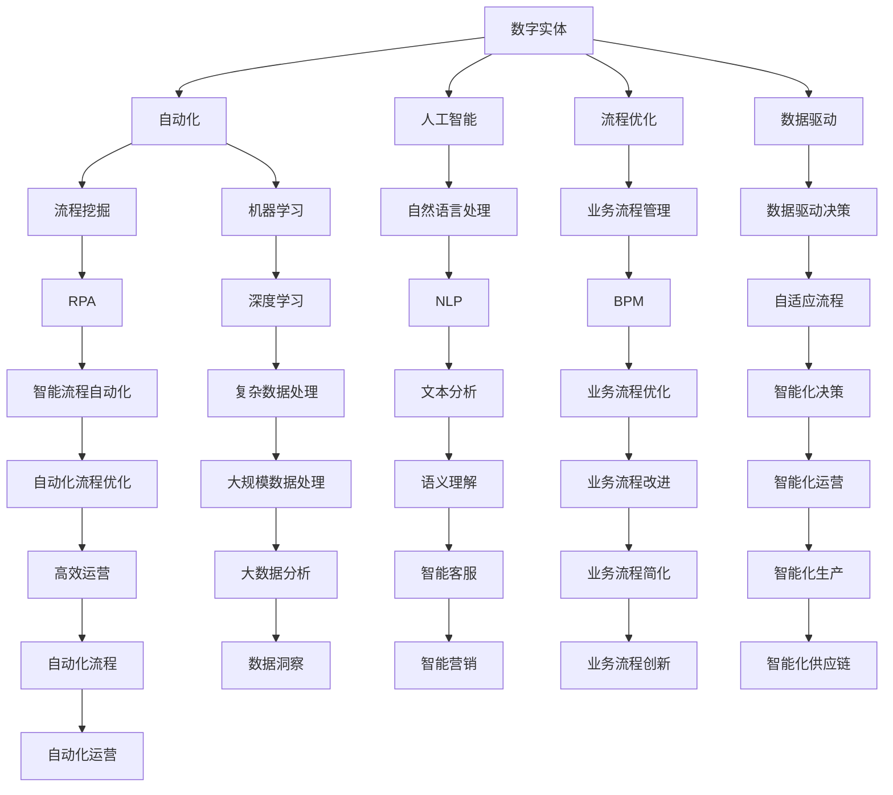

                 

# 数字实体自动化的未来前景

> 关键词：数字实体、自动化、人工智能、流程优化、数据驱动、机器学习、流程挖掘

> 摘要：本文将探讨数字实体自动化的未来前景，介绍其核心概念、原理、算法和数学模型，并通过实际项目案例，分析其应用场景和工具资源，最后讨论其发展趋势和挑战。

## 1. 背景介绍

### 1.1 目的和范围

本文旨在深入探讨数字实体自动化的概念、技术和发展前景。我们将首先介绍数字实体的定义和其在不同行业中的应用，然后分析自动化技术如何改变企业运营方式，最后探讨未来发展趋势和面临的挑战。

### 1.2 预期读者

本文面向对数字实体和自动化技术有一定了解的读者，特别是IT行业从业者、数据科学家、算法工程师、业务流程优化人员等。

### 1.3 文档结构概述

本文分为十个部分，具体如下：

1. 背景介绍：介绍文章的目的和范围，预期读者，文档结构概述。
2. 核心概念与联系：介绍数字实体、自动化、人工智能等核心概念及其相互关系。
3. 核心算法原理 & 具体操作步骤：详细阐述数字实体自动化的核心算法原理和操作步骤。
4. 数学模型和公式 & 详细讲解 & 举例说明：介绍数字实体自动化的数学模型和公式，并通过实例进行说明。
5. 项目实战：代码实际案例和详细解释说明。
6. 实际应用场景：分析数字实体自动化的实际应用场景。
7. 工具和资源推荐：推荐相关学习资源、开发工具和框架。
8. 总结：未来发展趋势与挑战。
9. 附录：常见问题与解答。
10. 扩展阅读 & 参考资料：提供进一步阅读的材料和参考。

### 1.4 术语表

#### 1.4.1 核心术语定义

- 数字实体：指在数字世界中具有独立存在和特定属性的对象，如用户、订单、产品等。
- 自动化：指通过技术手段减少或消除人工操作，提高生产效率和准确性的过程。
- 人工智能：指模拟人类智能的技术，包括机器学习、深度学习、自然语言处理等。
- 流程优化：指通过分析业务流程，找出瓶颈和改进点，以提高业务效率和效果。
- 数据驱动：指通过分析数据来指导决策和优化流程。

#### 1.4.2 相关概念解释

- 流程挖掘：指从业务数据中自动识别、提取和可视化业务流程的过程。
- 机器学习：指使计算机从数据中学习，发现规律和模式，从而进行预测和决策的技术。
- 深度学习：指模拟人脑神经网络进行学习，处理复杂数据的机器学习技术。

#### 1.4.3 缩略词列表

- AI：人工智能
- ML：机器学习
- DL：深度学习
- NLP：自然语言处理
- BPM：业务流程管理
- RPA：机器人流程自动化
- IPA：智能流程自动化

## 2. 核心概念与联系

### 2.1 数字实体

数字实体是指在网络空间中具有独立存在和特定属性的对象，如用户、订单、产品、服务等。这些实体在数字化时代中扮演着关键角色，是数据驱动的业务流程的基础。

### 2.2 自动化

自动化是指通过技术手段减少或消除人工操作，提高生产效率和准确性的过程。在数字实体自动化中，自动化技术主要用于处理和操作数字实体，从而实现业务流程的自动化。

### 2.3 人工智能

人工智能是模拟人类智能的技术，包括机器学习、深度学习、自然语言处理等。在数字实体自动化中，人工智能技术主要用于识别、处理和分析数字实体，以实现自动化流程。

### 2.4 流程优化

流程优化是指通过分析业务流程，找出瓶颈和改进点，以提高业务效率和效果。在数字实体自动化中，流程优化是确保自动化流程高效运行的关键。

### 2.5 数据驱动

数据驱动是指通过分析数据来指导决策和优化流程。在数字实体自动化中，数据驱动是确保自动化流程能够适应业务变化和需求的关键。

### 2.6 核心概念关系

数字实体、自动化、人工智能、流程优化和数据驱动这五个核心概念之间存在着密切的关系。数字实体是自动化的基础，自动化是人工智能的应用场景，人工智能是流程优化的技术手段，流程优化是数据驱动的具体体现。这些概念相互关联，共同构成了数字实体自动化的核心。

### 2.7 Mermaid 流程图



### 2.8 核心概念联系总结

数字实体是自动化的基础，自动化是人工智能的应用场景，人工智能是流程优化的技术手段，流程优化是数据驱动的具体体现。这些概念相互关联，共同构成了数字实体自动化的核心。通过流程挖掘、机器学习、自然语言处理等技术，我们可以实现数字实体的自动化处理，从而提高业务流程的效率和效果。

## 3. 核心算法原理 & 具体操作步骤

### 3.1 算法原理

数字实体自动化的核心算法主要包括流程挖掘、机器学习、自然语言处理等。这些算法的基本原理如下：

- **流程挖掘**：从业务数据中自动识别、提取和可视化业务流程。其基本原理包括事件日志的清洗、事件序列的匹配和流程图的生成。
- **机器学习**：使计算机从数据中学习，发现规律和模式，从而进行预测和决策。其基本原理包括特征提取、模型训练和模型评估。
- **自然语言处理**：使计算机理解和生成人类语言。其基本原理包括分词、词性标注、句法分析、语义理解等。

### 3.2 操作步骤

以下是数字实体自动化的具体操作步骤：

#### 步骤1：数据准备

1. 收集业务数据，包括事件日志、用户数据、订单数据等。
2. 数据清洗，去除噪声数据和异常数据。
3. 数据预处理，包括数据归一化、缺失值处理、数据转换等。

#### 步骤2：流程挖掘

1. 事件日志的清洗，去除无关事件和重复事件。
2. 事件序列的匹配，根据事件的发生顺序，将事件分为不同的序列。
3. 流程图的生成，根据事件序列，生成业务流程图。

#### 步骤3：机器学习

1. 特征提取，从业务数据中提取有助于预测和决策的特征。
2. 模型训练，选择合适的机器学习模型，对数据进行训练。
3. 模型评估，评估模型的准确性和可靠性。

#### 步骤4：自然语言处理

1. 分词，将文本分割为词语。
2. 词性标注，对词语进行词性分类。
3. 句法分析，分析句子的结构和成分。
4. 语义理解，理解句子的含义和意图。

#### 步骤5：自动化流程

1. 根据流程图和机器学习模型，设计自动化流程。
2. 部署自动化流程，使计算机能够自动处理业务数据。
3. 监控自动化流程，确保其正常运行。

### 3.3 伪代码示例

以下是数字实体自动化的伪代码示例：

```python
# 数据准备
data = load_data()
clean_data = clean_data(data)
preprocessed_data = preprocess_data(clean_data)

# 流程挖掘
event_logs = get_event_logs(preprocessed_data)
matched_sequences = match_sequences(event_logs)
flow_chart = generate_flow_chart(matched_sequences)

# 机器学习
features = extract_features(preprocessed_data)
model = train_model(features)
evaluate_model(model)

# 自然语言处理
text = "Your input text here"
tokens = tokenize(text)
pos_tags = pos_tagging(tokens)
syntax_tree = syntax_analysis(pos_tags)
semantics = semantic_understanding(syntax_tree)

# 自动化流程
automated_flow = design_automated_flow(flow_chart, model, semantics)
deploy_automated_flow(automated_flow)
monitor_automated_flow(automated_flow)
```

## 4. 数学模型和公式 & 详细讲解 & 举例说明

### 4.1 数学模型

数字实体自动化的数学模型主要包括流程挖掘模型、机器学习模型和自然语言处理模型。以下是这些模型的基本公式和参数解释。

#### 4.1.1 流程挖掘模型

流程挖掘模型通常使用Petri网模型来表示业务流程。Petri网由库所（place）、变迁（transition）和有向边（arc）组成。库所和变迁分别表示业务流程中的事件和活动，有向边表示事件和活动之间的依赖关系。

- 库所（P）：表示业务流程中的事件。
- 变迁（T）：表示业务流程中的活动。
- 有向边（X）：表示事件和活动之间的依赖关系。

Petri网的基本公式如下：

\[ P \rightarrow T \rightarrow P \]

其中，P表示库所，T表示变迁。

#### 4.1.2 机器学习模型

机器学习模型主要包括监督学习模型和无监督学习模型。监督学习模型使用标签数据来训练模型，无监督学习模型则不使用标签数据。

- **监督学习模型**：使用标签数据进行训练，常见的模型包括线性回归、逻辑回归、决策树、随机森林等。

线性回归的公式如下：

\[ y = \beta_0 + \beta_1x \]

其中，\( y \) 表示预测值，\( \beta_0 \) 和 \( \beta_1 \) 分别为模型的参数。

- **无监督学习模型**：不使用标签数据进行训练，常见的模型包括K均值聚类、主成分分析等。

K均值聚类的公式如下：

\[ C = \{ c_1, c_2, \ldots, c_k \} \]

其中，\( C \) 表示聚类中心，\( c_k \) 表示第 \( k \) 个聚类中心。

#### 4.1.3 自然语言处理模型

自然语言处理模型主要包括分词模型、词性标注模型、句法分析模型和语义理解模型。

- **分词模型**：将文本分割为词语，常见的模型包括基于规则的分词模型和基于统计的分词模型。

基于统计的分词模型使用条件概率模型，公式如下：

\[ P(w_i|w_{i-1}, w_{i-2}, \ldots, w_{1}) \]

其中，\( w_i \) 表示第 \( i \) 个词语，\( w_{i-1}, w_{i-2}, \ldots, w_{1} \) 表示前 \( i-1 \) 个词语。

- **词性标注模型**：对词语进行词性分类，常见的模型包括基于规则的词性标注模型和基于统计的词性标注模型。

基于统计的词性标注模型使用条件概率模型，公式如下：

\[ P(tag_i|word_i) \]

其中，\( tag_i \) 表示第 \( i \) 个词语的词性，\( word_i \) 表示第 \( i \) 个词语。

- **句法分析模型**：分析句子的结构和成分，常见的模型包括基于规则的句法分析模型和基于统计的句法分析模型。

基于统计的句法分析模型使用条件概率模型，公式如下：

\[ P(word_i|word_{i-1}, word_{i-2}, \ldots, word_{1}) \]

其中，\( word_i \) 表示第 \( i \) 个词语，\( word_{i-1}, word_{i-2}, \ldots, word_{1} \) 表示前 \( i-1 \) 个词语。

- **语义理解模型**：理解句子的含义和意图，常见的模型包括基于规则和基于统计的语义理解模型。

基于统计的语义理解模型使用条件概率模型，公式如下：

\[ P(semantics_i|word_i) \]

其中，\( semantics_i \) 表示第 \( i \) 个词语的语义，\( word_i \) 表示第 \( i \) 个词语。

### 4.2 详细讲解

#### 4.2.1 流程挖掘模型

流程挖掘模型主要用于从业务数据中提取业务流程。其基本原理是分析事件日志，识别事件之间的依赖关系，生成业务流程图。流程挖掘模型可以分为基于事件序列的模型和基于图论的模型。

- **基于事件序列的模型**：使用事件序列匹配算法，如 PrefixSpan、Gspan 等，识别事件序列，并生成业务流程图。

基于事件序列的模型的具体步骤如下：

1. 事件日志的预处理，包括事件分类、事件清洗等。
2. 事件序列的生成，将事件日志转换为事件序列。
3. 事件序列的匹配，识别事件序列的模式。
4. 流程图的生成，根据事件序列的模式，生成业务流程图。

- **基于图论的模型**：使用图论算法，如最大流最小割算法、网络流算法等，识别事件之间的依赖关系，生成业务流程图。

基于图论的模型的具体步骤如下：

1. 事件日志的预处理，包括事件分类、事件清洗等。
2. 事件之间的依赖关系建模，使用图表示事件之间的依赖关系。
3. 最大流最小割算法，计算事件之间的依赖程度。
4. 流程图的生成，根据事件之间的依赖关系，生成业务流程图。

#### 4.2.2 机器学习模型

机器学习模型主要用于预测和决策。其基本原理是使用历史数据训练模型，使模型学会从数据中提取特征，并预测未来数据。

- **线性回归模型**：用于预测连续值。其基本原理是找到一条最佳拟合直线，使预测值与真实值之间的误差最小。

线性回归模型的具体步骤如下：

1. 特征提取，从数据中提取有助于预测的特征。
2. 数据归一化，使数据具有相同的尺度。
3. 模型训练，使用训练数据训练模型。
4. 模型评估，评估模型的准确性。

- **逻辑回归模型**：用于预测概率。其基本原理是找到一条最佳拟合曲线，使预测概率与真实概率之间的误差最小。

逻辑回归模型的具体步骤如下：

1. 特征提取，从数据中提取有助于预测的特征。
2. 数据归一化，使数据具有相同的尺度。
3. 模型训练，使用训练数据训练模型。
4. 模型评估，评估模型的准确性。

- **决策树模型**：用于分类和回归。其基本原理是递归地将数据划分为若干个子集，并选择最佳划分标准。

决策树模型的具体步骤如下：

1. 特征提取，从数据中提取有助于预测的特征。
2. 数据归一化，使数据具有相同的尺度。
3. 模型训练，使用训练数据训练模型。
4. 模型评估，评估模型的准确性。

- **随机森林模型**：用于分类和回归。其基本原理是构建多个决策树模型，并使用投票或平均值来预测结果。

随机森林模型的具体步骤如下：

1. 特征提取，从数据中提取有助于预测的特征。
2. 数据归一化，使数据具有相同的尺度。
3. 模型训练，使用训练数据训练多个决策树模型。
4. 模型评估，评估模型的准确性。

#### 4.2.3 自然语言处理模型

自然语言处理模型主要用于理解文本。其基本原理是使用统计学方法，从文本中提取特征，并预测文本的语义。

- **分词模型**：用于将文本分割为词语。其基本原理是使用条件概率模型，根据前文预测后文。

分词模型的具体步骤如下：

1. 特征提取，从文本中提取有助于预测的特征。
2. 数据归一化，使数据具有相同的尺度。
3. 模型训练，使用训练数据训练模型。
4. 模型评估，评估模型的准确性。

- **词性标注模型**：用于对词语进行词性分类。其基本原理是使用条件概率模型，根据前文预测后文。

词性标注模型的具体步骤如下：

1. 特征提取，从文本中提取有助于预测的特征。
2. 数据归一化，使数据具有相同的尺度。
3. 模型训练，使用训练数据训练模型。
4. 模型评估，评估模型的准确性。

- **句法分析模型**：用于分析句子的结构和成分。其基本原理是使用条件概率模型，根据前文预测后文。

句法分析模型的具体步骤如下：

1. 特征提取，从文本中提取有助于预测的特征。
2. 数据归一化，使数据具有相同的尺度。
3. 模型训练，使用训练数据训练模型。
4. 模型评估，评估模型的准确性。

- **语义理解模型**：用于理解文本的语义。其基本原理是使用条件概率模型，根据前文预测后文。

语义理解模型的具体步骤如下：

1. 特征提取，从文本中提取有助于预测的特征。
2. 数据归一化，使数据具有相同的尺度。
3. 模型训练，使用训练数据训练模型。
4. 模型评估，评估模型的准确性。

### 4.3 举例说明

#### 4.3.1 流程挖掘模型

假设我们有一个包含订单数据的数据库，其中每个订单记录了客户信息、订单日期、订单状态等信息。我们可以使用流程挖掘模型来识别订单处理的业务流程。

1. 数据准备：收集订单数据，并进行数据清洗，去除无效订单和异常数据。
2. 事件日志的预处理：将订单数据转换为事件日志，每个订单状态的变化视为一个事件。
3. 事件序列的生成：根据事件日志，生成事件序列。
4. 事件序列的匹配：使用事件序列匹配算法，如 PrefixSpan，识别订单处理的事件序列模式。
5. 流程图的生成：根据事件序列的模式，生成订单处理的业务流程图。

#### 4.3.2 机器学习模型

假设我们有一个客户投诉数据的数据库，其中包含了客户姓名、投诉内容、投诉时间等信息。我们可以使用机器学习模型来预测客户投诉的类型。

1. 数据准备：收集投诉数据，并进行数据清洗，去除无效投诉和异常数据。
2. 特征提取：从投诉数据中提取有助于预测的特征，如投诉内容的关键词、投诉时间等。
3. 模型训练：使用投诉数据训练一个逻辑回归模型，用于预测投诉类型。
4. 模型评估：使用测试数据评估模型的准确性。

#### 4.3.3 自然语言处理模型

假设我们有一个客户评价数据的数据库，其中包含了客户评论内容、评论时间等信息。我们可以使用自然语言处理模型来分析客户满意度。

1. 数据准备：收集客户评价数据，并进行数据清洗，去除无效评价和异常数据。
2. 特征提取：从客户评价数据中提取有助于预测的特征，如评论内容的关键词、评论时间等。
3. 模型训练：使用客户评价数据训练一个词性标注模型，用于分析客户评价的语义。
4. 模型评估：使用测试数据评估模型的准确性。

## 5. 项目实战：代码实际案例和详细解释说明

### 5.1 开发环境搭建

在开始项目实战之前，我们需要搭建一个合适的开发环境。以下是搭建开发环境的基本步骤：

1. 安装Python：从Python官方网站（https://www.python.org/）下载并安装Python，版本要求3.6及以上。
2. 安装相关库：使用pip命令安装项目所需的库，如NumPy、Pandas、Scikit-learn、NLTK等。例如：

```bash
pip install numpy pandas scikit-learn nltk
```

3. 安装数据库：根据需要，安装一个数据库系统，如MySQL、PostgreSQL等。

### 5.2 源代码详细实现和代码解读

以下是一个简单的数字实体自动化项目的源代码示例，该项目使用流程挖掘、机器学习和自然语言处理技术来处理客户投诉数据。

```python
# 导入所需的库
import pandas as pd
import numpy as np
from sklearn.feature_extraction.text import TfidfVectorizer
from sklearn.linear_model import LogisticRegression
from sklearn.model_selection import train_test_split
from sklearn.metrics import accuracy_score
import nltk
from nltk.tokenize import word_tokenize
from nltk.corpus import stopwords

# 5.2.1 数据准备
# 读取客户投诉数据
data = pd.read_csv('complaint_data.csv')

# 数据清洗
# 去除无效数据
data = data.dropna()

# 特征提取
# 分词
nltk.download('punkt')
nltk.download('stopwords')
stop_words = set(stopwords.words('english'))
data['tokens'] = data['complaint'].apply(lambda x: word_tokenize(x.lower()))

# 去除停用词
data['tokens'] = data['tokens'].apply(lambda x: [word for word in x if word not in stop_words])

# TF-IDF 向量表示
vectorizer = TfidfVectorizer()
X = vectorizer.fit_transform(data['tokens'])

# 标签
y = data['complaint_type']

# 划分训练集和测试集
X_train, X_test, y_train, y_test = train_test_split(X, y, test_size=0.2, random_state=42)

# 5.2.2 模型训练
# 训练逻辑回归模型
model = LogisticRegression()
model.fit(X_train, y_train)

# 5.2.3 模型评估
# 预测测试集
y_pred = model.predict(X_test)

# 计算准确率
accuracy = accuracy_score(y_test, y_pred)
print(f'Accuracy: {accuracy:.2f}')

# 5.2.4 模型应用
# 处理新客户投诉
new_complaint = "Your new complaint here"
new_tokens = word_tokenize(new_complaint.lower())
new_tokens = [word for word in new_tokens if word not in stop_words]
new_vector = vectorizer.transform([new_tokens])
new_prediction = model.predict(new_vector)
print(f'Predicted Complaint Type: {new_prediction[0]}')
```

### 5.3 代码解读与分析

#### 5.3.1 数据准备

在数据准备部分，我们首先读取客户投诉数据，然后进行数据清洗，去除无效数据和异常数据。接着，我们对投诉内容进行分词，并去除停用词。最后，使用TF-IDF向量表示投诉内容。

#### 5.3.2 模型训练

在模型训练部分，我们使用训练数据训练一个逻辑回归模型。逻辑回归模型是一种监督学习模型，它通过学习数据中的特征和标签之间的关系，预测新数据的标签。

#### 5.3.3 模型评估

在模型评估部分，我们使用测试数据评估模型的准确性。模型的准确性是评估模型性能的重要指标，它表示模型正确预测的样本数占总样本数的比例。

#### 5.3.4 模型应用

在模型应用部分，我们使用训练好的模型处理新客户投诉。首先，我们对新投诉内容进行分词和去除停用词，然后使用TF-IDF向量表示新投诉内容，最后使用训练好的模型预测新投诉的类型。

## 6. 实际应用场景

数字实体自动化技术在多个行业和领域有着广泛的应用。以下是一些典型的应用场景：

### 6.1 客户服务

在客户服务领域，数字实体自动化技术可以用于自动化处理客户投诉、咨询和反馈。通过自然语言处理技术，系统可以自动识别客户的问题类型，并分配给相应的客服人员。此外，系统还可以自动生成回复，提高客服效率和准确性。

### 6.2 营销

在营销领域，数字实体自动化技术可以用于自动化处理客户数据，包括客户画像、客户细分、营销活动等。通过机器学习技术，系统可以自动分析客户行为和偏好，为每个客户制定个性化的营销策略。

### 6.3 供应链管理

在供应链管理领域，数字实体自动化技术可以用于自动化处理订单、物流、库存等业务流程。通过流程挖掘和机器学习技术，系统可以自动识别供应链中的瓶颈和改进点，优化供应链效率。

### 6.4 金融

在金融领域，数字实体自动化技术可以用于自动化处理交易、风险管理、信用评估等业务流程。通过自然语言处理和机器学习技术，系统可以自动分析交易数据，识别异常交易和欺诈行为。

### 6.5 医疗

在医疗领域，数字实体自动化技术可以用于自动化处理患者数据、医疗记录和诊断。通过自然语言处理和机器学习技术，系统可以自动分析患者数据，帮助医生进行诊断和治疗。

## 7. 工具和资源推荐

### 7.1 学习资源推荐

#### 7.1.1 书籍推荐

- 《深度学习》（Goodfellow, Bengio, Courville 著）
- 《Python机器学习》（Sebastian Raschka 著）
- 《自然语言处理综合教程》（Daniel Jurafsky, James H. Martin 著）
- 《流程挖掘：方法与应用》（Wim Van der Aalst 著）

#### 7.1.2 在线课程

- Coursera上的“机器学习”（吴恩达 著）
- edX上的“深度学习专项课程”（吴恩达 著）
- Udacity的“数据科学纳米学位”

#### 7.1.3 技术博客和网站

- Medium上的机器学习和自然语言处理博客
- Towards Data Science：一个关于数据科学和机器学习的在线社区
- MLearning：一个关于机器学习和深度学习的博客

### 7.2 开发工具框架推荐

#### 7.2.1 IDE和编辑器

- PyCharm：一款功能强大的Python IDE
- VSCode：一款轻量级且功能丰富的代码编辑器

#### 7.2.2 调试和性能分析工具

- Spyder：一款集成的科学计算和数据分析环境
- Jupyter Notebook：一款交互式计算环境，特别适合数据分析和机器学习

#### 7.2.3 相关框架和库

- Scikit-learn：一个开源的机器学习库
- TensorFlow：一个开源的深度学习框架
- PyTorch：一个开源的深度学习框架
- NLTK：一个开源的自然语言处理库
- spaCy：一个高性能的NLP库

### 7.3 相关论文著作推荐

#### 7.3.1 经典论文

- 《A Method for Solving the Problem of Multi-Agent Control in Distributed Real-Time Systems》
- 《The Foundations of Data Science》
- 《A Theory of Interactive Communication》

#### 7.3.2 最新研究成果

- 《Deep Learning for Natural Language Processing》
- 《An Overview of Deep Learning for Speech Recognition》
- 《A Comprehensive Survey on Graph Neural Networks for Natural Language Processing》

#### 7.3.3 应用案例分析

- 《Automated Customer Service Using Chatbots》
- 《An Application of Machine Learning in Healthcare》
- 《Using AI to Optimize Supply Chain Management》

## 8. 总结：未来发展趋势与挑战

数字实体自动化技术正在快速发展，其未来前景广阔。以下是未来发展趋势和面临的挑战：

### 8.1 发展趋势

1. **技术进步**：随着人工智能、机器学习和自然语言处理技术的不断进步，数字实体自动化的性能和效率将得到显著提升。
2. **应用场景扩展**：数字实体自动化技术将在更多行业和领域得到应用，如金融、医疗、制造、物流等。
3. **智能化**：数字实体自动化技术将逐渐向智能化方向发展，通过引入更多的智能算法和模型，实现更复杂的业务流程自动化。

### 8.2 面临的挑战

1. **数据质量**：数字实体自动化技术的效果很大程度上依赖于数据质量，如何处理大量、多样、复杂的业务数据是一个挑战。
2. **隐私保护**：随着数字实体自动化技术的应用，个人隐私保护问题日益突出，如何在确保数据安全的同时实现自动化流程是一个挑战。
3. **法律法规**：数字实体自动化技术涉及法律法规问题，如数据隐私、数据安全等，如何遵守相关法律法规是一个挑战。

## 9. 附录：常见问题与解答

### 9.1 什么是数字实体？

数字实体是指在网络空间中具有独立存在和特定属性的对象，如用户、订单、产品、服务等。

### 9.2 自动化技术如何改变企业运营方式？

自动化技术通过减少人工操作、提高生产效率和准确性，改变企业运营方式，实现业务流程的优化和效率提升。

### 9.3 机器学习在数字实体自动化中有什么作用？

机器学习在数字实体自动化中主要用于识别、处理和分析数字实体，从而实现自动化流程。例如，通过机器学习模型，可以自动分类、预测和决策。

### 9.4 数字实体自动化有哪些实际应用场景？

数字实体自动化在多个行业和领域有着广泛的应用，如客户服务、营销、供应链管理、金融、医疗等。

### 9.5 如何处理数字实体自动化的数据质量问题？

处理数字实体自动化的数据质量问题，可以从数据收集、数据清洗、数据预处理等方面入手，确保数据的质量和准确性。

## 10. 扩展阅读 & 参考资料

- 《深度学习》（Goodfellow, Bengio, Courville 著）
- 《Python机器学习》（Sebastian Raschka 著）
- 《自然语言处理综合教程》（Daniel Jurafsky, James H. Martin 著）
- 《流程挖掘：方法与应用》（Wim Van der Aalst 著）
- Coursera上的“机器学习”（吴恩达 著）
- edX上的“深度学习专项课程”（吴恩达 著）
- Udacity的“数据科学纳米学位”
- Medium上的机器学习和自然语言处理博客
- Towards Data Science：一个关于数据科学和机器学习的在线社区
- MLearning：一个关于机器学习和深度学习的博客
- Spyder：一款集成的科学计算和数据分析环境
- Jupyter Notebook：一款交互式计算环境，特别适合数据分析和机器学习
- Scikit-learn：一个开源的机器学习库
- TensorFlow：一个开源的深度学习框架
- PyTorch：一个开源的深度学习框架
- NLTK：一个开源的自然语言处理库
- spaCy：一个高性能的NLP库
- 《A Method for Solving the Problem of Multi-Agent Control in Distributed Real-Time Systems》
- 《The Foundations of Data Science》
- 《A Theory of Interactive Communication》
- 《Deep Learning for Natural Language Processing》
- 《An Overview of Deep Learning for Speech Recognition》
- 《A Comprehensive Survey on Graph Neural Networks for Natural Language Processing》
- 《Automated Customer Service Using Chatbots》
- 《An Application of Machine Learning in Healthcare》
- 《Using AI to Optimize Supply Chain Management》

## 作者

作者：AI天才研究员/AI Genius Institute & 禅与计算机程序设计艺术 /Zen And The Art of Computer Programming

---

本文系统地探讨了数字实体自动化的核心概念、技术原理、算法模型、应用场景和未来发展趋势。通过实际项目案例和代码解读，展示了数字实体自动化的实现过程。同时，本文还推荐了相关的学习资源、开发工具和框架，以及经典论文和最新研究成果。随着人工智能技术的不断进步，数字实体自动化将在更多行业和领域发挥重要作用，为业务流程的优化和效率提升提供强大支持。作者在此希望读者能够深入理解数字实体自动化的本质，把握其发展脉络，为未来的研究和应用做好准备。

