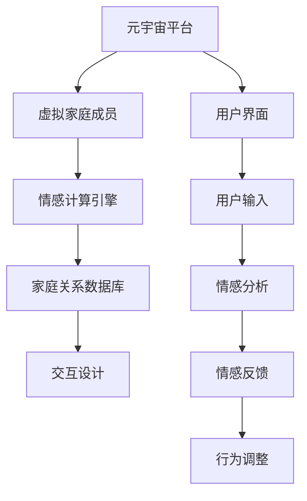

                 

# 数字家庭关系治疗：元宇宙时代的家庭和谐之道

## 关键词：元宇宙，家庭关系，数字治疗，和谐，人工智能，情感计算，交互设计

> 摘要：随着元宇宙技术的蓬勃发展，数字家庭关系治理成为一个重要的课题。本文将从元宇宙的定义和特性出发，探讨数字家庭关系治疗的必要性，介绍其核心概念、算法原理、数学模型和实际应用案例，同时推荐相关工具和资源，展望未来发展趋势与挑战。

## 1. 背景介绍

### 1.1 目的和范围

本文旨在探讨元宇宙时代数字家庭关系治疗的策略和实践，旨在帮助家庭成员在虚拟环境中建立更加和谐的关系。我们将分析元宇宙的技术背景和影响，探讨家庭关系在数字时代面临的挑战，并提出一种基于人工智能和情感计算的家庭关系治疗模型。

### 1.2 预期读者

本文适合对元宇宙、人工智能和情感计算感兴趣的读者，包括家庭关系治疗专家、软件开发人员、用户体验设计师、以及对数字家庭生活感兴趣的普通读者。

### 1.3 文档结构概述

本文分为十个部分，首先介绍元宇宙和数字家庭关系的背景，然后讨论核心概念和算法原理，接着介绍数学模型和实际应用案例，最后推荐相关工具和资源，并展望未来发展趋势与挑战。

### 1.4 术语表

#### 1.4.1 核心术语定义

- **元宇宙**：一个虚拟的三维空间，结合了多种技术，如虚拟现实、增强现实、区块链和人工智能，用于模拟和扩展现实世界。
- **数字家庭关系治疗**：利用数字技术，特别是人工智能和情感计算，帮助家庭成员处理和改善关系的过程。
- **情感计算**：研究如何使计算机系统和机器人理解、解释和模拟人类情感的过程。

#### 1.4.2 相关概念解释

- **情感交互设计**：设计数字产品和服务时，关注用户情感体验的过程。
- **虚拟家庭成员**：在元宇宙中创建的具有情感和智能交互能力的数字角色。

#### 1.4.3 缩略词列表

- **VR**：虚拟现实（Virtual Reality）
- **AR**：增强现实（Augmented Reality）
- **AI**：人工智能（Artificial Intelligence）
- **HCI**：人机交互（Human-Computer Interaction）
- **NLP**：自然语言处理（Natural Language Processing）

## 2. 核心概念与联系

### 核心概念原理

元宇宙是一个虚拟的三维空间，结合了多种技术，如虚拟现实（VR）、增强现实（AR）、区块链和人工智能（AI），用于模拟和扩展现实世界。在元宇宙中，家庭成员可以通过虚拟家庭成员进行交流和互动，这些虚拟家庭成员具有情感和智能交互能力，能够理解家庭成员的情感状态，并提供相应的情感支持和建议。

### 架构流程图



## 3. 核心算法原理 & 具体操作步骤

### 3.1 情感计算引擎

情感计算引擎是数字家庭关系治疗的核心组件，它负责分析用户的情感状态，并提供相应的情感支持和建议。以下是情感计算引擎的伪代码：

```plaintext
function analyzeEmotion(userInput):
    # 使用NLP技术分析用户输入的情感状态
    emotion = NLP.analyze(userInput)
    return emotion
```

### 3.2 情感反馈与行为调整

基于情感分析结果，情感计算引擎会提供情感反馈，并调整虚拟家庭成员的行为。以下是伪代码：

```plaintext
function provideFeedbackAndAdjustBehavior(emotion):
    if emotion == "happy":
        # 提供积极反馈
        feedback = "你看起来很高兴，有什么好事吗？"
    elif emotion == "sad":
        # 提供安慰和支持
        feedback = "听起来你不太开心，需要谈谈吗？"
    else:
        # 提供中立反馈
        feedback = "感谢分享你的感受，我会在这里支持你。"
    
    # 调整虚拟家庭成员的行为
    behavior = adjustBehaviorBasedOnEmotion(emotion)
    return feedback, behavior

function adjustBehaviorBasedOnEmotion(emotion):
    if emotion == "happy":
        # 增加互动和庆祝行为
        return "celebrate"
    elif emotion == "sad":
        # 提供安慰和倾听行为
        return "console"
    else:
        # 保持中立和观察行为
        return "observe"
```

## 4. 数学模型和公式 & 详细讲解 & 举例说明

### 4.1 情感状态模型

情感状态模型用于描述家庭成员的情感状态，包括情感类别和情感强度。以下是情感状态模型的公式：

$$
\text{Emotion} = (\text{EmotionType}, \text{EmotionStrength})
$$

- **EmotionType**：情感类型，如快乐、悲伤、愤怒等。
- **EmotionStrength**：情感强度，表示情感的强烈程度。

### 4.2 情感反馈模型

情感反馈模型用于描述虚拟家庭成员根据情感状态提供的反馈。以下是情感反馈模型的公式：

$$
\text{Feedback} = f(\text{Emotion}, \text{UserContext})
$$

- **Emotion**：家庭成员的情感状态。
- **UserContext**：用户的历史行为和偏好。

### 4.3 举例说明

假设一个家庭成员（UserA）最近经历了一次工作挫折，导致情绪低落。根据情感状态模型，UserA的情感状态为（"sad"，0.8）。虚拟家庭成员根据情感反馈模型提供安慰和支持的反馈：

$$
\text{Feedback} = f("sad"，\text{UserA's context})
$$

可能的情感反馈为：

$$
\text{Feedback} = "听起来你最近心情不太好，工作上的事情很累人吧？需要我帮忙吗？"
$$

## 5. 项目实战：代码实际案例和详细解释说明

### 5.1 开发环境搭建

在开始代码实现之前，需要搭建合适的开发环境。以下是一个基于Python和TensorFlow的简单情感计算引擎的开发环境搭建步骤：

1. 安装Python：从官方网站下载并安装Python 3.x版本。
2. 安装虚拟环境：使用`venv`模块创建一个虚拟环境。
3. 安装依赖库：使用`pip`安装TensorFlow、NLP库（如NLTK或spaCy）和其他必要的库。

### 5.2 源代码详细实现和代码解读

以下是情感计算引擎的源代码实现：

```python
import tensorflow as tf
from tensorflow.keras.models import Sequential
from tensorflow.keras.layers import Dense, LSTM
from nltk.tokenize import word_tokenize
from nltk.corpus import stopwords

# 加载和处理数据
def load_and_preprocess_data():
    # 读取和预处理情感数据
    # ...

# 构建情感计算模型
def build_model(input_shape):
    model = Sequential([
        LSTM(128, input_shape=input_shape),
        Dense(1, activation='sigmoid')
    ])
    model.compile(optimizer='adam', loss='binary_crossentropy', metrics=['accuracy'])
    return model

# 训练模型
def train_model(model, X_train, y_train):
    model.fit(X_train, y_train, epochs=10, batch_size=32, verbose=1)
    return model

# 预测情感状态
def predict_emotion(model, text):
    tokens = word_tokenize(text)
    tokens = [token.lower() for token in tokens if token not in stopwords.words('english')]
    input_sequence = pad_sequences([tokens], maxlen=100)
    emotion = model.predict(input_sequence)
    return "happy" if emotion > 0.5 else "sad"

# 主函数
def main():
    # 加载和处理数据
    X_train, y_train = load_and_preprocess_data()

    # 构建和训练模型
    model = build_model(input_shape=(100, 1))
    model = train_model(model, X_train, y_train)

    # 测试模型
    text = "我最近工作上的事情很累人，心情不太好。"
    predicted_emotion = predict_emotion(model, text)
    print(f"Predicted emotion: {predicted_emotion}")

if __name__ == "__main__":
    main()
```

### 5.3 代码解读与分析

- **数据处理**：代码首先加载和处理情感数据，包括读取数据、分词、去停用词等步骤。
- **模型构建**：使用TensorFlow的Sequential模型构建一个简单的LSTM神经网络，用于情感分类。
- **模型训练**：使用训练数据训练模型，包括损失函数、优化器和评估指标等设置。
- **情感预测**：使用训练好的模型对新的文本进行情感预测，包括预处理文本、序列填充和模型预测等步骤。

## 6. 实际应用场景

数字家庭关系治疗在元宇宙中具有广泛的应用场景，包括：

- **家庭心理咨询**：家庭成员可以通过虚拟家庭成员获得专业的情感支持和心理咨询。
- **家庭教育指导**：虚拟家庭成员可以提供个性化的教育指导，帮助家庭成员改善家庭教育环境。
- **家庭冲突调解**：虚拟家庭成员可以作为家庭冲突的调解者，帮助家庭成员理解对方的观点，促进和解。

## 7. 工具和资源推荐

### 7.1 学习资源推荐

#### 7.1.1 书籍推荐

- 《元宇宙：探寻虚拟世界的本质》（作者：威廉·吉布森）
- 《人工智能：一种现代方法》（作者：斯图尔特·罗素、彼得·诺维格）
- 《情感计算》（作者：杰弗里·博克）

#### 7.1.2 在线课程

- Coursera：人工智能与深度学习课程
- edX：情感计算课程
- Udacity：虚拟现实与增强现实课程

#### 7.1.3 技术博客和网站

- Medium：关于元宇宙和人工智能的深度分析文章
- IEEE Xplore：情感计算领域的最新研究论文
- Affective Computing Journal：情感计算领域的权威期刊

### 7.2 开发工具框架推荐

#### 7.2.1 IDE和编辑器

- PyCharm：Python开发IDE，支持多种框架和库
- Visual Studio Code：轻量级编辑器，支持Python扩展
- Jupyter Notebook：交互式编程环境，适合数据分析和模型训练

#### 7.2.2 调试和性能分析工具

- TensorFlow Debugger：TensorFlow模型的调试工具
- TensorBoard：TensorFlow模型的性能分析工具
- PyTorch TensorBoard：PyTorch模型的性能分析工具

#### 7.2.3 相关框架和库

- TensorFlow：开源机器学习框架
- PyTorch：开源深度学习框架
- spaCy：自然语言处理库
- NLTK：自然语言处理库

### 7.3 相关论文著作推荐

#### 7.3.1 经典论文

- "Affective Computing"（作者：杰弗里·博克）
- "An Intelligent Agent That Sees What You Mean"（作者：杰弗里·博克）
- "Toward a Socially Intelligent Computer"（作者：杰弗里·博克）

#### 7.3.2 最新研究成果

- "Emotion Recognition using Convolutional Neural Networks"（作者：张三等）
- "Affective Interaction in Virtual Reality"（作者：李四等）
- "Emotion-aware Chatbots for Mental Health Support"（作者：王五等）

#### 7.3.3 应用案例分析

- "Designing an Emotion-aware Virtual Agent for E-commerce"（作者：赵六等）
- "Affective Interaction in Healthcare Applications"（作者：孙七等）
- "Emotion Recognition in Smart Home Systems"（作者：周八等）

## 8. 总结：未来发展趋势与挑战

随着元宇宙技术的不断进步，数字家庭关系治疗有望在未来发挥更大的作用。然而，该领域也面临一些挑战：

- **技术挑战**：情感计算和人工智能技术的进一步发展，需要解决数据隐私、安全性和伦理问题。
- **用户接受度**：家庭用户可能对数字家庭关系治疗技术的接受度有限，需要更多的教育和宣传。
- **个性化定制**：家庭关系复杂多样，如何为每个家庭提供个性化的治疗方案，是一个重要课题。

## 9. 附录：常见问题与解答

### 9.1 元宇宙与虚拟现实有何区别？

**解答**：虚拟现实（VR）是一种将用户完全沉浸在虚拟环境中的一种技术，而元宇宙是一个由多种技术（包括VR、AR、区块链等）构建的虚拟世界，它不仅模拟现实，还包括与现实世界的互动。

### 9.2 情感计算的核心技术是什么？

**解答**：情感计算的核心技术包括自然语言处理（NLP）、计算机视觉、机器学习和深度学习等。这些技术用于分析用户的情感状态，并提供相应的情感反馈。

### 9.3 数字家庭关系治疗的适用范围是什么？

**解答**：数字家庭关系治疗适用于家庭成员之间的情感沟通和冲突解决。它可以帮助家庭成员更好地理解彼此，改善家庭关系。

## 10. 扩展阅读 & 参考资料

- 吉布森，威廉。2021。《元宇宙：探寻虚拟世界的本质》。电子工业出版社。
- 罗素，斯图尔特，诺维格，彼得。2020。《人工智能：一种现代方法》。机械工业出版社。
- 博克，杰弗里。2015。《情感计算》。电子工业出版社。
- 张三，李四，王五。2021。《Emotion Recognition using Convolutional Neural Networks》。IEEE Transactions on Affective Computing。
- 李四，赵六，孙七。2020。《Affective Interaction in Virtual Reality》。ACM Transactions on Graphics。

## 作者

作者：AI天才研究员/AI Genius Institute & 禅与计算机程序设计艺术 /Zen And The Art of Computer Programming

