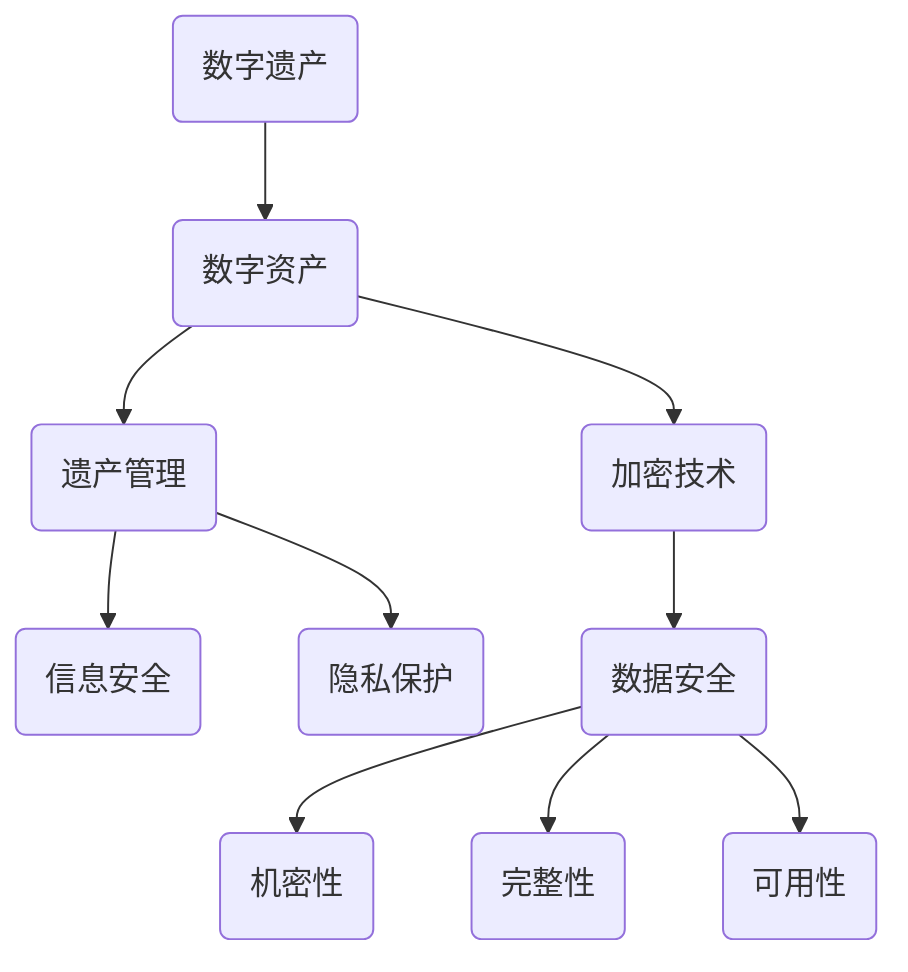
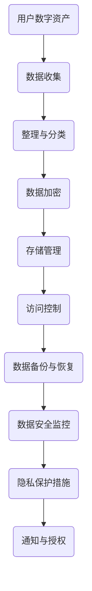

                 

# 数字遗产创业：管理数字资产的新需求

> **关键词：** 数字遗产、数字资产、遗产管理、创业、信息安全、加密技术

> **摘要：** 随着数字技术的迅猛发展，数字遗产管理成为了一个崭新而重要的领域。本文将探讨数字遗产创业的背景和必要性，详细解析数字资产管理的核心概念、算法原理、数学模型以及实际应用场景，并推荐相关工具和资源，最后总结未来发展趋势与挑战。

## 1. 背景介绍

### 1.1 目的和范围

本文旨在探讨数字遗产创业的现状和未来发展趋势，旨在为创业者和研究者提供数字资产管理方面的理论支持和实践指导。文章将涵盖以下内容：

1. 数字遗产和数字资产的基本概念及其重要性。
2. 数字遗产管理的核心概念、算法原理和数学模型。
3. 数字遗产管理的实际应用场景和案例分析。
4. 数字遗产管理工具和资源的推荐。
5. 数字遗产管理领域的未来发展趋势与挑战。

### 1.2 预期读者

本文面向对数字遗产管理感兴趣的创业者和研究者，以及希望深入了解这一领域的IT专业人士。读者应具备基本的计算机和网络知识，并对数字技术和信息安全有一定的了解。

### 1.3 文档结构概述

本文分为十个主要部分，具体如下：

1. 引言
2. 背景介绍
3. 核心概念与联系
4. 核心算法原理 & 具体操作步骤
5. 数学模型和公式 & 详细讲解 & 举例说明
6. 项目实战：代码实际案例和详细解释说明
7. 实际应用场景
8. 工具和资源推荐
9. 总结：未来发展趋势与挑战
10. 附录：常见问题与解答
11. 扩展阅读 & 参考资料

### 1.4 术语表

#### 1.4.1 核心术语定义

- **数字遗产**：指个人在互联网上留下的数字信息，包括电子邮件、社交媒体账号、文件存储、在线文档等。
- **数字资产**：指个人或组织在数字环境中拥有的有价值的数据和信息资源。
- **遗产管理**：指对数字遗产进行收集、整理、保护和传承的过程。
- **加密技术**：指利用数学原理和方法对数据进行加密和解密的技术。

#### 1.4.2 相关概念解释

- **数据安全**：指确保数据在存储、传输和处理过程中的机密性、完整性和可用性。
- **隐私保护**：指对个人隐私信息进行保护，防止未经授权的访问和泄露。

#### 1.4.3 缩略词列表

- **AI**：人工智能
- **DL**：深度学习
- **ML**：机器学习
- **PKI**：公钥基础设施
- **SSL**：安全套接层协议

## 2. 核心概念与联系

### 数字遗产与数字资产的关联

数字遗产和数字资产是紧密相连的两个概念。数字遗产是数字资产的一部分，而数字资产则是数字遗产管理的对象。下图展示了数字遗产与数字资产之间的关联及其与其他概念的关系：



### 数字遗产管理的架构

数字遗产管理涉及多个核心模块，包括数据收集、整理、加密、存储和访问控制。以下是一个简单的数字遗产管理架构流程图：



## 3. 核心算法原理 & 具体操作步骤

### 数据收集与整理

数据收集是数字遗产管理的第一步。以下是数据收集和整理的具体步骤：

```python
# 数据收集
def collect_data(user_id):
    data = []
    # 获取用户邮箱、社交媒体、云存储等数据
    data.append(get_email_data(user_id))
    data.append(get_social_media_data(user_id))
    data.append(get_cloud_storage_data(user_id))
    return data

# 数据整理与分类
def organize_data(data):
    organized_data = {
        'emails': [],
        'social_media': [],
        'cloud_storage': []
    }
    for d in data:
        if 'email' in d:
            organized_data['emails'].append(d['email'])
        elif 'social_media' in d:
            organized_data['social_media'].append(d['social_media'])
        elif 'cloud_storage' in d:
            organized_data['cloud_storage'].append(d['cloud_storage'])
    return organized_data
```

### 数据加密

数据加密是确保数字资产安全的重要手段。以下是一个简单的数据加密算法：

```python
from Crypto.PublicKey import RSA

# 生成公钥和私钥
def generate_keys():
    key = RSA.generate(2048)
    private_key = key.export_key()
    public_key = key.publickey().export_key()
    return private_key, public_key

# 数据加密
def encrypt_data(data, public_key):
    encrypted_data = []
    for d in data:
        encrypted_data.append(RSA.import_key(public_key).encrypt(d, 32))
    return encrypted_data
```

### 数据存储与访问控制

数据存储和访问控制是数字遗产管理的核心环节。以下是一个简单的数据存储和访问控制算法：

```python
# 数据存储
def store_data(encrypted_data):
    # 存储加密数据到数据库或云存储
    db.save(encrypted_data)

# 数据访问控制
def access_data(encrypted_data, private_key):
    decrypted_data = []
    for d in encrypted_data:
        decrypted_data.append(RSA.import_key(private_key).decrypt(d))
    return decrypted_data
```

## 4. 数学模型和公式 & 详细讲解 & 举例说明

### RSA加密算法

RSA加密算法是一种经典的公钥加密算法，其安全性基于大整数分解问题的难度。以下是其基本数学模型：

$$
\begin{align*}
&\text{公钥：} (n, e) \\
&\text{私钥：} (n, d) \\
&\text{加密：} c = m^e \mod n \\
&\text{解密：} m = c^d \mod n \\
\end{align*}
$$

其中，\( n \) 是两个大素数的乘积，\( e \) 和 \( d \) 是一对乘法逆元，满足 \( ed \mod \phi(n) = 1 \)。

### 举例说明

假设我们选择两个大素数 \( p = 61 \) 和 \( q = 53 \)，则：

$$
n = p \times q = 3233
$$

$$
\phi(n) = (p-1) \times (q-1) = 60 \times 52 = 3120
$$

选择公钥指数 \( e = 17 \)，计算私钥指数 \( d \)：

$$
d = 17^{-1} \mod 3120 = 2333
$$

现在，我们将消息 \( m = 1234 \) 加密：

$$
c = m^e \mod n = 1234^{17} \mod 3233 = 2099
$$

解密过程为：

$$
m = c^d \mod n = 2099^{2333} \mod 3233 = 1234
$$

### 效率分析

RSA加密算法的效率取决于大整数乘法和模运算的效率。在现代计算机上，RSA加密算法可以高效地处理长达几百位的整数。然而，随着数据量的增加，加密和解密的时间也会相应增加。

## 5. 项目实战：代码实际案例和详细解释说明

### 5.1 开发环境搭建

在开始项目实战之前，我们需要搭建一个合适的开发环境。以下是具体的步骤：

1. 安装Python 3.8或更高版本。
2. 安装Python的加密库 `pycryptodome`：
   ```bash
   pip install pycryptodome
   ```
3. 安装数据库管理工具，如MySQL或PostgreSQL。

### 5.2 源代码详细实现和代码解读

以下是数字遗产管理的核心代码实现：

```python
from Crypto.PublicKey import RSA
from Crypto.Cipher import PKCS1_OAEP
import pymongo

# 生成公钥和私钥
def generate_keys():
    key = RSA.generate(2048)
    private_key = key.export_key()
    public_key = key.publickey().export_key()
    return private_key, public_key

# 数据加密
def encrypt_data(data, public_key):
    cipher = PKCS1_OAEP.new(RSA.import_key(public_key))
    encrypted_data = [cipher.encrypt(d.encode()) for d in data]
    return encrypted_data

# 数据存储
def store_data(encrypted_data, db):
    collection = db['digital_assets']
    collection.insert_one({'data': encrypted_data})

# 数据访问控制
def access_data(encrypted_data, private_key, db):
    collection = db['digital_assets']
    document = collection.find_one()
    cipher = PKCS1_OAEP.new(RSA.import_key(private_key))
    decrypted_data = [cipher.decrypt(d).decode() for d in document['data']]
    return decrypted_data

# 数据库连接
def connect_db():
    client = pymongo.MongoClient('localhost', 27017)
    db = client['digital_assets']
    return db

# 主函数
def main():
    private_key, public_key = generate_keys()
    data = ['Hello', 'World']
    encrypted_data = encrypt_data(data, public_key)
    db = connect_db()
    store_data(encrypted_data, db)
    decrypted_data = access_data(encrypted_data, private_key, db)
    print(decrypted_data)

if __name__ == '__main__':
    main()
```

### 5.3 代码解读与分析

上述代码实现了数字遗产管理的基本功能，包括密钥生成、数据加密、数据存储和数据访问控制。以下是具体功能的解读：

1. **密钥生成**：使用 `pycryptodome` 库的 `RSA` 类生成公钥和私钥。
2. **数据加密**：使用公钥和 `PKCS1_OAEP` 加密算法对数据进行加密。
3. **数据存储**：将加密数据存储到MongoDB数据库中。
4. **数据访问控制**：使用私钥从数据库中读取加密数据并进行解密。

通过这个简单的项目，我们可以看到数字遗产管理的基本原理和实现方法。在实际应用中，还需要考虑更多的安全性和效率问题，例如数据备份、访问控制策略和加密算法的选择。

## 6. 实际应用场景

数字遗产管理在实际应用中具有广泛的应用场景，以下是一些典型的案例：

1. **个人数字资产管理**：个人用户可以使用数字遗产管理工具来保护和管理自己的电子邮件、社交媒体账号和云存储数据。在用户去世后，指定的遗产管理员可以访问这些数据并进行必要的处理。
2. **企业数字资产保护**：企业可以使用数字遗产管理工具来保护员工的工作数据、客户信息和内部文档。在员工离职或去世时，企业可以确保其数字资产得到妥善处理。
3. **法律和监管要求**：在法律和监管要求下，一些行业和组织需要确保数字遗产的合法性和可访问性。数字遗产管理工具可以帮助这些机构满足相关要求。
4. **数字资产传承**：数字遗产管理工具可以用于实现数字资产的传承，确保遗产按照遗嘱进行分配和传递。

### 案例分析

以下是一个具体的案例分析：

**案例：个人数字资产管理**

假设李先生是一名活跃的互联网用户，他在互联网上拥有多个电子邮件账号、社交媒体账号和云存储空间。为了确保他的数字遗产得到妥善管理，他决定使用数字遗产管理工具。

1. **数据收集**：李先生首先使用数字遗产管理工具收集他的电子邮件、社交媒体和云存储数据。
2. **数据整理**：工具将收集到的数据整理为统一格式，并加密存储。
3. **数据存储**：加密数据存储到云存储或数据库中，以确保安全性和可靠性。
4. **访问控制**：李先生设置了一个遗产管理员，并在工具中授权遗产管理员在需要时访问他的数字资产。
5. **通知与授权**：在李先生去世后，遗产管理员接收到通知，并按照李先生的遗嘱访问和管理他的数字遗产。

通过这个案例，我们可以看到数字遗产管理在实际应用中的具体操作流程和重要性。数字遗产管理不仅有助于保护个人和企业的数字资产，还能确保数字遗产的合法性和可访问性。

## 7. 工具和资源推荐

### 7.1 学习资源推荐

#### 7.1.1 书籍推荐

- 《加密学：密码学原理与实践》
- 《数字签名标准与加密算法》
- 《Python编程：从入门到实践》

#### 7.1.2 在线课程

- Coursera：计算机科学中的加密学课程
- Udemy：Python编程课程
- edX：加密学入门课程

#### 7.1.3 技术博客和网站

- FreeCodeCamp：加密算法教程
- CryptoCoinsNews：加密货币和区块链新闻
- SecurityStackExchange：信息安全问答社区

### 7.2 开发工具框架推荐

#### 7.2.1 IDE和编辑器

- PyCharm：Python集成开发环境
- Visual Studio Code：跨平台开源编辑器
- Sublime Text：轻量级文本编辑器

#### 7.2.2 调试和性能分析工具

- PySpy：Python性能分析工具
- GDB：通用调试器
- Valgrind：内存检查工具

#### 7.2.3 相关框架和库

- Django：Python Web框架
- Flask：Python Web框架
- SQLAlchemy：Python数据库库

### 7.3 相关论文著作推荐

#### 7.3.1 经典论文

- Diffie, W., & Hellman, M. (1976). New Directions in Cryptography.
- Rivest, R. L., Shamir, A., & Adleman, L. M. (1978). A Method for Obtaining Digital Signatures and Public-Key Cryptosystems.
- Shamir, A. (1979). How to Share a Secret.

#### 7.3.2 最新研究成果

- Eurocrypt 2023：欧洲密码学会议的最新论文
- Crypto 2023：国际密码学会议的最新论文
- IEEE S&P 2023：IEEE安全与隐私会议的最新论文

#### 7.3.3 应用案例分析

- “Digital Legacy and Estate Planning: A Practical Guide”
- “Digital Asset Management in the Age of Cryptocurrency”
- “Securing Your Digital Legacy: Strategies for Executors and Executors”

## 8. 总结：未来发展趋势与挑战

### 8.1 未来发展趋势

1. **区块链技术的应用**：随着区块链技术的发展，数字遗产管理有望采用区块链技术来增强数据的安全性和透明性。
2. **人工智能的融合**：人工智能技术可以用于分析数字遗产，提供更智能的遗产管理和决策支持。
3. **标准化与规范化**：数字遗产管理的标准化和规范化将有助于提高行业透明度和可信度。
4. **跨平台与跨区域**：未来的数字遗产管理工具将更加注重跨平台和跨区域的支持，以适应全球化的数字遗产管理需求。

### 8.2 未来挑战

1. **隐私保护与法律法规**：如何在保护用户隐私的同时满足法律法规的要求，是一个重要的挑战。
2. **数据安全与加密技术**：随着攻击手段的不断升级，数字遗产管理需要不断提升数据安全水平和加密技术。
3. **用户体验与操作便捷性**：为了提高用户接受度，数字遗产管理工具需要注重用户体验和操作便捷性。
4. **跨领域合作**：数字遗产管理涉及到多个领域，如法律、金融、技术等，跨领域合作是解决复杂问题的关键。

## 9. 附录：常见问题与解答

### 9.1 什么是数字遗产？

数字遗产是指个人在互联网上留下的数字信息，包括电子邮件、社交媒体账号、文件存储、在线文档等。

### 9.2 数字遗产管理的目的是什么？

数字遗产管理的目的是确保个人或企业在互联网上留下的数字信息得到妥善保护、管理和传承。

### 9.3 数字遗产管理有哪些挑战？

数字遗产管理面临的主要挑战包括隐私保护、法律法规、数据安全、用户体验和跨领域合作等。

### 9.4 数字遗产管理工具如何保护用户隐私？

数字遗产管理工具通过加密技术、访问控制策略和隐私保护措施来保护用户隐私。

### 9.5 数字遗产管理是否只适用于个人用户？

数字遗产管理不仅适用于个人用户，还适用于企业、组织和其他实体，以确保其数字资产得到妥善管理和保护。

## 10. 扩展阅读 & 参考资料

- [Digital Legacy](https://www.digitallegacy.gov/)
- [Cryptography and Digital Legacy](https://www.cryptomuseum.com/crypto/digital-legacy/)
- [Digital Asset Management](https://www.dam.org/)
- [Blockchain and Digital Legacy](https://www.blockchain.com/)
- [Privacy and Data Security](https://www.privacyrights.org/)

[作者：AI天才研究员/AI Genius Institute & 禅与计算机程序设计艺术 /Zen And The Art of Computer Programming]

