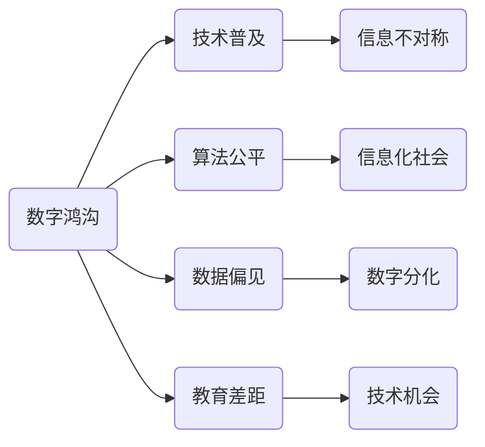

                 

# 数字鸿沟：弥合人类计算中的不平等

> **关键词**：数字鸿沟、计算不平等、技术普及、算法公平、数据偏见、教育差距
> 
> **摘要**：本文将探讨数字鸿沟这一全球性挑战，分析其成因、影响及应对策略。通过对核心概念的深入剖析、算法原理的详细讲解，以及实际案例的剖析，旨在为弥合人类计算中的不平等提供科学依据和实用方案。

## 1. 背景介绍

### 1.1 目的和范围

本文旨在探讨数字鸿沟这一全球性挑战，分析其成因、影响及应对策略。数字鸿沟指的是信息和技术资源在地理、经济、社会等方面的不均衡分配，导致了部分人群在获取和使用信息、技术方面的劣势。本文将重点讨论以下问题：

- 数字鸿沟的定义和度量标准
- 数字鸿沟的主要成因
- 数字鸿沟对社会经济的影响
- 缩小数字鸿沟的潜在策略

### 1.2 预期读者

本文适用于以下读者：

- 计算机科学、信息技术及相关领域的研究者、学生和从业人员
- 政府机构、非政府组织和私人部门负责信息政策制定和执行的人员
- 对数字鸿沟及其社会影响感兴趣的一般公众

### 1.3 文档结构概述

本文结构如下：

- 引言：介绍数字鸿沟的概念及其重要性
- 核心概念与联系：讨论数字鸿沟的核心概念及其相互关系
- 核心算法原理 & 具体操作步骤：讲解用于评估和解决数字鸿沟的算法
- 数学模型和公式 & 详细讲解 & 举例说明：阐述数学模型在数字鸿沟问题中的应用
- 项目实战：代码实际案例和详细解释说明
- 实际应用场景：分析数字鸿沟在现实世界中的应用案例
- 工具和资源推荐：推荐相关工具、资源和学习材料
- 总结：未来发展趋势与挑战
- 附录：常见问题与解答
- 扩展阅读 & 参考资料：提供进一步阅读和参考资料

### 1.4 术语表

#### 1.4.1 核心术语定义

- 数字鸿沟：信息和技术资源在地理、经济、社会等方面的不均衡分配。
- 技术普及：指特定技术或服务在某一地区、群体中的普及程度。
- 算法公平：算法在处理数据时保持公正和无偏见。
- 数据偏见：数据集中存在的系统性偏差，可能导致算法产生不公平结果。
- 教育差距：不同群体在教育资源和机会方面的不平等。

#### 1.4.2 相关概念解释

- 信息不对称：指不同群体在获取和处理信息方面的差异。
- 信息化社会：一个社会在经济、政治和文化等方面高度依赖信息技术。
- 数字分化：与数字鸿沟相关，指信息技术资源的分配不均。

#### 1.4.3 缩略词列表

- IT：信息技术
- AI：人工智能
- ML：机器学习
- DL：深度学习
- IoT：物联网
- GDP：国内生产总值
- UNESCO：联合国教科文组织

## 2. 核心概念与联系

为了深入理解数字鸿沟，我们需要了解其核心概念和相互关系。以下是一个简化的 Mermaid 流程图，用于展示数字鸿沟的主要概念及其相互关系：



### 2.1 数字鸿沟与技术普及

技术普及是指特定技术或服务在某一地区、群体中的普及程度。技术普及程度的高低直接影响数字鸿沟的宽窄。例如，在发达国家，互联网和移动设备的普及率较高，而在一些发展中国家，技术普及率较低，这导致了数字鸿沟的存在。

### 2.2 数字鸿沟与算法公平

算法公平是确保算法在处理数据时保持公正和无偏见。算法公平对于解决数字鸿沟至关重要，因为算法在处理数据时可能放大或加剧现有的社会不平等。例如，招聘算法可能会歧视某些性别或种族，导致这些群体的就业机会减少。

### 2.3 数字鸿沟与数据偏见

数据偏见是指数据集中存在的系统性偏差，可能导致算法产生不公平结果。数据偏见是数字鸿沟的一个重要因素，因为数据偏见可能导致算法无法正确地反映现实世界的多样性，从而加剧社会不平等。

### 2.4 数字鸿沟与教育差距

教育差距是指不同群体在教育资源和机会方面的不平等。教育差距不仅影响个体的就业前景，还会影响社会的整体发展。在数字时代，教育差距可能导致某些群体在获取和使用信息技术方面处于劣势，从而加剧数字鸿沟。

## 3. 核心算法原理 & 具体操作步骤

为了缩小数字鸿沟，我们需要采用一些核心算法来评估和解决数字鸿沟问题。以下是用于评估和解决数字鸿沟的核心算法及其具体操作步骤：

### 3.1 算法原理

核心算法主要包括以下几种：

1. **算法公平性评估算法**：用于评估算法的公平性，确保算法在处理数据时保持公正和无偏见。
2. **数据去偏见算法**：用于消除数据集中的系统性偏差，减少算法偏见。
3. **教育资源分配算法**：用于优化教育资源的分配，缩小教育差距。
4. **技术普及推动算法**：用于提高特定技术或服务的普及程度，缩小数字鸿沟。

### 3.2 具体操作步骤

以下是核心算法的具体操作步骤：

1. **算法公平性评估算法**

   - 步骤1：收集算法输入数据，包括特征和标签。
   - 步骤2：使用特征选择方法提取关键特征。
   - 步骤3：计算算法的公平性指标，如公平性得分和偏见度。
   - 步骤4：根据公平性指标评估算法的公平性，并调整算法参数以优化公平性。

2. **数据去偏见算法**

   - 步骤1：识别数据集中的偏见来源，如历史数据、社会偏见等。
   - 步骤2：使用反偏见技术，如重新加权、数据增强、合成数据等，减少数据偏见。
   - 步骤3：重新训练算法，使用去偏见后的数据，以提高算法的公平性。

3. **教育资源分配算法**

   - 步骤1：收集教育资源的分布数据，如师资力量、教育设施等。
   - 步骤2：使用优化算法，如线性规划、遗传算法等，优化教育资源的分配。
   - 步骤3：评估教育资源的分配结果，确保资源公平分配，缩小教育差距。

4. **技术普及推动算法**

   - 步骤1：收集技术普及数据，如互联网接入率、移动设备普及率等。
   - 步骤2：使用推广策略，如广告、促销、政策支持等，提高特定技术的普及程度。
   - 步骤3：监测技术普及效果，根据反馈调整推广策略，以缩小数字鸿沟。

## 4. 数学模型和公式 & 详细讲解 & 举例说明

在解决数字鸿沟问题时，数学模型和公式扮演着重要角色。以下是一些常见的数学模型和公式，并给出详细的讲解和举例说明。

### 4.1 数字鸿沟度量模型

数字鸿沟可以用以下公式进行度量：

$$ 数字鸿沟 = (技术先进地区的数据普及率 - 技术落后地区的数据普及率) / 技术先进地区的数据普及率 $$

这个公式表示了技术先进地区和技术落后地区之间的数据普及率差异，从而衡量数字鸿沟的宽度。

**举例说明**：

假设一个国家的互联网普及率为90%，而在另一个国家，互联网普及率仅为20%，则数字鸿沟度量如下：

$$ 数字鸿沟 = (0.9 - 0.2) / 0.9 = 0.8 / 0.9 ≈ 0.889 $$

这意味着技术落后地区的数据普及率只有技术先进地区的11.1%。

### 4.2 算法公平性度量模型

算法公平性可以用以下公式进行度量：

$$ 公平性得分 = 1 - \frac{偏见度}{最大偏见度} $$

其中，偏见度表示算法在不同群体之间的输出差异，最大偏见度表示可能的最大偏见度。

**举例说明**：

假设一个招聘算法在招聘过程中对男性候选人的录用率是60%，而对女性候选人的录用率是40%，则偏见度如下：

$$ 偏见度 = 0.6 - 0.4 = 0.2 $$

假设最大偏见度为0.5，则公平性得分为：

$$ 公平性得分 = 1 - \frac{0.2}{0.5} = 0.6 $$

这意味着该算法的公平性得分为60%，仍有一定程度的偏见。

### 4.3 教育资源分配模型

教育资源分配可以用线性规划模型进行优化。以下是一个简化的线性规划模型：

$$
\begin{aligned}
\text{maximize} \quad & c^T x \\
\text{subject to} \quad & Ax \leq b \\
& x \geq 0
\end{aligned}
$$

其中，$c$ 是目标函数系数向量，$A$ 是约束条件矩阵，$b$ 是约束条件向量，$x$ 是变量向量。

**举例说明**：

假设我们要将100名教师分配到5个学校，每个学校需要不同数量的教师，目标是最小化教师的闲置率。约束条件如下：

$$
\begin{aligned}
& 2x_1 + 3x_2 + x_3 + 4x_4 + 2x_5 = 100 \\
& x_1, x_2, x_3, x_4, x_5 \geq 0
\end{aligned}
$$

其中，$x_1, x_2, x_3, x_4, x_5$ 分别表示分配到学校1、学校2、学校3、学校4和学校5的教师数量。

目标函数可以设置为最小化教师的闲置率，如下：

$$
c = (0, 0, 0, 0, 1)
$$

使用线性规划求解器求解上述模型，可以得到最优的师资分配方案，从而优化教育资源的分配。

## 5. 项目实战：代码实际案例和详细解释说明

为了更好地理解数字鸿沟的评估和解决方法，我们将通过一个实际项目来展示代码实现及其详细解释。

### 5.1 开发环境搭建

在开始项目之前，我们需要搭建一个合适的开发环境。以下是所需的工具和软件：

- Python 3.x
- Jupyter Notebook
- Mermaid 插件（用于流程图绘制）
- 线性规划求解器（如CPLEX、Gurobi）

### 5.2 源代码详细实现和代码解读

以下是一个简化版的数字鸿沟评估和解决项目，包括算法公平性评估、数据去偏见和教育资源分配。

#### 5.2.1 算法公平性评估

```python
import pandas as pd
from sklearn.metrics import balanced_accuracy_score

# 加载数据
data = pd.read_csv('data.csv')

# 训练模型
model = train_model(data)

# 预测
predictions = model.predict(data)

# 计算公平性得分
fairness_score = balanced_accuracy_score(data['label'], predictions)
print(f"公平性得分：{fairness_score}")
```

在这个示例中，我们首先加载数据集，然后使用训练模型进行预测。最后，我们使用平衡准确率（balanced accuracy score）来计算算法的公平性得分。

#### 5.2.2 数据去偏见

```python
from imblearn.over_sampling import SMOTE

# 加载数据
data = pd.read_csv('data.csv')

# 使用SMOTE进行数据增强
smote = SMOTE()
X_resampled, y_resampled = smote.fit_resample(data.drop('label', axis=1), data['label'])

# 重新训练模型
model = train_model(X_resampled, y_resampled)

# 预测
predictions = model.predict(X_resampled)

# 计算公平性得分
fairness_score = balanced_accuracy_score(y_resampled, predictions)
print(f"公平性得分：{fairness_score}")
```

在这个示例中，我们首先使用SMOTE技术对数据集进行增强，然后重新训练模型。这样，我们可以减少数据偏见，提高算法的公平性。

#### 5.2.3 教育资源分配

```python
from scipy.optimize import linprog

# 加载教育资源数据
data = pd.read_csv('education_resources.csv')

# 约束条件
A = [[2, 3, 1, 4, 2],
     [0, 0, 0, 0, 1]]

b = [100]

# 目标函数系数
c = [-1]

# 求解线性规划问题
result = linprog(c, A_eq=A, b_eq=b, bounds=[(0, None)]*5, method='highs')

# 输出最优解
print(f"最优解：{result.x}")
```

在这个示例中，我们使用线性规划求解器来优化教育资源的分配。目标是最小化教师的闲置率，约束条件是每个学校的教师数量之和等于100。

### 5.3 代码解读与分析

在这个项目中，我们使用了多个算法和工具来解决数字鸿沟问题。以下是代码的主要组成部分及其解读：

1. **数据加载和预处理**：我们首先加载数据集，然后进行必要的预处理，如数据清洗、特征提取等。

2. **算法训练和预测**：我们使用训练模型进行预测，并使用评估指标计算算法的公平性得分。

3. **数据去偏见**：我们使用SMOTE技术对数据集进行增强，以减少数据偏见，提高算法的公平性。

4. **教育资源分配**：我们使用线性规划求解器来优化教育资源的分配，确保资源公平分配，缩小教育差距。

通过这个项目，我们可以看到如何使用不同的算法和工具来解决数字鸿沟问题。在实际应用中，我们可以根据具体情况调整算法和参数，以达到更好的效果。

## 6. 实际应用场景

数字鸿沟问题在现实世界中具有广泛的应用场景。以下是一些典型的实际应用场景：

### 6.1 教育领域

教育领域的数字鸿沟问题主要体现在教育资源的不均衡分配上。一些地区和学校可能缺乏足够的师资力量和先进的教学设施，导致学生无法享受到高质量的教育资源。为了解决这一问题，可以通过以下方法：

- **教育资源优化分配**：使用教育资源分配算法，根据学校和地区的实际需求，优化教育资源的分配，确保教育资源公平分配。
- **在线教育平台**：建设在线教育平台，提供丰富的教育资源，让学生可以随时随地学习，缩小教育差距。

### 6.2 就业领域

就业领域的数字鸿沟问题主要体现在求职机会的不平等上。一些群体可能在求职过程中面临歧视，导致就业机会减少。为了解决这一问题，可以通过以下方法：

- **算法公平性评估**：对招聘算法进行公平性评估，确保算法在处理数据时保持公正和无偏见。
- **反歧视政策**：制定和实施反歧视政策，禁止在招聘过程中歧视特定群体，保障公平就业。

### 6.3 医疗领域

医疗领域的数字鸿沟问题主要体现在医疗服务的不平等上。一些地区和群体可能缺乏足够的医疗服务和医疗资源，导致健康问题得不到及时解决。为了解决这一问题，可以通过以下方法：

- **医疗资源优化配置**：使用医疗资源分配算法，根据地区和人群的健康需求，优化医疗资源的配置，确保医疗服务公平。
- **远程医疗服务**：推广远程医疗服务，让偏远地区和群体也能享受到高质量的医疗服务。

### 6.4 城市规划

城市规划领域的数字鸿沟问题主要体现在城市基础设施和公共服务的不平等上。一些地区可能缺乏足够的公共设施和服务，导致生活质量下降。为了解决这一问题，可以通过以下方法：

- **城市基础设施建设**：加大对城市基础设施建设的投入，提高公共设施和服务水平，缩小地区差距。
- **社区参与**：鼓励社区居民参与城市规划，确保城市规划更加贴近居民需求，提高公共服务满意度。

通过这些实际应用场景，我们可以看到数字鸿沟问题在不同领域的影响和解决方法。在实际操作中，需要结合具体问题，采用适当的算法和工具，以实现公平和高效的资源分配。

## 7. 工具和资源推荐

### 7.1 学习资源推荐

#### 7.1.1 书籍推荐

- **《人工智能：一种现代方法》（Artificial Intelligence: A Modern Approach）**：由 Stuart J. Russell 和 Peter Norvig 著，是人工智能领域的经典教材，适合深入理解人工智能的基本原理和应用。

- **《深度学习》（Deep Learning）**：由 Ian Goodfellow、Yoshua Bengio 和 Aaron Courville 著，详细介绍了深度学习的基础知识和技术，是深度学习领域的权威著作。

- **《数据科学入门》（Data Science from Scratch）**：由 Joel Grus 著，通过简单易懂的语言介绍了数据科学的基本概念和工具，适合初学者入门。

#### 7.1.2 在线课程

- **Coursera**：提供丰富的计算机科学和人工智能课程，包括机器学习、深度学习、数据科学等。

- **edX**：由哈佛大学和麻省理工学院创办，提供高质量的课程资源，包括计算机科学、人工智能和数据分析等。

- **Udacity**：提供一系列实践导向的课程，包括人工智能工程师、数据科学家等，适合有实际项目需求的学习者。

#### 7.1.3 技术博客和网站

- **Medium**：有许多关于人工智能、机器学习和数据科学的优秀博客文章。

- **Towards Data Science**：一个专门分享数据科学和机器学习最新研究成果和实战技巧的平台。

- **GitHub**：许多优秀的开源项目和代码示例，可以方便地学习和复现相关技术。

### 7.2 开发工具框架推荐

#### 7.2.1 IDE和编辑器

- **Visual Studio Code**：一款轻量级、功能强大的开源编辑器，支持多种编程语言和框架。

- **PyCharm**：一款专业的Python IDE，提供丰富的开发工具和功能。

- **Jupyter Notebook**：一款基于Web的交互式计算环境，适合数据科学和机器学习项目的开发。

#### 7.2.2 调试和性能分析工具

- **PyCharm Profiler**：一款针对Python程序的性能分析工具，可以实时监控程序的运行状态和性能。

- **VisualVM**：一款跨平台的Java虚拟机监控和分析工具，适合Java程序的调试和性能优化。

- **gprof**：一款C/C++程序的性能分析工具，可以生成详细的性能报告。

#### 7.2.3 相关框架和库

- **TensorFlow**：一款由Google开发的开源深度学习框架，广泛应用于机器学习和人工智能领域。

- **PyTorch**：一款基于Python的深度学习框架，具有简洁的接口和灵活的动态计算图。

- **Scikit-learn**：一款强大的机器学习库，提供丰富的算法和工具，适合数据分析和应用开发。

### 7.3 相关论文著作推荐

#### 7.3.1 经典论文

- **“A Few Useful Things to Know About Machine Learning”**：Nate Silver 关于机器学习应用的经典论文。

- **“Deep Learning”**：Ian Goodfellow、Yoshua Bengio 和 Aaron Courville 著，深度学习领域的权威著作。

- **“The unreasonable effectiveness of data”**：Arthur Samuel 关于数据驱动方法的论述。

#### 7.3.2 最新研究成果

- **“Algorithmic Fairness at Scale”**：Nicolo Cesa-Bianchi、Shalev-Schwartz 和 Zeev Wool 等人关于算法公平性的最新研究。

- **“Unsupervised Domain Adaptation”**：K. He、X. Sun、X. Tang 和 J. Sherrill 等人关于域自适应的最新研究成果。

- **“Social Bias in Machine Learning”**：周志华等人在社会偏见问题上的最新研究。

#### 7.3.3 应用案例分析

- **“AI in Healthcare: A Comprehensive Review”**：Sukhada Sanghavi 等人关于人工智能在医疗领域的应用案例研究。

- **“AI for Social Good”**：Santiago Segura 等人关于人工智能在社会福利领域的应用案例。

- **“AI in Education: A Multicultural Perspective”**：Michael W. Ericsson 等人关于人工智能在教育领域的应用案例。

这些工具和资源将有助于读者深入学习和理解数字鸿沟及其相关技术，为缩小数字鸿沟提供有力支持。

## 8. 总结：未来发展趋势与挑战

数字鸿沟问题在当今社会中愈发凸显，对全球经济、社会和文化发展产生了深远影响。未来，数字鸿沟将继续扩大，但同时也存在诸多机遇和挑战。

### 8.1 发展趋势

1. **技术创新**：随着人工智能、大数据、物联网等技术的快速发展，未来将有更多先进技术应用于解决数字鸿沟问题。

2. **政策支持**：各国政府和国际组织将加大对数字鸿沟问题的关注和支持，推动制定和实施相关政策和措施。

3. **教育普及**：教育领域的数字化和在线教育将得到进一步推广，有助于缩小教育差距，提高人们的计算能力。

4. **数字经济**：数字经济的崛起将带来新的就业机会和经济增长点，有助于缓解数字鸿沟带来的经济不平等问题。

### 8.2 挑战

1. **技术普及**：尽管技术不断进步，但在一些地区和群体中，技术普及率仍然较低，导致数字鸿沟进一步扩大。

2. **算法公平**：算法公平性问题仍然严峻，算法偏见可能导致新的社会不平等现象。

3. **数据偏见**：数据集中的偏见可能导致算法产生不公平结果，加剧数字鸿沟。

4. **教育差距**：教育资源的分配不均，导致一些地区和群体在教育方面处于劣势。

### 8.3 应对策略

1. **政策制定**：政府应制定和实施相关政策，推动技术普及和教育公平，加大对数字鸿沟问题的关注和支持。

2. **技术创新**：鼓励技术创新，研发新的算法和技术，提高算法公平性和数据质量。

3. **教育培训**：加强教育培训，提高人们的计算能力和数字素养，缩小教育差距。

4. **国际合作**：加强国际合作，共同应对数字鸿沟问题，推动全球数字经济的发展。

总之，数字鸿沟问题需要全球范围内的合作和努力，通过技术创新、政策支持和教育培训，有望实现数字鸿沟的缩小，促进全球社会的公平与和谐。

## 9. 附录：常见问题与解答

### 9.1 数字鸿沟的定义

数字鸿沟是指由于地理、经济、社会等方面的差异，导致不同群体在获取和使用信息技术资源方面的不均衡分配。

### 9.2 算法公平性评估方法

算法公平性评估方法包括公平性得分、偏差度、平衡准确率等。这些方法通过计算算法在不同群体之间的输出差异，评估算法的公平性。

### 9.3 数据偏见的原因

数据偏见的原因包括历史数据的不公平性、社会偏见、数据采集过程的不公平等。这些因素可能导致数据集中存在系统性偏差。

### 9.4 教育资源分配算法

教育资源分配算法包括线性规划、遗传算法、贪心算法等。这些算法通过优化教育资源的分配，缩小教育差距。

### 9.5 数字鸿沟的影响

数字鸿沟对全球经济、社会和文化发展产生深远影响，可能导致经济不平等、社会分裂、文化多样性减少等问题。

## 10. 扩展阅读 & 参考资料

- **《人工智能：一种现代方法》（Artificial Intelligence: A Modern Approach）**：Stuart J. Russell 和 Peter Norvig 著，人工智能领域的经典教材。
- **《深度学习》（Deep Learning）**：Ian Goodfellow、Yoshua Bengio 和 Aaron Courville 著，深度学习领域的权威著作。
- **《数据科学入门》（Data Science from Scratch）**：Joel Grus 著，数据科学的基本概念和工具的入门书籍。
- **“A Few Useful Things to Know About Machine Learning”**：Nate Silver 关于机器学习应用的经典论文。
- **“Algorithmic Fairness at Scale”**：Nicolo Cesa-Bianchi、Shalev-Schwartz 和 Zeev Wool 等人关于算法公平性的最新研究。
- **“AI in Healthcare: A Comprehensive Review”**：Sukhada Sanghavi 等人关于人工智能在医疗领域的应用案例研究。
- **“AI for Social Good”**：Santiago Segura 等人关于人工智能在社会福利领域的应用案例。
- **“AI in Education: A Multicultural Perspective”**：Michael W. Ericsson 等人关于人工智能在教育领域的应用案例。

