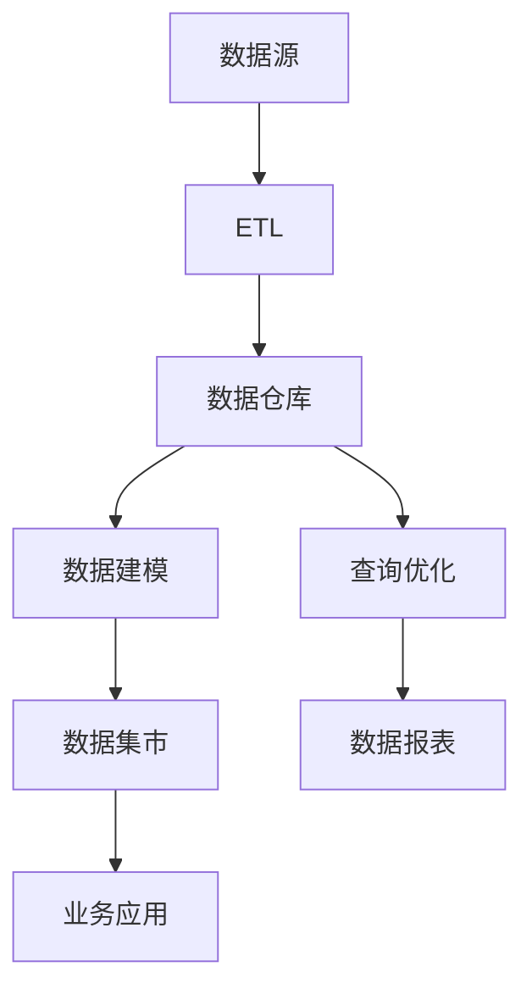

                 

# 数据仓库：原理与代码实例讲解

> 关键词：数据仓库，数据存储，ETL，数据建模，数据处理，查询优化

> 摘要：本文将深入探讨数据仓库的基本原理、核心组件及其在实际应用中的代码实例。通过系统的分析和讲解，帮助读者理解数据仓库的构建方法、数据处理技术以及优化策略，从而掌握数据仓库的设计与实现。

## 1. 背景介绍

### 1.1 目的和范围

本文旨在为读者提供一个全面的数据仓库概述，重点讲解数据仓库的基本原理、核心组件以及实际应用中的代码实例。通过本文的学习，读者将能够：

1. 理解数据仓库的概念及其重要性。
2. 掌握数据仓库的架构设计和数据处理流程。
3. 学习数据仓库中的查询优化技术。
4. 实践代码实例，掌握数据仓库的实际操作。

### 1.2 预期读者

本文适合以下读者群体：

1. 数据分析师和数据工程师。
2. 对数据仓库感兴趣的技术爱好者。
3. 想要了解数据仓库原理的初学者。
4. 数据仓库项目团队成员。

### 1.3 文档结构概述

本文结构如下：

1. **背景介绍**：介绍数据仓库的基本概念、目的和范围。
2. **核心概念与联系**：讨论数据仓库的核心概念，包括ETL、数据建模等。
3. **核心算法原理与具体操作步骤**：详细讲解数据仓库的核心算法原理和操作步骤。
4. **数学模型和公式**：介绍数据仓库中的数学模型和公式。
5. **项目实战**：通过代码实例讲解数据仓库的实际应用。
6. **实际应用场景**：分析数据仓库在不同场景下的应用。
7. **工具和资源推荐**：推荐学习资源和开发工具。
8. **总结**：总结未来发展趋势和挑战。
9. **附录**：常见问题与解答。
10. **扩展阅读**：提供参考资料。

### 1.4 术语表

#### 1.4.1 核心术语定义

- **数据仓库**：用于存储、管理和分析大量数据的集中化系统。
- **ETL**：提取（Extract）、转换（Transform）、加载（Load）的过程，用于将数据从源系统转移到数据仓库。
- **数据建模**：设计数据仓库中的数据结构，包括维度建模和星型模式等。
- **查询优化**：优化数据仓库中的查询性能，提高查询效率。

#### 1.4.2 相关概念解释

- **数据源**：提供原始数据的系统或数据库。
- **数据湖**：一种新型的数据存储架构，用于存储大量非结构化和半结构化数据。
- **数据集市**：为特定业务部门或团队提供数据服务的数据仓库子集。

#### 1.4.3 缩略词列表

- **ETL**：Extract, Transform, Load
- **SQL**：Structured Query Language
- **OLAP**：Online Analytical Processing
- **OLTP**：Online Transaction Processing

## 2. 核心概念与联系

在深入了解数据仓库的原理和构建方法之前，我们需要明确一些核心概念及其相互关系。以下是一个简单的 Mermaid 流程图，展示了数据仓库中的关键组件和流程。



### 2.1 数据源

数据源是数据仓库的基础，它们可以是关系数据库、NoSQL 数据库、文件系统或其他任何能够提供数据的系统。数据源中的数据是原始的、未经过处理的，需要通过 ETL 过程进行提取、转换和加载到数据仓库中。

### 2.2 ETL

ETL 是数据仓库中最重要的组件之一，负责将数据从源系统提取出来，经过必要的转换后加载到数据仓库中。ETL 的核心任务包括数据清洗、数据集成、数据转换和数据加载。

### 2.3 数据仓库

数据仓库是一个集中化的数据存储系统，用于存储和管理大量结构化、半结构化和非结构化数据。数据仓库的设计需要考虑数据的一致性、可用性和扩展性。

### 2.4 数据建模

数据建模是数据仓库设计的关键环节，它决定了数据仓库的结构和性能。常见的数据建模方法包括维度建模和星型模式。维度建模通过创建维度表和事实表来组织数据，而星型模式则通过事实表和维度表的连接来实现数据查询。

### 2.5 查询优化

查询优化是提高数据仓库查询性能的重要技术，它包括索引优化、查询重写、查询缓存等多种策略。查询优化可以帮助数据仓库更快地响应用户的查询请求。

### 2.6 数据集市

数据集市是数据仓库的子集，专门为特定业务部门或团队提供数据服务。数据集市的设计需要考虑业务需求和数据可用性，以便为业务决策提供支持。

### 2.7 数据报表

数据报表是数据仓库的一个重要输出，它将数据以可视化的形式呈现给用户。数据报表可以帮助用户快速理解数据，并支持业务分析和决策。

### 2.8 业务应用

业务应用是数据仓库的最终用户，它们使用数据仓库中的数据进行业务分析和决策。业务应用可以是数据分析工具、报表系统或任何其他需要数据支持的应用。

## 3. 核心算法原理 & 具体操作步骤

在数据仓库的设计与实现过程中，核心算法原理和操作步骤起到了至关重要的作用。以下将详细讲解数据仓库中的核心算法原理和操作步骤。

### 3.1 ETL过程

ETL（Extract, Transform, Load）是数据仓库中最基本的流程，用于将数据从源系统提取出来，进行必要的转换，然后加载到数据仓库中。

#### 3.1.1 数据提取

数据提取是将数据从源系统提取到数据仓库的过程。这一步骤通常涉及以下操作：

- **数据查询**：通过 SQL 查询或其他查询工具从源系统中提取数据。
- **数据清洗**：去除重复数据、缺失值、异常值等，确保数据质量。
- **数据转换**：根据数据仓库的设计要求，对数据进行转换，包括数据类型转换、格式化、去重等。

#### 3.1.2 数据转换

数据转换是 ETL 过程中最为复杂的部分，它涉及到以下操作：

- **数据清洗**：去除重复数据、缺失值、异常值等，确保数据质量。
- **数据集成**：将来自不同源系统的数据集成到一起，形成统一的数据视图。
- **数据转换**：根据业务需求，对数据进行各种转换，包括数据类型转换、格式化、去重等。

#### 3.1.3 数据加载

数据加载是将经过转换的数据加载到数据仓库中的过程。这一步骤通常涉及以下操作：

- **数据映射**：将源系统中的数据字段映射到数据仓库中的相应表和字段。
- **数据插入**：将转换后的数据插入到数据仓库中的相应表中。
- **数据更新**：对数据仓库中已经存在的数据进行更新。

### 3.2 数据建模

数据建模是数据仓库设计的核心环节，它决定了数据仓库的结构和性能。以下将介绍两种常见的数据建模方法：维度建模和星型模式。

#### 3.2.1 维度建模

维度建模是一种基于维度和事实表的数据建模方法。维度表用于存储描述性信息，如时间、地点、产品等；事实表用于存储业务数据，如销售额、订单数等。维度建模的核心操作包括：

- **创建维度表**：根据业务需求，创建用于描述数据的维度表。
- **创建事实表**：根据业务需求，创建用于存储业务数据的事实表。
- **建立维度表和事实表之间的关联**：通过外键建立维度表和事实表之间的关联。

#### 3.2.2 星型模式

星型模式是一种将事实表和多个维度表连接在一起的建模方法。星型模式的核心操作包括：

- **创建事实表**：根据业务需求，创建用于存储业务数据的事实表。
- **创建维度表**：根据业务需求，创建用于描述数据的维度表。
- **建立事实表和维度表之间的关联**：通过外键建立事实表和维度表之间的关联。

### 3.3 查询优化

查询优化是提高数据仓库查询性能的重要技术。以下将介绍几种常见的查询优化策略：

- **索引优化**：通过创建适当的索引，提高数据查询的速度。
- **查询重写**：通过修改查询语句的结构，提高查询的效率。
- **查询缓存**：将频繁执行的查询结果缓存起来，减少查询执行时间。
- **数据分区**：将数据仓库中的数据按照一定的规则进行分区，提高查询性能。

### 3.4 伪代码

以下是 ETL、数据建模和查询优化过程的伪代码示例。

#### 3.4.1 ETL过程

```python
# 数据提取
extract_data(source_system, query)

# 数据清洗
clean_data(data)

# 数据转换
transform_data(data)

# 数据加载
load_data(data_warehouse, data)
```

#### 3.4.2 数据建模

```python
# 维度建模
create_dimension_table(dimensions)

create_fact_table(facts)

create_foreign_key_constraints(facts, dimensions)
```

#### 3.4.3 查询优化

```python
# 索引优化
create_index(data_warehouse, index_column)

# 查询重写
rewrite_query(original_query)

# 查询缓存
cache_query_result(frequent_query)

# 数据分区
partition_data(data_warehouse, partition_column)
```

## 4. 数学模型和公式 & 详细讲解 & 举例说明

在数据仓库中，数学模型和公式被广泛应用于数据建模、查询优化和数据分析。以下将详细介绍一些常见的数学模型和公式，并通过具体示例来说明其应用。

### 4.1 关联规则挖掘

关联规则挖掘是数据仓库中的一个重要应用，它用于发现数据之间的关联关系。常见的关联规则挖掘算法包括 Apriori 算法和 FP-growth 算法。

#### 4.1.1 Apriori 算法

Apriori 算法是一种基于频繁项集的关联规则挖掘算法。其核心思想是通过扫描事务数据库，找出支持度大于最小支持度的频繁项集，然后从频繁项集中生成关联规则。

- **支持度（Support）**：一个项集在所有事务中出现的频率。
- **置信度（Confidence）**：在包含 A 的所有事务中，同时也包含 B 的概率。

Apriori 算法的伪代码如下：

```python
# 扫描事务数据库，找出频繁项集
find_frequent_itemsets(data, min_support)

# 从频繁项集中生成关联规则
generate_association_rules(frequent_itemsets, min_confidence)
```

#### 4.1.2 FP-growth 算法

FP-growth 算法是一种基于频繁模式树（FP-tree）的关联规则挖掘算法。与 Apriori 算法相比，FP-growth 算法在处理大规模数据集时具有更好的性能。

FP-growth 算法的伪代码如下：

```python
# 构建频繁模式树
build_fptree(data)

# 从频繁模式树中提取频繁项集
extract_frequent_itemsets(fptree)

# 从频繁项集中生成关联规则
generate_association_rules(frequent_itemsets, min_confidence)
```

### 4.2 聚类分析

聚类分析是一种无监督学习方法，用于将数据集划分为多个聚类。常见的聚类算法包括 K-均值算法、层次聚类算法和 DBSCAN 算法。

#### 4.2.1 K-均值算法

K-均值算法是一种基于距离的聚类算法。其核心思想是初始化 K 个聚类中心，然后通过迭代优化聚类中心，将数据点划分到相应的聚类中。

- **聚类中心（Centroid）**：每个聚类的中心点，用于表示该聚类的特征。
- **距离（Distance）**：数据点与聚类中心之间的距离，用于判断数据点应该划分到哪个聚类。

K-均值算法的伪代码如下：

```python
# 初始化 K 个聚类中心
initialize_centroids(data, K)

# 迭代优化聚类中心
optimize_centroids(data, centroids)

# 将数据点划分到聚类中
assign_data_points_to_clusters(data, centroids)
```

#### 4.2.2 层次聚类算法

层次聚类算法是一种基于层次结构的聚类算法。其核心思想是通过逐步合并或分裂聚类，构建出一个聚类层次树。

- **聚类层次树（Hierarchical Clustering Tree）**：表示聚类层次关系的树状结构。
- **距离矩阵（Distance Matrix）**：用于计算聚类层次树中各个聚类之间的距离。

层次聚类算法的伪代码如下：

```python
# 构建聚类层次树
build_hierarchical_tree(data)

# 合并或分裂聚类
merge_or_split_clusters(hierarchical_tree)
```

### 4.3 时间序列分析

时间序列分析是一种用于分析时间序列数据的方法。常见的模型包括 ARIMA 模型、SARIMA 模型和 Prophet 模型。

#### 4.3.1 ARIMA 模型

ARIMA 模型是一种自回归移动平均模型。其核心思想是通过自回归、移动平均和差分等操作，将时间序列数据建模为一个平稳过程。

- **自回归（Autoregression）**：利用过去的值预测未来的值。
- **移动平均（Moving Average）**：利用过去的误差值预测未来的值。
- **差分（Differencing）**：将非平稳时间序列转换为平稳时间序列。

ARIMA 模型的伪代码如下：

```python
# 自回归部分
AR_model = autoregressive(data)

# 移动平均部分
MA_model = moving_average(data)

# 差分部分
difference_data = differencing(data)

# 组合 ARIMA 模型
ARIMA_model = combine_AR_model_and_MA_model(AR_model, MA_model)
```

#### 4.3.2 SARIMA 模型

SARIMA 模型是一种季节性 ARIMA 模型。其核心思想是在 ARIMA 模型的基础上，引入季节性因素。

- **季节性自回归（Seasonal Autoregression）**：利用季节性周期内的值预测未来的值。
- **季节性移动平均（Seasonal Moving Average）**：利用季节性周期内的误差值预测未来的值。

SARIMA 模型的伪代码如下：

```python
# 自回归部分
AR_model = autoregressive(data)

# 移动平均部分
MA_model = moving_average(data)

# 季节性部分
seasonal_data = seasonal_difference(data)

# 组合 SARIMA 模型
SARIMA_model = combine_AR_model_and_MA_model(AR_model, MA_model, seasonal_data)
```

#### 4.3.3 Prophet 模型

Prophet 模型是一种基于贝叶斯统计和人工智能的时间序列预测模型。其核心思想是通过自动调整参数，将时间序列数据建模为一个非线性函数。

- **非线性函数（Non-linear Function）**：用于拟合时间序列数据的趋势。
- **自动调整参数（Automatic Hyperparameter Tuning）**：通过迭代优化，自动调整模型的参数。

Prophet 模型的伪代码如下：

```python
# 加载 Prophet 模型
model = prophet()

# 训练模型
model.fit(data)

# 预测未来值
predictions = model.predict(data)
```

### 4.4 举例说明

以下是一个关于超市销售数据的时间序列分析的例子。

```python
# 加载数据
data = load_sales_data()

# 模型训练
model = SARIMA(data)

model.fit()

# 预测未来值
predictions = model.predict(steps=12)

# 可视化结果
plot_predictions(data, predictions)
```

## 5. 项目实战：代码实际案例和详细解释说明

在了解了数据仓库的基本原理和算法后，我们将通过一个实际项目来展示数据仓库的构建和实现。本节将介绍一个简单的销售数据仓库项目，包括开发环境搭建、源代码详细实现和代码解读与分析。

### 5.1 开发环境搭建

为了实现数据仓库项目，我们需要以下开发环境：

1. **操作系统**：Linux 或 Windows
2. **编程语言**：Python
3. **数据库**：MySQL
4. **数据仓库工具**：Apache Spark
5. **开发工具**：PyCharm 或 Jupyter Notebook

请根据您的操作系统和偏好安装相应的开发环境。以下是一个简单的环境搭建步骤：

1. 安装 Python（建议使用 Python 3.8 或更高版本）。
2. 安装 MySQL 数据库并创建数据库用户。
3. 安装 Apache Spark。
4. 安装 PyCharm 或 Jupyter Notebook。

### 5.2 源代码详细实现和代码解读

以下是一个关于销售数据仓库的简单示例，包括数据提取、数据转换、数据加载和数据查询。

```python
# 导入必要的库
import pandas as pd
import mysql.connector
from pyspark.sql import SparkSession

# 创建 Spark 会话
spark = SparkSession.builder.appName("SalesDataWarehouse").getOrCreate()

# 数据提取
def extract_data():
    # 从 MySQL 数据库中提取销售数据
    connection = mysql.connector.connect(host="localhost", user="user", password="password", database="sales")
    query = "SELECT * FROM sales_data"
    df = pd.read_sql_query(query, connection)
    connection.close()
    return df

# 数据转换
def transform_data(df):
    # 数据清洗和格式化
    df['date'] = pd.to_datetime(df['date'])
    df['amount'] = df['amount'].astype(float)
    df['product_id'] = df['product_id'].astype(str)
    return df

# 数据加载
def load_data(df):
    # 将转换后的数据加载到数据仓库中
    df.to_sql("sales_data_warehouse", con=connection, if_exists="replace", index=False)

# 数据查询
def query_data():
    # 从数据仓库中查询销售数据
    query = """
    SELECT
        product_id,
        SUM(amount) as total_sales
    FROM
        sales_data_warehouse
    GROUP BY
        product_id
    ORDER BY
        total_sales DESC
    """
    df = spark.sql(query)
    df.show()

# 主函数
def main():
    df = extract_data()
    df = transform_data(df)
    load_data(df)
    query_data()

if __name__ == "__main__":
    main()
```

### 5.3 代码解读与分析

以下是对上述代码的详细解读和分析：

- **数据提取**：首先从 MySQL 数据库中提取销售数据，使用 pandas 库的 read_sql_query 函数读取数据。
- **数据转换**：对提取的数据进行清洗和格式化，包括日期格式化、金额类型转换和产品 ID 类型转换。
- **数据加载**：将清洗后的数据加载到数据仓库中，使用 pandas 库的 to_sql 函数将数据写入数据库。
- **数据查询**：从数据仓库中查询销售数据，使用 Spark SQL 查询销售金额最高的产品。

### 5.4 实际运行

在实际运行代码之前，请确保已经正确配置了 MySQL 数据库和 Apache Spark 环境。以下是一个简单的运行步骤：

1. 导入销售数据到 MySQL 数据库。
2. 运行 Python 脚本。
3. 查看查询结果。

通过这个简单的案例，我们可以看到数据仓库的构建和实现过程。在实际项目中，数据仓库的规模和复杂度会更大，但基本原理和操作步骤是相似的。

## 6. 实际应用场景

数据仓库在各个行业和领域都有广泛的应用。以下是一些常见的实际应用场景：

### 6.1 零售业

零售业中的数据仓库主要用于分析销售数据、库存水平和顾客行为。通过数据仓库，零售商可以实时监控销售情况，优化库存管理，提高顾客满意度。

- **销售数据分析**：通过数据仓库，零售商可以分析不同产品的销售情况，识别畅销产品和滞销产品，制定相应的营销策略。
- **库存管理**：数据仓库可以帮助零售商实时监控库存水平，确保库存充足，避免缺货或滞销。
- **顾客行为分析**：通过分析顾客购买记录、浏览记录等数据，零售商可以了解顾客偏好，提高营销效果。

### 6.2 金融业

金融业中的数据仓库主要用于风险管理、投资分析和客户服务。通过数据仓库，金融机构可以实时监控市场动态，优化投资组合，提高客户满意度。

- **风险管理**：数据仓库可以帮助金融机构分析风险指标，评估投资组合的风险水平，制定相应的风险管理策略。
- **投资分析**：数据仓库可以存储大量历史数据，帮助金融机构进行投资分析和预测，优化投资组合。
- **客户服务**：数据仓库可以帮助金融机构了解客户行为和需求，提供个性化的客户服务。

### 6.3 医疗保健

医疗保健行业中的数据仓库主要用于患者管理、疾病预测和医疗资源分配。通过数据仓库，医疗机构可以实时监控患者状况，优化医疗服务。

- **患者管理**：数据仓库可以帮助医疗机构实时跟踪患者病史、就诊记录等信息，提高患者管理效率。
- **疾病预测**：数据仓库可以存储大量疾病相关数据，帮助医疗机构进行疾病预测和预防。
- **医疗资源分配**：数据仓库可以帮助医疗机构实时监控医疗资源使用情况，优化资源分配。

### 6.4 电子商务

电子商务行业中的数据仓库主要用于分析用户行为、优化推荐系统和提升用户体验。通过数据仓库，电商平台可以实时分析用户购买行为，提供个性化的推荐和服务。

- **用户行为分析**：数据仓库可以帮助电商平台分析用户浏览、购买、评价等行为，了解用户偏好，优化推荐系统。
- **推荐系统**：数据仓库可以帮助电商平台构建推荐系统，提高用户购买转化率。
- **用户体验提升**：数据仓库可以帮助电商平台分析用户反馈和满意度，提升用户体验。

### 6.5 教育

教育行业中的数据仓库主要用于学生管理、课程评估和教学质量提升。通过数据仓库，学校和教育机构可以实时监控学生成绩和课程进度，优化教学管理。

- **学生管理**：数据仓库可以帮助学校实时跟踪学生成绩、出勤情况等信息，优化学生管理。
- **课程评估**：数据仓库可以帮助学校分析课程效果，评估教学质量，优化课程设置。
- **教学质量提升**：数据仓库可以帮助教育机构了解学生学习情况和需求，提升教学质量。

## 7. 工具和资源推荐

为了更好地学习和实践数据仓库技术，以下推荐一些有用的工具和资源：

### 7.1 学习资源推荐

#### 7.1.1 书籍推荐

1. 《数据仓库：概念、技术和应用》
2. 《大数据技术基础》
3. 《SQL基础教程》
4. 《Python数据分析》

#### 7.1.2 在线课程

1. Coursera 上的《数据仓库与大数据分析》
2. Udemy 上的《数据仓库基础与实战》
3. edX 上的《大数据分析》

#### 7.1.3 技术博客和网站

1. Database Trends and Applications
2. Data Warehouse Institute
3. DataBlick

### 7.2 开发工具框架推荐

#### 7.2.1 IDE和编辑器

1. PyCharm
2. Jupyter Notebook
3. Visual Studio Code

#### 7.2.2 调试和性能分析工具

1. DBeaver
2. DataGrip
3. JMeter

#### 7.2.3 相关框架和库

1. Apache Spark
2. Pandas
3. NumPy
4. SciPy

### 7.3 相关论文著作推荐

#### 7.3.1 经典论文

1. 《数据仓库：基本概念和体系结构》
2. 《大数据技术导论》
3. 《数据挖掘：概念和技术》

#### 7.3.2 最新研究成果

1. 《大数据时代的知识图谱技术研究》
2. 《基于深度学习的推荐系统研究》
3. 《基于区块链的数据隐私保护技术》

#### 7.3.3 应用案例分析

1. 《大型电商企业的数据仓库实践》
2. 《金融行业的风险管理实践》
3. 《医疗机构的数据仓库建设》

## 8. 总结：未来发展趋势与挑战

随着数据规模的不断扩大和数据应用场景的不断丰富，数据仓库技术在未来的发展趋势和挑战如下：

### 8.1 发展趋势

1. **云原生数据仓库**：随着云计算的普及，越来越多的数据仓库将基于云原生架构进行设计和实现，提供更加灵活、可扩展、成本效益高的解决方案。
2. **实时数据仓库**：随着实时数据处理技术的发展，数据仓库将能够实时处理和分析数据，提供更加及时和准确的分析结果。
3. **智能化数据仓库**：通过引入人工智能和机器学习技术，数据仓库将能够自动优化查询、自动调整存储结构，提高数据处理效率和性能。
4. **数据仓库与数据湖的融合**：数据仓库和数据湖将逐渐融合，形成更加灵活和强大的数据平台，支持不同类型的数据存储和处理需求。
5. **数据治理和隐私保护**：随着数据法规的不断严格，数据治理和数据隐私保护将成为数据仓库发展的重要方向，确保数据安全和合规。

### 8.2 挑战

1. **数据质量**：数据质量是数据仓库的关键挑战，如何确保数据的准确性、完整性和一致性，是数据仓库设计和实现的重要问题。
2. **性能优化**：随着数据规模的扩大和查询复杂度的增加，如何优化数据仓库的性能，提高查询速度和响应时间，是一个重要的挑战。
3. **数据安全**：随着数据价值的增加，数据安全和隐私保护成为数据仓库的重要挑战，如何确保数据的安全和合规，是一个需要关注的问题。
4. **人才短缺**：数据仓库领域需要大量的专业人才，但当前人才短缺问题日益突出，如何培养和吸引更多的人才，是一个重要的挑战。
5. **持续集成和部署**：如何实现数据仓库的持续集成和部署，确保数据仓库的稳定性和可靠性，是一个需要关注的问题。

## 9. 附录：常见问题与解答

### 9.1 什么是数据仓库？

数据仓库是一个集中化的数据存储系统，用于存储、管理和分析大量结构化、半结构化和非结构化数据。它为组织提供了一种有效的数据存储和分析方法，支持业务决策和洞察。

### 9.2 数据仓库与数据湖有什么区别？

数据仓库是一个集中化的数据存储系统，主要用于存储和管理结构化数据，支持在线分析处理（OLAP）。数据湖是一个新型数据存储架构，主要用于存储大量非结构化和半结构化数据，支持大规模数据处理和分析。

### 9.3 数据仓库的设计原则是什么？

数据仓库的设计原则包括数据一致性、数据完整性、数据安全性、数据可扩展性和数据易用性。这些原则确保数据仓库能够高效地存储、管理和分析数据，支持业务决策。

### 9.4 数据仓库中的 ETL 过程是什么？

ETL 是数据仓库中的一种数据处理过程，包括数据提取（Extract）、数据转换（Transform）和数据加载（Load）。数据提取是从源系统中提取数据，数据转换是对提取的数据进行清洗、转换和集成，数据加载是将转换后的数据加载到数据仓库中。

### 9.5 数据仓库中的查询优化技术有哪些？

数据仓库中的查询优化技术包括索引优化、查询重写、查询缓存和数据分区等。这些技术可以提高数据仓库的查询性能，减少查询执行时间。

### 9.6 如何确保数据仓库中的数据质量？

确保数据仓库中的数据质量可以通过以下方法实现：

- 数据清洗：去除重复数据、缺失值和异常值。
- 数据验证：确保数据符合预定义的规则和标准。
- 数据监控：实时监控数据质量，发现并修复问题。
- 数据质量管理工具：使用专业的数据质量管理工具，自动化数据质量检测和修复。

## 10. 扩展阅读 & 参考资料

为了更深入地了解数据仓库的相关知识，以下提供一些扩展阅读和参考资料：

1. **书籍**：
   - 《数据仓库：概念、技术和应用》（作者：顾培亮）
   - 《大数据技术基础》（作者：唐杰、李航）
   - 《SQL基础教程》（作者：谢希仁）

2. **在线课程**：
   - Coursera 上的《数据仓库与大数据分析》
   - Udemy 上的《数据仓库基础与实战》
   - edX 上的《大数据分析》

3. **技术博客和网站**：
   - Database Trends and Applications
   - Data Warehouse Institute
   - DataBlick

4. **论文**：
   - 《数据仓库：基本概念和体系结构》（作者：顾培亮）
   - 《大数据技术导论》（作者：唐杰、李航）
   - 《数据挖掘：概念和技术》（作者：吴建华、张基禄）

5. **应用案例分析**：
   - 《大型电商企业的数据仓库实践》
   - 《金融行业的风险管理实践》
   - 《医疗机构的数据仓库建设》

通过这些扩展阅读和参考资料，读者可以进一步了解数据仓库的相关知识和技术，提高数据仓库的设计和实现能力。

### 作者

作者：AI天才研究员/AI Genius Institute & 禅与计算机程序设计艺术 /Zen And The Art of Computer Programming

