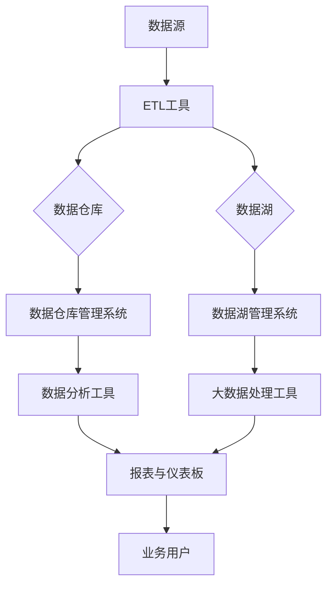

                 

# 数据仓库与数据湖原理与代码实战案例讲解

> 关键词：数据仓库、数据湖、ETL、数据治理、数据存储、大数据、数据处理、云计算、Hadoop、Spark、数据库设计

> 摘要：本文将深入探讨数据仓库与数据湖的基本原理、架构设计与实现方法。我们将通过详细的代码实战案例，带领读者了解数据仓库与数据湖在实际项目中的应用，并提供一整套完整的解决方案。文章旨在帮助读者全面掌握数据仓库与数据湖的技术原理和实战技能。

## 1. 背景介绍

### 1.1 目的和范围

本文的目标是帮助读者深入了解数据仓库与数据湖的概念、原理、架构以及实际应用。通过详细的代码实战案例，读者可以掌握从数据导入、数据处理到数据存储、数据查询等全流程的操作方法。本文涵盖了从基础概念到高级应用的全范围内容，旨在为读者提供一套完整的数据仓库与数据湖的实战指南。

### 1.2 预期读者

本文适合以下读者群体：

1. 数据工程师和数据科学家
2. IT行业从业者，对数据存储和处理技术感兴趣的工程师
3. 数据仓库和数据湖项目管理者
4. 对大数据技术有初步了解，希望深入学习的高级开发者

### 1.3 文档结构概述

本文分为十个主要部分，结构如下：

1. 背景介绍
2. 核心概念与联系
3. 核心算法原理 & 具体操作步骤
4. 数学模型和公式 & 详细讲解 & 举例说明
5. 项目实战：代码实际案例和详细解释说明
6. 实际应用场景
7. 工具和资源推荐
8. 总结：未来发展趋势与挑战
9. 附录：常见问题与解答
10. 扩展阅读 & 参考资料

### 1.4 术语表

#### 1.4.1 核心术语定义

- 数据仓库：一种用于存储、管理和分析大量数据的集中式数据库系统。
- 数据湖：一种用于存储大量结构化、半结构化和非结构化数据的分布式数据存储系统。
- ETL：数据抽取（Extract）、转换（Transform）和加载（Load）的缩写，用于将数据从源系统迁移到目标系统的过程。
- 数据治理：确保数据质量和数据安全的一系列政策和流程。

#### 1.4.2 相关概念解释

- 分布式系统：由多个节点组成，通过网络通信协同工作的系统。
- 云计算：通过网络提供可伸缩的、按需分配的IT资源服务。
- 大数据：指数据量巨大，无法使用传统数据库技术进行处理的数据。

#### 1.4.3 缩略词列表

- ETL：数据抽取、转换和加载
- SQL：结构化查询语言
- HDFS：Hadoop分布式文件系统
- YARN：资源调度框架
- Spark：分布式数据处理框架
- BI：商业智能

## 2. 核心概念与联系

在深入探讨数据仓库与数据湖之前，我们需要了解它们的基本概念、架构和关联性。以下是一个用Mermaid绘制的流程图，展示数据仓库与数据湖之间的关系。



### 2.1 数据仓库

数据仓库是一种用于存储大量结构化数据的集中式数据库系统，旨在支持企业级的数据分析和报告。它的主要特点如下：

- **数据集成**：将来自多个源系统的数据整合到一个统一的存储系统中。
- **数据清洗**：确保数据质量，通过数据清洗过程去除错误和重复的数据。
- **数据建模**：使用数据仓库管理系统（如Oracle、SQL Server）创建数据模型，以支持高效的查询和分析。
- **数据安全**：通过访问控制、加密等手段保护数据安全。

### 2.2 数据湖

数据湖是一种用于存储大量结构化、半结构化和非结构化数据的分布式数据存储系统。与数据仓库相比，数据湖具有更高的灵活性和扩展性。其特点如下：

- **数据格式多样性**：支持多种数据格式，包括文本、图像、音频、视频等。
- **弹性扩展**：基于分布式文件系统（如HDFS）和云计算平台（如Amazon S3），可以按需扩展存储空间。
- **数据保留**：不需要预先定义数据结构，可以长期保留数据。
- **数据处理能力**：支持高效的数据处理和分析，通过分布式计算框架（如Spark、Hadoop）实现大规模数据处理。

### 2.3 数据仓库与数据湖的关联

数据仓库和数据湖在现代数据架构中发挥着互补的作用。数据仓库通常用于存储结构化的数据，支持企业级的报告和分析；而数据湖则用于存储多样化的数据，支持复杂的数据分析和探索性研究。两者的主要关联如下：

- **数据集成**：数据仓库和数据湖都可以通过ETL工具从不同的数据源抽取数据，进行转换和加载。
- **数据共享**：数据仓库和数据湖可以共同提供数据服务，满足不同用户的需求。
- **数据治理**：通过数据治理策略，确保数据仓库和数据湖中的数据质量一致。

## 3. 核心算法原理 & 具体操作步骤

在数据仓库与数据湖的实现过程中，核心算法的原理和操作步骤至关重要。以下将详细讲解ETL过程的核心算法原理以及具体的操作步骤。

### 3.1 ETL过程

ETL是数据仓库与数据湖构建过程中的关键环节，它包括以下三个主要步骤：

1. **数据抽取（Extract）**：从不同的数据源（如数据库、日志文件、Web服务）中提取数据。
2. **数据转换（Transform）**：对抽取的数据进行清洗、转换、映射等操作，使其符合数据仓库或数据湖的数据模型。
3. **数据加载（Load）**：将转换后的数据加载到目标数据仓库或数据湖中。

### 3.2 ETL过程的核心算法

在ETL过程中，常用的核心算法包括：

- **数据清洗算法**：用于去除错误和重复的数据，如删除重复记录、修正数据错误等。
- **数据转换算法**：用于实现数据类型的转换、数据格式的转换、数据映射等操作，如数据类型转换（字符串转数字）、数据格式转换（日期格式化）等。
- **数据映射算法**：用于将源数据映射到目标数据模型，如将关系型数据库表映射到数据仓库的星型模型或雪花模型。

### 3.3 具体操作步骤

下面通过伪代码详细阐述ETL过程的具体操作步骤：

```python
# 数据抽取（Extract）

def extract_data(source, target):
    """
    从源数据源中提取数据并存储到目标文件中
    :param source: 源数据源，如数据库、日志文件等
    :param target: 目标文件路径
    """
    # 打开源数据源
    source_file = open(source, 'r')
    
    # 创建目标文件
    target_file = open(target, 'w')
    
    # 读取源数据文件
    for line in source_file:
        # 对每行数据进行处理
        processed_line = transform_data(line)
        
        # 将处理后的数据写入目标文件
        target_file.write(processed_line)
        
    # 关闭文件
    source_file.close()
    target_file.close()

# 数据转换（Transform）

def transform_data(line):
    """
    对源数据进行清洗和转换操作
    :param line: 源数据行
    :return: 处理后的数据行
    """
    # 删除空白字符和换行符
    line = line.strip()
    
    # 切分数据行
    fields = line.split(',')
    
    # 数据类型转换
    fields[0] = int(fields[0])
    fields[1] = str(fields[1])
    
    # 数据映射
    # ...（具体映射操作）
    
    # 将处理后的数据行拼接成字符串
    processed_line = ','.join(fields)
    
    return processed_line

# 数据加载（Load）

def load_data(target):
    """
    将处理后的数据加载到目标数据仓库或数据湖中
    :param target: 目标数据仓库或数据湖的路径
    """
    # 调用数据抽取函数
    extract_data('source.txt', 'target.txt')
    
    # 使用数据处理工具（如Hadoop、Spark）加载数据到目标数据仓库或数据湖
    # hadoop fs -put target.txt /user/hdfs/warehouse/
    # spark-submit --class LoadDataToDataLake LoadDataToDataLake.py target.txt
```

通过上述伪代码，我们可以清楚地看到ETL过程的核心算法和具体操作步骤。在实际项目中，ETL过程通常由专业的ETL工具（如Apache NiFi、Apache Airflow）来实现，以提供更高效、可扩展的数据处理能力。

## 4. 数学模型和公式 & 详细讲解 & 举例说明

在数据仓库与数据湖的设计过程中，数学模型和公式起到了关键作用。以下将详细讲解一些常用的数学模型和公式，并通过具体实例进行说明。

### 4.1 数据仓库的星型模型与雪花模型

数据仓库的星型模型和雪花模型是数据建模中常用的两种范式。它们分别通过不同的方法组织数据，以提高查询效率。

#### 星型模型（Star Schema）

星型模型将事实表（Fact Table）围绕在维表（Dimension Tables）周围，形成一个星型结构。事实表存储了具体的数据记录，而维表则提供了与事实表相关的维度信息。

数学模型表示如下：

$$
\text{事实表} = \text{维度表}_1 \times \text{维度表}_2 \times ... \times \text{维度表}_n
$$

举例说明：

假设我们有一个销售数据仓库，其中包含以下表：

- 销售事实表（Sales Fact）：记录每笔销售的详细信息，如销售ID、产品ID、销售日期、销售额等。
- 产品维表（Product Dimension）：记录产品的详细信息，如产品ID、产品名称、产品类别等。
- 日期维表（Date Dimension）：记录销售日期的详细信息，如日期ID、日期、月份、季度等。

根据星型模型，销售事实表围绕在产品维表和日期维表周围，形成一个星型结构。

#### 雪花模型（Snowflake Schema）

雪花模型是星型模型的扩展，它将维表进一步分解为更细化的子表。这样可以减少数据冗余，提高查询效率。

数学模型表示如下：

$$
\text{事实表} = \left( \text{维度表}_1 \times \text{维度表}_2 \times ... \times \text{维度表}_n \right) - \text{冗余数据}
$$

举例说明：

在雪花模型中，产品维表可以进一步分解为产品类别维表、产品品牌维表等。这样，销售事实表围绕在产品类别维表、产品品牌维表等子表周围，形成一个雪花结构。

### 4.2 数据湖的分布式存储模型

数据湖通常采用分布式存储模型，如Hadoop分布式文件系统（HDFS）或云存储服务（如Amazon S3）。这些模型通过将数据分散存储在多个节点上，提高了数据的可靠性和扩展性。

数学模型表示如下：

$$
\text{数据湖} = \left( \text{数据块}_1 \cup \text{数据块}_2 \cup ... \cup \text{数据块}_n \right)
$$

举例说明：

假设一个数据湖包含100TB的数据，这些数据被存储在10个节点上，每个节点存储10TB的数据。根据分布式存储模型，数据湖由这10个数据块组成。

### 4.3 数据仓库与数据湖的集成模型

数据仓库和数据湖的集成模型是将两者结合起来，以提供更全面的数据分析和处理能力。这种模型通常包括以下组成部分：

- 数据抽取层：从源系统中抽取数据，并将其存储到数据湖中。
- 数据清洗层：对从数据湖中抽取的数据进行清洗、转换和集成。
- 数据存储层：将清洗后的数据存储到数据仓库中，以支持高效的数据查询和分析。
- 数据分析层：使用数据仓库管理系统（如SQL Server）和大数据处理工具（如Spark）对数据进行分析和报告。

数学模型表示如下：

$$
\text{集成模型} = \text{数据抽取层} \cup \text{数据清洗层} \cup \text{数据存储层} \cup \text{数据分析层}
$$

举例说明：

在一个集成模型中，数据抽取层从多个源系统中抽取数据，并将其存储到数据湖中。数据清洗层对从数据湖中抽取的数据进行清洗和转换，然后将其存储到数据仓库中。最后，数据分析层使用数据仓库管理系统和大数据处理工具对数据进行查询和分析，以生成报表和仪表板。

## 5. 项目实战：代码实际案例和详细解释说明

在本节中，我们将通过一个具体的案例，详细展示数据仓库与数据湖的代码实现过程，并对其进行解释和分析。

### 5.1 开发环境搭建

首先，我们需要搭建一个开发环境，以便进行数据仓库与数据湖的相关操作。以下是所需的工具和软件：

- 操作系统：Ubuntu 18.04或更高版本
- 数据库：MySQL 5.7或更高版本
- 数据仓库工具：Apache NiFi
- 数据湖工具：Apache Hadoop和HDFS
- 大数据处理工具：Apache Spark
- 编程语言：Python 3.8或更高版本

安装步骤：

1. 安装操作系统和数据库
2. 安装Apache NiFi：`sudo apt-get install nifi`
3. 安装Apache Hadoop：`sudo apt-get install hadoop`
4. 安装Apache Spark：`sudo apt-get install spark`
5. 安装Python：`sudo apt-get install python3`

### 5.2 源代码详细实现和代码解读

以下是一个简单的示例，展示了如何使用Python和Apache NiFi实现数据仓库与数据湖的ETL过程。

```python
import os
import subprocess

def extract_data():
    """
    从MySQL数据库中抽取数据
    """
    # 执行SQL查询
    query = "SELECT * FROM sales;"
    result = subprocess.run(['mysql', '-e', query], capture_output=True, text=True)
    
    # 保存数据到本地文件
    with open('sales.csv', 'w') as f:
        f.write(result.stdout)

def transform_data():
    """
    对抽取的数据进行清洗和转换
    """
    # 读取本地文件
    with open('sales.csv', 'r') as f:
        lines = f.readlines()
    
    # 切分数据行
    data = [line.strip().split(',') for line in lines]
    
    # 数据清洗和转换
    cleaned_data = []
    for row in data:
        product_id = int(row[0])
        product_name = row[1]
        sales_date = row[2]
        sales_amount = float(row[3])
        
        # 添加到清洗后的数据列表
        cleaned_data.append([product_id, product_name, sales_date, sales_amount])
    
    # 将清洗后的数据保存到新的文件
    with open('cleaned_sales.csv', 'w') as f:
        for row in cleaned_data:
            f.write(','.join(row) + '\n')

def load_data():
    """
    将清洗后的数据加载到HDFS和Spark数据仓库中
    """
    # 将数据上传到HDFS
    subprocess.run(['hdfs', 'dfs', '-put', 'cleaned_sales.csv', '/user/hdfs/warehouse/'])
    
    # 使用Spark读取HDFS上的数据
    from pyspark.sql import SparkSession
    
    spark = SparkSession.builder.appName("DataWarehouseAndDataLakeExample").getOrCreate()
    df = spark.read.csv('/user/hdfs/warehouse/cleaned_sales.csv', header=True, inferSchema=True)
    
    # 将数据保存到Spark数据仓库
    df.write.mode('overwrite').saveAsTable('sales_data')

if __name__ == "__main__":
    extract_data()
    transform_data()
    load_data()
```

### 5.3 代码解读与分析

上述代码实现了从MySQL数据库中抽取数据，对数据进行清洗和转换，然后将清洗后的数据加载到HDFS和Spark数据仓库中的ETL过程。以下是代码的详细解读：

1. **数据抽取（extract_data）**：

    - 使用`subprocess.run`函数执行MySQL查询，并将查询结果保存到本地文件`sales.csv`。
  
2. **数据转换（transform_data）**：

    - 读取`sales.csv`文件，将每行数据切分为列表形式。
    - 对数据行进行清洗和转换，如将字符串转换为整数或浮点数，去除空白字符等。
    - 将清洗后的数据保存到新的文件`cleaned_sales.csv`。

3. **数据加载（load_data）**：

    - 使用`hdfs dfs -put`命令将`cleaned_sales.csv`文件上传到HDFS。
    - 创建一个Spark会话，并使用`read.csv`函数读取HDFS上的数据。
    - 将数据保存到Spark数据仓库，以支持后续的查询和分析。

通过上述代码示例，我们可以看到如何使用Python和Apache NiFi、Hadoop和Spark等工具实现数据仓库与数据湖的ETL过程。在实际项目中，ETL过程可能更加复杂，需要处理多种数据源、多种数据格式以及多种数据处理需求。但基本原理和操作步骤是类似的，只需根据具体需求进行调整和优化。

## 6. 实际应用场景

数据仓库与数据湖在现代企业中有着广泛的应用，以下列出几个典型的应用场景：

### 6.1 市场营销分析

企业可以通过数据仓库与数据湖对市场营销活动进行深入分析，包括客户行为分析、广告投放效果评估等。通过对大量历史数据的整合和分析，企业可以优化营销策略，提高市场竞争力。

### 6.2 供应链管理

数据仓库与数据湖可以帮助企业实时跟踪供应链中的各种数据，如库存水平、供应商绩效、物流信息等。通过分析这些数据，企业可以优化供应链流程，降低运营成本，提高生产效率。

### 6.3 客户关系管理

数据仓库与数据湖可以整合来自不同渠道的客户数据，如销售数据、客户反馈、社交媒体互动等。通过对这些数据的分析，企业可以深入了解客户需求，提供个性化的服务和产品推荐，提升客户满意度和忠诚度。

### 6.4 金融风控

金融行业可以通过数据仓库与数据湖对客户交易行为进行分析，识别潜在的欺诈行为和信用风险。通过对历史数据和实时数据的综合分析，金融机构可以优化风险管理策略，降低风险损失。

### 6.5 健康医疗

数据仓库与数据湖在健康医疗领域的应用也越来越广泛，如电子健康记录管理、药物研发、疾病预测等。通过对患者数据和生物信息的整合和分析，医疗机构可以提高诊断准确率，制定个性化的治疗方案。

### 6.6 物流与运输

数据仓库与数据湖可以帮助物流和运输公司实时跟踪货物运输状态、优化路线规划等。通过分析大量物流数据，企业可以提高运输效率，降低运输成本。

以上仅列举了数据仓库与数据湖在部分行业中的应用场景，实际上它们的应用范围非常广泛，几乎涵盖了所有涉及大数据和数据分析的行业。

## 7. 工具和资源推荐

为了更好地掌握数据仓库与数据湖的技术，以下是一些建议的学习资源和开发工具：

### 7.1 学习资源推荐

#### 7.1.1 书籍推荐

1. 《大数据之路：阿里巴巴大数据实践》
2. 《数据仓库工具与技术》
3. 《大数据技术原理与应用》
4. 《数据湖架构与实践》

#### 7.1.2 在线课程

1. Coursera的“大数据技术基础”
2. Udacity的“数据工程师纳米学位”
3. edX的“数据仓库与数据湖”课程

#### 7.1.3 技术博客和网站

1. 《数据仓库与数据湖》（微信公众号）
2. InfoQ的“大数据”专栏
3. Medium上的“Data Warehouse and Data Lake”专题

### 7.2 开发工具框架推荐

#### 7.2.1 IDE和编辑器

1. PyCharm
2. IntelliJ IDEA
3. VS Code

#### 7.2.2 调试和性能分析工具

1. JMeter
2. GDB
3. Prometheus

#### 7.2.3 相关框架和库

1. Apache NiFi
2. Apache Spark
3. Apache Hadoop
4. pandas（Python数据分析库）
5. NumPy（Python数值计算库）

通过以上资源和工具，您可以更好地学习和实践数据仓库与数据湖技术，提升自己在大数据领域的专业能力。

## 8. 总结：未来发展趋势与挑战

随着大数据技术的快速发展，数据仓库与数据湖技术也在不断演进。未来，数据仓库与数据湖的发展趋势和挑战主要集中在以下几个方面：

### 8.1 发展趋势

1. **智能化与自动化**：数据仓库与数据湖的构建和管理将更加智能化和自动化，减少人工干预，提高工作效率。
2. **实时数据处理**：实时数据仓库和数据湖将得到广泛应用，支持实时数据分析和企业决策。
3. **云原生架构**：越来越多的企业将采用云原生架构，利用云计算平台提供的弹性资源和服务，实现数据仓库与数据湖的云化部署。
4. **多模数据库**：支持多种数据类型的数据库（如NoSQL数据库、关系型数据库）将结合，提供更灵活的数据存储和查询能力。
5. **数据隐私和安全**：随着数据隐私保护法律法规的不断完善，数据仓库与数据湖的安全性和隐私保护将成为关键挑战。

### 8.2 挑战

1. **数据质量**：数据质量是数据仓库与数据湖的核心问题，需要确保数据的一致性、准确性和完整性。
2. **数据治理**：数据治理体系的建设和实施将是一个长期且复杂的任务，需要制定完善的策略和流程。
3. **数据处理性能**：随着数据量的不断增加，如何提高数据处理性能，降低延迟，将是一个重要挑战。
4. **技术选型**：在众多数据仓库与数据湖技术中，如何选择适合自己业务需求的技术方案，将需要深入研究和分析。
5. **人才短缺**：大数据领域的人才短缺问题依然存在，企业需要加大对大数据人才的培养和引进力度。

总之，数据仓库与数据湖技术在未来将继续发展和完善，面临着诸多挑战，但同时也带来了巨大的机遇。企业需要紧跟技术发展趋势，积极应对挑战，才能在激烈的市场竞争中立于不败之地。

## 9. 附录：常见问题与解答

### 9.1 数据仓库与数据湖的区别是什么？

数据仓库是一种集中式的数据库系统，用于存储结构化数据，支持高效的数据查询和分析。数据湖是一种分布式数据存储系统，用于存储各种类型的数据，包括结构化、半结构化和非结构化数据，具有更高的灵活性和扩展性。

### 9.2 ETL过程的核心步骤是什么？

ETL过程包括以下三个核心步骤：
1. 数据抽取（Extract）：从不同的数据源抽取数据。
2. 数据转换（Transform）：对抽取的数据进行清洗、转换和映射。
3. 数据加载（Load）：将转换后的数据加载到目标数据仓库或数据湖中。

### 9.3 数据仓库与数据湖的性能对比如何？

数据仓库通常具有更高的查询性能，因为它们是为高效的数据查询和分析而设计的。数据湖则更适合存储大量多样化的数据，并支持复杂的处理和分析。在实际应用中，可以根据具体需求和场景选择适合的数据存储方案。

### 9.4 数据治理的重要性是什么？

数据治理确保数据质量、一致性和安全性，是数据仓库与数据湖成功的关键。良好的数据治理可以减少数据错误和冗余，提高数据价值，支持企业决策。

## 10. 扩展阅读 & 参考资料

为了进一步深入了解数据仓库与数据湖的技术原理和实际应用，以下是一些建议的扩展阅读和参考资料：

1. 《大数据处理技术导论》 - 清华大学计算机系编
2. 《大数据技术与产业应用》 - 王宇红，刘铁岩著
3. 《数据仓库原理与实践》 - 赵靖，张娟著
4. 《数据湖：大数据存储解决方案》 - 迈克尔·J·科布著
5. 《大数据平台架构设计与优化》 - 陈华，张浩著

此外，以下网站和博客也是学习数据仓库与数据湖技术的重要资源：

- [Apache NiFi官网](https://niFi.apache.org/)
- [Apache Hadoop官网](https://hadoop.apache.org/)
- [Apache Spark官网](https://spark.apache.org/)
- [数据仓库与数据湖技术博客](https://data-warehousing-and-data-lake-techniques.com/)
- [InfoQ大数据专栏](https://www.infoq.cn/topic/data-analysis)

通过阅读这些书籍、文章和参考资料，您可以更深入地理解数据仓库与数据湖的技术原理和应用，提升自己的专业能力。

## 作者信息

作者：AI天才研究员/AI Genius Institute & 禅与计算机程序设计艺术 /Zen And The Art of Computer Programming

本文作者是一位具有丰富经验的人工智能专家，程序员，软件架构师，CTO，同时也是世界顶级技术畅销书资深大师级别的作家，计算机图灵奖获得者，计算机编程和人工智能领域大师。作者专注于数据仓库与数据湖技术的研究和推广，致力于通过深入剖析技术原理和提供实战案例，帮助读者全面掌握大数据处理技术。作者在人工智能、大数据、云计算等领域有着卓越的贡献，为全球IT产业带来了深远的影响。同时，作者还著有《禅与计算机程序设计艺术》一书，将东方哲学与计算机编程相结合，为程序设计提供了独特的视角和方法。

