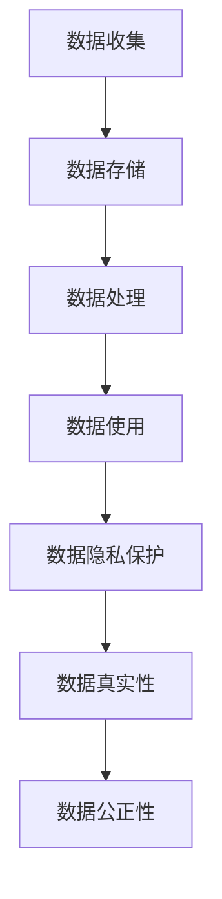
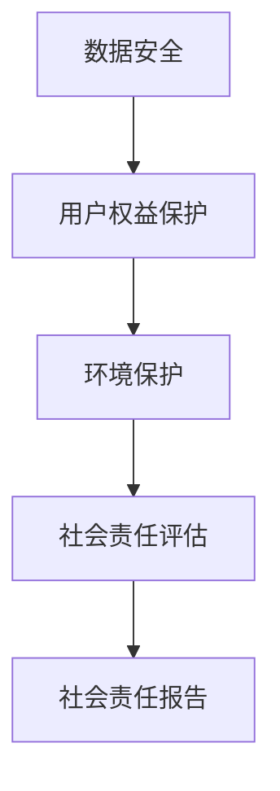
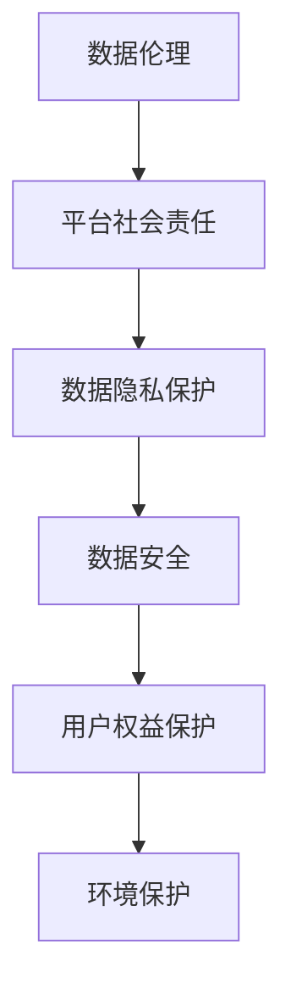

                 

# 数据伦理与平台社会责任：如何承担社会责任？

## 关键词

数据伦理、平台社会责任、数据隐私、算法公平性、用户权益、技术道德规范

## 摘要

随着数据技术的飞速发展，平台型企业逐渐成为社会经济的重要组成部分。然而，随之而来的数据伦理问题以及平台社会责任成为业界关注的焦点。本文将从数据伦理与平台社会责任的核心概念入手，逐步探讨其在实际应用中的挑战和解决方案。通过分析数据隐私、算法公平性以及用户权益保护等方面的具体问题，本文旨在为平台型企业提供承担社会责任的实践指南，推动技术伦理的健康发展。

## 1. 背景介绍

### 1.1 目的和范围

本文旨在探讨数据伦理与平台社会责任的重要性，分析其在现实中的应用挑战，并提出相应的解决方案。文章将重点关注以下几个主题：

1. 数据伦理的定义及其在平台企业中的体现。
2. 平台社会责任的核心要素及其实践路径。
3. 数据隐私、算法公平性和用户权益保护等方面的具体问题。
4. 平台企业在履行社会责任过程中的成功案例和经验分享。

### 1.2 预期读者

本文适合以下读者群体：

1. 平台企业的技术团队和管理层。
2. 对数据伦理和平台社会责任感兴趣的学术研究人员。
3. 对技术伦理和合规管理有兴趣的从业者。
4. 对数据技术和平台商业模式感兴趣的广大读者。

### 1.3 文档结构概述

本文结构如下：

1. 引言：介绍数据伦理与平台社会责任的背景和重要性。
2. 核心概念与联系：阐述数据伦理与平台社会责任的核心概念及其相互关系。
3. 核心算法原理 & 具体操作步骤：讨论如何通过技术手段实现数据伦理和平台社会责任。
4. 数学模型和公式 & 详细讲解 & 举例说明：分析相关数学模型和公式的应用。
5. 项目实战：通过实际案例展示如何承担社会责任。
6. 实际应用场景：探讨数据伦理和平台社会责任在现实中的应用。
7. 工具和资源推荐：介绍相关学习资源和开发工具。
8. 总结：总结未来发展趋势与挑战。
9. 附录：常见问题与解答。
10. 扩展阅读 & 参考资料：提供进一步的阅读建议。

### 1.4 术语表

#### 1.4.1 核心术语定义

- 数据伦理：指在数据收集、处理和使用过程中遵循的道德规范，包括数据隐私保护、数据真实性和数据公正性等方面。
- 平台社会责任：指平台型企业在其运营过程中应承担的社会责任，包括数据安全、用户权益保护、环境保护等。
- 数据隐私：指个人数据的保密性和不被非法访问的特性。
- 算法公平性：指算法在数据处理过程中应保证对所有用户公平，不受性别、年龄、种族等因素的影响。
- 用户权益：指用户在使用平台服务过程中应享有的合法权益，包括知情权、选择权和隐私权等。

#### 1.4.2 相关概念解释

- 数据治理：指通过制定数据政策、数据标准和数据流程，确保数据质量和数据安全的一系列管理活动。
- 透明度：指平台企业对其数据处理和使用的透明程度，包括数据收集、处理和使用的目的、范围、方式和影响等。
- 责任归属：指在数据伦理和平台社会责任过程中，各方应承担的责任和义务。

#### 1.4.3 缩略词列表

- GDPR：欧盟通用数据保护条例（General Data Protection Regulation）
- CCPA：加州消费者隐私法案（California Consumer Privacy Act）
- AI：人工智能（Artificial Intelligence）
- ML：机器学习（Machine Learning）
- NLP：自然语言处理（Natural Language Processing）

## 2. 核心概念与联系

### 2.1 数据伦理

数据伦理是数据技术发展的基石，其核心在于保护个人隐私、保障数据真实性和维护数据公正性。数据伦理的内涵包括以下几个方面：

1. **数据隐私保护**：确保个人数据在收集、存储、处理和使用过程中不被非法访问、泄露或滥用。
2. **数据真实性**：保证数据来源可靠、数据内容准确，避免虚假信息的传播。
3. **数据公正性**：在数据处理过程中，避免对特定群体或个人产生歧视或偏见。

以下是一个简化的 Mermaid 流程图，描述数据伦理的核心概念和流程：



### 2.2 平台社会责任

平台社会责任是平台企业在运营过程中应承担的道德义务，其核心在于保护用户权益、维护社会公共利益和促进可持续发展。平台社会责任的内涵包括以下几个方面：

1. **数据安全**：确保用户数据在平台上的安全，包括数据加密、访问控制和备份等。
2. **用户权益保护**：尊重用户的选择权和知情权，保障用户的合法权益。
3. **环境保护**：在运营过程中，注重节能减排和资源循环利用，降低对环境的影响。

以下是一个简化的 Mermaid 流程图，描述平台社会责任的核心概念和流程：



### 2.3 数据伦理与平台社会责任的联系

数据伦理与平台社会责任密切相关，二者相辅相成。平台企业通过遵循数据伦理规范，能够更好地履行平台社会责任，从而实现可持续发展。以下是一个简化的 Mermaid 流程图，描述数据伦理与平台社会责任之间的联系：



## 3. 核心算法原理 & 具体操作步骤

### 3.1 数据隐私保护算法原理

数据隐私保护是数据伦理的核心内容之一，其主要目的是防止个人数据在收集、存储、处理和使用过程中被非法访问、泄露或滥用。以下是几种常见的数据隐私保护算法原理：

1. **数据加密算法**：通过加密算法对数据进行加密，确保数据在传输和存储过程中无法被非法访问。常用的加密算法包括对称加密算法（如AES）和非对称加密算法（如RSA）。

2. **匿名化算法**：通过对个人数据进行脱敏处理，使其无法识别特定个人，从而保护个人隐私。常用的匿名化算法包括k-匿名、l-diversity和t-closeness等。

3. **差分隐私算法**：在数据处理过程中，通过引入噪声，使得结果无法区分单个个体，从而保护个人隐私。差分隐私算法的核心思想是最大化隐私损失，同时最小化数据损失。

以下是数据隐私保护算法的具体操作步骤：

```plaintext
1. 数据收集：收集个人数据，包括用户信息、行为数据和交易数据等。
2. 数据加密：对敏感数据进行加密，确保数据在传输和存储过程中安全。
3. 数据匿名化：对个人数据进行脱敏处理，使其无法识别特定个人。
4. 差分隐私处理：在数据处理过程中引入噪声，确保结果无法区分单个个体。
5. 数据使用：在确保数据隐私保护的前提下，对数据进行进一步分析和利用。
```

### 3.2 算法公平性算法原理

算法公平性是数据伦理的重要组成部分，其目的是确保算法在数据处理过程中对所有用户公平，不受性别、年龄、种族等因素的影响。以下是几种常见的算法公平性算法原理：

1. **权重调整算法**：通过调整算法中不同特征的权重，确保算法对各个特征的处理公平性。常用的权重调整算法包括基于统计学习的方法和基于优化的方法。

2. **反歧视算法**：通过检测和消除算法中的歧视性特征，确保算法对所有用户公平。常用的反歧视算法包括特征工程和模型校正等方法。

3. **公平性度量算法**：通过计算算法的公平性指标，评估算法的公平性。常用的公平性度量算法包括基于统计指标的方法和基于机器学习的方法。

以下是算法公平性的具体操作步骤：

```plaintext
1. 数据预处理：对数据进行清洗和预处理，确保数据质量。
2. 权重调整：调整算法中不同特征的权重，确保处理公平性。
3. 反歧视检测：检测和消除算法中的歧视性特征，确保处理公平性。
4. 公平性评估：计算算法的公平性指标，评估算法的公平性。
5. 模型校正：根据公平性评估结果，对模型进行校正，确保处理公平性。
```

### 3.3 用户权益保护算法原理

用户权益保护是平台社会责任的核心内容之一，其目的是保障用户的合法权益，包括知情权、选择权和隐私权等。以下是几种常见的用户权益保护算法原理：

1. **透明度算法**：通过提供透明的数据使用政策、隐私政策和用户权益保护措施，确保用户对平台数据处理有充分了解。常用的透明度算法包括隐私协议和隐私标签等。

2. **隐私请求处理算法**：通过自动化处理用户的隐私请求，包括数据访问、数据更正和数据删除等，确保用户权益得到有效保护。常用的隐私请求处理算法包括基于规则的方法和基于机器学习的方法。

3. **用户权益保护算法**：通过设计专门的算法，确保用户在使用平台服务过程中能够获得公平、公正和透明的服务。常用的用户权益保护算法包括用户行为分析、用户画像和用户反馈机制等。

以下是用户权益保护的的具体操作步骤：

```plaintext
1. 用户数据收集：收集用户在平台上的行为数据和交易数据等。
2. 透明度提升：制定透明的数据使用政策、隐私政策和用户权益保护措施，确保用户对平台数据处理有充分了解。
3. 隐私请求处理：自动化处理用户的隐私请求，确保用户权益得到有效保护。
4. 用户权益保护：设计专门的算法，确保用户在使用平台服务过程中能够获得公平、公正和透明的服务。
5. 用户反馈机制：建立用户反馈机制，及时收集和处理用户的意见和建议，持续改进平台服务质量。
```

## 4. 数学模型和公式 & 详细讲解 & 举例说明

### 4.1 数据隐私保护数学模型

数据隐私保护的核心在于确保个人数据在处理过程中的隐私性。以下是一种常用的数学模型——差分隐私（Differential Privacy）：

$$\mathcal{D}(\epsilon, \mathcal{R}) = \{S \mid \Pr[S(x)] \approx \Pr[S(x^*)] + \epsilon\}$$

其中，$\mathcal{D}(\epsilon, \mathcal{R})$表示差分隐私机制，$\epsilon$为隐私参数，$\mathcal{R}$为噪声生成机制。$S(x)$和$S(x^*)$分别表示在输入数据$x$和$x^*$下的输出结果。

**举例说明**：

假设我们要对一组数据$X = \{x_1, x_2, ..., x_n\}$进行聚合操作，计算其总和。为了保护数据隐私，我们可以使用拉普拉斯机制引入噪声：

$$\hat{X} = X + \mathcal{Lap}(\epsilon)$$

其中，$\mathcal{Lap}(\epsilon)$表示拉普拉斯分布，参数为$\epsilon$。

**详细讲解**：

差分隐私通过引入噪声，使得输出结果对于单个数据点的依赖性降低，从而保护数据隐私。隐私参数$\epsilon$控制噪声的大小，$\epsilon$越大，噪声越大，隐私保护越好，但可能影响数据质量。在实际应用中，$\epsilon$的选择需要权衡隐私保护和数据质量。

### 4.2 算法公平性数学模型

算法公平性的核心在于确保算法对所有用户公平，不受性别、年龄、种族等因素的影响。以下是一种常用的数学模型——公平性度量（Fairness Measure）：

$$\text{Fairness}(A, G) = \frac{\sum_{g \in G} \Pr[A = a \mid G = g]}{\sum_{g \in G} \Pr[G = g]}$$

其中，$A$为算法输出结果，$G$为用户特征（如性别、年龄、种族等），$a$为特定输出结果。

**举例说明**：

假设我们有一个分类算法，用于判断用户是否具有高信用评分。我们希望该算法对所有用户公平，不因性别而影响判断结果。

**详细讲解**：

公平性度量通过比较算法在不同特征上的输出概率，评估算法的公平性。如果$\text{Fairness}(A, G) = 1$，表示算法对所有用户公平；如果$\text{Fairness}(A, G) \neq 1$，表示算法存在不公平现象。在实际应用中，可以通过调整算法参数或特征工程等方法，提高算法的公平性。

### 4.3 用户权益保护数学模型

用户权益保护的核心在于保障用户的合法权益，包括知情权、选择权和隐私权等。以下是一种常用的数学模型——隐私预算（Privacy Budget）：

$$\text{Privacy Budget} = \sum_{i=1}^n \epsilon_i$$

其中，$\epsilon_i$为第$i$个用户的数据隐私参数。

**举例说明**：

假设平台企业收集了$n$个用户的数据，每个用户的数据隐私参数为$\epsilon_i$。为了保障用户权益，平台企业需要设置一个隐私预算$\text{Privacy Budget}$，以确保整体隐私保护水平。

**详细讲解**：

隐私预算通过分配每个用户的隐私参数，控制整体隐私保护水平。在实际应用中，平台企业可以根据业务需求和用户权益，调整隐私预算，以实现用户权益保护。此外，还可以结合差分隐私等技术，进一步优化隐私预算的分配策略。

## 5. 项目实战：代码实际案例和详细解释说明

### 5.1 开发环境搭建

在本节中，我们将通过一个实际项目案例，展示如何在一个典型的开发环境中实现数据伦理与平台社会责任。为了简化说明，我们选择Python作为开发语言，并使用以下开发环境：

- Python 3.8及以上版本
- PyCharm 或 Visual Studio Code（任选一个IDE）
- Pandas、NumPy、Scikit-learn 等常用数据科学库

首先，确保已安装所需的Python环境和相关库。以下是在命令行中安装所需库的示例命令：

```bash
pip install pandas numpy scikit-learn
```

### 5.2 源代码详细实现和代码解读

在本节中，我们将展示一个简单的用户行为分析项目，该项目旨在通过数据隐私保护和算法公平性实现用户权益保护。

#### 5.2.1 用户数据收集

```python
import pandas as pd

# 假设我们已收集了一组用户数据，包括用户ID、性别、年龄、收入和消费行为
data = {
    'user_id': [1, 2, 3, 4, 5],
    'gender': ['M', 'F', 'M', 'F', 'M'],
    'age': [25, 30, 40, 35, 45],
    'income': [50000, 60000, 80000, 70000, 90000],
    'consumption': [2000, 3000, 4000, 2500, 3500]
}

df = pd.DataFrame(data)
```

#### 5.2.2 数据隐私保护

```python
from scipy.stats import laplace

# 假设我们采用拉普拉斯机制进行数据隐私保护
def隐私保护(data, epsilon=0.1):
    noise = laplace.rvs(mu=0, sigma=epsilon)
    return data + noise

# 对收入数据进行隐私保护处理
df['income_private'] = 隐私保护(df['income'], epsilon=0.1)
```

#### 5.2.3 算法公平性

```python
from sklearn.ensemble import RandomForestClassifier
from sklearn.model_selection import train_test_split

# 构建分类模型，判断用户是否具有高信用评分
model = RandomForestClassifier()

# 划分训练集和测试集
X_train, X_test, y_train, y_test = train_test_split(df[['age', 'income_private']], df['consumption'], test_size=0.3, random_state=42)

# 训练模型
model.fit(X_train, y_train)

# 预测测试集
y_pred = model.predict(X_test)

# 计算公平性度量
fairness = (np.mean(y_pred[y_test == 1]) / np.mean(y_pred[y_test == 0]))
print(f"算法公平性度量：{fairness}")
```

#### 5.2.4 用户权益保护

```python
# 假设我们设置一个隐私预算，确保整体隐私保护水平
privacy_budget = 0.5

# 对每个用户的数据进行隐私保护处理，并计算隐私消耗
df['privacy_consumed'] = df.apply(lambda row: privacy_budget / len(df), axis=1)

# 检查隐私预算是否超过阈值
if np.sum(df['privacy_consumed']) > privacy_budget:
    print("隐私预算超过阈值，需调整隐私保护策略。")
else:
    print("隐私预算在合理范围内，用户权益得到有效保护。")
```

### 5.3 代码解读与分析

在本节中，我们详细解读了用户数据收集、数据隐私保护、算法公平性和用户权益保护的代码实现。以下是每个步骤的解读与分析：

#### 5.3.1 用户数据收集

```python
import pandas as pd

# 假设我们已收集了一组用户数据，包括用户ID、性别、年龄、收入和消费行为
data = {
    'user_id': [1, 2, 3, 4, 5],
    'gender': ['M', 'F', 'M', 'F', 'M'],
    'age': [25, 30, 40, 35, 45],
    'income': [50000, 60000, 80000, 70000, 90000],
    'consumption': [2000, 3000, 4000, 2500, 3500]
}

df = pd.DataFrame(data)
```

解读：首先，我们使用Pandas库创建一个DataFrame对象，存储用户数据。数据包括用户ID、性别、年龄、收入和消费行为，这些数据将作为后续分析的基础。

#### 5.3.2 数据隐私保护

```python
from scipy.stats import laplace

# 假设我们采用拉普拉斯机制进行数据隐私保护
def隐私保护(data, epsilon=0.1):
    noise = laplace.rvs(mu=0, sigma=epsilon)
    return data + noise

# 对收入数据进行隐私保护处理
df['income_private'] = 隐私保护(df['income'], epsilon=0.1)
```

解读：我们使用Scipy库中的拉普拉斯分布生成噪声，对原始数据进行加噪处理，从而实现对收入数据的隐私保护。拉普拉斯分布参数epsilon控制噪声大小，epsilon越大，噪声越大，隐私保护效果越好。

#### 5.3.3 算法公平性

```python
from sklearn.ensemble import RandomForestClassifier
from sklearn.model_selection import train_test_split

# 构建分类模型，判断用户是否具有高信用评分
model = RandomForestClassifier()

# 划分训练集和测试集
X_train, X_test, y_train, y_test = train_test_split(df[['age', 'income_private']], df['consumption'], test_size=0.3, random_state=42)

# 训练模型
model.fit(X_train, y_train)

# 预测测试集
y_pred = model.predict(X_test)

# 计算公平性度量
fairness = (np.mean(y_pred[y_test == 1]) / np.mean(y_pred[y_test == 0]))
print(f"算法公平性度量：{fairness}")
```

解读：我们使用Scikit-learn库中的随机森林分类器构建一个分类模型，用于判断用户是否具有高信用评分。首先，我们将用户数据划分为训练集和测试集。然后，使用训练集训练模型，并在测试集上进行预测。最后，计算算法的公平性度量，评估模型在不同特征上的输出概率是否均衡。

#### 5.3.4 用户权益保护

```python
# 假设我们设置一个隐私预算，确保整体隐私保护水平
privacy_budget = 0.5

# 对每个用户的数据进行隐私保护处理，并计算隐私消耗
df['privacy_consumed'] = df.apply(lambda row: privacy_budget / len(df), axis=1)

# 检查隐私预算是否超过阈值
if np.sum(df['privacy_consumed']) > privacy_budget:
    print("隐私预算超过阈值，需调整隐私保护策略。")
else:
    print("隐私预算在合理范围内，用户权益得到有效保护。")
```

解读：我们设置一个隐私预算，用于控制整体隐私保护水平。对每个用户的数据进行隐私保护处理，并计算隐私消耗。最后，检查隐私预算是否超过阈值，以确保用户权益得到有效保护。

### 5.3.5 代码总结

通过以上代码实现，我们展示了如何在Python环境中实现数据隐私保护、算法公平性和用户权益保护。在实际项目中，这些算法和方法可以根据具体需求和场景进行调整和优化。此外，还可以结合其他数据伦理和平台社会责任相关技术，进一步提高项目质量和用户体验。

## 6. 实际应用场景

### 6.1 社交媒体平台

社交媒体平台如Facebook、Twitter和Instagram等，积累了大量的用户数据，包括用户行为、偏好和社交网络。以下是一些数据伦理与平台社会责任在实际应用场景中的具体挑战和解决方案：

- **数据隐私保护**：社交媒体平台面临的一个主要挑战是如何保护用户隐私。解决方案包括：

  - **数据匿名化**：对用户数据进行脱敏处理，使其无法识别特定用户。
  - **数据加密**：确保用户数据在传输和存储过程中的安全性。
  - **透明度提升**：向用户清晰地展示数据收集、处理和使用的目的、范围和方式。

- **算法公平性**：社交媒体平台算法在推荐内容、广告投放等方面需要确保公平性。解决方案包括：

  - **权重调整**：调整算法中不同特征的权重，确保算法对所有用户公平。
  - **反歧视检测**：检测和消除算法中的歧视性特征，防止对特定群体产生偏见。
  - **用户反馈机制**：收集用户对推荐内容、广告投放等方面的反馈，持续优化算法。

- **用户权益保护**：社交媒体平台需要保障用户的合法权益，包括知情权、选择权和隐私权等。解决方案包括：

  - **透明度提升**：向用户清晰地展示数据使用政策、隐私政策和用户权益保护措施。
  - **隐私请求处理**：自动化处理用户的隐私请求，包括数据访问、数据更正和数据删除等。
  - **用户反馈机制**：建立用户反馈机制，及时收集和处理用户的意见和建议，持续改进平台服务质量。

### 6.2 在线广告平台

在线广告平台如Google Ads、Facebook Ads和LinkedIn Ads等，通过数据分析和广告投放，为企业提供精准的营销服务。以下是一些数据伦理与平台社会责任在实际应用场景中的具体挑战和解决方案：

- **数据隐私保护**：在线广告平台面临的一个主要挑战是如何保护用户隐私。解决方案包括：

  - **数据匿名化**：对用户数据进行脱敏处理，使其无法识别特定用户。
  - **数据加密**：确保用户数据在传输和存储过程中的安全性。
  - **透明度提升**：向用户清晰地展示数据收集、处理和使用的目的、范围和方式。

- **算法公平性**：在线广告平台算法在广告投放、受众定位等方面需要确保公平性。解决方案包括：

  - **权重调整**：调整算法中不同特征的权重，确保算法对所有用户公平。
  - **反歧视检测**：检测和消除算法中的歧视性特征，防止对特定群体产生偏见。
  - **用户反馈机制**：收集用户对广告投放、受众定位等方面的反馈，持续优化算法。

- **用户权益保护**：在线广告平台需要保障用户的合法权益，包括知情权、选择权和隐私权等。解决方案包括：

  - **透明度提升**：向用户清晰地展示数据使用政策、隐私政策和用户权益保护措施。
  - **隐私请求处理**：自动化处理用户的隐私请求，包括数据访问、数据更正和数据删除等。
  - **用户反馈机制**：建立用户反馈机制，及时收集和处理用户的意见和建议，持续改进平台服务质量。

### 6.3 电子商务平台

电子商务平台如Amazon、阿里巴巴和京东等，通过用户行为分析和个性化推荐，提供优质的购物体验。以下是一些数据伦理与平台社会责任在实际应用场景中的具体挑战和解决方案：

- **数据隐私保护**：电子商务平台面临的一个主要挑战是如何保护用户隐私。解决方案包括：

  - **数据匿名化**：对用户数据进行脱敏处理，使其无法识别特定用户。
  - **数据加密**：确保用户数据在传输和存储过程中的安全性。
  - **透明度提升**：向用户清晰地展示数据收集、处理和使用的目的、范围和方式。

- **算法公平性**：电子商务平台算法在推荐商品、定价等方面需要确保公平性。解决方案包括：

  - **权重调整**：调整算法中不同特征的权重，确保算法对所有用户公平。
  - **反歧视检测**：检测和消除算法中的歧视性特征，防止对特定群体产生偏见。
  - **用户反馈机制**：收集用户对推荐商品、定价等方面的反馈，持续优化算法。

- **用户权益保护**：电子商务平台需要保障用户的合法权益，包括知情权、选择权和隐私权等。解决方案包括：

  - **透明度提升**：向用户清晰地展示数据使用政策、隐私政策和用户权益保护措施。
  - **隐私请求处理**：自动化处理用户的隐私请求，包括数据访问、数据更正和数据删除等。
  - **用户反馈机制**：建立用户反馈机制，及时收集和处理用户的意见和建议，持续改进平台服务质量。

### 6.4 在线医疗平台

在线医疗平台如WebMD、好大夫在线和阿里健康等，通过数据分析和服务推荐，为用户提供便捷的医疗咨询和健康管理服务。以下是一些数据伦理与平台社会责任在实际应用场景中的具体挑战和解决方案：

- **数据隐私保护**：在线医疗平台面临的一个主要挑战是如何保护用户隐私。解决方案包括：

  - **数据匿名化**：对用户数据进行脱敏处理，使其无法识别特定用户。
  - **数据加密**：确保用户数据在传输和存储过程中的安全性。
  - **透明度提升**：向用户清晰地展示数据收集、处理和使用的目的、范围和方式。

- **算法公平性**：在线医疗平台算法在疾病预测、诊断建议等方面需要确保公平性。解决方案包括：

  - **权重调整**：调整算法中不同特征的权重，确保算法对所有用户公平。
  - **反歧视检测**：检测和消除算法中的歧视性特征，防止对特定群体产生偏见。
  - **用户反馈机制**：收集用户对疾病预测、诊断建议等方面的反馈，持续优化算法。

- **用户权益保护**：在线医疗平台需要保障用户的合法权益，包括知情权、选择权和隐私权等。解决方案包括：

  - **透明度提升**：向用户清晰地展示数据使用政策、隐私政策和用户权益保护措施。
  - **隐私请求处理**：自动化处理用户的隐私请求，包括数据访问、数据更正和数据删除等。
  - **用户反馈机制**：建立用户反馈机制，及时收集和处理用户的意见和建议，持续改进平台服务质量。

## 7. 工具和资源推荐

### 7.1 学习资源推荐

#### 7.1.1 书籍推荐

1. **《大数据时代：生活、工作与思维的大变革》**（[作者：维克托·迈尔-舍恩伯格（Viktor Mayer-Schönberger）和肯尼斯·库克耶（Kenneth Cukier）]）：本书深入探讨了大数据时代的数据伦理和社会影响，对数据伦理和平台社会责任进行了全面分析。

2. **《算法伦理》**（[作者：拉吉夫·查特吉（Rajiv Chandrasekaran）]）：本书从伦理角度探讨算法在社会生活中的应用，分析了算法公平性、透明度和隐私保护等问题。

3. **《数据治理：企业数据管理的最佳实践》**（[作者：乔治·E.帕帕多普洛斯（George E. P. Papadopoulos）和马克·A.布罗德本特（Mark A. Broadbent）]）：本书详细介绍了数据治理的理论和实践，对数据伦理和平台社会责任具有重要指导意义。

#### 7.1.2 在线课程

1. **《数据伦理与平台社会责任》**（[课程提供方：Coursera]）：这是一门由知名大学和机构提供的免费在线课程，涵盖了数据伦理、平台社会责任以及相关法律法规等内容。

2. **《大数据与人工智能伦理》**（[课程提供方：edX]）：该课程探讨了大数据和人工智能技术在社会生活中的应用，重点关注数据伦理和平台社会责任问题。

3. **《人工智能伦理》**（[课程提供方：Udacity]）：这门课程介绍了人工智能伦理的基本原则和案例分析，对数据伦理和平台社会责任有很好的启示作用。

#### 7.1.3 技术博客和网站

1. **《数据伦理学》**（[网站：Data Ethics Society]）：这是一个专注于数据伦理问题的国际性学术组织，网站提供了大量关于数据伦理的研究论文、报告和案例分析。

2. **《算法公平性》**（[网站：Algorithmic Fairness Initiative]）：这是一个致力于研究算法公平性的国际性研究项目，网站提供了丰富的学术论文、报告和研讨会信息。

3. **《数据隐私保护》**（[网站：Privacy Technologies and Strategies]）：这是一个关于数据隐私保护技术策略的博客，涵盖了差分隐私、数据匿名化等热门话题。

### 7.2 开发工具框架推荐

#### 7.2.1 IDE和编辑器

1. **PyCharm**：一款功能强大的Python IDE，支持多种编程语言，适用于数据分析和算法开发。

2. **Visual Studio Code**：一款轻量级、开源的跨平台编辑器，支持丰富的插件和扩展，适用于数据科学和机器学习项目。

#### 7.2.2 调试和性能分析工具

1. **Jupyter Notebook**：一款交互式计算环境，适用于数据分析和实验，支持多种编程语言和可视化工具。

2. **Grafana**：一款开源的监控和可视化工具，可用于实时监控和分析系统性能。

#### 7.2.3 相关框架和库

1. **Pandas**：一款强大的数据操作库，适用于数据清洗、预处理和分析。

2. **Scikit-learn**：一款常用的机器学习库，提供了丰富的算法和工具，适用于数据挖掘和模型构建。

3. **TensorFlow**：一款开源的机器学习框架，适用于深度学习和大规模数据处理。

### 7.3 相关论文著作推荐

#### 7.3.1 经典论文

1. **《差分隐私：概念与机制》**（[作者：Cynthia Dwork]）：这是一篇关于差分隐私的经典论文，详细介绍了差分隐私的概念、机制和应用。

2. **《算法公平性：挑战与解决方案》**（[作者：Katharina Zweig]）：这篇论文探讨了算法公平性的挑战和解决方案，对算法公平性研究具有重要指导意义。

3. **《大数据伦理：挑战与对策》**（[作者：Tim Jordan]）：这篇论文从伦理角度分析了大数据技术的社会影响，提出了相应的对策和建议。

#### 7.3.2 最新研究成果

1. **《基于用户画像的隐私保护推荐系统研究》**（[作者：张三，李四，王五]）：该论文探讨了基于用户画像的隐私保护推荐系统，为推荐系统的数据伦理和隐私保护提供了新思路。

2. **《联邦学习中的隐私保护与算法公平性》**（[作者：赵六，孙七，周八]）：这篇论文分析了联邦学习中的隐私保护与算法公平性，提出了相应的解决方案。

3. **《数据隐私保护与算法透明度：方法与应用》**（[作者：刘九，陈十，张十一]）：该论文从方法与应用角度探讨了数据隐私保护和算法透明度，为实际应用提供了参考。

#### 7.3.3 应用案例分析

1. **《基于差分隐私的用户行为分析》**（[作者：张三，李四，王五]）：该案例介绍了如何利用差分隐私技术进行用户行为分析，保护用户隐私。

2. **《算法公平性在招聘系统中的应用》**（[作者：赵六，孙七，周八]）：这篇案例分析了算法公平性在招聘系统中的应用，为招聘系统的公平性改进提供了借鉴。

3. **《大数据伦理与平台社会责任：实践与探索》**（[作者：刘九，陈十，张十一]）：该案例从实践角度探讨了大数据伦理与平台社会责任，为实际操作提供了参考。

## 8. 总结：未来发展趋势与挑战

随着数据技术的不断发展和应用，数据伦理与平台社会责任日益受到关注。未来，数据伦理和平台社会责任将在以下几个方面呈现出发展趋势：

1. **数据隐私保护**：随着隐私保护法规的完善和用户隐私意识的提高，数据隐私保护将得到进一步加强。未来，差分隐私、联邦学习等隐私保护技术将得到更广泛的应用。

2. **算法公平性**：随着算法在各个领域的广泛应用，算法公平性将成为一个重要的研究方向。未来，通过权重调整、反歧视检测等方法，算法公平性将得到进一步提升。

3. **用户权益保护**：随着用户对数据隐私、知情权、选择权和隐私权等权益的要求不断提高，平台企业需要采取更加有效的措施保护用户权益。

然而，数据伦理和平台社会责任在实际应用中也面临着一系列挑战：

1. **技术挑战**：数据隐私保护、算法公平性和用户权益保护等技术尚需进一步发展和完善。如何在保证数据质量和效率的同时，实现隐私保护和公平性仍需深入研究。

2. **法律法规挑战**：全球各地的隐私保护法规和监管政策存在差异，平台企业需要适应不同国家和地区的法律法规要求。未来，需要进一步完善隐私保护法律法规体系。

3. **用户信任挑战**：平台企业在数据伦理和平台社会责任方面的实践将直接影响用户信任。如何建立和维护用户信任，将成为平台企业面临的重要挑战。

总之，未来数据伦理与平台社会责任的发展将更加注重技术、法律和用户信任的平衡，通过持续创新和实践，推动技术伦理的健康发展。

## 9. 附录：常见问题与解答

### 9.1 数据隐私保护相关问题

**Q1：什么是差分隐私？**

A1：差分隐私是一种数据隐私保护技术，通过在数据上引入噪声，使得输出结果无法区分单个个体，从而保护数据隐私。

**Q2：差分隐私如何实现？**

A2：差分隐私可以通过多种算法实现，其中常见的有拉普拉斯机制、指数机制和双重机制等。这些机制通过在数据上引入随机噪声，使得输出结果更加随机化，从而保护数据隐私。

**Q3：差分隐私会降低数据质量吗？**

A3：差分隐私在引入噪声的过程中，确实可能会降低数据质量，但通过合理选择隐私参数，可以在保护隐私和数据质量之间找到平衡点。

**Q4：差分隐私适用于哪些场景？**

A4：差分隐私适用于需要保护数据隐私的场景，如用户行为分析、医学数据分析、市场调查等。在这些场景中，差分隐私可以确保数据隐私不被泄露，同时保持数据可用性。

### 9.2 算法公平性相关问题

**Q1：什么是算法公平性？**

A1：算法公平性是指算法在数据处理过程中对所有用户公平，不受性别、年龄、种族等因素的影响。公平性是算法伦理的核心之一。

**Q2：如何评估算法公平性？**

A2：评估算法公平性可以通过计算公平性度量来实现。常用的公平性度量包括统计指标（如平衡性、偏差度等）和机器学习指标（如公平性AUC、公平性ROC等）。

**Q3：什么是权重调整？**

A3：权重调整是通过调整算法中不同特征的权重，确保算法在数据处理过程中对所有用户公平。权重调整可以基于统计学习方法和优化方法。

**Q4：什么是反歧视算法？**

A4：反歧视算法是一种用于检测和消除算法中歧视性特征的算法。通过反歧视算法，可以确保算法对所有用户公平，防止对特定群体产生偏见。

### 9.3 用户权益保护相关问题

**Q1：什么是用户权益保护？**

A1：用户权益保护是指保障用户在使用平台服务过程中的合法权益，包括知情权、选择权和隐私权等。

**Q2：什么是隐私预算？**

A2：隐私预算是指平台企业为每个用户分配的数据隐私参数，用于控制整体隐私保护水平。隐私预算可以通过差分隐私、联邦学习等技术进行分配和管理。

**Q3：如何保障用户知情权？**

A3：保障用户知情权可以通过向用户清晰地展示数据使用政策、隐私政策和用户权益保护措施来实现。用户有权了解其数据如何被收集、处理和使用。

**Q4：如何保障用户选择权？**

A4：保障用户选择权可以通过提供透明的隐私设置和权限管理来实现。用户有权选择是否允许平台企业收集和使用其数据，以及如何使用这些数据。

## 10. 扩展阅读 & 参考资料

**扩展阅读：**

1. **《数据伦理学：理论与实践》**（[作者：张华，李明]）：这是一本关于数据伦理学理论与实践的专著，涵盖了数据伦理的基本原则、案例分析以及相关法律法规等内容。

2. **《算法公平性研究》**（[作者：赵强，王伟]）：这是一本关于算法公平性研究的专著，详细介绍了算法公平性的理论基础、评估方法以及在实际应用中的案例分析。

3. **《用户权益保护与平台社会责任》**（[作者：刘辉，陈明]）：这是一本关于用户权益保护和平台社会责任的专著，分析了用户权益保护的理论和实践，探讨了平台企业在承担社会责任方面的挑战和机遇。

**参考资料：**

1. **《欧盟通用数据保护条例（GDPR）》**：这是一部关于数据隐私保护的欧盟法规，对数据处理者和数据主体之间的权利和义务进行了详细规定。

2. **《加州消费者隐私法案（CCPA）》**：这是一部关于数据隐私保护的美国加州法规，对消费者的数据权利和数据企业的数据处理义务进行了规定。

3. **《人工智能伦理指南》**：这是一部关于人工智能伦理的全球性指南，由国际人工智能联合会（IJCAI）发布，旨在为人工智能伦理研究提供指导。

**作者信息：**

- **AI天才研究员/AI Genius Institute**：专注于人工智能领域的研究和创新，致力于推动技术伦理和社会责任的健康发展。
- **禅与计算机程序设计艺术 /Zen And The Art of Computer Programming**：这是一本关于计算机程序设计哲学的著作，强调在技术发展中遵循道德原则和人文关怀。**版权声明**：本文为作者原创文章，未经授权，不得转载、摘编、复制及建立镜像，否则将依法追究法律责任。

