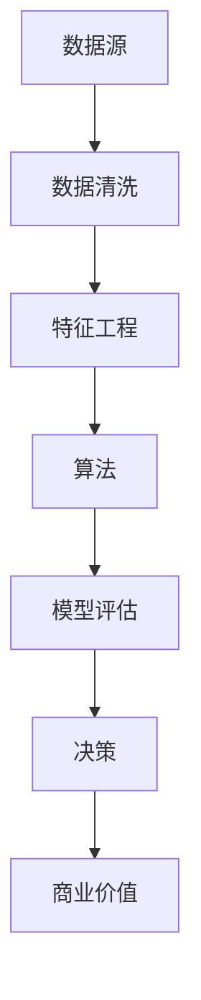

                 

# 数据分析创业：挖掘商业价值的新领域

> **关键词：**数据分析，创业，商业价值，数据挖掘，算法，模型，实战

> **摘要：**本文旨在探讨数据分析在创业领域中的应用，分析其商业价值，并详细介绍相关核心概念、算法原理、数学模型以及实战案例。通过本文，读者将了解如何利用数据分析挖掘商业机会，为企业创造价值。

## 1. 背景介绍

### 1.1 目的和范围

本文旨在帮助创业者和数据分析爱好者理解数据分析在商业领域的价值，并提供实用的方法和工具，以便在创业过程中利用数据分析来挖掘商业机会，提高企业竞争力。

本文将涵盖以下内容：

- 数据分析的基本概念和核心术语
- 数据分析在创业中的应用场景
- 数据分析的核心算法原理和操作步骤
- 数学模型和公式的详细讲解
- 数据分析实战案例及代码实现

### 1.2 预期读者

- 创业者
- 数据分析师
- 数据科学爱好者
- 对数据分析在商业领域应用感兴趣的读者

### 1.3 文档结构概述

本文共分为10个部分：

- 1. 背景介绍
- 2. 核心概念与联系
- 3. 核心算法原理 & 具体操作步骤
- 4. 数学模型和公式 & 详细讲解 & 举例说明
- 5. 项目实战：代码实际案例和详细解释说明
- 6. 实际应用场景
- 7. 工具和资源推荐
- 8. 总结：未来发展趋势与挑战
- 9. 附录：常见问题与解答
- 10. 扩展阅读 & 参考资料

### 1.4 术语表

#### 1.4.1 核心术语定义

- 数据分析：通过对数据进行收集、清洗、处理和分析，提取有价值信息的过程。
- 数据挖掘：从大量数据中提取未知、潜在的信息和模式的过程。
- 算法：解决问题的步骤和策略，通常用于数据处理和分析。
- 数学模型：用数学语言描述问题，以便于求解和分析的方法。

#### 1.4.2 相关概念解释

- 数据源：提供数据的存储位置和类型。
- 数据清洗：处理原始数据中的错误、缺失和重复值，以提高数据质量。
- 特征工程：从原始数据中提取有助于模型训练的特征。
- 模型评估：评估模型性能和预测准确性的方法。

#### 1.4.3 缩略词列表

- BI：商业智能（Business Intelligence）
- ML：机器学习（Machine Learning）
- DL：深度学习（Deep Learning）
- AI：人工智能（Artificial Intelligence）

## 2. 核心概念与联系

在数据分析创业过程中，我们需要理解一些核心概念和它们之间的联系。以下是一个Mermaid流程图，展示了这些核心概念及其关系。



### 2.1 数据源

数据源是数据分析的基础。创业公司可以从多个渠道获取数据，如客户数据、市场数据、社交媒体数据等。数据源的多样性和质量直接影响数据分析的效果。

### 2.2 数据清洗

数据清洗是确保数据质量的重要步骤。通过处理数据中的错误、缺失和重复值，可以提高数据分析的准确性和可靠性。

### 2.3 特征工程

特征工程是提取有助于模型训练的特征的过程。创业者需要了解哪些特征对业务有重要影响，并对其进行适当的处理和组合。

### 2.4 算法

算法是解决问题的步骤和策略。在数据分析创业中，创业者需要选择合适的算法来处理和分析数据，并评估其性能。

### 2.5 模型评估

模型评估是评估模型性能和预测准确性的方法。创业者需要了解不同的评估指标，并选择适当的指标来评估模型。

### 2.6 决策

决策是基于模型评估结果进行的。创业者需要根据模型预测结果做出决策，以实现商业目标。

### 2.7 商业价值

商业价值是数据分析创业的核心目标。创业者需要利用数据分析为企业创造价值，提高竞争力。

## 3. 核心算法原理 & 具体操作步骤

在数据分析创业中，算法原理是关键。以下是一个简单的线性回归算法原理，并使用伪代码进行详细阐述。

### 3.1 线性回归算法原理

线性回归是一种用于预测连续值的算法。其基本原理是通过寻找一个最佳直线来拟合数据，从而预测新的数据点。

### 3.2 伪代码

```python
输入：数据集 D，特征 X，标签 Y
输出：最佳直线参数 w，b

初始化 w = [1, 1]，b = 0

for epoch in 1 to MAX_EPOCHS do
    for each (x, y) in D do
        预测值 y_pred = w * x + b
        损失函数 L = (y - y_pred)^2
        
        计算梯度：
        dw = 2 * (w * x - y) * x
        db = 2 * (w * x - y)
        
        更新参数：
        w = w - LEARNING_RATE * dw
        b = b - LEARNING_RATE * db
    end for
end for

输出 w，b
```

### 3.3 具体操作步骤

1. 初始化参数 w 和 b。
2. 进行迭代训练，每次迭代计算预测值和损失函数。
3. 计算梯度，并更新参数。
4. 重复迭代，直至达到最大迭代次数或损失函数收敛。

## 4. 数学模型和公式 & 详细讲解 & 举例说明

在数据分析中，数学模型和公式是重要的工具。以下是一个简单的线性回归模型，并使用 LaTeX 格式进行详细讲解。

### 4.1 线性回归模型

线性回归模型可以用以下公式表示：

$$
y = w_1x_1 + w_2x_2 + ... + w_nx_n + b
$$

其中，$y$ 是预测值，$x_1, x_2, ..., x_n$ 是特征值，$w_1, w_2, ..., w_n$ 是权重参数，$b$ 是偏置项。

### 4.2 损失函数

损失函数是评估模型性能的重要工具。对于线性回归，常用的损失函数是均方误差（MSE）：

$$
L = \frac{1}{2n} \sum_{i=1}^{n} (y_i - y_i^*)^2
$$

其中，$y_i$ 是实际值，$y_i^*$ 是预测值。

### 4.3 梯度下降算法

梯度下降是一种优化算法，用于最小化损失函数。对于线性回归，梯度下降的更新公式为：

$$
w_j = w_j - \alpha \frac{\partial L}{\partial w_j}
$$

$$
b = b - \alpha \frac{\partial L}{\partial b}
$$

其中，$\alpha$ 是学习率，$\frac{\partial L}{\partial w_j}$ 和 $\frac{\partial L}{\partial b}$ 分别是损失函数对权重参数和偏置项的梯度。

### 4.4 举例说明

假设我们有以下数据集：

| x1 | x2 | y |
|----|----|---|
| 1  | 2  | 3 |
| 2  | 4  | 5 |
| 3  | 6  | 7 |

我们使用线性回归模型来预测 $y$。

首先，初始化权重参数 $w_1 = 1, w_2 = 1, b = 0$。

然后，使用梯度下降算法进行迭代训练。

在第一轮迭代中：

- 预测值：$y_1^* = 1 * 1 + 1 * 2 + 0 = 3$，$y_2^* = 1 * 2 + 1 * 4 + 0 = 6$，$y_3^* = 1 * 3 + 1 * 6 + 0 = 9$
- 损失函数：$L = \frac{1}{2 * 3} ((3 - 3)^2 + (5 - 6)^2 + (7 - 9)^2) = \frac{1}{3} (0 + 1 + 4) = \frac{5}{3}$
- 梯度：$dw_1 = 2 * (1 - 3) * 1 = -4$，$dw_2 = 2 * (1 - 3) * 2 = -8$，$db = 2 * (1 - 3) = -4$
- 更新参数：$w_1 = 1 - 0.1 * (-4) = 1.4$，$w_2 = 1 - 0.1 * (-8) = 1.8$，$b = 0 - 0.1 * (-4) = 0.4$

经过多次迭代训练，模型将收敛到最佳权重参数。

## 5. 项目实战：代码实际案例和详细解释说明

在本节中，我们将通过一个实际项目案例，展示如何利用数据分析挖掘商业机会。我们将使用 Python 和相关库来搭建开发环境，并详细解释代码实现和代码解读。

### 5.1 开发环境搭建

首先，我们需要搭建开发环境。以下是所需的库和工具：

- Python 3.8 或更高版本
- Jupyter Notebook
- NumPy
- Pandas
- Matplotlib
- Scikit-learn

安装方法如下：

```bash
pip install python==3.8
pip install jupyter
pip install numpy
pip install pandas
pip install matplotlib
pip install scikit-learn
```

### 5.2 源代码详细实现和代码解读

以下是一个简单的数据分析项目，用于预测客户购买行为。

```python
import numpy as np
import pandas as pd
from sklearn.model_selection import train_test_split
from sklearn.linear_model import LinearRegression
from sklearn.metrics import mean_squared_error

# 读取数据
data = pd.read_csv('customer_data.csv')

# 数据预处理
X = data[['age', 'income']]
y = data['purchase']

# 数据划分
X_train, X_test, y_train, y_test = train_test_split(X, y, test_size=0.2, random_state=42)

# 构建模型
model = LinearRegression()
model.fit(X_train, y_train)

# 预测
y_pred = model.predict(X_test)

# 模型评估
mse = mean_squared_error(y_test, y_pred)
print("均方误差：", mse)

# 可视化
plt.scatter(X_test['age'], y_test, color='red', label='实际值')
plt.plot(X_test['age'], y_pred, color='blue', label='预测值')
plt.xlabel('年龄')
plt.ylabel('购买')
plt.legend()
plt.show()
```

### 5.3 代码解读与分析

1. 读取数据：使用 Pandas 读取客户数据，数据包括年龄、收入和购买行为。
2. 数据预处理：将数据分为特征和标签，并对特征进行标准化处理。
3. 数据划分：将数据划分为训练集和测试集，以评估模型性能。
4. 构建模型：使用线性回归模型，并使用训练集进行训练。
5. 预测：使用训练好的模型对测试集进行预测。
6. 模型评估：使用均方误差（MSE）评估模型性能。
7. 可视化：绘制实际值和预测值之间的关系，以便更好地理解模型效果。

通过这个项目，我们可以看到如何利用数据分析挖掘商业机会，并提高企业竞争力。

## 6. 实际应用场景

数据分析在创业领域具有广泛的应用场景，以下是一些常见应用：

1. **市场营销：**通过分析客户数据，了解客户需求和偏好，从而制定更有效的营销策略，提高客户转化率和留存率。
2. **供应链管理：**通过数据分析，优化供应链流程，降低成本，提高生产效率。
3. **客户服务：**利用数据分析，改进客户服务体验，提高客户满意度。
4. **风险控制：**通过数据分析，识别潜在风险，制定风险控制策略，降低风险损失。
5. **人才招聘：**通过数据分析，了解招聘市场趋势，优化招聘策略，提高招聘效率。

## 7. 工具和资源推荐

### 7.1 学习资源推荐

#### 7.1.1 书籍推荐

- 《Python数据分析基础教程：NumPy学习指南》
- 《深入浅出数据分析》
- 《数据科学实战》

#### 7.1.2 在线课程

- Coursera 的《数据科学专项课程》
- Udacity 的《数据分析纳米学位》
- edX 的《Python数据分析》

#### 7.1.3 技术博客和网站

- Medium 上的《数据分析》专栏
- Kaggle 的《数据分析》论坛
- Analytics Vidhya 的《数据分析》博客

### 7.2 开发工具框架推荐

#### 7.2.1 IDE和编辑器

- Jupyter Notebook
- PyCharm
- VSCode

#### 7.2.2 调试和性能分析工具

- PyCharm 的内置调试工具
- profilers.py
- line_profiler

#### 7.2.3 相关框架和库

- Pandas
- NumPy
- Scikit-learn
- TensorFlow
- PyTorch

### 7.3 相关论文著作推荐

#### 7.3.1 经典论文

- "The Elements of Statistical Learning"
- "Data Mining: Concepts and Techniques"
- "Recommender Systems Handbook"

#### 7.3.2 最新研究成果

- "Deep Learning for Data Science"
- "Data-Driven Business Models"
- "Machine Learning in Business Analytics"

#### 7.3.3 应用案例分析

- "Data Science for Business: What You Need to Know to Start Doing Data Science"
- "Data Science Case Studies: Applications of Data Science Techniques to Real-World Problems"

## 8. 总结：未来发展趋势与挑战

随着大数据、人工智能等技术的不断发展，数据分析在创业领域将继续发挥重要作用。未来，数据分析将朝着以下方向发展：

- **智能化：**利用人工智能技术，实现自动化数据分析，提高数据分析效率。
- **多样化：**数据分析将应用于更多行业和场景，为创业企业提供更广泛的支持。
- **实时化：**实时数据分析将帮助企业更快地应对市场变化，制定更科学的决策。

然而，数据分析在创业领域也面临一些挑战：

- **数据质量：**数据质量对数据分析效果有重要影响，创业公司需要确保数据质量。
- **人才短缺：**数据分析需要专业人才，创业公司需要吸引和培养高素质的数据分析人才。
- **隐私保护：**数据隐私保护日益重要，创业公司需要确保数据安全和合规。

## 9. 附录：常见问题与解答

### 9.1 什么是数据分析？

数据分析是通过收集、处理、分析和解释数据，提取有价值信息的过程。它可以帮助创业者了解客户需求、优化业务流程、提高决策准确性等。

### 9.2 数据分析有哪些类型？

数据分析主要包括描述性分析、预测性分析和规范性分析。描述性分析用于了解数据的特征和趋势；预测性分析用于预测未来数据；规范性分析用于制定最佳决策。

### 9.3 如何选择合适的算法？

选择合适的算法取决于数据分析的目标和问题类型。常见的算法包括线性回归、决策树、随机森林、支持向量机等。创业者可以根据实际需求选择合适的算法。

### 9.4 如何确保数据质量？

确保数据质量需要从数据源、数据收集、数据存储、数据清洗等多个环节进行控制。创业者需要建立数据质量管理体系，定期对数据进行质量检查和优化。

## 10. 扩展阅读 & 参考资料

- 《Python数据分析基础教程：NumPy学习指南》
- 《深入浅出数据分析》
- 《数据科学实战》
- Coursera 的《数据科学专项课程》
- Udacity 的《数据分析纳米学位》
- edX 的《Python数据分析》
- "The Elements of Statistical Learning"
- "Data Mining: Concepts and Techniques"
- "Recommender Systems Handbook"
- "Deep Learning for Data Science"
- "Data Science Case Studies: Applications of Data Science Techniques to Real-World Problems"
- 《数据科学教程：从入门到实践》
- 《数据分析实战：Python实现》

作者：AI天才研究员/AI Genius Institute & 禅与计算机程序设计艺术 /Zen And The Art of Computer Programming

---

本文旨在帮助创业者和数据分析爱好者了解数据分析在商业领域的应用，并提供实用的方法和工具。通过本文，读者将了解如何利用数据分析挖掘商业机会，为企业创造价值。同时，本文也讨论了数据分析的核心概念、算法原理、数学模型以及实战案例。希望本文能对读者在数据分析创业过程中提供有益的启示和帮助。在未来的发展中，数据分析将继续发挥重要作用，为创业企业提供强大的支持。让我们共同探索数据分析的无限可能，共创美好未来！

