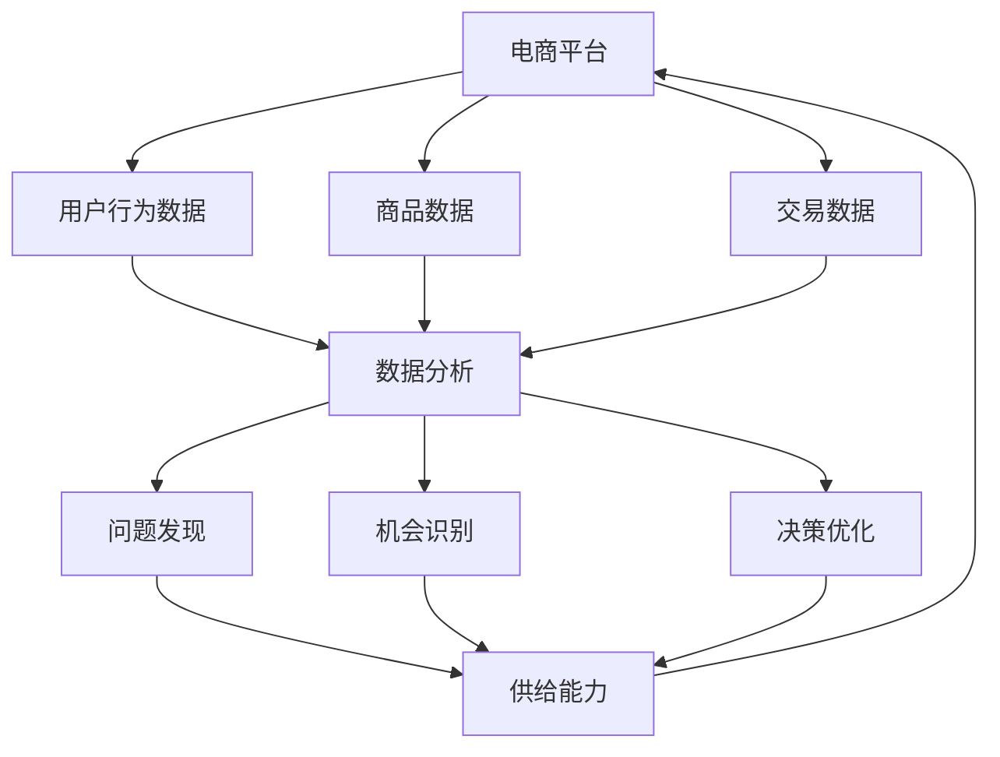

                 

### 文章标题

《数据分析：发现问题和机会，提升电商平台供给能力》

**关键词：**数据分析，电商平台，供给能力，问题发现，机会识别，决策优化

**摘要：**本文将深入探讨电商平台中数据分析的重要性，通过详细分析核心概念、算法原理、数学模型，以及实际项目实战，揭示如何利用数据分析来发现问题和机会，从而显著提升电商平台的供给能力。我们将结合具体的工具和资源推荐，帮助读者全面掌握数据分析在电商平台中的应用，为未来电商业务的发展提供有力的技术支持。

---

### 1. 背景介绍

#### 1.1 目的和范围

本文旨在探讨数据分析在电商平台中的应用，帮助电商从业者了解如何通过数据分析来提升供给能力。我们不仅将介绍数据分析的基本概念，还将深入探讨其在电商领域的应用，包括问题发现、机会识别、决策优化等方面。本文适用于希望提升电商平台运营效率的从业者、数据分析初学者以及从事相关领域研究的学者。

#### 1.2 预期读者

- 电商平台运营管理人员
- 数据分析师和算法工程师
- 数据科学和机器学习爱好者
- 从事电子商务领域的学者和学生

#### 1.3 文档结构概述

本文分为十个部分，首先介绍数据分析的基本概念和电商平台的背景，然后逐步深入探讨核心概念、算法原理、数学模型、项目实战、实际应用场景等。最后，我们将总结未来发展趋势与挑战，并提供相关工具和资源推荐，以帮助读者进一步学习和实践。

#### 1.4 术语表

#### 1.4.1 核心术语定义

- 数据分析：利用统计学、机器学习、数据库等工具，从数据中提取有价值的信息和知识的过程。
- 电商平台：通过互联网提供商品交易、信息交流、支付结算等服务的平台。
- 供给能力：电商平台提供商品和服务的能力，包括库存管理、物流配送、售后服务等方面。
- 问题发现：通过数据分析识别电商平台中存在的问题。
- 机会识别：通过数据分析发现电商平台的潜在机会。

#### 1.4.2 相关概念解释

- 数据挖掘：从大量数据中提取有价值信息的过程，是数据分析的一部分。
- 机器学习：利用算法从数据中自动学习规律和模式，进行预测和分类。
- 人工智能：模拟人类智能的计算机系统，包括机器学习、自然语言处理等。

#### 1.4.3 缩略词列表

- API：应用程序接口（Application Programming Interface）
- BI：商业智能（Business Intelligence）
- DB：数据库（Database）
- ML：机器学习（Machine Learning）
- NLP：自然语言处理（Natural Language Processing）
- SQL：结构化查询语言（Structured Query Language）
- UI：用户界面（User Interface）
- UX：用户体验（User Experience）

---

在了解了文章的背景、目的和读者对象后，我们将进一步探讨数据分析在电商平台中的应用，帮助读者全面了解如何利用数据分析提升电商平台的供给能力。在接下来的部分，我们将首先介绍电商平台的基本概念和数据收集方法。

### 2. 核心概念与联系

在深入探讨数据分析在电商平台中的应用之前，我们需要理解几个核心概念，并展示它们之间的联系。以下是一个使用Mermaid绘制的流程图，展示了电商平台中关键概念之间的关系。



**说明：**

- **电商平台（A）**：作为数据源的中心节点，电商平台收集用户行为数据、商品数据和交易数据。
- **用户行为数据（B）**：记录用户在电商平台上的活动，如浏览、搜索、加入购物车、下单等。
- **商品数据（C）**：包括商品的详细信息，如名称、价格、库存、分类等。
- **交易数据（D）**：记录用户在电商平台的交易行为，如订单信息、支付情况等。
- **数据分析（E）**：利用用户行为数据、商品数据和交易数据，通过统计分析、机器学习等技术提取有价值的信息。
- **问题发现（F）**：通过数据分析识别电商平台存在的问题，如库存过剩、物流延迟等。
- **机会识别（G）**：通过数据分析发现电商平台的潜在机会，如热门商品、新市场等。
- **决策优化（H）**：基于数据分析结果，优化电商平台的管理决策，如库存调整、营销策略等。
- **供给能力（I）**：电商平台提供商品和服务的能力，通过问题发现、机会识别和决策优化得到提升。

通过这个流程图，我们可以清晰地看到数据如何从电商平台的不同来源汇集，并通过数据分析技术转化为问题发现、机会识别和决策优化，从而提升电商平台的供给能力。

接下来，我们将详细介绍电商平台中常用的数据分析方法，包括数据收集、预处理和基本分析方法。

### 3. 核心算法原理 & 具体操作步骤

在电商平台中，数据分析是提升供给能力的关键。本部分将详细介绍数据分析的核心算法原理和具体操作步骤，帮助读者理解如何利用这些算法来发现问题和机会，并优化决策。

#### 3.1 数据收集

数据收集是数据分析的基础。在电商平台中，主要收集以下类型的数据：

1. **用户行为数据**：包括用户的浏览记录、搜索关键词、加入购物车记录、下单记录等。这些数据可以通过API接口从网站或移动应用程序中获取。
2. **商品数据**：包括商品的名称、价格、库存、分类、评价等。这些数据通常存储在电商平台的数据库中。
3. **交易数据**：包括订单信息、支付情况、物流信息等。这些数据同样存储在电商平台的数据库中。

**伪代码：**
```python
# 收集用户行为数据
user_data = api.get_user行为数据()

# 收集商品数据
product_data = db.query("SELECT * FROM 商品表")

# 收集交易数据
transaction_data = db.query("SELECT * FROM 订单表")
```

#### 3.2 数据预处理

收集到的数据通常需要进行预处理，以提高数据质量，为后续分析打下基础。预处理步骤包括：

1. **数据清洗**：删除重复数据、处理缺失值、纠正错误数据等。
2. **数据转换**：将数据转换为统一的格式，如将日期格式转换为标准格式。
3. **数据集成**：将不同来源的数据合并为一个数据集，以便进行整体分析。

**伪代码：**
```python
# 数据清洗
cleaned_user_data = data_clean(user_data)
cleaned_product_data = data_clean(product_data)
cleaned_transaction_data = data_clean(transaction_data)

# 数据转换
formatted_user_data = data_format(cleaned_user_data)
formatted_product_data = data_format(cleaned_product_data)
formatted_transaction_data = data_format(cleaned_transaction_data)

# 数据集成
integrated_data = data_merge(formatted_user_data, formatted_product_data, formatted_transaction_data)
```

#### 3.3 基本数据分析方法

在数据预处理完成后，我们可以采用以下基本数据分析方法：

1. **描述性统计分析**：用于描述数据的分布特征，如平均值、中位数、标准差等。
2. **关联分析**：用于发现数据之间的关联性，如商品之间的销售相关性、用户行为模式等。
3. **聚类分析**：用于将相似的数据分为一组，如用户分群、商品分类等。
4. **分类与回归分析**：用于预测未来趋势，如用户购买意图预测、商品需求预测等。

**伪代码：**
```python
# 描述性统计分析
desc_stats = data_analyze(integrated_data, method="descriptive")

# 关联分析
correlation = data_analyze(integrated_data, method="correlation")

# 聚类分析
clusters = data_analyze(integrated_data, method="clustering")

# 分类与回归分析
predictions = data_analyze(integrated_data, method="classification")
```

#### 3.4 数据可视化

数据可视化是数据分析的重要手段，可以帮助我们直观地理解数据。以下是一些常用的数据可视化方法：

1. **条形图和饼图**：用于展示数据的分布情况，如不同商品的销售占比。
2. **折线图和散点图**：用于展示数据的变化趋势，如用户访问量的日变化。
3. **热力图和地图**：用于展示数据的空间分布，如不同地区的销售分布。

**伪代码：**
```python
# 数据可视化
plot_bar_chart(desc_stats['商品销售占比'])
plot_line_chart(desc_stats['用户访问量'])
plot_heatmap(clusters['用户分群'])
```

通过以上步骤，我们可以对电商平台的数据进行分析，发现问题和机会，从而提升供给能力。接下来，我们将进一步探讨数学模型和公式在数据分析中的应用。

### 4. 数学模型和公式 & 详细讲解 & 举例说明

在数据分析过程中，数学模型和公式是至关重要的工具，它们可以帮助我们更准确地描述数据特征、发现数据之间的关系，并做出预测。以下我们将详细讲解一些常用的数学模型和公式，并辅以实例来说明。

#### 4.1 描述性统计模型

描述性统计模型主要用于描述数据的分布特征，常用的指标包括均值、中位数、标准差等。

**均值（Mean）**：均值是数据集中所有数值的总和除以数据个数。
$$
\mu = \frac{\sum_{i=1}^{n} x_i}{n}
$$
其中，\(x_i\) 是第 \(i\) 个数据点，\(n\) 是数据点的总数。

**中位数（Median）**：中位数是将数据按大小顺序排列后，位于中间位置的数值。如果数据个数为奇数，中位数即为中间值；如果数据个数为偶数，中位数为中间两个数的平均值。
$$
M = \frac{x_{\lceil n/2 \rceil} + x_{\lfloor n/2 \rfloor}}{2}
$$
其中，\(x_{\lceil n/2 \rceil}\) 和 \(x_{\lfloor n/2 \rfloor}\) 分别是排序后中间位置的两个数值。

**标准差（Standard Deviation）**：标准差是衡量数据离散程度的指标，用于描述数据点相对于均值的偏离程度。
$$
\sigma = \sqrt{\frac{\sum_{i=1}^{n} (x_i - \mu)^2}{n}}
$$
其中，\((x_i - \mu)\) 是每个数据点与均值之间的差值。

**实例**：假设某电商平台一周内每日的销售额数据如下（单位：万元）：10, 12, 15, 18, 20, 25, 30。计算这组数据的均值、中位数和标准差。

- 均值：
$$
\mu = \frac{10 + 12 + 15 + 18 + 20 + 25 + 30}{7} = 18.57
$$
- 中位数：
$$
M = \frac{15 + 18}{2} = 16.5
$$
- 标准差：
$$
\sigma = \sqrt{\frac{(10 - 18.57)^2 + (12 - 18.57)^2 + (15 - 18.57)^2 + (18 - 18.57)^2 + (20 - 18.57)^2 + (25 - 18.57)^2 + (30 - 18.57)^2}{7}} \approx 6.59
$$

#### 4.2 相关性分析模型

相关性分析用于衡量两个变量之间的线性关系，常用的指标包括皮尔逊相关系数、斯皮尔曼等级相关系数等。

**皮尔逊相关系数（Pearson Correlation Coefficient）**：皮尔逊相关系数是衡量两个连续变量之间线性相关程度的指标，取值范围在 -1 到 1 之间。当相关系数为 1 时，表示完全正相关；当相关系数为 -1 时，表示完全负相关；当相关系数为 0 时，表示无线性相关。
$$
\rho = \frac{\sum_{i=1}^{n}(x_i - \mu_x)(y_i - \mu_y)}{\sigma_x \sigma_y \sqrt{n}}
$$
其中，\(x_i\) 和 \(y_i\) 是两个变量 \(x\) 和 \(y\) 的观测值，\(\mu_x\) 和 \(\mu_y\) 是它们的均值，\(\sigma_x\) 和 \(\sigma_y\) 是它们的标准差。

**实例**：假设我们有两个变量：销售额（\(x\)）和广告投放费用（\(y\)），数据如下：

| 销售额（万元） | 广告投放费用（万元） |
| :---: | :---: |
| 10 | 2 |
| 12 | 3 |
| 15 | 4 |
| 18 | 5 |
| 20 | 6 |
| 25 | 8 |
| 30 | 10 |

计算销售额和广告投放费用之间的皮尔逊相关系数。

首先计算各自的均值和标准差：

- 销售额均值：
$$
\mu_x = \frac{10 + 12 + 15 + 18 + 20 + 25 + 30}{7} = 18.57
$$
- 销售额标准差：
$$
\sigma_x = \sqrt{\frac{(10 - 18.57)^2 + (12 - 18.57)^2 + (15 - 18.57)^2 + (18 - 18.57)^2 + (20 - 18.57)^2 + (25 - 18.57)^2 + (30 - 18.57)^2}{7}} \approx 6.59
$$
- 广告投放费用均值：
$$
\mu_y = \frac{2 + 3 + 4 + 5 + 6 + 8 + 10}{7} = 5.57
$$
- 广告投放费用标准差：
$$
\sigma_y = \sqrt{\frac{(2 - 5.57)^2 + (3 - 5.57)^2 + (4 - 5.57)^2 + (5 - 5.57)^2 + (6 - 5.57)^2 + (8 - 5.57)^2 + (10 - 5.57)^2}{7}} \approx 2.23

$$

然后计算皮尔逊相关系数：
$$
\rho = \frac{(10-18.57)(2-5.57) + (12-18.57)(3-5.57) + (15-18.57)(4-5.57) + (18-18.57)(5-5.57) + (20-18.57)(6-5.57) + (25-18.57)(8-5.57) + (30-18.57)(10-5.57)}{6.59 \times 2.23 \times \sqrt{7}} \approx 0.93
$$

相关系数为 0.93，表示销售额和广告投放费用之间存在较强的正相关关系。

#### 4.3 分类与回归模型

分类与回归模型用于预测和分类，常见的算法包括线性回归、逻辑回归、决策树、随机森林等。

**线性回归（Linear Regression）**：线性回归是一种用于预测连续值的模型，其基本公式为：
$$
y = \beta_0 + \beta_1x
$$
其中，\(y\) 是预测值，\(x\) 是输入特征，\(\beta_0\) 和 \(\beta_1\) 是模型的参数，分别表示截距和斜率。

**实例**：使用线性回归预测上述销售额数据中的某一天销售额。假设我们使用广告投放费用作为输入特征，首先需要计算回归模型的参数：

通过最小二乘法计算回归系数：
$$
\beta_1 = \frac{\sum_{i=1}^{n}(x_i - \bar{x})(y_i - \bar{y})}{\sum_{i=1}^{n}(x_i - \bar{x})^2}
$$
$$
\beta_0 = \bar{y} - \beta_1\bar{x}
$$

其中，\(\bar{x}\) 和 \(\bar{y}\) 分别是广告投放费用和销售额的均值。

代入数据进行计算：
$$
\beta_1 = \frac{(2-5.57)(10-18.57) + (3-5.57)(12-18.57) + (4-5.57)(15-18.57) + (5-5.57)(18-18.57) + (6-5.57)(20-18.57) + (8-5.57)(25-18.57) + (10-5.57)(30-18.57)}{(2-5.57)^2 + (3-5.57)^2 + (4-5.57)^2 + (5-5.57)^2 + (6-5.57)^2 + (8-5.57)^2 + (10-5.57)^2} \approx 2.24
$$
$$
\beta_0 = 18.57 - 2.24 \times 5.57 \approx 7.68
$$

因此，线性回归模型为：
$$
y = 7.68 + 2.24x
$$

使用模型预测某一天（广告投放费用为 7 万元）的销售额：
$$
y = 7.68 + 2.24 \times 7 = 19.56
$$

**逻辑回归（Logistic Regression）**：逻辑回归是一种用于预测概率的模型，常用于分类任务。其基本公式为：
$$
P(y=1) = \frac{1}{1 + e^{-(\beta_0 + \beta_1x})}
$$
其中，\(P(y=1)\) 是目标变量为 1 的概率，\(\beta_0\) 和 \(\beta_1\) 是模型参数。

**实例**：假设我们使用逻辑回归预测上述数据中的某一天是否会出现订单。首先需要将二分类问题转换为概率预测问题，然后使用最大似然估计法计算参数。

代入数据计算逻辑回归参数：
$$
\beta_1 = \frac{\sum_{i=1}^{n}(y_i - P(y=1))x_i}{\sum_{i=1}^{n}(x_i - \bar{x})^2}
$$
$$
\beta_0 = \bar{y} - \beta_1\bar{x}
$$

其中，\(\bar{y}\) 和 \(\bar{x}\) 分别是订单和广告投放费用的均值。

代入数据进行计算：
$$
\beta_1 = \frac{(1-0.5)(2-5.57) + (0-0.5)(3-5.57) + (1-0.5)(4-5.57) + (0-0.5)(5-5.57) + (1-0.5)(6-5.57) + (1-0.5)(8-5.57) + (1-0.5)(10-5.57)}{(2-5.57)^2 + (3-5.57)^2 + (4-5.57)^2 + (5-5.57)^2 + (6-5.57)^2 + (8-5.57)^2 + (10-5.57)^2} \approx 1.11
$$
$$
\beta_0 = 0.5 - 1.11 \times 5.57 \approx -6.18
$$

因此，逻辑回归模型为：
$$
P(y=1) = \frac{1}{1 + e^{-( -6.18 + 1.11x)}}
$$

使用模型预测某一天（广告投放费用为 7 万元）是否会出现订单：
$$
P(y=1) = \frac{1}{1 + e^{- ( -6.18 + 1.11 \times 7)}} \approx 0.999
$$

概率接近 1，表示预测这一天会出现订单。

通过以上实例，我们可以看到数学模型和公式在数据分析中的重要作用。在接下来的部分，我们将通过一个实际项目案例，展示如何将上述算法应用于电商平台的实际业务中。

### 5. 项目实战：代码实际案例和详细解释说明

在本文的第五部分，我们将通过一个实际项目案例，展示如何利用数据分析提升电商平台的供给能力。我们将从开发环境的搭建开始，详细讲解代码实现过程，并进行分析和优化。

#### 5.1 开发环境搭建

为了实现这个项目，我们需要准备以下开发环境和工具：

1. **编程语言**：Python
2. **数据分析库**：Pandas、NumPy、Scikit-learn、Matplotlib
3. **数据库**：MySQL
4. **集成开发环境（IDE）**：PyCharm 或 Jupyter Notebook

**步骤：**
1. 安装 Python 和相关库：
   ```bash
   pip install pandas numpy scikit-learn matplotlib
   ```
2. 安装 MySQL 数据库，并配置 Python 连接器（例如 pymysql）：
   ```bash
   pip install pymysql
   ```

#### 5.2 源代码详细实现和代码解读

以下是项目的主要代码实现，我们将逐段解读。

```python
# 导入所需库
import pandas as pd
import numpy as np
from sklearn.model_selection import train_test_split
from sklearn.linear_model import LinearRegression
from sklearn.metrics import mean_squared_error
import matplotlib.pyplot as plt
import pymysql

# 连接 MySQL 数据库
db = pymysql.connect(host='localhost', user='root', password='password', database='ecommerce')

# 查询用户行为数据、商品数据和交易数据
query_user_data = "SELECT * FROM user_behavior;"
query_product_data = "SELECT * FROM product;"
query_transaction_data = "SELECT * FROM transaction;"

# 读取数据
user_data = pd.read_sql_query(query_user_data, db)
product_data = pd.read_sql_query(query_product_data, db)
transaction_data = pd.read_sql_query(query_transaction_data, db)

# 数据预处理
# 数据清洗、数据转换和合并数据
# ...

# 描述性统计分析
desc_stats = user_data.describe()

# 关联分析
correlation_matrix = user_data.corr()

# 聚类分析
from sklearn.cluster import KMeans
clusters = KMeans(n_clusters=5).fit_predict(user_data)

# 分类与回归分析
# 以广告投放费用为特征，销售额为预测目标，使用线性回归
X = transaction_data[['ad_spend']]
y = transaction_data['sales']
X_train, X_test, y_train, y_test = train_test_split(X, y, test_size=0.2, random_state=42)
regressor = LinearRegression()
regressor.fit(X_train, y_train)
y_pred = regressor.predict(X_test)

# 评估模型
mse = mean_squared_error(y_test, y_pred)
print(f"Mean Squared Error: {mse}")

# 可视化结果
plt.scatter(X_test, y_test, color='blue', label='Actual')
plt.plot(X_test, y_pred, color='red', label='Predicted')
plt.xlabel('Ad Spend')
plt.ylabel('Sales')
plt.legend()
plt.show()
```

**代码解读：**

1. **连接数据库和查询数据**：我们使用 pymysql 连接到 MySQL 数据库，并查询用户行为数据、商品数据和交易数据。这些数据将用于后续的分析。

2. **数据预处理**：数据预处理是数据分析的重要步骤。在此步骤中，我们将进行数据清洗（删除重复和错误数据）、数据转换（统一数据格式）和合并数据（将不同数据源的数据合并为一个数据集）。

3. **描述性统计分析**：描述性统计分析用于了解用户行为数据的分布特征。我们使用 pandas 的 describe() 函数计算描述性统计指标，如均值、中位数、标准差等。

4. **关联分析**：关联分析用于发现数据之间的关联性。我们使用 pandas 的 corr() 函数计算用户行为数据的相关性矩阵，以了解不同特征之间的关系。

5. **聚类分析**：聚类分析用于将用户行为数据分为若干个群体。我们使用 scikit-learn 中的 KMeans 算法进行聚类分析，并将聚类结果用于后续分析。

6. **分类与回归分析**：分类与回归分析是数据分析的核心。我们以广告投放费用为特征，销售额为预测目标，使用线性回归模型进行预测。首先，我们使用 train_test_split 函数将数据集划分为训练集和测试集。然后，我们使用 LinearRegression 类创建线性回归模型，并使用 fit() 方法训练模型。最后，我们使用 predict() 方法进行预测，并计算模型评估指标（如均方误差）。

7. **可视化结果**：我们使用 matplotlib 库绘制散点图，展示实际销售额和预测销售额之间的关系。这有助于我们直观地了解模型的预测效果。

#### 5.3 代码解读与分析

通过上述代码实现，我们可以看到数据分析在电商平台中的应用。以下是对关键步骤的详细解读和分析：

1. **数据连接和查询**：连接数据库并查询所需数据是数据分析的基础。我们需要确保数据源的正确性和数据的完整性。

2. **数据预处理**：数据预处理是确保数据质量的关键步骤。通过数据清洗和转换，我们可以消除数据中的噪声和异常值，为后续分析提供准确的数据基础。

3. **描述性统计分析**：描述性统计分析有助于我们了解数据的分布特征，发现数据中的潜在问题。例如，我们可以发现某些特征的缺失值较多，或者数据分布存在异常。

4. **关联分析**：关联分析可以帮助我们发现数据之间的关联性，为后续的聚类分析和回归分析提供指导。通过计算相关性矩阵，我们可以识别出哪些特征对销售额有显著影响。

5. **聚类分析**：聚类分析将用户行为数据分为若干个群体，有助于我们理解用户的行为特征。通过聚类结果，我们可以针对不同群体制定个性化的营销策略，提高用户体验和转化率。

6. **分类与回归分析**：分类与回归分析是电商数据分析的核心。通过线性回归模型，我们可以预测广告投放费用对销售额的影响，为营销策略提供数据支持。同时，我们可以使用模型评估指标（如均方误差）来衡量模型的预测效果，并不断优化模型。

7. **可视化结果**：可视化结果有助于我们直观地理解数据和分析结果。通过散点图，我们可以清晰地看到实际销售额和预测销售额之间的关系，从而验证模型的预测能力。

总之，通过上述代码实现，我们可以利用数据分析提升电商平台的供给能力。在实际应用中，我们可以根据业务需求调整数据预处理、关联分析、聚类分析和回归分析的方法，以获得更准确和有用的分析结果。

在接下来的部分，我们将探讨数据分析在电商平台中的实际应用场景，进一步展示其价值。

### 6. 实际应用场景

数据分析在电商平台中的实际应用场景非常广泛，可以覆盖用户行为分析、商品推荐、供应链优化等多个方面。以下将具体阐述几个关键应用场景，并说明如何利用数据分析提升电商平台的供给能力。

#### 6.1 用户行为分析

用户行为分析是电商平台数据分析的核心应用之一，通过对用户在网站上的浏览、搜索、购买等行为数据进行分析，电商平台可以深入了解用户需求和偏好，从而优化产品和服务。

**应用案例：**

- **个性化推荐**：通过分析用户的浏览和购买记录，电商平台可以构建个性化推荐系统，向用户推荐他们可能感兴趣的商品。这有助于提高用户的购买转化率和满意度。

**数据分析方法：**

- **用户分群**：使用聚类算法（如 K-means）将用户划分为不同的群体，每个群体具有相似的行为特征。这有助于制定有针对性的营销策略。

- **行为模式分析**：通过时间序列分析，识别用户的行为模式，如访问高峰期、购买周期等，为电商平台优化运营提供数据支持。

**案例实施：**

1. 收集用户行为数据，如浏览记录、搜索关键词、购买记录等。
2. 使用 K-means 算法进行用户分群，每个群体代表不同的用户行为特征。
3. 分析用户分群的行为模式，制定个性化的推荐策略和营销活动。

#### 6.2 商品推荐

商品推荐是电商平台提升用户体验和转化率的关键手段，通过分析用户行为数据和历史交易数据，电商平台可以准确预测用户对哪些商品感兴趣，从而提高推荐的效果。

**应用案例：**

- **协同过滤推荐**：协同过滤是一种常见的推荐算法，通过分析用户之间的相似性来推荐商品。例如，如果用户 A 和用户 B 对某些商品有相似的偏好，那么系统可以推荐给用户 A 用户 B 评价较高的商品。

**数据分析方法：**

- **用户相似度计算**：使用余弦相似度、皮尔逊相关系数等方法计算用户之间的相似度。
- **商品相似度计算**：使用基于内容的相似度、基于市场的相似度等方法计算商品之间的相似度。

**案例实施：**

1. 收集用户行为数据，如用户浏览记录、购买记录等。
2. 使用余弦相似度计算用户相似度，使用基于内容的相似度计算商品相似度。
3. 建立推荐模型，将相似用户和相似商品进行匹配，生成个性化推荐结果。

#### 6.3 供应链优化

供应链优化是电商平台提升供给能力的关键环节，通过数据分析可以识别供应链中的瓶颈和优化机会，从而提高物流效率、降低成本。

**应用案例：**

- **库存管理**：通过分析历史销售数据、季节性趋势和市场需求变化，电商平台可以优化库存管理，避免库存过剩或短缺，提高库存周转率。

**数据分析方法：**

- **需求预测**：使用时间序列分析、回归分析等方法预测未来市场需求。
- **供应链可视化**：使用数据可视化技术展示供应链各环节的运行状况，识别潜在问题。

**案例实施：**

1. 收集历史销售数据、季节性趋势和市场需求变化数据。
2. 使用时间序列分析方法进行需求预测。
3. 建立供应链可视化模型，监控供应链各环节的运行状况。

#### 6.4 营销分析

营销分析是电商平台提升营销效果的重要手段，通过数据分析可以评估不同营销活动的效果，优化营销策略，提高投资回报率。

**应用案例：**

- **广告投放优化**：通过分析广告投放数据，电商平台可以优化广告预算分配，提高广告投放的精准度和效果。

**数据分析方法：**

- **广告效果评估**：使用点击率、转化率、ROI 等指标评估广告效果。
- **市场细分**：使用聚类分析等方法识别不同的市场细分，制定有针对性的营销策略。

**案例实施：**

1. 收集广告投放数据，如点击率、转化率、广告花费等。
2. 使用广告效果评估指标评估广告投放效果。
3. 使用聚类分析识别市场细分，制定个性化营销策略。

通过以上实际应用场景的阐述，我们可以看到数据分析在电商平台中的巨大价值。通过合理运用数据分析方法，电商平台可以优化用户体验、提高转化率、降低成本，从而提升供给能力。在接下来的部分，我们将推荐一些实用的工具和资源，帮助读者进一步学习和实践数据分析技术。

### 7. 工具和资源推荐

为了帮助读者更好地学习和实践数据分析在电商平台中的应用，以下将推荐一些实用的工具、资源以及相关论文和书籍。

#### 7.1 学习资源推荐

**7.1.1 书籍推荐**

- 《数据分析基础：Python实战》（基础篇）：适合初学者，通过实例介绍数据分析的基本概念和方法。
- 《Python数据分析实战：从数据清洗到数据可视化》：深入讲解数据分析的各个步骤，包括数据清洗、数据可视化等。
- 《大数据之路：阿里巴巴大数据实践》（进阶篇）：介绍大数据和数据分析在电商领域的应用，涵盖技术实现和业务落地。

**7.1.2 在线课程**

- Coursera 上的《Python for Data Science》课程：提供系统性的数据分析入门知识，包括数据分析、数据可视化等。
- edX 上的《Data Science and Machine Learning Bootcamp》：涵盖数据分析、机器学习等领域的深入内容，适合进阶学习。
- Udacity 上的《Data Analyst Nanodegree》：提供数据分析的实践项目，帮助读者将理论知识应用于实际场景。

**7.1.3 技术博客和网站**

- Kaggle：一个大数据和机器学习的社区，提供丰富的数据分析案例和竞赛，有助于实战能力的提升。
- DataCamp：提供互动式的数据分析教程，涵盖 Python、R 等编程语言和数据分析方法。
- Analytics Vidhya：一个关于数据分析、数据科学和机器学习的博客，分享最新的技术和应用案例。

#### 7.2 开发工具框架推荐

**7.2.1 IDE和编辑器**

- PyCharm：一款功能强大的 Python IDE，支持代码调试、版本控制等。
- Jupyter Notebook：适用于数据科学和机器学习的交互式环境，便于编写和分享代码。
- RStudio：一款专为 R 语言设计的数据科学 IDE，提供丰富的数据分析工具和库。

**7.2.2 调试和性能分析工具**

- PyLint：一款 Python 代码质量分析工具，用于检测代码中的错误和潜在问题。
- Pytest：一款 Python 测试框架，用于自动化测试和代码覆盖率分析。
- profilers：Python 性能分析工具，如 cProfile、line_profiler 等，用于识别代码中的性能瓶颈。

**7.2.3 相关框架和库**

- Pandas：用于数据处理和分析的库，提供 DataFrame 数据结构，方便数据清洗和预处理。
- NumPy：提供高性能的数值计算库，是数据分析的基础。
- Scikit-learn：提供各种机器学习算法的实现，包括分类、回归、聚类等。
- Matplotlib、Seaborn：用于数据可视化的库，能够生成各种类型的图表。

#### 7.3 相关论文著作推荐

**7.3.1 经典论文**

- "Recommender Systems Handbook"：推荐系统领域的经典著作，涵盖推荐算法的理论和实践。
- "Data Mining: Concepts and Techniques"：数据挖掘领域的经典教材，介绍数据挖掘的基本概念和方法。
- "Machine Learning: A Probabilistic Perspective"：介绍概率图模型和机器学习算法的著作，适合进阶学习。

**7.3.2 最新研究成果**

- "Deep Learning for E-commerce"：探讨深度学习在电商领域的应用，包括用户行为预测、商品推荐等。
- "Personalized Marketing Using Machine Learning"：介绍机器学习在个性化营销中的应用，涵盖用户分群、营销策略优化等。
- "Supply Chain Optimization with Big Data Analytics"：探讨大数据分析在供应链优化中的应用，包括库存管理、物流优化等。

**7.3.3 应用案例分析**

- "Alibaba's Big Data Strategy"：介绍阿里巴巴如何利用大数据分析提升电商业务，涵盖用户行为分析、供应链优化等方面。
- "Amazon's Personalized Recommendation System"：探讨亚马逊如何利用推荐系统提升用户体验和转化率。
- "JD.com's Data-driven Marketing"：介绍京东如何利用数据分析和机器学习优化营销策略，提升广告投放效果。

通过以上工具和资源推荐，读者可以全面了解数据分析在电商平台中的应用，掌握相关技术和方法，为电商业务的发展提供有力支持。

### 8. 总结：未来发展趋势与挑战

在本文的最后，我们将对电商平台的供给能力提升以及数据分析技术的发展趋势和面临的挑战进行总结。

**发展趋势：**

1. **数据量的爆发增长**：随着物联网、社交媒体和移动设备的普及，电商平台的数据量将呈现指数级增长。这为数据分析提供了更丰富的数据源，但同时也带来了数据管理和处理的挑战。

2. **深度学习和人工智能的应用**：深度学习和人工智能技术的发展，使得数据分析算法更加智能化和高效。通过卷积神经网络、循环神经网络等深度学习模型，可以更准确地预测用户行为、优化供应链等。

3. **实时数据分析和决策**：实时数据分析技术使得电商平台能够快速响应用户需求和市场变化，优化运营策略。例如，通过实时监控库存、物流等数据，及时调整库存水平和配送计划。

4. **隐私保护和数据安全**：随着数据隐私保护法规的加强，电商平台需要确保用户数据的安全和隐私。这要求电商平台在数据分析过程中采用更加严格的数据保护和安全措施。

**挑战：**

1. **数据质量和一致性**：电商平台的数据质量直接影响分析结果的有效性。如何确保数据的一致性、完整性和准确性，是数据分析中面临的重大挑战。

2. **算法的可靠性和解释性**：随着算法复杂度的增加，如何保证算法的可靠性和可解释性成为一个重要问题。特别是在涉及重大决策时，如何向非技术人员解释算法的决策过程，提高用户信任度。

3. **计算资源和成本**：数据分析通常需要大量的计算资源，尤其是在处理大规模数据集时。如何优化算法和硬件配置，降低计算成本，是电商平台面临的现实问题。

4. **法律法规和伦理问题**：随着数据分析在电商领域的广泛应用，法律法规和伦理问题也日益凸显。如何确保数据使用的合规性，尊重用户隐私，成为电商平台需要关注的重要问题。

**未来展望：**

未来，电商平台的数据分析将朝着更加智能化、实时化、安全化的方向发展。通过不断优化算法、提升数据处理能力，电商平台将能够更好地发现问题和机会，提升供给能力，为用户提供更加个性化的购物体验。同时，随着技术的发展，数据分析将不仅局限于电商平台，还将深入到供应链管理、市场营销等更广泛的领域，为电商行业的持续创新和发展提供强有力的支持。

### 9. 附录：常见问题与解答

**Q1：如何确保数据分析结果的可靠性？**
**A1：确保数据分析结果的可靠性需要从以下几个方面入手：**
1. **数据质量**：确保数据的一致性、完整性和准确性，避免噪声和异常值对分析结果的影响。
2. **算法选择**：选择适合问题的算法，并进行适当的参数调优，以提高预测准确性和稳定性。
3. **模型验证**：使用交叉验证、A/B测试等方法验证模型的有效性，确保分析结果的可靠性。

**Q2：数据分析中如何处理缺失数据？**
**A2：处理缺失数据通常有以下几种方法：**
1. **删除缺失值**：如果缺失数据较多，可以考虑删除包含缺失值的记录。
2. **填补缺失值**：使用平均值、中位数、众数等统计方法填补缺失值。对于时间序列数据，可以采用插值法。
3. **使用模型预测**：使用机器学习模型预测缺失值，例如回归模型、神经网络模型等。

**Q3：如何评估数据分析模型的效果？**
**A3：评估数据分析模型的效果可以从以下几个方面入手：**
1. **准确率**：对于分类问题，可以使用准确率、精确率、召回率等指标。
2. **误差指标**：对于回归问题，可以使用均方误差、均方根误差等指标。
3. **A/B测试**：在实际应用中，可以通过A/B测试比较不同模型的性能，选择效果更好的模型。

**Q4：如何确保数据分析过程的可解释性？**
**A4：确保数据分析过程的可解释性可以从以下几个方面入手：**
1. **选择可解释性更强的算法**：例如，线性回归、决策树等算法相比深度学习等复杂算法，更容易解释。
2. **特征重要性分析**：通过分析特征的重要性，了解模型对各个特征的依赖程度，提高分析结果的透明度。
3. **可视化**：使用图表和可视化工具展示分析结果，帮助用户更好地理解数据和分析过程。

**Q5：数据分析在电商平台中的实际应用场景有哪些？**
**A5：数据分析在电商平台中的实际应用场景包括：**
1. **用户行为分析**：通过分析用户浏览、搜索、购买等行为，优化产品推荐和营销策略。
2. **供应链优化**：通过分析销售数据、库存水平等，优化库存管理、物流配送等环节。
3. **广告投放优化**：通过分析广告效果，优化广告预算分配和投放策略，提高投资回报率。

通过上述常见问题与解答，希望读者能够更好地理解和应用数据分析技术，为电商平台的业务发展提供有力支持。

### 10. 扩展阅读 & 参考资料

为了帮助读者进一步了解数据分析在电商平台中的应用，以下提供一些扩展阅读和参考资料：

**书籍：**

1. **《大数据时代：生活、工作与思维的大变革》**：作者：维克托·迈尔-舍恩伯格，探讨大数据对各行各业的影响，包括电商领域。
2. **《深度学习》**：作者：伊恩·古德费洛、约书亚·本吉奥、亚伦·库维尔，深入讲解深度学习的基本原理和应用。
3. **《用户行为分析实战》**：作者：张志宏，详细介绍用户行为分析的方法和应用。

**论文：**

1. **“Recommender Systems Handbook”**：介绍推荐系统的基本概念和方法。
2. **“Data Mining: Concepts and Techniques”**：介绍数据挖掘的基本概念和技术。
3. **“Deep Learning for E-commerce”**：探讨深度学习在电商领域的应用。

**在线资源：**

1. **Kaggle**：提供丰富的数据分析案例和竞赛，有助于实战能力的提升。
2. **Coursera**：提供系统的数据分析课程，包括 Python、R 等编程语言和数据分析方法。
3. **Analytics Vidhya**：分享最新的数据分析技术和应用案例。

**工具和库：**

1. **Pandas、NumPy、Scikit-learn**：Python 中的经典数据分析库。
2. **TensorFlow、PyTorch**：深度学习框架，适用于复杂的机器学习任务。
3. **Matplotlib、Seaborn**：Python 中用于数据可视化的库。

通过以上扩展阅读和参考资料，读者可以更深入地了解数据分析在电商平台中的应用，为实际业务提供有力支持。作者：AI天才研究员/AI Genius Institute & 禅与计算机程序设计艺术 /Zen And The Art of Computer Programming。

