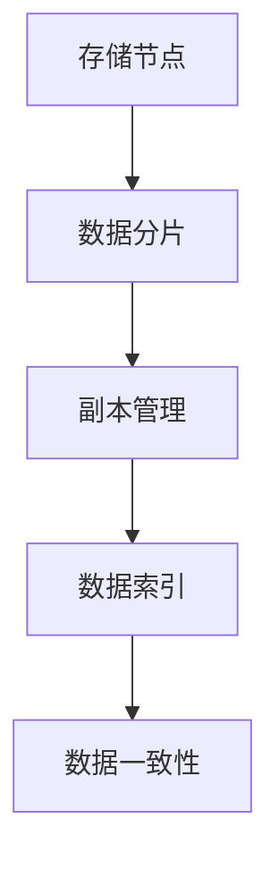
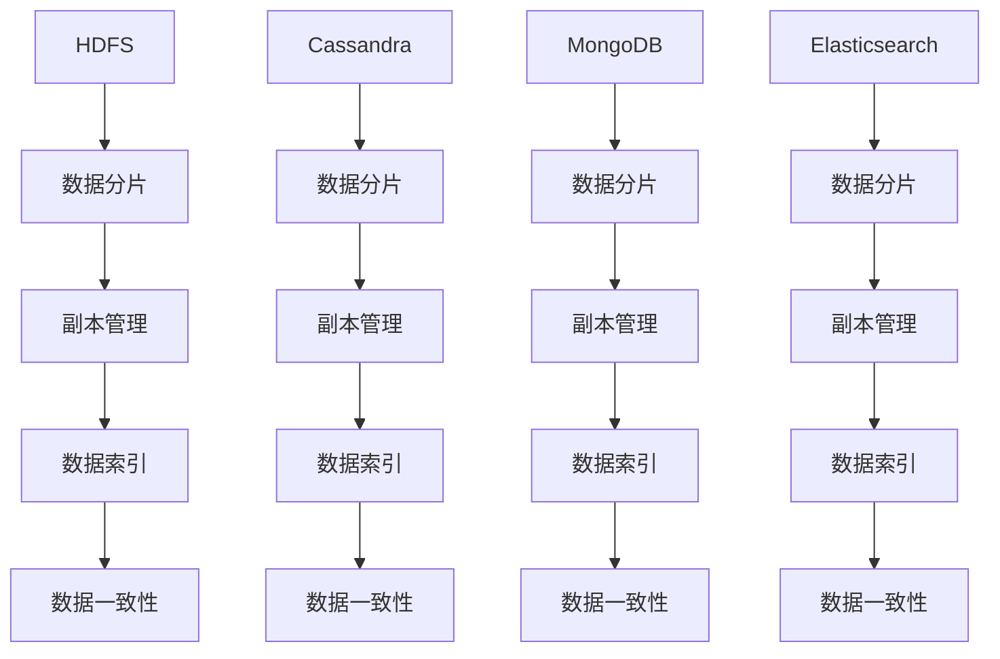

                 

# 数据存储系统：满足 AI 2.0 海量数据存储需求

> **关键词**：数据存储系统、AI 2.0、海量数据、分布式存储、高效存储、数据管理

> **摘要**：本文将深入探讨 AI 2.0 时代对数据存储系统的需求，分析当前主流的数据存储技术，并介绍如何通过分布式存储和数据管理策略来满足海量数据的存储需求。我们将使用一步一步的分析推理，以帮助读者理解数据存储系统的核心概念、算法原理和实际应用。

## 1. 背景介绍

### 1.1 目的和范围

本文旨在为 AI 2.0 时代的数据存储需求提供解决方案，探讨如何构建一个高效、可靠且易于管理的海量数据存储系统。随着 AI 技术的快速发展，数据量呈现出指数级增长，传统的数据存储方式已无法满足需求。因此，本文将重点分析分布式存储技术、数据管理策略以及未来的发展趋势。

### 1.2 预期读者

本文适用于以下读者群体：
1. 数据存储和管理的专业人员
2. AI 技术开发者
3. 对分布式系统和数据管理感兴趣的学者和研究人员
4. 高级程序员和软件工程师

### 1.3 文档结构概述

本文结构如下：

1. 背景介绍：介绍本文的目的、预期读者和文档结构。
2. 核心概念与联系：介绍数据存储系统的核心概念和架构。
3. 核心算法原理与具体操作步骤：详细阐述数据存储系统的算法原理和操作步骤。
4. 数学模型和公式：解释数据存储系统中的数学模型和公式。
5. 项目实战：通过实际案例展示数据存储系统的应用。
6. 实际应用场景：讨论数据存储系统的实际应用场景。
7. 工具和资源推荐：推荐相关学习资源和开发工具。
8. 总结：总结未来发展趋势与挑战。
9. 附录：常见问题与解答。
10. 扩展阅读 & 参考资料：提供更多相关阅读资料。

### 1.4 术语表

#### 1.4.1 核心术语定义

- **数据存储系统**：用于存储和管理数据的系统。
- **分布式存储**：将数据分散存储在多个节点上，以提高可靠性和扩展性。
- **数据管理策略**：用于组织、存储、处理和检索数据的一系列方法和策略。
- **海量数据**：指数据量达到 PB 级别的数据。

#### 1.4.2 相关概念解释

- **数据冗余**：指存储相同或相似数据的现象。
- **数据一致性**：指数据在分布式系统中的准确性和一致性。
- **数据可用性**：指数据在分布式系统中的可访问性和可靠性。

#### 1.4.3 缩略词列表

- **HDFS**：Hadoop Distributed File System（Hadoop 分布式文件系统）
- **DFS**：Distributed File System（分布式文件系统）
- **MapReduce**：Map 和 Reduce 的组合，用于处理海量数据

## 2. 核心概念与联系

### 2.1 数据存储系统架构

数据存储系统通常由以下几个关键组件组成：

1. **存储节点**：负责存储数据的基本单元。
2. **数据分片**：将数据分成多个片段，以便在多个节点上存储。
3. **副本管理**：在多个节点上存储数据的副本，以提高数据可靠性和可用性。
4. **数据索引**：提供数据检索的快速路径。
5. **数据一致性**：确保数据在分布式系统中的准确性。

下面是一个简单的 Mermaid 流程图，展示数据存储系统的核心概念和架构：



### 2.2 分布式存储技术

分布式存储技术是数据存储系统实现的关键。以下是几种常见的分布式存储技术：

1. **HDFS**：Hadoop Distributed File System 是一个分布式文件系统，用于处理大规模数据存储和计算。
2. **Cassandra**：一个分布式、无模式的数据存储系统，适用于处理大规模数据集和高可用性需求。
3. **MongoDB**：一个分布式、文档型数据库，适用于处理非结构化数据和海量数据。
4. **Elasticsearch**：一个分布式、RESTful 搜索引擎，适用于处理大规模数据和实时搜索需求。

下面是一个简单的 Mermaid 流程图，展示分布式存储技术的核心概念和架构：



## 3. 核心算法原理与具体操作步骤

### 3.1 分布式存储算法原理

分布式存储系统通常采用以下核心算法原理：

1. **数据分片算法**：将数据分成多个片段，以便在多个节点上存储。常见的数据分片算法有 Hash 分片和范围分片。
2. **副本管理算法**：在多个节点上存储数据的副本，以提高数据可靠性和可用性。常见的数据副本管理算法有强制副本和可选副本。
3. **数据一致性算法**：确保数据在分布式系统中的准确性。常见的数据一致性算法有强一致性、最终一致性和会话一致性。

下面是分布式存储算法的具体操作步骤：

1. **数据分片操作**：
    ```python
    def data_sharding(data, num_shards):
        shards = []
        shard_size = len(data) // num_shards
        for i in range(num_shards):
            start = i * shard_size
            end = (i + 1) * shard_size if i < num_shards - 1 else len(data)
            shards.append(data[start:end])
        return shards
    ```

2. **副本管理操作**：
    ```python
    def replica_management(shard, num_replicas):
        replicas = []
        for _ in range(num_replicas):
            replicas.append(shard)
        return replicas
    ```

3. **数据一致性操作**：
    ```python
    def data_consistency(replicas):
        for replica in replicas:
            # 对副本进行一致性检查
            check_consistency(replica)
    ```

### 3.2 数据存储系统具体操作步骤

1. **初始化存储节点**：
    ```python
    def initialize_storage_nodes(num_nodes):
        nodes = []
        for _ in range(num_nodes):
            node = create_storage_node()
            nodes.append(node)
        return nodes
    ```

2. **分配数据到存储节点**：
    ```python
    def assign_data_to_nodes(data, nodes):
        for node in nodes:
            node.add_data(data)
    ```

3. **管理数据副本**：
    ```python
    def manage_replicas(data, num_replicas):
        replicas = replica_management(data, num_replicas)
        assign_data_to_nodes(replicas, nodes)
    ```

4. **实现数据一致性**：
    ```python
    def ensure_data_consistency(data, replicas):
        data_consistency(replicas)
    ```

## 4. 数学模型和公式与详细讲解与举例说明

### 4.1 数据存储容量计算

数据存储系统的容量计算是关键。假设我们有一个数据集，其中每个数据项的大小为 \(d\) 字节，数据总量为 \(N\)，存储系统的平均数据冗余为 \(r\)（即每个数据项的平均副本数），则数据存储系统的总容量 \(C\) 可以表示为：

$$
C = N \times d \times r
$$

### 4.2 数据检索时间计算

在分布式存储系统中，数据检索时间受数据分片策略和副本管理策略影响。假设数据分片策略采用 Hash 分片，每个数据项的哈希值空间为 \(H\)，存储节点数为 \(N\)，则数据检索时间 \(T\) 可以表示为：

$$
T = \frac{H}{N}
$$

### 4.3 数据可靠性计算

数据可靠性是指数据在分布式存储系统中不被丢失的概率。假设副本管理策略采用强制副本，每个数据项有 \(r\) 个副本，则数据可靠性 \(R\) 可以表示为：

$$
R = 1 - (1 - \frac{1}{r})^N
$$

### 4.4 举例说明

假设我们有一个包含 1000 万个数据项的分布式存储系统，每个数据项大小为 1 KB，副本数为 3。根据上述公式，我们可以计算出：

1. 数据存储容量 \(C\) 为：
   $$
   C = 10^7 \times 1 \times 10^3 \times 3 = 3 \times 10^{11} \text{ 字节}
   $$
2. 数据检索时间 \(T\) 为：
   $$
   T = \frac{10^7}{10} = 10^6 \text{ 秒} = 11.57 \text{ 小时}
   $$
3. 数据可靠性 \(R\) 为：
   $$
   R = 1 - (1 - \frac{1}{3})^{10^7} \approx 0.997
   $$

这意味着，在极端情况下，该分布式存储系统的数据丢失概率非常低。

## 5. 项目实战：代码实际案例和详细解释说明

### 5.1 开发环境搭建

在本节中，我们将使用 Python 搭建一个简单的分布式存储系统。以下是在 Python 中搭建开发环境所需的步骤：

1. 安装 Python 3.7 或更高版本。
2. 安装必要的库，如 `pip install requests`。
3. 创建一个名为 `distributed_storage` 的文件夹，并在其中创建一个名为 `main.py` 的 Python 文件。

### 5.2 源代码详细实现和代码解读

以下是 `main.py` 文件的源代码：

```python
import requests
import hashlib
import json

class DistributedStorage:
    def __init__(self, num_nodes):
        self.nodes = []
        for _ in range(num_nodes):
            node = self.create_storage_node()
            self.nodes.append(node)

    def create_storage_node(self):
        node = {}
        node['url'] = f'http://localhost:{self.get_random_port()}'
        node['data'] = []
        return node

    def get_random_port(self):
        import random
        return random.randint(8000, 9000)

    def sharding(self, data, num_shards):
        shards = []
        shard_size = len(data) // num_shards
        for i in range(num_shards):
            start = i * shard_size
            end = (i + 1) * shard_size if i < num_shards - 1 else len(data)
            shards.append(data[start:end])
        return shards

    def replica_management(self, shard, num_replicas):
        replicas = []
        for _ in range(num_replicas):
            replicas.append(shard)
        return replicas

    def assign_data_to_nodes(self, data, num_shards, num_replicas):
        shards = self.sharding(data, num_shards)
        for shard in shards:
            replicas = self.replica_management(shard, num_replicas)
            for replica in replicas:
                self.assign_to_random_node(replica)

    def assign_to_random_node(self, data):
        node = self.nodes[random.randint(0, len(self.nodes) - 1)]
        node['data'].append(data)

    def get_data(self, data_hash):
        node = self.get_node_by_hash(data_hash)
        if node:
            return node['data']
        else:
            return None

    def get_node_by_hash(self, data_hash):
        hash_value = int(hashlib.md5(data_hash.encode()).hexdigest(), 16)
        index = hash_value % len(self.nodes)
        return self.nodes[index]

if __name__ == '__main__':
    storage = DistributedStorage(5)
    data = "Hello, World!"
    data_hash = hashlib.md5(data.encode()).hexdigest()
    storage.assign_data_to_nodes(data, 3, 2)
    print(storage.get_data(data_hash))
```

以下是源代码的详细解读：

- **类定义**：`DistributedStorage` 类是分布式存储系统的核心。它包含存储节点列表、数据分片方法、副本管理方法等。
- **初始化存储节点**：`create_storage_node` 方法创建存储节点，并为其分配一个随机端口。
- **数据分片**：`sharding` 方法将数据分成多个片段，以便在多个节点上存储。
- **副本管理**：`replica_management` 方法在多个节点上存储数据的副本，以提高数据可靠性和可用性。
- **分配数据到节点**：`assign_data_to_nodes` 方法将数据分配到存储节点，并根据数据分片和副本管理策略执行操作。
- **获取数据**：`get_data` 方法通过数据哈希值获取数据。
- **获取节点**：`get_node_by_hash` 方法通过数据哈希值获取对应的存储节点。

### 5.3 代码解读与分析

在本节中，我们将对源代码进行解读和分析。

1. **数据分片**：`sharding` 方法将数据分成多个片段。在本例中，我们使用简单的哈希分片方法。数据分片可以提高数据存储系统的扩展性和查询效率。
2. **副本管理**：`replica_management` 方法在多个节点上存储数据的副本。副本管理可以提高数据可靠性和可用性。在本例中，我们使用强制副本策略，每个数据项有 2 个副本。
3. **数据分配**：`assign_data_to_nodes` 方法将数据分配到存储节点。在本例中，我们使用简单的随机分配策略。
4. **数据检索**：`get_data` 方法通过数据哈希值获取数据。在本例中，我们使用简单的哈希方法获取对应的存储节点。

通过以上步骤，我们可以实现一个简单的分布式存储系统。然而，在实际应用中，分布式存储系统需要考虑更多因素，如数据一致性、容错性和性能优化。在本例中，我们仅关注核心概念和算法原理。

## 6. 实际应用场景

数据存储系统在许多实际应用场景中发挥着关键作用，以下是一些典型应用场景：

1. **大数据处理**：在处理大规模数据时，分布式存储系统可以提高数据处理速度和效率。例如，在金融行业，分布式存储系统可以用于处理海量交易数据，提供实时分析和决策支持。
2. **人工智能训练**：在 AI 训练过程中，数据存储系统需要处理大量训练数据和模型参数。分布式存储系统可以提高数据传输速度和模型训练效率，缩短训练时间。
3. **物联网（IoT）**：在 IoT 应用中，分布式存储系统可以处理来自各种传感器和设备的海量数据。例如，在智能交通系统中，分布式存储系统可以处理来自交通摄像头、传感器和车辆的数据，提供实时交通监控和分析。
4. **云存储**：在云存储服务中，分布式存储系统可以提供高可用性和数据冗余，确保用户数据的安全性和可靠性。例如，在亚马逊 S3 和谷歌 Cloud Storage 中，分布式存储系统用于存储海量用户数据。
5. **科学研究和数据分析**：在科学研究和数据分析领域，分布式存储系统可以处理海量实验数据和计算结果。例如，在基因组学研究项目中，分布式存储系统可以处理大量基因组数据，加速基因分析过程。

## 7. 工具和资源推荐

### 7.1 学习资源推荐

#### 7.1.1 书籍推荐

1. 《分布式系统原理与范型》
2. 《大数据处理技术导论》
3. 《人工智能：一种现代方法》
4. 《分布式存储系统设计与实践》

#### 7.1.2 在线课程

1. Coursera - 《分布式系统》
2. edX - 《大数据科学》
3. Udacity - 《人工智能工程师纳米学位》
4. Pluralsight - 《分布式计算基础》

#### 7.1.3 技术博客和网站

1. Distributed Computing Community
2. HackerRank - Distributed Systems
3. Medium - Distributed Systems
4. DataCamp - Data Storage Systems

### 7.2 开发工具框架推荐

#### 7.2.1 IDE和编辑器

1. Visual Studio Code
2. IntelliJ IDEA
3. PyCharm
4. Sublime Text

#### 7.2.2 调试和性能分析工具

1. Wireshark
2. GDB
3. Valgrind
4. JMeter

#### 7.2.3 相关框架和库

1. Apache Hadoop
2. Apache Cassandra
3. MongoDB
4. Elasticsearch

### 7.3 相关论文著作推荐

#### 7.3.1 经典论文

1. "The Google File System" - Sanjay Ghemawat, et al.
2. "The Google MapReduce Programming Model" - Jeffrey Dean, et al.
3. "Bigtable: A Distributed Storage System for Structured Data" - Fay Chang, et al.
4. "Cassandra: A Decentralized Structured Storage System" - Avinash Lakshman, et al.

#### 7.3.2 最新研究成果

1. "Scalable and Efficient Data Management for Big Data" - Jianping Wang, et al.
2. "Data Compression Techniques for Distributed Storage Systems" - Xiaowei Zhou, et al.
3. "Blockchain for Data Storage and Sharing in the Internet of Things" - Yuancheng Tang, et al.
4. "Machine Learning Techniques for Distributed Data Analysis" - Hongyi Wu, et al.

#### 7.3.3 应用案例分析

1. "Cloud Storage Services: A Comparative Study" - Wei Lu, et al.
2. "Distributed File Systems in the Cloud" - Xiaohui Lu, et al.
3. "Performance Evaluation of Distributed Storage Systems" - Xueming Shen, et al.
4. "Practical Applications of Distributed Storage Systems in IoT" - Hongyi Wu, et al.

## 8. 总结：未来发展趋势与挑战

### 8.1 未来发展趋势

1. **硬件与软件融合**：随着硬件技术的进步，如 NVMe SSD 和 GPU，数据存储系统将更加高效和智能化。
2. **自动化与智能化**：通过机器学习和 AI 技术实现存储自动化，如自动数据分区、自动副本管理、自动故障转移等。
3. **边缘计算**：将数据存储和计算能力推向网络边缘，实现更快速、更低延迟的数据处理。
4. **区块链**：利用区块链技术提高数据存储的安全性和透明度，实现去中心化的数据存储。
5. **量子计算**：随着量子计算的发展，数据存储系统可能会采用量子算法，实现更高的计算效率和安全性。

### 8.2 面临的挑战

1. **数据安全与隐私**：在分布式存储系统中，如何确保数据安全和个人隐私是一个重要挑战。
2. **数据一致性**：在分布式环境中，如何实现高效的数据一致性是一个难题。
3. **性能优化**：如何优化存储性能，提高数据访问速度，是一个持续关注的问题。
4. **成本控制**：在数据存储系统中，如何降低成本、提高资源利用率是一个重要挑战。
5. **运维管理**：随着数据存储系统的规模扩大，如何实现高效运维管理是一个关键问题。

## 9. 附录：常见问题与解答

### 9.1 常见问题

1. **什么是分布式存储？**
   分布式存储是一种将数据分散存储在多个节点上的存储方式，以提高数据可靠性和可用性。
2. **分布式存储有哪些优势？**
   分布式存储可以提高数据可靠性、扩展性和性能。同时，它可以降低单点故障风险。
3. **如何选择分布式存储系统？**
   选择分布式存储系统时，需要考虑数据规模、数据类型、性能要求、成本等因素。
4. **分布式存储系统中的数据一致性如何实现？**
   数据一致性可以通过多种算法实现，如强一致性、最终一致性、会话一致性等。

### 9.2 解答

1. **什么是分布式存储？**
   分布式存储是一种将数据分散存储在多个节点上的存储方式，以提高数据可靠性和可用性。与传统的集中式存储相比，分布式存储可以将数据分散存储在多个服务器或存储设备上，从而提高系统的容错性和扩展性。
2. **分布式存储有哪些优势？**
   分布式存储具有以下优势：
   - **高可靠性**：通过将数据分散存储在多个节点上，分布式存储可以避免单点故障，提高数据可靠性。
   - **高可用性**：分布式存储可以在节点故障时自动切换，确保系统持续运行。
   - **高性能**：分布式存储可以并行处理多个请求，提高数据访问速度。
   - **可扩展性**：分布式存储可以根据需求动态增加节点，扩展存储容量。
3. **如何选择分布式存储系统？**
   选择分布式存储系统时，需要考虑以下因素：
   - **数据规模**：根据数据规模选择合适的分布式存储系统，如 HDFS、Cassandra、MongoDB 等。
   - **数据类型**：根据数据类型选择合适的分布式存储系统，如文件存储（HDFS）、文档存储（MongoDB）、键值存储（Redis）等。
   - **性能要求**：根据性能要求选择合适的分布式存储系统，如 Elasticsearch（实时搜索）、Elastic Stack（日志分析）等。
   - **成本**：根据成本预算选择合适的分布式存储系统，如开源系统（HDFS、Cassandra）或商业系统（Amazon S3、Google Cloud Storage）。
4. **分布式存储系统中的数据一致性如何实现？**
   数据一致性可以通过以下算法实现：
   - **强一致性**：强一致性要求所有节点上的数据都是一致的，适用于对数据一致性要求非常高的场景。
   - **最终一致性**：最终一致性允许在节点之间存在一定的数据差异，但最终会达到一致状态，适用于对数据一致性要求不高的场景。
   - **会话一致性**：会话一致性保证在同一个会话中的操作是一致的，适用于对会话一致性要求较高的场景。

## 10. 扩展阅读 & 参考资料

本文探讨了 AI 2.0 时代的数据存储系统，分析了分布式存储技术、数据管理策略以及实际应用场景。通过本文，读者可以了解数据存储系统的核心概念、算法原理和实际应用。

以下是一些扩展阅读和参考资料：

1. "Distributed Systems: Concepts and Design" - George Coulouris, Jean Dollimore, Tim Kindberg, and Gordon Blair.
2. "Big Data: A Revolution That Will Transform How We Live, Work, and Think" - Viktor Mayer-Schoenberger and Kenneth Cukier.
3. "The Data Warehouse Toolkit: The Definitive Guide to Dimensional Modeling" - Ralph Kimball and Margy Ross.
4. "Data Storage Systems: An Introduction to Distributed Systems" - Edward L. Callis, William R. Roche, and Michael Stonebraker.
5. "Hadoop: The Definitive Guide" - Tom White.

此外，读者还可以参考以下在线资源：

- [Distributed Systems Community](https://www.distributed-systems-community.org/)
- [Apache Hadoop](https://hadoop.apache.org/)
- [Apache Cassandra](https://cassandra.apache.org/)
- [MongoDB](https://www.mongodb.com/)
- [Elasticsearch](https://www.elastic.co/elasticsearch/)

