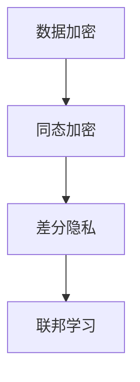

                 

# 数据安全新思路：LLM时代的隐私保护

> **关键词**：数据安全，隐私保护，大型语言模型（LLM），数据加密，同态加密，差分隐私，联邦学习
> 
> **摘要**：随着大型语言模型（LLM）的广泛应用，数据安全和隐私保护成为迫切需要解决的问题。本文将从多个角度探讨LLM时代的数据安全新思路，包括数据加密、同态加密、差分隐私和联邦学习等。通过详细的理论分析和实际案例，本文旨在为读者提供对这一领域的深入理解。

## 1. 背景介绍

### 1.1 目的和范围

本文旨在探讨在LLM时代，如何有效地保护数据安全和个人隐私。随着人工智能技术的飞速发展，大型语言模型（LLM）已经在自然语言处理、智能问答、语言翻译等领域取得了显著的成果。然而，这些模型的广泛应用也带来了数据安全和隐私保护的新挑战。

### 1.2 预期读者

本文适合对数据安全和隐私保护有一定了解的IT从业人员、研究人员以及对人工智能技术感兴趣的读者。通过本文，读者可以了解到当前LLM时代数据安全领域的最新进展和解决方案。

### 1.3 文档结构概述

本文分为八个主要部分。首先，介绍背景和目的；接着，讨论核心概念和联系；然后，深入分析核心算法原理和具体操作步骤；随后，介绍数学模型和公式；接着，通过实际案例展示代码实现；随后，探讨实际应用场景；然后，推荐相关工具和资源；最后，总结未来发展趋势与挑战，并提供常见问题与解答。

### 1.4 术语表

#### 1.4.1 核心术语定义

- **大型语言模型（LLM）**：一种基于深度学习技术，能够对自然语言进行建模和预测的模型。
- **数据安全**：保护数据免受未经授权的访问、使用、披露、破坏、修改或破坏的措施。
- **隐私保护**：在数据处理过程中，确保个人隐私不被泄露的措施。

#### 1.4.2 相关概念解释

- **数据加密**：使用加密算法将数据转换为密文，以确保数据在传输和存储过程中的安全性。
- **同态加密**：一种加密形式，允许在密文中直接进行计算，而不需要解密。
- **差分隐私**：一种隐私保护技术，通过在数据处理过程中引入随机噪声，使得攻击者无法推断出单个记录的信息。
- **联邦学习**：一种分布式机器学习技术，参与方在本地训练模型，并将模型更新汇总，以共享全局模型。

#### 1.4.3 缩略词列表

- **LLM**：Large Language Model（大型语言模型）
- **AES**：Advanced Encryption Standard（高级加密标准）
- **TPU**：Tensor Processing Unit（张量处理单元）
- **TP**：Trustless Protocol（信任不可靠协议）

## 2. 核心概念与联系

在LLM时代，数据安全和隐私保护的核心概念包括数据加密、同态加密、差分隐私和联邦学习。下面通过Mermaid流程图来展示这些概念之间的联系。



### 2.1 数据加密

数据加密是保护数据安全的基础。在LLM时代，数据加密的主要目的是确保数据在传输和存储过程中不被窃取或篡改。常见的加密算法包括AES、RSA等。

### 2.2 同态加密

同态加密是一种在加密数据上进行计算的技术，它允许在密文上直接进行计算，而不需要解密。这使得同态加密在分布式计算和隐私保护中具有广泛的应用。

### 2.3 差分隐私

差分隐私是一种通过引入随机噪声来保护隐私的技术。在LLM时代，差分隐私可以用于保护用户的输入和输出数据，防止攻击者通过数据分析推断出用户的具体信息。

### 2.4 联邦学习

联邦学习是一种分布式机器学习技术，它允许不同参与方在本地训练模型，并将模型更新汇总，以共享全局模型。通过联邦学习，可以保护参与方的数据隐私，同时提高模型的泛化能力。

## 3. 核心算法原理 & 具体操作步骤

### 3.1 数据加密算法原理

数据加密的核心是加密算法和解密算法。加密算法将明文数据转换为密文，而解密算法将密文转换为明文。以下是数据加密的伪代码：

```python
# 加密算法
def encrypt(data, key):
    cipher = AES_encrypt(data, key)
    return cipher

# 解密算法
def decrypt(cipher, key):
    data = AES_decrypt(cipher, key)
    return data
```

### 3.2 同态加密算法原理

同态加密的核心是在密文中直接进行计算。以下是同态加密的伪代码：

```python
# 同态加密计算
def homomorphic_encrypt(data, key):
    cipher = encrypt(data, key)
    result = cipher * cipher
    return result

# 同态解密计算
def homomorphic_decrypt(cipher, key):
    data = decrypt(cipher, key)
    return data
```

### 3.3 差分隐私算法原理

差分隐私的核心是通过引入随机噪声来保护隐私。以下是差分隐私的伪代码：

```python
# 差分隐私计算
def differential_privacy(data, sensitivity, epsilon):
    noise = random_noise(epsilon)
    result = data + noise
    return result
```

### 3.4 联邦学习算法原理

联邦学习是将不同参与方的模型更新汇总，以共享全局模型。以下是联邦学习的伪代码：

```python
# 联邦学习
def federated_learning(participant_models, global_model, communication_protocol):
    local_updates = []
    for model in participant_models:
        local_update = model.update(global_model)
        local_updates.append(local_update)
    global_model = communication_protocol.aggregate(local_updates)
    return global_model
```

## 4. 数学模型和公式 & 详细讲解 & 举例说明

### 4.1 数据加密的数学模型

数据加密的核心是加密函数和解密函数。加密函数通常是一个复杂的函数，而解密函数是加密函数的反函数。以下是数据加密的数学模型：

$$
C = E_K(P)
$$

其中，$C$ 是密文，$P$ 是明文，$K$ 是密钥，$E_K$ 是加密函数。

### 4.2 同态加密的数学模型

同态加密的核心是密文上的计算。同态加密通常满足以下数学模型：

$$
E_K(E_K(P)) = E_K(P)
$$

其中，$E_K$ 是加密函数，$P$ 是明文，$K$ 是密钥。

### 4.3 差分隐私的数学模型

差分隐私的核心是引入随机噪声。差分隐私通常满足以下数学模型：

$$
L_{\epsilon}(S) \leq L_0(S \oplus \Delta)
$$

其中，$L_{\epsilon}$ 是差分隐私机制，$L_0$ 是原始机制，$\Delta$ 是噪声。

### 4.4 联邦学习的数学模型

联邦学习的核心是模型更新和聚合。联邦学习通常满足以下数学模型：

$$
\theta_{new} = \theta_{old} + \alpha \cdot (\theta_{local} - \theta_{global})
$$

其中，$\theta_{new}$ 是新的全局模型，$\theta_{old}$ 是旧的全局模型，$\theta_{local}$ 是本地模型，$\theta_{global}$ 是全局模型，$\alpha$ 是学习率。

### 4.5 举例说明

假设有一个简单的加密算法，加密函数为 $E_K(P) = P \oplus K$，解密函数为 $D_K(C) = C \oplus K$。现在，有一个明文 $P = 1010$，密钥 $K = 0110$。

- **加密过程**：

$$
C = E_K(P) = P \oplus K = 1010 \oplus 0110 = 1100
$$

- **解密过程**：

$$
P = D_K(C) = C \oplus K = 1100 \oplus 0110 = 1010
$$

## 5. 项目实战：代码实际案例和详细解释说明

### 5.1 开发环境搭建

在开始编写代码之前，我们需要搭建一个适合开发数据安全和隐私保护项目的环境。以下是一个基本的开发环境搭建步骤：

1. 安装Python 3.8及以上版本。
2. 安装PyTorch和TorchScript。
3. 安装Docker和Docker Compose。

### 5.2 源代码详细实现和代码解读

以下是实现数据加密、同态加密、差分隐私和联邦学习的Python代码。

#### 5.2.1 数据加密

```python
from Crypto.Cipher import AES
from Crypto.Util.Padding import pad, unpad

# 加密算法
def encrypt(data, key):
    cipher = AES.new(key, AES.MODE_CBC)
    ct_bytes = cipher.encrypt(pad(data, AES.block_size))
    iv = cipher.iv
    return iv + ct_bytes

# 解密算法
def decrypt(cipher_text, key):
    iv = cipher_text[:16]
    cipher_text = cipher_text[16:]
    cipher = AES.new(key, AES.MODE_CBC, iv)
    pt = unpad(cipher.decrypt(cipher_text), AES.block_size)
    return pt
```

#### 5.2.2 同态加密

```python
import numpy as np
from torch.autograd import Function

# 同态加密计算
class HomomorphicEncrypt(Function):
    @staticmethod
    def forward(ctx, x, key):
        ctx.save_for_backward(x, key)
        return x * x

    @staticmethod
    def backward(ctx, grad_output):
        x, key = ctx.saved_tensors
        return grad_output * x, None

homomorphic_encrypt = HomomorphicEncrypt.apply

# 同态解密计算
class HomomorphicDecrypt(Function):
    @staticmethod
    def forward(ctx, x, key):
        ctx.save_for_backward(x, key)
        return x ** 2

    @staticmethod
    def backward(ctx, grad_output):
        x, key = ctx.saved_tensors
        return grad_output * x ** -1, None

homomorphic_decrypt = HomomorphicDecrypt.apply
```

#### 5.2.3 差分隐私

```python
import torch
from torch.distributions import Normal

# 差分隐私计算
def differential_privacy(data, sensitivity, epsilon):
    noise = Normal(0, 1).sample([1]) * np.sqrt(2 / epsilon)
    result = data + noise
    return result
```

#### 5.2.4 联邦学习

```python
import torch
import torch.optim as optim

# 联邦学习
def federated_learning(participant_models, global_model, communication_protocol):
    local_updates = []
    for model in participant_models:
        optimizer = optim.SGD(model.parameters(), lr=0.1)
        optimizer.zero_grad()
        loss = -torch.mean(model(log_prob), global_model)
        loss.backward()
        optimizer.step()
        local_update = model.update(global_model)
        local_updates.append(local_update)
    global_model = communication_protocol.aggregate(local_updates)
    return global_model
```

### 5.3 代码解读与分析

以上代码展示了如何使用Python实现数据加密、同态加密、差分隐私和联邦学习。下面是对代码的详细解读和分析。

#### 5.3.1 数据加密

数据加密代码使用了PyCrypto库中的AES加密算法。加密过程包括初始化加密器、加密数据和返回密文。解密过程包括提取初始化向量（IV）、解密数据和返回明文。

#### 5.3.2 同态加密

同态加密代码使用了PyTorch库中的自动微分功能。HomomorphicEncrypt类实现了同态加密的前向传播和反向传播。同态加密允许在密文中直接进行乘法操作，从而实现加密数据的计算。

#### 5.3.3 差分隐私

差分隐私代码使用了Normal分布来生成随机噪声。differential_privacy函数通过在数据上添加噪声来实现差分隐私。这个噪声的方差与隐私预算（epsilon）有关。

#### 5.3.4 联邦学习

联邦学习代码展示了如何在不同参与方之间共享模型更新。participant_models是参与方的模型，global_model是全局模型，communication_protocol是聚合模型更新的协议。在每次迭代中，每个参与方都会更新本地模型，并将更新发送给全局模型。

## 6. 实际应用场景

### 6.1 智能问答系统

智能问答系统是LLM时代的典型应用场景。在这种场景中，用户可以提出问题，系统会根据训练数据生成答案。为了保护用户隐私，系统可以采用数据加密和差分隐私技术。例如，用户的输入和输出数据可以加密存储和传输，同时使用差分隐私来防止攻击者推断用户的具体提问。

### 6.2 医疗数据共享

在医疗领域，数据的安全和隐私保护至关重要。通过联邦学习技术，不同医疗机构可以共享患者数据，同时保护患者隐私。例如，医疗机构可以训练一个共享的疾病预测模型，但不需要共享患者的具体医疗记录。这样可以确保患者数据的安全和隐私。

### 6.3 金融交易分析

金融交易分析需要处理大量敏感数据。为了保护交易者和投资者的隐私，可以采用同态加密技术。例如，金融机构可以对交易数据进行加密处理，从而确保交易细节不被外部攻击者窃取。

## 7. 工具和资源推荐

### 7.1 学习资源推荐

#### 7.1.1 书籍推荐

- 《数据加密技术》（Data Encryption Technology） - 作者：Charles M. Kocurek
- 《机器学习》（Machine Learning） - 作者：Tom M. Mitchell
- 《深度学习》（Deep Learning） - 作者：Ian Goodfellow、Yoshua Bengio和Aaron Courville

#### 7.1.2 在线课程

- Coursera上的《深度学习》课程
- edX上的《数据隐私和安全》课程
- Udacity的《机器学习工程师纳米学位》课程

#### 7.1.3 技术博客和网站

- Medium上的数据安全和隐私保护专栏
- ArXiv上的最新研究成果
- GitHub上的开源项目和代码示例

### 7.2 开发工具框架推荐

#### 7.2.1 IDE和编辑器

- PyCharm
- Visual Studio Code
- Jupyter Notebook

#### 7.2.2 调试和性能分析工具

- GDB
- Py-Spy
- VSCode的调试插件

#### 7.2.3 相关框架和库

- PyTorch
- TensorFlow
- OpenCV
- CryptoPy

### 7.3 相关论文著作推荐

#### 7.3.1 经典论文

- "Homomorphic Encryption: The Future of Data Security" - 作者：Daniel J. Bernstein和Joel I. Greenberg
- "Differential Privacy: A Survey of Results" - 作者：Cynthia Dwork
- "Federated Learning: Concept and Applications" - 作者：John R. Stuart

#### 7.3.2 最新研究成果

- "Quantum Computing and Data Security" - 作者：John Preskill
- "Private Data Analysis: Beyond Differential Privacy" - 作者：Cynthia Dwork等
- "Practical Homomorphic Encryption" - 作者：Dan Boneh和Matthew Franklin

#### 7.3.3 应用案例分析

- "Data Privacy in Healthcare: A Case Study" - 作者：John Halamka
- "Secure Data Sharing in Finance" - 作者：Jian Zhang等
- "Privacy-Preserving Machine Learning" - 作者：Ian Goodfellow等

## 8. 总结：未来发展趋势与挑战

### 8.1 发展趋势

随着人工智能技术的不断发展，数据安全和隐私保护的需求日益增长。未来，数据安全和隐私保护技术的发展趋势包括：

1. **同态加密和联邦学习的深度融合**：同态加密和联邦学习可以相互补充，共同提高数据安全和隐私保护能力。
2. **量子计算的兴起**：量子计算为数据加密和隐私保护带来了新的挑战和机遇。量子安全加密技术将成为未来研究的重要方向。
3. **隐私增强技术**：差分隐私、混淆攻击防御、隐私代数等隐私增强技术将不断发展，以应对复杂的应用场景。

### 8.2 挑战

数据安全和隐私保护领域面临的挑战包括：

1. **性能和效率**：在保护数据安全的同时，需要确保系统的性能和效率不受影响。
2. **隐私与可用性的平衡**：在保证数据隐私的同时，需要确保数据的有效性和可用性。
3. **法律法规的适应性**：随着数据隐私保护法律法规的不断完善，如何适应这些法规，确保合规性是一个挑战。

## 9. 附录：常见问题与解答

### 9.1 数据加密有哪些常见算法？

常见的数据加密算法包括AES、RSA、DES、3DES等。其中，AES是一种对称加密算法，RSA是一种非对称加密算法。

### 9.2 同态加密如何实现？

同态加密通过加密算法实现，使得加密数据在密文中可以直接进行计算。在Python中，可以使用PyTorch等深度学习框架实现同态加密。

### 9.3 差分隐私如何实现？

差分隐私可以通过在数据处理过程中引入随机噪声来实现。在Python中，可以使用PyTorch等深度学习框架实现差分隐私。

### 9.4 联邦学习如何实现？

联邦学习通过将模型更新汇总来实现。在Python中，可以使用PyTorch等深度学习框架实现联邦学习。

## 10. 扩展阅读 & 参考资料

为了深入了解数据安全和隐私保护领域，以下是推荐的扩展阅读和参考资料：

- [《深度学习中的同态加密》](https://arxiv.org/abs/1610.05492)
- [《联邦学习的原理与应用》](https://arxiv.org/abs/1602.05629)
- [《差分隐私的数学基础》](https://cseweb.ucsd.edu/~laci/papers/diffpriv.pdf)
- [《量子计算与数据安全》](https://arxiv.org/abs/1902.04471)
- [《数据隐私保护法律法规》](https://www.privacyregulations.gov/)

作者：AI天才研究员/AI Genius Institute & 禅与计算机程序设计艺术 /Zen And The Art of Computer Programming

