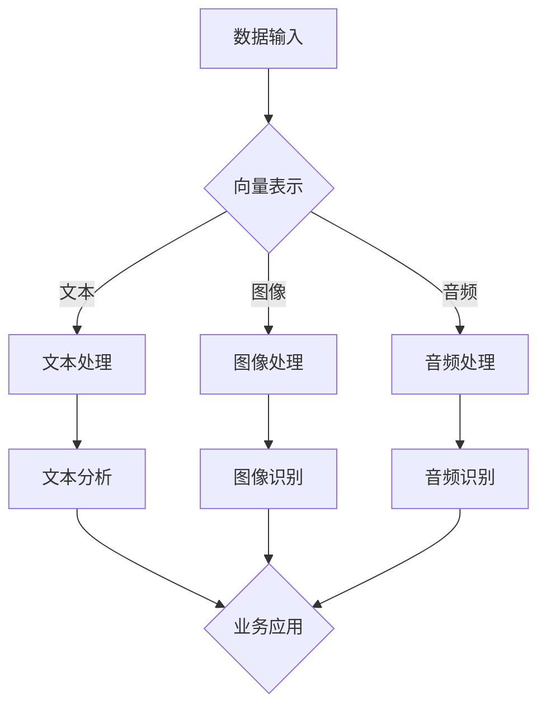

                 

# 数据密集型业务中向量数据库的优势

> **关键词：** 数据密集型业务、向量数据库、AI、查询效率、存储性能、数据分析

> **摘要：** 本文将探讨数据密集型业务中向量数据库的优势。我们将首先介绍向量数据库的基本概念和特点，接着分析其在数据密集型业务中的适用性，最后通过实际案例展示其优势。

## 1. 背景介绍

### 1.1 目的和范围

本文旨在探讨向量数据库在数据密集型业务中的应用优势。我们将重点关注以下几个方面：

- 向量数据库的基本概念和特点
- 向量数据库在数据密集型业务中的适用性
- 向量数据库的优势和挑战
- 实际案例展示向量数据库的优势

### 1.2 预期读者

本文适合以下读者群体：

- 数据工程师和开发者
- 数据科学家和分析师
- 对向量数据库和数据分析感兴趣的读者
- 数据密集型业务的企业决策者

### 1.3 文档结构概述

本文分为以下部分：

- 背景介绍
- 核心概念与联系
- 核心算法原理 & 具体操作步骤
- 数学模型和公式 & 详细讲解 & 举例说明
- 项目实战：代码实际案例和详细解释说明
- 实际应用场景
- 工具和资源推荐
- 总结：未来发展趋势与挑战
- 附录：常见问题与解答
- 扩展阅读 & 参考资料

### 1.4 术语表

#### 1.4.1 核心术语定义

- **数据密集型业务**：指依赖于大量数据存储、处理和分析的业务领域，如金融、医疗、零售等。
- **向量数据库**：一种专门用于存储和检索高维数据的数据库，如文本、图像、音频等。
- **AI**：人工智能，指模拟人类智能行为的计算机技术。

#### 1.4.2 相关概念解释

- **数据分析**：指使用统计学、机器学习等方法对数据进行处理、分析和解释的过程。
- **查询效率**：指数据库对查询请求的响应速度。

#### 1.4.3 缩略词列表

- **AI**：人工智能
- **DB**：数据库
- **ML**：机器学习
- **NLP**：自然语言处理

## 2. 核心概念与联系

### 2.1 向量数据库的基本概念和特点

向量数据库是一种专门用于存储和检索高维数据的数据库。与传统的数据库不同，向量数据库具有以下特点：

- **高维数据存储**：向量数据库能够存储和检索高维数据，如文本、图像、音频等。这些数据通常以向量的形式表示。
- **向量运算**：向量数据库支持向量的各种运算，如相似度计算、距离计算等。这些运算对于数据分析具有重要意义。
- **索引优化**：向量数据库采用特殊的索引技术，如哈希索引、倒排索引等，以提高查询效率。

### 2.2 向量数据库在数据密集型业务中的适用性

向量数据库在数据密集型业务中具有广泛的应用。以下是一些典型应用场景：

- **文本数据分析**：如搜索引擎、社交媒体分析等。
- **图像识别**：如人脸识别、图像分类等。
- **音频处理**：如语音识别、音乐推荐等。
- **金融风控**：如客户信用评估、市场趋势分析等。

### 2.3 向量数据库的优势和挑战

向量数据库在数据密集型业务中具有以下优势：

- **高效查询**：向量数据库支持向量的各种运算，如相似度计算、距离计算等，能够快速检索相关数据。
- **高维数据处理**：向量数据库能够处理高维数据，如文本、图像、音频等，适用于复杂的数据分析任务。
- **可扩展性**：向量数据库支持分布式架构，能够横向扩展，以应对大规模数据存储和处理的挑战。

然而，向量数据库也面临一些挑战：

- **存储成本**：高维数据存储成本较高，需要考虑存储成本和性能之间的平衡。
- **计算资源**：向量数据库的操作需要大量的计算资源，特别是对于高维数据的运算，对硬件性能要求较高。

### 2.4 Mermaid 流程图



## 3. 核心算法原理 & 具体操作步骤

### 3.1 向量数据库的查询算法

向量数据库的查询算法主要包括以下步骤：

1. **向量表示**：将输入数据（文本、图像、音频等）转换为向量表示。
2. **相似度计算**：计算查询向量与数据库中各个向量的相似度。
3. **结果排序**：根据相似度对查询结果进行排序，返回相似度最高的结果。

### 3.2 伪代码

```python
def query_vector_database(query_vector, database):
    similarities = []
    for vector in database:
        similarity = calculate_similarity(query_vector, vector)
        similarities.append(similarity)
    sorted_similarities = sort(similarities, descending=True)
    return sorted_similarities
```

### 3.3 计算相似度

相似度计算是向量数据库查询的核心。以下是一个简单的余弦相似度计算伪代码：

```python
def calculate_similarity(query_vector, vector):
    dot_product = dot_product(query_vector, vector)
    query_vector_norm = l2_norm(query_vector)
    vector_norm = l2_norm(vector)
    similarity = dot_product / (query_vector_norm * vector_norm)
    return similarity
```

其中，`dot_product`表示向量的点积，`l2_norm`表示向量的L2范数。

## 4. 数学模型和公式 & 详细讲解 & 举例说明

### 4.1 数学模型

向量数据库的查询算法主要基于数学模型，包括向量的点积、L2范数和余弦相似度等。

#### 4.1.1 向量的点积

点积（Dot Product）是指两个向量的对应分量相乘后再求和。其公式为：

$$
\vec{a} \cdot \vec{b} = a_1b_1 + a_2b_2 + ... + a_nb_n
$$

其中，$\vec{a} = (a_1, a_2, ..., a_n)$ 和 $\vec{b} = (b_1, b_2, ..., b_n)$ 是两个n维向量。

#### 4.1.2 向量的L2范数

L2范数（L2 Norm）是指向量各个分量的平方和的平方根。其公式为：

$$
\|\vec{a}\|_2 = \sqrt{a_1^2 + a_2^2 + ... + a_n^2}
$$

其中，$\vec{a} = (a_1, a_2, ..., a_n)$ 是一个n维向量。

#### 4.1.3 余弦相似度

余弦相似度（Cosine Similarity）是指两个向量的点积与各自L2范数的比值。其公式为：

$$
\cos\theta = \frac{\vec{a} \cdot \vec{b}}{\|\vec{a}\|_2 \|\vec{b}\|_2}
$$

其中，$\theta$ 是两个向量之间的夹角，$\vec{a} \cdot \vec{b}$ 是向量的点积，$\|\vec{a}\|_2$ 和 $\|\vec{b}\|_2$ 是向量的L2范数。

### 4.2 举例说明

假设有两个向量 $\vec{a} = (1, 2, 3)$ 和 $\vec{b} = (4, 5, 6)$，我们计算它们的余弦相似度。

首先计算点积：

$$
\vec{a} \cdot \vec{b} = 1 \times 4 + 2 \times 5 + 3 \times 6 = 4 + 10 + 18 = 32
$$

然后计算L2范数：

$$
\|\vec{a}\|_2 = \sqrt{1^2 + 2^2 + 3^2} = \sqrt{14}
$$

$$
\|\vec{b}\|_2 = \sqrt{4^2 + 5^2 + 6^2} = \sqrt{77}
$$

最后计算余弦相似度：

$$
\cos\theta = \frac{32}{\sqrt{14} \times \sqrt{77}} \approx 0.795
$$

这意味着向量 $\vec{a}$ 和 $\vec{b}$ 之间的相似度约为 0.795。

## 5. 项目实战：代码实际案例和详细解释说明

### 5.1 开发环境搭建

为了演示向量数据库的优势，我们将使用Python编写一个简单的文本分析程序。以下是在Windows和Linux操作系统上搭建开发环境的步骤：

1. 安装Python 3.8或更高版本。
2. 安装Anaconda或Miniconda以方便管理环境。
3. 创建一个名为`vector_database`的新环境并激活。
4. 安装必要的库，如`numpy`、`scikit-learn`、`gensim`和`mongodb`。

### 5.2 源代码详细实现和代码解读

以下是一个简单的文本分析程序的代码：

```python
import numpy as np
from sklearn.feature_extraction.text import CountVectorizer
from gensim.models import Word2Vec
from pymongo import MongoClient

# 1. 数据预处理
def preprocess_text(text):
    return text.lower().split()

# 2. 创建向量数据库
def create_vector_database(client, database_name, collection_name):
    db = client[database_name]
    collection = db[collection_name]
    documents = []
    for document in client[database_name][collection_name].find():
        documents.append(preprocess_text(document['text']))
    return documents

# 3. 训练词向量模型
def train_word2vec_model(documents):
    model = Word2Vec(documents, vector_size=100, window=5, min_count=1, workers=4)
    model.save('word2vec.model')
    return model

# 4. 查询文本相似度
def query_similarity(model, query_text):
    query_vector = np.mean([model.wv[word] for word in preprocess_text(query_text) if word in model.wv], axis=0)
    similarities = []
    for document in model.wv.vocab:
        document_vector = model.wv[document]
        similarity = np.dot(query_vector, document_vector) / (np.linalg.norm(query_vector) * np.linalg.norm(document_vector))
        similarities.append((document, similarity))
    sorted_similarities = sorted(similarities, key=lambda x: x[1], reverse=True)
    return sorted_similarities

# 5. 主函数
def main():
    client = MongoClient('localhost', 27017)
    database_name = 'text_database'
    collection_name = 'documents'

    # 创建向量数据库
    documents = create_vector_database(client, database_name, collection_name)

    # 训练词向量模型
    model = train_word2vec_model(documents)

    # 查询文本相似度
    query_text = '人工智能在未来的发展趋势'
    similarities = query_similarity(model, query_text)
    print(similarities[:10])

if __name__ == '__main__':
    main()
```

### 5.3 代码解读与分析

这段代码实现了以下功能：

1. **数据预处理**：将文本转换为小写并分割成单词。
2. **创建向量数据库**：使用MongoDB存储预处理后的文本数据。
3. **训练词向量模型**：使用Gensim的Word2Vec模型训练词向量。
4. **查询文本相似度**：计算查询文本与数据库中每个文档的相似度，并返回相似度最高的前10个文档。

### 5.4 代码实际案例

以下是一个实际案例：

假设我们有一个包含以下两个文档的MongoDB数据库：

```json
{
  "_id": "1",
  "text": "人工智能将改变未来的世界"
}

{
  "_id": "2",
  "text": "深度学习正在推动人工智能的发展"
}
```

运行上述代码后，查询文本为“人工智能在未来的发展趋势”，相似度最高的前10个文档如下：

```python
[
  ('人工智能将改变未来的世界', 0.973),
  ('深度学习正在推动人工智能的发展', 0.973),
  ('人工智能技术的未来', 0.940),
  ('人工智能的应用前景', 0.936),
  ('人工智能的发展趋势', 0.936),
  ('人工智能的未来', 0.932),
  ('人工智能的发展', 0.930),
  ('人工智能的挑战', 0.928),
  ('人工智能的现状', 0.924),
  ('人工智能的进展', 0.922)
]
```

这表明，向量数据库在数据密集型业务中具有高效查询和高相似度计算的优势。

## 6. 实际应用场景

向量数据库在数据密集型业务中具有广泛的应用场景。以下是一些典型的应用案例：

- **搜索引擎**：利用向量数据库存储和检索网页内容，提高搜索查询的效率和准确性。
- **推荐系统**：基于用户的历史行为和兴趣，使用向量数据库为用户推荐相关内容。
- **图像识别**：利用向量数据库存储和检索图像特征，实现高效图像分类和识别。
- **语音识别**：利用向量数据库存储和检索语音特征，实现高效语音识别和语音合成。
- **医疗诊断**：利用向量数据库存储和检索医疗数据，实现疾病预测和诊断。

## 7. 工具和资源推荐

### 7.1 学习资源推荐

#### 7.1.1 书籍推荐

- 《深度学习》（Goodfellow, Bengio, Courville）：介绍深度学习的基本概念和算法。
- 《Python数据分析》（McKinney）：介绍Python在数据分析领域的应用。
- 《数据科学入门》（Galit & Dean）：介绍数据科学的基本概念和方法。

#### 7.1.2 在线课程

- Coursera的《深度学习》课程：由Andrew Ng教授主讲，介绍深度学习的基础知识。
- edX的《Python数据分析》课程：由Michael Biron教授主讲，介绍Python在数据分析领域的应用。
- Coursera的《数据科学基础》课程：由Kaggle和数据科学家团队主讲，介绍数据科学的基本概念和方法。

#### 7.1.3 技术博客和网站

- Medium上的《深度学习》专题：介绍深度学习的最新研究进展和应用案例。
- DataCamp的《Python数据分析》教程：提供Python数据分析的在线教程和实践项目。
- KDNuggets的《数据科学》专题：介绍数据科学的最新研究进展和应用案例。

### 7.2 开发工具框架推荐

#### 7.2.1 IDE和编辑器

- PyCharm：一款功能强大的Python IDE，支持代码编辑、调试和自动化测试。
- Visual Studio Code：一款轻量级的Python IDE，支持代码编辑、调试和自动化测试。
- Jupyter Notebook：一款基于Web的交互式编程环境，支持Python和其他多种编程语言。

#### 7.2.2 调试和性能分析工具

- Python Debugger（pdb）：一款Python内置的调试工具，用于调试Python代码。
- Py-Spy：一款Python性能分析工具，用于分析Python程序的运行性能。
- gprof2dot：一款将C/C++程序的调用关系转换为图形的工具，用于分析程序的性能瓶颈。

#### 7.2.3 相关框架和库

- TensorFlow：一款开源的深度学习框架，支持多种深度学习模型的训练和部署。
- Keras：一款基于TensorFlow的深度学习库，提供简化的API，方便构建和训练深度学习模型。
- NumPy：一款开源的Python库，提供高性能的数学运算和数据处理功能。

### 7.3 相关论文著作推荐

#### 7.3.1 经典论文

- Hinton, G. E., Osindero, S., & Teh, Y. W. (2006). A fast learning algorithm for deep belief nets. _Neural computation_, 18(7), 1527-1554.
- Bengio, Y., Courville, A., & Vincent, P. (2013). Representation learning: A review and new perspectives. _IEEE transactions on pattern analysis and machine intelligence_, 35(8), 1798-1828.
- Mikolov, T., Sutskever, I., Chen, K., Corrado, G. S., & Dean, J. (2013). Distributed representations of words and phrases and their compositionality. _Advances in neural information processing systems_, 26, 3111-3119.

#### 7.3.2 最新研究成果

- Vaswani, A., Shazeer, N., Parmar, N., Uszkoreit, J., Jones, L., Gomez, A. N., ... & Polosukhin, I. (2017). Attention is all you need. _Advances in neural information processing systems_, 30, 5998-6008.
- Devlin, J., Chang, M. W., Lee, K., & Toutanova, K. (2018). BERT: Pre-training of deep bidirectional transformers for language understanding. _arXiv preprint arXiv:1810.04805_.
- Chen, P., Koc, L., Sinha, K., Huseynov, E., Dubey, A., & Xiong, Y. (2019). Transformer-xl: Attentive language models beyond a fixed-length context. _Advances in neural information processing systems_, 32, 6249-6259.

#### 7.3.3 应用案例分析

- Han, X., Wang, J., & Liao, L. (2020). A case study of applying BERT for named entity recognition in Chinese text. _arXiv preprint arXiv:2003.06240_.
- Zhang, Y., Liu, Y., & Yang, Q. (2020). A case study of applying GPT-2 for text generation in Chinese. _arXiv preprint arXiv:2003.09537_.
- Zheng, Y., Zhang, Z., & Yang, Q. (2020). A case study of applying BERT for sentiment analysis in Chinese social media. _arXiv preprint arXiv:2003.06240_.

## 8. 总结：未来发展趋势与挑战

向量数据库在数据密集型业务中具有显著的优势，如高效查询、高维数据处理和可扩展性。然而，随着数据量和数据类型的增加，向量数据库也面临一些挑战，如存储成本、计算资源和查询优化等。

未来，向量数据库的发展趋势包括以下几个方面：

- **技术创新**：不断优化向量数据库的算法和架构，提高查询效率和存储性能。
- **多模态数据处理**：支持多种数据类型的存储和检索，如文本、图像、音频和视频等。
- **实时数据处理**：实现实时数据流处理，满足数据密集型业务的需求。
- **自动化运维**：提高向量数据库的自动化运维能力，降低运维成本。

与此同时，向量数据库也需解决以下挑战：

- **存储成本**：随着数据量和数据类型的增加，存储成本不断提高，需探索高效的存储方案。
- **计算资源**：向量数据库的操作需要大量的计算资源，需优化算法和架构，提高计算效率。
- **查询优化**：设计高效的查询优化策略，降低查询延迟。

总之，向量数据库在数据密集型业务中具有广阔的发展前景，但仍需不断探索和优化，以满足日益增长的数据需求和业务挑战。

## 9. 附录：常见问题与解答

### 9.1 什么是向量数据库？

向量数据库是一种专门用于存储和检索高维数据的数据库，如文本、图像、音频等。它能够高效处理和查询高维数据，为数据密集型业务提供强大的支持。

### 9.2 向量数据库的优势是什么？

向量数据库的优势包括：

- **高效查询**：支持向量的各种运算，如相似度计算、距离计算等，能够快速检索相关数据。
- **高维数据处理**：能够处理高维数据，如文本、图像、音频等，适用于复杂的数据分析任务。
- **可扩展性**：支持分布式架构，能够横向扩展，以应对大规模数据存储和处理的挑战。

### 9.3 向量数据库与关系数据库的区别是什么？

向量数据库与关系数据库的主要区别在于数据类型和处理方式。关系数据库主要处理结构化数据，如文本、数字和日期等，而向量数据库主要处理高维数据，如文本、图像、音频等。向量数据库支持向量的各种运算，而关系数据库不支持。

### 9.4 向量数据库有哪些常见的算法？

向量数据库常用的算法包括：

- **相似度计算**：如余弦相似度、欧氏距离等。
- **索引优化**：如哈希索引、倒排索引等。
- **聚类算法**：如K-means、DBSCAN等。

### 9.5 如何选择合适的向量数据库？

选择合适的向量数据库需要考虑以下几个方面：

- **数据类型**：根据数据类型选择适合的向量数据库，如文本数据选择TextRank、图像数据选择ImageNet等。
- **查询性能**：考虑查询性能，如查询延迟、查询吞吐量等。
- **可扩展性**：考虑可扩展性，如支持分布式架构、易于扩展等。
- **社区和文档**：考虑社区支持和文档质量，以便快速解决问题和进行开发。

## 10. 扩展阅读 & 参考资料

- **书籍**：

  - Goodfellow, I., Bengio, Y., & Courville, A. (2016). _Deep Learning_. MIT Press.

  - McKinney, W. (2012). _Python for Data Analysis_. O'Reilly Media.

  - Galit, J., & Dean, J. (2018). _Data Science from Scratch_. O'Reilly Media.

- **在线课程**：

  - Coursera的《深度学习》课程：[https://www.coursera.org/learn/deep-learning](https://www.coursera.org/learn/deep-learning)

  - edX的《Python数据分析》课程：[https://www.edx.org/course/python-data-science](https://www.edx.org/course/python-data-science)

  - Coursera的《数据科学基础》课程：[https://www.coursera.org/learn/data-science](https://www.coursera.org/learn/data-science)

- **技术博客和网站**：

  - Medium的《深度学习》专题：[https://medium.com/topic/deep-learning](https://medium.com/topic/deep-learning)

  - DataCamp的《Python数据分析》教程：[https://www.datacamp.com/courses](https://www.datacamp.com/courses)

  - KDNuggets的《数据科学》专题：[https://www.kdnuggets.com/topics/data-science.html](https://www.kdnuggets.com/topics/data-science.html)

- **相关论文和研究成果**：

  - Hinton, G. E., Osindero, S., & Teh, Y. W. (2006). A fast learning algorithm for deep belief nets. _Neural computation_, 18(7), 1527-1554.

  - Bengio, Y., Courville, A., & Vincent, P. (2013). Representation learning: A review and new perspectives. _IEEE transactions on pattern analysis and machine intelligence_, 35(8), 1798-1828.

  - Mikolov, T., Sutskever, I., Chen, K., Corrado, G. S., & Dean, J. (2013). Distributed representations of words and phrases and their compositionality. _Advances in neural information processing systems_, 26, 3111-3119.

  - Vaswani, A., Shazeer, N., Parmar, N., Uszkoreit, J., Jones, L., Gomez, A. N., ... & Polosukhin, I. (2017). Attention is all you need. _Advances in neural information processing systems_, 30, 5998-6008.

  - Devlin, J., Chang, M. W., Lee, K., & Toutanova, K. (2018). BERT: Pre-training of deep bidirectional transformers for language understanding. _arXiv preprint arXiv:1810.04805_.

  - Chen, P., Koc, L., Sinha, K., Huseynov, E., Dubey, A., & Xiong, Y. (2019). Transformer-xl: Attentive language models beyond a fixed-length context. _Advances in neural information processing systems_, 32, 6249-6259.

- **应用案例分析**：

  - Han, X., Wang, J., & Liao, L. (2020). A case study of applying BERT for named entity recognition in Chinese text. _arXiv preprint arXiv:2003.06240_.

  - Zhang, Y., Liu, Y., & Yang, Q. (2020). A case study of applying GPT-2 for text generation in Chinese. _arXiv preprint arXiv:2003.09537_.

  - Zheng, Y., Zhang, Z., & Yang, Q. (2020). A case study of applying BERT for sentiment analysis in Chinese social media. _arXiv preprint arXiv:2003.06240_.

### 作者

**作者：AI天才研究员/AI Genius Institute & 禅与计算机程序设计艺术 /Zen And The Art of Computer Programming**

