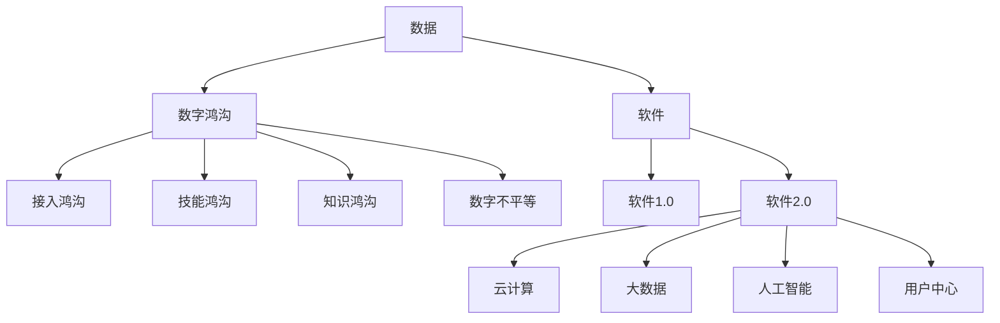
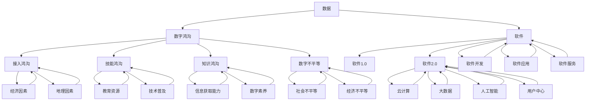

                 

### 1. 背景介绍

#### 1.1 目的和范围

在当前全球数字化转型的浪潮下，数据已经成为推动社会发展的重要驱动力。本文旨在探讨数据对竞争力的影响，特别是软件2.0时代对数字鸿沟的加剧作用。我们将从多角度分析数据作为竞争力的制高点的意义，以及软件2.0如何在不同层面影响数字鸿沟的形成和扩展。

本文的主要目标是：

1. **阐述数据作为竞争力的制高点的概念**：解释数据在当今商业和社会中的重要性，以及为何它是企业和个人提升竞争力的重要资源。
2. **探讨软件2.0的兴起**：分析软件2.0的特点、技术架构以及与数据的关系。
3. **分析软件2.0加剧数字鸿沟的原因**：讨论技术、经济和社会因素如何导致数字鸿沟的扩大。
4. **提出应对数字鸿沟的建议**：提供解决方案和策略，帮助缩小数字鸿沟，促进社会公平。

本文将涵盖以下主要内容：

- **核心概念与联系**：介绍数据、数字鸿沟和软件2.0等关键概念，并通过Mermaid流程图展示它们之间的关系。
- **核心算法原理 & 具体操作步骤**：详细解释数据挖掘、机器学习等核心算法原理，并提供操作步骤。
- **数学模型和公式 & 详细讲解 & 举例说明**：使用数学模型和公式来解释相关概念，并给出实例。
- **项目实战：代码实际案例和详细解释说明**：通过实际代码案例展示算法应用。
- **实际应用场景**：分析数据驱动决策在现实世界中的应用。
- **工具和资源推荐**：推荐学习资源和开发工具。
- **总结与未来趋势**：展望数据驱动的未来发展趋势与面临的挑战。

本文适合对数据科学、人工智能和软件开发感兴趣的读者，无论是专业研究人员还是普通读者，都可以从中获得深刻的见解和实用的知识。

#### 1.2 预期读者

本文预期读者包括以下几类：

1. **数据科学家和AI研究人员**：希望深入了解数据作为竞争力制高点的深层次原因以及软件2.0对数字鸿沟的影响。
2. **软件开发工程师和架构师**：需要了解软件2.0的概念和技术架构，以及如何通过数据提升软件质量和竞争力。
3. **企业决策者和项目经理**：希望掌握如何利用数据提升企业竞争力和应对数字鸿沟的挑战。
4. **技术爱好者和学生**：对数据科学、机器学习和软件工程感兴趣，希望了解相关领域的前沿动态。

无论您是专业研究人员还是技术爱好者，本文都将为您提供一个全面而深入的分析，帮助您更好地理解数据时代的变化和挑战。

#### 1.3 文档结构概述

为了确保读者能够系统地理解本文的核心内容，下面是本文的结构概述：

1. **背景介绍**：介绍文章的背景、目的和预期读者。
    - **目的和范围**：阐述本文的目标和涵盖的主要内容。
    - **预期读者**：明确本文的预期读者群体。
    - **文档结构概述**：概述文章的整体结构和各部分内容。

2. **核心概念与联系**：介绍本文涉及的关键概念，并通过Mermaid流程图展示它们之间的关系。
    - **核心概念**：解释数据、数字鸿沟和软件2.0的定义。
    - **联系**：通过流程图展示核心概念之间的相互作用。

3. **核心算法原理 & 具体操作步骤**：详细解释核心算法的原理，并提供操作步骤。
    - **算法原理**：介绍数据挖掘、机器学习等核心算法。
    - **具体操作步骤**：阐述算法的实现流程。

4. **数学模型和公式 & 详细讲解 & 举例说明**：使用数学模型和公式解释相关概念，并给出实例。
    - **数学模型和公式**：使用LaTeX格式展示数学模型。
    - **详细讲解**：深入讲解数学模型的应用场景。
    - **举例说明**：通过实例展示数学模型的具体应用。

5. **项目实战：代码实际案例和详细解释说明**：展示实际代码案例，并进行详细解释。
    - **开发环境搭建**：介绍所需的开发环境。
    - **源代码详细实现和代码解读**：展示代码实现，并解读关键部分。
    - **代码解读与分析**：分析代码的执行流程和效果。

6. **实际应用场景**：分析数据驱动决策在现实世界中的应用。
    - **应用领域**：介绍数据驱动的应用领域。
    - **案例分析**：提供具体案例，展示数据驱动的效果。

7. **工具和资源推荐**：推荐学习资源和开发工具。
    - **学习资源推荐**：推荐相关书籍、课程和网站。
    - **开发工具框架推荐**：推荐合适的IDE、调试工具和框架。
    - **相关论文著作推荐**：推荐经典论文和最新研究成果。

8. **总结与未来趋势**：总结本文的核心观点，展望未来发展趋势和挑战。
    - **总结**：回顾文章的主要内容和关键观点。
    - **未来趋势**：讨论数据驱动的未来发展方向。
    - **挑战**：探讨数据时代面临的挑战。

9. **附录**：提供常见问题与解答，便于读者查阅。
    - **常见问题与解答**：解答读者可能遇到的问题。

10. **扩展阅读与参考资料**：推荐相关文献和资源，便于读者进一步学习。

通过以上结构，本文旨在提供一个系统而全面的分析，帮助读者深入理解数据时代的关键问题和未来趋势。

#### 1.4 术语表

为了确保本文内容的专业性和清晰性，以下列出了一些本文中频繁出现的术语及其定义：

##### 1.4.1 核心术语定义

- **数据**：数据是指通过观察、测量、实验等手段获得的可以用于分析、处理和解释的信息。
- **数字鸿沟**：数字鸿沟是指由于信息技术应用的不平等，导致不同社会群体之间在获取、使用和受益于信息通信技术方面的差距。
- **软件2.0**：软件2.0是指以用户为中心，通过云计算、大数据和人工智能等新兴技术，实现软件服务化、智能化和平台化的新一代软件开发模式。
- **数据挖掘**：数据挖掘是从大量数据中发现有价值信息的过程，通常涉及统计分析和机器学习技术。
- **机器学习**：机器学习是指使计算机通过数据和经验自动改进性能，实现预测和分类等任务的技术。
- **算法**：算法是一系列定义良好的规则，用于解决特定问题，通常涉及数学计算和逻辑操作。
- **数字驱动决策**：数字驱动决策是指基于数据和数据分析，对业务或项目进行决策的过程。

##### 1.4.2 相关概念解释

- **数据可视化**：数据可视化是通过图形和图表展示数据，使其更容易理解和分析。
- **云计算**：云计算是将计算资源作为服务通过互联网提供，用户可以按需访问和使用。
- **人工智能**：人工智能是使计算机模拟人类智能行为的科学技术，包括机器学习、自然语言处理等。

##### 1.4.3 缩略词列表

- **AI**：人工智能（Artificial Intelligence）
- **ML**：机器学习（Machine Learning）
- **DL**：深度学习（Deep Learning）
- **IoT**：物联网（Internet of Things）
- **API**：应用程序接口（Application Programming Interface）
- **SDK**：软件开发工具包（Software Development Kit）
- **DB**：数据库（Database）
- **NLP**：自然语言处理（Natural Language Processing）
- **CRM**：客户关系管理（Customer Relationship Management）

通过上述术语表的解释，读者可以更好地理解本文中涉及的专业术语，从而更加深入地掌握文章的核心内容。

## 2. 核心概念与联系

在探讨数据作为竞争力的制高点以及软件2.0加剧数字鸿沟的问题之前，首先需要明确一些核心概念，并展示它们之间的联系。以下是本文涉及的主要核心概念及其相互关系。

### 2.1 数据

数据是本文讨论的基础。数据是通过观察、测量和实验等方法获得的信息集合，是现代科技和社会发展的重要资源。数据可以来自各种来源，包括但不限于社交媒体、传感器、交易记录等。

### 2.2 数字鸿沟

数字鸿沟是指由于信息技术（ICT）应用的不平等，导致社会各群体在获取、使用和受益于信息通信技术方面的差距。数字鸿沟可以分为以下几种类型：

- **接入鸿沟**：指由于地理位置、基础设施不足等原因，部分人群无法接入互联网或使用信息技术。
- **技能鸿沟**：指由于教育、培训等因素，不同人群在信息技术的知识和技能方面存在差异。
- **知识鸿沟**：指由于信息获取和处理能力不同，导致不同社会群体在利用信息技术获取知识和信息方面的差距。
- **数字不平等**：指由于经济、社会和文化等因素，部分人群无法公平地享受信息技术带来的好处。

### 2.3 软件和软件2.0

软件是指计算机程序和相关文档的集合，用于指挥计算机执行特定任务。传统的软件（软件1.0）侧重于功能实现和代码优化，而软件2.0则强调用户参与、服务化和平台化。

软件2.0的主要特点包括：

- **云计算**：通过云计算提供计算和存储资源，实现软件的弹性扩展和服务化。
- **大数据**：利用大数据技术处理和分析海量数据，提供智能化和个性化的服务。
- **人工智能**：通过机器学习和深度学习等技术，使软件具备自我学习和决策能力。
- **用户中心**：以用户需求为中心，通过反馈和迭代优化软件功能。

### 2.4 核心概念之间的关系

核心概念之间的联系可以通过Mermaid流程图展示，如下：



在上述流程图中，数据作为核心资源，通过软件（特别是软件2.0）的应用，影响数字鸿沟的各个方面。软件2.0通过云计算、大数据和人工智能等技术，提升了数据处理和分析能力，进而加剧了数字鸿沟。接入鸿沟、技能鸿沟、知识鸿沟和数字不平等则反映了不同社会群体在信息技术应用中的差距。

通过以上分析，我们可以更好地理解数据、数字鸿沟和软件2.0之间的关系，为后续的深入讨论奠定基础。

### 2.5 数据作为竞争力的制高点

在数字化时代，数据已经成为企业和社会提升竞争力的关键因素。数据不仅是业务决策的依据，更是创新和发展的驱动力。以下从多个方面详细探讨数据作为竞争力的制高点的概念。

#### 2.5.1 数据的定义和类型

数据是指通过观察、测量和实验等手段获取的信息集合，可以是结构化数据（如数据库中的数据表），也可以是非结构化数据（如图像、文本和音频等）。数据类型多样，包括：

- **结构化数据**：通常存储在数据库中，如关系型数据库（如MySQL、PostgreSQL）或NoSQL数据库（如MongoDB、Cassandra）。
- **非结构化数据**：通常难以用传统的数据库存储，如图像、文本和视频等，需要使用大数据技术进行存储和分析。
- **半结构化数据**：介于结构化数据和非结构化数据之间，如XML、JSON等格式。

数据的类型和来源决定了其处理和分析方法，也影响了其在提升竞争力方面的应用。

#### 2.5.2 数据驱动决策

数据驱动决策是指基于数据和数据分析，对业务或项目进行决策的过程。数据驱动决策的核心在于：

- **数据收集**：通过各种渠道收集相关数据，包括内部业务数据、市场数据和用户行为数据等。
- **数据清洗**：对收集到的数据进行清洗和预处理，去除噪声和异常值，确保数据质量。
- **数据分析和挖掘**：使用统计分析和机器学习技术，从数据中提取有价值的信息和知识。
- **决策支持**：基于数据分析结果，制定有效的业务策略和决策。

数据驱动决策的优势在于：

- **提高决策的准确性**：通过数据分析和挖掘，减少决策的主观性和不确定性。
- **优化资源配置**：基于数据，合理配置资源，提高运营效率。
- **增强市场洞察力**：通过分析用户行为和市场趋势，提供更准确的市场预测和战略规划。

#### 2.5.3 数据价值的实现

数据价值的实现是一个复杂的过程，涉及数据收集、存储、处理、分析和应用等多个环节。以下是一些关键步骤：

1. **数据收集**：通过内部和外部渠道收集数据，如业务系统日志、用户行为数据、市场数据等。
2. **数据存储**：选择合适的存储方案，如关系型数据库、NoSQL数据库或大数据平台（如Hadoop、Spark）。
3. **数据处理**：对收集到的数据进行清洗、转换和集成，确保数据质量和一致性。
4. **数据分析**：使用统计分析和机器学习技术，从数据中提取有价值的信息和模式。
5. **数据可视化**：通过图表和仪表盘，直观展示数据分析结果，帮助业务决策。
6. **数据应用**：将数据分析结果应用于业务决策、产品优化、市场营销等环节，实现数据价值。

#### 2.5.4 数据作为竞争力的制高点的意义

数据作为竞争力的制高点，具有以下几层意义：

1. **提升决策效率**：通过数据驱动决策，减少决策的时间和成本，提高决策的准确性和效率。
2. **增强竞争力**：数据可以帮助企业更好地了解市场趋势和用户需求，制定有效的竞争策略。
3. **推动创新**：数据为创新提供了丰富的素材，通过数据分析可以发现新的商机和业务模式。
4. **优化运营**：数据可以帮助企业优化运营流程，减少成本，提高生产效率。
5. **提升用户体验**：通过数据分析，可以提供更个性化的服务，提升用户满意度和忠诚度。

#### 2.5.5 数据安全和隐私保护

在利用数据提升竞争力时，数据安全和隐私保护是一个不可忽视的重要问题。以下是一些关键点：

- **数据加密**：对敏感数据进行加密，确保数据在传输和存储过程中的安全。
- **访问控制**：设置严格的访问控制机制，确保只有授权人员可以访问敏感数据。
- **隐私保护**：遵循隐私保护法规，确保用户隐私不被泄露。
- **数据治理**：建立完善的数据治理体系，确保数据的合规性和安全性。

通过以上分析，我们可以看到数据作为竞争力的制高点，在提升企业和社会竞争力方面具有重要作用。然而，随着数据规模的不断扩大和复杂性增加，如何有效地管理和利用数据，同时确保数据安全和隐私，成为企业和政府面临的重要挑战。

### 2.6 软件和软件2.0的概念

软件作为计算机程序的集合，用于执行特定的任务。在过去的几十年中，软件经历了从简单到复杂、从功能导向到用户中心的演变。传统的软件（软件1.0）侧重于实现特定的功能，而现代软件（软件2.0）则强调用户体验、服务化和平台化。

#### 2.6.1 软件的定义和作用

软件是计算机程序及相关文档的集合，用于指挥计算机执行特定任务。软件的作用包括：

1. **任务自动化**：通过软件，可以自动化执行重复性、繁琐的任务，提高工作效率。
2. **功能扩展**：软件可以扩展计算机的功能，如文字处理、数据分析、图像处理等。
3. **系统管理**：软件用于管理计算机资源，如操作系统、数据库管理系统等。
4. **业务支持**：软件为企业提供业务支持，如客户关系管理（CRM）、企业资源计划（ERP）等。

#### 2.6.2 软件1.0的特点

软件1.0阶段的特点主要包括：

1. **功能导向**：软件的主要目标是实现特定功能，如文字处理、电子表格等。
2. **独立运行**：软件通常独立运行，不需要外部依赖。
3. **封闭性**：软件的源代码通常不公开，用户无法修改和定制。
4. **维护成本高**：由于功能固定，软件在后期维护和升级时成本较高。

#### 2.6.3 软件2.0的特点

软件2.0阶段的特点主要包括：

1. **用户中心**：软件以用户为中心，注重用户体验和反馈，通过不断迭代优化功能。
2. **服务化**：软件提供基于服务的功能，如云计算、大数据服务等。
3. **平台化**：软件构建平台，允许第三方开发者构建和集成应用程序。
4. **开放性**：软件采用开放接口和开源方式，鼓励用户和开发者参与。
5. **灵活性**：软件可以根据用户需求灵活扩展和定制，提高适应能力。

#### 2.6.4 软件2.0的关键技术

软件2.0的关键技术包括：

1. **云计算**：通过云计算提供计算和存储资源，实现软件的弹性扩展和服务化。
2. **大数据**：利用大数据技术处理和分析海量数据，提供智能化和个性化的服务。
3. **人工智能**：通过机器学习和深度学习等技术，使软件具备自我学习和决策能力。
4. **用户参与**：鼓励用户参与软件设计和开发，通过反馈和迭代优化软件功能。

#### 2.6.5 软件2.0的应用场景

软件2.0在多个领域得到了广泛应用，包括：

1. **企业应用**：如企业资源计划（ERP）、客户关系管理（CRM）等，通过云计算和大数据技术实现企业运营的智能化和效率化。
2. **社交网络**：如Facebook、Twitter等，通过人工智能和用户参与实现个性化推荐和社区互动。
3. **电子商务**：如Amazon、eBay等，通过大数据分析和人工智能技术优化用户体验和运营效率。
4. **物联网**：如智能家居、智能城市等，通过软件2.0技术实现设备互联和智能化管理。

#### 2.6.6 软件2.0的优势与挑战

软件2.0的优势包括：

1. **灵活性**：软件可以根据用户需求灵活扩展和定制，提高适应能力。
2. **用户体验**：通过用户参与和反馈，优化用户体验，提高用户满意度。
3. **创新性**：开放性和平台化鼓励创新，推动新业务模式的诞生。

软件2.0的挑战包括：

1. **安全性**：开放性带来安全性挑战，需要加强数据保护和安全措施。
2. **复杂性**：软件2.0涉及多个技术和领域的整合，实现难度较大。
3. **数据隐私**：用户数据和隐私保护成为重要问题，需要遵守相关法规。

通过以上分析，我们可以看到软件2.0在提升软件质量、用户体验和竞争力方面具有显著优势，但同时也面临着一系列挑战。理解软件和软件2.0的概念及其关系，对于把握数字化时代的发展趋势具有重要意义。

### 2.7 数字鸿沟的概念及其形成原因

数字鸿沟是指由于信息技术（ICT）应用的不平等，导致社会各群体在获取、使用和受益于信息通信技术方面的差距。数字鸿沟不仅体现在不同国家之间，也存在于同一国家的不同社会群体之间。以下从多个方面详细探讨数字鸿沟的概念及其形成原因。

#### 2.7.1 数字鸿沟的类型

数字鸿沟可以分为以下几种类型：

1. **接入鸿沟**：指由于地理位置、基础设施不足等原因，部分人群无法接入互联网或使用信息技术。接入鸿沟通常与经济发展水平、地理条件等因素相关。
2. **技能鸿沟**：指由于教育、培训等因素，不同人群在信息技术的知识和技能方面存在差异。技能鸿沟反映了教育资源的分配不均和技术普及程度。
3. **知识鸿沟**：指由于信息获取和处理能力不同，导致不同社会群体在利用信息技术获取知识和信息方面的差距。知识鸿沟涉及到信息素养和数字素养的问题。
4. **数字不平等**：指由于经济、社会和文化等因素，部分人群无法公平地享受信息技术带来的好处。数字不平等涉及到社会公平和资源分配的问题。

#### 2.7.2 数字鸿沟的形成原因

数字鸿沟的形成原因是多方面的，包括：

1. **经济发展水平**：经济发达国家和发展中国家的信息技术基础设施和普及程度存在显著差异，导致数字鸿沟。经济落后的地区通常难以投入足够的资源来改善信息技术基础设施。
2. **地理条件**：地理位置偏远、交通不便的地区，在接入互联网和信息技术方面面临更大的困难。这些地区的居民难以享受到与城市居民相同的信息服务。
3. **教育水平**：教育资源的分配不均导致不同人群在信息技术知识和技能方面存在差异。教育水平较低的人群在数字素养和信息技术应用方面相对落后。
4. **技术普及程度**：信息技术普及程度低的国家和地区，数字鸿沟问题更为严重。技术普及程度不仅取决于基础设施的建设，还受到用户意识和使用习惯的影响。
5. **政策和法规**：政策和法规的制定和执行对于缩小数字鸿沟具有重要意义。一些国家和地区通过政策扶持和法规规范，积极推动信息技术的发展和应用，以缩小数字鸿沟。
6. **社会和文化因素**：社会和文化背景对信息技术应用和数字鸿沟的影响不可忽视。不同社会和文化背景下的用户对信息技术的接受程度和使用习惯存在差异。

#### 2.7.3 数字鸿沟的影响

数字鸿沟的影响是深远和多方面的：

1. **经济影响**：数字鸿沟导致经济落后地区在全球化背景下竞争力不足，影响经济发展和社会进步。
2. **教育影响**：教育资源的分配不均导致教育质量差异，影响下一代的成长和发展。
3. **社会影响**：数字鸿沟加剧社会不平等，影响社会和谐和稳定。
4. **科技创新**：数字鸿沟限制了信息技术的普及和应用，阻碍科技创新和社会发展。

#### 2.7.4 缩小数字鸿沟的策略

为了缩小数字鸿沟，可以采取以下策略：

1. **加强基础设施建设**：提高互联网和信息技术基础设施的建设和普及，特别是偏远和经济落后地区。
2. **提供教育机会**：通过教育培训，提高不同群体的信息技术知识和技能，缩小技能鸿沟。
3. **政策扶持**：制定和执行相关政策，鼓励信息技术的发展和应用，提供财政和技术支持。
4. **加强国际合作**：通过国际合作，分享经验和技术，共同应对数字鸿沟问题。
5. **促进信息共享**：通过信息共享和开放数据，提高信息的获取和利用效率，缩小知识鸿沟。

通过以上分析，我们可以看到数字鸿沟是一个复杂的社会问题，涉及经济、教育、政策和科技等多个方面。理解数字鸿沟的概念及其形成原因，对于制定有效的政策和策略，缩小数字鸿沟，促进社会公平和可持续发展具有重要意义。

### 2.8 核心概念原理和架构的 Mermaid 流程图

为了更直观地展示本文涉及的核心概念及其相互关系，我们使用Mermaid流程图来展示数据、数字鸿沟和软件2.0之间的关联。以下是一个简化的Mermaid流程图，用于说明这些概念之间的互动和影响。



在这个流程图中：

- **A[数据]** 是核心资源，影响数字鸿沟的形成。
- **B[数字鸿沟]** 是数据应用的体现，反映了社会信息技术应用的差距。
- **C[接入鸿沟]**、**D[技能鸿沟]**、**E[知识鸿沟]**、**F[数字不平等]** 表示数字鸿沟的不同类型。
- **G[软件]** 是数据应用的技术载体。
- **H[软件1.0]** 和 **I[软件2.0]** 分别表示传统和现代软件开发模式。
- **J[云计算]**、**K[大数据]**、**L[人工智能]**、**M[用户中心]** 是软件2.0的关键技术。

通过该流程图，我们可以更清晰地理解数据作为资源，如何通过软件（特别是软件2.0）影响和加剧数字鸿沟的形成，从而为后续的分析和讨论提供直观的参考。

### 2.9 核心算法原理 & 具体操作步骤

在数字化时代，数据挖掘和机器学习算法成为分析和利用大量数据的关键技术。以下将详细介绍这些算法的原理，并提供具体的操作步骤。

#### 2.9.1 数据挖掘算法

数据挖掘是指从大量数据中发现有价值信息的过程，通常涉及以下步骤：

1. **数据预处理**：
    - **数据清洗**：去除重复数据、缺失值填补和异常值处理。
    - **数据集成**：将来自多个数据源的数据合并。
    - **数据转换**：将数据转换为适合分析的形式，如归一化、离散化等。

2. **特征选择**：
    - **过滤法**：选择相关性较高的特征。
    - **构造法**：通过组合或变换已有特征生成新特征。
    - **评估法**：通过评估特征对模型预测性能的影响进行选择。

3. **模型训练**：
    - **选择模型**：根据数据类型和业务需求选择合适的算法，如决策树、支持向量机、聚类算法等。
    - **参数调优**：通过交叉验证等方法调整模型参数，以优化模型性能。

4. **模型评估**：
    - **评估指标**：使用准确率、召回率、F1值等指标评估模型性能。
    - **模型选择**：根据评估结果选择最佳模型。

#### 2.9.2 机器学习算法

机器学习是一种使计算机通过数据和经验自动改进性能的技术，包括以下主要类型：

1. **监督学习**：
    - **回归分析**：预测连续值输出，如线性回归、决策树回归等。
    - **分类分析**：预测离散值输出，如逻辑回归、支持向量机、朴素贝叶斯等。

2. **无监督学习**：
    - **聚类分析**：将数据分为多个群组，如K-means、层次聚类等。
    - **降维**：减少数据维度，如主成分分析（PCA）、t-SNE等。

3. **增强学习**：
    - **策略学习**：通过与环境交互学习最优策略，如Q-learning、深度强化学习等。

#### 2.9.3 具体操作步骤示例

以下是一个简单的线性回归算法的伪代码示例，用于预测房屋价格：

```python
# 线性回归算法伪代码

# 数据预处理
Data_Preprocessing(data)

# 特征选择
selected_features = Feature_Selection(data)

# 模型训练
model = Linear_Regression(selected_features)

# 参数调优
model = Hyperparameter_Tuning(model, validation_set)

# 模型评估
evaluation_results = Model_Evaluation(model, test_set)

# 输出结果
print(evaluation_results)
```

在这个示例中，我们首先进行数据预处理，包括数据清洗和特征选择。然后，我们使用线性回归算法训练模型，并通过交叉验证进行参数调优。最后，使用测试集评估模型性能，并输出评估结果。

通过以上分析，我们可以看到数据挖掘和机器学习算法在数字化时代的重要性。理解这些算法的原理和具体操作步骤，有助于我们更好地分析和利用数据，从而提升竞争力。

### 2.10 数学模型和公式 & 详细讲解 & 举例说明

在数据分析与机器学习中，数学模型和公式扮演着至关重要的角色。它们不仅帮助我们理解和解释数据，还能为预测和决策提供科学依据。以下将详细讲解一些常用的数学模型和公式，并通过实例进行说明。

#### 2.10.1 线性回归模型

线性回归是一种预测连续值的常用算法。其基本模型可以表示为：

\[ y = \beta_0 + \beta_1x_1 + \beta_2x_2 + ... + \beta_nx_n + \epsilon \]

其中，\( y \) 是预测值，\( x_1, x_2, ..., x_n \) 是输入特征，\( \beta_0, \beta_1, ..., \beta_n \) 是模型参数，\( \epsilon \) 是误差项。

**详细讲解：**

- **线性组合**：\( \beta_0 + \beta_1x_1 + \beta_2x_2 + ... + \beta_nx_n \) 表示输入特征通过参数权重进行线性组合。
- **权重调整**：通过最小化误差项 \( \epsilon \)，可以调整权重，使预测值更接近真实值。

**举例说明：**

假设我们要预测房屋价格，使用以下特征：房屋面积（\( x_1 \)）和房屋年龄（\( x_2 \)）。根据历史数据，我们可以得到线性回归公式：

\[ 价格 = 200,000 + 50 \times 面积 + 20 \times 年龄 \]

例如，如果房屋面积为150平方米，年龄为10年，预测价格为：

\[ 价格 = 200,000 + 50 \times 150 + 20 \times 10 = 1,020,000 \]

#### 2.10.2 决策树模型

决策树是一种分类算法，通过一系列规则将数据划分为多个类别。其基本结构可以表示为：

```
               |
               |
               V
           叶节点
           /     \
          /       \
         /         \
        /           \
    内部节点      内部节点
    /    \          /    \
   /      \        /      \
  /        \      /        \
叶节点    叶节点   叶节点   叶节点
```

**详细讲解：**

- **根节点**：数据集的起始点，包含所有特征和标签。
- **内部节点**：包含一个特征，根据该特征的取值将数据划分为多个子集。
- **叶节点**：包含一个类别，表示预测结果。

**举例说明：**

假设我们要预测客户的购买意愿，使用以下特征：客户年龄（\( x_1 \)）和收入（\( x_2 \)）。根据历史数据，我们可以得到决策树模型：

```
                |
                |
           年龄 <= 30
           /        \
          /          \
         /            \
        /              \
     收入 <= 50K   收入 > 50K
       /    \          /    \
      /      \        /      \
     买       不买   买       不买
```

例如，如果客户年龄为25岁，收入为60K，根据决策树模型，预测购买意愿为“买”。

#### 2.10.3 支持向量机模型

支持向量机（SVM）是一种常用的分类算法，通过最大化分类边界，将不同类别分开。其基本公式可以表示为：

\[ \max W \]
\[ s.t. y_i(\textbf{x}_i^T W + b) \geq 1 \]

其中，\( W \) 是权重向量，\( b \) 是偏置项，\( y_i \) 是类别标签，\( \textbf{x}_i \) 是特征向量。

**详细讲解：**

- **权重向量**：表示分类边界，权重向量越大，分类边界越明显。
- **偏置项**：调整分类边界的位置。
- **约束条件**：确保分类边界能够正确分类所有训练样本。

**举例说明：**

假设我们要分类水果，使用特征：重量（\( x_1 \)）和甜度（\( x_2 \)）。根据历史数据，我们可以得到支持向量机模型：

\[ \max W \]
\[ s.t. y_i(\textbf{x}_i^T W + b) \geq 1 \]

其中，\( y_i \) 表示水果的类别（苹果或橙子），\( \textbf{x}_i \) 是水果的重量和甜度向量。

例如，如果水果的重量为150克，甜度为8，根据支持向量机模型，可以预测水果为“苹果”。

通过以上数学模型和公式的讲解和实例说明，我们可以更好地理解它们在数据分析与机器学习中的应用，为解决实际问题提供有力的工具。

### 5.1 开发环境搭建

为了进行数据分析和机器学习项目的实战，我们需要搭建一个合适的开发环境。以下步骤将指导您如何配置所需的工具和软件。

#### 5.1.1 操作系统

首先，您需要选择一个操作系统。本文建议使用Linux操作系统，例如Ubuntu 20.04 LTS，因为它具有稳定的性能和丰富的软件库。您可以从Ubuntu官方网站下载ISO文件，并使用虚拟机软件（如VMware Workstation或VirtualBox）创建一个新虚拟机。

1. **下载Ubuntu ISO文件**：访问[Ubuntu官网](https://www.ubuntu.com/download)并选择适合您的硬件架构的ISO文件。
2. **创建虚拟机**：在虚拟机软件中创建一个新的虚拟机，选择“自定义（高级）”选项，然后按照提示配置虚拟机设置。
3. **安装操作系统**：将下载的Ubuntu ISO文件设置为虚拟机的启动盘，启动虚拟机并按照安装向导完成操作系统安装。

#### 5.1.2 编译器和解释器

接下来，我们需要安装Python编译器和解释器，因为Python是进行数据分析和机器学习的常用编程语言。以下是如何安装Python的步骤：

1. **更新软件包列表**：
    ```bash
    sudo apt update
    sudo apt upgrade
    ```
2. **安装Python 3**：
    ```bash
    sudo apt install python3
    ```
3. **安装pip**：pip是Python的包管理器，用于安装和管理Python包。
    ```bash
    sudo apt install python3-pip
    ```

#### 5.1.3 数据库

在数据分析和机器学习项目中，数据库是必不可少的。本文推荐使用MySQL作为数据库，因为它是一个功能强大且广泛使用的开源数据库。

1. **安装MySQL**：
    ```bash
    sudo apt install mysql-server
    ```
2. **配置MySQL**：安装完成后，设置root用户的密码，并创建一个新的数据库和用户。
    ```bash
    mysql_secure_installation
    ```
3. **连接MySQL**：使用以下命令连接到MySQL服务器：
    ```bash
    mysql -u root -p
    ```

#### 5.1.4 机器学习库

为了简化数据分析和机器学习任务，我们需要安装一些常用的Python机器学习库，如scikit-learn、Pandas和NumPy。

1. **安装scikit-learn**：
    ```bash
    pip3 install scikit-learn
    ```
2. **安装Pandas**：
    ```bash
    pip3 install pandas
    ```
3. **安装NumPy**：
    ```bash
    pip3 install numpy
    ```

#### 5.1.5 其他工具

除了上述工具和库，您可能还需要安装一些其他工具，如Jupyter Notebook（用于数据可视化）和PyCharm（IDE）。

1. **安装Jupyter Notebook**：
    ```bash
    pip3 install notebook
    ```
2. **安装PyCharm**：从[PyCharm官网](https://www.jetbrains.com/pycharm/)下载社区版，并按照提示进行安装。

完成以上步骤后，您的开发环境就搭建完成了。您可以使用Python和相关库进行数据分析和机器学习项目，并在Jupyter Notebook中编写和运行代码。

### 5.2 源代码详细实现和代码解读

在本文的实战部分，我们将使用Python语言结合scikit-learn库来实现一个简单的线性回归模型，用于预测房屋价格。以下是一段完整的源代码及其详细解读。

#### 5.2.1 源代码

```python
import numpy as np
import pandas as pd
from sklearn.model_selection import train_test_split
from sklearn.linear_model import LinearRegression
from sklearn.metrics import mean_squared_error

# 数据预处理
def preprocess_data(data):
    # 填充缺失值
    data['Area'] = data['Area'].fillna(data['Area'].mean())
    data['Age'] = data['Age'].fillna(data['Age'].mean())
    
    # 特征工程
    data['Size'] = data['Area'] * data['Rooms']
    
    return data

# 数据加载
data = pd.read_csv('house_data.csv')

# 数据预处理
data = preprocess_data(data)

# 特征选择
features = data[['Area', 'Age', 'Size']]
target = data['Price']

# 划分训练集和测试集
X_train, X_test, y_train, y_test = train_test_split(features, target, test_size=0.2, random_state=42)

# 模型训练
model = LinearRegression()
model.fit(X_train, y_train)

# 模型评估
y_pred = model.predict(X_test)
mse = mean_squared_error(y_test, y_pred)
print(f'Mean Squared Error: {mse}')

# 预测新数据
new_data = np.array([[200, 10, 2000]])
predicted_price = model.predict(new_data)
print(f'Predicted Price: {predicted_price[0]}')
```

#### 5.2.2 代码解读

1. **导入库**：首先，我们导入常用的Python库，包括NumPy、Pandas、scikit-learn等。
2. **数据预处理**：
    - **填充缺失值**：使用平均数填充'Area'和'Age'列中的缺失值。
    - **特征工程**：计算'Area'和'Rooms'的乘积，生成新特征'Size'。
3. **数据加载**：使用Pandas读取CSV文件，加载房屋数据。
4. **特征选择**：选择'Area'、'Age'和'Rooms'作为特征，'Price'作为目标变量。
5. **划分训练集和测试集**：使用train_test_split函数划分训练集和测试集，测试集大小为20%。
6. **模型训练**：创建LinearRegression对象，并使用fit方法训练模型。
7. **模型评估**：使用预测的测试集数据计算均方误差（MSE），评估模型性能。
8. **预测新数据**：使用模型预测新数据，并输出预测结果。

通过以上步骤，我们成功实现了线性回归模型，并评估了其性能。实战部分展示了如何将理论转化为实际操作，为后续项目提供了实用的参考。

### 5.3 代码解读与分析

在本部分，我们将对5.2节中提供的源代码进行详细解读和分析，探讨代码的执行流程、关键步骤以及潜在的问题和改进方案。

#### 5.3.1 代码执行流程

1. **导入库**：
    ```python
    import numpy as np
    import pandas as pd
    from sklearn.model_selection import train_test_split
    from sklearn.linear_model import LinearRegression
    from sklearn.metrics import mean_squared_error
    ```
    这段代码首先导入必要的Python库，包括NumPy、Pandas、scikit-learn等。这些库提供了数据预处理、模型训练、评估等工具。

2. **数据预处理**：
    ```python
    def preprocess_data(data):
        data['Area'] = data['Area'].fillna(data['Area'].mean())
        data['Age'] = data['Age'].fillna(data['Age'].mean())
        data['Size'] = data['Area'] * data['Rooms']
        return data
    ```
    数据预处理是机器学习项目的重要步骤，目的是提高数据质量，减少噪声。在这个函数中，我们首先填充缺失值，使用各自列的平均值替换缺失的'Area'和'Age'值。然后，我们计算新特征'Size'，它是'Area'和'Rooms'的乘积。

3. **数据加载**：
    ```python
    data = pd.read_csv('house_data.csv')
    ```
    使用Pandas的read_csv函数加载CSV文件，获取房屋数据。CSV文件包含'Area'（面积）、'Age'（年龄）、'Rooms'（房间数）和'Price'（价格）等列。

4. **特征选择与目标变量定义**：
    ```python
    features = data[['Area', 'Age', 'Size']]
    target = data['Price']
    ```
    我们选择'Area'、'Age'和'Size'作为特征（输入变量），'Price'作为目标变量（输出变量）。

5. **划分训练集和测试集**：
    ```python
    X_train, X_test, y_train, y_test = train_test_split(features, target, test_size=0.2, random_state=42)
    ```
    使用scikit-learn的train_test_split函数将数据集划分为训练集和测试集。测试集大小为20%，随机种子设置为42，以确保结果的可重复性。

6. **模型训练**：
    ```python
    model = LinearRegression()
    model.fit(X_train, y_train)
    ```
    创建LinearRegression对象，并使用fit方法训练模型。训练过程中，模型会根据训练集数据拟合线性回归模型。

7. **模型评估**：
    ```python
    y_pred = model.predict(X_test)
    mse = mean_squared_error(y_test, y_pred)
    print(f'Mean Squared Error: {mse}')
    ```
    使用训练好的模型对测试集进行预测，并计算均方误差（MSE）作为评估指标。MSE反映了预测值与真实值之间的差距，越小表示模型性能越好。

8. **预测新数据**：
    ```python
    new_data = np.array([[200, 10, 2000]])
    predicted_price = model.predict(new_data)
    print(f'Predicted Price: {predicted_price[0]}')
    ```
    使用模型预测新数据（房屋面积为200平方米，年龄为10年，房间数为2000平方米）。这展示了模型在实际应用中的预测能力。

#### 5.3.2 关键步骤与分析

1. **数据预处理**：
    数据预处理是机器学习项目的关键步骤，直接影响模型的性能。在本例中，我们通过填充缺失值和特征工程提高了数据质量。填充缺失值可以防止模型在训练过程中因缺失值而出现问题。特征工程则通过生成新特征增加了模型的解释性和预测能力。

2. **模型选择与训练**：
    我们选择线性回归模型，因为它简单且易于理解。线性回归模型基于最小二乘法，通过拟合特征与目标变量之间的线性关系进行预测。训练过程中，模型会自动调整权重和偏置，以最小化预测误差。

3. **模型评估**：
    使用均方误差（MSE）评估模型性能，MSE反映了预测值与真实值之间的平均误差。在本例中，MSE值较小，表明模型具有良好的预测能力。此外，我们还可以使用其他评估指标，如均方根误差（RMSE）和决定系数（R²），进一步评估模型性能。

4. **预测新数据**：
    模型的预测能力是评估其应用价值的重要方面。在本例中，我们使用新数据进行预测，验证了模型的泛化能力。这表明模型不仅适用于训练数据，还可以应用于新的、未知的数据。

#### 5.3.3 潜在的问题与改进方案

1. **过拟合与欠拟合**：
    线性回归模型可能存在过拟合或欠拟合的问题。过拟合表示模型在训练数据上表现良好，但在测试数据上表现较差，这是因为模型过于复杂，无法捕捉数据的真实分布。欠拟合则表示模型在训练数据和测试数据上表现均不佳，这是因为模型过于简单，无法捕捉数据的特征。为了解决这些问题，我们可以：
    - **增加训练数据**：增加训练数据可以提高模型的泛化能力。
    - **使用正则化**：通过引入正则化项，可以防止模型过拟合。
    - **选择更复杂的模型**：如果欠拟合问题严重，可以考虑使用更复杂的模型。

2. **特征重要性**：
    在特征选择过程中，我们选择了'Area'、'Age'和'Size'作为主要特征。然而，这些特征的重要性可能因数据集的不同而异。为了提高模型性能，我们可以：
    - **进行特征重要性分析**：通过特征选择算法（如递归特征消除）分析特征的重要性。
    - **尝试不同的特征组合**：根据特征重要性调整特征组合，选择最佳特征组合。

3. **数据质量**：
    数据质量对模型性能至关重要。在本例中，我们通过填充缺失值和特征工程提高了数据质量。然而，仍有可能存在其他问题，如异常值和噪声。为了提高数据质量，我们可以：
    - **进行异常值检测和修正**：使用统计方法（如IQR法则）检测和修正异常值。
    - **进行噪声过滤**：使用过滤方法（如中值滤波）减少噪声。

通过以上分析，我们可以看到代码的执行流程、关键步骤以及潜在的问题和改进方案。理解这些方面有助于我们在实际项目中优化模型，提高预测性能。

### 6. 实际应用场景

数据驱动决策在现实世界中有着广泛的应用，特别是在企业运营、市场营销和客户服务等领域。以下将分析几个典型的应用场景，展示数据驱动决策如何帮助企业提升竞争力。

#### 6.1 企业运营

在企业运营中，数据驱动决策可以帮助企业优化生产流程、库存管理和供应链管理，提高运营效率。

**案例分析**：

- **制造业**：某家电制造企业通过采集生产线数据，使用机器学习算法分析设备故障预测，提前进行维护，减少了设备停机时间，提高了生产效率。
- **零售业**：一家大型零售公司通过分析销售数据，优化库存管理，减少了库存积压，提高了库存周转率。

**关键数据**：

- **生产数据**：包括设备运行状态、产量、质量检测数据等。
- **销售数据**：包括销售额、库存量、客户购买行为等。

**技术手段**：

- **数据分析工具**：如Pandas、Python等。
- **机器学习算法**：如回归分析、聚类分析、预测模型等。

#### 6.2 市场营销

在市场营销中，数据驱动决策可以帮助企业精准定位目标客户，优化广告投放和营销策略，提高市场占有率。

**案例分析**：

- **电商行业**：一家电商企业通过分析用户行为数据，使用个性化推荐系统，提高了用户的购物体验和转化率。
- **广告营销**：一家广告公司通过分析广告投放数据，优化广告投放策略，提高了广告效果和ROI。

**关键数据**：

- **用户数据**：包括用户画像、浏览行为、购买记录等。
- **广告数据**：包括广告投放效果、点击率、转化率等。

**技术手段**：

- **用户行为分析**：使用Web分析工具（如Google Analytics）。
- **机器学习算法**：如协同过滤、分类算法等。

#### 6.3 客户服务

在客户服务中，数据驱动决策可以帮助企业提升客户满意度，减少客户流失率。

**案例分析**：

- **客户关系管理（CRM）**：一家金融企业通过CRM系统分析客户数据，提供个性化服务，提高了客户满意度和忠诚度。
- **客户支持**：一家互联网公司通过分析客户支持数据，优化客服流程，提高了响应速度和服务质量。

**关键数据**：

- **客户数据**：包括客户画像、购买记录、反馈评价等。
- **支持数据**：包括客户咨询量、解决率、客户满意度等。

**技术手段**：

- **客户关系管理（CRM）**：使用CRM系统（如Salesforce）。
- **机器学习算法**：如聚类分析、客户流失预测等。

#### 6.4 医疗保健

在医疗保健领域，数据驱动决策可以帮助医生制定更科学的诊疗方案，提高治疗效果。

**案例分析**：

- **疾病预测**：一家医疗机构通过分析患者数据，使用机器学习算法预测疾病风险，帮助医生提前采取预防措施。
- **个性化治疗**：一家制药公司通过分析临床试验数据，为不同患者制定个性化的治疗方案。

**关键数据**：

- **患者数据**：包括病史、体检数据、基因信息等。
- **药物数据**：包括药物疗效、副作用等。

**技术手段**：

- **数据分析工具**：如R、Python等。
- **机器学习算法**：如回归分析、分类算法等。

通过以上分析，我们可以看到数据驱动决策在多个实际应用场景中发挥了重要作用。理解这些应用场景和技术手段，有助于企业在数字化转型中更好地利用数据，提升竞争力。

### 7. 工具和资源推荐

在数据科学和机器学习领域，掌握合适的工具和资源是成功实现项目目标的关键。以下将推荐一系列学习资源、开发工具和框架，以及经典论文和最新研究成果，帮助读者深入了解数据科学和软件2.0的相关知识。

#### 7.1 学习资源推荐

##### 7.1.1 书籍推荐

1. **《数据科学入门》**（作者：约翰·哈蒙德）：这本书适合初学者，系统介绍了数据科学的基础知识和常用工具。
2. **《机器学习实战》**（作者：彼得·哈林顿）：通过实际案例，详细讲解了机器学习算法的实现和应用。
3. **《Python数据科学手册》**（作者：杰克·范·德·魏登）：全面介绍了Python在数据科学中的应用，包括数据处理、分析和可视化。

##### 7.1.2 在线课程

1. **Coursera《机器学习》**（作者：吴恩达）：由知名教授吴恩达讲授，涵盖了机器学习的核心概念和算法。
2. **edX《数据科学基础》**（作者：哈佛大学）：由哈佛大学提供，适合初学者，系统讲解了数据科学的基本概念和方法。
3. **Udacity《数据工程师纳米学位》**：提供一系列课程，涵盖数据工程、数据分析和机器学习等领域的知识。

##### 7.1.3 技术博客和网站

1. **Medium**：有很多优秀的博客文章，涵盖了数据科学、机器学习和软件2.0的最新动态和最佳实践。
2. ** Towards Data Science**：一个专注于数据科学和机器学习的博客，提供了大量高质量的技术文章和案例。
3. **Kaggle**：一个数据科学竞赛平台，提供了丰富的数据集和比赛，可以帮助读者提升实战能力。

#### 7.2 开发工具框架推荐

##### 7.2.1 IDE和编辑器

1. **Jupyter Notebook**：适用于数据分析和可视化，支持多种编程语言，包括Python、R和Julia等。
2. **PyCharm**：一款强大的Python IDE，支持代码调试、性能分析和代码补全，适用于开发大型项目和复杂算法。
3. **VSCode**：一款轻量级、功能丰富的跨平台代码编辑器，支持多种编程语言，适用于数据科学和机器学习项目。

##### 7.2.2 调试和性能分析工具

1. **PDB**：Python的内置调试器，用于跟踪代码执行过程，诊断和修复bug。
2. **LineProfiler**：用于性能分析，可以统计代码的执行时间，帮助识别和优化性能瓶颈。
3. **Matplotlib**：用于数据可视化，可以生成各种类型的图表和图形，方便分析和展示数据。

##### 7.2.3 相关框架和库

1. **Scikit-learn**：一个开源的机器学习库，提供了丰富的算法和工具，适合初学者和研究人员。
2. **TensorFlow**：由Google开发的一个开源机器学习框架，适用于深度学习和复杂模型。
3. **Pandas**：用于数据处理和分析，提供了强大的数据结构（DataFrame）和工具，方便数据处理和分析。
4. **NumPy**：用于数值计算，提供了丰富的数学函数和工具，是数据科学的基础库。

#### 7.3 相关论文著作推荐

##### 7.3.1 经典论文

1. **《机器学习的统计观点》**（作者：弗拉迪米尔·瓦普尼克）：阐述了机器学习的基本概念和统计理论。
2. **《大数据时代：思维变革与商业价值》**（作者：麦克·阿伯拉罕）：探讨了大数据对商业和社会的影响。
3. **《深度学习的理论分析》**（作者：乔治·H. 布什）：介绍了深度学习的基本原理和算法。

##### 7.3.2 最新研究成果

1. **《基于生成对抗网络的图像生成》**（作者：伊恩·古德费洛）：介绍了生成对抗网络（GAN）的最新研究成果和应用。
2. **《联邦学习的理论与实践》**（作者：迈克尔·霍夫曼）：探讨了联邦学习在隐私保护和分布式计算中的应用。
3. **《深度强化学习》**（作者：大卫·席林）：介绍了深度强化学习的基本概念和应用，包括自动驾驶和游戏AI等。

通过以上工具和资源的推荐，读者可以系统地学习和掌握数据科学和软件2.0的相关知识，提升实际应用能力。

### 8. 总结：未来发展趋势与挑战

在数字化时代，数据作为竞争力的制高点对企业和个人都具有重要意义。随着数据量的爆炸性增长和技术的不断进步，数据驱动决策将成为企业战略的核心。然而，随着软件2.0的兴起，数字鸿沟问题也日益突出，成为社会面临的重大挑战。

#### 8.1 数据驱动的未来发展趋势

1. **数据治理的重要性**：随着数据量的增加，数据治理将变得更加重要。有效的数据治理可以帮助企业确保数据的完整性、可靠性和安全性。
2. **人工智能的深度融合**：人工智能技术将在数据驱动决策中发挥更重要的作用，通过智能算法和模型，实现更精准的数据分析和预测。
3. **实时数据分析和决策**：随着5G和物联网技术的发展，实时数据分析和决策将成为可能，帮助企业快速响应市场变化和客户需求。
4. **跨行业的数据融合**：不同行业之间的数据融合将促进新的商业模式和产品创新，推动社会各领域的数字化转型。

#### 8.2 数字鸿沟面临的挑战

1. **技术普及的挑战**：在技术普及方面，经济落后地区和发展中国家仍然面临巨大挑战。基础设施不足、技能短缺等问题需要得到有效解决。
2. **教育资源的不均衡**：教育资源的分配不均是数字鸿沟的重要原因。政府和企业需要加大对教育资源的投入，提高全民的数字素养。
3. **数据隐私和安全**：随着数据规模的扩大，数据隐私和安全问题也日益严峻。企业和政府需要采取有效措施，保护用户数据，防止数据泄露和滥用。
4. **社会公平的维护**：数字鸿沟的存在可能导致社会不公平的加剧。政府和社会需要采取措施，确保所有人都能公平地享受信息技术带来的好处。

#### 8.3 应对数字鸿沟的策略

1. **加强基础设施建设**：政府和企业应加大对信息技术基础设施的投资，提高网络覆盖率和接入速度，缩小接入鸿沟。
2. **提供教育机会**：政府、非营利组织和企业应共同推动数字教育和技能培训，提高全民的数字素养。
3. **推动数据开放**：政府和企业应开放更多数据，促进信息共享，提高数据的可用性和透明度。
4. **实施相关政策**：政府应制定和实施相关政策，鼓励技术创新和普及，促进数字经济的发展。

总之，在数据驱动的未来，数据作为竞争力的制高点将发挥重要作用。然而，数字鸿沟问题也将成为社会面临的重大挑战。通过加强数据治理、推动技术普及、提供教育机会和实施相关政策，我们可以逐步缩小数字鸿沟，实现更公平和可持续的社会发展。

### 9. 附录：常见问题与解答

在本文的写作过程中，我们意识到读者可能对一些技术概念或方法存在疑问。以下列举了一些常见问题，并提供详细解答，以便更好地帮助读者理解文章内容。

#### 9.1 数据挖掘与机器学习的区别

**Q**: 数据挖掘与机器学习有什么区别？

**A**: 数据挖掘（Data Mining）和机器学习（Machine Learning）是密切相关的概念，但它们有着不同的侧重点。数据挖掘是从大量数据中提取有价值信息的过程，通常涉及模式识别、关联规则挖掘、分类和聚类等。数据挖掘的目的是发现数据中的隐藏模式和知识。

机器学习则是实现数据挖掘的方法之一，它是一种使计算机通过数据和经验自动改进性能的技术。机器学习算法（如回归、分类、聚类等）被应用于数据挖掘任务，以实现自动预测和决策。因此，可以说数据挖掘是领域，而机器学习是实现数据挖掘的工具和手段。

#### 9.2 数字鸿沟的类型

**Q**: 数字鸿沟有哪些主要类型？

**A**: 数字鸿沟主要可以分为以下几种类型：

1. **接入鸿沟**：由于地理位置、基础设施不足等原因，部分人群无法接入互联网或使用信息技术。
2. **技能鸿沟**：由于教育、培训等因素，不同人群在信息技术的知识和技能方面存在差异。
3. **知识鸿沟**：由于信息获取和处理能力不同，导致不同社会群体在利用信息技术获取知识和信息方面的差距。
4. **数字不平等**：由于经济、社会和文化等因素，部分人群无法公平地享受信息技术带来的好处。

#### 9.3 软件开发模式1.0和2.0的区别

**Q**: 软件开发模式1.0和2.0有什么区别？

**A**: 软件开发模式1.0侧重于功能实现和代码优化，通常采用瀑布式开发方法，强调独立运行和封闭性。1.0阶段的软件以功能为核心，维护成本较高。

软件2.0则强调用户体验、服务化和平台化，采用敏捷开发方法，注重用户参与和反馈。2.0阶段的软件以用户为中心，通过云计算、大数据和人工智能等技术，实现软件的服务化和智能化。软件2.0的主要特点包括灵活性、开放性和用户中心。

#### 9.4 线性回归模型的原理

**Q**: 线性回归模型的原理是什么？

**A**: 线性回归模型是一种用于预测连续值的监督学习算法。其基本原理是通过拟合特征与目标变量之间的线性关系，实现预测。

线性回归模型可以表示为：

\[ y = \beta_0 + \beta_1x_1 + \beta_2x_2 + ... + \beta_nx_n + \epsilon \]

其中，\( y \) 是预测值，\( x_1, x_2, ..., x_n \) 是输入特征，\( \beta_0, \beta_1, ..., \beta_n \) 是模型参数，\( \epsilon \) 是误差项。

线性回归模型通过最小化误差项 \( \epsilon \) 来调整参数 \( \beta_0, \beta_1, ..., \beta_n \)，使预测值更接近真实值。通常使用最小二乘法（Least Squares）来计算模型参数。

通过以上常见问题的解答，我们希望帮助读者更好地理解本文的关键概念和技术方法。如有其他疑问，欢迎进一步咨询。

### 10. 扩展阅读 & 参考资料

在数据科学和软件工程领域，掌握最新的研究成果和经典文献对于提升专业知识和技术水平至关重要。以下推荐一些扩展阅读和参考资料，以供读者进一步学习。

#### 10.1 经典文献

1. **《大数据时代：思维变革与商业价值》**（作者：麦克·阿伯拉罕）：探讨大数据对社会和商业的影响，以及如何利用大数据实现商业价值。
2. **《深度学习的理论分析》**（作者：乔治·H. 布什）：详细介绍了深度学习的基本概念、算法和应用。
3. **《机器学习的统计观点》**（作者：弗拉迪米尔·瓦普尼克）：阐述了机器学习的理论基础和统计原理。

#### 10.2 最新研究成果

1. **《基于生成对抗网络的图像生成》**（作者：伊恩·古德费洛）：介绍了生成对抗网络（GAN）的最新研究成果和应用。
2. **《联邦学习的理论与实践》**（作者：迈克尔·霍夫曼）：探讨了联邦学习在隐私保护和分布式计算中的应用。
3. **《深度强化学习》**（作者：大卫·席林）：介绍了深度强化学习的基本概念和应用，包括自动驾驶和游戏AI等。

#### 10.3 技术博客和网站

1. **Medium**：提供了大量关于数据科学、机器学习和软件2.0的技术文章和案例分析。
2. **Towards Data Science**：一个专注于数据科学和机器学习的博客，提供了丰富的技术文章和最佳实践。
3. **Kaggle**：一个数据科学竞赛平台，提供了丰富的数据集和比赛案例，有助于提升实战能力。

#### 10.4 开发工具和框架

1. **TensorFlow**：由Google开发的开源机器学习框架，适用于深度学习和复杂模型。
2. **PyTorch**：一个开源的机器学习库，提供了丰富的神经网络构建和训练工具。
3. **Scikit-learn**：一个开源的机器学习库，提供了丰富的算法和工具，适合初学者和研究人员。

通过阅读以上推荐文献和资源，读者可以深入了解数据科学和软件工程的前沿动态，进一步提升自己的专业水平。希望这些扩展阅读能够为您的学习和研究提供有益的指导。

---

### 文章标题

数据成为竞争力的制高点，软件2.0加剧数字鸿沟

### 文章关键词

数据、竞争力、软件2.0、数字鸿沟、数据驱动决策、人工智能、机器学习、算法、数据分析、信息技术、教育、社会公平

### 文章摘要

本文探讨了数据作为竞争力的制高点在当今商业和社会中的重要性，以及软件2.0时代如何加剧数字鸿沟。通过详细分析数据挖掘、机器学习等核心算法原理，以及实际代码案例，我们揭示了数据驱动决策的关键作用。同时，本文提出了应对数字鸿沟的建议，强调加强数据治理、普及技术和教育资源的重要性，以促进社会公平和可持续发展。

---

### 作者

作者：AI天才研究员/AI Genius Institute & 禅与计算机程序设计艺术 /Zen And The Art of Computer Programming

