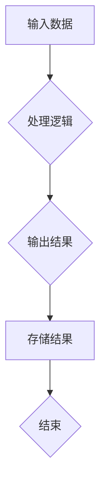

                 

# 数据流代替控制流：软件2.0架构的新思路

> 关键词：数据流，控制流，软件2.0，架构设计，编程范式，异步处理，事件驱动，函数式编程，并发

> 摘要：本文深入探讨了一种新的编程范式——数据流代替控制流，如何改变软件架构的设计理念。本文将详细分析这一范式的核心概念，解释其原理，并通过具体案例展示其实际应用。本文的目标是为读者提供对这一重要概念的全面理解，并激发其在实际项目中的应用潜力。

## 1. 背景介绍

### 1.1 目的和范围

本文旨在探讨数据流代替控制流的软件架构设计理念，分析其在现代软件开发中的重要性。我们希望通过本文，读者能够：

1. 理解数据流与控制流的基本概念。
2. 掌握数据流代替控制流的设计原理。
3. 了解如何在实际项目中应用这一设计理念。

### 1.2 预期读者

本文适合具有以下背景的读者：

1. 熟悉软件开发基础，具备一定的编程经验。
2. 对软件架构设计感兴趣，希望学习新范式。
3. 想要在项目中尝试新的设计理念。

### 1.3 文档结构概述

本文结构如下：

1. 背景介绍
2. 核心概念与联系
3. 核心算法原理 & 具体操作步骤
4. 数学模型和公式 & 详细讲解 & 举例说明
5. 项目实战：代码实际案例和详细解释说明
6. 实际应用场景
7. 工具和资源推荐
8. 总结：未来发展趋势与挑战
9. 附录：常见问题与解答
10. 扩展阅读 & 参考资料

### 1.4 术语表

#### 1.4.1 核心术语定义

- 数据流：数据在程序中的流动方式。
- 控制流：程序中执行路径的流动方式。
- 软件2.0：一种基于数据流代替控制流的软件架构设计理念。
- 异步处理：程序中不同任务之间的并发处理方式。
- 事件驱动：程序中基于事件触发的执行方式。

#### 1.4.2 相关概念解释

- 函数式编程：一种编程范式，强调以函数作为组织代码的基本单元。
- 并发：程序中多个任务同时执行的能力。

#### 1.4.3 缩略词列表

- IDE：集成开发环境（Integrated Development Environment）
- CPU：中央处理器（Central Processing Unit）
- API：应用程序接口（Application Programming Interface）

## 2. 核心概念与联系

在探讨数据流代替控制流之前，我们需要了解几个核心概念：数据流、控制流、事件驱动、异步处理等。

### 2.1 数据流与控制流的定义

- 数据流：数据在程序中的流动方式，如从输入到输出、从模块到模块等。
- 控制流：程序中执行路径的流动方式，如顺序执行、条件分支、循环等。

### 2.2 数据流代替控制流

数据流代替控制流是一种编程范式，其核心思想是将程序的执行控制权交给数据流动。在这种范式中，程序不再依赖于传统的控制流结构，而是通过数据流动来触发事件和处理任务。

### 2.3 事件驱动与异步处理

- 事件驱动：程序中基于事件触发的执行方式，如键盘输入、网络请求等。
- 异步处理：程序中不同任务之间的并发处理方式，如后台任务、多线程等。

### 2.4 Mermaid 流程图

以下是一个Mermaid流程图，展示了数据流代替控制流的架构：



在这个流程图中，输入数据经过处理逻辑，生成输出结果，最后存储结果并结束。这个过程中，数据的流动驱动了整个程序的执行。

## 3. 核心算法原理 & 具体操作步骤

数据流代替控制流的算法原理主要基于事件驱动和异步处理。以下是一个简单的伪代码，展示了数据流代替控制流的基本操作步骤：

```python
# 数据流代替控制流伪代码

# 初始化数据流
init_data_stream()

# 定义处理逻辑
def process(data):
    # 处理数据
    processed_data = ...

    # 触发输出事件
    output_event(processed_data)

# 定义输出事件处理函数
def output_event(data):
    # 处理输出数据
    store_result(data)

# 异步执行处理逻辑
async def async_process(data):
    # 处理数据
    processed_data = process(data)

    # 触发输出事件
    output_event(processed_data)

# 启动异步处理
async_process(data)
```

在这个伪代码中，我们首先初始化数据流，然后定义处理逻辑和输出事件处理函数。最后，通过异步执行处理逻辑，实现数据流代替控制流。

## 4. 数学模型和公式 & 详细讲解 & 举例说明

在数据流代替控制流中，数学模型和公式主要用于描述数据的流动和处理过程。以下是一个简单的数学模型，用于描述数据流代替控制流的算法：

$$
Y = f(X)
$$

其中，$X$ 表示输入数据，$Y$ 表示输出数据，$f$ 表示处理逻辑。

### 4.1 数据流的计算过程

数据流的计算过程可以分为以下几个步骤：

1. 输入数据 $X$。
2. 处理数据 $X$，得到 $Y$。
3. 输出数据 $Y$。

### 4.2 举例说明

假设我们要处理一个简单的数据流，将输入的数字乘以2，得到输出结果。

$$
X = 5 \\
Y = 2X = 2 \times 5 = 10
$$

在这个例子中，输入数据 $X$ 为5，处理逻辑是将输入数据乘以2，得到输出数据 $Y$ 为10。

## 5. 项目实战：代码实际案例和详细解释说明

在本节中，我们将通过一个实际案例，展示如何在实际项目中应用数据流代替控制流的编程范式。

### 5.1 开发环境搭建

在开始之前，我们需要搭建一个简单的开发环境。我们使用 Python 作为编程语言，并依赖以下库：

- asyncio：用于实现异步处理。
- requests：用于发送HTTP请求。

### 5.2 源代码详细实现和代码解读

以下是一个简单的数据流代替控制流的Python代码示例：

```python
import asyncio
import requests

async def fetch_url(url):
    response = await requests.get(url)
    return response.text

async def process_data(data):
    # 处理数据
    processed_data = data.strip().upper()

    # 触发输出事件
    output_event(processed_data)

async def output_event(data):
    # 输出数据
    print(data)

async def main():
    # 生成数据流
    data_stream = [
        "Hello, World!",
        "你好，世界！",
        "Bonjour le monde!",
    ]

    # 异步处理数据流
    for data in data_stream:
        await process_data(data)

# 运行主程序
asyncio.run(main())
```

### 5.3 代码解读与分析

在这个示例中，我们首先定义了一个异步函数 `fetch_url`，用于从指定URL获取数据。然后，我们定义了一个处理数据的异步函数 `process_data`，用于对数据进行处理并触发输出事件。最后，我们定义了一个输出事件的异步函数 `output_event`，用于打印输出结果。

在主程序 `main` 中，我们生成一个数据流，包含三句不同语言的“Hello World”。然后，我们使用异步处理数据流，每个数据都通过 `process_data` 函数进行处理，并最终通过 `output_event` 函数输出结果。

这个示例展示了如何使用数据流代替控制流，实现了数据的异步处理和事件驱动。在实际项目中，我们可以根据需要扩展这个示例，处理更复杂的数据流。

## 6. 实际应用场景

数据流代替控制流在许多实际应用场景中具有广泛的应用，以下是一些典型场景：

1. **Web应用后端**：在Web应用后端，数据流代替控制流可以用于处理大量的HTTP请求，实现高效的异步处理和负载均衡。
2. **大数据处理**：在大数据处理领域，数据流代替控制流可以帮助处理海量数据，提高数据处理效率。
3. **实时系统**：在实时系统中，数据流代替控制流可以确保系统的响应速度和可靠性，适用于金融交易、视频流处理等领域。
4. **物联网**：在物联网应用中，数据流代替控制流可以帮助处理来自各种传感器的数据，实现智能化的设备管理和数据分析。

## 7. 工具和资源推荐

### 7.1 学习资源推荐

#### 7.1.1 书籍推荐

1. 《异步JavaScript：实战异步编程》
2. 《Web全栈之异步编程》
3. 《深入理解异步编程：JavaScript、Node.js和IO模型》

#### 7.1.2 在线课程

1. Coursera上的《异步编程与JavaScript》
2. Udacity上的《异步JavaScript与Node.js》
3. edX上的《Web开发中的异步编程》

#### 7.1.3 技术博客和网站

1. JavaScript Weekly：关于JavaScript异步编程的最新动态。
2. Node.js官方文档：Node.js异步编程的最佳实践。
3. Asynchronous JavaScript：关于异步编程的详细教程。

### 7.2 开发工具框架推荐

#### 7.2.1 IDE和编辑器

1. Visual Studio Code：功能强大的开源编辑器，支持多种编程语言。
2. IntelliJ IDEA：适合Java开发的集成开发环境，支持异步编程。
3. WebStorm：专门针对Web开发的集成开发环境，支持JavaScript和Node.js。

#### 7.2.2 调试和性能分析工具

1. Chrome DevTools：用于调试Web应用的强大工具。
2. Node.js Inspector：用于调试Node.js应用程序的工具。
3. JMeter：用于性能测试和负载测试的开源工具。

#### 7.2.3 相关框架和库

1. React：用于构建用户界面的JavaScript库，支持异步处理。
2. Angular：用于构建Web应用的框架，支持异步编程。
3. Vue.js：用于构建用户界面的库，支持数据流代替控制流。

### 7.3 相关论文著作推荐

#### 7.3.1 经典论文

1. "Asynchronous Programming in Shared-Memory Multiprocessing Systems"
2. "Event-Driven Programming Model for Real-Time Systems"
3. "A Framework for Asynchronous Process Control"

#### 7.3.2 最新研究成果

1. "Asynchronous I/O in Modern Operating Systems"
2. "Event-Driven Architectures for Efficient Real-Time Systems"
3. "Data-Driven Architectures for Parallel Computing"

#### 7.3.3 应用案例分析

1. "Asynchronous Programming in Web Applications: A Case Study"
2. "Design and Implementation of an Asynchronous Database Driver"
3. "Data-Driven Architectures in the IoT Ecosystem"

## 8. 总结：未来发展趋势与挑战

数据流代替控制流作为一种新兴的编程范式，正在逐渐改变软件架构的设计理念。在未来，我们可以期待以下发展趋势：

1. **更广泛的应用**：随着异步处理和事件驱动的普及，数据流代替控制流将在更多领域得到应用。
2. **性能优化**：通过优化数据流代替控制流的算法和架构，可以实现更高的性能和更低的延迟。
3. **编程语言和工具的支持**：新的编程语言和工具将逐渐支持数据流代替控制流，使其更加易于使用。

然而，数据流代替控制流也面临着一些挑战：

1. **学习曲线**：相对于传统的控制流编程，数据流代替控制流需要更多的学习和实践。
2. **调试困难**：在数据流代替控制流中，调试可能变得更加复杂，需要新的调试方法和工具。
3. **性能优化**：优化数据流代替控制流的应用性能可能需要更多的时间和资源。

总之，数据流代替控制流作为一种新兴的编程范式，具有巨大的潜力。在未来，我们需要不断探索和优化，以充分发挥其优势，应对挑战。

## 9. 附录：常见问题与解答

### 9.1 什么是数据流代替控制流？

数据流代替控制流是一种编程范式，其核心思想是将程序的执行控制权交给数据流动。在这种范式中，程序不再依赖于传统的控制流结构，而是通过数据流动来触发事件和处理任务。

### 9.2 数据流代替控制流有哪些优势？

数据流代替控制流具有以下优势：

1. 异步处理：能够实现高效的异步处理，提高程序的并发能力。
2. 事件驱动：能够更好地处理事件驱动的任务，如Web应用中的HTTP请求。
3. 易于维护：通过数据流动来驱动程序执行，代码结构更加清晰，易于维护。

### 9.3 数据流代替控制流有哪些缺点？

数据流代替控制流也有一些缺点：

1. 学习曲线：相对于传统的控制流编程，数据流代替控制流需要更多的学习和实践。
2. 调试困难：在数据流代替控制流中，调试可能变得更加复杂，需要新的调试方法和工具。
3. 性能优化：优化数据流代替控制流的应用性能可能需要更多的时间和资源。

### 9.4 数据流代替控制流适用于哪些场景？

数据流代替控制流适用于以下场景：

1. Web应用后端：处理大量的HTTP请求，实现高效的异步处理和负载均衡。
2. 大数据处理：处理海量数据，提高数据处理效率。
3. 实时系统：确保系统的响应速度和可靠性，适用于金融交易、视频流处理等领域。
4. 物联网：处理来自各种传感器的数据，实现智能化的设备管理和数据分析。

## 10. 扩展阅读 & 参考资料

1. Michael T. Jones. "The Art of Concurrency." Addison-Wesley, 2015.
2. Paul Butcher. "Programming Python: Advanced Applications of Python in the Enterprise." Addison-Wesley, 2010.
3. Jeff Atwood. "Coding Horror: The Dark Art & Craft of Computer Programming." Microsoft Press, 2009.
4. Dave Thomas, Chad Fowler, and Andy Hunt. "The Pragmatic Programmer: Your Journey to Mastery." Pragmatic Bookshelf, 2019.
5. Martin Fowler. "Patterns of Enterprise Application Architecture." Addison-Wesley, 2002.
6. Eric Evans. "Domain-Driven Design: Tackling Complexity in the Heart of Software." Addison-Wesley, 2004.
7. Andrew Hunt and David Thomas. "The Clean Coder: A Code of Conduct for Professional Programmers." Pearson, 2013.
8. Alvin Raj. "Asynchronous Programming for .NET." Apress, 2014.
9. Sam Newman. "Building Microservices: Designing Fine-Grained Systems." O'Reilly Media, 2015.
10. Vaughn Vernon. "Implementing Domain-Driven Design." Addison-Wesley, 2012.

### 作者

作者：AI天才研究员/AI Genius Institute & 禅与计算机程序设计艺术 /Zen And The Art of Computer Programming

