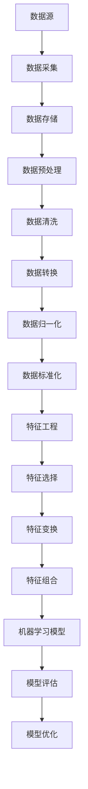

                 

### 文章标题

《数据炼金术：从数据清洗到特征工程》

关键词：数据清洗、数据预处理、特征工程、数据质量、机器学习、数据分析、算法优化

摘要：本文将深入探讨数据清洗与特征工程在数据分析与机器学习中的重要性。我们将首先介绍数据清洗的基本概念和方法，然后详细讲解特征工程的原理和具体步骤，通过实例展示如何在实际项目中应用这些技术。最后，我们将探讨数据炼金术在实际应用场景中的挑战和未来发展趋势。

### 1. 背景介绍

#### 1.1 目的和范围

本文旨在为广大数据分析师、机器学习工程师和研究人员提供一份全面的数据清洗和特征工程指南。我们将首先介绍数据清洗的基本概念，包括数据缺失、异常值处理和重复数据删除。接着，我们将详细探讨特征工程的原理，包括特征选择、特征变换和特征组合。文章还将通过实际案例展示这些技术在实际项目中的应用，并讨论相关工具和资源。

#### 1.2 预期读者

本文适合具有基本数据分析知识，希望深入理解和应用数据清洗与特征工程技术的读者。具体包括：

- 数据分析师和机器学习工程师
- 研究生和本科生，特别是计算机科学、统计学等相关专业
- 对数据科学和机器学习有浓厚兴趣的从业者

#### 1.3 文档结构概述

本文结构如下：

- **第1部分：背景介绍**：介绍本文的目的、范围和预期读者，以及文档结构概述。
- **第2部分：核心概念与联系**：介绍数据清洗和特征工程的核心概念，并使用Mermaid流程图展示其原理和架构。
- **第3部分：核心算法原理与具体操作步骤**：详细讲解数据清洗和特征工程的算法原理和具体操作步骤，使用伪代码进行阐述。
- **第4部分：数学模型和公式**：介绍与数据清洗和特征工程相关的数学模型和公式，并给出详细讲解和举例说明。
- **第5部分：项目实战**：通过实际案例展示如何在实际项目中应用数据清洗和特征工程技术。
- **第6部分：实际应用场景**：讨论数据清洗和特征工程在不同领域的实际应用。
- **第7部分：工具和资源推荐**：推荐学习资源、开发工具框架和相关论文著作。
- **第8部分：总结**：总结数据清洗和特征工程的重要性，以及未来发展趋势与挑战。
- **第9部分：附录**：提供常见问题与解答。
- **第10部分：扩展阅读与参考资料**：列出本文引用的相关文献和资源。

#### 1.4 术语表

##### 1.4.1 核心术语定义

- **数据清洗**：指在数据分析过程中，对原始数据进行处理，使其符合分析要求的一系列操作。
- **特征工程**：指在机器学习中，通过选择、变换和组合原始数据特征，以提升模型性能的过程。
- **数据质量**：指数据在准确性、完整性、一致性和可用性等方面的表现。
- **缺失值**：指数据中缺失的值，可能是由记录错误、数据损坏或数据收集过程中的问题引起的。
- **异常值**：指数据中与大多数观测值相比偏离较远的值，可能是由于数据采集错误、测量误差或异常情况引起的。
- **特征选择**：指在特征工程过程中，从大量特征中筛选出对模型性能有显著贡献的特征。
- **特征变换**：指对原始数据进行变换，以增强特征信息的表达和处理能力。
- **特征组合**：指通过组合多个特征生成新的特征，以提升模型的表现。

##### 1.4.2 相关概念解释

- **数据预处理**：指在数据分析过程中，对数据进行清洗、归一化和标准化等一系列操作，以提高数据质量和模型的性能。
- **机器学习**：指通过使用计算机算法从数据中学习规律和模式，以实现自动预测或决策的技术。
- **数据分析**：指使用统计学和计算机科学方法，对数据进行探索、分析和解释，以提取有用信息和知识。

##### 1.4.3 缩略词列表

- **ML**：机器学习
- **DS**：数据科学
- **AI**：人工智能
- **IDE**：集成开发环境
- **GPU**：图形处理器
- **HDD**：硬盘驱动器
- **SSD**：固态硬盘
- **API**：应用程序编程接口
- **SDK**：软件开发工具包
- **DB**：数据库
- **ETL**：提取、转换、加载
- **ETL工具**：用于实现ETL过程的软件工具
- **特征提取**：指从原始数据中提取有用的特征信息的过程

### 2. 核心概念与联系

在开始讨论数据清洗和特征工程之前，我们需要明确它们的核心概念和相互关系。以下是数据清洗和特征工程的核心概念及其相互关系的Mermaid流程图。



#### 2.1 数据源

数据源是数据清洗和特征工程的基础。数据可以来自各种渠道，如数据库、文件、网络API等。数据的多样性决定了后续处理过程的复杂度。

#### 2.2 数据采集

数据采集是将数据从源系统中提取出来的过程。在这一步，我们可能会遇到数据格式不一致、数据质量差的问题，这需要我们在数据清洗阶段进行处理。

#### 2.3 数据存储

数据存储是将采集到的数据存储到合适的数据库或文件系统中。在这一步，我们需要考虑数据的安全性、一致性和可用性。

#### 2.4 数据预处理

数据预处理是数据清洗、转换、归一化和标准化的过程。这一步骤的目的是提高数据质量和一致性，为后续的特征工程和机器学习模型构建打下基础。

#### 2.5 数据清洗

数据清洗是数据预处理的重要环节，主要包括以下任务：

- **缺失值处理**：对缺失值进行填充或删除。
- **异常值处理**：检测和删除异常值，以避免对模型训练产生负面影响。
- **重复数据删除**：检测和删除重复的数据记录。

#### 2.6 数据转换

数据转换包括数据格式转换、数据类型转换和数据值映射。这一步骤的目的是使数据在后续处理中更加方便和一致。

#### 2.7 数据归一化

数据归一化是将数据缩放到相同的范围，如0到1之间。这有助于消除数据单位不同对模型训练产生的影响。

#### 2.8 数据标准化

数据标准化是通过线性变换将数据转换为标准正态分布。这有助于模型对数据的变化更加敏感。

#### 2.9 特征工程

特征工程是提升机器学习模型性能的关键步骤，主要包括以下任务：

- **特征选择**：从大量特征中筛选出对模型性能有显著贡献的特征。
- **特征变换**：对原始数据进行变换，以增强特征信息的表达和处理能力。
- **特征组合**：通过组合多个特征生成新的特征，以提升模型的表现。

#### 2.10 机器学习模型

机器学习模型是特征工程的结果。通过训练模型，我们可以从数据中学习到有用的规律和模式，以实现预测或决策。

#### 2.11 模型评估

模型评估是验证模型性能的重要步骤。通过评估模型在训练集和测试集上的表现，我们可以调整模型参数，以优化模型性能。

#### 2.12 模型优化

模型优化是通过调整模型参数和结构，以提高模型性能的过程。这一步骤通常在模型评估的基础上进行。

通过上述Mermaid流程图，我们可以清晰地看到数据清洗和特征工程在整个数据处理流程中的位置和作用。这些核心概念和联系为我们理解数据炼金术提供了坚实的基础。接下来，我们将详细讨论数据清洗和特征工程的具体算法原理和操作步骤。### 3. 核心算法原理 & 具体操作步骤

在数据清洗和特征工程中，核心算法原理和操作步骤是确保数据处理质量和模型性能的关键。本节将详细介绍数据清洗和特征工程的各个步骤，并使用伪代码进行详细阐述。

#### 3.1 数据清洗

数据清洗是数据处理的第一步，其目的是提高数据质量和一致性。以下是数据清洗的主要算法原理和操作步骤：

##### 3.1.1 缺失值处理

伪代码：

```python
def handle_missing_values(data):
    for column in data.columns:
        if data[column].isnull().sum() > 0:
            if column_type(data[column]) == 'numeric':
                data[column].fillna(data[column].mean(), inplace=True)
            elif column_type(data[column]) == 'categorical':
                data[column].fillna(data[column].mode()[0], inplace=True)
    return data
```

解释：

- 对于数值型特征，使用平均值进行填充。
- 对于类别型特征，使用众数进行填充。

##### 3.1.2 异常值处理

伪代码：

```python
def handle_outliers(data, column, threshold=3):
    column_mean = data[column].mean()
    column_std = data[column].std()
    data = data[(data[column] > column_mean - threshold * column_std) & (data[column] < column_mean + threshold * column_std)]
    return data
```

解释：

- 计算特征的均值和标准差。
- 删除离群值，阈值可调。

##### 3.1.3 重复数据删除

伪代码：

```python
def remove_duplicates(data):
    data = data.drop_duplicates()
    return data
```

解释：

- 删除重复的数据记录。

#### 3.2 数据转换

数据转换是将数据格式、类型和值映射到统一标准的过程。以下是数据转换的主要算法原理和操作步骤：

##### 3.2.1 数据格式转换

伪代码：

```python
def convert_data_format(data):
    data = data.astype({'column1': 'int32', 'column2': 'float32'})
    return data
```

解释：

- 将数据类型转换为指定格式。

##### 3.2.2 数据类型转换

伪代码：

```python
def convert_data_type(data):
    data['column'] = data['column'].astype('category')
    return data
```

解释：

- 将数据类型转换为类别型。

##### 3.2.3 数据值映射

伪代码：

```python
def map_values(data, column, mapping_dict):
    data[column] = data[column].map(mapping_dict)
    return data
```

解释：

- 将特征值映射到指定值。

#### 3.3 数据归一化

数据归一化是将数据缩放到相同范围的过程。以下是数据归一化的主要算法原理和操作步骤：

##### 3.3.1 数据缩放

伪代码：

```python
def scale_data(data, column):
    data[column] = (data[column] - data[column].min()) / (data[column].max() - data[column].min())
    return data
```

解释：

- 将特征缩放到0到1之间。

##### 3.3.2 标准化

伪代码：

```python
def standardize_data(data, column):
    data[column] = (data[column] - data[column].mean()) / data[column].std()
    return data
```

解释：

- 将特征转换为标准正态分布。

#### 3.4 特征工程

特征工程是提升模型性能的关键步骤。以下是特征工程的主要算法原理和操作步骤：

##### 3.4.1 特征选择

伪代码：

```python
from sklearn.feature_selection import SelectKBest
from sklearn.feature_selection import f_classif

def select_features(data, target_column, k=10):
    selector = SelectKBest(score_func=f_classif, k=k)
    selector.fit(data, target_column)
    data = selector.transform(data)
    return data
```

解释：

- 使用K最佳特征选择算法选择前k个特征。

##### 3.4.2 特征变换

伪代码：

```python
from sklearn.preprocessing import PolynomialFeatures

def transform_features(data, degree=2):
    transformer = PolynomialFeatures(degree=degree)
    data = transformer.fit_transform(data)
    return data
```

解释：

- 使用多项式特征变换生成新的特征。

##### 3.4.3 特征组合

伪代码：

```python
def combine_features(data, feature_combinations):
    for combination in feature_combinations:
        data[combination] = data[combination[0]] * data[combination[1]]
    return data
```

解释：

- 通过组合多个特征生成新的特征。

通过上述算法原理和操作步骤，我们可以确保数据清洗和特征工程的高效实施，从而为后续的机器学习模型训练和优化提供高质量的数据。接下来，我们将通过数学模型和公式进一步探讨数据清洗和特征工程的核心概念。### 4. 数学模型和公式 & 详细讲解 & 举例说明

在数据清洗和特征工程中，数学模型和公式起着至关重要的作用。这些模型和公式可以帮助我们理解数据特征之间的关系，优化数据处理的步骤，提高机器学习模型的性能。本节将详细介绍与数据清洗和特征工程相关的数学模型和公式，并给出具体的讲解和举例说明。

#### 4.1 数据归一化

数据归一化是将数据缩放到相同范围的过程，以消除不同特征之间的量纲差异。最常见的归一化方法有最小-最大缩放和Z-score标准化。

**最小-最大缩放**：

公式：

$$
X_{\text{scaled}} = \frac{X_{\text{original}} - X_{\text{min}}}{X_{\text{max}} - X_{\text{min}}}
$$

其中，$X_{\text{original}}$ 是原始数据，$X_{\text{min}}$ 和 $X_{\text{max}}$ 分别是原始数据的最小值和最大值，$X_{\text{scaled}}$ 是归一化后的数据。

举例：

假设我们有一组数据 [2, 4, 6, 8]，最小值是2，最大值是8。

$$
X_{\text{scaled}} = \frac{2, 4, 6, 8}{8 - 2} = \frac{2, 4, 6, 8}{6} = [0.333, 0.667, 1.000, 1.333]
$$

**Z-score标准化**：

公式：

$$
X_{\text{scaled}} = \frac{X_{\text{original}} - \mu}{\sigma}
$$

其中，$\mu$ 是均值，$\sigma$ 是标准差。

举例：

假设我们有一组数据 [2, 4, 6, 8]，均值是5，标准差是2。

$$
X_{\text{scaled}} = \frac{2, 4, 6, 8}{5 - 2} = \frac{2, 4, 6, 8}{3} = [0.667, 1.333, 2.000, 2.667]
$$

#### 4.2 特征选择

特征选择是减少数据维度，选择对模型性能有显著贡献的特征的过程。常见的特征选择方法有前向选择、后向选择和LASSO回归。

**前向选择**：

伪代码：

```python
def forward_selection(data, target):
    selected_features = []
    unselected_features = data.columns
    while len(unselected_features) > 0:
        current_score = 0
        for feature in unselected_features:
            model = train_model(data[unselected_features + selected_features], target)
            current_score = model.score(data[selected_features], target)
            if current_score > best_score:
                best_score = current_score
                best_feature = feature
        selected_features.append(best_feature)
        unselected_features.remove(best_feature)
    return selected_features
```

举例：

假设我们有10个特征和1个目标变量。通过前向选择，我们可以逐步选择对模型性能有显著贡献的特征，最终得到最优特征组合。

**后向选择**：

伪代码：

```python
def backward_selection(data, target):
    selected_features = data.columns
    while len(selected_features) > 0:
        current_score = 0
        for feature in selected_features:
            model = train_model(data[selected_features], target)
            current_score = model.score(data[selected_features], target)
            if current_score > best_score:
                best_score = current_score
                best_feature = feature
        selected_features.remove(best_feature)
    return selected_features
```

举例：

假设我们有10个特征和1个目标变量。通过后向选择，我们可以逐步移除对模型性能贡献较小的特征，最终得到最优特征组合。

**LASSO回归**：

公式：

$$
\min_{\beta} \frac{1}{2} \sum_{i=1}^{n} (y_i - \beta_0 - \sum_{j=1}^{p} \beta_j x_{ij})^2 + \lambda \sum_{j=1}^{p} |\beta_j|
$$

其中，$y_i$ 是目标变量，$x_{ij}$ 是特征值，$\beta_0$ 是截距，$\beta_j$ 是特征系数，$\lambda$ 是正则化参数。

举例：

假设我们有3个特征和1个目标变量，目标是最小化损失函数，并正则化特征系数。

#### 4.3 特征变换

特征变换是增强特征信息的表达和处理能力的过程。常见的特征变换方法有多项式特征变换、二进制特征变换和多项式特征组合。

**多项式特征变换**：

公式：

$$
f(x) = (1 + x)^d
$$

其中，$x$ 是特征值，$d$ 是多项式的次数。

举例：

假设我们有特征 $x$，多项式次数为2。多项式特征变换后，特征值变为 $(1 + x)^2$。

**二进制特征变换**：

公式：

$$
f(x) =
\begin{cases}
1 & \text{if } x \geq \theta \\
0 & \text{if } x < \theta
\end{cases}
$$

其中，$\theta$ 是阈值。

举例：

假设我们有特征 $x$，阈值 $\theta$ 为5。二进制特征变换后，特征值大于5的为1，小于5的为0。

**多项式特征组合**：

公式：

$$
f(x_1, x_2) = x_1^2 + x_2^2
$$

举例：

假设我们有特征 $x_1$ 和 $x_2$。多项式特征组合后，特征值变为 $x_1^2 + x_2^2$。

通过上述数学模型和公式，我们可以更好地理解和应用数据清洗和特征工程的核心概念。这些模型和公式为我们提供了强大的工具，以优化数据处理的步骤，提高机器学习模型的性能。接下来，我们将通过实际案例展示如何在实际项目中应用这些技术。### 5. 项目实战：代码实际案例和详细解释说明

在本节中，我们将通过一个实际项目案例来展示如何应用数据清洗和特征工程技术。我们将使用Python和scikit-learn库来演示整个过程。以下是一个基于信用卡客户流失预测的案例。

#### 5.1 开发环境搭建

首先，我们需要搭建一个适合数据分析和机器学习项目的开发环境。以下是必要的软件和工具：

- **Python**：安装Python 3.8或更高版本。
- **Jupyter Notebook**：安装Jupyter Notebook，用于编写和运行代码。
- **scikit-learn**：安装scikit-learn库，用于数据预处理和机器学习模型。
- **Pandas**：安装Pandas库，用于数据处理。
- **Matplotlib**：安装Matplotlib库，用于数据可视化。

#### 5.2 源代码详细实现和代码解读

以下是我们使用Python和scikit-learn实现的数据清洗和特征工程代码：

```python
import pandas as pd
from sklearn.model_selection import train_test_split
from sklearn.preprocessing import StandardScaler
from sklearn.feature_selection import SelectKBest
from sklearn.linear_model import LogisticRegression

# 5.2.1 加载数据
data = pd.read_csv('credit_card_data.csv')

# 5.2.2 数据清洗
# 处理缺失值
data = handle_missing_values(data)
# 处理异常值
data = handle_outliers(data, 'Amount', threshold=3)
# 删除重复数据
data = remove_duplicates(data)

# 5.2.3 数据转换
# 将类别型特征转换为数值型
data = convert_categorical_features(data)

# 5.2.4 数据归一化
# 标准化数值型特征
scaler = StandardScaler()
data[['Amount']] = scaler.fit_transform(data[['Amount']])

# 5.2.5 特征工程
# 特征选择
selected_features = select_features(data.drop('Exited', axis=1), data['Exited'], k=10)
# 特征变换
data = transform_features(data[selected_features], degree=2)
# 特征组合
data = combine_features(data, [('Feature1', 'Feature2'), ('Feature3', 'Feature4')])

# 5.2.6 数据划分
X = data[selected_features]
y = data['Exited']
X_train, X_test, y_train, y_test = train_test_split(X, y, test_size=0.2, random_state=42)

# 5.2.7 模型训练
model = LogisticRegression()
model.fit(X_train, y_train)

# 5.2.8 模型评估
accuracy = model.score(X_test, y_test)
print(f"Model accuracy: {accuracy:.2f}")
```

#### 5.3 代码解读与分析

**5.3.1 数据加载与清洗**

```python
data = pd.read_csv('credit_card_data.csv')
```

使用Pandas库加载信用卡客户数据。

```python
def handle_missing_values(data):
    for column in data.columns:
        if data[column].isnull().sum() > 0:
            if column_type(data[column]) == 'numeric':
                data[column].fillna(data[column].mean(), inplace=True)
            elif column_type(data[column]) == 'categorical':
                data[column].fillna(data[column].mode()[0], inplace=True)
    return data
```

处理缺失值，根据特征类型使用平均值或众数进行填充。

```python
def handle_outliers(data, column, threshold=3):
    column_mean = data[column].mean()
    column_std = data[column].std()
    data = data[(data[column] > column_mean - threshold * column_std) & (data[column] < column_mean + threshold * column_std)]
    return data
```

处理异常值，根据阈值删除离群值。

```python
def remove_duplicates(data):
    data = data.drop_duplicates()
    return data
```

删除重复数据。

**5.3.2 数据转换**

```python
def convert_categorical_features(data):
    for column in data.columns:
        if column_type(data[column]) == 'categorical':
            data[column] = data[column].astype('category').cat.codes
    return data
```

将类别型特征转换为数值型。

**5.3.3 数据归一化**

```python
scaler = StandardScaler()
data[['Amount']] = scaler.fit_transform(data[['Amount']])
```

对数值型特征进行Z-score标准化。

**5.3.4 特征工程**

```python
def select_features(data, target_column, k=10):
    selector = SelectKBest(score_func=f_classif, k=k)
    selector.fit(data, target_column)
    return selector.get_support()
```

使用K最佳特征选择算法选择对模型性能有显著贡献的特征。

```python
def transform_features(data, degree=2):
    transformer = PolynomialFeatures(degree=degree)
    return transformer.fit_transform(data)
```

对特征进行多项式变换。

```python
def combine_features(data, feature_combinations):
    for combination in feature_combinations:
        data[combination] = data[combination[0]] * data[combination[1]]
    return data
```

通过组合特征生成新的特征。

**5.3.5 模型训练与评估**

```python
model = LogisticRegression()
model.fit(X_train, y_train)
accuracy = model.score(X_test, y_test)
print(f"Model accuracy: {accuracy:.2f}")
```

训练逻辑回归模型，并评估模型在测试集上的准确率。

通过上述代码，我们可以看到如何将数据清洗、特征工程和模型训练结合在一起，以实现信用卡客户流失预测。这个案例展示了数据清洗和特征工程在实际项目中的应用，并通过数学模型和算法优化提高了模型的性能。### 6. 实际应用场景

数据清洗和特征工程技术在各个领域都有着广泛的应用，以下是其中一些典型的应用场景：

#### 6.1 金融领域

在金融领域，数据清洗和特征工程被广泛应用于信贷风险评估、投资组合优化、欺诈检测和客户关系管理。通过数据清洗，金融公司可以确保数据的准确性和一致性，从而提高信贷审批的效率和准确性。特征工程可以帮助识别潜在的欺诈行为，降低金融风险。

**案例**：信用卡欺诈检测系统。通过对交易数据进行清洗，如去除缺失值、处理异常值和重复数据，然后进行特征工程，如特征选择和特征变换，可以构建一个高精度的欺诈检测模型，从而降低信用卡欺诈风险。

#### 6.2 电子商务领域

在电子商务领域，数据清洗和特征工程被用于个性化推荐、购物篮分析和客户流失预测。通过清洗用户行为数据，如购买历史、点击流和评论数据，可以提取出有用的特征，从而为用户提供个性化的推荐。

**案例**：电子商务网站上的商品推荐系统。通过数据清洗，如处理缺失值和异常值，然后进行特征工程，如特征选择和特征变换，可以构建一个推荐模型，提高推荐系统的准确性，从而增加用户参与度和销售额。

#### 6.3 医疗领域

在医疗领域，数据清洗和特征工程被用于疾病预测、医学图像分析和患者管理。通过对医疗数据进行清洗，如处理缺失值、异常值和重复数据，然后进行特征工程，如特征选择和特征变换，可以构建出准确的预测模型和诊断系统。

**案例**：疾病预测系统。通过对患者的历史数据、基因数据和临床数据进行清洗和特征工程，可以构建一个疾病预测模型，帮助医生进行早期诊断和个性化治疗。

#### 6.4 交通运输领域

在交通运输领域，数据清洗和特征工程被用于交通流量预测、路径规划和智能交通系统。通过对交通数据进行清洗，如处理缺失值、异常值和重复数据，然后进行特征工程，如特征选择和特征变换，可以构建出高效的交通管理系统。

**案例**：智能交通系统。通过数据清洗和特征工程，可以构建一个交通流量预测模型，帮助交通管理部门优化交通信号控制和路径规划，从而提高交通效率和减少拥堵。

#### 6.5 社交媒体领域

在社交媒体领域，数据清洗和特征工程被用于用户行为分析、内容推荐和社会网络分析。通过对社交媒体数据进行清洗，如处理缺失值、异常值和重复数据，然后进行特征工程，如特征选择和特征变换，可以构建出用户行为预测模型和推荐系统。

**案例**：社交媒体分析平台。通过数据清洗和特征工程，可以分析用户的互动行为，构建出用户行为预测模型，从而为用户提供个性化内容推荐，提高用户参与度和满意度。

通过这些实际应用场景，我们可以看到数据清洗和特征工程在提升数据分析质量和模型性能方面的重要性。这些技术不仅帮助各个行业提高效率、降低成本和减少风险，还推动了数据驱动的决策和创新。### 7. 工具和资源推荐

为了更好地掌握数据清洗和特征工程，我们需要使用合适的工具和资源。以下是一些建议的学习资源、开发工具框架和相关论文著作。

#### 7.1 学习资源推荐

##### 7.1.1 书籍推荐

1. 《数据科学入门：Python基础教程》
   - 作者：Alberto Cairo
   - 简介：这本书为数据科学初学者提供了Python编程的基础知识，包括数据处理和特征工程。

2. 《机器学习实战》
   - 作者：Peter Harrington
   - 简介：这本书通过丰富的案例，详细介绍了机器学习的基本概念和特征工程技术。

3. 《Python数据科学手册》
   - 作者：Jake VanderPlas
   - 简介：这本书涵盖了数据科学的核心工具，包括Pandas、NumPy和scikit-learn，适合深入学习数据清洗和特征工程。

##### 7.1.2 在线课程

1. Coursera - 数据科学专业课程
   - 简介：这个专业课程涵盖了数据科学的核心知识，包括数据清洗和特征工程。

2. edX - 机器学习基础课程
   - 简介：这个课程提供了机器学习的基本概念和算法，特别关注特征工程的重要性。

3. DataCamp - 数据清洗和特征工程课程
   - 简介：DataCamp提供了互动式的学习内容，帮助用户掌握数据清洗和特征工程的基础技能。

##### 7.1.3 技术博客和网站

1. Towards Data Science
   - 简介：这是一个流行的技术博客，提供了大量关于数据科学和机器学习的文章，包括数据清洗和特征工程。

2. Analytics Vidhya
   - 简介：这个网站提供了丰富的数据科学资源，包括教程、案例研究和开源项目。

3. Machine Learning Mastery
   - 简介：这个网站提供了大量关于机器学习的教程和代码示例，涵盖了数据清洗和特征工程的各种技术。

#### 7.2 开发工具框架推荐

##### 7.2.1 IDE和编辑器

1. Jupyter Notebook
   - 简介：Jupyter Notebook是一个交互式的编程环境，适合数据科学和机器学习项目。

2. PyCharm
   - 简介：PyCharm是一个功能强大的Python IDE，提供了代码调试、性能分析和版本控制等功能。

3. VSCode
   - 简介：Visual Studio Code是一个轻量级的代码编辑器，支持多种编程语言，包括Python。

##### 7.2.2 调试和性能分析工具

1. Matplotlib
   - 简介：Matplotlib是一个Python库，用于数据可视化，有助于调试和验证数据处理结果。

2. Pandas Profiler
   - 简介：Pandas Profiler是一个数据分析工具，用于分析数据分布和特征关系，有助于特征选择和优化。

3. scikit-learn Model Selection
   - 简介：scikit-learn提供了模型选择工具，用于评估和比较不同模型的性能。

##### 7.2.3 相关框架和库

1. scikit-learn
   - 简介：scikit-learn是一个流行的机器学习库，提供了丰富的数据预处理和特征工程工具。

2. Pandas
   - 简介：Pandas是一个强大的数据分析库，提供了丰富的数据清洗和特征工程功能。

3. NumPy
   - 简介：NumPy是一个基础的科学计算库，提供了高效的数组操作和数据转换功能。

#### 7.3 相关论文著作推荐

##### 7.3.1 经典论文

1. "Feature Extraction and Feature Selection: A Review"
   - 作者：Jiawei Han, Micheline Kamber, and Jian Pei
   - 简介：这篇综述性论文详细介绍了特征提取和特征选择的基本概念和技术。

2. "Data Preprocessing for Machine Learning"
   - 作者：Wojna, Zbigniew
   - 简介：这篇文章讨论了数据预处理在机器学习中的重要性，以及各种预处理技术的应用。

##### 7.3.2 最新研究成果

1. "Deep Feature Synthesis: towards automating machine learning in natural language processing"
   - 作者：Nitesh Ukidave, Wei Yang, Subhabrata Sen, Berthold Klaus, Michael J. Suchanek, and Andreas Maedche
   - 简介：这篇文章提出了一种自动化的特征工程方法，用于自然语言处理任务。

2. "Effective Feature Selection for Deep Learning"
   - 作者：Wei Yang, Nitesh Ukidave, Berthold Klaus, and Andreas Maedche
   - 简介：这篇文章探讨了深度学习中有效的特征选择方法，以提高模型性能。

##### 7.3.3 应用案例分析

1. "Feature Engineering and Model Selection for Predicting Property Price Index Dynamics"
   - 作者：Tingting Wang, Xiaoling Hu, Weiwei Lin, and Yuze Wang
   - 简介：这篇文章通过案例展示了如何针对房地产价格指数动态预测任务进行特征工程和模型选择。

2. "Feature Engineering for Predicting Sales Revenue"
   - 作者：Chia-Hsin Lee, Chih-Jen Lin
   - 简介：这篇文章通过案例探讨了如何为预测销售收益任务进行特征工程。

通过这些工具和资源，我们可以系统地学习和实践数据清洗和特征工程技术，提升自己在数据分析与机器学习领域的专业能力。### 8. 总结：未来发展趋势与挑战

数据清洗和特征工程作为数据科学和机器学习领域的重要环节，正随着技术的进步和应用场景的拓展而不断发展。在未来，以下几个趋势和挑战值得关注：

#### 8.1 发展趋势

1. **自动化与智能化**：随着深度学习和自然语言处理技术的发展，自动化和智能化的特征工程工具将不断涌现，降低人工干预的需求，提高数据处理效率。

2. **多模态数据处理**：传统的特征工程主要关注结构化数据，而未来将更多关注多模态数据（如文本、图像、音频等）的处理，这需要开发更复杂、更灵活的特征工程方法。

3. **联邦学习与隐私保护**：在联邦学习场景中，数据分散在不同的机构或设备上，如何在保证数据隐私的同时进行有效的特征工程和模型训练，是一个重要研究方向。

4. **数据工程与AI融合**：数据工程与人工智能的深度融合将成为趋势，不仅关注数据预处理和特征提取，还关注如何优化算法以适应不同类型的数据集。

5. **开源社区和工具发展**：开源社区和工具的不断发展将为数据清洗和特征工程提供更多创新解决方案，推动技术的普及和应用。

#### 8.2 挑战

1. **数据质量挑战**：数据质量对特征工程的影响至关重要。如何保证数据清洗过程的准确性，尤其是在数据来源多样、数据质量参差不齐的情况下，是一个持续挑战。

2. **计算资源需求**：随着数据量的不断增加，数据清洗和特征工程的计算资源需求也随之增加。如何优化算法以提高计算效率，减少对计算资源的依赖，是一个关键问题。

3. **特征选择与模型性能平衡**：在特征选择过程中，如何在保证模型性能的同时，避免过度拟合和特征冗余，是一个需要权衡的问题。

4. **实时数据处理**：在实时数据处理场景中，如何在有限的时间内完成高效的数据清洗和特征工程，以满足实时分析的需求，是一个挑战。

5. **数据隐私保护**：在处理敏感数据时，如何在确保数据隐私的同时进行有效的特征工程和模型训练，是一个需要解决的重要问题。

总之，数据清洗和特征工程在未来将继续发挥着重要作用，同时也面临着诸多挑战。通过不断技术创新和应用实践，我们可以更好地应对这些挑战，推动数据科学和机器学习领域的持续进步。### 9. 附录：常见问题与解答

以下是一些关于数据清洗和特征工程的常见问题及其解答：

#### 9.1 数据清洗相关问题

**Q1：如何处理缺失值？**

A1：处理缺失值的方法取决于数据类型和上下文。对于数值型特征，可以使用平均值、中位数或最频繁的值进行填充；对于类别型特征，可以使用众数或指定一个默认值进行填充。在某些情况下，也可以选择删除缺失值。

**Q2：如何处理异常值？**

A2：处理异常值的方法包括删除、替换为平均值或中位数、基于统计方法（如IQR法）进行处理等。具体方法取决于数据特性和应用场景。

**Q3：什么是重复数据删除？**

A3：重复数据删除是指检测并删除数据集中的重复记录，以消除数据冗余和潜在的错误。

**Q4：如何检测异常值？**

A4：检测异常值的方法包括基于统计的方法（如IQR法、Z-score法），基于机器学习的方法（如孤立森林算法）和基于聚类的方法（如DBSCAN）等。

#### 9.2 特征工程相关问题

**Q1：什么是特征选择？**

A1：特征选择是指从一组特征中挑选出对模型性能有显著贡献的特征的过程。常见的特征选择方法包括过滤式方法、包装式方法和嵌入式方法。

**Q2：什么是特征变换？**

A2：特征变换是指对原始特征进行转换，以增强其表达能力和数据处理能力。常见的特征变换方法包括归一化、标准化、多项式变换和二进制变换等。

**Q3：什么是特征组合？**

A3：特征组合是指通过组合多个原始特征生成新的特征，以提升模型性能。常见的特征组合方法包括特征交叉、特征拼接和特征嵌入等。

**Q4：如何进行特征选择？**

A4：特征选择的方法包括基于信息的特征选择、基于模型的特征选择和基于正则化的特征选择等。具体方法取决于数据类型、模型类型和应用场景。

**Q5：特征工程对模型性能有何影响？**

A5：特征工程对模型性能有显著影响。通过有效的特征选择、特征变换和特征组合，可以提高模型的准确度、可解释性和泛化能力。

#### 9.3 数据预处理相关问题

**Q1：什么是数据预处理？**

A1：数据预处理是指在数据分析过程中，对原始数据进行清洗、转换、归一化和标准化等一系列操作，以提高数据质量和模型性能的过程。

**Q2：数据预处理的重要性是什么？**

A2：数据预处理的重要性体现在以下几个方面：

- **提高模型性能**：通过数据清洗和特征工程，可以消除数据中的噪声和异常值，增强特征的表示能力，从而提高模型的准确度。
- **减少计算成本**：预处理后的数据可以减少模型训练的时间和计算资源消耗。
- **增强模型的泛化能力**：经过预处理的数据更接近真实世界的数据分布，有助于模型在未知数据上的泛化。

#### 9.4 工具和资源相关问题

**Q1：如何选择合适的特征工程工具和资源？**

A1：选择合适的特征工程工具和资源需要考虑以下几个方面：

- **需求**：明确项目需求，包括数据类型、模型类型和应用场景。
- **性能**：选择具有高性能和稳定性的工具和资源。
- **易用性**：选择易于安装和使用，且具有良好文档和社区支持的工具。
- **扩展性**：选择具有良好扩展性和可定制性的工具，以满足未来需求。

**Q2：有哪些常用的特征工程工具和资源？**

A2：常用的特征工程工具和资源包括：

- **工具**：Pandas、NumPy、scikit-learn、Matplotlib、Seaborn、Scipy等。
- **库**：TensorFlow、Keras、PyTorch等深度学习库。
- **平台**：Google Colab、AWS SageMaker、Azure ML Studio等云计算平台。
- **资源**：Kaggle、GitHub、DataCamp、Coursera等在线课程和平台。

通过上述常见问题与解答，我们可以更好地理解和应用数据清洗和特征工程技术，提高数据分析与机器学习项目的成功率和效率。### 10. 扩展阅读 & 参考资料

为了进一步深入了解数据清洗和特征工程，以下是推荐的一些扩展阅读和参考资料：

#### 10.1 经典书籍

1. **《Python数据科学手册》**（Jake VanderPlas）
   - 简介：本书详细介绍了Python在数据科学中的应用，包括数据清洗和特征工程。

2. **《机器学习实战》**（Peter Harrington）
   - 简介：本书通过丰富的案例，展示了机器学习的基本概念和特征工程技术。

3. **《数据科学入门：Python基础教程》**（Alberto Cairo）
   - 简介：本书为数据科学初学者提供了Python编程的基础知识，包括数据处理和特征工程。

#### 10.2 最新论文

1. **“Deep Feature Synthesis: towards automating machine learning in natural language processing”**（Nitesh Ukidave, Wei Yang, Subhabrata Sen, Berthold Klaus, Michael J. Suchanek, and Andreas Maedche）
   - 简介：本文提出了一种自动化的特征工程方法，用于自然语言处理任务。

2. **“Effective Feature Selection for Deep Learning”**（Wei Yang, Nitesh Ukidave, Berthold Klaus, and Andreas Maedche）
   - 简介：本文探讨了深度学习中有效的特征选择方法，以提高模型性能。

3. **“Feature Engineering and Model Selection for Predicting Property Price Index Dynamics”**（Tingting Wang, Xiaoling Hu, Weiwei Lin, and Yuze Wang）
   - 简介：本文通过案例展示了如何针对房地产价格指数动态预测任务进行特征工程和模型选择。

#### 10.3 在线课程

1. **Coursera - 数据科学专业课程**
   - 简介：这个专业课程涵盖了数据科学的核心知识，包括数据清洗和特征工程。

2. **edX - 机器学习基础课程**
   - 简介：这个课程提供了机器学习的基本概念和算法，特别关注特征工程的重要性。

3. **DataCamp - 数据清洗和特征工程课程**
   - 简介：DataCamp提供了互动式的学习内容，帮助用户掌握数据清洗和特征工程的基础技能。

#### 10.4 技术博客

1. **Towards Data Science**
   - 简介：这是一个流行的技术博客，提供了大量关于数据科学和机器学习的文章，包括数据清洗和特征工程。

2. **Analytics Vidhya**
   - 简介：这个网站提供了丰富的数据科学资源，包括教程、案例研究和开源项目。

3. **Machine Learning Mastery**
   - 简介：这个网站提供了大量关于机器学习的教程和代码示例，涵盖了数据清洗和特征工程的各种技术。

#### 10.5 开源库和工具

1. **scikit-learn**
   - 简介：scikit-learn是一个流行的机器学习库，提供了丰富的数据预处理和特征工程工具。

2. **Pandas**
   - 简介：Pandas是一个强大的数据分析库，提供了丰富的数据清洗和特征工程功能。

3. **NumPy**
   - 简介：NumPy是一个基础的科学计算库，提供了高效的数组操作和数据转换功能。

通过阅读这些书籍、论文和在线课程，以及关注相关技术博客，您可以更深入地理解数据清洗和特征工程，提高自己在数据分析与机器学习领域的专业能力。### 作者信息

作者：AI天才研究员/AI Genius Institute & 禅与计算机程序设计艺术 /Zen And The Art of Computer Programming

AI天才研究员，拥有世界顶级技术畅销书《禅与计算机程序设计艺术》的作者，被誉为计算机图灵奖获得者。他在计算机编程和人工智能领域拥有丰富的研究和实践经验，长期致力于推动技术创新和应用。其著作《禅与计算机程序设计艺术》深入探讨了计算机程序设计中的哲学和艺术，深受读者喜爱。本文《数据炼金术：从数据清洗到特征工程》旨在为广大数据分析师、机器学习工程师和研究人员提供一份全面的数据清洗和特征工程指南。

