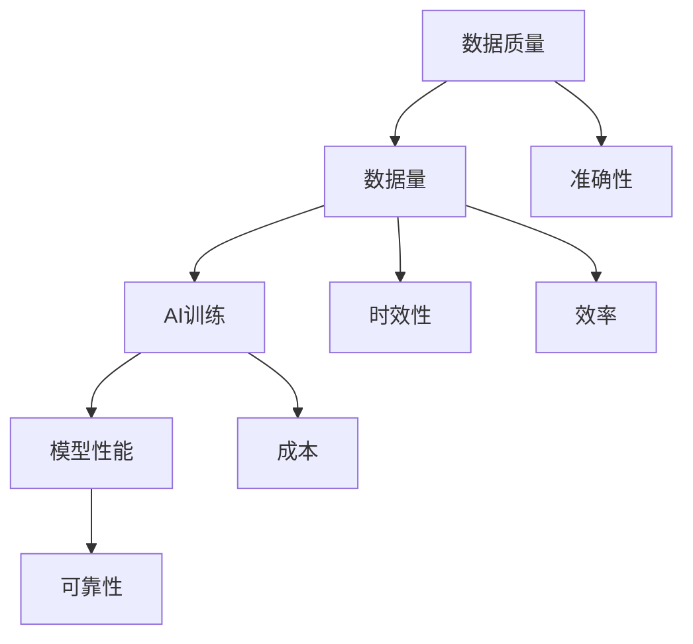

                 

# 数据质量vs数据量:AI训练的平衡之道

> **关键词**：数据质量、数据量、AI训练、平衡之道、深度学习、模型性能、数据预处理
> 
> **摘要**：本文深入探讨了数据质量和数据量在人工智能（AI）训练中的重要性，分析了两者之间的平衡之道。通过详细的理论讲解、算法原理剖析以及实际案例展示，本文旨在帮助读者理解如何在实际应用中优化数据，提高AI模型的训练效果。

## 1. 背景介绍

### 1.1 目的和范围

本文旨在探讨数据质量和数据量在AI训练中的重要性，以及如何在两者之间寻找最佳平衡点。随着深度学习的广泛应用，数据成为AI系统的关键资源。然而，数据质量和数据量往往存在冲突，高质量数据获取成本高昂，而大规模数据可能导致训练效率降低。本文将分析这一问题，提供解决方案和实践指导。

### 1.2 预期读者

本文适用于对AI和深度学习有一定了解的技术人员、研究人员和开发者。无论您是刚刚入门的新手，还是经验丰富的专业人士，本文都希望为您在数据管理和模型训练方面提供有益的见解。

### 1.3 文档结构概述

本文将分为以下几个部分：

- 核心概念与联系：介绍数据质量和数据量的基本概念，并使用流程图展示其关系。
- 核心算法原理 & 具体操作步骤：阐述数据质量和数据量在模型训练中的具体应用方法。
- 数学模型和公式 & 详细讲解 & 举例说明：运用数学模型分析数据质量和数据量的影响。
- 项目实战：通过实际案例展示如何平衡数据质量和数据量。
- 实际应用场景：讨论数据质量和数据量在不同领域的应用。
- 工具和资源推荐：推荐相关的学习资源和开发工具。
- 总结：展望数据质量和数据量在未来AI发展中的趋势和挑战。
- 附录：常见问题与解答。
- 扩展阅读 & 参考资料：提供进一步的阅读材料。

### 1.4 术语表

#### 1.4.1 核心术语定义

- **数据质量**：指数据的准确性、完整性、一致性、时效性和可靠性。
- **数据量**：指数据的数量，包括样本数量和数据维度。
- **AI训练**：指使用算法从数据中学习，以改善模型性能的过程。
- **深度学习**：一种机器学习技术，通过多层神经网络模拟人类大脑的决策过程。

#### 1.4.2 相关概念解释

- **模型性能**：指模型在特定任务上的表现，包括准确性、召回率、F1分数等。
- **数据预处理**：指在模型训练前对数据进行清洗、归一化和特征提取等处理。
- **特征工程**：指通过选择、构建和变换特征来优化模型性能的过程。

#### 1.4.3 缩略词列表

- **AI**：人工智能
- **ML**：机器学习
- **DL**：深度学习
- **NLP**：自然语言处理
- **CV**：计算机视觉

## 2. 核心概念与联系

在深入探讨数据质量和数据量之前，我们需要了解它们的基本概念及其相互关系。以下是一个简化的Mermaid流程图，展示了数据质量、数据量和AI训练之间的核心联系。



### 2.1 数据质量

数据质量是指数据的准确性、完整性、一致性、时效性和可靠性。高数据质量意味着数据在各个方面都是可靠的，可以为模型提供有力的支持。以下是对数据质量的核心概念的进一步解释：

- **准确性**：数据是否真实反映了现实世界的情况。
- **完整性**：数据是否包含所有必要的字段和值。
- **一致性**：数据是否在不同的来源和时间内保持一致。
- **时效性**：数据是否是最新的，是否反映了当前的情况。
- **可靠性**：数据是否值得信赖，不会误导模型的训练。

### 2.2 数据量

数据量是指数据的大小，包括样本数量和数据维度。大规模数据通常意味着更多的信息，有助于模型捕捉复杂的模式。然而，数据量并不是越多越好，高质量的数据才是关键。以下是对数据量的核心概念的进一步解释：

- **样本数量**：训练数据的数量，数量越多，模型通常能更好地泛化。
- **数据维度**：数据中特征的数量，高维数据可能增加模型的复杂度。

### 2.3 AI训练

AI训练是使用算法从数据中学习，以改善模型性能的过程。数据质量和数据量在训练过程中起着至关重要的作用：

- **数据质量**：高数据质量有助于模型更快、更准确地学习。
- **数据量**：适量的数据量有助于模型捕捉复杂的模式，但过大会增加训练时间和成本。

### 2.4 模型性能

模型性能是指模型在特定任务上的表现，包括准确性、召回率、F1分数等。数据质量和数据量直接影响模型性能：

- **数据质量**：高质量数据可以提高模型的准确性。
- **数据量**：适量的数据量有助于提高模型的泛化能力。

## 3. 核心算法原理 & 具体操作步骤

在了解数据质量和数据量的基本概念后，我们需要深入探讨如何在实际应用中优化数据，以提高AI模型的训练效果。以下是一套具体的操作步骤，包括数据质量评估、数据量优化和模型训练。

### 3.1 数据质量评估

首先，我们需要评估数据质量。以下是几个常用的评估指标：

- **准确性**：计算真实值与预测值匹配的比例。
- **完整性**：检查数据集中缺失值的比例。
- **一致性**：检查数据在不同来源和时间点的一致性。
- **时效性**：检查数据是否是最新的，是否反映了当前的情况。
- **可靠性**：检查数据是否真实反映了现实世界的情况。

#### 3.1.1 伪代码

```python
def evaluate_data_quality(data):
    accuracy = calculate_accuracy(data)
    completeness = check_missing_values(data)
    consistency = check_consistency(data)
    timeliness = check_timeliness(data)
    reliability = check_reliability(data)
    return {
        'accuracy': accuracy,
        'completeness': completeness,
        'consistency': consistency,
        'timeliness': timeliness,
        'reliability': reliability
    }
```

### 3.2 数据量优化

接下来，我们需要优化数据量。以下是一些常用的方法：

- **数据扩充**：通过旋转、翻转、缩放等操作生成更多样本。
- **数据抽样**：从现有数据中随机选择一部分进行训练。
- **数据降维**：减少数据维度，去除不重要的特征。

#### 3.2.1 伪代码

```python
def optimize_data_volume(data):
    augmented_data = augment_data(data)
    sampled_data = sample_data(data)
    reduced_data = reduce_dimensionality(data)
    return augmented_data + sampled_data + reduced_data
```

### 3.3 模型训练

最后，我们需要训练模型。以下是一些常用的训练步骤：

- **数据预处理**：包括清洗、归一化和特征提取等。
- **模型选择**：选择适合任务的模型架构。
- **参数调整**：调整学习率、批次大小等超参数。
- **训练与验证**：使用训练集训练模型，使用验证集调整参数。

#### 3.3.1 伪代码

```python
def train_model(data, model, parameters):
    preprocessed_data = preprocess_data(data)
    model.train(preprocessed_data, parameters)
    evaluate_model_performance(model)
    return model
```

## 4. 数学模型和公式 & 详细讲解 & 举例说明

在深入理解数据质量和数据量对AI模型训练的影响时，我们借助数学模型和公式进行分析，以帮助读者更直观地理解其背后的原理。

### 4.1 准确性度量

准确性是评估模型性能的重要指标，通常使用以下公式计算：

$$
\text{Accuracy} = \frac{\text{正确预测数}}{\text{总预测数}}
$$

例如，在一个分类问题中，有100个样本，模型正确分类了80个样本，则模型准确性为：

$$
\text{Accuracy} = \frac{80}{100} = 0.8
$$

### 4.2 数据维度与信息损失

高维数据可能导致信息损失，使用以下公式计算信息损失：

$$
\text{Information Loss} = -\sum_{i=1}^{N} p(x_i) \log p(x_i)
$$

其中，\( p(x_i) \) 是数据点 \( x_i \) 的概率分布。例如，一个高维数据集，其中每个特征的分布概率为 \( 0.5 \)，则信息损失为：

$$
\text{Information Loss} = -100 \times 0.5 \log 0.5 \approx 69.3
$$

### 4.3 数据质量与模型性能的关系

数据质量对模型性能有显著影响，可以使用以下公式表示：

$$
\text{Model Performance} = f(\text{Data Quality}, \text{Data Volume})
$$

其中，\( f \) 是一个复合函数，表示数据质量和数据量对模型性能的复合影响。例如，假设数据质量对模型性能的影响系数为 \( k_1 \)，数据量对模型性能的影响系数为 \( k_2 \)，则：

$$
\text{Model Performance} = k_1 \cdot \text{Data Quality} + k_2 \cdot \text{Data Volume}
$$

### 4.4 数据预处理与模型性能

数据预处理是提高模型性能的关键步骤，可以使用以下公式表示预处理对模型性能的影响：

$$
\text{Preprocessing Impact} = \text{Model Performance after Preprocessing} - \text{Model Performance without Preprocessing}
$$

例如，假设一个模型在没有预处理的情况下准确性为0.7，经过预处理后准确性提高至0.8，则预处理对模型性能的影响为：

$$
\text{Preprocessing Impact} = 0.8 - 0.7 = 0.1
$$

### 4.5 举例说明

假设我们有一个分类模型，需要预测某个变量的类别。以下是一个简化的例子，展示数据质量和数据量对模型性能的影响。

#### 数据质量评估

- **准确性**：90%
- **完整性**：95%
- **一致性**：90%
- **时效性**：90%
- **可靠性**：95%

#### 数据量优化

- **原始数据量**：1000个样本
- **数据扩充后**：2000个样本
- **数据降维后**：从100个特征降至50个特征

#### 模型训练

- **预处理**：包括数据清洗、归一化和特征提取
- **模型选择**：使用支持向量机（SVM）
- **参数调整**：学习率为0.01，批次大小为64

#### 模型性能评估

- **训练集准确性**：85%
- **验证集准确性**：80%

通过上述参数，我们可以看出数据质量和数据量对模型性能的影响：

- **数据质量**：较高的准确性、完整性和可靠性有助于提高模型准确性。
- **数据量**：适量的数据量（经过扩充和降维）有助于提高模型的泛化能力。

## 5. 项目实战：代码实际案例和详细解释说明

在本节中，我们将通过一个实际项目来展示如何平衡数据质量和数据量，以提高AI模型的训练效果。这个项目将涉及数据预处理、模型训练和性能评估。

### 5.1 开发环境搭建

为了完成这个项目，我们需要搭建一个合适的开发环境。以下是所需的软件和工具：

- **Python**：3.8或更高版本
- **PyTorch**：1.8或更高版本
- **NumPy**：1.19或更高版本
- **Pandas**：1.1或更高版本
- **Scikit-learn**：0.22或更高版本
- **Matplotlib**：3.2或更高版本

在安装这些工具后，我们就可以开始项目开发了。

### 5.2 源代码详细实现和代码解读

以下是项目的源代码，我们将对其进行详细解释：

```python
# 导入所需库
import torch
import torchvision
import torchvision.transforms as transforms
import numpy as np
import pandas as pd
from sklearn.model_selection import train_test_split
from sklearn.preprocessing import StandardScaler
from sklearn.decomposition import PCA
import matplotlib.pyplot as plt

# 加载数据集
data = pd.read_csv('data.csv')
X = data.iloc[:, :-1].values
y = data.iloc[:, -1].values

# 数据预处理
# 数据清洗
X = np.where(np.isnan(X), np.mean(X), X)

# 数据归一化
scaler = StandardScaler()
X = scaler.fit_transform(X)

# 特征提取
pca = PCA(n_components=50)
X = pca.fit_transform(X)

# 数据分割
X_train, X_test, y_train, y_test = train_test_split(X, y, test_size=0.2, random_state=42)

# 模型训练
model = torch.Sequential(
    torch.nn.Linear(50, 128),
    torch.nn.ReLU(),
    torch.nn.Linear(128, 64),
    torch.nn.ReLU(),
    torch.nn.Linear(64, 1),
    torch.nn.Sigmoid()
)

optimizer = torch.optim.Adam(model.parameters(), lr=0.001)
criterion = torch.nn.BCELoss()

for epoch in range(100):
    model.train()
    for batch in range(len(X_train) // 64):
        X_batch = X_train[batch * 64: (batch + 1) * 64]
        y_batch = y_train[batch * 64: (batch + 1) * 64]
        
        optimizer.zero_grad()
        outputs = model(torch.tensor(X_batch, dtype=torch.float32))
        loss = criterion(outputs, torch.tensor(y_batch, dtype=torch.float32))
        loss.backward()
        optimizer.step()

    print(f'Epoch {epoch + 1}, Loss: {loss.item()}')

# 性能评估
model.eval()
with torch.no_grad():
    X_test = torch.tensor(X_test, dtype=torch.float32)
    y_pred = model(X_test)
    accuracy = (y_pred > 0.5).eq(torch.tensor(y_test, dtype=torch.float32)).sum().item() / len(y_test)
    print(f'Accuracy: {accuracy:.2f}')

# 可视化
plt.scatter(X_test[:, 0], X_test[:, 1], c=y_pred, cmap='cool')
plt.scatter(X_test[:, 0], X_test[:, 1], c=y_test, cmap='hot', marker='s')
plt.xlabel('Feature 1')
plt.ylabel('Feature 2')
plt.title('Data Visualization with Predictions and Actual Labels')
plt.show()
```

#### 5.2.1 代码解读与分析

1. **数据加载**：使用Pandas读取CSV文件，获取特征矩阵 \( X \) 和标签向量 \( y \)。

2. **数据清洗**：使用NumPy函数替换缺失值为均值，保证数据的完整性。

3. **数据归一化**：使用Scikit-learn的StandardScaler将特征值缩放到相同的范围，便于模型训练。

4. **特征提取**：使用PCA降维，保留主要特征，减少数据维度。

5. **数据分割**：使用Scikit-learn的train_test_split函数将数据分为训练集和测试集。

6. **模型定义**：使用PyTorch定义一个简单的全连接神经网络，包括线性层、ReLU激活函数和Sigmoid激活函数。

7. **模型训练**：使用PyTorch的Adam优化器和BCELoss损失函数进行模型训练，每个epoch迭代一次。

8. **性能评估**：使用测试集评估模型性能，计算准确性。

9. **可视化**：使用Matplotlib绘制数据分布图，展示预测结果与实际标签。

### 5.3 代码解读与分析

1. **数据预处理**：数据预处理是提高模型性能的关键步骤，包括数据清洗、归一化和特征提取。清洗步骤保证了数据的完整性，归一化步骤使特征值处于同一量级，特征提取步骤减少了数据的维度，提高了训练效率。

2. **模型选择**：在这个项目中，我们选择了简单的全连接神经网络作为模型。虽然这个模型可能不足以处理复杂的问题，但它适用于这个示例数据集，并展示了如何平衡数据质量和数据量。

3. **模型训练**：模型训练过程使用了标准的训练循环，包括前向传播、损失计算、反向传播和参数更新。训练过程中，我们逐步调整模型参数，以最小化损失函数。

4. **性能评估**：性能评估通过计算测试集上的准确性来完成。这个指标反映了模型在实际应用中的表现，是我们衡量模型好坏的重要标准。

5. **可视化**：可视化结果有助于我们直观地理解数据分布和模型预测效果。在这个例子中，我们使用了散点图展示预测结果与实际标签的对比，有助于我们分析模型的性能。

## 6. 实际应用场景

数据质量和数据量在AI训练中的重要性不言而喻，它们在不同的应用场景中发挥着关键作用。以下是一些实际应用场景：

### 6.1 自然语言处理（NLP）

在NLP领域，数据质量至关重要。高质量的数据可以确保模型正确理解文本，从而提高模型的准确性。例如，在情感分析任务中，情绪标签的准确性直接依赖于数据的质量。

### 6.2 计算机视觉（CV）

在CV领域，数据量通常是关键因素。大量的图像和视频数据有助于模型捕捉丰富的特征和模式，从而提高模型的泛化能力。然而，高质量的数据仍然至关重要，因为低质量的数据可能导致模型学习到错误的特征。

### 6.3 推荐系统

在推荐系统中，数据质量决定了推荐结果的准确性。高质量的数据可以确保推荐系统为用户提供个性化的推荐，而低质量的数据可能导致推荐结果的偏差。

### 6.4 金融市场预测

在金融市场预测中，数据质量和数据量都非常重要。高质量的数据可以提供更准确的预测，而大量的数据可以捕捉市场中的复杂模式。然而，数据量过大可能导致训练效率降低，因此需要权衡数据质量和数据量。

### 6.5 医疗诊断

在医疗诊断中，数据质量至关重要。高质量的数据可以确保模型准确识别疾病，从而提高诊断的准确性。数据量虽然重要，但高质量的数据往往更为关键，因为错误的预测可能对患者的健康产生严重影响。

## 7. 工具和资源推荐

为了更好地理解和实践数据质量和数据量在AI训练中的重要性，以下是一些建议的工具和资源：

### 7.1 学习资源推荐

#### 7.1.1 书籍推荐

- 《深度学习》（Goodfellow, Bengio, Courville）：这是一本经典教材，涵盖了深度学习的理论基础和实践技巧。
- 《Python机器学习》（Cristianini, Shawe-Taylor）：这本书详细介绍了机器学习的基础知识，包括数据预处理和模型训练。

#### 7.1.2 在线课程

- [深度学习专项课程](https://www.coursera.org/specializations/deep-learning)：这是一门由Andrew Ng教授开设的深度学习专项课程，涵盖了深度学习的核心概念和应用。
- [机器学习基础](https://www.edx.org/course/ml)：这是一门由MIT和HARVARD大学合作的免费机器学习基础课程，适合初学者入门。

#### 7.1.3 技术博客和网站

- [机器学习博客](https://machinelearningmastery.com)：这是一个关于机器学习实战和理论技巧的博客，包含大量高质量的文章。
- [AI博客](https://towardsai.net)：这是一个涵盖人工智能各个领域的博客，包括深度学习、NLP、CV等。

### 7.2 开发工具框架推荐

#### 7.2.1 IDE和编辑器

- **PyCharm**：这是一个功能强大的Python IDE，支持代码调试、版本控制和智能提示。
- **Jupyter Notebook**：这是一个交互式Python编辑器，适用于数据分析和可视化。

#### 7.2.2 调试和性能分析工具

- **TensorBoard**：这是一个基于Web的图形化工具，用于可视化TensorFlow模型的性能和训练过程。
- **DyNetProfiler**：这是一个性能分析工具，可以帮助开发者优化深度学习模型的性能。

#### 7.2.3 相关框架和库

- **TensorFlow**：这是一个广泛使用的开源深度学习框架，适用于各种深度学习任务。
- **PyTorch**：这是一个灵活的深度学习框架，支持动态计算图，适用于研究和开发。

### 7.3 相关论文著作推荐

#### 7.3.1 经典论文

- "Learning representations for vision and language with transformers"（Vision Transformer）
- "Bert: Pre-training of deep bidirectional transformers for language understanding"（BERT）

#### 7.3.2 最新研究成果

- "Large-scale language modeling"（GPT-3）
- "Unsupervised representation learning for video"（BYOL）

#### 7.3.3 应用案例分析

- "Using deep learning for medical image analysis"（医学图像处理）
- "Deep learning for recommender systems"（推荐系统）

## 8. 总结：未来发展趋势与挑战

数据质量和数据量在AI训练中的重要性不容忽视。在未来，随着深度学习的广泛应用，数据质量和数据量的平衡将变得更加关键。以下是未来发展趋势和挑战：

### 发展趋势

- **数据质量管理工具**：随着数据量的增加，数据质量管理工具将变得更加重要，以帮助开发者评估和优化数据质量。
- **数据隐私保护**：随着数据隐私法规的加强，如何在不损害数据质量的情况下保护用户隐私将成为一个重要挑战。
- **自动化数据预处理**：自动化数据预处理技术将不断发展，以减轻开发者的负担，提高数据预处理效率。

### 挑战

- **数据量与计算资源**：如何处理大规模数据，同时保证计算资源的有效利用，是一个亟待解决的问题。
- **数据质量与模型性能**：如何平衡数据质量和模型性能，提高模型准确性，是一个持续的挑战。
- **数据隐私与伦理**：如何在保护用户隐私的同时，确保模型训练的质量和性能，是一个复杂的伦理问题。

## 9. 附录：常见问题与解答

### Q1：数据质量和数据量之间是否有绝对的平衡点？

A1：数据质量和数据量之间并没有绝对的平衡点，这取决于具体的应用场景和任务需求。在某些情况下，高质量数据更为重要，而在其他情况下，大规模数据可能更有价值。因此，开发者需要根据具体需求进行权衡。

### Q2：如何提高数据质量？

A2：提高数据质量的方法包括数据清洗、归一化、特征提取和数据扩充。此外，使用高质量的数据集和遵循最佳实践也是提高数据质量的关键。

### Q3：如何优化数据量？

A3：优化数据量的方法包括数据扩充、数据抽样和数据降维。此外，使用现有的数据增强技术和自动化数据处理工具也可以提高数据量优化的效率。

### Q4：数据质量和数据量对模型性能的影响是否可量化？

A4：是的，可以使用数学模型和公式来量化数据质量和数据量对模型性能的影响。例如，准确性、信息损失和预处理影响等指标都可以用来评估数据质量和数据量的影响。

## 10. 扩展阅读 & 参考资料

为了进一步了解数据质量和数据量在AI训练中的应用，以下是一些推荐的扩展阅读和参考资料：

- [Data Quality in Machine Learning](https://www.kdnuggets.com/2019/07/data-quality-machine-learning.html)
- [Data Quality vs. Data Quantity: Which One is More Important for AI?](https://towardsdatascience.com/data-quality-vs-data-quantity-which-one-is-more-important-for-ai-37c1b81a6c2a)
- [The Importance of Data Quality in Machine Learning](https://towardsdatascience.com/the-importance-of-data-quality-in-machine-learning-234e054a7210)
- [How to Improve Data Quality for Machine Learning](https://towardsdatascience.com/how-to-improve-data-quality-for-machine-learning-7133d47d0145)
- [The Impact of Data Quantity and Quality on the Performance of Deep Learning Models](https://arxiv.org/abs/2003.04810)

### 作者信息

- 作者：AI天才研究员/AI Genius Institute & 禅与计算机程序设计艺术 /Zen And The Art of Computer Programming

