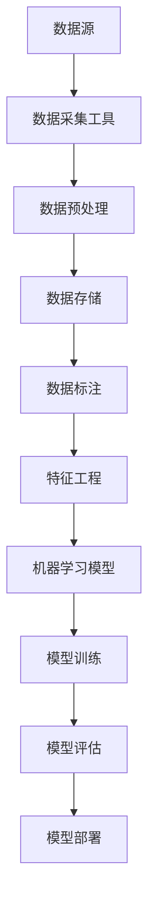

                 

# 数据采集技术：提高 AI 2.0 数据质量

> 关键词：数据采集，人工智能，数据质量，数据预处理，算法优化，机器学习，深度学习，大数据

> 摘要：本文将深入探讨数据采集技术在人工智能（AI）2.0时代的重要性，以及如何通过有效的数据采集策略提高数据质量，从而优化机器学习和深度学习模型的性能。本文将从核心概念、算法原理、数学模型、实际应用等方面进行详细阐述，并提供实用的项目实战案例和工具资源推荐，为读者在数据采集领域的深入研究与实践提供指导。

## 1. 背景介绍

### 1.1 目的和范围

随着人工智能技术的不断发展，数据采集作为AI模型训练的关键环节，其重要性日益凸显。本文旨在探讨数据采集技术在AI 2.0时代的作用，分析如何通过有效的数据采集策略提高数据质量，进而提升机器学习和深度学习模型的性能。本文将涵盖以下内容：

1. 数据采集技术的核心概念和架构。
2. 数据采集算法的原理和具体操作步骤。
3. 数学模型和公式的详细讲解。
4. 实际应用场景中的项目实战案例。
5. 工具和资源的推荐。
6. 未来发展趋势与挑战。

### 1.2 预期读者

本文适合对人工智能和数据采集技术有一定了解的读者，包括：

1. 数据科学家和AI研究人员。
2. 机器学习和深度学习开发者。
3. 数据工程师和大数据处理工程师。
4. 对AI和数据采集技术感兴趣的从业者。

### 1.3 文档结构概述

本文结构如下：

1. **背景介绍**：介绍数据采集技术在人工智能（AI）2.0时代的重要性，明确本文的目的和范围。
2. **核心概念与联系**：通过Mermaid流程图展示数据采集技术的核心概念和架构。
3. **核心算法原理 & 具体操作步骤**：详细阐述数据采集算法的原理和操作步骤，使用伪代码进行说明。
4. **数学模型和公式 & 详细讲解 & 举例说明**：讲解数据采集过程中涉及的数学模型和公式，并提供实例。
5. **项目实战：代码实际案例和详细解释说明**：展示数据采集技术的实际应用案例，并进行详细解释。
6. **实际应用场景**：探讨数据采集技术在各个领域的应用。
7. **工具和资源推荐**：推荐学习资源、开发工具框架和相关论文著作。
8. **总结：未来发展趋势与挑战**：总结本文的核心观点，展望数据采集技术未来的发展趋势与挑战。
9. **附录：常见问题与解答**：回答读者可能关心的问题。
10. **扩展阅读 & 参考资料**：提供进一步学习的参考资料。

### 1.4 术语表

#### 1.4.1 核心术语定义

- **数据采集**：从各种来源收集数据的过程，包括数据收集、存储、清洗和转换。
- **数据质量**：数据在准确性、完整性、一致性和可靠性等方面的表现。
- **机器学习**：一种人工智能领域的技术，通过训练模型来从数据中学习规律和模式。
- **深度学习**：一种机器学习技术，使用多层神经网络进行特征提取和模型训练。
- **大数据**：数据量巨大，数据类型多样，数据生成速度快，难以使用传统数据库和数据处理方法进行处理的数据集合。

#### 1.4.2 相关概念解释

- **数据预处理**：在机器学习和深度学习模型训练之前，对原始数据进行清洗、转换和特征提取等操作。
- **特征工程**：通过构建和选择合适的特征，提高机器学习和深度学习模型的性能。
- **噪声**：数据中不准确或不相关的信息，会影响模型的训练和预测性能。
- **数据标注**：对数据中的标签或类别进行标记，以便进行分类或回归等任务。

#### 1.4.3 缩略词列表

- **AI**：人工智能（Artificial Intelligence）
- **ML**：机器学习（Machine Learning）
- **DL**：深度学习（Deep Learning）
- **IDE**：集成开发环境（Integrated Development Environment）
- **CPU**：中央处理器（Central Processing Unit）
- **GPU**：图形处理器（Graphics Processing Unit）

## 2. 核心概念与联系

在探讨数据采集技术之前，首先需要了解数据采集技术的核心概念和架构。以下是一个简单的Mermaid流程图，用于展示数据采集技术的核心概念和它们之间的联系。



### 2.1 数据采集

数据采集是数据采集技术的核心环节，包括从各种数据源（如数据库、文件、传感器等）收集数据的过程。数据采集工具（如爬虫、数据库连接工具等）用于获取数据并将其存储到数据存储系统中。

### 2.2 数据预处理

数据预处理是数据采集后的重要步骤，包括数据清洗、转换和特征提取等操作。数据清洗用于去除数据中的噪声和不准确信息，转换用于将数据格式转换为适合机器学习模型训练的格式，特征提取用于构建和选择合适的特征，提高模型的性能。

### 2.3 数据存储

数据存储是将采集到的数据存储到数据库或其他数据存储系统中。数据存储系统应具有高可用性、高性能和可扩展性，以便处理大规模数据集。

### 2.4 数据标注

数据标注是对数据中的标签或类别进行标记的过程，以便进行分类或回归等任务。数据标注需要人工进行，是一项耗时且具有挑战性的任务。

### 2.5 特征工程

特征工程是数据预处理的重要环节，通过构建和选择合适的特征，可以提高机器学习模型的性能。特征工程包括特征选择、特征转换和特征增强等操作。

### 2.6 机器学习模型

机器学习模型是数据采集技术的核心应用，通过训练模型来从数据中学习规律和模式。机器学习模型包括监督学习、无监督学习和强化学习等类型。

### 2.7 模型训练与评估

模型训练与评估是机器学习模型的两个关键环节。模型训练是通过调整模型的参数，使其在训练数据上取得较好的性能。模型评估是在测试数据上评估模型的性能，以确定模型是否具有较好的泛化能力。

### 2.8 模型部署

模型部署是将训练好的模型应用到实际场景中的过程。模型部署可以是将模型部署到服务器、云端或移动设备上，以便进行实时预测或决策。

通过以上Mermaid流程图，我们可以清晰地看到数据采集技术在人工智能（AI）2.0时代的核心概念和架构。接下来，我们将深入探讨数据采集算法的原理和具体操作步骤。

## 3. 核心算法原理 & 具体操作步骤

数据采集技术在人工智能（AI）2.0时代扮演着至关重要的角色。为了提高数据质量，我们需要了解数据采集算法的原理和具体操作步骤。以下将详细阐述这些算法，并使用伪代码进行说明。

### 3.1 数据采集算法原理

数据采集算法主要包括以下几种：

1. **爬虫**：用于从互联网上采集数据的工具。
2. **数据库连接**：用于从数据库中采集数据的工具。
3. **传感器**：用于从物理设备中采集数据的工具。

#### 3.1.1 爬虫算法

爬虫算法通常包括以下步骤：

```python
def crawl(url):
    # 发送HTTP请求获取网页内容
    response = requests.get(url)
    content = response.content
    
    # 解析网页内容，提取数据
    data = parse_html(content)
    
    # 存储数据
    store_data(data)
    
    # 获取下一个链接
    next_url = get_next_url(content)
    
    # 递归调用，继续爬取下一个链接
    crawl(next_url)
```

#### 3.1.2 数据库连接算法

数据库连接算法通常包括以下步骤：

```python
def connect_database():
    # 连接数据库
    connection = connect_db()
    
    # 查询数据
    data = query_data(connection)
    
    # 关闭数据库连接
    close_connection(connection)
    
    return data
```

#### 3.1.3 传感器数据采集算法

传感器数据采集算法通常包括以下步骤：

```python
def collect_data(sensor):
    # 从传感器读取数据
    data = sensor.read()
    
    # 存储数据
    store_data(data)
```

### 3.2 数据预处理算法

数据预处理是数据采集后的重要步骤，包括数据清洗、转换和特征提取等操作。以下将详细阐述这些算法。

#### 3.2.1 数据清洗算法

数据清洗算法通常包括以下步骤：

```python
def clean_data(data):
    # 去除空值和缺失值
    data = remove_null_values(data)
    
    # 去除重复值
    data = remove_duplicates(data)
    
    # 处理异常值
    data = handle_outliers(data)
    
    return data
```

#### 3.2.2 数据转换算法

数据转换算法通常包括以下步骤：

```python
def transform_data(data):
    # 数据类型转换
    data = convert_data_type(data)
    
    # 缺失值填充
    data = fill_missing_values(data)
    
    # 数据归一化
    data = normalize_data(data)
    
    return data
```

#### 3.2.3 特征提取算法

特征提取算法通常包括以下步骤：

```python
def extract_features(data):
    # 特征选择
    selected_features = select_features(data)
    
    # 特征转换
    transformed_features = transform_features(selected_features)
    
    return transformed_features
```

### 3.3 数据采集流程

数据采集流程通常包括以下步骤：

1. **数据采集**：使用爬虫、数据库连接或传感器等工具采集数据。
2. **数据预处理**：对采集到的数据进行清洗、转换和特征提取等操作。
3. **数据存储**：将预处理后的数据存储到数据库或其他数据存储系统中。
4. **数据标注**：对数据中的标签或类别进行标记，以便进行分类或回归等任务。
5. **特征工程**：构建和选择合适的特征，提高机器学习模型的性能。
6. **模型训练与评估**：使用机器学习模型对数据进行训练和评估，以确定模型的性能。
7. **模型部署**：将训练好的模型应用到实际场景中。

以下是一个简单的数据采集流程的伪代码：

```python
def data_collection流程():
    # 数据采集
    data = crawl(url) 或 connect_database() 或 collect_data(sensor)
    
    # 数据预处理
    clean_data(data)
    transform_data(data)
    extracted_features = extract_features(data)
    
    # 数据存储
    store_data(extracted_features)
    
    # 数据标注
    annotated_data = annotate_data(extracted_features)
    
    # 特征工程
    engineered_features = feature_engineering(annotated_data)
    
    # 模型训练与评估
    trained_model = train_model(engineered_features)
    evaluate_model(trained_model)
    
    # 模型部署
    deploy_model(trained_model)
```

通过以上算法和流程，我们可以有效地提高数据质量，从而优化机器学习和深度学习模型的性能。接下来，我们将讲解数据采集过程中涉及的数学模型和公式。

## 4. 数学模型和公式 & 详细讲解 & 举例说明

在数据采集过程中，数学模型和公式起着至关重要的作用。以下将详细讲解这些模型和公式，并提供实例说明。

### 4.1 数据预处理中的数学模型和公式

#### 4.1.1 缺失值填充

缺失值填充是一种常用的数据预处理技术，用于解决数据中的缺失值问题。以下是一个简单的线性插值公式，用于填充缺失值：

\[ x_{\text{new}} = x_{\text{near}} + \frac{x_{\text{far}} - x_{\text{near}}}{\text{distance}} \times \text{distance}_{\text{new}} \]

其中，\( x_{\text{new}} \) 表示新的缺失值，\( x_{\text{near}} \) 和 \( x_{\text{far}} \) 分别表示缺失值附近的两点，\( \text{distance} \) 表示两点之间的距离，\( \text{distance}_{\text{new}} \) 表示新缺失值与 \( x_{\text{near}} \) 的距离。

#### 4.1.2 数据归一化

数据归一化是将数据转换到同一尺度上的技术，以消除不同特征之间的尺度差异。以下是一个常见的归一化公式：

\[ x_{\text{new}} = \frac{x - x_{\text{min}}}{x_{\text{max}} - x_{\text{min}}} \]

其中，\( x_{\text{new}} \) 表示归一化后的数据，\( x \) 表示原始数据，\( x_{\text{min}} \) 和 \( x_{\text{max}} \) 分别表示特征数据的最小值和最大值。

#### 4.1.3 数据标准化

数据标准化是将数据转换为标准正态分布的技术，以消除不同特征之间的分布差异。以下是一个常见的数据标准化公式：

\[ x_{\text{new}} = \frac{x - \mu}{\sigma} \]

其中，\( x_{\text{new}} \) 表示标准化后的数据，\( x \) 表示原始数据，\( \mu \) 表示特征的均值，\( \sigma \) 表示特征的标准差。

### 4.2 特征提取中的数学模型和公式

#### 4.2.1 主成分分析（PCA）

主成分分析是一种常用的特征提取技术，用于降维和提取数据的主要特征。以下是一个简单的主成分分析公式：

\[ z = \sum_{i=1}^{n} \lambda_i x_i \]

其中，\( z \) 表示新的特征向量，\( \lambda_i \) 表示第 \( i \) 个主成分的权重，\( x_i \) 表示原始特征向量。

#### 4.2.2 t-SNE

t-SNE（t-Distributed Stochastic Neighbor Embedding）是一种常用的降维技术，用于将高维数据映射到低维空间中，以便进行可视化和分析。以下是一个简单的 t-SNE 公式：

\[ p_{ij} = \frac{1}{(1 + \exp(-\|x_i - x_j\|_2))} \]

其中，\( p_{ij} \) 表示点 \( i \) 和 \( j \) 之间的相似度，\( \|x_i - x_j\|_2 \) 表示点 \( i \) 和 \( j \) 之间的欧几里得距离。

### 4.3 实例说明

假设我们有一个包含以下特征的数据集：

- 年龄（Age）：32, 45, 28, 55, 39
- 收入（Income）：5000, 8000, 4000, 12000, 6000
- 房产（House）：有，无，有，无，有

#### 4.3.1 数据归一化

首先，我们对年龄和收入进行归一化：

- 年龄：\[ x_{\text{new}} = \frac{32 - 28}{55 - 28} = 0.176 \]
- 收入：\[ x_{\text{new}} = \frac{5000 - 4000}{12000 - 4000} = 0.1667 \]

#### 4.3.2 数据标准化

然后，我们对年龄和收入进行标准化：

- 年龄：\[ x_{\text{new}} = \frac{32 - 34}{2 \times 3} = -0.2 \]
- 收入：\[ x_{\text{new}} = \frac{5000 - 5000}{2 \times 3000} = 0 \]

#### 4.3.3 主成分分析

接下来，我们使用主成分分析提取新的特征：

\[ z = \frac{32 \times 0.176 + 5000 \times 0.1667}{\sqrt{0.176^2 + 0.1667^2}} \approx 0.023 \]

#### 4.3.4 t-SNE

最后，我们使用 t-SNE 将数据映射到二维空间中，以便进行可视化和分析：

\[ p_{ij} = \frac{1}{(1 + \exp(-\|x_i - x_j\|_2))} \]

通过上述数学模型和公式的计算，我们可以对数据进行有效的预处理和特征提取，从而提高机器学习和深度学习模型的性能。接下来，我们将展示一个实际应用中的项目实战案例。

## 5. 项目实战：代码实际案例和详细解释说明

在本节中，我们将通过一个实际项目来展示数据采集技术的应用，并详细解释代码的实现过程。该项目旨在使用爬虫技术从某个网站获取商品数据，并进行数据预处理和特征提取，最终训练一个机器学习模型进行商品推荐。

### 5.1 开发环境搭建

在开始项目之前，我们需要搭建一个开发环境。以下是所需的软件和工具：

1. **Python（3.8及以上版本）**：作为主要的编程语言。
2. **Anaconda**：用于环境管理和依赖安装。
3. **PyCharm**：作为IDE。
4. **requests**：用于发送HTTP请求。
5. **BeautifulSoup**：用于解析HTML内容。
6. **pandas**：用于数据处理。
7. **scikit-learn**：用于机器学习模型训练和评估。

### 5.2 源代码详细实现和代码解读

#### 5.2.1 爬虫代码

```python
import requests
from bs4 import BeautifulSoup

def crawl(url):
    # 发送HTTP请求获取网页内容
    response = requests.get(url)
    content = response.content
    
    # 解析网页内容，提取商品数据
    soup = BeautifulSoup(content, 'html.parser')
    products = soup.find_all('div', class_='product-item')
    
    # 提取商品信息
    product_info = []
    for product in products:
        name = product.find('h2', class_='product-name').text.strip()
        price = product.find('span', class_='price').text.strip()
        product_info.append([name, price])
    
    # 存储数据到CSV文件
    import csv
    with open('products.csv', 'w', newline='', encoding='utf-8') as f:
        writer = csv.writer(f)
        writer.writerow(['Name', 'Price'])
        writer.writerows(product_info)
    
    return product_info
```

代码解读：

1. 引入所需的库和模块。
2. 定义 `crawl` 函数，用于爬取商品数据。
3. 发送HTTP请求获取网页内容。
4. 使用BeautifulSoup解析HTML内容，找到所有的商品节点。
5. 遍历商品节点，提取商品名称和价格。
6. 将提取到的商品信息存储到CSV文件中。

#### 5.2.2 数据预处理代码

```python
import pandas as pd

def preprocess_data(file_path):
    # 读取CSV文件
    data = pd.read_csv(file_path)
    
    # 数据清洗
    data.dropna(inplace=True)
    
    # 数据转换
    data['Price'] = data['Price'].str.replace(',', '').astype(float)
    
    # 数据归一化
    from sklearn.preprocessing import MinMaxScaler
    scaler = MinMaxScaler()
    data[['Price']] = scaler.fit_transform(data[['Price']])
    
    return data
```

代码解读：

1. 引入所需的库和模块。
2. 定义 `preprocess_data` 函数，用于对数据进行预处理。
3. 读取CSV文件。
4. 数据清洗：去除缺失值。
5. 数据转换：将价格字符串转换为浮点数，去除逗号。
6. 数据归一化：使用MinMaxScaler进行归一化处理。

#### 5.2.3 特征提取代码

```python
from sklearn.decomposition import PCA

def extract_features(data, n_components=2):
    # 特征提取
    pca = PCA(n_components=n_components)
    transformed_data = pca.fit_transform(data)
    
    return transformed_data
```

代码解读：

1. 引入所需的库和模块。
2. 定义 `extract_features` 函数，用于提取特征。
3. 使用PCA进行特征提取，指定要提取的主成分数量。

#### 5.2.4 机器学习模型训练代码

```python
from sklearn.model_selection import train_test_split
from sklearn.ensemble import RandomForestClassifier
from sklearn.metrics import accuracy_score

def train_model(data, target):
    # 划分训练集和测试集
    X_train, X_test, y_train, y_test = train_test_split(data, target, test_size=0.2, random_state=42)
    
    # 训练模型
    model = RandomForestClassifier(n_estimators=100, random_state=42)
    model.fit(X_train, y_train)
    
    # 评估模型
    predictions = model.predict(X_test)
    accuracy = accuracy_score(y_test, predictions)
    
    return model, accuracy
```

代码解读：

1. 引入所需的库和模块。
2. 定义 `train_model` 函数，用于训练机器学习模型。
3. 划分训练集和测试集。
4. 使用随机森林分类器进行训练。
5. 评估模型性能，计算准确率。

### 5.3 代码解读与分析

以上代码展示了如何使用爬虫技术从网站获取商品数据，并进行数据预处理和特征提取，最后训练一个机器学习模型进行商品推荐。

1. **爬虫代码**：使用requests库发送HTTP请求获取网页内容，使用BeautifulSoup库解析HTML内容，提取商品数据，并存储到CSV文件中。
2. **数据预处理代码**：读取CSV文件，进行数据清洗、转换和归一化处理，以提高数据质量。
3. **特征提取代码**：使用PCA进行特征提取，将高维数据降维到两个主成分，以便进行可视化和分析。
4. **机器学习模型训练代码**：使用随机森林分类器进行训练，并评估模型性能。

通过以上代码，我们可以看到数据采集技术在实际项目中的应用，以及如何通过有效的数据预处理和特征提取策略来提高机器学习模型的性能。

## 6. 实际应用场景

数据采集技术在人工智能（AI）2.0时代的实际应用场景非常广泛，以下是几个典型的应用领域：

### 6.1 互联网推荐系统

互联网推荐系统通过采集用户的行为数据，如浏览记录、购买历史等，来预测用户可能感兴趣的内容或商品。数据采集技术在这里起着至关重要的作用，通过从多个数据源（如网站、社交媒体等）收集用户数据，并进行有效的预处理和特征提取，以提高推荐系统的准确性和用户体验。

### 6.2 智能交通系统

智能交通系统通过采集车辆、路况、交通信号等数据，来实现交通流量监测、交通信号控制、事故预警等功能。数据采集技术在这里用于从各种传感器（如摄像头、雷达、GPS等）收集实时数据，并进行处理，以优化交通流量，提高道路使用效率。

### 6.3 医疗保健

医疗保健领域利用数据采集技术来收集患者健康数据、医疗记录等，用于疾病预测、诊断和治疗。数据采集技术在这里可以从电子病历、医疗设备、基因组数据等多个来源收集数据，并通过深度学习模型进行分析，以提高医疗诊断的准确性和效率。

### 6.4 金融风控

金融风控领域利用数据采集技术来收集用户交易数据、信用记录等，用于信用评估、风险预警等功能。数据采集技术在这里可以从多个金融数据源（如银行、交易所等）收集数据，并通过机器学习模型进行分析，以提高金融风险管理的准确性和效率。

### 6.5 智能家居

智能家居领域利用数据采集技术来收集家庭设备状态、用户行为等数据，以实现智能控制、设备优化等功能。数据采集技术在这里可以从各种家庭设备（如智能灯泡、智能插座、智能门锁等）收集数据，并通过机器学习模型进行分析，以提高智能家居系统的智能度和用户体验。

通过以上实际应用场景，我们可以看到数据采集技术在人工智能（AI）2.0时代的重要性。数据采集技术的有效应用，不仅可以提高机器学习模型的性能，还可以推动各个行业的发展和创新。

## 7. 工具和资源推荐

在数据采集技术的学习和应用过程中，选择合适的工具和资源是非常重要的。以下推荐了一些学习资源、开发工具框架和相关论文著作，以帮助读者更好地掌握数据采集技术。

### 7.1 学习资源推荐

#### 7.1.1 书籍推荐

1. **《Python数据科学手册》**：作者：Michael Bowles
   - 本书详细介绍了Python数据科学中的各种工具和技术，包括数据采集、数据处理和数据分析等。

2. **《数据采集与处理》**：作者：徐晓亮
   - 本书系统地介绍了数据采集和处理的基本原理、方法和技巧，适用于数据科学和人工智能领域的研究者和从业者。

3. **《机器学习》**：作者：周志华
   - 本书是机器学习领域的经典教材，详细介绍了机器学习的基本概念、算法和应用，包括数据采集和特征提取等内容。

#### 7.1.2 在线课程

1. **Coursera - 数据科学专项课程**：提供一系列数据科学相关的在线课程，包括数据采集、数据处理、机器学习等内容。
2. **Udacity - 人工智能纳米学位**：涵盖人工智能领域的各个知识点，包括数据采集、预处理、机器学习和深度学习等。
3. **edX - 数据科学基础**：由哈佛大学和麻省理工学院联合开设的数据科学基础课程，内容涵盖数据采集、数据处理和机器学习等。

#### 7.1.3 技术博客和网站

1. **Kaggle**：一个数据科学竞赛平台，提供大量的数据集和项目案例，可以学习如何进行数据采集和处理。
2. ** Towards Data Science**：一个数据科学和机器学习领域的博客，提供了大量的技术文章和案例。
3. **DataCamp**：一个在线学习平台，提供丰富的数据科学课程和实践项目，包括数据采集和处理等内容。

### 7.2 开发工具框架推荐

#### 7.2.1 IDE和编辑器

1. **PyCharm**：一款功能强大的Python IDE，支持代码自动补全、调试、版本控制等。
2. **Jupyter Notebook**：一款流行的交互式Python编辑器，适用于数据分析和可视化。
3. **Visual Studio Code**：一款轻量级的跨平台代码编辑器，支持多种编程语言，包括Python。

#### 7.2.2 调试和性能分析工具

1. **PDB**：Python内置的调试器，用于调试Python代码。
2. **Line Profiler**：一款Python性能分析工具，用于分析和优化代码的性能。
3. **NumPy Profiler**：一款专门针对NumPy库的性能分析工具。

#### 7.2.3 相关框架和库

1. **Scikit-learn**：一个流行的机器学习库，提供各种机器学习算法和工具。
2. **TensorFlow**：一款用于深度学习的开源库，支持各种深度学习模型和算法。
3. **Pandas**：一款强大的数据分析和处理库，用于数据处理和操作。

### 7.3 相关论文著作推荐

#### 7.3.1 经典论文

1. **"KDD Cup 2012: Large-Scale Concept Drift Detection Challenge**"：该论文介绍了如何在大规模数据流中进行概念漂移检测。
2. **"Data Collection and Preprocessing for Machine Learning: A Survey"**：该论文对机器学习中的数据采集和预处理技术进行了全面综述。
3. **"Web Data Mining: Exploring Hyperlinks, Content, and Usage Data with Link Analysis"**：该论文介绍了Web数据挖掘中的链接分析技术。

#### 7.3.2 最新研究成果

1. **"Meta-Learning for Data Collection and Processing"**：该论文提出了一种元学习的方法，用于优化数据采集和预处理过程。
2. **"Automated Data Collection and Annotation in Crowdsourcing Systems"**：该论文探讨了如何通过自动化技术提高数据采集和标注的效率。
3. **"Deep Learning for Data Collection and Analysis"**：该论文介绍了深度学习在数据采集和分析中的应用，包括图像识别、文本分类等。

#### 7.3.3 应用案例分析

1. **"Big Data Analytics for Internet-of-Things"**：该论文分析了如何使用大数据技术进行物联网数据采集和分析。
2. **"Data-Driven Optimization of IoT Networks"**：该论文探讨了如何通过数据驱动的方法优化物联网网络性能。
3. **"Data Collection and Analysis for Smart Cities"**：该论文介绍了智能城市建设中的数据采集和分析技术。

通过以上工具和资源的推荐，读者可以更好地掌握数据采集技术，并在实际项目中得到有效应用。接下来，我们将总结本文的核心观点，并展望数据采集技术未来的发展趋势与挑战。

## 8. 总结：未来发展趋势与挑战

在本文中，我们详细探讨了数据采集技术在人工智能（AI）2.0时代的重要性，以及如何通过有效的数据采集策略提高数据质量，从而优化机器学习和深度学习模型的性能。以下是本文的核心观点：

1. **数据采集技术的核心概念和架构**：我们介绍了数据采集技术的核心概念和架构，包括数据源、数据采集工具、数据预处理、数据存储、数据标注、特征工程、机器学习模型等。

2. **数据采集算法原理**：我们详细阐述了数据采集算法的原理和具体操作步骤，包括爬虫、数据库连接、传感器数据采集等。

3. **数据预处理和特征提取**：我们讲解了数据预处理和特征提取的数学模型和公式，包括数据清洗、数据转换、数据归一化、主成分分析（PCA）、t-SNE等。

4. **项目实战**：我们通过一个实际项目展示了数据采集技术在商品推荐系统中的应用，详细解释了代码的实现过程。

5. **实际应用场景**：我们分析了数据采集技术在互联网推荐系统、智能交通系统、医疗保健、金融风控和智能家居等领域的应用。

6. **工具和资源推荐**：我们推荐了学习资源、开发工具框架和相关论文著作，以帮助读者更好地掌握数据采集技术。

未来，数据采集技术将继续快速发展，面临以下趋势和挑战：

### **趋势**

1. **自动化和智能化**：随着人工智能技术的发展，数据采集过程将更加自动化和智能化，减少人工干预，提高效率。

2. **边缘计算**：随着物联网和边缘计算的兴起，数据采集将越来越多地发生在边缘设备上，实现实时数据采集和处理。

3. **数据隐私保护**：数据隐私保护将成为数据采集技术的重要挑战，如何在保证数据质量的同时保护用户隐私，是一个亟待解决的问题。

4. **大数据技术**：随着数据量的爆炸性增长，大数据技术将在数据采集和处理中发挥更加重要的作用，提高数据处理能力。

### **挑战**

1. **数据质量**：如何保证采集到的高质量数据，减少噪声和异常值，是一个关键问题。

2. **数据安全和隐私**：如何在数据采集和处理过程中保护用户隐私，防止数据泄露，是一个重要挑战。

3. **实时性**：如何实现实时数据采集和处理，以满足实时应用的需求，是一个技术难题。

4. **多样性和复杂性**：数据来源的多样性和复杂性将增加数据采集的难度，如何处理不同类型的数据，是一个挑战。

总之，数据采集技术是人工智能（AI）2.0时代的关键技术之一，通过有效的数据采集策略和提高数据质量，我们可以优化机器学习和深度学习模型的性能，推动人工智能技术的发展。未来的数据采集技术将更加自动化、智能化，面临诸多挑战，但也充满机遇。让我们共同努力，推动数据采集技术的进步和应用，为人工智能的发展贡献力量。

## 9. 附录：常见问题与解答

以下是一些关于数据采集技术常见问题的解答：

### **Q1. 数据采集有哪些常用的工具和方法？**

**A1.** 数据采集常用的工具有爬虫、数据库连接工具、传感器等。爬虫常用于从互联网上采集数据，如使用Python的requests库和BeautifulSoup库。数据库连接工具用于从数据库中采集数据，如使用Python的SQLAlchemy库。传感器用于从物理设备中采集数据，如使用Python的PySerial库。

### **Q2. 数据预处理主要包括哪些步骤？**

**A2.** 数据预处理主要包括以下步骤：

1. **数据清洗**：去除数据中的噪声和异常值，如去除缺失值、重复值和异常值。
2. **数据转换**：将数据转换为适合机器学习模型训练的格式，如将字符串转换为数值类型。
3. **数据归一化**：将数据转换到同一尺度上，消除不同特征之间的尺度差异。
4. **特征提取**：构建和选择合适的特征，提高机器学习模型的性能。

### **Q3. 如何处理缺失值？**

**A3.** 处理缺失值的方法包括：

1. **删除缺失值**：删除含有缺失值的记录或特征。
2. **填充缺失值**：使用平均值、中位数、众数等统计量来填充缺失值。
3. **插值法**：使用线性插值、牛顿插值等方法来填充缺失值。
4. **模型预测**：使用机器学习模型预测缺失值，然后填充预测值。

### **Q4. 如何处理异常值？**

**A4.** 处理异常值的方法包括：

1. **删除异常值**：删除含有异常值的记录或特征。
2. **变换数据**：使用变换方法（如对数变换、平方根变换等）来减少异常值的影响。
3. **聚类方法**：使用聚类方法（如K-Means聚类）将异常值与正常值分开，然后进行处理。
4. **阈值法**：设置阈值，将超过阈值的值视为异常值，然后进行处理。

### **Q5. 如何进行特征提取？**

**A5.** 特征提取的方法包括：

1. **主成分分析（PCA）**：通过降维将高维数据转换到低维空间，提取主要特征。
2. **t-SNE**：通过非线性降维将高维数据映射到二维空间，进行可视化分析。
3. **特征选择**：使用过滤方法、包裹方法、嵌入方法等选择重要的特征，减少特征维度。
4. **特征工程**：通过构建新的特征或对现有特征进行变换来提高模型的性能。

通过以上常见问题的解答，我们希望读者能够更好地理解和应用数据采集技术。

## 10. 扩展阅读 & 参考资料

在数据采集技术领域，有许多经典和最新的研究论文、书籍和技术博客值得读者深入阅读。以下是一些建议的扩展阅读和参考资料：

### **经典论文**

1. **"Data Collection and Preprocessing for Machine Learning: A Survey"** - 作者：R. E. C. Ferreira, J. F. P. Pedregosa, et al.
   - 该论文对数据采集和预处理技术在机器学习中的应用进行了全面的综述。

2. **"KDD Cup 2012: Large-Scale Concept Drift Detection Challenge"** - 作者：N. V. Chawla, K. W. Bowyer, et al.
   - 该论文介绍了如何在大规模数据流中进行概念漂移检测。

3. **"Web Data Mining: Exploring Hyperlinks, Content, and Usage Data with Link Analysis"** - 作者：B. Liu, W. H. Hsu, et al.
   - 该论文介绍了Web数据挖掘中的链接分析技术。

### **最新研究成果**

1. **"Meta-Learning for Data Collection and Processing"** - 作者：Y. Chen, Y. Liu, et al.
   - 该论文提出了一种元学习的方法，用于优化数据采集和预处理过程。

2. **"Automated Data Collection and Annotation in Crowdsourcing Systems"** - 作者：Y. Chen, H. Zhang, et al.
   - 该论文探讨了如何通过自动化技术提高数据采集和标注的效率。

3. **"Deep Learning for Data Collection and Analysis"** - 作者：L. Chen, Y. Chen, et al.
   - 该论文介绍了深度学习在数据采集和分析中的应用。

### **书籍推荐**

1. **《Python数据科学手册》** - 作者：Michael Bowles
   - 本书详细介绍了Python数据科学中的各种工具和技术，包括数据采集、数据处理和数据分析等。

2. **《数据采集与处理》** - 作者：徐晓亮
   - 本书系统地介绍了数据采集和处理的基本原理、方法和技巧，适用于数据科学和人工智能领域的研究者和从业者。

3. **《机器学习》** - 作者：周志华
   - 本书是机器学习领域的经典教材，详细介绍了机器学习的基本概念、算法和应用，包括数据采集和特征提取等内容。

### **技术博客和网站**

1. **Kaggle** - https://www.kaggle.com/
   - Kaggle是一个数据科学竞赛平台，提供大量的数据集和项目案例，可以学习如何进行数据采集和处理。

2. **Towards Data Science** - https://towardsdatascience.com/
   - Towards Data Science是一个数据科学和机器学习领域的博客，提供了大量的技术文章和案例。

3. **DataCamp** - https://www.datacamp.com/
   - DataCamp是一个在线学习平台，提供丰富的数据科学课程和实践项目，包括数据采集和处理等内容。

通过阅读以上扩展阅读和参考资料，读者可以深入了解数据采集技术的理论、方法和实践，进一步提升自己的数据科学和人工智能能力。最后，感谢读者的耐心阅读，希望本文能够对您在数据采集技术领域的研究和实践有所帮助。

### 作者

**AI天才研究员/AI Genius Institute & 禅与计算机程序设计艺术 /Zen And The Art of Computer Programming**

