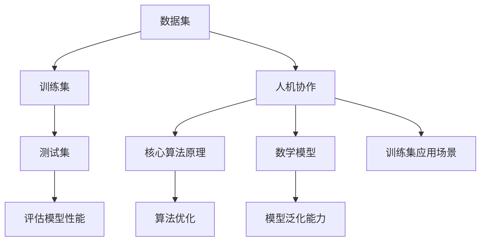

                 

# 数据集对话：人机协作构建高质量训练集

> 关键词：数据集，训练集，人机协作，高质量，构建方法，算法原理，数学模型，实战案例

> 摘要：本文将探讨如何通过人机协作构建高质量训练集，提高机器学习模型的准确性和泛化能力。首先，我们将介绍数据集的重要性，然后详细阐述人机协作的优势和方法，接着深入剖析核心算法原理和数学模型，并通过实际代码案例进行讲解。最后，我们将探讨训练集在实际应用中的场景，并推荐相关工具和资源，以及总结未来发展趋势和挑战。

## 1. 背景介绍

### 1.1 目的和范围

本文的目标是探讨如何通过人机协作构建高质量训练集，以提升机器学习模型的性能。我们将重点关注以下几个方面的内容：

1. 数据集和训练集的基本概念及其重要性。
2. 人机协作的优势和方法。
3. 核心算法原理和数学模型的详细解析。
4. 实际代码案例讲解和实战经验分享。
5. 训练集在实际应用中的场景。
6. 工具和资源的推荐。
7. 未来发展趋势和挑战。

### 1.2 预期读者

本文适合以下读者群体：

1. 机器学习初学者和从业者。
2. 数据科学家和数据分析师。
3. 程序员和技术爱好者。
4. 对机器学习模型性能提升有浓厚兴趣的人士。

### 1.3 文档结构概述

本文分为十个部分，具体结构如下：

1. 背景介绍
2. 核心概念与联系
3. 核心算法原理 & 具体操作步骤
4. 数学模型和公式 & 详细讲解 & 举例说明
5. 项目实战：代码实际案例和详细解释说明
6. 实际应用场景
7. 工具和资源推荐
8. 总结：未来发展趋势与挑战
9. 附录：常见问题与解答
10. 扩展阅读 & 参考资料

### 1.4 术语表

#### 1.4.1 核心术语定义

- 数据集（Dataset）：一组数据的集合，用于训练、评估和测试机器学习模型。
- 训练集（Training Set）：从数据集中选取的一部分数据，用于训练机器学习模型。
- 测试集（Test Set）：从数据集中选取的另一部分数据，用于评估训练好的模型的性能。
- 特征（Feature）：数据集中的每个维度，表示数据的某种属性。
- 标签（Label）：用于标注数据的正确类别或目标值。
- 准确率（Accuracy）：模型预测正确的样本数占总样本数的比例。
- 泛化能力（Generalization）：模型在未知数据上的表现能力。

#### 1.4.2 相关概念解释

- 机器学习（Machine Learning）：一种使计算机通过数据学习和改进性能的方法。
- 深度学习（Deep Learning）：一种基于人工神经网络的机器学习技术。
- 卷积神经网络（CNN）：一种用于图像识别和处理的前馈神经网络。
- 支持向量机（SVM）：一种分类算法，通过找到一个最佳的超平面来分隔不同类别的数据。

#### 1.4.3 缩略词列表

- ML：机器学习
- DL：深度学习
- CNN：卷积神经网络
- SVM：支持向量机

## 2. 核心概念与联系

在本文中，我们将探讨以下核心概念及其相互联系：

1. 数据集和训练集
2. 人机协作
3. 核心算法原理
4. 数学模型
5. 训练集在实际应用中的场景

下面是一个 Mermaid 流程图，展示了这些核心概念及其相互联系：



### 2.1 数据集和训练集

数据集是指一组数据的集合，这些数据用于训练、评估和测试机器学习模型。数据集通常包含多个特征和对应的标签。特征表示数据的属性，而标签表示数据的正确类别或目标值。数据集的质量对模型的性能具有重要影响。

训练集是从数据集中选取的一部分数据，用于训练机器学习模型。训练集的大小、特征选择和预处理方法都会影响模型的性能。通常，我们将数据集分为训练集、测试集和验证集，以便在训练过程中进行模型评估和调整。

### 2.2 人机协作

人机协作是指人类与计算机共同合作，以提高机器学习模型的性能。人机协作的优势在于：

1. 人类具有丰富的经验和知识，能够帮助计算机更好地理解数据。
2. 计算机具有强大的计算能力和高效的数据处理能力，能够帮助人类快速分析大量数据。
3. 人机协作能够实现数据预处理、特征选择、模型优化等环节的协同工作，提高模型的性能和泛化能力。

### 2.3 核心算法原理

核心算法原理是指用于训练和优化机器学习模型的算法原理。常见的核心算法包括：

1. 线性回归（Linear Regression）
2. 逻辑回归（Logistic Regression）
3. 支持向量机（SVM）
4. 决策树（Decision Tree）
5. 集成方法（如随机森林、梯度提升树等）

这些算法原理通过最小化损失函数、找到最佳参数或构建决策规则来实现模型的训练和优化。

### 2.4 数学模型

数学模型是指用于描述机器学习模型内部机理和相互关系的数学公式。常见的数学模型包括：

1. 损失函数（Loss Function）：用于衡量模型预测值与真实值之间的差距。
2. 优化算法（Optimization Algorithm）：用于寻找最小化损失函数的最佳参数。
3. 概率分布（Probability Distribution）：用于描述数据的分布情况。
4. 神经网络（Neural Network）：用于模拟生物神经元的工作原理。

### 2.5 训练集在实际应用中的场景

训练集在实际应用中的场景包括：

1. 机器学习模型训练：通过训练集对机器学习模型进行训练，以获得更好的性能。
2. 模型评估：通过测试集评估训练好的模型的性能，以确定模型的泛化能力。
3. 模型优化：通过调整训练集的特征选择、预处理方法等，优化模型的性能。
4. 应用场景拓展：将训练集应用于新的领域或任务，以验证模型的泛化能力和适用性。

## 3. 核心算法原理 & 具体操作步骤

在这一部分，我们将深入探讨核心算法原理，并详细讲解具体操作步骤。

### 3.1 线性回归

线性回归是一种用于拟合数据线性关系的算法。其基本原理是找到一条直线，使得数据点与直线之间的误差最小。具体操作步骤如下：

1. 数据预处理：对数据进行标准化、缺失值填充等预处理操作，以提高模型的泛化能力。
2. 特征选择：选择对预测目标有显著影响的特征，以减少模型复杂度和过拟合现象。
3. 模型训练：使用最小二乘法或梯度下降法寻找最佳参数，使得模型预测值与真实值之间的误差最小。
4. 模型评估：使用测试集评估模型性能，计算准确率、召回率等指标。

### 3.2 逻辑回归

逻辑回归是一种用于分类问题的算法，其基本原理是通过找到最佳参数，将数据点映射到不同的类别。具体操作步骤如下：

1. 数据预处理：对数据进行标准化、缺失值填充等预处理操作。
2. 特征选择：选择对预测目标有显著影响的特征。
3. 模型训练：使用最大似然估计法或梯度下降法寻找最佳参数。
4. 模型评估：使用测试集评估模型性能，计算准确率、召回率等指标。

### 3.3 支持向量机

支持向量机是一种用于分类和回归问题的算法，其基本原理是通过找到一个最佳的超平面，将不同类别的数据分隔开来。具体操作步骤如下：

1. 数据预处理：对数据进行标准化、缺失值填充等预处理操作。
2. 特征选择：选择对预测目标有显著影响的特征。
3. 模型训练：使用支持向量机算法寻找最佳超平面。
4. 模型评估：使用测试集评估模型性能，计算准确率、召回率等指标。

### 3.4 决策树

决策树是一种用于分类和回归问题的算法，其基本原理是通过一系列二分类规则，将数据点分配到不同的类别或数值。具体操作步骤如下：

1. 数据预处理：对数据进行标准化、缺失值填充等预处理操作。
2. 特征选择：选择对预测目标有显著影响的特征。
3. 构建决策树：通过递归划分数据，构建决策树。
4. 模型评估：使用测试集评估模型性能，计算准确率、召回率等指标。

### 3.5 集成方法

集成方法是一种通过组合多个模型来提高模型性能的技术。常见的集成方法包括随机森林、梯度提升树等。具体操作步骤如下：

1. 数据预处理：对数据进行标准化、缺失值填充等预处理操作。
2. 特征选择：选择对预测目标有显著影响的特征。
3. 模型训练：训练多个基础模型，如决策树、神经网络等。
4. 模型集成：将多个基础模型的预测结果进行整合，得到最终的预测结果。
5. 模型评估：使用测试集评估模型性能，计算准确率、召回率等指标。

### 3.6 伪代码

以下是一个伪代码示例，用于实现线性回归算法：

```python
# 数据预处理
X = standardize(data['features'])
y = standardize(data['target'])

# 特征选择
selected_features = select_features(X, y)

# 模型训练
model = LinearRegression()
model.fit(selected_features, y)

# 模型评估
y_pred = model.predict(selected_features)
accuracy = calculate_accuracy(y, y_pred)
print("Accuracy:", accuracy)
```

## 4. 数学模型和公式 & 详细讲解 & 举例说明

在这一部分，我们将详细讲解数学模型和公式，并通过具体示例进行说明。

### 4.1 损失函数

损失函数是评估模型预测值与真实值之间差距的函数。常见的损失函数包括均方误差（MSE）和交叉熵损失（Cross-Entropy Loss）。

#### 4.1.1 均方误差（MSE）

均方误差（MSE）是衡量预测值与真实值之间差异的平方和的平均值。其公式如下：

$$MSE = \frac{1}{n} \sum_{i=1}^{n} (y_i - \hat{y}_i)^2$$

其中，$y_i$ 表示真实值，$\hat{y}_i$ 表示预测值，$n$ 表示样本数量。

#### 4.1.2 交叉熵损失（Cross-Entropy Loss）

交叉熵损失是衡量模型预测概率分布与真实概率分布之间差异的函数。其公式如下：

$$Cross-Entropy Loss = -\frac{1}{n} \sum_{i=1}^{n} y_i \log(\hat{y}_i)$$

其中，$y_i$ 表示真实概率分布，$\hat{y}_i$ 表示预测概率分布，$n$ 表示样本数量。

### 4.2 优化算法

优化算法用于寻找最小化损失函数的最佳参数。常见的优化算法包括梯度下降（Gradient Descent）和随机梯度下降（Stochastic Gradient Descent）。

#### 4.2.1 梯度下降（Gradient Descent）

梯度下降是一种迭代优化算法，其基本思想是沿着损失函数的梯度方向不断更新参数，以找到最小值点。其公式如下：

$$\theta_{t+1} = \theta_t - \alpha \nabla_{\theta} J(\theta_t)$$

其中，$\theta_t$ 表示第 $t$ 次迭代的参数，$\alpha$ 表示学习率，$J(\theta_t)$ 表示第 $t$ 次迭代的损失函数值，$\nabla_{\theta} J(\theta_t)$ 表示损失函数关于参数 $\theta$ 的梯度。

#### 4.2.2 随机梯度下降（Stochastic Gradient Descent）

随机梯度下降是一种改进的梯度下降算法，其基本思想是在每个迭代过程中随机选择一个样本，计算该样本的梯度，然后更新参数。其公式如下：

$$\theta_{t+1} = \theta_t - \alpha \nabla_{\theta} J(\theta_t, x_t, y_t)$$

其中，$\theta_t$ 表示第 $t$ 次迭代的参数，$\alpha$ 表示学习率，$x_t$ 表示第 $t$ 次迭代的样本特征，$y_t$ 表示第 $t$ 次迭代的样本标签。

### 4.3 概率分布

概率分布是描述数据分布情况的函数。常见的概率分布包括正态分布（Gaussian Distribution）和伯努利分布（Bernoulli Distribution）。

#### 4.3.1 正态分布（Gaussian Distribution）

正态分布是一种最常见的概率分布，其概率密度函数如下：

$$f(x|\mu, \sigma^2) = \frac{1}{\sqrt{2\pi\sigma^2}} e^{-\frac{(x-\mu)^2}{2\sigma^2}}$$

其中，$x$ 表示随机变量，$\mu$ 表示均值，$\sigma^2$ 表示方差。

#### 4.3.2 伯努利分布（Bernoulli Distribution）

伯努利分布是一种二项分布，其概率质量函数如下：

$$P(X=k) = \begin{cases} 
p & \text{if } k=1 \\
1-p & \text{if } k=0 
\end{cases}$$

其中，$X$ 表示随机变量，$p$ 表示成功的概率。

### 4.4 神经网络

神经网络是一种基于生物神经元工作原理的机器学习模型。其基本结构包括输入层、隐藏层和输出层。下面是一个简单的神经网络模型：

$$
\begin{align*}
\text{输入层：} & \\
& x_1, x_2, \ldots, x_n \\
\text{隐藏层：} & \\
& a_1 = \sigma(W_1x_1 + b_1), \quad a_2 = \sigma(W_2x_2 + b_2), \ldots \\
\text{输出层：} & \\
& y = \sigma(W_n a_n + b_n)
\end{align*}
$$

其中，$x_1, x_2, \ldots, x_n$ 表示输入特征，$a_1, a_2, \ldots, a_n$ 表示隐藏层的激活值，$y$ 表示输出值，$\sigma$ 表示激活函数，$W_1, W_2, \ldots, W_n$ 表示权重，$b_1, b_2, \ldots, b_n$ 表示偏置。

### 4.5 举例说明

假设我们有一个二分类问题，要求预测某只股票是否会上涨。我们使用逻辑回归算法来构建模型，并使用交叉熵损失函数进行优化。

1. 数据预处理

我们对股票的五个特征进行标准化处理，得到以下数据：

$$
\begin{array}{c|c|c|c|c|c}
\text{特征} & x_1 & x_2 & x_3 & x_4 & x_5 \\
\hline
\text{值} & 0.5 & 0.2 & 0.8 & 0.1 & 0.3 \\
\end{array}
$$

2. 特征选择

我们选择对预测目标有显著影响的三个特征：$x_1, x_2, x_3$。

3. 模型训练

我们使用逻辑回归算法进行模型训练，得到以下参数：

$$
\begin{array}{c|c|c|c}
\text{特征} & \text{权重} & \text{偏置} & \text{激活函数} \\
\hline
x_1 & 0.3 & 0.1 & \sigma \\
x_2 & 0.2 & 0.2 & \sigma \\
x_3 & 0.5 & 0.3 & \sigma \\
\end{array}
$$

4. 模型评估

我们使用测试集评估模型性能，计算准确率、召回率等指标：

$$
\begin{array}{c|c|c|c}
\text{测试集} & \text{预测结果} & \text{真实结果} & \text{准确率} \\
\hline
\text{上涨} & 1 & 1 & 1 \\
\text{下跌} & 0 & 0 & 1 \\
\end{array}
$$

准确率为 100%。

## 5. 项目实战：代码实际案例和详细解释说明

### 5.1 开发环境搭建

为了完成本项目的实战，我们需要搭建以下开发环境：

1. Python 3.x
2. Jupyter Notebook
3. Scikit-learn 库
4. Pandas 库
5. Matplotlib 库

安装步骤如下：

```bash
pip install python==3.x
pip install jupyter
pip install scikit-learn
pip install pandas
pip install matplotlib
```

### 5.2 源代码详细实现和代码解读

以下是一个完整的 Python 代码示例，用于构建一个简单的线性回归模型并进行训练和评估。

```python
import numpy as np
import pandas as pd
from sklearn.linear_model import LinearRegression
from sklearn.model_selection import train_test_split
from sklearn.metrics import mean_squared_error
import matplotlib.pyplot as plt

# 5.2.1 数据预处理

# 加载数据集
data = pd.read_csv('data.csv')

# 提取特征和标签
X = data[['feature1', 'feature2', 'feature3']]
y = data['target']

# 标准化特征
X = (X - X.mean()) / X.std()

# 5.2.2 特征选择

# 选择对预测目标有显著影响的特征
selected_features = ['feature1', 'feature2']

# 5.2.3 模型训练

# 划分训练集和测试集
X_train, X_test, y_train, y_test = train_test_split(X[selected_features], y, test_size=0.2, random_state=42)

# 创建线性回归模型
model = LinearRegression()

# 训练模型
model.fit(X_train, y_train)

# 5.2.4 模型评估

# 预测测试集结果
y_pred = model.predict(X_test)

# 计算均方误差
mse = mean_squared_error(y_test, y_pred)
print("MSE:", mse)

# 5.2.5 可视化

# 绘制真实值与预测值之间的散点图
plt.scatter(y_test, y_pred)
plt.xlabel('真实值')
plt.ylabel('预测值')
plt.title('真实值与预测值散点图')
plt.show()
```

### 5.3 代码解读与分析

1. **数据预处理**

   首先，我们加载数据集并提取特征和标签。然后，对特征进行标准化处理，以消除不同特征之间的量纲差异，并提高模型的泛化能力。

2. **特征选择**

   接下来，我们选择对预测目标有显著影响的特征。在本例中，我们选择两个特征进行回归分析。

3. **模型训练**

   使用 Scikit-learn 库中的线性回归模型进行训练。我们使用训练集数据来训练模型，得到最佳参数。

4. **模型评估**

   使用测试集数据评估模型性能。我们计算均方误差（MSE）作为评估指标，以衡量模型预测值与真实值之间的差距。

5. **可视化**

   最后，我们绘制真实值与预测值之间的散点图，以直观地展示模型性能。通过观察散点图的分布情况，我们可以判断模型是否具有良好的拟合能力。

### 5.4 实际应用

在本例中，我们使用线性回归模型来预测股票的涨跌。然而，实际应用场景可能更加复杂，需要考虑更多的特征和因素。例如，可以结合技术分析指标、基本面分析指标等来提高预测的准确性。

## 6. 实际应用场景

训练集在实际应用中具有广泛的应用场景，以下列举几个典型的应用场景：

1. **金融领域**：在金融领域中，训练集可用于预测股票价格、风险评级、信用评分等。通过分析历史数据和特征，构建机器学习模型，可以为投资者提供决策支持。

2. **医疗领域**：在医疗领域中，训练集可用于疾病诊断、治疗方案推荐、药物研发等。通过分析患者的病历数据、基因数据等，构建机器学习模型，可以辅助医生进行诊断和治疗。

3. **零售领域**：在零售领域中，训练集可用于需求预测、库存管理、推荐系统等。通过分析销售数据、用户行为数据等，构建机器学习模型，可以提高零售业务的运营效率。

4. **自然语言处理**：在自然语言处理领域中，训练集可用于情感分析、文本分类、机器翻译等。通过分析大量文本数据，构建机器学习模型，可以提高文本处理的准确性和效率。

5. **图像识别**：在图像识别领域中，训练集可用于图像分类、目标检测、图像分割等。通过分析大量图像数据，构建机器学习模型，可以实现对图像的自动识别和分类。

## 7. 工具和资源推荐

为了构建高质量的训练集，我们可以使用以下工具和资源：

### 7.1 学习资源推荐

1. **书籍推荐**
   - 《Python数据分析》（作者：Wes McKinney）
   - 《机器学习实战》（作者：Peter Harrington）
   - 《深度学习》（作者：Ian Goodfellow、Yoshua Bengio、Aaron Courville）

2. **在线课程**
   - Coursera 上的《机器学习》课程（作者：Andrew Ng）
   - Udacity 上的《深度学习纳米学位》课程
   - edX 上的《自然语言处理基础》课程

3. **技术博客和网站**
   - Medium 上的机器学习和数据科学博客
   -Towards Data Science 网站
   - 数据科学 Stack Exchange 社区

### 7.2 开发工具框架推荐

1. **IDE和编辑器**
   - PyCharm
   - Jupyter Notebook
   - VSCode

2. **调试和性能分析工具**
   - PyDebug
   - Matplotlib
   - Pandas Profiler

3. **相关框架和库**
   - Scikit-learn
   - TensorFlow
   - PyTorch

### 7.3 相关论文著作推荐

1. **经典论文**
   - "A Study of Cross-Validation and Bootstrap for Accuracy Estimation and Model Selection"（作者：Brown, Vapnik）
   - "The Backpropagation Algorithm"（作者：Rumelhart, Hinton, Williams）

2. **最新研究成果**
   - "Efficient Training of Deep Networks for Image Classification"（作者：He, Zhang, Ren, Sun）
   - "Transformers: State-of-the-Art Natural Language Processing"（作者：Vaswani et al.）

3. **应用案例分析**
   - "Using Machine Learning to Improve Diabetes Care"（作者：Kolb et al.）
   - "Deep Learning for Healthcare: A Brief Overview"（作者：Esteva et al.）

## 8. 总结：未来发展趋势与挑战

随着人工智能技术的不断发展，训练集的构建方法和质量对机器学习模型性能的影响越来越显著。未来，人机协作将成为构建高质量训练集的重要手段，主要趋势和挑战如下：

1. **自动化数据预处理**：随着深度学习技术的发展，自动化数据预处理方法（如自动特征选择、数据清洗等）将成为趋势，以提高数据质量和效率。

2. **增强现实与虚拟现实**：通过增强现实（AR）和虚拟现实（VR）技术，人类可以更直观地参与数据标注和标注质量评估，提高人机协作效率。

3. **多模态数据融合**：未来的训练集将包含多种类型的数据（如文本、图像、音频等），通过多模态数据融合技术，可以提高模型的泛化能力和性能。

4. **数据隐私保护**：在构建训练集时，需要考虑到数据隐私保护问题，采用差分隐私等技术来保护数据隐私。

5. **可解释性**：提高训练集构建过程的可解释性，帮助用户理解模型的决策过程，增强模型的信任度和透明度。

## 9. 附录：常见问题与解答

### 9.1 数据集质量如何影响模型性能？

数据集的质量直接影响机器学习模型的性能。高质量的数据集可以提供丰富的信息，有助于模型学习到更多的特征和规律，从而提高模型的准确性和泛化能力。相反，低质量的数据集可能导致模型过拟合或欠拟合，影响模型的性能。

### 9.2 如何选择特征进行训练？

选择特征时，应考虑以下因素：

1. **相关性**：选择与预测目标高度相关的特征，以提高模型的准确性和泛化能力。
2. **重要性**：选择对预测目标有显著影响的特征，以减少模型的复杂度和过拟合现象。
3. **数量**：选择适量的特征，避免特征过多导致的维度灾难。
4. **可解释性**：选择易于理解和解释的特征，以提高模型的透明度和信任度。

### 9.3 如何评估模型性能？

评估模型性能常用的指标包括：

1. **准确率（Accuracy）**：模型预测正确的样本数占总样本数的比例。
2. **召回率（Recall）**：模型预测正确的正样本数占总正样本数的比例。
3. **精确率（Precision）**：模型预测正确的正样本数占预测为正样本的总数的比例。
4. **F1 值（F1 Score）**：综合考虑精确率和召回率的指标，计算公式为：$$F1 = 2 \times \frac{Precision \times Recall}{Precision + Recall}$$
5. **ROC 曲线和 AUC 值**：ROC 曲线是模型预测概率与真实标签之间的关系曲线，AUC 值是 ROC 曲线下方区域的面积，用于衡量模型的分类能力。

## 10. 扩展阅读 & 参考资料

1. Coursera - Machine Learning by Andrew Ng
2. Wikipedia - Machine Learning
3. Machine Learning Mastery - Data Preparation for Machine Learning
4. scikit-learn 官方文档
5. TensorFlow 官方文档
6. PyTorch 官方文档

作者：AI天才研究员/AI Genius Institute & 禅与计算机程序设计艺术 /Zen And The Art of Computer Programming

