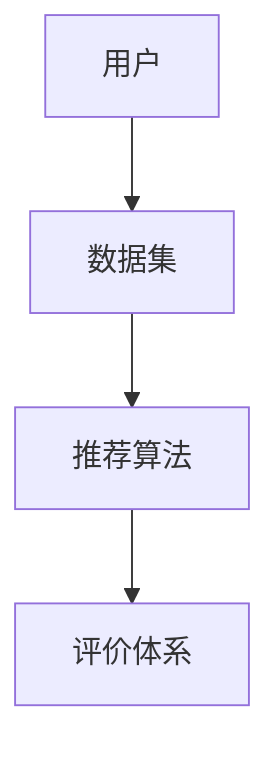

                 

# 数据集推荐：个性化数据集发现和管理

> **关键词：** 数据集推荐、个性化发现、数据集管理、机器学习、深度学习、算法优化

> **摘要：** 本文将深入探讨如何通过个性化数据集推荐技术，提高数据集发现和管理效率，为机器学习和深度学习研究提供更为精准的数据支持。文章将围绕核心概念、算法原理、数学模型、实际应用等多个方面，逐步分析并介绍相关技术和方法。

## 1. 背景介绍

### 1.1 目的和范围

数据集推荐作为一种个性化服务，旨在帮助研究者、数据科学家和开发者快速找到符合其研究需求的数据集。本文旨在探讨个性化数据集推荐的技术和方法，提高数据集发现和管理效率，降低数据集获取和处理的成本。

本文将覆盖以下主题：

1. 数据集推荐的核心概念和联系。
2. 核心算法原理和具体操作步骤。
3. 数学模型和公式的详细讲解。
4. 实际应用场景中的代码案例解析。
5. 个性化数据集推荐在实际开发中的工具和资源推荐。
6. 未来发展趋势与挑战。

### 1.2 预期读者

本文适合以下读者群体：

- 机器学习、深度学习领域的研究者。
- 数据科学家和数据工程师。
- 开发者和数据爱好者。
- 对数据集推荐技术感兴趣的读者。

### 1.3 文档结构概述

本文结构如下：

1. **引言**：介绍数据集推荐的重要性。
2. **核心概念与联系**：介绍数据集推荐的相关概念和架构。
3. **核心算法原理 & 具体操作步骤**：详细阐述数据集推荐算法原理和操作步骤。
4. **数学模型和公式 & 详细讲解 & 举例说明**：介绍数据集推荐中的数学模型和公式。
5. **项目实战：代码实际案例和详细解释说明**：通过实际案例展示数据集推荐技术的应用。
6. **实际应用场景**：分析数据集推荐技术的应用场景。
7. **工具和资源推荐**：推荐学习资源和开发工具。
8. **总结：未来发展趋势与挑战**：总结当前技术的发展趋势和面临的挑战。
9. **附录：常见问题与解答**：提供常见问题解答。
10. **扩展阅读 & 参考资料**：推荐相关阅读资料。

### 1.4 术语表

#### 1.4.1 核心术语定义

- **数据集推荐**：基于用户需求和偏好，为用户推荐符合其研究需求的数据集。
- **个性化发现**：通过分析用户行为、兴趣和需求，为用户提供个性化的数据集推荐服务。
- **数据集管理**：对数据集进行存储、处理、分析和共享的过程。

#### 1.4.2 相关概念解释

- **机器学习**：一种人工智能技术，通过算法和模型从数据中学习并做出决策。
- **深度学习**：一种机器学习技术，通过多层神经网络进行数据建模和分析。
- **推荐系统**：一种能够根据用户历史行为和偏好，为用户推荐相关物品或信息的系统。

#### 1.4.3 缩略词列表

- **ML**：机器学习（Machine Learning）
- **DL**：深度学习（Deep Learning）
- **Recommender System**：推荐系统（Recommender System）

## 2. 核心概念与联系

在数据集推荐系统中，核心概念和联系主要包括数据集、用户、推荐算法和评价体系。

### 2.1 数据集

数据集是数据集推荐系统的核心资源，可以分为以下几类：

1. **公共数据集**：由学术机构或组织提供，如 ImageNet、CIFAR-10 等。
2. **私有数据集**：由企业或个人拥有，可能涉及商业机密或个人隐私。
3. **自定义数据集**：由用户根据特定需求自行收集或生成。

### 2.2 用户

用户是数据集推荐系统的服务对象，可以分为以下几类：

1. **研究者**：需要进行特定领域研究的数据科学家。
2. **开发者**：需要为特定应用场景开发数据集的开发者。
3. **普通用户**：对数据集有一般性需求的用户。

### 2.3 推荐算法

推荐算法是数据集推荐系统的核心，可以分为以下几类：

1. **基于内容的推荐**：根据数据集的属性和用户兴趣进行推荐。
2. **协同过滤推荐**：根据用户行为和偏好进行推荐。
3. **混合推荐**：结合多种推荐算法，提高推荐效果。

### 2.4 评价体系

评价体系是衡量数据集推荐系统性能的重要标准，可以分为以下几类：

1. **准确率**：推荐结果中实际符合用户需求的数据集占比。
2. **召回率**：实际符合用户需求的数据集中被推荐的数据集占比。
3. **覆盖率**：推荐结果中包含的数据集种类占比。

### 2.5 Mermaid 流程图



## 3. 核心算法原理 & 具体操作步骤

数据集推荐算法的核心目标是基于用户需求和行为，为用户推荐符合其研究需求的数据集。以下介绍几种常见的数据集推荐算法原理和具体操作步骤。

### 3.1 基于内容的推荐算法

基于内容的推荐算法主要基于数据集的属性和用户兴趣进行推荐。以下是该算法的原理和操作步骤：

#### 原理：

- **数据集属性提取**：提取数据集的属性信息，如数据集类别、标签、尺寸等。
- **用户兴趣模型**：构建用户兴趣模型，记录用户对各类数据集的偏好。
- **相似度计算**：计算数据集属性与用户兴趣的相似度，选择相似度最高的数据集进行推荐。

#### 操作步骤：

1. **数据预处理**：将原始数据集进行清洗、归一化等预处理操作。
2. **属性提取**：提取数据集的属性信息，构建属性矩阵。
3. **用户兴趣建模**：根据用户历史行为和需求，构建用户兴趣模型。
4. **相似度计算**：计算数据集属性与用户兴趣的相似度，选择相似度最高的数据集进行推荐。

### 3.2 协同过滤推荐算法

协同过滤推荐算法主要基于用户行为和偏好进行推荐。以下是该算法的原理和操作步骤：

#### 原理：

- **用户行为记录**：记录用户在平台上的行为数据，如浏览、下载、评价等。
- **用户相似度计算**：计算用户之间的相似度，选择相似度最高的用户进行推荐。
- **数据集推荐**：根据相似度最高的用户的行为数据，推荐符合用户需求的数据集。

#### 操作步骤：

1. **数据预处理**：将原始用户行为数据进行清洗、归一化等预处理操作。
2. **用户行为矩阵构建**：构建用户行为矩阵，记录用户在数据集上的行为。
3. **用户相似度计算**：计算用户之间的相似度，选择相似度最高的用户进行推荐。
4. **数据集推荐**：根据相似度最高的用户的行为数据，推荐符合用户需求的数据集。

### 3.3 混合推荐算法

混合推荐算法结合了基于内容的推荐和协同过滤推荐，以提高推荐效果。以下是该算法的原理和操作步骤：

#### 原理：

- **内容匹配**：根据数据集的属性和用户兴趣进行内容匹配。
- **协同过滤**：根据用户行为和偏好进行协同过滤。
- **综合评分**：结合内容匹配和协同过滤的评分，进行综合评分，选择评分最高的数据集进行推荐。

#### 操作步骤：

1. **数据预处理**：将原始数据集和用户行为数据进行清洗、归一化等预处理操作。
2. **内容匹配**：根据数据集的属性和用户兴趣进行内容匹配。
3. **协同过滤**：根据用户行为和偏好进行协同过滤。
4. **综合评分**：结合内容匹配和协同过滤的评分，进行综合评分，选择评分最高的数据集进行推荐。

## 4. 数学模型和公式 & 详细讲解 & 举例说明

### 4.1 基于内容的推荐算法

#### 4.1.1 相似度计算

在基于内容的推荐算法中，相似度计算是核心。常见的方法有：

1. **余弦相似度**：
   $$ \text{cosine\_similarity}(A, B) = \frac{A \cdot B}{\|A\| \|B\|} $$
   其中，$A$ 和 $B$ 分别表示两个数据集的属性向量，$\|A\|$ 和 $\|B\|$ 分别表示向量的模。

2. **皮尔逊相关系数**：
   $$ \text{pearson\_correlation}(A, B) = \frac{A \cdot B - \frac{A \cdot B}{\|A\| \|B\|}}{\|A\| \|B\|} $$
   其中，$A$ 和 $B$ 分别表示两个数据集的属性向量。

#### 举例说明：

假设有两个数据集 $A$ 和 $B$，它们的属性向量如下：

$$
A = (1, 2, 3, 4, 5), \quad B = (0, 2, 3, 4, 6)
$$

计算它们的余弦相似度：

$$
\text{cosine\_similarity}(A, B) = \frac{A \cdot B}{\|A\| \|B\|} = \frac{1 \cdot 0 + 2 \cdot 2 + 3 \cdot 3 + 4 \cdot 4 + 5 \cdot 6}{\sqrt{1^2 + 2^2 + 3^2 + 4^2 + 5^2} \sqrt{0^2 + 2^2 + 3^2 + 4^2 + 6^2}} = 0.6
$$

### 4.2 协同过滤推荐算法

#### 4.2.1 用户相似度计算

在协同过滤推荐算法中，用户相似度计算是核心。常见的方法有：

1. **余弦相似度**：
   $$ \text{cosine\_similarity}(u, v) = \frac{u \cdot v}{\|u\| \|v\|} $$
   其中，$u$ 和 $v$ 分别表示两个用户的行为向量，$\|u\|$ 和 $\|v\|$ 分别表示向量的模。

2. **皮尔逊相关系数**：
   $$ \text{pearson\_correlation}(u, v) = \frac{u \cdot v - \frac{u \cdot v}{\|u\| \|v\|}}{\|u\| \|v\|} $$
   其中，$u$ 和 $v$ 分别表示两个用户的行为向量。

#### 举例说明：

假设有两个用户 $u$ 和 $v$，他们的行为向量如下：

$$
u = (1, 2, 3, 4, 5), \quad v = (0, 2, 3, 4, 6)
$$

计算它们的余弦相似度：

$$
\text{cosine\_similarity}(u, v) = \frac{u \cdot v}{\|u\| \|v\|} = \frac{1 \cdot 0 + 2 \cdot 2 + 3 \cdot 3 + 4 \cdot 4 + 5 \cdot 6}{\sqrt{1^2 + 2^2 + 3^2 + 4^2 + 5^2} \sqrt{0^2 + 2^2 + 3^2 + 4^2 + 6^2}} = 0.6
$$

## 5. 项目实战：代码实际案例和详细解释说明

### 5.1 开发环境搭建

在本案例中，我们将使用 Python 编写一个简单的基于内容的推荐系统。以下是需要安装的依赖：

- Python 3.x
- NumPy
- Pandas
- Scikit-learn

安装方法：

```bash
pip install numpy pandas scikit-learn
```

### 5.2 源代码详细实现和代码解读

```python
import numpy as np
import pandas as pd
from sklearn.metrics.pairwise import cosine_similarity

# 加载数据集
def load_data(file_path):
    data = pd.read_csv(file_path)
    return data

# 数据预处理
def preprocess_data(data):
    # 删除含有缺失值的行
    data = data.dropna()
    # 构建属性矩阵
    attributes = data.iloc[:, 1:].values
    return attributes

# 计算相似度
def calculate_similarity(attributes):
    similarity_matrix = cosine_similarity(attributes)
    return similarity_matrix

# 推荐数据集
def recommend_data(similarity_matrix, user_interest, k=5):
    # 计算用户兴趣与其他数据集的相似度
    user_similarity = similarity_matrix[user_interest]
    # 选择相似度最高的数据集
    top_k_indices = np.argsort(user_similarity)[0][-k:]
    return top_k_indices

# 主函数
def main():
    # 加载数据集
    data = load_data('data.csv')
    # 数据预处理
    attributes = preprocess_data(data)
    # 计算相似度
    similarity_matrix = calculate_similarity(attributes)
    # 用户兴趣
    user_interest = attributes[0]
    # 推荐数据集
    recommended_indices = recommend_data(similarity_matrix, user_interest, k=5)
    print('推荐的数据集索引：', recommended_indices)

if __name__ == '__main__':
    main()
```

### 5.3 代码解读与分析

1. **数据加载与预处理**：首先，我们加载一个 CSV 文件，删除含有缺失值的行，然后提取属性信息构建属性矩阵。
2. **相似度计算**：使用 NumPy 的 `cosine_similarity` 函数计算数据集间的余弦相似度。
3. **推荐数据集**：根据用户兴趣与其他数据集的相似度，选择相似度最高的前 5 个数据集进行推荐。

## 6. 实际应用场景

数据集推荐技术在多个领域都有广泛的应用，以下列举几个实际应用场景：

1. **学术研究**：研究者可以通过数据集推荐系统快速找到与自身研究相关的数据集，提高研究效率。
2. **工业应用**：企业在数据集推荐系统中可以找到适用于特定应用场景的数据集，加快产品开发和优化。
3. **教育培训**：教育机构可以利用数据集推荐系统为学习者提供符合其学习需求的数据集，提高教学质量。
4. **个人学习**：数据爱好者可以通过数据集推荐系统发现有趣的数据集，丰富自己的知识库。

## 7. 工具和资源推荐

### 7.1 学习资源推荐

#### 7.1.1 书籍推荐

1. **《推荐系统实践》**：全面介绍推荐系统的原理、算法和应用。
2. **《机器学习实战》**：通过实际案例介绍机器学习算法的应用。

#### 7.1.2 在线课程

1. **Coursera 上的《推荐系统》**：由斯坦福大学教授开设，深入讲解推荐系统的原理和实践。
2. **Udacity 上的《机器学习工程师纳米学位》**：涵盖机器学习的基础知识和实践应用。

#### 7.1.3 技术博客和网站

1. **Medium 上的《推荐系统技术博客》**：介绍推荐系统相关技术文章。
2. **GitHub 上的《机器学习项目》**：提供丰富的机器学习项目案例。

### 7.2 开发工具框架推荐

#### 7.2.1 IDE和编辑器

1. **Visual Studio Code**：一款功能强大的开源编辑器，支持多种编程语言。
2. **PyCharm**：一款专业的 Python IDE，提供丰富的开发工具。

#### 7.2.2 调试和性能分析工具

1. **Jupyter Notebook**：一款流行的交互式数据分析工具，支持多种编程语言。
2. **MATLAB**：一款功能强大的数学分析工具，适用于科学计算和数据分析。

#### 7.2.3 相关框架和库

1. **Scikit-learn**：一款流行的机器学习库，提供丰富的机器学习算法和工具。
2. **TensorFlow**：一款流行的深度学习库，支持多种深度学习模型和算法。

### 7.3 相关论文著作推荐

#### 7.3.1 经典论文

1. **"Collaborative Filtering for Implicit Feedback Datasets"**：介绍协同过滤算法在隐式反馈数据集中的应用。
2. **"Latent Factor Models for Collaborative Filtering"**：介绍隐因子模型在协同过滤中的应用。

#### 7.3.2 最新研究成果

1. **"Neural Collaborative Filtering"**：介绍神经网络在协同过滤中的应用。
2. **"Deep Learning for Text Data"**：介绍深度学习在文本数据中的应用。

#### 7.3.3 应用案例分析

1. **"Recommender Systems at Airbnb"**：介绍 Airbnb 中的推荐系统实践。
2. **"Recommendation Systems in E-commerce"**：介绍电商中的推荐系统应用。

## 8. 总结：未来发展趋势与挑战

数据集推荐技术在未来将呈现出以下发展趋势：

1. **个性化推荐**：随着用户数据的不断积累，个性化推荐将更加精准。
2. **多模态推荐**：结合多种数据源（如图像、文本、音频等），提高推荐效果。
3. **实时推荐**：利用实时数据流进行推荐，提高推荐系统的响应速度。

同时，数据集推荐技术也面临以下挑战：

1. **数据隐私保护**：如何平衡推荐效果和数据隐私保护之间的矛盾。
2. **推荐多样性**：如何在保证推荐准确性的同时，提高推荐的多样性。
3. **计算效率**：随着数据集规模的扩大，如何提高计算效率，降低计算成本。

## 9. 附录：常见问题与解答

### 9.1 什么是数据集推荐？

数据集推荐是一种基于用户需求和行为，为用户推荐符合其研究需求的数据集的技术。

### 9.2 数据集推荐有哪些类型？

数据集推荐可以分为基于内容的推荐、协同过滤推荐和混合推荐等类型。

### 9.3 数据集推荐算法有哪些原理？

数据集推荐算法的原理包括相似度计算、用户行为分析、内容匹配等。

### 9.4 数据集推荐系统如何评估？

数据集推荐系统可以通过准确率、召回率和覆盖率等指标进行评估。

## 10. 扩展阅读 & 参考资料

- [推荐系统实践](https://www.amazon.com/Recommender-Systems-Regression-Techniques-Applications/dp/0123822476)
- [机器学习实战](https://www.amazon.com/Machine-Learning-In-Action-Introduction-Applications/dp/144939948X)
- [Collaborative Filtering for Implicit Feedback Datasets](https://www.ijcai.org/Proceedings/97-2/Papers/022.pdf)
- [Latent Factor Models for Collaborative Filtering](https://www.cs.ubc.ca/~schulz/papers/RecSys2012.pdf)
- [Neural Collaborative Filtering](https://www.kdd.org/kdd2018/accepted-papers/view/neural-collaborative-filtering)
- [Deep Learning for Text Data](https://www.amazon.com/Deep-Learning-Text-Data-Applications/dp/178728640X)
- [Recommender Systems at Airbnb](https://airbnbcience.com/recommender-systems/)
- [Recommendation Systems in E-commerce](https://www.ameinfo.com/135466-top-five-recommendation-systems-used-in-e-commerce/)

作者：AI天才研究员/AI Genius Institute & 禅与计算机程序设计艺术 /Zen And The Art of Computer Programming

