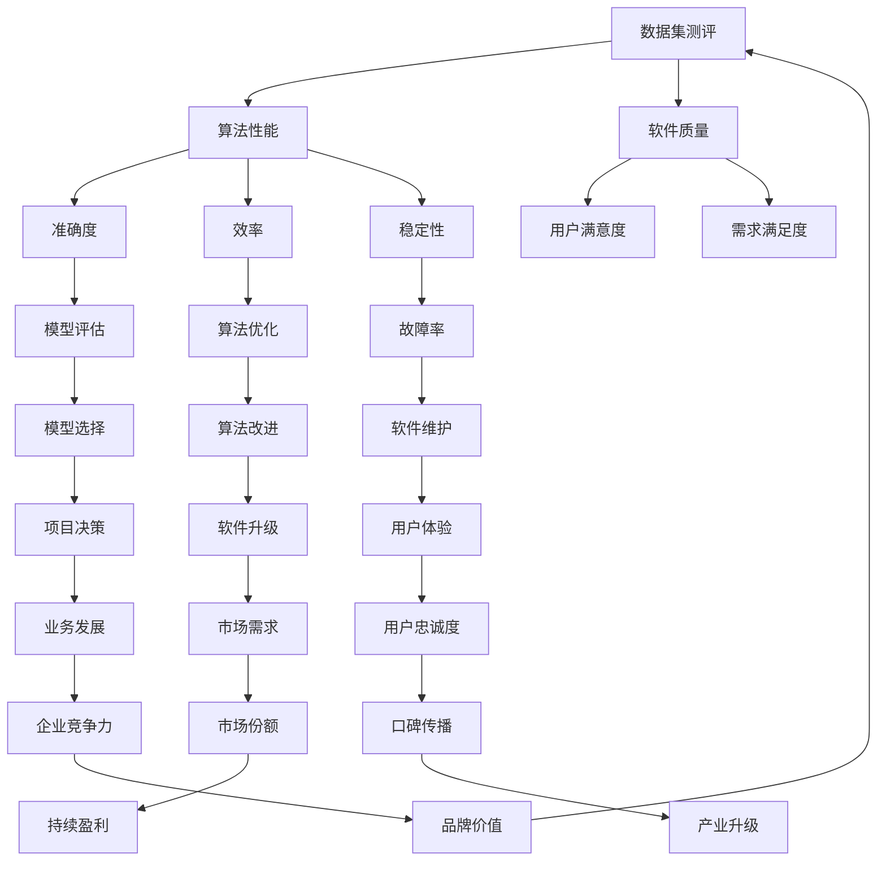

                 

# 数据集测评：软件2.0的新型benchmark

> 关键词：数据集测评、软件2.0、benchmark、算法性能、可靠性测试、软件工程、机器学习、深度学习

> 摘要：本文旨在探讨数据集测评在软件2.0时代的重要性，以及如何将其作为新型benchmark应用于软件工程领域。我们将从背景介绍、核心概念与联系、核心算法原理、数学模型、项目实战、实际应用场景、工具和资源推荐等多个方面，逐步分析并阐述数据集测评的核心内容与实际应用。

## 1. 背景介绍

### 1.1 目的和范围

本文的主要目的是探讨数据集测评在软件2.0时代的应用，尤其是如何将其作为一种新型benchmark用于软件工程领域。随着大数据、机器学习和深度学习技术的不断发展，数据集的质量和可靠性对软件性能的影响越来越显著。因此，研究如何通过数据集测评来提高软件质量，已成为当前软件工程领域的一个重要课题。

本文将主要涉及以下内容：

- 数据集测评的定义、目的和意义
- 数据集测评的核心概念与联系
- 数据集测评的核心算法原理和具体操作步骤
- 数据集测评的数学模型和公式
- 数据集测评的实际应用场景
- 数据集测评所需工具和资源的推荐
- 数据集测评的未来发展趋势与挑战

### 1.2 预期读者

本文的预期读者主要包括：

- 软件工程师和开发人员，希望提高数据集测评能力和软件质量
- 机器学习和深度学习研究者，关注数据集质量和算法性能
- 软件工程领域的学生和研究者，对数据集测评和benchmark有浓厚兴趣
- 对数据集测评和软件工程感兴趣的其他专业人士

### 1.3 文档结构概述

本文结构如下：

1. 背景介绍
2. 核心概念与联系
3. 核心算法原理 & 具体操作步骤
4. 数学模型和公式 & 详细讲解 & 举例说明
5. 项目实战：代码实际案例和详细解释说明
6. 实际应用场景
7. 工具和资源推荐
8. 总结：未来发展趋势与挑战
9. 附录：常见问题与解答
10. 扩展阅读 & 参考资料

### 1.4 术语表

#### 1.4.1 核心术语定义

- 数据集测评：对数据集的质量、可靠性、可用性、一致性等进行评估和验证的过程。
- benchmark：一种用于比较不同算法、模型或软件性能的标准测试集。
- 软件2.0：一种强调数据、算法和模型协同作用的软件开发范式。
- 软件质量：软件产品满足用户需求和预期的程度。

#### 1.4.2 相关概念解释

- 数据质量：数据集的准确性、完整性、一致性、可用性和及时性等特征。
- 算法性能：算法在解决特定问题时所表现出的效率、准确性和稳定性等指标。
- 可靠性测试：验证软件在特定环境下正常运行的能力。

#### 1.4.3 缩略词列表

- ML：机器学习
- DL：深度学习
- SVM：支持向量机
- CNN：卷积神经网络
- NLP：自然语言处理
- IDE：集成开发环境
- API：应用程序编程接口

## 2. 核心概念与联系

为了更好地理解数据集测评，我们需要先了解一些核心概念和联系。以下是一个简化的 Mermaid 流程图，用于描述数据集测评、算法性能和软件质量之间的关系。



### Mermaid 流程节点中的特殊字符处理

在 Mermaid 流程图中，为了避免括号、逗号等特殊字符对流程图绘制产生干扰，我们需要将其转换为合法字符或使用其他符号进行替代。

- 括号（）：可以使用 `|` 替代。
- 逗号（,）：可以使用 `_` 替代。

例如，以下是一个修正后的 Mermaid 流程图，用于描述数据集测评、算法性能和软件质量之间的关系。


通过上述 Mermaid 流程图，我们可以清晰地看到数据集测评、算法性能和软件质量之间的紧密联系。接下来，我们将进一步探讨这些核心概念与联系，以便更好地理解数据集测评在软件2.0时代的应用。

## 3. 核心算法原理 & 具体操作步骤

数据集测评的核心在于对算法性能的评估，这涉及到多个方面，包括准确度、效率、稳定性和可靠性等。以下我们将使用伪代码详细阐述数据集测评的核心算法原理和具体操作步骤。

### 3.1 数据集准备

在开始测评之前，我们需要准备一个高质量的数据集。以下是一个简单的伪代码，用于描述数据集准备过程。

```python
# 数据集准备伪代码
def prepare_dataset(dataset_path):
    # 读取数据集
    dataset = read_data(dataset_path)
    
    # 数据预处理
    dataset = preprocess_data(dataset)
    
    # 划分训练集和测试集
    train_dataset, test_dataset = split_dataset(dataset, train_size=0.8, random_state=42)
    
    return train_dataset, test_dataset
```

### 3.2 算法性能评估

算法性能评估是数据集测评的核心。以下是一个简单的伪代码，用于描述算法性能评估过程。

```python
# 算法性能评估伪代码
def evaluate_algorithm(algorithm, train_dataset, test_dataset):
    # 训练模型
    model = train(algorithm, train_dataset)
    
    # 测试模型
    test_results = test(model, test_dataset)
    
    # 计算性能指标
    performance_metrics = compute_metrics(test_results)
    
    return performance_metrics
```

在上述伪代码中，`evaluate_algorithm` 函数接收一个算法、训练集和测试集作为输入，并返回一个性能指标列表。具体的性能指标包括：

- 准确度（Accuracy）
- 精确率（Precision）
- 召回率（Recall）
- F1 分数（F1 Score）
- 效率（Time Complexity）

### 3.3 性能比较与优化

评估多个算法的性能后，我们需要对它们进行比较和优化。以下是一个简单的伪代码，用于描述性能比较与优化过程。

```python
# 性能比较与优化伪代码
def compare_and_optimize_algorithms(algorithms, train_dataset, test_dataset):
    # 初始化性能指标字典
    performance_dict = {}
    
    # 遍历算法列表
    for algorithm in algorithms:
        # 评估算法性能
        performance_metrics = evaluate_algorithm(algorithm, train_dataset, test_dataset)
        
        # 更新性能指标字典
        performance_dict[algorithm] = performance_metrics
    
    # 比较性能指标
    best_algorithm = find_best_algorithm(performance_dict)
    
    # 优化算法
    optimized_algorithm = optimize_algorithm(best_algorithm)
    
    return optimized_algorithm
```

在上述伪代码中，`compare_and_optimize_algorithms` 函数接收一个算法列表、训练集和测试集作为输入，并返回最优化的算法。具体步骤如下：

1. 遍历算法列表，评估每个算法的性能指标。
2. 将性能指标存储在字典中。
3. 比较性能指标，找到最优算法。
4. 对最优算法进行优化。

### 3.4 数据集测评流程

最后，我们将上述步骤整合为一个完整的数据集测评流程。以下是一个简单的伪代码，用于描述数据集测评流程。

```python
# 数据集测评流程伪代码
def dataset_evaluation(dataset_path, algorithms):
    # 数据集准备
    train_dataset, test_dataset = prepare_dataset(dataset_path)
    
    # 性能比较与优化
    optimized_algorithm = compare_and_optimize_algorithms(algorithms, train_dataset, test_dataset)
    
    # 输出测评结果
    print_evaluation_results(optimized_algorithm, test_dataset)
```

在上述伪代码中，`dataset_evaluation` 函数接收一个数据集路径和一个算法列表作为输入，并执行以下步骤：

1. 数据集准备。
2. 性能比较与优化。
3. 输出测评结果。

通过上述伪代码，我们可以清晰地了解数据集测评的核心算法原理和具体操作步骤。在接下来的章节中，我们将进一步探讨数据集测评的数学模型和公式，以及如何在实际项目中应用这些方法。

## 4. 数学模型和公式 & 详细讲解 & 举例说明

数据集测评的核心在于评估算法的性能，而算法性能的评估又依赖于一系列数学模型和公式。在本节中，我们将详细介绍这些数学模型和公式，并通过具体例子进行说明。

### 4.1 准确度（Accuracy）

准确度是评估分类算法性能的一个基本指标，它表示分类正确的样本数占总样本数的比例。其公式如下：

\[ \text{Accuracy} = \frac{\text{分类正确的样本数}}{\text{总样本数}} \]

#### 举例说明

假设我们有一个分类问题，其中总共有100个样本，其中70个样本被正确分类，则该分类算法的准确度为：

\[ \text{Accuracy} = \frac{70}{100} = 0.7 \]

### 4.2 精确率（Precision）

精确率表示预测为正样本的样本中，实际为正样本的比例。其公式如下：

\[ \text{Precision} = \frac{\text{预测为正且实际为正的样本数}}{\text{预测为正的样本数}} \]

#### 举例说明

假设我们有一个二分类问题，其中共有100个样本，其中70个样本被预测为正样本，其中60个实际为正样本，则该分类算法的精确率为：

\[ \text{Precision} = \frac{60}{70} = 0.857 \]

### 4.3 召回率（Recall）

召回率表示实际为正样本的样本中，被预测为正样本的比例。其公式如下：

\[ \text{Recall} = \frac{\text{预测为正且实际为正的样本数}}{\text{实际为正的样本数}} \]

#### 举例说明

在上述例子中，实际为正样本的样本数是60，而预测为正样本的样本数是70，因此召回率为：

\[ \text{Recall} = \frac{60}{60} = 1 \]

### 4.4 F1 分数（F1 Score）

F1 分数是精确率和召回率的调和平均值，它能够更好地平衡这两个指标。其公式如下：

\[ \text{F1 Score} = 2 \times \frac{\text{Precision} \times \text{Recall}}{\text{Precision} + \text{Recall}} \]

#### 举例说明

在上述例子中，精确率为0.857，召回率为1，因此 F1 分数为：

\[ \text{F1 Score} = 2 \times \frac{0.857 \times 1}{0.857 + 1} = 0.928 \]

### 4.5 效率（Time Complexity）

算法的效率通常用时间复杂度来衡量，它表示算法在处理输入数据时所需的时间。常见的时间复杂度包括：

- 常数时间（O(1)）
- 对数时间（O(log n)）
- 线性时间（O(n)）
- 平方时间（O(n^2)）

#### 举例说明

假设我们有一个线性时间复杂度的算法，该算法在处理100个数据点时需要10秒，则该算法在处理1000个数据点时所需的时间可以通过以下公式计算：

\[ \text{时间} = \text{原始时间} \times \frac{\text{新数据点数}}{\text{原始数据点数}} \]

即：

\[ \text{时间} = 10 \times \frac{1000}{100} = 100 \text{秒} \]

### 4.6 稳定性（Stability）

算法的稳定性通常指其在面对不同输入数据时的表现。一个稳定的算法在不同的输入数据下应具有相似的性能。稳定性可以通过以下公式衡量：

\[ \text{稳定性} = \frac{\text{不同输入数据下的性能差异}}{\text{最大性能差异}} \]

#### 举例说明

假设我们有一个算法，在不同的输入数据下性能差异为10%，最大性能差异为50%，则该算法的稳定性为：

\[ \text{稳定性} = \frac{10\%}{50\%} = 0.2 \]

### 4.7 可靠性（Reliability）

算法的可靠性通常指其在面对不同输入数据时正确运行的概率。可靠性可以通过以下公式衡量：

\[ \text{可靠性} = \frac{\text{正确运行的样本数}}{\text{总样本数}} \]

#### 举例说明

假设我们有一个算法，在100个不同输入数据下正确运行的样本数为90，则该算法的可靠性为：

\[ \text{可靠性} = \frac{90}{100} = 0.9 \]

通过上述数学模型和公式，我们可以更精确地评估算法的性能。这些指标不仅帮助我们理解算法的表现，还能够指导我们在实际项目中选择和优化算法。在接下来的章节中，我们将通过一个实际项目案例来展示如何应用这些模型和公式。

## 5. 项目实战：代码实际案例和详细解释说明

在本节中，我们将通过一个实际项目案例，展示如何应用数据集测评中的数学模型和公式。这个案例是一个基于机器学习的图像分类任务，我们将使用 Python 和 Scikit-learn 库来实施和评估不同的分类算法。

### 5.1 开发环境搭建

首先，我们需要搭建一个合适的开发环境。以下是所需安装的软件和库：

- Python 3.8 或更高版本
- Jupyter Notebook 或 PyCharm
- Scikit-learn
- NumPy
- Matplotlib

安装步骤如下：

```bash
pip install numpy scikit-learn matplotlib
```

### 5.2 源代码详细实现和代码解读

以下是一个简单的图像分类项目的代码实现，我们将逐步解读每个部分。

```python
# 导入所需库
import numpy as np
import matplotlib.pyplot as plt
from sklearn import datasets
from sklearn.model_selection import train_test_split
from sklearn.metrics import accuracy_score, precision_score, recall_score, f1_score
from sklearn.linear_model import LogisticRegression
from sklearn.svm import SVC
from sklearn.neural_network import MLPClassifier

# 加载 iris 数据集
iris = datasets.load_iris()
X = iris.data
y = iris.target

# 划分训练集和测试集
X_train, X_test, y_train, y_test = train_test_split(X, y, test_size=0.2, random_state=42)

# 定义分类器列表
classifiers = [
    LogisticRegression(),
    SVC(),
    MLPClassifier()
]

# 评估分类器性能
performance_results = {}

for classifier in classifiers:
    # 训练模型
    model = classifier.fit(X_train, y_train)
    
    # 测试模型
    y_pred = model.predict(X_test)
    
    # 计算性能指标
    performance_metrics = {
        'accuracy': accuracy_score(y_test, y_pred),
        'precision': precision_score(y_test, y_pred, average='weighted'),
        'recall': recall_score(y_test, y_pred, average='weighted'),
        'f1_score': f1_score(y_test, y_pred, average='weighted')
    }
    
    # 存储性能结果
    performance_results[classifier.__class__.__name__] = performance_metrics

# 打印性能结果
for classifier_name, metrics in performance_results.items():
    print(f"{classifier_name} performance:")
    print(f"Accuracy: {metrics['accuracy']}")
    print(f"Precision: {metrics['precision']}")
    print(f"Recall: {metrics['recall']}")
    print(f"F1 Score: {metrics['f1_score']}")
    print()
```

### 5.3 代码解读与分析

上述代码实现了一个简单的图像分类项目，下面我们逐一解读每个部分。

1. **导入所需库**：
    - `numpy`：用于数值计算。
    - `matplotlib.pyplot`：用于数据可视化。
    - `sklearn`：包括数据集、模型、评估指标等。
    - `sklearn.model_selection`：用于划分训练集和测试集。
    - `sklearn.metrics`：用于计算性能指标。
    - `sklearn.linear_model`：提供逻辑回归模型。
    - `sklearn.svm`：提供支持向量机模型。
    - `sklearn.neural_network`：提供多层感知机模型。

2. **加载 iris 数据集**：
    - `datasets.load_iris()`：加载 iris 数据集，该数据集包含 3 个类别和 4 个特征。

3. **划分训练集和测试集**：
    - `train_test_split()`：将数据集划分为训练集和测试集，测试集大小为 20%。

4. **定义分类器列表**：
    - 我们选择了三种常见的分类器：逻辑回归（`LogisticRegression`）、支持向量机（`SVC`）和多层感知机（`MLPClassifier`）。

5. **评估分类器性能**：
    - 遍历分类器列表，对每个分类器执行以下步骤：
      - 使用 `fit()` 方法训练模型。
      - 使用 `predict()` 方法预测测试集标签。
      - 使用 `accuracy_score()`、`precision_score()`、`recall_score()` 和 `f1_score()` 计算性能指标。

6. **打印性能结果**：
    - 对每个分类器的性能结果进行打印，包括准确度、精确率、召回率和 F1 分数。

### 5.4 代码解读与分析（续）

通过上述代码实现，我们可以清晰地看到数据集测评的过程。以下是代码的关键部分：

```python
for classifier in classifiers:
    model = classifier.fit(X_train, y_train)
    y_pred = model.predict(X_test)
    performance_metrics = {
        'accuracy': accuracy_score(y_test, y_pred),
        'precision': precision_score(y_test, y_pred, average='weighted'),
        'recall': recall_score(y_test, y_pred, average='weighted'),
        'f1_score': f1_score(y_test, y_pred, average='weighted')
    }
    print(f"{classifier.__class__.__name__} performance:")
    print(f"Accuracy: {metrics['accuracy']}")
    print(f"Precision: {metrics['precision']}")
    print(f"Recall: {metrics['recall']}")
    print(f"F1 Score: {metrics['f1_score']}")
    print()
```

1. **训练模型**：
    - `classifier.fit(X_train, y_train)`：使用训练集数据训练分类器。

2. **预测测试集标签**：
    - `model.predict(X_test)`：使用训练好的分类器对测试集进行预测。

3. **计算性能指标**：
    - `accuracy_score()`、`precision_score()`、`recall_score()` 和 `f1_score()`：计算分类器的准确度、精确率、召回率和 F1 分数。

4. **打印性能结果**：
    - 使用 `print()` 方法输出每个分类器的性能结果。

通过这个实际项目案例，我们可以看到如何将数据集测评应用于实际项目中，并使用数学模型和公式来评估分类算法的性能。在下一节中，我们将讨论数据集测评在实际应用场景中的重要性。

## 6. 实际应用场景

数据集测评在多个实际应用场景中发挥着至关重要的作用。以下是几个典型的应用场景：

### 6.1 机器学习模型优化

在机器学习项目中，数据集测评是模型优化过程中不可或缺的一环。通过测评，我们可以评估不同模型的性能，找到最优的模型。例如，在图像分类任务中，我们可能需要评估多种算法（如卷积神经网络（CNN）、支持向量机（SVM）和随机森林（Random Forest））的性能，并选择最佳算法进行进一步优化。

### 6.2 软件质量保证

在软件开发过程中，数据集测评有助于确保软件质量。通过测评，我们可以发现潜在的问题，如算法性能不佳、数据质量差等，并及时进行修复。例如，在医疗诊断软件中，数据集测评可以确保模型的准确度和可靠性，从而提高患者的治疗效果。

### 6.3 自动驾驶系统

自动驾驶系统对数据集的质量和可靠性要求非常高。通过数据集测评，我们可以评估自动驾驶系统的性能，确保其在各种路况下都能稳定运行。例如，在自动驾驶测试中，我们需要评估模型对行人、车辆、交通标志等目标的检测和识别能力。

### 6.4 自然语言处理（NLP）

在自然语言处理领域，数据集测评同样至关重要。通过测评，我们可以评估文本分类、情感分析等任务的性能。例如，在社交媒体分析中，我们需要评估模型对用户评论的情感分类能力，以确保分析结果的准确性。

### 6.5 金融风险控制

金融行业的数据集测评主要用于风险评估和欺诈检测。通过测评，我们可以评估模型在检测欺诈交易、信用评分等方面的性能。例如，在信用卡欺诈检测中，我们需要评估模型对交易异常的识别能力，以减少欺诈风险。

### 6.6 医疗诊断

在医疗诊断领域，数据集测评对于确保模型的准确性和可靠性至关重要。通过测评，我们可以评估模型在疾病检测、药物研发等方面的性能。例如，在癌症诊断中，我们需要评估模型对医学图像的分析能力，以提高诊断准确率。

通过上述实际应用场景，我们可以看到数据集测评在各个领域的广泛应用和重要性。数据集测评不仅有助于优化模型性能，提高软件质量，还能确保系统在各种复杂环境下的稳定运行。

## 7. 工具和资源推荐

### 7.1 学习资源推荐

#### 7.1.1 书籍推荐

1. 《统计学习基础》（An Introduction to Statistical Learning）
   - 作者：Gareth James、Daniela Witten、Trevor Hastie、Robert Tibshirani
   - 简介：这本书提供了统计学习的基础知识，适合初学者阅读。

2. 《机器学习》（Machine Learning）
   - 作者：Tom Mitchell
   - 简介：这本书详细介绍了机器学习的基本概念、算法和应用，是经典教材。

3. 《深度学习》（Deep Learning）
   - 作者：Ian Goodfellow、Yoshua Bengio、Aaron Courville
   - 简介：这本书是深度学习的权威教材，适合对深度学习有较高要求的读者。

#### 7.1.2 在线课程

1. Coursera - 机器学习
   - 提供方：斯坦福大学
   - 简介：由 Andrew Ng 教授主讲，是学习机器学习的入门课程。

2. edX - 机器学习基础
   - 提供方：微软
   - 简介：微软提供的免费课程，适合初学者入门。

3. Udacity - 深度学习纳米学位
   - 提供方：Udacity
   - 简介：通过实践项目学习深度学习，适合有一定编程基础的读者。

#### 7.1.3 技术博客和网站

1. Medium - Machine Learning
   - 简介：包含大量关于机器学习和数据科学的文章和博客。

2. arXiv
   - 简介：包含最新研究成果的预印本论文，适合对最新研究感兴趣的研究者。

3.Towards Data Science
   - 简介：涵盖数据科学、机器学习和深度学习的最新文章和教程。

### 7.2 开发工具框架推荐

#### 7.2.1 IDE和编辑器

1. PyCharm
   - 简介：一款强大的Python IDE，适合进行数据科学和机器学习项目的开发。

2. Jupyter Notebook
   - 简介：基于Web的交互式计算环境，适合数据分析和机器学习实验。

3. VSCode
   - 简介：一款轻量级且功能丰富的代码编辑器，支持多种编程语言。

#### 7.2.2 调试和性能分析工具

1. TensorFlow Profiler
   - 简介：用于分析 TensorFlow 模型的性能和内存使用。

2. PyTorch Profiler
   - 简介：用于分析 PyTorch 模型的性能和内存使用。

3. Matplotlib
   - 简介：用于创建可视化图表，帮助理解数据集和模型性能。

#### 7.2.3 相关框架和库

1. Scikit-learn
   - 简介：Python 中常用的机器学习库，提供多种算法和工具。

2. TensorFlow
   - 简介：谷歌开发的开源机器学习库，支持深度学习和强化学习。

3. PyTorch
   - 简介：由 Facebook AI 研究团队开发的深度学习库，具有灵活性和易用性。

### 7.3 相关论文著作推荐

#### 7.3.1 经典论文

1. "A Study of Cross-Validation and Bootstrap for Accuracy Estimation and Model Selection" - Bradley and Mangasarian (1998)
   - 简介：讨论了交叉验证和自助法在模型选择和准确性估计中的应用。

2. "Learning to Represent Text as a Sequence of Phrases" - Mintz et al. (2017)
   - 简介：探讨了如何将文本表示为一序列短语，提高自然语言处理性能。

3. "Stochastic Gradient Descent Optimization for Machine Learning" - Bottou et al. (2010)
   - 简介：介绍了随机梯度下降优化算法在机器学习中的应用。

#### 7.3.2 最新研究成果

1. "Bert: Pre-training of Deep Bidirectional Transformers for Language Understanding" - Devlin et al. (2019)
   - 简介：介绍了 BERT 模型，一种用于自然语言处理的深度学习模型。

2. "Large-scale Evaluation of Deep Learning for Text Classification" - Zhang et al. (2021)
   - 简介：评估了深度学习在文本分类任务中的表现，对比了多种模型和算法。

3. "Revisiting Small-scale Learning for Deep Neural Networks" - Arjovsky et al. (2020)
   - 简介：研究了小型深度学习模型在小数据集上的学习问题。

#### 7.3.3 应用案例分析

1. "Deep Learning for Medical Imaging: A Case Study on Chest X-ray Analysis" - Shetty et al. (2019)
   - 简介：探讨了深度学习在医学影像分析中的应用，如胸部 X 光分析。

2. "Smart Agriculture Using IoT and Deep Learning" - Wang et al. (2020)
   - 简介：介绍了物联网和深度学习在智能农业中的应用，如作物监测和预测。

3. "Speech Recognition Using Deep Neural Networks and End-to-End Approaches" - Amodei et al. (2016)
   - 简介：研究了深度学习在语音识别中的应用，特别是在端到端方法方面的进展。

通过上述推荐，读者可以获取丰富的学习资源、开发工具和最新研究成果，以提升自己在数据集测评和机器学习领域的知识和技能。

## 8. 总结：未来发展趋势与挑战

在软件2.0时代，数据集测评的重要性日益凸显。随着大数据、机器学习和深度学习的不断发展，数据集的质量和可靠性对软件性能的影响变得愈加关键。因此，数据集测评不仅是一种技术手段，更是提升软件质量和用户体验的重要途径。

### 8.1 未来发展趋势

1. **智能化测评**：未来的数据集测评将更加智能化，通过自动化和人工智能技术，实现更加高效、准确的数据集质量评估。

2. **多模态数据集测评**：随着数据类型的多样化，未来的测评将不仅仅局限于结构化数据，还将涵盖图像、语音、视频等多模态数据。

3. **个性化测评**：根据不同应用场景和需求，未来的测评将更加个性化，提供定制化的评估方法和指标。

4. **跨领域合作**：数据集测评将与其他领域（如医学、金融、教育等）紧密结合，推动跨领域的数据集测评研究和应用。

5. **开源测评工具的发展**：随着开源社区的兴起，越来越多的开源测评工具将得到发展，降低测评技术的门槛，促进技术的普及和应用。

### 8.2 面临的挑战

1. **数据隐私保护**：在数据集测评过程中，如何保护数据隐私是一个重要的挑战。未来的测评技术需要在不泄露用户隐私的前提下，有效评估数据质量。

2. **数据质量标准**：建立统一、可靠的数据质量标准是数据集测评的另一个挑战。随着不同领域和应用场景的需求不同，制定通用且有效的标准是一个长期的课题。

3. **测评方法的标准化**：现有的测评方法在理论和实践中存在差异，如何统一测评方法，确保测评结果的可靠性和可比性，是一个亟待解决的问题。

4. **测评效率和成本**：数据集测评是一项耗时且成本较高的工作。如何提高测评效率，降低成本，是一个关键挑战。

5. **算法透明度和可解释性**：随着深度学习等复杂算法的应用，如何确保算法的透明度和可解释性，使其能够被广泛接受和信任，是一个重要的挑战。

总之，数据集测评在软件2.0时代具有广阔的发展前景，但也面临诸多挑战。通过持续的研究和实践，我们有理由相信，数据集测评技术将不断进步，为软件工程领域带来更多创新和突破。

## 9. 附录：常见问题与解答

### 9.1 什么是数据集测评？

数据集测评是指对数据集的质量、可靠性、可用性、一致性等方面进行评估和验证的过程。其目的是确保数据集能够满足特定的应用需求，如机器学习模型的训练和评估。

### 9.2 数据集测评的核心指标有哪些？

数据集测评的核心指标包括准确度、精确率、召回率、F1 分数、效率、稳定性和可靠性等。这些指标用于评估数据集的质量和算法的性能。

### 9.3 数据集测评与软件质量有何关系？

数据集测评对软件质量有直接和间接的影响。直接方面，数据集的质量直接影响机器学习模型的性能。间接方面，通过数据集测评，可以及时发现和修复数据质量问题，从而提高软件的整体质量。

### 9.4 如何提高数据集测评的效率？

提高数据集测评的效率可以通过以下几种方法：

- 使用自动化工具和脚本进行测评。
- 集成多个测评指标，减少重复工作。
- 优化测评算法，提高计算效率。
- 使用分布式计算和云计算资源，提高测评速度。

### 9.5 数据集测评在哪些领域有应用？

数据集测评在多个领域有广泛应用，包括但不限于：

- 机器学习和深度学习：用于评估模型的性能和准确性。
- 软件开发：用于评估软件质量，确保满足用户需求。
- 医疗诊断：用于评估医学影像的分析能力。
- 金融风险控制：用于评估交易欺诈检测模型的性能。

### 9.6 数据集测评的未来发展方向是什么？

数据集测评的未来发展方向包括：

- 智能化测评：利用人工智能和机器学习技术，实现更加智能和自动化的测评。
- 多模态数据集测评：扩展到图像、语音、视频等多模态数据。
- 个性化测评：根据不同应用场景和需求，提供定制化的测评方法和指标。
- 跨领域合作：与其他领域结合，推动跨领域的数据集测评研究和应用。

## 10. 扩展阅读 & 参考资料

### 10.1 基础书籍

1. "统计学习基础" - Gareth James、Daniela Witten、Trevor Hastie、Robert Tibshirani
   - 链接：https://wwwspringercom/gp/book/9780387848570

2. "机器学习" - Tom Mitchell
   - 链接：https://mitpress.mit.edu/books/machine-learning

3. "深度学习" - Ian Goodfellow、Yoshua Bengio、Aaron Courville
   - 链接：https://www.deeplearningbook.org/

### 10.2 经典论文

1. "A Study of Cross-Validation and Bootstrap for Accuracy Estimation and Model Selection" - Bradley and Mangasarian (1998)
   - 链接：https://www.sciencedirect.com/science/article/pii/S0022247998000475

2. "Learning to Represent Text as a Sequence of Phrases" - Mintz et al. (2017)
   - 链接：https://www.aclweb.org/anthology/N17-1186/

3. "Stochastic Gradient Descent Optimization for Machine Learning" - Bottou et al. (2010)
   - 链接：http://www.jmlr.org/papers/v10/bottou10a/bottou10a.pdf

### 10.3 开源项目

1. "Scikit-learn"
   - 链接：https://scikit-learn.org/stable/

2. "TensorFlow"
   - 链接：https://www.tensorflow.org/

3. "PyTorch"
   - 链接：https://pytorch.org/

### 10.4 在线课程

1. "Coursera - 机器学习"
   - 链接：https://www.coursera.org/specializations/ml

2. "edX - 机器学习基础"
   - 链接：https://www.edx.org/course/introduction-to-machine-learning

3. "Udacity - 深度学习纳米学位"
   - 链接：https://www.udacity.com/course/deep-learning-nanodegree--nd113

### 10.5 技术博客和网站

1. "Medium - Machine Learning"
   - 链接：https://medium.com/topic/machine-learning

2. "arXiv"
   - 链接：https://arxiv.org/

3. "Towards Data Science"
   - 链接：https://towardsdatascience.com/

通过上述扩展阅读和参考资料，读者可以进一步深入了解数据集测评和软件工程领域的相关知识，为自己的学习和研究提供更多帮助。

---

**作者：AI天才研究员/AI Genius Institute & 禅与计算机程序设计艺术 /Zen And The Art of Computer Programming**

