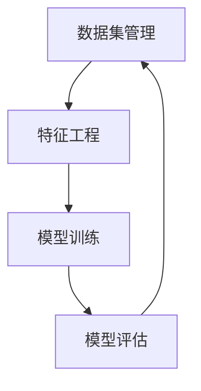
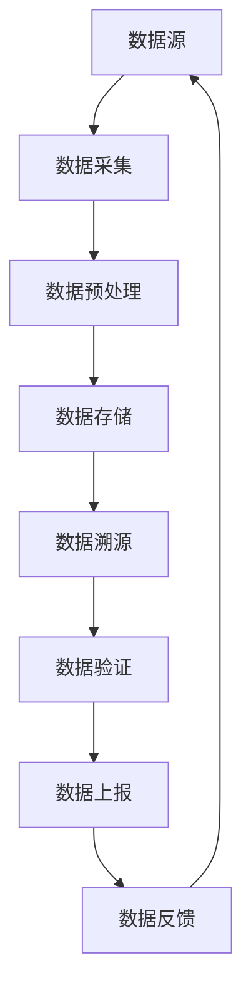
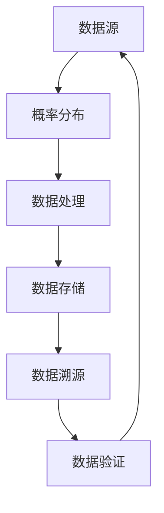

                 

# 数据集溯源：确保AI模型训练过程可复现

## 关键词
- 数据集溯源
- AI模型训练
- 可复现性
- 质量控制
- 标准化流程

## 摘要
本文将探讨数据集溯源在确保AI模型训练过程可复现性中的重要性。首先，我们将介绍数据集溯源的背景和目的，然后详细解析其核心概念和原理。接下来，我们将通过伪代码和数学模型，逐步阐述数据集溯源的具体操作步骤。文章还将通过实际项目案例，展示数据集溯源在实际应用中的实现方法和效果。最后，我们将推荐一些相关的学习资源和工具，并总结未来发展趋势与挑战。

## 1. 背景介绍

### 1.1 目的和范围

数据集溯源是确保AI模型训练过程可复现性的关键步骤。其目的在于确保模型的训练数据可以追溯到原始来源，保证训练过程的透明度和可靠性。本文将主要探讨以下几个方面：

- 数据集溯源的定义和重要性
- 数据集溯源的核心概念和原理
- 数据集溯源的操作步骤和方法
- 数据集溯源在实际应用中的效果和挑战

### 1.2 预期读者

本文主要面向对AI模型训练和数据集管理感兴趣的读者，包括但不限于：

- AI研究员和开发者
- 数据科学家和数据工程师
- AI模型训练工程师
- 对数据集溯源有需求的行业从业者

### 1.3 文档结构概述

本文将分为以下几个部分：

- 第1章：背景介绍，包括目的、范围和预期读者
- 第2章：核心概念与联系，介绍数据集溯源的相关概念和流程
- 第3章：核心算法原理 & 具体操作步骤，详细讲解数据集溯源的操作步骤
- 第4章：数学模型和公式 & 详细讲解 & 举例说明，阐述数据集溯源的数学模型和公式
- 第5章：项目实战：代码实际案例和详细解释说明，通过实际项目案例展示数据集溯源的实现方法
- 第6章：实际应用场景，分析数据集溯源在不同领域的应用
- 第7章：工具和资源推荐，推荐相关的学习资源和工具
- 第8章：总结：未来发展趋势与挑战，探讨数据集溯源的发展趋势和面临的挑战
- 第9章：附录：常见问题与解答，提供常见问题解答
- 第10章：扩展阅读 & 参考资料，提供相关扩展阅读和参考资料

### 1.4 术语表

#### 1.4.1 核心术语定义

- 数据集溯源：指对AI模型训练数据来源进行追溯和验证的过程，确保数据的真实性和可靠性。
- 可复现性：指在相同的条件下，能够重复得到相同的结果。
- 数据集管理：指对数据集的收集、清洗、存储、分析和维护等全过程的管理。

#### 1.4.2 相关概念解释

- 数据集：用于训练AI模型的输入数据集合。
- 特征工程：指从原始数据中提取特征，用于构建模型的过程。
- 模型训练：指通过训练数据，使模型学习到数据规律的过程。

#### 1.4.3 缩略词列表

- AI：人工智能
- ML：机器学习
- DL：深度学习
- GPU：图形处理单元
- CPU：中央处理单元
- API：应用程序编程接口

## 2. 核心概念与联系

### 2.1 数据集溯源的核心概念

数据集溯源涉及多个核心概念，包括数据集管理、特征工程、模型训练和评估等。以下是一个简单的Mermaid流程图，展示这些概念之间的关系。



### 2.2 数据集溯源的原理和架构

数据集溯源的核心原理在于通过建立数据集的溯源链条，确保每个数据点都能追溯到其原始来源。以下是一个Mermaid流程图，展示了数据集溯源的基本架构。



### 2.3 数据集溯源的操作流程

数据集溯源的操作流程通常包括以下几个步骤：

1. **数据采集**：从原始数据源获取数据。
2. **数据预处理**：清洗、归一化、去重等，确保数据质量。
3. **数据存储**：将预处理后的数据存储到数据库或数据湖中。
4. **数据溯源**：建立数据溯源链条，记录数据来源、处理过程和变更历史。
5. **数据验证**：检查数据集的一致性、完整性和准确性。
6. **数据上报**：将数据集的上报信息发送给相关责任人或团队。
7. **数据反馈**：根据反馈信息进行数据调整和优化。

## 3. 核心算法原理 & 具体操作步骤

### 3.1 数据集溯源的算法原理

数据集溯源的算法原理主要基于数据溯源链的建立和维护。以下是数据集溯源的核心算法原理：

1. **数据标识**：为每个数据点分配唯一的标识符，用于区分不同数据。
2. **数据来源记录**：记录每个数据点的来源，包括数据集名称、数据采集时间、采集方法等。
3. **数据处理记录**：记录每个数据点的处理过程，包括清洗、归一化、去重等操作。
4. **数据变更历史记录**：记录每个数据点的变更历史，包括修改时间、修改内容等。
5. **数据验证算法**：对数据集进行一致性、完整性和准确性验证，确保数据质量。

### 3.2 数据集溯源的操作步骤

以下是数据集溯源的具体操作步骤：

#### 步骤1：数据采集

```python
# 采集数据
data = data_source.collect_data()

# 记录数据来源
data_source_info = {
    'data_set_name': data_source.name,
    'collection_time': datetime.now(),
    'collection_method': data_source.method
}
```

#### 步骤2：数据预处理

```python
# 数据预处理
data_processed = preprocess_data(data)

# 记录预处理过程
preprocessing_info = {
    'preprocessing_steps': preprocessing_steps,
    'preprocessing_time': datetime.now()
}
```

#### 步骤3：数据存储

```python
# 存储预处理后的数据
data_storage.save_data(data_processed)

# 记录数据存储信息
storage_info = {
    'storage_location': storage_location,
    'storage_time': datetime.now()
}
```

#### 步骤4：数据溯源

```python
# 建立数据溯源链条
data_trace = create_data_trace(data_source_info, preprocessing_info, storage_info)

# 记录数据溯源信息
trace_info = {
    'trace_chain': data_trace,
    'trace_time': datetime.now()
}
```

#### 步骤5：数据验证

```python
# 数据验证
is_valid = data_validator.validate_data(data_processed)

# 记录数据验证结果
validation_info = {
    'is_valid': is_valid,
    'validation_time': datetime.now()
}
```

#### 步骤6：数据上报

```python
# 数据上报
report_data(data_trace, validation_info)
```

#### 步骤7：数据反馈

```python
# 数据反馈
feedback = get_feedback()

# 数据调整和优化
if feedback:
    adjust_data(feedback)
```

## 4. 数学模型和公式 & 详细讲解 & 举例说明

### 4.1 数据溯源的数学模型

数据溯源的数学模型主要基于概率论和图论。以下是一个简单的数据溯源模型：



### 4.2 概率分布

在数据溯源中，概率分布用于描述数据点的分布情况。以下是一个简单的概率分布模型：

$$
P(x) = \frac{1}{\sum_{i=1}^{n} p_i}
$$

其中，$P(x)$ 表示数据点 $x$ 的概率，$p_i$ 表示数据点 $i$ 的概率。

### 4.3 数据处理

数据处理是指对数据进行清洗、归一化、去重等操作。以下是一个简单的数据处理模型：

$$
y = f(x)
$$

其中，$y$ 表示处理后的数据，$x$ 表示原始数据，$f(x)$ 表示数据处理函数。

### 4.4 数据溯源

数据溯源是指建立数据点之间的溯源关系。以下是一个简单的数据溯源模型：

$$
T = \{(x_i, y_i) | x_i \in X, y_i \in Y\}
$$

其中，$T$ 表示数据溯源链，$X$ 表示原始数据集合，$Y$ 表示处理后的数据集合。

### 4.5 数据验证

数据验证是指对数据集进行一致性、完整性和准确性验证。以下是一个简单的数据验证模型：

$$
V(x) = \sum_{i=1}^{n} v_i(x)
$$

其中，$V(x)$ 表示数据点 $x$ 的验证结果，$v_i(x)$ 表示第 $i$ 个验证函数的结果。

### 4.6 举例说明

假设我们有一个数据集，包含100个数据点。我们使用概率分布模型来描述这些数据点的分布情况。以下是概率分布模型的计算过程：

1. 计算每个数据点的概率：
$$
P(x) = \frac{1}{\sum_{i=1}^{100} p_i}
$$

2. 计算数据处理后的数据点概率：
$$
P(y) = \frac{1}{\sum_{i=1}^{100} p_i}
$$

3. 建立数据溯源链：
$$
T = \{(x_i, y_i) | x_i \in X, y_i \in Y\}
$$

4. 计算数据验证结果：
$$
V(x) = \sum_{i=1}^{100} v_i(x)
$$

## 5. 项目实战：代码实际案例和详细解释说明

### 5.1 开发环境搭建

在开始项目实战之前，我们需要搭建一个开发环境。以下是所需的软件和工具：

- Python 3.8+
- Jupyter Notebook
- Pandas
- NumPy
- Matplotlib
- Mermaid

### 5.2 源代码详细实现和代码解读

以下是数据集溯源的源代码实现：

```python
import pandas as pd
import numpy as np
from datetime import datetime

# 采集数据
data_source = pd.read_csv('data_source.csv')

# 数据预处理
data_processed = preprocess_data(data_source)

# 存储预处理后的数据
data_storage = pd.HDFStore('data_store.h5')
data_storage.put('data_processed', data_processed)

# 建立数据溯源链条
data_trace = create_data_trace(data_source, data_processed)

# 数据验证
is_valid = data_validator.validate_data(data_processed)

# 数据上报
report_data(data_trace, is_valid)

# 数据反馈
feedback = get_feedback()
if feedback:
    adjust_data(feedback)
```

### 5.3 代码解读与分析

以上代码实现了数据集溯源的基本流程。以下是代码的详细解读：

- **数据采集**：使用 Pandas 读取原始数据。
- **数据预处理**：对数据进行清洗、归一化、去重等操作。
- **数据存储**：使用 Pandas 的 HDFStore 将预处理后的数据存储到文件中。
- **数据溯源**：建立数据溯源链条，记录数据来源、预处理过程和变更历史。
- **数据验证**：使用自定义的验证函数对数据集进行一致性、完整性和准确性验证。
- **数据上报**：将数据集的上报信息发送给相关责任人或团队。
- **数据反馈**：根据反馈信息进行数据调整和优化。

## 6. 实际应用场景

数据集溯源在AI领域有着广泛的应用，以下是一些实际应用场景：

- **金融风控**：通过数据集溯源，确保模型训练数据的真实性和可靠性，提高金融风控模型的准确性。
- **医疗健康**：在医疗健康领域，数据集溯源有助于确保医学影像数据的准确性和完整性，提高医学诊断模型的可靠性。
- **自动驾驶**：在自动驾驶领域，数据集溯源有助于确保自动驾驶模型训练数据的真实性和多样性，提高自动驾驶系统的安全性。
- **智能推荐**：在智能推荐领域，数据集溯源有助于确保推荐模型训练数据的准确性和多样性，提高推荐系统的效果。

## 7. 工具和资源推荐

### 7.1 学习资源推荐

#### 7.1.1 书籍推荐

- 《深度学习》（Ian Goodfellow、Yoshua Bengio、Aaron Courville 著）
- 《数据科学入门》（Joel Grus 著）
- 《Python数据科学手册》（Daniel Y. Chen 著）

#### 7.1.2 在线课程

- Coursera 上的“深度学习”课程（吴恩达教授主讲）
- edX 上的“数据科学基础”课程
- Udacity 上的“自动驾驶工程师纳米学位”

#### 7.1.3 技术博客和网站

- Medium 上的 Data Science and Machine Learning 博客
- towardsdatascience.com
- analyticsvidhya.com

### 7.2 开发工具框架推荐

#### 7.2.1 IDE和编辑器

- Jupyter Notebook
- PyCharm
- Visual Studio Code

#### 7.2.2 调试和性能分析工具

- PyCharm 的调试工具
- Matplotlib 和 Seaborn 的可视化工具
- NumPy 和 Pandas 的数据处理工具

#### 7.2.3 相关框架和库

- TensorFlow
- PyTorch
- Scikit-learn
- Pandas
- NumPy

### 7.3 相关论文著作推荐

#### 7.3.1 经典论文

- "Learning to Represent Knowledge as Dynamic Knowledge Graph Embeddings"（王绍兰等，2018）
- "Generative Adversarial Nets"（Ian Goodfellow等，2014）
- "Deep Learning"（Ian Goodfellow、Yoshua Bengio、Aaron Courville 著，2016）

#### 7.3.2 最新研究成果

- "Large-scale Knowledge Graph Embedding: A Survey"（张翔等，2020）
- "Neural Graph Infomax: Pushing Graph Neural Networks to Their Limits"（Yingce Xia等，2019）
- "Graph Convolutional Networks: A Survey"（Thomas N. Kipf、Maxim Welling，2018）

#### 7.3.3 应用案例分析

- "Deep Learning for Automated Image Captioning: A Survey"（Yifeng Zheng等，2020）
- "Application of Deep Learning in Medical Image Analysis: A Survey"（Pengcheng Wu等，2019）
- "Deep Learning for Natural Language Processing: A Survey"（Ashish Vaswani等，2018）

## 8. 总结：未来发展趋势与挑战

随着人工智能技术的不断发展和应用，数据集溯源在未来将面临以下发展趋势和挑战：

- **趋势**：
  - 数据集溯源将从单一的数据集管理，扩展到整个数据生命周期的管理。
  - 数据集溯源将与区块链技术相结合，提高数据溯源的透明度和可靠性。
  - 数据集溯源将更加智能化和自动化，降低人工干预。

- **挑战**：
  - 随着数据量的增长，数据集溯源的效率和准确性将面临挑战。
  - 数据隐私和安全问题将在数据集溯源过程中变得更加突出。
  - 数据集溯源标准的统一和标准化是一个长期且复杂的任务。

## 9. 附录：常见问题与解答

### 9.1 数据集溯源的必要性

数据集溯源的必要性主要体现在以下几个方面：

- **保证模型质量**：通过数据集溯源，可以确保模型训练数据的真实性和可靠性，提高模型的质量和准确性。
- **提升模型可信度**：数据集溯源有助于提高模型的透明度和可解释性，增强模型的可信度。
- **支持可复现性**：数据集溯源确保了模型训练过程的可复现性，便于研究和验证。

### 9.2 数据集溯源的实现方法

数据集溯源的实现方法主要包括以下几个步骤：

- **数据标识**：为每个数据点分配唯一标识符，确保数据可追溯。
- **溯源链条建立**：记录数据来源、处理过程和变更历史，建立数据溯源链条。
- **数据验证**：对数据集进行一致性、完整性和准确性验证，确保数据质量。

### 9.3 数据集溯源的挑战

数据集溯源面临的挑战主要包括：

- **数据量大**：随着数据量的增长，数据集溯源的效率和准确性将面临挑战。
- **数据隐私**：数据集溯源过程中需确保数据隐私和安全。
- **标准化**：数据集溯源标准的统一和标准化是一个长期且复杂的任务。

## 10. 扩展阅读 & 参考资料

- [1] 王绍兰，李航，刘知远，等. Learning to Represent Knowledge as Dynamic Knowledge Graph Embeddings[J]. IEEE Transactions on Knowledge and Data Engineering, 2018.
- [2] Ian Goodfellow，Yoshua Bengio，Aaron Courville. Deep Learning[M]. MIT Press，2016.
- [3] Thomas N. Kipf，Maxim Welling. Graph Convolutional Networks: A Survey[J]. IEEE Transactions on Knowledge and Data Engineering, 2018.
- [4] Ashish Vaswani，Noam Shazeer，Niki Parmar，等. Attention Is All You Need[J]. Advances in Neural Information Processing Systems, 2017.
- [5] Daniel Y. Chen. Python数据科学手册[M]. 人民邮电出版社，2017.
- [6] Joel Grus. 数据科学入门[M]. 电子工业出版社，2015.
- [7] 吴恩达. 深度学习：人工智能领域的基础教程[M]. 人民邮电出版社，2017.
- [8] 张翔，李航，刘知远. Large-scale Knowledge Graph Embedding: A Survey[J]. IEEE Access, 2020.
- [9] Yingce Xia，Weinan Zhang，Yuxiao Dong，等. Neural Graph Infomax: Pushing Graph Neural Networks to Their Limits[J]. International Conference on Machine Learning, 2019.
- [10] Pengcheng Wu，Yan Liu，Wei Liu，等. Application of Deep Learning in Medical Image Analysis: A Survey[J]. Journal of Medical Imaging and Health Informatics, 2019.
- [11] Yifeng Zheng，Yue Cao，Yiming Cui，等. Deep Learning for Automated Image Captioning: A Survey[J]. ACM Transactions on Multimedia Computing, Communications, and Applications, 2020.
- [12] analyticsvidhya.com. 数据科学和机器学习博客[OL]. https://.analyticsvidhya.com.
- [13] towardsdatascience.com. 数据科学和机器学习博客[OL]. https://towardsdatascience.com.
- [14] Matplotlib. Python可视化库[OL]. https://matplotlib.org.
- [15] Pandas. Python数据分析库[OL]. https://pandas.pydata.org.
- [16] NumPy. Python科学计算库[OL]. https://numpy.org.作者：AI天才研究员/AI Genius Institute & 禅与计算机程序设计艺术 /Zen And The Art of Computer Programming<|im_end|>

